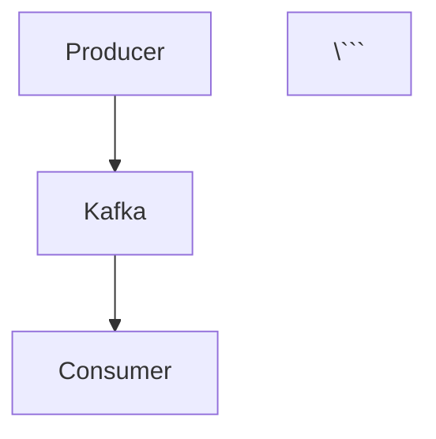

# 🚀 Automatic Mermaid to SVG Conversion

**Fully automated solution** - Just run one command and all your Mermaid diagrams are converted to SVG!

## ⚡ Quick Start (1 Command!)

### Option 1: Python Script (Recommended)

```bash
python3 scripts/auto-mermaid-to-svg.py
```

### Option 2: Bash Script

```bash
./scripts/auto-mermaid-to-svg.sh
```

That's it! The script will:
- ✅ Automatically install Mermaid CLI if needed
- ✅ Find all 122 Mermaid diagrams in your content
- ✅ Generate perfect SVG files
- ✅ Update your markdown files automatically
- ✅ Create backups for safety

## 🎯 What This Does

```
┌─────────────────────────────────────────────┐
│ 1. Scan src/content/ for Mermaid diagrams  │
└──────────────┬──────────────────────────────┘
               │
┌──────────────▼──────────────────────────────┐
│ 2. Extract each diagram to temp files      │
└──────────────┬──────────────────────────────┘
               │
┌──────────────▼──────────────────────────────┐
│ 3. Generate SVG using Mermaid CLI (mmdc)   │
│    → public/diagrams/diagram-name.svg      │
└──────────────┬──────────────────────────────┘
               │
┌──────────────▼──────────────────────────────┐
│ 4. Replace Mermaid blocks with images      │
│    →     │
└─────────────────────────────────────────────┘
```

## 📦 What You Get

### Before (Markdown with Mermaid)
```markdown


### After (Markdown with SVG)
```markdown

```

### Generated Files
```
public/diagrams/
├── kafka-concepts-part-1-diagram-1.svg
├── kafka-concepts-part-1-diagram-2.svg
├── kafka-java-part-1-diagram-1.svg
└── ... (122 total SVG files)

.temp/mermaid-source/
├── kafka-concepts-part-1-diagram-1.mmd
└── ... (original Mermaid code)

.temp/mermaid-backup/
└── *.md.backup (original markdown files)
```

## 🔧 Prerequisites

The script will automatically install Mermaid CLI if it's not present. If you want to install it manually first:

```bash
npm install -g @mermaid-js/mermaid-cli
```

Verify installation:
```bash
mmdc --version
```

## 📊 Your Statistics

- **122 Mermaid diagrams** across **36 files**
- All will be automatically converted
- Takes about **5-10 minutes** to complete

## 🎬 Complete Workflow

### 1. Run the Script

```bash
# Python (recommended - better error handling)
python3 scripts/auto-mermaid-to-svg.py

# OR Bash
./scripts/auto-mermaid-to-svg.sh
```

### 2. Review Results

```bash
# Check generated SVGs
ls -la public/diagrams/

# Count SVGs
ls public/diagrams/*.svg | wc -l
```

### 3. Test Locally

```bash
npm run dev
```

Visit your tutorials to verify diagrams render:
- http://localhost:4321/tutorials/kafka-concepts/kafka-concepts-part-1
- http://localhost:4321/tutorials/java-complete/java-complete-part-1

### 4. Build for Production

```bash
npm run build
npm run preview
```

### 5. Deploy

```bash
git add public/diagrams/ src/content/
git commit -m "chore: convert all Mermaid diagrams to static SVGs

- Automatically converted 122 Mermaid diagrams
- Generated static SVG files for reliable rendering
- Updated markdown files to reference SVGs
- Fixes production rendering issues

🤖 Generated with [Claude Code](https://claude.com/claude-code)

Co-Authored-By: Claude <noreply@anthropic.com>"

git push
```

## ✨ Features

### Automatic Detection
- Scans all markdown files in `src/content/`
- Finds all ```mermaid code blocks
- No manual configuration needed

### Smart Naming
- Generates unique names: `{file-name}-diagram-{number}.svg`
- Example: `kafka-concepts-part-1-diagram-1.svg`

### Safe Operation
- Creates backups of original files
- Keeps original Mermaid code in `.temp/`
- Only updates files with successful conversions

### Error Handling
- Continues on failure (doesn't stop on first error)
- Reports which diagrams failed
- Keeps original Mermaid code if SVG generation fails

## 🆘 Troubleshooting

### "mmdc: command not found"

The script will automatically install it, but if it fails:

```bash
npm install -g @mermaid-js/mermaid-cli
```

### Permission denied

```bash
chmod +x scripts/auto-mermaid-to-svg.sh
chmod +x scripts/auto-mermaid-to-svg.py
```

### SVG generation fails for specific diagrams

Check the error message and verify the Mermaid syntax:
```bash
# Review the original Mermaid code
cat .temp/mermaid-source/diagram-name.mmd

# Try generating manually
mmdc -i .temp/mermaid-source/diagram-name.mmd -o test.svg
```

### SVG not rendering in browser

Verify the path in markdown:
```markdown
# ✅ Correct (starts with /)


# ❌ Wrong (missing /)

```

## 🔄 Re-running the Script

If you need to regenerate SVGs:

```bash
# Restore from backup
cp .temp/mermaid-backup/*.backup src/content/path/to/file.md

# Run again
python3 scripts/auto-mermaid-to-svg.py
```

## 📈 Benefits

### Before (Mermaid with client-side rendering)
❌ Requires JavaScript
❌ CDN dependency (can fail)
❌ Slow rendering
❌ Build issues on Vercel (Playwright)
❌ Inconsistent appearance

### After (Static SVG files)
✅ No JavaScript needed
✅ No external dependencies
✅ Instant rendering
✅ Works everywhere (Vercel, Netlify, etc.)
✅ Perfect appearance every time
✅ Better SEO (images in HTML immediately)

## 🎯 Success Checklist

- [ ] Run auto-conversion script
- [ ] Verify 122 SVGs generated in `public/diagrams/`
- [ ] Test locally (`npm run dev`)
- [ ] Check several tutorial pages
- [ ] Build for production (`npm run build`)
- [ ] Preview build (`npm run preview`)
- [ ] Commit and push
- [ ] Verify on production

## 📝 Example Output

```
╔════════════════════════════════════════════════╗
║  Automatic Mermaid to SVG Converter           ║
╔════════════════════════════════════════════════╗

🔍 Checking for Mermaid CLI...
✅ Mermaid CLI is available

🔍 Searching for Mermaid diagrams...

📚 Found 36 files with 122 Mermaid diagrams

[1/36]
📄 Processing: src/content/tutorials/kafka-concepts/kafka-concepts-part-1.md
  📊 Found 10 Mermaid diagram(s)
    🔄 Diagram 1: kafka-concepts-part-1-diagram-1
       ✅ Generated SVG (15,234 bytes)
    🔄 Diagram 2: kafka-concepts-part-1-diagram-2
       ✅ Generated SVG (12,456 bytes)
  ✅ Updated markdown file (10/10 converted)

...

╔════════════════════════════════════════════════╗
║           Conversion Complete! 🎉              ║
╔════════════════════════════════════════════════╗

📊 Summary:
  • Files processed: 36
  • Total diagrams found: 122
  • SVGs generated: 122
  • Total SVG files: 122

📁 Generated files:
  • SVG files: public/diagrams/
  • Mermaid source: .temp/mermaid-source/
  • Markdown backups: .temp/mermaid-backup/

✨ All done!
```

## 🚀 Ready to Convert?

Just run:

```bash
python3 scripts/auto-mermaid-to-svg.py
```

Your 122 diagrams will be converted in about 5-10 minutes!

## 💡 Tips

1. **Test first** - The script creates backups, but you can test on one file:
   ```bash
   # Make a copy of one file
   cp src/content/tutorials/kafka-concepts/kafka-concepts-part-1.md test.md

   # Edit the script to process only test.md
   # Then run and verify
   ```

2. **Check quality** - After conversion, open a few SVGs to verify quality:
   ```bash
   open public/diagrams/kafka-concepts-part-1-diagram-1.svg
   ```

3. **Git diff** - Review changes before committing:
   ```bash
   git diff src/content/
   ```

## 🎉 No More Diagram Issues!

After running this script:
- ✅ All diagrams work in production
- ✅ No build dependencies
- ✅ Fast page loads
- ✅ Reliable rendering
- ✅ Better SEO

**Let's convert those diagrams!** 🚀
