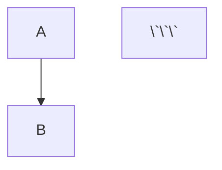
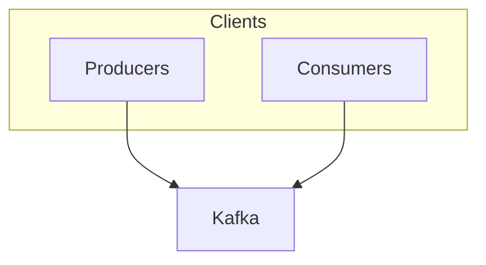
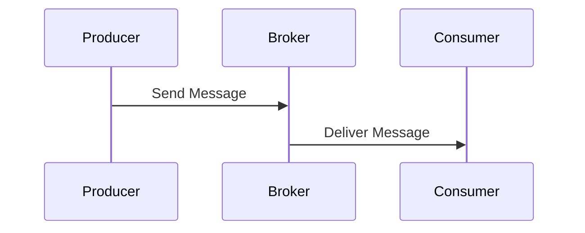
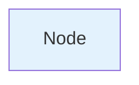
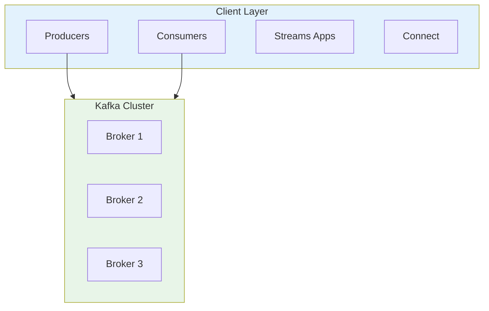

# Mermaid to D2 Migration Guide

## Quick Start

### 1. Install D2

```bash
# macOS/Linux
curl -fsSL https://d2lang.com/install.sh | sh

# Verify installation
d2 --version
```

### 2. Create diagrams directory

```bash
mkdir -p public/diagrams
```

### 3. Generate SVG from D2

```bash
# Convert D2 to SVG
d2 examples/kafka-architecture.d2 public/diagrams/kafka-architecture.svg

# With custom theme
d2 --theme=200 diagram.d2 output.svg
```

### 4. Update Markdown

Replace Mermaid code blocks with image references:

**Before:**
```markdown


**After:**
```markdown

```

---

## Conversion Reference

### Basic Syntax Mapping

| Mermaid | D2 | Description |
|---------|-----|-------------|
| `graph TD` | `direction: down` | Top-to-bottom flowchart |
| `graph LR` | `direction: right` | Left-to-right flowchart |
| `A --> B` | `A -> B` | Simple connection |
| `A[Label]` | `A: Label` | Node with label |
| `A-->|text| B` | `A -> B: text` | Connection with label |
| `A:::className` | `A: { style.fill: "#color" }` | Styling |
| `subgraph Name` | `name: { label: "Name" ... }` | Grouping |

### Flowchart Conversion

**Mermaid:**


**D2:**
```d2
direction: down

clients: {
  label: "Clients"
  producers: Producers
  consumers: Consumers
}

kafka: Kafka

clients.producers -> kafka
clients.consumers -> kafka
```

### Sequence Diagrams

**Mermaid:**


**D2:**
```d2
shape: sequence_diagram

Producer -> Broker: Send Message
Broker -> Consumer: Deliver Message
```

### Styling

**Mermaid:**


**D2:**
```d2
A: Node {
  style.fill: "#e3f2fd"
  style.stroke: "#1976d2"
  style.border-radius: 8
}
```

### Complex Example

**Mermaid (from kafka-concepts-part-1.md):**


**D2 (converted):**
```d2
direction: down

clients: {
  label: "Client Layer"
  style.fill: "#e3f2fd"

  producers: Producers
  consumers: Consumers
  streams: "Streams Apps"
  connect: Connect
}

kafka: {
  label: "Kafka Cluster"
  style.fill: "#e8f5e8"

  broker1: "Broker 1"
  broker2: "Broker 2"
  broker3: "Broker 3"
}

clients.producers -> kafka
clients.consumers -> kafka
clients.streams -> kafka
clients.connect -> kafka
```

---

## Migration Workflow

### Automated Extraction

Extract all Mermaid diagrams from a file:

```bash
# Extract first diagram
awk '/```mermaid/,/```/ {if (!/```/) print}' file.md > diagram1.mermaid

# Extract all diagrams with numbering
i=1; awk '/```mermaid/,/```/ {if (/```mermaid/) {file=sprintf("diagram-%02d.mermaid", i++)} else if (!/```/) print > file}' file.md
```

### Manual Conversion Steps

1. **Extract diagram**
   ```bash
   awk '/```mermaid/,/```/ {if (!/```/) print}' src/content/tutorials/kafka-concepts/kafka-concepts-part-1.md > temp.mermaid
   ```

2. **Convert to D2 syntax** (see reference above)
   - Create `diagram.d2` with converted syntax
   - Test locally: `d2 diagram.d2 output.svg && open output.svg`

3. **Generate SVG**
   ```bash
   d2 diagram.d2 public/diagrams/kafka-architecture.svg
   ```

4. **Update markdown**
   ```bash
   # Replace the mermaid code block with:
   
   ```

### Batch Processing Template

```bash
#!/bin/bash

# Process all Kafka concept diagrams
for part in {1..8}; do
  file="src/content/tutorials/kafka-concepts/kafka-concepts-part-${part}.md"

  if [ -f "$file" ]; then
    echo "Processing $file..."

    # Extract diagrams (you'll need to manually convert to D2)
    awk '/```mermaid/,/```/ {if (!/```/) print}' "$file" > "temp-part-${part}.mermaid"

    # After manual conversion to D2:
    # d2 kafka-part-${part}.d2 public/diagrams/kafka-part-${part}.svg
  fi
done
```

---

## Testing Workflow

1. **Generate SVG locally**
   ```bash
   d2 examples/kafka-architecture.d2 public/diagrams/test.svg
   ```

2. **View in browser**
   ```bash
   # Start dev server
   npm run dev

   # Create test page
   echo '' > src/pages/test-diagram.md

   # Visit http://localhost:4321/test-diagram
   ```

3. **Verify production build**
   ```bash
   npm run build
   npm run preview
   ```

---

## D2 Themes

D2 includes several built-in themes:

```bash
# Neutral (default)
d2 diagram.d2 output.svg

# Cool classics (theme 200)
d2 --theme=200 diagram.d2 output.svg

# Terminal (theme 300)
d2 --theme=300 diagram.d2 output.svg

# List all themes
d2 themes
```

---

## Pro Tips

### 1. Incremental Migration

Don't migrate all 122 diagrams at once:

- **Phase 1:** Kafka tutorials (highest traffic)
- **Phase 2:** Java tutorials
- **Phase 3:** Other tutorials
- **Phase 4:** Articles

### 2. Reusable Components

Create reusable D2 patterns:

```d2
# kafka-common.d2 (import in other diagrams)
broker: {
  label: "Kafka Broker"
  style.fill: "#e8f5e8"
  style.stroke: "#4caf50"
}
```

### 3. Naming Convention

Use consistent naming for generated SVGs:

```
public/diagrams/
  kafka-architecture.svg
  kafka-broker-internals.svg
  kafka-replication-flow.svg
  java-memory-model.svg
  java-gc-process.svg
```

### 4. Git Workflow

```bash
# Generate all SVGs
for d2file in examples/*.d2; do
  filename=$(basename "$d2file" .d2)
  d2 "$d2file" "public/diagrams/${filename}.svg"
done

# Commit SVGs with source D2 files
git add examples/*.d2 public/diagrams/*.svg
git commit -m "chore: convert Mermaid diagrams to D2 with static SVGs"
```

---

## Common Patterns

### Container/Grouping
```d2
cluster: {
  label: "Kafka Cluster"

  broker1: "Broker 1"
  broker2: "Broker 2"
  broker3: "Broker 3"
}
```

### Bidirectional Arrows
```d2
kafka <-> zookeeper
```

### Dashed Lines
```d2
producer -> broker: {
  style.stroke-dash: 3
}
```

### Icons/Shapes
```d2
database: {
  shape: cylinder
  label: "PostgreSQL"
}

queue: {
  shape: queue
  label: "Kafka"
}
```

---

## Troubleshooting

### D2 Installation Issues

```bash
# macOS: permission denied
sudo curl -fsSL https://d2lang.com/install.sh | sh

# Linux: add to PATH
export PATH="$PATH:$HOME/.local/bin"
```

### SVG Not Rendering

Check file paths:
```bash
# Verify SVG exists
ls -la public/diagrams/

# Check markdown image path (must start with /)
  # ✅ Correct
   # ❌ Wrong
```

### Syntax Errors

```bash
# Validate D2 syntax
d2 --debug diagram.d2 output.svg
```

---

## Migration Checklist

- [ ] Install D2 CLI
- [ ] Create `public/diagrams/` directory
- [ ] Extract Mermaid diagrams from priority files
- [ ] Convert to D2 syntax
- [ ] Generate SVG files
- [ ] Update markdown references
- [ ] Test locally (`npm run dev`)
- [ ] Test production build (`npm run build`)
- [ ] Deploy and verify
- [ ] Remove mermaid-init.js references (already done)

---

## Example Files

See the `examples/` directory for converted diagrams:
- `examples/kafka-architecture.d2` → `public/diagrams/kafka-architecture.svg`
- `examples/broker-responsibilities.d2` → `public/diagrams/broker-responsibilities.svg`

Generate them:
```bash
d2 examples/kafka-architecture.d2 public/diagrams/kafka-architecture.svg
d2 examples/broker-responsibilities.d2 public/diagrams/broker-responsibilities.svg
```

---

## Alternative: Excalidraw for Complex Diagrams

For diagrams that are too complex or visual:

1. Visit https://excalidraw.com
2. Recreate diagram visually
3. Export as SVG
4. Save to `public/diagrams/`
5. Reference in markdown

This works great for architecture diagrams that need precise visual layout.

---

## Next Steps

1. **Start small:** Convert one Kafka diagram to test workflow
2. **Automate:** Create script to batch-process related diagrams
3. **Document:** Keep this guide updated with patterns you discover
4. **Deploy:** Push SVGs and updated markdown to production

**No more Mermaid rendering issues!** 🎉
