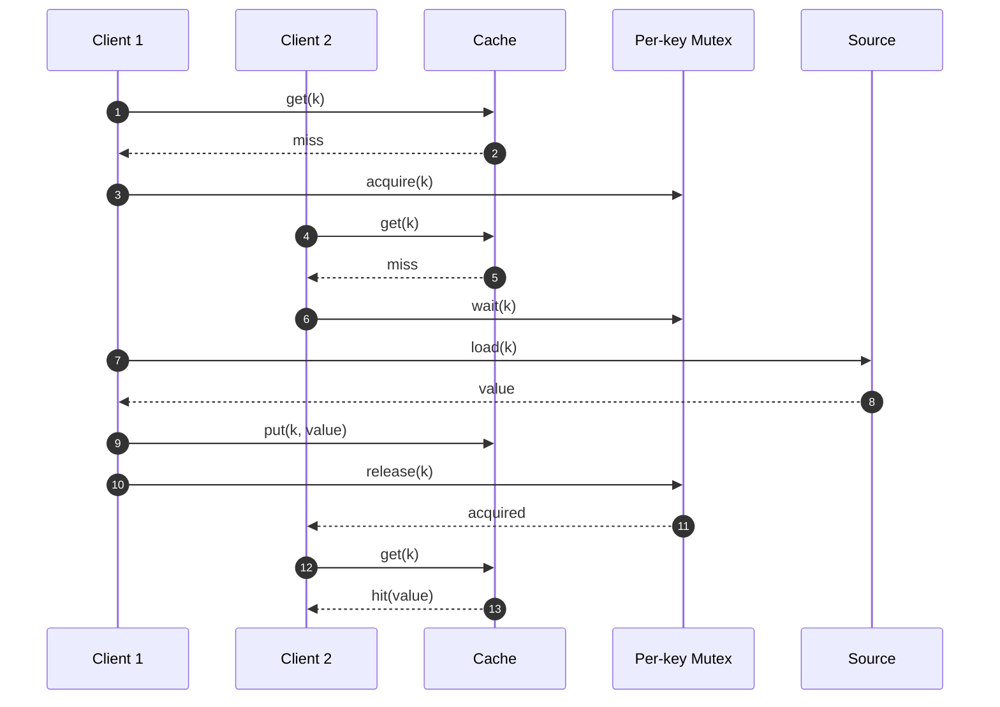
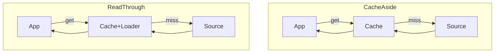
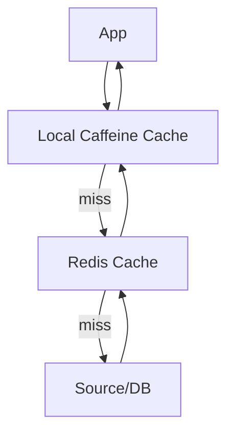

# Kotlin Caching From Scratch: A Complete, Practical Guide

Caching is one of the highest-leverage performance techniques you can apply to a Kotlin application. Done well, it can reduce latency from hundreds of milliseconds to single digits, cut infrastructure cost, and increase reliability during upstream outages. Done poorly, it can return stale data, amplify incidents, or create correctness bugs that are hard to diagnose.

This in-depth tutorial builds caching from first principles in Kotlin and then evolves it into production-grade solutions. You will:

- Understand cache fundamentals and when to cache
- Implement a minimal cache interface and in-memory caches (ConcurrentHashMap and LRU)
- Integrate with coroutines safely (Mutex, single-flight)
- Choose and implement cache patterns (cache-aside, read-through, write-through/back)
- Use Caffeine (high-performance JVM cache)
- Use Redis for distributed caching
- Apply Spring Boot’s caching annotations effectively
- Prevent cache stampede and thundering herd
- Design cache keys, TTLs, and invalidation strategies
- Measure and test cache effectiveness

The examples are pure Kotlin/JVM and compatible with most frameworks (Ktor, Spring, Micronaut, etc.).

## 1) What Is a Cache and When Should You Use It?

- A cache stores the result of expensive operations (database queries, HTTP calls, CPU-heavy computation) so subsequent requests can return fast.
- Caches trade freshness and memory for latency and throughput.

When to cache:
- Expensive and frequently repeated reads
- Data that doesn’t change often (or tolerates slight staleness)
- Hot keys or popular resources

When not to cache:
- Highly dynamic, frequently changing data that must be strictly consistent
- One-off requests, low repetition
- Very memory-limited environments

## 2) Core Concepts You Must Get Right

- Key design: stable, deterministic keys reflecting input parameters and versioning.
- TTL (time-to-live): caps staleness and memory growth; align TTL with data volatility.
- Eviction policy: LRU/LFU/size-based; protect against unbounded growth.
- Concurrency: avoid race conditions and duplicate work (stampede).
- Invalidation: explicit (events, writes) or time-based; prefer simple, deterministic rules.
- Metrics: hit ratio, latency, load failures; observe or it didn’t happen.

### Typical Cache-Aside Flow

```mermaid
flowchart LR
  A[Caller] -->|get(key)| B{Cache};
  B -- "hit" --> C[Return cached value];
  B -- "miss" --> D[Load from source];
  D -->|value| E[Put into cache];
  E --> C;
```

## 3) A Minimal Cache Interface in Kotlin

Start with a simple, framework-agnostic interface. We’ll extend it as we go.

```kotlin
interface Cache<K, V> {
    operator fun get(key: K): V?
    fun put(key: K, value: V)
    fun invalidate(key: K)
    fun clear()
}
```

### Thread-safe In-Memory Cache (ConcurrentHashMap)

```kotlin
import java.util.concurrent.ConcurrentHashMap

class MapCache<K, V> : Cache<K, V> {
    private val map = ConcurrentHashMap<K, V>()

    override fun get(key: K): V? = map[key]
    override fun put(key: K, value: V) { map[key] = value }
    override fun invalidate(key: K) { map.remove(key) }
    override fun clear() { map.clear() }
}
```

Pros: simple, fast, lock-free reads. Cons: no TTL/eviction.

## 4) Adding TTL and Size Limits

Let’s add TTL and maxSize with a lightweight LRU using LinkedHashMap. We’ll synchronize per-instance for simplicity.

```kotlin
import java.util.*
import kotlin.time.Duration
import kotlin.time.Duration.Companion.minutes

class LruCache<K, V>(
    private val maxSize: Int = 10_000,
    private val ttl: Duration = 10.minutes,
) : Cache<K, V> {

    private data class Entry<V>(val value: V, val createdAtMs: Long)

    private val map = object : LinkedHashMap<K, Entry<V>>(16, 0.75f, true) {
        override fun removeEldestEntry(eldest: MutableMap.MutableEntry<K, Entry<V>>?): Boolean {
            return size > maxSize
        }
    }

    @Synchronized
    override operator fun get(key: K): V? {
        val now = System.currentTimeMillis()
        val e = map[key] ?: return null
        return if (now - e.createdAtMs <= ttl.inWholeMilliseconds) e.value else {
            map.remove(key)
            null
        }
    }

    @Synchronized
    override fun put(key: K, value: V) {
        map[key] = Entry(value, System.currentTimeMillis())
    }

    @Synchronized
    override fun invalidate(key: K) { map.remove(key) }

    @Synchronized
    override fun clear() { map.clear() }
}
```

This is a solid starting point for a single-process app.

## 5) Coroutine-Friendly Loading with Single-Flight

Without coordination, a cache miss can trigger multiple concurrent loads for the same key (stampede). Use a per-key Mutex to ensure only one loader runs.

```kotlin
import kotlinx.coroutines.sync.Mutex
import kotlinx.coroutines.sync.withLock

class LoadingCache<K, V>(
    private val delegate: Cache<K, V>,
    private val loader: suspend (K) -> V,
) {
    private val locks = ConcurrentHashMap<K, Mutex>()

    suspend fun getOrLoad(key: K): V {
        delegate[key]?.let { return it }
        val lock = locks.computeIfAbsent(key) { Mutex() }
        return lock.withLock {
            // double-check after acquiring lock
            delegate[key]?.let { return it }
            val v = loader(key)
            delegate.put(key, v)
            v
        }.also {
            // optional cleanup: don’t grow lock map forever
            locks.remove(key)
        }
    }
}
```

### Stampede Protection Illustration



## 6) Cache Patterns You’ll Actually Use

- Cache-aside (lazy): app gets from cache; on miss, loads from source, then populates cache. Simple and flexible.
- Read-through: cache itself knows how to load; app always calls cache. Slightly tighter coupling.
- Write-through: writes go to cache and source synchronously.
- Write-back (write-behind): write to cache now, flush to source later; higher throughput, risk of data loss.

### Cache-Aside vs Read-Through



Pick cache-aside as your default. It’s easier to reason about invalidation.

## 7) Practical Utilities: Memoization for Suspend Functions

Memoize expensive suspend functions with TTL.

```kotlin
import kotlinx.coroutines.sync.Mutex
import kotlinx.coroutines.sync.withLock
import kotlin.time.Duration

fun <K, V> memoizeSuspend(
    ttl: Duration,
    compute: suspend (K) -> V
): suspend (K) -> V {
    data class E<V>(val v: V, val t: Long)
    val cache = ConcurrentHashMap<K, E<V>>()
    val locks = ConcurrentHashMap<K, Mutex>()

    return { key: K ->
        val now = System.currentTimeMillis()
        cache[key]?.let { e ->
            if (now - e.t < ttl.inWholeMilliseconds) return@return e.v
        }
        val m = locks.computeIfAbsent(key) { Mutex() }
        m.withLock {
            cache[key]?.let { e ->
                if (System.currentTimeMillis() - e.t < ttl.inWholeMilliseconds) return@withLock e.v
            }
            val v = compute(key)
            cache[key] = E(v, System.currentTimeMillis())
            v
        }.also { locks.remove(key) }
    }
}
```

## 8) High-Performance JVM Cache: Caffeine

[Caffeine](https://github.com/ben-manes/caffeine) is a state-of-the-art caching library for the JVM with near-optimal hit rates, async loaders, and many policies.

Gradle:

```kotlin
// build.gradle.kts
dependencies {
    implementation("com.github.ben-manes.caffeine:caffeine:3.1.8")
}
```

Basic usage:

```kotlin
import com.github.benmanes.caffeine.cache.Caffeine
import java.util.concurrent.TimeUnit

val cache = Caffeine.newBuilder()
    .expireAfterWrite(10, TimeUnit.MINUTES)
    .maximumSize(10_000)
    .build<String, String>()

cache.put("user:42", "Alice")
val v = cache.getIfPresent("user:42")
```

Async loader with Kotlin coroutines interop:

```kotlin
import com.github.benmanes.caffeine.cache.AsyncCacheLoader
import com.github.benmanes.caffeine.cache.Caffeine
import kotlinx.coroutines.future.await
import java.util.concurrent.CompletableFuture

fun userCache(loader: suspend (String) -> String) =
    Caffeine.newBuilder()
        .expireAfterWrite(java.time.Duration.ofMinutes(5))
        .maximumSize(50_000)
        .buildAsync(object : AsyncCacheLoader<String, String> {
            override fun asyncLoad(key: String, executor: java.util.concurrent.Executor): CompletableFuture<String> =
                kotlinx.coroutines.future.future(executor) { loader(key) }
        })

suspend fun demo() {
    val c = userCache { k -> fetchUserName(k) }
    val name = c.get("user:42").await()
}
```

## 9) Distributed Cache with Redis

Redis is a common choice for sharing cache across instances.

Dependencies (choose one client):

```kotlin
// build.gradle.kts
dependencies {
    implementation("io.lettuce:lettuce-core:6.3.2.RELEASE")
    // or implementation("redis.clients:jedis:5.1.3")
    implementation("com.fasterxml.jackson.module:jackson-module-kotlin:2.17.2")
}
```

Simple Redis cache (JSON serialize values):

```kotlin
import com.fasterxml.jackson.module.kotlin.jacksonObjectMapper
import com.fasterxml.jackson.module.kotlin.readValue
import io.lettuce.core.RedisClient
import io.lettuce.core.api.sync.RedisCommands
import java.time.Duration

class RedisCache<V : Any>(
    redisUrl: String,
    private val prefix: String = "app:cache:",
    private val clazz: Class<V>,
    private val ttl: Duration = Duration.ofMinutes(10)
) : Cache<String, V> {
    private val client = RedisClient.create(redisUrl)
    private val connection = client.connect()
    private val cmd: RedisCommands<String, String> = connection.sync()
    private val mapper = jacksonObjectMapper()

    override fun get(key: String): V? {
        val raw = cmd.get(prefix + key) ?: return null
        return mapper.readValue(raw, clazz)
    }

    override fun put(key: String, value: V) {
        val json = mapper.writeValueAsString(value)
        cmd.setex(prefix + key, ttl.seconds, json)
    }

    override fun invalidate(key: String) { cmd.del(prefix + key) }
    override fun clear() { cmd.flushdb() } // be careful in production
}
```

Tips:
- Namespacing keys with a prefix allows bulk invalidation by versioning the prefix (e.g., app:cache:v2:...).
- Use smaller TTLs for volatile data; longer TTLs for static data.
- Consider Redis eviction policies and maxmemory settings.

## 10) Spring Boot Caching Annotations (Kotlin)

Spring’s annotations are a productive way to add caching quickly.

Gradle:

```kotlin
// build.gradle.kts
dependencies {
    implementation("org.springframework.boot:spring-boot-starter-cache")
    implementation("com.github.ben-manes.caffeine:caffeine:3.1.8")
}
```

Configuration:

```kotlin
import org.springframework.cache.annotation.EnableCaching
import org.springframework.context.annotation.Bean
import org.springframework.context.annotation.Configuration
import com.github.benmanes.caffeine.cache.Caffeine
import java.util.concurrent.TimeUnit

@Configuration
@EnableCaching
class CacheConfig {
    @Bean
    fun caffeineSpec(): Caffeine<Any, Any> =
        Caffeine.newBuilder().expireAfterWrite(10, TimeUnit.MINUTES).maximumSize(20_000)
}
```

Usage:

```kotlin
import org.springframework.cache.annotation.Cacheable
import org.springframework.cache.annotation.CacheEvict
import org.springframework.stereotype.Service

@Service
class UserService {
    @Cacheable(cacheNames = ["users"], key = "#userId")
    fun getUser(userId: String): User = fetchUserFromDb(userId)

    @CacheEvict(cacheNames = ["users"], key = "#user.id")
    fun updateUser(user: User): User = updateUserInDb(user)
}
```

Spring integrates with Caffeine or Redis easily via CacheManager.

## 11) Invalidation Strategies That Don’t Bite You Later

- Time-based: TTL and max-age headers; simplest baseline.
- Event-based: evict on writes/updates; emit domain events to invalidate keys.
- Versioned keys: include schema/data version in key prefix to invalidate en masse on deployments.

Key design tips:
- Include all parameters that materially change results.
- Normalize, lowercase, trim inputs where appropriate.
- Keep keys short but descriptive: `user:v3:byEmail:alice@example.com`.

## 12) Preventing Cache Stampede and Dogpile

- Single-flight per key (shown above) to dedupe concurrent loads.
- Early refresh: refresh before TTL expiry when traffic is low.
- Staggered TTL (jitter): add random +/- 10–20% to avoid herd on exact expiry.
- Soft TTL + background refresh: serve slightly stale if background refresh fails.

Soft TTL pattern:

```kotlin
data class SoftEntry<V>(val value: V, val createdAtMs: Long)

class SoftTtlCache<K, V>(
    private val ttlMs: Long,
    private val softTtlMs: Long,
    private val loader: suspend (K) -> V
) : Cache<K, V> {
    private val map = ConcurrentHashMap<K, SoftEntry<V>>()
    private val locks = ConcurrentHashMap<K, Mutex>()

    override fun get(key: K): V? = map[key]?.value
    override fun put(key: K, value: V) { map[key] = SoftEntry(value, System.currentTimeMillis()) }
    override fun invalidate(key: K) { map.remove(key) }
    override fun clear() { map.clear() }

    suspend fun getWithRefresh(key: K): V {
        val now = System.currentTimeMillis()
        val e = map[key]
        if (e == null || now - e.createdAtMs > ttlMs) {
            // hard miss
            return refresh(key)
        }
        if (now - e.createdAtMs > softTtlMs) {
            // serve stale, refresh in background
            kotlinx.coroutines.GlobalScope.launch { refresh(key) }
        }
        return e.value
    }

    private suspend fun refresh(key: K): V {
        val m = locks.computeIfAbsent(key) { Mutex() }
        return m.withLock {
            val latest = loader(key)
            map[key] = SoftEntry(latest, System.currentTimeMillis())
            latest
        }.also { locks.remove(key) }
    }
}
```

## 13) Observability: Metrics and Logging

Track these KPIs:
- Hit ratio: hits / (hits + misses)
- Load latency and error rate
- Evictions, size, memory usage
- Key skew (top N keys)

Example counters (Micrometer):

```kotlin
class InstrumentedCache<K, V>(
    private val delegate: Cache<K, V>,
    private val meter: io.micrometer.core.instrument.MeterRegistry,
    private val name: String
) : Cache<K, V> {
    private val hits = meter.counter("cache.hits", "name", name)
    private val misses = meter.counter("cache.misses", "name", name)

    override fun get(key: K): V? = delegate[key].also {
        if (it == null) misses.increment() else hits.increment()
    }
    override fun put(key: K, value: V) = delegate.put(key, value)
    override fun invalidate(key: K) = delegate.invalidate(key)
    override fun clear() = delegate.clear()
}
```

## 14) Testing Your Cache

- Unit-test eviction and TTL expiry using a controllable clock or short TTLs.
- Concurrency tests: ensure no duplicate loads; verify single-flight.
- Integration tests with Redis started by Testcontainers.

Example: verify TTL expiry path

```kotlin
import kotlin.test.*
import kotlin.time.Duration.Companion.milliseconds

class LruCacheTest {
    @Test
    fun `expires after TTL`() {
        val c = LruCache<String, Int>(maxSize = 100, ttl = 50.milliseconds)
        c.put("a", 1)
        assertEquals(1, c["a"])
        Thread.sleep(60)
        assertNull(c["a"]) // expired
    }
}
```

## 15) Production Checklist

- Choose a default pattern: cache-aside with Caffeine (local) and Redis (distributed)
- Apply TTLs with jitter; monitor hit ratio and load failures
- Protect with single-flight per key; consider soft TTL + background refresh
- Design stable, versioned keys; consider bulk invalidation via prefix version bump
- Keep cache sizes bounded and measure memory
- Don’t cache secrets or PII without encryption and strict TTLs

## 16) Putting It Together: A Practical Layered Design

Local first, then distributed fallback for warmup across instances.



Sketch:

```kotlin
class HybridCache<K, V : Any>(
    private val local: com.github.benmanes.caffeine.cache.Cache<K, V>,
    private val remote: Cache<K, V>,
    private val loader: suspend (K) -> V
) {
    suspend fun get(key: K): V {
        local.getIfPresent(key)?.let { return it }
        remote[key]?.let { v ->
            local.put(key, v)
            return v
        }
        val v = loader(key)
        remote.put(key, v)
        local.put(key, v)
        return v
    }
}
```

## 17) Common Pitfalls and How to Avoid Them

- Caching failures as nulls for too long; use short TTL for negative results.
- Key collisions due to poor key design; always namespace and version.
- Caching mutable objects; prefer immutable data or copy on read.
- Ignoring cache invalidation on writes; add explicit evicts or version bumps.
- Over-caching: measure before and after; remove caches that don’t help.

## 18) Next Steps

- Add Micrometer metrics and dashboards for hit/miss and latency
- Load test with and without cache to quantify gains
- Introduce request-level caching (per-request map) to dedupe within a single request
- Explore Kotlin Multiplatform caching if targeting mobile/desktop

You now have a practical toolkit for implementing safe, fast caches in Kotlin—ranging from a basic in-memory map to a resilient, production-ready, distributed cache with metrics and stampede protection.
