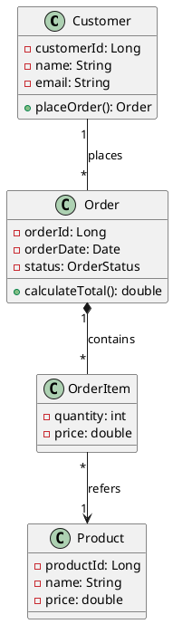
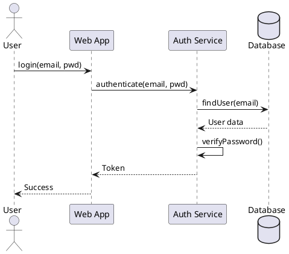
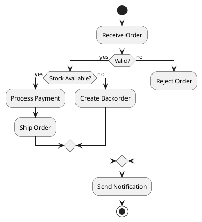

# UML Diagrams: A Comprehensive Guide for Software Design

Unified Modeling Language (UML) provides a standardized way to visualize system design. From class relationships to system behavior, UML diagrams bridge the gap between requirements and implementation. We'll explore structural and behavioral diagrams, real-world patterns, and best practices for effective modeling.

## What is UML?

UML is a visual language for specifying, constructing, and documenting software systems. Created by Grady Booch, Ivar Jacobson, and James Rumbaugh in the 1990s, UML became an OMG standard in 1997.

**Why UML matters:**
- Universal language across teams and organizations
- Visualizes complex systems before coding
- Documents architecture for maintenance
- Identifies design issues early
- Facilitates communication with non-technical stakeholders

**UML 2.5 includes 14 diagram types:**

**Structural diagrams** (static view):
- Class Diagram
- Object Diagram
- Component Diagram
- Deployment Diagram
- Package Diagram
- Composite Structure Diagram

**Behavioral diagrams** (dynamic view):
- Use Case Diagram
- Activity Diagram
- State Machine Diagram
- Sequence Diagram
- Communication Diagram
- Timing Diagram
- Interaction Overview Diagram

We'll focus on the most commonly used diagrams in software development.

## Class Diagrams

Class diagrams show system structure: classes, attributes, methods, and relationships.

### Basic Class Notation

```
┌─────────────────────┐
│      ClassName      │
├─────────────────────┤
│ - attribute: Type   │
│ + publicAttr: Type  │
├─────────────────────┤
│ + method(): Type    │
│ - privateMethod()   │
└─────────────────────┘
```

**Visibility modifiers:**
- `+` public
- `-` private
- `#` protected
- `~` package/default

### Real-World Example: E-Commerce System


### Relationships

#### 1. Association

Shows "has-a" or "uses-a" relationship.

```
Customer ────────► Order
  1      places    0..*
```

**Code representation:**

```java
public class Customer {
    private List<Order> orders;
}

public class Order {
    private Customer customer;
}
```

**Multiplicity notations:**
- `1` - exactly one
- `0..1` - zero or one
- `*` or `0..*` - zero or many
- `1..*` - one or many
- `3..7` - three to seven

#### 2. Aggregation

"Has-a" relationship where child can exist independently (hollow diamond).

```
Department ◇────── Employee
    1              0..*
```

**Code representation:**

```java
public class Department {
    private List<Employee> employees;

    public void addEmployee(Employee emp) {
        employees.add(emp);
    }
}

public class Employee {
    // Can exist without Department
}
```

#### 3. Composition

Strong ownership where child cannot exist without parent (filled diamond).

```
House ◆────── Room
  1           1..*
```

**Code representation:**

```java
public class House {
    private List<Room> rooms;

    public House() {
        this.rooms = new ArrayList<>();
        // Create rooms when house is created
        rooms.add(new Room("Living Room"));
        rooms.add(new Room("Bedroom"));
    }
}

public class Room {
    private String name;

    Room(String name) {
        this.name = name;
    }
    // Room destroyed when House is destroyed
}
```

#### 4. Inheritance (Generalization)

"Is-a" relationship (hollow triangle).


**Code representation:**

```java
public abstract class Vehicle {
    protected String model;

    public abstract void start();
}

public class Car extends Vehicle {
    @Override
    public void start() {
        System.out.println("Car starting...");
    }
}
```

#### 5. Realization (Implementation)

Class implements interface (dashed line with hollow triangle).

```
  «interface»
   Drawable
      △
      ┊
      ┊
   Circle
```

**Code representation:**

```java
public interface Drawable {
    void draw();
}

public class Circle implements Drawable {
    @Override
    public void draw() {
        System.out.println("Drawing circle");
    }
}
```

#### 6. Dependency

Uses or depends on another class (dashed arrow).

```
OrderService ┄┄┄► EmailService
             uses
```

**Code representation:**

```java
public class OrderService {
    public void createOrder(Order order) {
        // Process order
        EmailService.sendConfirmation(order);
    }
}
```

### Complete Example: Order Management System


## Sequence Diagrams

Sequence diagrams show how objects interact over time, focusing on message exchange order.

### Basic Elements

**Lifeline:** Vertical dashed line representing object existence
**Activation bar:** Thin rectangle showing when object is active
**Message:** Arrow showing communication between objects

### Notation Types

```
→ Synchronous message (solid arrow)
┄→ Return message (dashed arrow)
⇢ Asynchronous message (open arrow)
```

### Example: User Authentication Flow


**Code representation:**

```java
public class WebApp {
    private AuthService authService;

    public String login(String email, String password) {
        return authService.authenticate(email, password);
    }
}

public class AuthService {
    private UserRepository database;

    public String authenticate(String email, String password) {
        User user = database.findUser(email);
        if (user != null && verifyPassword(password, user.getPasswordHash())) {
            return generateToken(user);
        }
        throw new AuthenticationException("Invalid credentials");
    }
}
```

### Alternative Flows

Show conditional logic with `alt` fragments:


### Loop Fragment


### Real-World Example: E-Commerce Checkout


## Use Case Diagrams

Use case diagrams show system functionality from user perspective.

### Elements

**Actor:** External entity interacting with system (stick figure)
**Use Case:** System functionality (oval)
**Association:** Connection between actor and use case (line)

### Relationships

**Include:** Base use case always includes another (dashed arrow with «include»)
**Extend:** Use case optionally extends another (dashed arrow with «extend»)
**Generalization:** Specialized actor inherits from general actor (solid line with triangle)

### Example: Online Banking System

```
                  ┌──────────────────────────────────────┐
                  │      Online Banking System           │
                  │                                      │
                  │  ┌──────────────┐                   │
                  │  │ View Balance │                   │
                  │  └──────────────┘                   │
                  │         △                            │
                  │         │ «extend»                   │
Customer ─────────┼─────────┼────────────────┐          │
                  │         │                 │          │
                  │  ┌──────┴────────┐  ┌────▼─────┐   │
                  │  │ Transfer Money│  │  Deposit  │   │
                  │  └───────┬───────┘  └───────────┘   │
                  │          │                           │
                  │          │ «include»                 │
                  │          ▼                           │
                  │  ┌──────────────┐                   │
                  │  │ Authenticate │                   │
                  │  └──────────────┘                   │
                  │         △                            │
                  └─────────┼────────────────────────────┘
                            │
                          Admin
```

### Real-World Example: Library Management

```
                  ┌──────────────────────────────────────────┐
                  │    Library Management System             │
                  │                                          │
Student ──────────┼────── ( Search Books )                   │
                  │              │                           │
                  │              │ «extend»                  │
                  │              ▼                           │
Member ───────────┼────── ( Borrow Book ) ──«include»──►    │
                  │              │                ( Check Availability )
                  │              │ «extend»                  │
                  │              ▼                           │
                  │       ( Reserve Book )                   │
                  │                                          │
Librarian ────────┼────── ( Issue Book )                     │
                  │                                          │
                  │       ( Return Book )                    │
                  │              │                           │
                  │              │ «include»                 │
                  │              ▼                           │
                  │       ( Calculate Fine )                 │
                  │                                          │
Admin ────────────┼────── ( Manage Users )                   │
                  │                                          │
                  │       ( Generate Reports )               │
                  │                                          │
                  └──────────────────────────────────────────┘
```

## Activity Diagrams

Activity diagrams show workflow and business process flow.

### Basic Elements

**Initial node:** Filled circle (●)
**Activity:** Rounded rectangle
**Decision node:** Diamond (◊)
**Merge node:** Diamond (◊)
**Fork/Join:** Thick bar for parallel activities
**Final node:** Circle with filled circle inside (◉)

### Example: Order Processing Workflow


### Parallel Activities with Fork/Join


### Swimlanes

Show responsibilities across different actors:

```
Customer          |  System           |  Payment Gateway  |  Warehouse
─────────────────┼───────────────────┼──────────────────┼──────────────
                 │                   │                  │
    ●            │                   │                  │
    │            │                   │                  │
    ▼            │                   │                  │
┌────────┐       │                   │                  │
│ Browse │       │                   │                  │
│Products│       │                   │                  │
└───┬────┘       │                   │                  │
    │            │                   │                  │
    ▼            │                   │                  │
┌────────┐       │                   │                  │
│  Add   │       │                   │                  │
│to Cart │       │                   │                  │
└───┬────┘       │                   │                  │
    │            │                   │                  │
    ▼            │                   │                  │
┌────────┐       │                   │                  │
│Checkout│───────┼────►●             │                  │
└────────┘       │     │             │                  │
                 │     ▼             │                  │
                 │ ┌────────┐        │                  │
                 │ │Validate│        │                  │
                 │ │  Order │        │                  │
                 │ └───┬────┘        │                  │
                 │     │             │                  │
                 │     ▼             │                  │
                 │ ┌────────┐        │                  │
                 │ │Process │────────┼────►●           │
                 │ │Payment │        │     │           │
                 │ └────────┘        │     ▼           │
                 │                   │ ┌────────┐      │
                 │                   │ │Charge  │      │
                 │                   │ │  Card  │      │
                 │                   │ └───┬────┘      │
                 │                   │     │           │
                 │     ●◄────────────┼─────┘           │
                 │     │             │                  │
                 │     ▼             │                  │
                 │ ┌────────┐        │                  │
                 │ │ Create │────────┼──────────────────┼────►●
                 │ │Shipment│        │                  │     │
                 │ └────────┘        │                  │     ▼
                 │                   │                  │ ┌────────┐
                 │                   │                  │ │  Pick  │
                 │                   │                  │ │ & Pack │
                 │                   │                  │ └───┬────┘
                 │                   │                  │     │
                 │                   │                  │     ▼
                 │                   │                  │ ┌────────┐
                 │                   │                  │ │  Ship  │
                 │                   │                  │ └───┬────┘
    ●◄───────────┼───────────────────┼──────────────────┼─────┘
    │            │                   │                  │
    ▼            │                   │                  │
┌────────┐       │                   │                  │
│Receive │       │                   │                  │
│ Order  │       │                   │                  │
└───┬────┘       │                   │                  │
    │            │                   │                  │
    ▼            │                   │                  │
    ◉            │                   │                  │
```

## State Machine Diagrams

State machine diagrams show object states and transitions triggered by events.

### Elements

**State:** Rounded rectangle
**Initial state:** Filled circle (●)
**Final state:** Circle with filled circle (◉)
**Transition:** Arrow with event/condition

### Example: Order State Machine


### With Guard Conditions


### Real-World Example: User Account States


**Code representation:**

```java
public enum AccountState {
    ACTIVE, SUSPENDED, INACTIVE, DELETED
}

public class UserAccount {
    private AccountState state = AccountState.ACTIVE;
    private LocalDate suspendedAt;

    public void suspend() {
        if (state == AccountState.ACTIVE) {
            state = AccountState.SUSPENDED;
            suspendedAt = LocalDate.now();
        }
    }

    public void reactivate() {
        if (state == AccountState.SUSPENDED) {
            state = AccountState.ACTIVE;
            suspendedAt = null;
        }
    }

    public void checkInactivity() {
        if (state == AccountState.SUSPENDED &&
            suspendedAt.plusDays(90).isBefore(LocalDate.now())) {
            state = AccountState.INACTIVE;
        }
    }

    public void delete() {
        if (state == AccountState.INACTIVE) {
            state = AccountState.DELETED;
        }
    }
}
```

## Component Diagrams

Component diagrams show system architecture at a high level, focusing on components and their dependencies.

### Example: Microservices Architecture


## Deployment Diagrams

Deployment diagrams show physical deployment of artifacts on nodes.

### Example: Cloud Deployment


## Best Practices

### 1. Choose the Right Diagram

**Class diagrams:** System structure, data models, class relationships
**Sequence diagrams:** Interaction flows, API calls, complex algorithms
**Use case diagrams:** Requirements, user stories, system scope
**Activity diagrams:** Business processes, workflows, algorithms
**State machine diagrams:** Object lifecycle, status tracking

### 2. Keep Diagrams Simple

**Bad:** Include every class and method
**Good:** Focus on key components and relationships

```
// Too detailed
┌─────────────────────────┐
│      UserService        │
├─────────────────────────┤
│ - userRepository        │
│ - emailService          │
│ - passwordEncoder       │
│ - validator             │
│ - logger                │
├─────────────────────────┤
│ + createUser()          │
│ + updateUser()          │
│ + deleteUser()          │
│ + findById()            │
│ + findByEmail()         │
│ + validateEmail()       │
│ + encodePassword()      │
└─────────────────────────┘

// Better - focus on key elements
┌─────────────────────┐
│    UserService      │
├─────────────────────┤
│ + createUser()      │
│ + findByEmail()     │
└─────────────────────┘
```

### 3. Use Consistent Notation

Stick to standard UML notation. Don't invent your own symbols.

### 4. Add Context

Include diagram title, description, and scope:

```
Title: User Authentication - Happy Path
Context: Shows successful login flow
Actors: User, Web Server, Auth Service, Database
Assumptions: Valid credentials provided
```

### 5. Layer Your Diagrams

Create multiple diagrams at different abstraction levels:

**High-level:** System overview, main components
**Mid-level:** Module interactions, key classes
**Low-level:** Detailed class diagrams, specific algorithms

### 6. Update Diagrams

Keep diagrams synchronized with code. Outdated diagrams are worse than no diagrams.

### 7. Use Tools

**Online tools:**
- PlantUML - Text-based UML generation
- Draw.io - Visual diagram editor
- Lucidchart - Professional diagramming
- Mermaid - Markdown-like syntax

**IDE plugins:**
- IntelliJ IDEA UML generator
- Visual Studio Code PlantUML extension
- Eclipse Papyrus

### 8. Version Control

Store diagrams in source control alongside code.

**Good practices:**
- Use text-based formats (PlantUML, Mermaid)
- Include diagrams in pull requests
- Review diagram changes like code changes

## PlantUML Examples

PlantUML allows creating UML diagrams from plain text.

### Class Diagram



### Sequence Diagram



### Activity Diagram



## Real-World Pattern: Microservices Design

Comprehensive example showing multiple diagram types for same system.

### System Context (Use Case)

```
                  ┌──────────────────────────────┐
                  │   E-Commerce Platform        │
                  │                              │
Customer ─────────┼────── ( Browse Products )    │
                  │                              │
                  │       ( Place Order )        │
                  │                              │
                  │       ( Track Order )        │
                  │                              │
Admin ────────────┼────── ( Manage Inventory )   │
                  │                              │
                  │       ( View Analytics )     │
                  │                              │
                  └──────────────────────────────┘
```

### Component Architecture


### Order Flow (Sequence)


## Summary

UML diagrams are essential for software design and communication:

- **Class diagrams**: Model system structure with relationships (association, aggregation, composition, inheritance)
- **Sequence diagrams**: Show object interactions over time, perfect for API flows
- **Use case diagrams**: Capture functional requirements from user perspective
- **Activity diagrams**: Model workflows and business processes with decision points
- **State machine diagrams**: Track object lifecycle and state transitions
- **Component diagrams**: Visualize system architecture and dependencies
- **Deployment diagrams**: Show physical deployment of system components

**Key principles:**
- Choose appropriate diagram type for your goal
- Keep diagrams simple and focused
- Use standard UML notation
- Layer diagrams at different abstraction levels
- Keep diagrams synchronized with code
- Use text-based tools for version control

UML bridges the gap between requirements and implementation. Master these diagrams and your designs become clearer, communication improves, and systems are better structured from the start.
