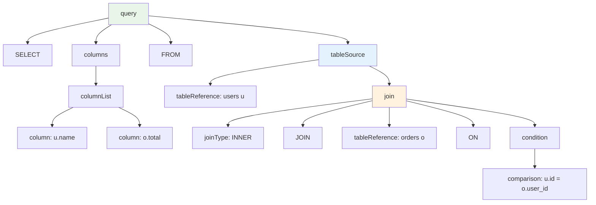

# ANTLR with Kotlin - Part 4: JOINs and Table Aliases

JOINs combine data from multiple tables. We'll extend the grammar to parse:

```sql
SELECT u.name, u.email, o.total, o.status
FROM users u
INNER JOIN orders o ON u.id = o.user_id
WHERE o.status = 'completed' AND u.age > 18
```

This requires handling:
- Table aliases (`users u`, `orders o`)
- Qualified columns (`u.name`, `o.total`)
- JOIN conditions (`u.id = o.user_id`)
- Multiple JOIN types (INNER, LEFT, RIGHT)

## Grammar for JOINs

Update `SimpleSql.g4`:

```antlr
grammar SimpleSql;

query
    : SELECT columns FROM tableSource (WHERE condition)? EOF
    ;

columns
    : STAR
    | columnList
    ;

columnList
    : column (',' column)*
    ;

column
    : qualifiedColumn
    | IDENTIFIER
    ;

qualifiedColumn
    : IDENTIFIER '.' IDENTIFIER
    ;

tableSource
    : tableReference (join)*
    ;

tableReference
    : IDENTIFIER (AS? IDENTIFIER)?
    ;

join
    : joinType JOIN tableReference ON condition
    ;

joinType
    : INNER
    | LEFT OUTER?
    | RIGHT OUTER?
    | FULL OUTER?
    |  // empty - defaults to INNER
    ;

condition
    : condition AND condition
    | condition OR condition
    | NOT condition
    | comparison
    | '(' condition ')'
    ;

comparison
    : columnRef op=(EQ | NE | GT | LT | GTE | LTE) value
    ;

columnRef
    : qualifiedColumn
    | IDENTIFIER
    ;

value
    : NUMBER
    | STRING
    | columnRef
    ;

// Keywords
SELECT  : [Ss][Ee][Ll][Ee][Cc][Tt] ;
FROM    : [Ff][Rr][Oo][Mm] ;
WHERE   : [Ww][Hh][Ee][Rr][Ee] ;
AND     : [Aa][Nn][Dd] ;
OR      : [Oo][Rr] ;
NOT     : [Nn][Oo][Tt] ;
JOIN    : [Jj][Oo][Ii][Nn] ;
INNER   : [Ii][Nn][Nn][Ee][Rr] ;
LEFT    : [Ll][Ee][Ff][Tt] ;
RIGHT   : [Rr][Ii][Gg][Hh][Tt] ;
FULL    : [Ff][Uu][Ll][Ll] ;
OUTER   : [Oo][Uu][Tt][Ee][Rr] ;
ON      : [Oo][Nn] ;
AS      : [Aa][Ss] ;

// Operators
EQ      : '=' ;
NE      : '!=' | '<>' ;
GT      : '>' ;
LT      : '<' ;
GTE     : '>=' ;
LTE     : '<=' ;

// Literals
NUMBER  : [0-9]+ ('.' [0-9]+)? ;
STRING  : '\'' (~'\'')* '\'' ;

// Other
STAR    : '*' ;
IDENTIFIER : [a-zA-Z_][a-zA-Z0-9_]* ;
WS      : [ \t\r\n]+ -> skip ;
```

### Key Changes

**Table source and joins:**

```antlr
tableSource
    : tableReference (join)*
    ;
```

A table source is one table reference followed by zero or more JOINs. This matches:
- `FROM users`
- `FROM users JOIN orders ON users.id = orders.user_id`
- `FROM users u JOIN orders o ON u.id = o.user_id JOIN products p ON o.product_id = p.id`

**Table aliases:**

```antlr
tableReference
    : IDENTIFIER (AS? IDENTIFIER)?
    ;
```

Table name, optionally followed by AS and alias name. AS is optional: `users u` and `users AS u` both work.

**Qualified columns:**

```antlr
qualifiedColumn
    : IDENTIFIER '.' IDENTIFIER
    ;

column
    : qualifiedColumn
    | IDENTIFIER
    ;
```

Columns can be simple (`name`) or qualified (`u.name`). Both are valid in SELECT and WHERE.

**JOIN types:**

```antlr
joinType
    : INNER
    | LEFT OUTER?
    | RIGHT OUTER?
    | FULL OUTER?
    |  // empty
    ;
```

The last alternative is empty—defaults to INNER JOIN when no type specified. `JOIN` alone means `INNER JOIN`.

**Value in comparisons:**

```antlr
value
    : NUMBER
    | STRING
    | columnRef
    ;
```

Values can now be column references. This enables JOIN conditions: `u.id = o.user_id` compares two columns.

## Parse Tree Structure

Given:

```sql
SELECT u.name, o.total FROM users u JOIN orders o ON u.id = o.user_id
```

Parse tree:

```
query
  ├─ SELECT
  ├─ columns
  │   └─ columnList
  │       ├─ column
  │       │   └─ qualifiedColumn: u.name
  │       ├─ ,
  │       └─ column
  │           └─ qualifiedColumn: o.total
  ├─ FROM
  ├─ tableSource
  │   ├─ tableReference: users u
  │   │   ├─ IDENTIFIER: users
  │   │   └─ IDENTIFIER: u
  │   └─ join
  │       ├─ joinType: (empty = INNER)
  │       ├─ JOIN
  │       ├─ tableReference: orders o
  │       │   ├─ IDENTIFIER: orders
  │       │   └─ IDENTIFIER: o
  │       ├─ ON
  │       └─ condition
  │           └─ comparison
  │               ├─ columnRef: u.id
  │               ├─ =
  │               └─ value: o.user_id
  └─ EOF
```



## Building a Query Object Model

The parse tree is raw. Build a structured model:

```kotlin
data class Query(
    val columns: List<ColumnRef>,
    val tables: List<TableRef>,
    val joins: List<JoinClause>,
    val where: WhereClause?
)

data class ColumnRef(
    val table: String?,
    val column: String
)

data class TableRef(
    val name: String,
    val alias: String?
)

data class JoinClause(
    val type: JoinType,
    val table: TableRef,
    val condition: Comparison
)

enum class JoinType {
    INNER, LEFT, RIGHT, FULL
}

data class Comparison(
    val left: ColumnRef,
    val operator: String,
    val right: ComparisonValue
)

sealed class ComparisonValue {
    data class Literal(val value: String) : ComparisonValue()
    data class Column(val ref: ColumnRef) : ComparisonValue()
}

data class WhereClause(
    val conditions: List<Comparison>
)
```

This model separates structure from parse tree details. Easier to work with than raw ANTLR contexts.

## Visitor to Build Object Model

```kotlin
class QueryModelVisitor : SimpleSqlBaseVisitor<Any?>() {

    fun buildQuery(tree: SimpleSqlParser.QueryContext): Query {
        val columns = visitColumns(tree.columns()) as List<ColumnRef>
        val tableSource = visitTableSource(tree.tableSource()) as TableSource
        val where = tree.condition()?.let { visitCondition(it) as WhereClause }

        return Query(
            columns = columns,
            tables = listOf(tableSource.table),
            joins = tableSource.joins,
            where = where
        )
    }

    override fun visitColumns(ctx: SimpleSqlParser.ColumnsContext): List<ColumnRef> {
        if (ctx.STAR() != null) {
            return listOf(ColumnRef(null, "*"))
        }
        return visitColumnList(ctx.columnList()) as List<ColumnRef>
    }

    override fun visitColumnList(ctx: SimpleSqlParser.ColumnListContext): List<ColumnRef> {
        return ctx.column().map { visitColumn(it) as ColumnRef }
    }

    override fun visitColumn(ctx: SimpleSqlParser.ColumnContext): ColumnRef {
        return when {
            ctx.qualifiedColumn() != null -> {
                val qc = ctx.qualifiedColumn()
                ColumnRef(
                    table = qc.IDENTIFIER(0).text,
                    column = qc.IDENTIFIER(1).text
                )
            }
            else -> ColumnRef(null, ctx.IDENTIFIER().text)
        }
    }

    override fun visitTableSource(ctx: SimpleSqlParser.TableSourceContext): TableSource {
        val table = visitTableReference(ctx.tableReference()) as TableRef
        val joins = ctx.join().map { visitJoin(it) as JoinClause }
        return TableSource(table, joins)
    }

    override fun visitTableReference(ctx: SimpleSqlParser.TableReferenceContext): TableRef {
        val name = ctx.IDENTIFIER(0).text
        val alias = if (ctx.IDENTIFIER().size > 1) ctx.IDENTIFIER(1).text else null
        return TableRef(name, alias)
    }

    override fun visitJoin(ctx: SimpleSqlParser.JoinContext): JoinClause {
        val type = when {
            ctx.joinType().INNER() != null -> JoinType.INNER
            ctx.joinType().LEFT() != null -> JoinType.LEFT
            ctx.joinType().RIGHT() != null -> JoinType.RIGHT
            ctx.joinType().FULL() != null -> JoinType.FULL
            else -> JoinType.INNER
        }

        val table = visitTableReference(ctx.tableReference()) as TableRef
        val condition = visitComparison(ctx.condition().comparison()) as Comparison

        return JoinClause(type, table, condition)
    }

    override fun visitComparison(ctx: SimpleSqlParser.ComparisonContext): Comparison {
        val left = visitColumnRef(ctx.columnRef()) as ColumnRef

        val operator = when (ctx.op.type) {
            SimpleSqlParser.EQ -> "="
            SimpleSqlParser.NE -> "!="
            SimpleSqlParser.GT -> ">"
            SimpleSqlParser.LT -> "<"
            SimpleSqlParser.GTE -> ">="
            SimpleSqlParser.LTE -> "<="
            else -> "?"
        }

        val right = visitValue(ctx.value()) as ComparisonValue

        return Comparison(left, operator, right)
    }

    override fun visitColumnRef(ctx: SimpleSqlParser.ColumnRefContext): ColumnRef {
        return when {
            ctx.qualifiedColumn() != null -> {
                val qc = ctx.qualifiedColumn()
                ColumnRef(
                    table = qc.IDENTIFIER(0).text,
                    column = qc.IDENTIFIER(1).text
                )
            }
            else -> ColumnRef(null, ctx.IDENTIFIER().text)
        }
    }

    override fun visitValue(ctx: SimpleSqlParser.ValueContext): ComparisonValue {
        return when {
            ctx.NUMBER() != null -> ComparisonValue.Literal(ctx.NUMBER().text)
            ctx.STRING() != null -> ComparisonValue.Literal(ctx.STRING().text)
            ctx.columnRef() != null -> ComparisonValue.Column(visitColumnRef(ctx.columnRef()) as ColumnRef)
            else -> ComparisonValue.Literal("")
        }
    }

    data class TableSource(
        val table: TableRef,
        val joins: List<JoinClause>
    )
}
```

**Usage:**

```kotlin
fun parseToModel(sql: String): Query {
    val input = CharStreams.fromString(sql)
    val lexer = SimpleSqlLexer(input)
    val tokens = CommonTokenStream(lexer)
    val parser = SimpleSqlParser(tokens)
    val tree = parser.query()

    val visitor = QueryModelVisitor()
    return visitor.buildQuery(tree)
}

fun main() {
    val sql = """
        SELECT u.name, u.email, o.total
        FROM users u
        INNER JOIN orders o ON u.id = o.user_id
        WHERE o.status = 'completed'
    """.trimIndent()

    val query = parseToModel(sql)
    println(query)
}
```

**Output:**

```kotlin
Query(
    columns=[
        ColumnRef(table=u, column=name),
        ColumnRef(table=u, column=email),
        ColumnRef(table=o, column=total)
    ],
    tables=[TableRef(name=users, alias=u)],
    joins=[
        JoinClause(
            type=INNER,
            table=TableRef(name=orders, alias=o),
            condition=Comparison(
                left=ColumnRef(table=u, column=id),
                operator==,
                right=Column(ColumnRef(table=o, column=user_id))
            )
        )
    ],
    where=WhereClause(...)
)
```

Clean object model. Easy to validate, transform, or execute.

## Validating JOINs

Build a validator that checks:
- JOIN condition references tables in the query
- Columns exist in their tables
- No ambiguous column references

```kotlin
class JoinValidator(private val schema: Map<String, Set<String>>) {

    fun validate(query: Query): List<String> {
        val errors = mutableListOf<String>()

        val allTables = buildTableMap(query)

        query.columns.forEach { col ->
            validateColumn(col, allTables, errors)
        }

        query.joins.forEach { join ->
            validateJoinCondition(join.condition, allTables, errors)
        }

        return errors
    }

    private fun buildTableMap(query: Query): Map<String, String> {
        val map = mutableMapOf<String, String>()
        query.tables.forEach { table ->
            val key = table.alias ?: table.name
            map[key] = table.name
        }
        query.joins.forEach { join ->
            val key = join.table.alias ?: join.table.name
            map[key] = join.table.name
        }
        return map
    }

    private fun validateColumn(col: ColumnRef, tables: Map<String, String>, errors: MutableList<String>) {
        if (col.column == "*") return

        if (col.table != null) {
            val actualTable = tables[col.table]
            if (actualTable == null) {
                errors.add("Unknown table alias: ${col.table}")
                return
            }

            val columns = schema[actualTable] ?: emptySet()
            if (col.column !in columns) {
                errors.add("Column ${col.column} not found in table $actualTable")
            }
        } else {
            val tablesWithColumn = tables.values.filter { tableName ->
                col.column in (schema[tableName] ?: emptySet())
            }

            when {
                tablesWithColumn.isEmpty() -> errors.add("Column ${col.column} not found in any table")
                tablesWithColumn.size > 1 -> errors.add("Ambiguous column ${col.column} (found in ${tablesWithColumn.joinToString()})")
            }
        }
    }

    private fun validateJoinCondition(comp: Comparison, tables: Map<String, String>, errors: MutableList<String>) {
        validateColumn(comp.left, tables, errors)

        if (comp.right is ComparisonValue.Column) {
            validateColumn(comp.right.ref, tables, errors)
        }
    }
}
```

**Usage:**

```kotlin
fun main() {
    val schema = mapOf(
        "users" to setOf("id", "name", "email", "age"),
        "orders" to setOf("id", "user_id", "total", "status", "created_at")
    )

    val validator = JoinValidator(schema)

    val sql1 = "SELECT u.name, o.total FROM users u JOIN orders o ON u.id = o.user_id"
    val query1 = parseToModel(sql1)
    println("Errors: ${validator.validate(query1)}")

    val sql2 = "SELECT u.name, o.price FROM users u JOIN orders o ON u.id = o.user_id"
    val query2 = parseToModel(sql2)
    println("Errors: ${validator.validate(query2)}")
}
```

**Output:**

```
Errors: []
Errors: [Column price not found in table orders]
```

The validator catches non-existent columns at parse time, before query execution.

## Multiple JOINs

The grammar supports chaining:

```sql
SELECT u.name, o.total, p.name
FROM users u
JOIN orders o ON u.id = o.user_id
JOIN products p ON o.product_id = p.id
WHERE o.status = 'shipped'
```

The `(join)*` repetition allows unlimited JOINs. Each JOIN adds a table to the query:

```kotlin
Query(
    tables=[TableRef(name=users, alias=u)],
    joins=[
        JoinClause(type=INNER, table=TableRef(name=orders, alias=o), condition=...),
        JoinClause(type=INNER, table=TableRef(name=products, alias=p), condition=...)
    ]
)
```

## Testing

```kotlin
class JoinParserTest {

    @Test
    fun `parse simple INNER JOIN`() {
        val sql = "SELECT * FROM users u JOIN orders o ON u.id = o.user_id"
        val query = parseToModel(sql)

        assertEquals(1, query.joins.size)
        assertEquals(JoinType.INNER, query.joins[0].type)
        assertEquals("orders", query.joins[0].table.name)
        assertEquals("o", query.joins[0].table.alias)
    }

    @Test
    fun `parse LEFT JOIN`() {
        val sql = "SELECT * FROM users u LEFT JOIN orders o ON u.id = o.user_id"
        val query = parseToModel(sql)

        assertEquals(JoinType.LEFT, query.joins[0].type)
    }

    @Test
    fun `parse qualified columns`() {
        val sql = "SELECT u.name, o.total FROM users u JOIN orders o ON u.id = o.user_id"
        val query = parseToModel(sql)

        assertEquals(ColumnRef("u", "name"), query.columns[0])
        assertEquals(ColumnRef("o", "total"), query.columns[1])
    }

    @Test
    fun `parse multiple JOINs`() {
        val sql = """
            SELECT u.name, o.total, p.name
            FROM users u
            JOIN orders o ON u.id = o.user_id
            JOIN products p ON o.product_id = p.id
        """.trimIndent()

        val query = parseToModel(sql)
        assertEquals(2, query.joins.size)
    }

    @Test
    fun `validate columns against schema`() {
        val schema = mapOf(
            "users" to setOf("id", "name", "email"),
            "orders" to setOf("id", "user_id", "total")
        )
        val validator = JoinValidator(schema)

        val sql = "SELECT u.name, o.price FROM users u JOIN orders o ON u.id = o.user_id"
        val query = parseToModel(sql)
        val errors = validator.validate(query)

        assertTrue(errors.any { it.contains("price not found") })
    }
}
```

## Common Pitfalls

**Forgetting ON clause:**

```antlr
join
    : joinType JOIN tableReference  // Wrong - missing ON
    ;
```

Without `ON condition`, the parser can't validate JOIN logic. Always require ON for explicit joins.

**Ambiguous column resolution:**

```sql
SELECT name FROM users u JOIN orders o ON id = user_id
```

Which table does `name` come from? Which `id`? Always qualify columns in JOINs:

```sql
SELECT u.name FROM users u JOIN orders o ON u.id = o.user_id
```

**Self-joins without aliases:**

```sql
SELECT * FROM users JOIN users ON ...  -- Which users is which?
```

Self-joins require aliases:

```sql
SELECT * FROM users u1 JOIN users u2 ON u1.manager_id = u2.id
```

## What's Next

Part 5 covers **error handling**. When queries are invalid, provide helpful messages:

```
Error at line 1, column 25: Expected FROM but found FORM
Did you mean: FROM?
```

You'll learn:
- Custom error listeners
- Error recovery strategies
- Syntax highlighting for errors
- Suggesting fixes

The parser will point to exact error locations and propose corrections, making it production-ready.
