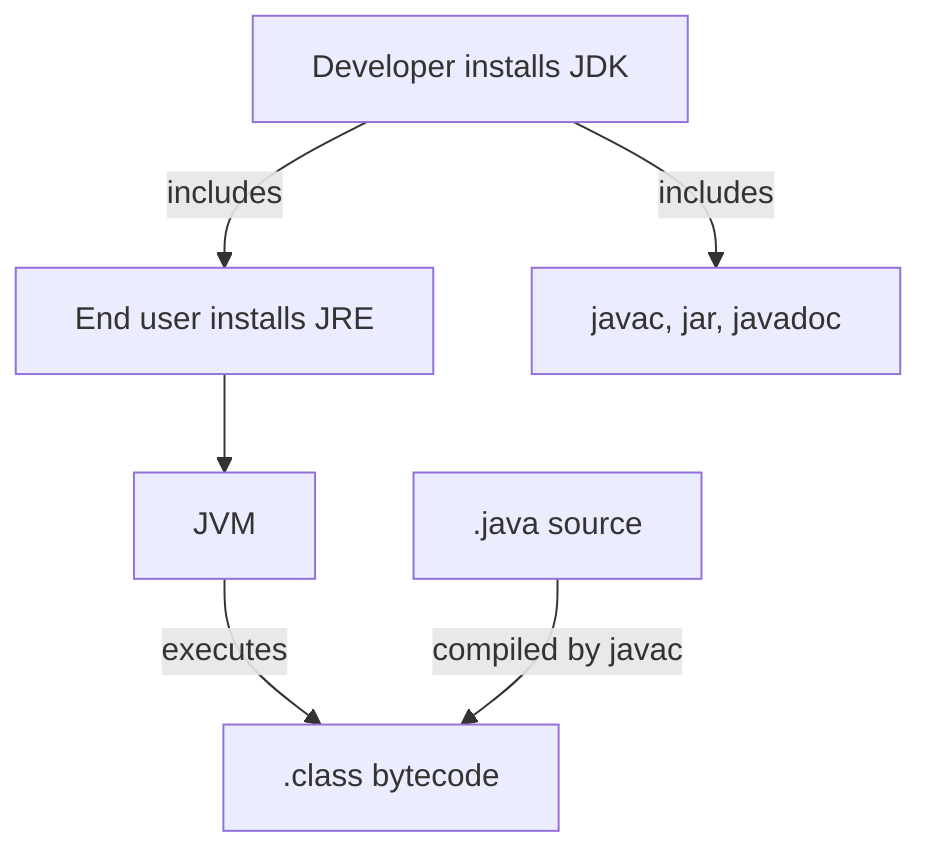
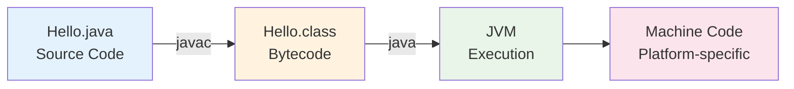

# Java Complete - Part 1: Introduction to Java

**Why Learn Java?** Java consistently ranks as the #1 or #2 most popular programming language globally. It powers 3+ billion devices, dominates enterprise development, and offers excellent career prospects with high salaries.

Java was born at Sun Microsystems in 1995, conceived by James Gosling and his team as a language for consumer electronics. Today, it powers everything from Android applications to enterprise systems, web services to scientific computing.

## What Makes Java Special

**Core Philosophy**: "Write once, run anywhere" (WORA). Java compiles to platform-independent bytecode instead of machine-specific code.

```java
// This runs identically on any operating system
public class Hello {
    public static void main(String[] args) {
        System.out.println("Hello, World!");
    }
}
```

**The Magic**: `javac Hello.java` → `Hello.class` (bytecode) → runs on any JVM

## The Java Ecosystem

Understanding Java means understanding its three core components:

**JDK (Java Development Kit)** - The complete development environment containing:
- The Java compiler (`javac`)
- The Java runtime (`java`)
- Standard libraries
- Development tools like `jar`, `javadoc`

**JRE (Java Runtime Environment)** - What end users need:
- JVM implementation
- Standard libraries
- No development tools

**JVM (Java Virtual Machine)** - The execution engine:
- Loads and executes bytecode
- Manages memory
- Handles platform-specific operations

A quick visual map:


## Java's Key Characteristics

### Platform Independence
```java
// This code works the same everywhere
public class FileSize {
    public static void main(String[] args) {
        java.io.File file = new java.io.File("data.txt");
        if (file.exists()) {
            System.out.println("Size: " + file.length() + " bytes");
        }
    }
}
```

The JVM handles the platform-specific details of file operations.

### Object-Oriented from the Ground Up
Everything in Java is an object or belongs to a class. Even our simple `Hello` program defines a class. This isn't just syntax - it reflects Java's design philosophy that programs should model real-world entities and their interactions.

### Memory Management
Java automatically manages memory through garbage collection. You allocate objects with `new`; the JVM frees them when no longer referenced:

```java
public class Person {
    private String name;
    
    public Person(String name) {
        this.name = name;
    }
    
    public static void main(String[] args) {
        Person p1 = new Person("Alice");    // Memory allocated
        Person p2 = new Person("Bob");      // Memory allocated
        p1 = null;                          // p1's memory eligible for GC
        // Java's garbage collector will eventually free Alice's memory
    }
}
```

### Strong Static Typing
Every variable must have a declared type, checked at compile time:

```java
int count = 42;         // count is always an integer
String name = "Java";   // name is always a String
count = name;           // Compile error - type mismatch
```

This catches many errors before your program runs.

## Java in Context

### Java vs Other Languages

**vs C/C++**: Automatic memory management eliminates pointer errors and memory leaks
```c
char* msg = malloc(20);  // Manual memory
free(msg);              // Must remember to free
```
```java
String msg = "Hello";   // Automatic memory management
```

**vs Python**: Static typing catches errors at compile time, not runtime
```python
def add(a, b): return a + b
result = add("Hi", "World")  # Runtime surprise: concatenation
```
```java
public static int add(int a, int b) { return a + b; }
int result = add("Hi", "World");  // Compile error - caught early
```

## Real-World Java Applications

**Why This Matters**: Understanding Java's applications helps you see career paths and project possibilities.

### Enterprise Systems (Banks, E-commerce)
```java
@RestController
public class CustomerController {
    @GetMapping("/customers/{id}")  
    public Customer getCustomer(@PathVariable Long id) {
        return customerService.findById(id);  // Spring Framework magic
    }
}
```

### Mobile Development (Android)  
```java
public class MainActivity extends AppCompatActivity {
    protected void onCreate(Bundle savedInstanceState) {
        super.onCreate(savedInstanceState);
        TextView textView = new TextView(this);
        textView.setText("Hello Android");  // Simple UI creation
        setContentView(textView);
    }
}
```

### High-Performance Computing
```java
// Parallel prime counting using Java Streams
long primeCount = IntStream.range(2, 1_000_000)
    .parallel()                    // Automatic multi-threading
    .filter(n -> isPrime(n))       // Custom logic
    .count();                      // Terminal operation
```

**Key Industries**: Banking, Healthcare, E-commerce, Scientific Research, Big Data

## Installing Java

For this tutorial series, we'll use OpenJDK 21, the current Long Term Support (LTS) version.

### On Windows
1. Download OpenJDK from [adoptium.net](https://adoptium.net)
2. Run the installer
3. Verify installation: `java --version` in Command Prompt

### On macOS
Using Homebrew:
```bash
brew install openjdk@21
```

### On Linux (Ubuntu/Debian)
```bash
sudo apt update
sudo apt install openjdk-21-jdk
```

Verify your installation:
```bash
$ java --version
openjdk 21.0.1 2023-10-17

$ javac --version
javac 21.0.1
```

## Your First Program

Create a file named `Welcome.java`:

```java
public class Welcome {
    public static void main(String[] args) {
        System.out.println("Welcome to Java programming!");
        System.out.println("Java version: " + System.getProperty("java.version"));
    }
}
```

Compile and run:
```bash
$ javac Welcome.java
$ java Welcome
Welcome to Java programming!
Java version: 21.0.1
```

Note several things:
- The class name `Welcome` matches the filename `Welcome.java`
- `public static void main(String[] args)` is the program entry point
- `System.out.println()` prints a line to the console
- Java is case-sensitive: `System` not `system`

## Understanding the Compilation Process

**Why Two Steps?** Java's compilation process enables both platform independence and security through bytecode verification.



**Compile Time** (`javac`): Syntax checking, type verification, bytecode generation  
**Runtime** (`java`): Bytecode verification, JIT compilation, execution

## What's Next

In the next tutorial, we'll set up a proper development environment with an IDE, explore debugging tools, and understand how Java projects are organized. We'll also write more substantial programs to cement these fundamental concepts.

Java's strength lies not just in its features, but in its vast ecosystem of libraries, frameworks, and tools built over nearly three decades. By the end of this series, you'll understand not just Java the language, but Java the platform and how to leverage its full power in real-world applications.

## Key Takeaways

- Java compiles to bytecode, which runs on the JVM for platform independence
- Strong static typing catches errors at compile time
- Automatic memory management eliminates many common programming errors
- The language is designed around object-oriented principles
- Java powers diverse applications from mobile apps to enterprise systems

In our next session, we'll get hands-on with development tools and write programs that demonstrate these concepts in action.