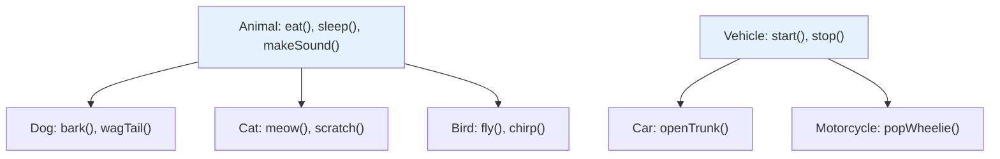
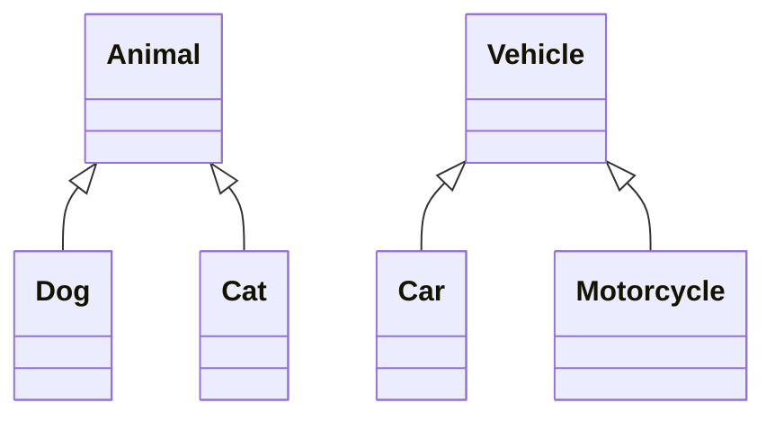
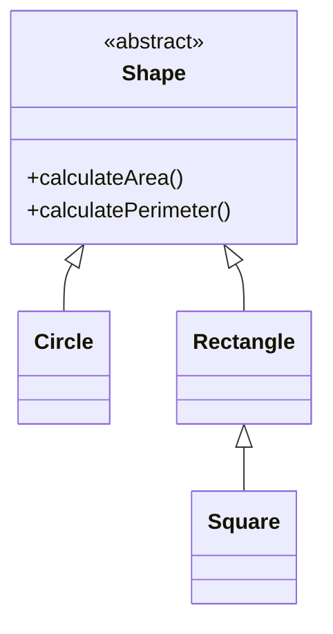

# Inheritance and Polymorphism

**Why This Matters**: Inheritance prevents code duplication and models real-world hierarchies. Polymorphism enables writing flexible code that works with multiple types. Together, they're the foundation of frameworks, libraries, and scalable application architectures.

**Core Concepts**:
- **Inheritance**: Child classes inherit properties and behaviors from parent classes
- **Polymorphism**: One interface, multiple implementations - same method call, different behaviors

## Understanding Inheritance

**Key Principle**: Inheritance models **"is-a"** relationships in the real world.



**Benefits**: Code reuse, logical organization, easier maintenance, extensibility.

### Basic Inheritance Syntax

A quick visual of the class relationships:


```java
// Base class (superclass/parent class)
public class Animal {
    protected String name;
    protected int age;
    protected String species;
    
    public Animal(String name, int age, String species) {
        this.name = name;
        this.age = age;
        this.species = species;
    }
    
    public void eat() {
        System.out.println(name + " is eating.");
    }
    
    public void sleep() {
        System.out.println(name + " is sleeping.");
    }
    
    public void makeSound() {
        System.out.println(name + " makes a sound.");
    }
    
    public String getInfo() {
        return String.format("%s is a %d-year-old %s", name, age, species);
    }
}

// Derived class (subclass/child class)
public class Dog extends Animal {
    private String breed;
    private boolean isTrainedToFetch;
    
    public Dog(String name, int age, String breed) {
        super(name, age, "Canine"); // Call parent constructor
        this.breed = breed;
        this.isTrainedToFetch = false;
    }
    
    // Override parent method
    @Override
    public void makeSound() {
        System.out.println(name + " barks: Woof! Woof!");
    }
    
    // Add new methods specific to Dog
    public void fetch() {
        if (isTrainedToFetch) {
            System.out.println(name + " fetches the ball!");
        } else {
            System.out.println(name + " doesn't know how to fetch yet.");
        }
    }
    
    public void trainToFetch() {
        isTrainedToFetch = true;
        System.out.println(name + " has been trained to fetch!");
    }
    
    public String getBreed() {
        return breed;
    }
    
    // Override to provide more specific information
    @Override
    public String getInfo() {
        return super.getInfo() + ", breed: " + breed;
    }
}

public class Cat extends Animal {
    private boolean isIndoor;
    private int livesRemaining;
    
    public Cat(String name, int age, boolean isIndoor) {
        super(name, age, "Feline");
        this.isIndoor = isIndoor;
        this.livesRemaining = 9; // Cats have nine lives!
    }
    
    @Override
    public void makeSound() {
        System.out.println(name + " meows: Meow!");
    }
    
    public void climb() {
        System.out.println(name + " climbs gracefully.");
    }
    
    public void useLive() {
        if (livesRemaining > 0) {
            livesRemaining--;
            System.out.println(name + " used a life. " + livesRemaining + " lives remaining.");
        } else {
            System.out.println(name + " has no lives left!");
        }
    }
    
    @Override
    public String getInfo() {
        return super.getInfo() + ", lives remaining: " + livesRemaining + 
               ", " + (isIndoor ? "indoor" : "outdoor") + " cat";
    }
}
```

### Inheritance in Action

```java
public class AnimalDemo {
    public static void main(String[] args) {
        // Create objects
        Animal genericAnimal = new Animal("Generic", 5, "Unknown");
        Dog myDog = new Dog("Rex", 3, "German Shepherd");
        Cat myCat = new Cat("Whiskers", 2, true);
        
        // All objects can use inherited methods
        genericAnimal.eat();
        myDog.eat();        // Inherited from Animal
        myCat.eat();        // Inherited from Animal
        
        System.out.println();
        
        // Polymorphic behavior - same method, different implementations
        genericAnimal.makeSound(); // Generic sound
        myDog.makeSound();         // Barks
        myCat.makeSound();         // Meows
        
        System.out.println();
        
        // Subclass-specific methods
        myDog.fetch();       // Dog doesn't know how yet
        myDog.trainToFetch(); // Train the dog
        myDog.fetch();       // Now dog can fetch
        
        myCat.climb();       // Cat-specific behavior
        myCat.useLive();     // Cat-specific behavior
        
        System.out.println();
        
        // Information display
        System.out.println(genericAnimal.getInfo());
        System.out.println(myDog.getInfo());
        System.out.println(myCat.getInfo());
    }
}
```

**Output:**
```
Generic is eating.
Rex is eating.
Whiskers is eating.

Generic makes a sound.
Rex barks: Woof! Woof!
Whiskers meows: Meow!

Rex doesn't know how to fetch yet.
Rex has been trained to fetch!
Rex fetches the ball!
Whiskers climbs gracefully.
Whiskers used a life. 8 lives remaining.

Generic is a 5-year-old Unknown
Rex is a 3-year-old Canine, breed: German Shepherd
Whiskers is a 2-year-old Feline, lives remaining: 8, indoor cat
```

## The `super` Keyword

The `super` keyword provides access to parent class members:

```java
public class Vehicle {
    protected String make;
    protected String model;
    protected int year;
    protected double price;
    
    public Vehicle(String make, String model, int year, double price) {
        this.make = make;
        this.model = model;
        this.year = year;
        this.price = price;
    }
    
    public void startEngine() {
        System.out.println("Vehicle engine started.");
    }
    
    public double calculateDepreciation(int currentYear) {
        int age = currentYear - year;
        return price * Math.pow(0.85, age); // 15% depreciation per year
    }
    
    public String getDescription() {
        return String.format("%d %s %s", year, make, model);
    }
}

public class Car extends Vehicle {
    private int numberOfDoors;
    private String fuelType;
    
    public Car(String make, String model, int year, double price, int numberOfDoors, String fuelType) {
        super(make, model, year, price); // Must be first statement
        this.numberOfDoors = numberOfDoors;
        this.fuelType = fuelType;
    }
    
    @Override
    public void startEngine() {
        super.startEngine(); // Call parent method first
        System.out.println("Car engine is now running smoothly.");
    }
    
    // Override with additional logic
    @Override
    public double calculateDepreciation(int currentYear) {
        double baseDepreciation = super.calculateDepreciation(currentYear);
        
        // Electric cars depreciate faster
        if (fuelType.equals("Electric")) {
            return baseDepreciation * 0.9; // Additional 10% depreciation
        }
        
        return baseDepreciation;
    }
    
    @Override
    public String getDescription() {
        return super.getDescription() + String.format(" (%d-door %s)", numberOfDoors, fuelType);
    }
}

public class Motorcycle extends Vehicle {
    private boolean hasSidecar;
    private int engineSize;
    
    public Motorcycle(String make, String model, int year, double price, int engineSize, boolean hasSidecar) {
        super(make, model, year, price);
        this.engineSize = engineSize;
        this.hasSidecar = hasSidecar;
    }
    
    @Override
    public void startEngine() {
        System.out.println("Motorcycle engine roars to life!");
        // Note: Not calling super.startEngine() - completely overriding
    }
    
    @Override
    public String getDescription() {
        String description = super.getDescription() + String.format(" (%dcc", engineSize);
        if (hasSidecar) {
            description += " with sidecar";
        }
        description += ")";
        return description;
    }
}
```

## Polymorphism in Practice

Polymorphism allows objects of different classes to be treated as instances of the same base class:

```java
public class VehicleFleet {
    private Vehicle[] vehicles;
    private int count;
    
    public VehicleFleet(int maxCapacity) {
        vehicles = new Vehicle[maxCapacity];
        count = 0;
    }
    
    public void addVehicle(Vehicle vehicle) {
        if (count < vehicles.length) {
            vehicles[count] = vehicle;
            count++;
            System.out.println("Added: " + vehicle.getDescription());
        }
    }
    
    // Polymorphism: Same method call, different behavior for each vehicle type
    public void startAllEngines() {
        System.out.println("\n=== Starting All Engines ===");
        for (int i = 0; i < count; i++) {
            System.out.println("Starting " + vehicles[i].getDescription() + ":");
            vehicles[i].startEngine(); // Calls appropriate overridden method
            System.out.println();
        }
    }
    
    public void calculateFleetValue(int currentYear) {
        System.out.println("\n=== Fleet Valuation for " + currentYear + " ===");
        double totalValue = 0;
        
        for (int i = 0; i < count; i++) {
            double currentValue = vehicles[i].calculateDepreciation(currentYear);
            totalValue += currentValue;
            
            System.out.printf("%s: $%.2f\n", 
                vehicles[i].getDescription(), currentValue);
        }
        
        System.out.printf("Total Fleet Value: $%.2f\n", totalValue);
    }
    
    public void displayFleetDetails() {
        System.out.println("\n=== Fleet Details ===");
        for (int i = 0; i < count; i++) {
            System.out.println((i + 1) + ". " + vehicles[i].getDescription());
        }
    }
}

public class FleetDemo {
    public static void main(String[] args) {
        VehicleFleet fleet = new VehicleFleet(5);
        
        // Add different types of vehicles - all treated as Vehicle objects
        fleet.addVehicle(new Car("Toyota", "Camry", 2020, 25000.0, 4, "Gasoline"));
        fleet.addVehicle(new Car("Tesla", "Model S", 2021, 80000.0, 4, "Electric"));
        fleet.addVehicle(new Motorcycle("Harley-Davidson", "Street Glide", 2019, 30000.0, 1750, true));
        fleet.addVehicle(new Vehicle("Ford", "Transit", 2018, 35000.0));
        
        fleet.displayFleetDetails();
        fleet.startAllEngines();
        fleet.calculateFleetValue(2024);
    }
}
```

**Output:**
```
Added: 2020 Toyota Camry (4-door Gasoline)
Added: 2021 Tesla Model S (4-door Electric)
Added: 2019 Harley-Davidson Street Glide (1750cc with sidecar)
Added: 2018 Ford Transit

=== Fleet Details ===
1. 2020 Toyota Camry (4-door Gasoline)
2. 2021 Tesla Model S (4-door Electric)
3. 2019 Harley-Davidson Street Glide (1750cc with sidecar)
4. 2018 Ford Transit

=== Starting All Engines ===
Starting 2020 Toyota Camry (4-door Gasoline):
Vehicle engine started.
Car engine is now running smoothly.

Starting 2021 Tesla Model S (4-door Electric):
Vehicle engine started.
Car engine is now running smoothly.

Starting 2019 Harley-Davidson Street Glide (1750cc with sidecar):
Motorcycle engine roars to life!

Starting 2018 Ford Transit:
Vehicle engine started.

=== Fleet Valuation for 2024 ===
2020 Toyota Camry (4-door Gasoline): $13062.95
2021 Tesla Model S (4-door Electric): $49572.00
2019 Harley-Davidson Street Glide (1750cc with sidecar): $12826.84
2018 Ford Transit: $14706.13
Total Fleet Value: $90167.92
```

## Multi-level Inheritance

Java supports multi-level inheritance (class extends class extends class):

```java
// Level 1: Base class
public class Employee {
    protected String employeeId;
    protected String name;
    protected double baseSalary;
    protected String department;
    
    public Employee(String employeeId, String name, double baseSalary, String department) {
        this.employeeId = employeeId;
        this.name = name;
        this.baseSalary = baseSalary;
        this.department = department;
    }
    
    public double calculatePay() {
        return baseSalary;
    }
    
    public void displayInfo() {
        System.out.printf("Employee: %s (%s) - %s Department - Base: $%.2f\n", 
                         name, employeeId, department, baseSalary);
    }
    
    public String getEmployeeId() { return employeeId; }
    public String getName() { return name; }
    public String getDepartment() { return department; }
}

// Level 2: Intermediate class
public class Manager extends Employee {
    protected double managementBonus;
    protected int teamSize;
    
    public Manager(String employeeId, String name, double baseSalary, String department, 
                   double managementBonus, int teamSize) {
        super(employeeId, name, baseSalary, department);
        this.managementBonus = managementBonus;
        this.teamSize = teamSize;
    }
    
    @Override
    public double calculatePay() {
        return super.calculatePay() + managementBonus;
    }
    
    @Override
    public void displayInfo() {
        super.displayInfo();
        System.out.printf("  Manager bonus: $%.2f, Team size: %d\n", managementBonus, teamSize);
    }
    
    public void conductTeamMeeting() {
        System.out.println("Manager " + name + " is conducting a team meeting with " + teamSize + " members.");
    }
}

// Level 3: Most specific class
public class Director extends Manager {
    private double stockOptions;
    private String[] responsibleDepartments;
    
    public Director(String employeeId, String name, double baseSalary, String department,
                   double managementBonus, int teamSize, double stockOptions, String[] departments) {
        super(employeeId, name, baseSalary, department, managementBonus, teamSize);
        this.stockOptions = stockOptions;
        this.responsibleDepartments = departments;
    }
    
    @Override
    public double calculatePay() {
        return super.calculatePay() + stockOptions;
    }
    
    @Override
    public void displayInfo() {
        super.displayInfo();
        System.out.printf("  Director stock options: $%.2f\n", stockOptions);
        System.out.println("  Responsible for departments: " + String.join(", ", responsibleDepartments));
    }
    
    public void strategicPlanning() {
        System.out.println("Director " + name + " is conducting strategic planning for multiple departments.");
    }
    
    @Override
    public void conductTeamMeeting() {
        super.conductTeamMeeting(); // Call Manager's implementation
        System.out.println("  Director " + name + " also discusses company-wide initiatives.");
    }
}

public class EmployeeHierarchyDemo {
    public static void main(String[] args) {
        Employee emp = new Employee("E001", "John Smith", 50000, "IT");
        Manager mgr = new Manager("M001", "Sarah Johnson", 75000, "IT", 15000, 8);
        Director dir = new Director("D001", "Michael Brown", 100000, "Technology", 25000, 25, 50000, 
                                   new String[]{"IT", "Engineering", "Data Science"});
        
        Employee[] employees = {emp, mgr, dir};
        
        System.out.println("=== Employee Information ===");
        for (Employee e : employees) {
            e.displayInfo();
            System.out.printf("Total compensation: $%.2f\n\n", e.calculatePay());
        }
        
        System.out.println("=== Specific Behaviors ===");
        mgr.conductTeamMeeting();
        dir.conductTeamMeeting();
        dir.strategicPlanning();
    }
}
```

## Method Overriding Rules

### The `@Override` Annotation
```java
public class Parent {
    public void display() {
        System.out.println("Parent display");
    }
    
    protected void helper() {
        System.out.println("Parent helper");
    }
}

public class Child extends Parent {
    @Override
    public void display() { // Correct override
        System.out.println("Child display");
    }
    
    // @Override
    // public void display(int x) { // This is overloading, not overriding
    //     System.out.println("Child display with parameter");
    // }
    
    @Override
    protected void helper() { // Can't reduce visibility
        System.out.println("Child helper");
    }
    
    // public void helper() { // Can increase visibility
    //     System.out.println("Child helper with increased visibility");
    // }
}
```

### Overriding Rules
1. **Same method signature**: Name, parameters, return type must match
2. **Visibility**: Cannot reduce visibility (private → protected → public)
3. **Exceptions**: Cannot throw broader checked exceptions
4. **Static methods**: Cannot be overridden (they're hidden instead)
5. **Final methods**: Cannot be overridden

```java
public class OverrideRulesDemo {
    // Static methods belong to the class, not instances
    public static void staticMethod() {
        System.out.println("Parent static method");
    }
    
    // Final methods cannot be overridden
    public final void finalMethod() {
        System.out.println("This method cannot be overridden");
    }
    
    // Throws specific exception
    public void riskyMethod() throws IOException {
        System.out.println("Parent risky method");
    }
}

public class OverrideChild extends OverrideRulesDemo {
    // This hides (not overrides) the parent static method
    public static void staticMethod() {
        System.out.println("Child static method");
    }
    
    // public void finalMethod() { // ERROR: Cannot override final method
    //     System.out.println("Trying to override final method");
    // }
    
    // Can throw same or more specific exception
    @Override
    public void riskyMethod() throws FileNotFoundException { // More specific than IOException
        System.out.println("Child risky method");
    }
    
    // public void riskyMethod() throws Exception { // ERROR: Broader exception not allowed
    //     System.out.println("Child risky method with broader exception");
    // }
}
```

## Runtime vs Compile-time Behavior

### Upcasting and Downcasting

```java
public class CastingDemo {
    public static void main(String[] args) {
        // Upcasting (implicit, always safe)
        Animal animal1 = new Dog("Buddy", 5, "Labrador"); // Dog → Animal
        Animal animal2 = new Cat("Mittens", 3, true);      // Cat → Animal
        
        // Compile-time type is Animal, runtime type is Dog/Cat
        animal1.makeSound(); // Calls Dog's makeSound() - polymorphism!
        animal2.makeSound(); // Calls Cat's makeSound()
        
        // animal1.fetch(); // ERROR: Animal doesn't have fetch() method
        
        // Downcasting (explicit, potentially unsafe)
        if (animal1 instanceof Dog) {
            Dog dog = (Dog) animal1; // Safe downcast
            dog.fetch(); // Now we can call Dog-specific methods
        }
        
        // Unsafe downcast example
        try {
            Dog wrongCast = (Dog) animal2; // Runtime error: Cat cannot be cast to Dog
        } catch (ClassCastException e) {
            System.out.println("Cannot cast Cat to Dog: " + e.getMessage());
        }
        
        // Safe checking with instanceof
        checkAndCallSpecificMethods(animal1);
        checkAndCallSpecificMethods(animal2);
    }
    
    public static void checkAndCallSpecificMethods(Animal animal) {
        System.out.println("\nChecking animal type for: " + animal.getInfo());
        
        if (animal instanceof Dog) {
            Dog dog = (Dog) animal;
            System.out.println("This is a dog, breed: " + dog.getBreed());
            dog.fetch();
        } else if (animal instanceof Cat) {
            Cat cat = (Cat) animal;
            System.out.println("This is a cat");
            cat.climb();
        } else {
            System.out.println("This is a generic animal");
        }
    }
}
```

## Practical Application: Shape Hierarchy

A visual of the hierarchy we'll implement:


```java
public abstract class Shape {
    protected String color;
    protected boolean isFilled;
    
    public Shape(String color, boolean isFilled) {
        this.color = color;
        this.isFilled = isFilled;
    }
    
    // Abstract method - must be implemented by subclasses
    public abstract double calculateArea();
    public abstract double calculatePerimeter();
    
    // Concrete method - can be used by all subclasses
    public void displayInfo() {
        System.out.printf("%s %s (%.2f area, %.2f perimeter)\n", 
                         isFilled ? "Filled" : "Hollow",
                         this.getClass().getSimpleName(),
                         calculateArea(),
                         calculatePerimeter());
    }
    
    public String getColor() { return color; }
    public boolean isFilled() { return isFilled; }
}

public class Circle extends Shape {
    private double radius;
    
    public Circle(String color, boolean isFilled, double radius) {
        super(color, isFilled);
        this.radius = radius;
    }
    
    @Override
    public double calculateArea() {
        return Math.PI * radius * radius;
    }
    
    @Override
    public double calculatePerimeter() {
        return 2 * Math.PI * radius;
    }
    
    public double getRadius() { return radius; }
}

public class Rectangle extends Shape {
    protected double width;
    protected double height;
    
    public Rectangle(String color, boolean isFilled, double width, double height) {
        super(color, isFilled);
        this.width = width;
        this.height = height;
    }
    
    @Override
    public double calculateArea() {
        return width * height;
    }
    
    @Override
    public double calculatePerimeter() {
        return 2 * (width + height);
    }
    
    public double getWidth() { return width; }
    public double getHeight() { return height; }
}

public class Square extends Rectangle {
    public Square(String color, boolean isFilled, double side) {
        super(color, isFilled, side, side); // Square is special case of Rectangle
    }
    
    @Override
    public void displayInfo() {
        System.out.printf("%s Square with side %.2f (%.2f area, %.2f perimeter)\n",
                         isFilled ? "Filled" : "Hollow",
                         width, calculateArea(), calculatePerimeter());
    }
    
    public double getSide() { return width; }
}

public class ShapeCalculatorDemo {
    public static void main(String[] args) {
        Shape[] shapes = {
            new Circle("Red", true, 5.0),
            new Rectangle("Blue", false, 4.0, 6.0),
            new Square("Green", true, 3.0),
            new Circle("Yellow", false, 2.5)
        };
        
        System.out.println("=== Shape Information ===");
        double totalArea = 0;
        
        for (Shape shape : shapes) {
            shape.displayInfo();
            totalArea += shape.calculateArea();
        }
        
        System.out.printf("\nTotal area of all shapes: %.2f\n", totalArea);
        
        // Demonstrate polymorphism with method that accepts any Shape
        findLargestShape(shapes);
    }
    
    public static void findLargestShape(Shape[] shapes) {
        if (shapes.length == 0) return;
        
        Shape largest = shapes[0];
        for (Shape shape : shapes) {
            if (shape.calculateArea() > largest.calculateArea()) {
                largest = shape;
            }
        }
        
        System.out.println("\nLargest shape:");
        largest.displayInfo();
    }
}
```

## Common Inheritance Pitfalls

### 1. Constructor Chain Issues
```java
// Problem: Parent constructor not called
public class BadChild extends Parent {
    public BadChild(String name) {
        // super(name); // If Parent doesn't have no-arg constructor, this is required
        // ... rest of constructor
    }
}

// Solution: Always call appropriate parent constructor
public class GoodChild extends Parent {
    public GoodChild(String name) {
        super(name); // Explicit call to parent constructor
        // ... rest of constructor
    }
}
```

### 2. Method Hiding vs Overriding
```java
public class Parent {
    public static void staticMethod() {
        System.out.println("Parent static");
    }
}

public class Child extends Parent {
    // This hides the parent method, doesn't override it
    public static void staticMethod() {
        System.out.println("Child static");
    }
    
    public static void main(String[] args) {
        Parent p = new Child();
        p.staticMethod(); // Prints "Parent static" - uses compile-time type!
        
        Child c = new Child();
        c.staticMethod(); // Prints "Child static"
    }
}
```

### 3. Overuse of Inheritance
```java
// Bad: Using inheritance for code reuse without "is-a" relationship
public class PrintableDocument extends Printer { // Document is NOT a Printer
    // Wrong approach
}

// Good: Use composition instead
public class PrintableDocument {
    private Printer printer; // Document HAS a Printer
    
    public void print() {
        printer.print(this);
    }
}
```

## Performance Considerations

### Virtual Method Calls
```java
// Method calls on interfaces/abstract classes require virtual dispatch
public void processShapes(Shape[] shapes) {
    for (Shape shape : shapes) {
        shape.calculateArea(); // Virtual method call - slight overhead
    }
}

// Direct calls on concrete classes are faster
public void processCircles(Circle[] circles) {
    for (Circle circle : circles) {
        circle.calculateArea(); // Direct method call - faster
    }
}
```

### Memory Layout
```java
public class Base {
    protected int baseField;
}

public class Derived extends Base {
    private int derivedField;
    // Memory layout: [Object header][baseField][derivedField]
}
```

## Best Practices

1. **Favor composition over inheritance** when there's no clear "is-a" relationship
2. **Use abstract classes** for classes that should not be instantiated
3. **Always use @Override** annotation to catch errors at compile time
4. **Call super() explicitly** in constructors to avoid confusion
5. **Design for inheritance or prohibit it** using final classes
6. **Keep inheritance hierarchies shallow** (generally 3-4 levels max)
7. **Document inheritance contracts** clearly

## Next Steps

Inheritance and polymorphism provide the foundation for building flexible, maintainable class hierarchies. In Part 11, we'll explore abstraction and interfaces - powerful tools for defining contracts that classes must implement, enabling even more flexible designs through multiple inheritance of type.