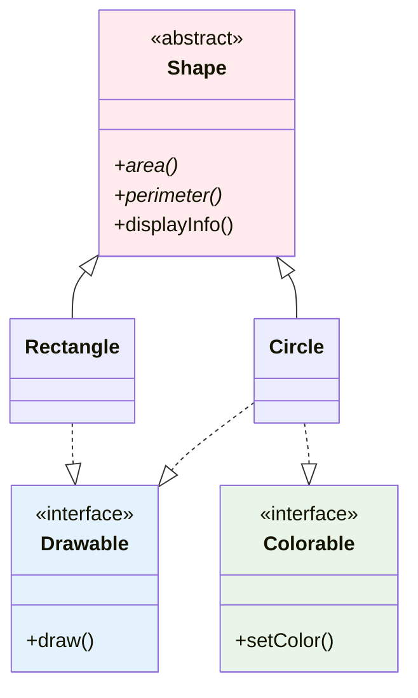

# Abstraction and Interfaces

**Why This Matters**: Abstraction and interfaces are the foundation of flexible, maintainable code. They enable polymorphism, reduce coupling, allow multiple inheritance, and are essential for frameworks, APIs, and large-scale applications. Critical for professional Java development.

**Core Concepts**:
- **Abstract Classes**: Partial implementations that can't be instantiated directly
- **Interfaces**: Pure contracts defining what classes must implement
- **Abstraction**: Hide complexity, expose only what's necessary



Abstraction creates flexible hierarchies where shared behavior is defined once and specific implementations vary.

## Abstract Classes

Abstract classes cannot be instantiated but can contain both abstract and concrete methods:

```java
public abstract class BankAccount {
    protected String accountNumber;
    protected String accountHolder;
    protected double balance;
    protected double interestRate;
    
    public BankAccount(String accountNumber, String accountHolder, double initialBalance) {
        this.accountNumber = accountNumber;
        this.accountHolder = accountHolder;
        this.balance = initialBalance;
    }
    
    // Abstract methods - must be implemented by subclasses
    public abstract void calculateInterest();
    public abstract double getMinimumBalance();
    public abstract double getTransactionFee(double amount);
    
    // Concrete methods - can be used by all subclasses
    public void deposit(double amount) {
        if (amount > 0) {
            balance += amount;
            System.out.printf("Deposited $%.2f to %s\n", amount, accountNumber);
        } else {
            System.out.println("Deposit amount must be positive");
        }
    }
    
    public boolean withdraw(double amount) {
        double fee = getTransactionFee(amount);
        double totalDeduction = amount + fee;
        
        if (amount > 0 && (balance - totalDeduction) >= getMinimumBalance()) {
            balance -= totalDeduction;
            System.out.printf("Withdrew $%.2f (fee: $%.2f) from %s\n", amount, fee, accountNumber);
            return true;
        } else {
            System.out.printf("Cannot withdraw $%.2f from %s (insufficient funds or below minimum)\n", 
                            amount, accountNumber);
            return false;
        }
    }
    
    // Template method pattern - defines algorithm structure
    public void performMonthlyMaintenance() {
        System.out.println("=== Monthly Maintenance for " + accountNumber + " ===");
        calculateInterest();
        applyMaintenanceFee();
        generateStatement();
        System.out.println("Balance after maintenance: $" + String.format("%.2f", balance));
    }
    
    // Protected methods for subclass use
    protected void applyMaintenanceFee() {
        double fee = getMaintenanceFee();
        if (fee > 0) {
            balance -= fee;
            System.out.printf("Applied maintenance fee: $%.2f\n", fee);
        }
    }
    
    protected double getMaintenanceFee() {
        return 5.0; // Default maintenance fee
    }
    
    protected void generateStatement() {
        System.out.println("Statement generated for " + accountHolder);
    }
    
    // Getters
    public double getBalance() { return balance; }
    public String getAccountNumber() { return accountNumber; }
    public String getAccountHolder() { return accountHolder; }
    public double getInterestRate() { return interestRate; }
}
```

### Concrete Implementations

```java
public class SavingsAccount extends BankAccount {
    private static final double MINIMUM_BALANCE = 100.0;
    private static final double INTEREST_RATE = 0.02; // 2% annual
    
    public SavingsAccount(String accountNumber, String accountHolder, double initialBalance) {
        super(accountNumber, accountHolder, initialBalance);
        this.interestRate = INTEREST_RATE;
    }
    
    @Override
    public void calculateInterest() {
        double monthlyInterest = balance * (interestRate / 12);
        balance += monthlyInterest;
        System.out.printf("Interest earned: $%.2f\n", monthlyInterest);
    }
    
    @Override
    public double getMinimumBalance() {
        return MINIMUM_BALANCE;
    }
    
    @Override
    public double getTransactionFee(double amount) {
        return 0.0; // No transaction fees for savings accounts
    }
}

public class CheckingAccount extends BankAccount {
    private static final double MINIMUM_BALANCE = 0.0;
    private static final double INTEREST_RATE = 0.001; // 0.1% annual
    private int freeTransactionsPerMonth = 10;
    private int transactionsThisMonth = 0;
    
    public CheckingAccount(String accountNumber, String accountHolder, double initialBalance) {
        super(accountNumber, accountHolder, initialBalance);
        this.interestRate = INTEREST_RATE;
    }
    
    @Override
    public void calculateInterest() {
        if (balance > 1000) { // Interest only on balances over $1000
            double monthlyInterest = balance * (interestRate / 12);
            balance += monthlyInterest;
            System.out.printf("Interest earned: $%.2f\n", monthlyInterest);
        } else {
            System.out.println("No interest earned (balance below $1000)");
        }
    }
    
    @Override
    public double getMinimumBalance() {
        return MINIMUM_BALANCE;
    }
    
    @Override
    public double getTransactionFee(double amount) {
        transactionsThisMonth++;
        return transactionsThisMonth > freeTransactionsPerMonth ? 1.50 : 0.0;
    }
    
    @Override
    protected double getMaintenanceFee() {
        return balance < 500 ? 12.0 : 0.0; // Fee for low balance
    }
    
    public void resetMonthlyTransactions() {
        transactionsThisMonth = 0;
    }
}

public class PremiumAccount extends BankAccount {
    private static final double MINIMUM_BALANCE = 10000.0;
    private static final double INTEREST_RATE = 0.035; // 3.5% annual
    
    public PremiumAccount(String accountNumber, String accountHolder, double initialBalance) {
        super(accountNumber, accountHolder, initialBalance);
        this.interestRate = INTEREST_RATE;
    }
    
    @Override
    public void calculateInterest() {
        double monthlyInterest = balance * (interestRate / 12);
        balance += monthlyInterest;
        System.out.printf("Premium interest earned: $%.2f\n", monthlyInterest);
    }
    
    @Override
    public double getMinimumBalance() {
        return MINIMUM_BALANCE;
    }
    
    @Override
    public double getTransactionFee(double amount) {
        return 0.0; // No fees for premium accounts
    }
    
    @Override
    protected double getMaintenanceFee() {
        return 0.0; // No maintenance fees for premium accounts
    }
}
```

## Interfaces

Interfaces define contracts that implementing classes must fulfill:

```java
// Pure interface - only method signatures (pre-Java 8 style)
public interface Drawable {
    void draw();
    void erase();
    void move(double x, double y);
}

// Modern interface with default and static methods (Java 8+)
public interface Resizable {
    // Abstract methods
    void resize(double scale);
    double getArea();
    
    // Default method - provides implementation
    default void resizeToArea(double targetArea) {
        double currentArea = getArea();
        if (currentArea > 0) {
            double scale = Math.sqrt(targetArea / currentArea);
            resize(scale);
            System.out.printf("Resized to target area %.2f (scale: %.2f)\n", targetArea, scale);
        }
    }
    
    default void doubleSize() {
        resize(2.0);
        System.out.println("Size doubled");
    }
    
    // Static method - utility method related to the interface
    static boolean isValidScale(double scale) {
        return scale > 0 && scale <= 10.0;
    }
    
    static void printResizeInfo() {
        System.out.println("Resizable objects can be scaled between 0.1x and 10.0x");
    }
}

// Interface with constants
public interface ColorConstants {
    // All fields in interfaces are public, static, and final by default
    String RED = "#FF0000";
    String GREEN = "#00FF00";
    String BLUE = "#0000FF";
    String BLACK = "#000000";
    String WHITE = "#FFFFFF";
    
    double OPACITY_TRANSPARENT = 0.0;
    double OPACITY_OPAQUE = 1.0;
}
```

### Implementing Multiple Interfaces

```java
public class Rectangle implements Drawable, Resizable, ColorConstants {
    private double width;
    private double height;
    private double x, y; // Position
    private String color;
    
    public Rectangle(double width, double height, double x, double y) {
        this.width = width;
        this.height = height;
        this.x = x;
        this.y = y;
        this.color = BLACK; // Use interface constant
    }
    
    // Implementing Drawable interface
    @Override
    public void draw() {
        System.out.printf("Drawing rectangle at (%.1f, %.1f) with dimensions %.1fx%.1f in color %s\n",
                         x, y, width, height, color);
    }
    
    @Override
    public void erase() {
        System.out.printf("Erasing rectangle at (%.1f, %.1f)\n", x, y);
    }
    
    @Override
    public void move(double newX, double newY) {
        System.out.printf("Moving rectangle from (%.1f, %.1f) to (%.1f, %.1f)\n", 
                         x, y, newX, newY);
        this.x = newX;
        this.y = newY;
    }
    
    // Implementing Resizable interface
    @Override
    public void resize(double scale) {
        if (Resizable.isValidScale(scale)) {
            width *= scale;
            height *= scale;
            System.out.printf("Rectangle resized by %.2fx to %.1fx%.1f\n", scale, width, height);
        } else {
            System.out.println("Invalid scale factor: " + scale);
        }
    }
    
    @Override
    public double getArea() {
        return width * height;
    }
    
    // Can override default methods if needed
    @Override
    public void doubleSize() {
        System.out.println("Doubling rectangle size with enhanced logging:");
        double oldArea = getArea();
        Resizable.super.doubleSize(); // Call default implementation
        double newArea = getArea();
        System.out.printf("Area increased from %.2f to %.2f\n", oldArea, newArea);
    }
    
    // Additional methods
    public void setColor(String color) {
        this.color = color;
    }
    
    public String toString() {
        return String.format("Rectangle[%.1fx%.1f at (%.1f, %.1f), area=%.2f]", 
                           width, height, x, y, getArea());
    }
}

public class Circle implements Drawable, Resizable {
    private double radius;
    private double centerX, centerY;
    private String color;
    
    public Circle(double radius, double centerX, double centerY) {
        this.radius = radius;
        this.centerX = centerX;
        this.centerY = centerY;
        this.color = ColorConstants.BLUE;
    }
    
    @Override
    public void draw() {
        System.out.printf("Drawing circle at (%.1f, %.1f) with radius %.1f in color %s\n",
                         centerX, centerY, radius, color);
    }
    
    @Override
    public void erase() {
        System.out.printf("Erasing circle at (%.1f, %.1f)\n", centerX, centerY);
    }
    
    @Override
    public void move(double newX, double newY) {
        System.out.printf("Moving circle from (%.1f, %.1f) to (%.1f, %.1f)\n",
                         centerX, centerY, newX, newY);
        this.centerX = newX;
        this.centerY = newY;
    }
    
    @Override
    public void resize(double scale) {
        if (Resizable.isValidScale(scale)) {
            radius *= scale;
            System.out.printf("Circle resized by %.2fx, new radius: %.1f\n", scale, radius);
        } else {
            System.out.println("Invalid scale factor: " + scale);
        }
    }
    
    @Override
    public double getArea() {
        return Math.PI * radius * radius;
    }
    
    public String toString() {
        return String.format("Circle[radius=%.1f at (%.1f, %.1f), area=%.2f]", 
                           radius, centerX, centerY, getArea());
    }
}
```

### Using Multiple Interfaces

```java
public class ShapeManager {
    private List<Drawable> drawableShapes;
    private List<Resizable> resizableShapes;
    
    public ShapeManager() {
        drawableShapes = new ArrayList<>();
        resizableShapes = new ArrayList<>();
    }
    
    public void addShape(Object shape) {
        if (shape instanceof Drawable) {
            drawableShapes.add((Drawable) shape);
        }
        if (shape instanceof Resizable) {
            resizableShapes.add((Resizable) shape);
        }
    }
    
    public void drawAllShapes() {
        System.out.println("=== Drawing All Shapes ===");
        for (Drawable shape : drawableShapes) {
            shape.draw();
        }
    }
    
    public void resizeAllShapes(double scale) {
        System.out.println("=== Resizing All Shapes ===");
        for (Resizable shape : resizableShapes) {
            shape.resize(scale);
        }
    }
    
    public void calculateTotalArea() {
        double total = 0;
        for (Resizable shape : resizableShapes) {
            total += shape.getArea();
        }
        System.out.printf("Total area of all shapes: %.2f\n", total);
    }
    
    public void moveAllShapes(double deltaX, double deltaY) {
        System.out.println("=== Moving All Shapes ===");
        for (Drawable shape : drawableShapes) {
            // Get current position would require additional interface methods
            // For demo, just move to delta positions
            shape.move(deltaX, deltaY);
        }
    }
}

public class InterfaceDemo {
    public static void main(String[] args) {
        ShapeManager manager = new ShapeManager();
        
        Rectangle rect = new Rectangle(5.0, 3.0, 0.0, 0.0);
        Circle circle = new Circle(2.0, 10.0, 10.0);
        
        manager.addShape(rect);
        manager.addShape(circle);
        
        System.out.println("Initial shapes:");
        System.out.println(rect);
        System.out.println(circle);
        System.out.println();
        
        manager.drawAllShapes();
        System.out.println();
        
        manager.calculateTotalArea();
        System.out.println();
        
        // Use default methods
        rect.doubleSize();
        circle.resizeToArea(50.0);
        System.out.println();
        
        manager.calculateTotalArea();
        System.out.println();
        
        // Static method usage
        Resizable.printResizeInfo();
        System.out.println("Valid scale 1.5: " + Resizable.isValidScale(1.5));
        System.out.println("Valid scale 15.0: " + Resizable.isValidScale(15.0));
        
        // Test invalid scale
        System.out.println();
        rect.resize(15.0); // Should print error message
    }
}
```

## Functional Interfaces and Lambda Expressions

Functional interfaces have exactly one abstract method and can be used with lambda expressions:

```java
// Functional interface annotation (optional but recommended)
@FunctionalInterface
public interface Calculator {
    double calculate(double a, double b);
    
    // Default and static methods don't count toward the "one abstract method" rule
    default void printResult(double a, double b) {
        double result = calculate(a, b);
        System.out.printf("%.2f calculated from %.2f and %.2f\n", result, a, b);
    }
    
    static Calculator getAddition() {
        return (a, b) -> a + b;
    }
}

@FunctionalInterface
public interface Validator<T> {
    boolean validate(T item);
    
    // Compose validators
    default Validator<T> and(Validator<T> other) {
        return item -> this.validate(item) && other.validate(item);
    }
    
    default Validator<T> or(Validator<T> other) {
        return item -> this.validate(item) || other.validate(item);
    }
    
    default Validator<T> negate() {
        return item -> !this.validate(item);
    }
}

@FunctionalInterface
public interface Processor<T, R> {
    R process(T input);
    
    // Chain processors
    default <V> Processor<T, V> then(Processor<R, V> after) {
        return input -> after.process(this.process(input));
    }
}
```

### Lambda Expressions in Practice

```java
public class LambdaDemo {
    public static void main(String[] args) {
        // Traditional anonymous inner class
        Calculator traditionalAddition = new Calculator() {
            @Override
            public double calculate(double a, double b) {
                return a + b;
            }
        };
        
        // Lambda expressions - much more concise
        Calculator addition = (a, b) -> a + b;
        Calculator subtraction = (a, b) -> a - b;
        Calculator multiplication = (a, b) -> a * b;
        Calculator division = (a, b) -> b != 0 ? a / b : Double.NaN;
        Calculator power = (a, b) -> Math.pow(a, b);
        
        // Using lambdas
        System.out.println("=== Calculator Operations ===");
        testCalculator(addition, 10, 5, "Addition");
        testCalculator(subtraction, 10, 5, "Subtraction");
        testCalculator(multiplication, 10, 5, "Multiplication");
        testCalculator(division, 10, 5, "Division");
        testCalculator(power, 2, 8, "Power");
        
        // More complex lambda with block body
        Calculator complexOperation = (a, b) -> {
            System.out.println("Performing complex calculation...");
            double intermediate = Math.sqrt(a * a + b * b);
            return Math.round(intermediate * 100.0) / 100.0; // Round to 2 decimals
        };
        
        testCalculator(complexOperation, 3, 4, "Distance Calculation");
        
        // Validators with lambdas
        System.out.println("\n=== Validation Examples ===");
        
        Validator<String> notEmpty = s -> s != null && !s.trim().isEmpty();
        Validator<String> minLength = s -> s.length() >= 3;
        Validator<String> hasUpperCase = s -> s.chars().anyMatch(Character::isUpperCase);
        
        // Compose validators
        Validator<String> strongValidator = notEmpty.and(minLength).and(hasUpperCase);
        
        testValidator(strongValidator, "Hi", "Strong Validator");
        testValidator(strongValidator, "Hello", "Strong Validator");
        testValidator(strongValidator, "Hello World", "Strong Validator");
        
        // Number validators
        Validator<Integer> positive = n -> n > 0;
        Validator<Integer> even = n -> n % 2 == 0;
        Validator<Integer> inRange = n -> n >= 1 && n <= 100;
        
        Validator<Integer> complexNumberValidator = positive.and(even).and(inRange);
        
        testValidator(complexNumberValidator, -5, "Complex Number Validator");
        testValidator(complexNumberValidator, 7, "Complex Number Validator");
        testValidator(complexNumberValidator, 42, "Complex Number Validator");
        
        // Processors with method chaining
        System.out.println("\n=== Processor Chain Examples ===");
        
        Processor<String, String> toLowerCase = String::toLowerCase;
        Processor<String, String> removeSpaces = s -> s.replaceAll("\\s+", "");
        Processor<String, Integer> getLength = String::length;
        
        // Chain processors
        Processor<String, Integer> processText = toLowerCase
            .then(removeSpaces)
            .then(getLength);
        
        String input = "Hello World Programming";
        int result = processText.process(input);
        System.out.printf("Processed '%s' -> %d characters\n", input, result);
        
        // Built-in functional interfaces
        demonstrateBuiltInInterfaces();
    }
    
    private static void testCalculator(Calculator calc, double a, double b, String operation) {
        System.out.printf("%s: %.2f\n", operation, calc.calculate(a, b));
    }
    
    private static <T> void testValidator(Validator<T> validator, T item, String validatorName) {
        boolean isValid = validator.validate(item);
        System.out.printf("%s - '%s': %s\n", validatorName, item, isValid ? "VALID" : "INVALID");
    }
    
    private static void demonstrateBuiltInInterfaces() {
        System.out.println("\n=== Built-in Functional Interfaces ===");
        
        // Predicate<T> - test condition
        List<Integer> numbers = Arrays.asList(1, 2, 3, 4, 5, 6, 7, 8, 9, 10);
        
        // Filter even numbers
        List<Integer> evenNumbers = numbers.stream()
            .filter(n -> n % 2 == 0)  // Predicate<Integer>
            .collect(Collectors.toList());
        System.out.println("Even numbers: " + evenNumbers);
        
        // Function<T, R> - transform input to output
        List<String> numberStrings = numbers.stream()
            .map(n -> "Number: " + n)  // Function<Integer, String>
            .collect(Collectors.toList());
        System.out.println("Transformed: " + numberStrings.subList(0, 3) + "...");
        
        // Consumer<T> - consume input without return
        System.out.print("Numbers: ");
        numbers.forEach(n -> System.out.print(n + " ")); // Consumer<Integer>
        System.out.println();
        
        // Supplier<T> - supply value without input
        Supplier<Double> randomSupplier = () -> Math.random();
        System.out.printf("Random values: %.3f, %.3f, %.3f\n", 
                         randomSupplier.get(), randomSupplier.get(), randomSupplier.get());
        
        // BinaryOperator<T> - combine two values of same type
        BinaryOperator<Integer> max = (a, b) -> a > b ? a : b;
        Optional<Integer> maximum = numbers.stream().reduce(max);
        System.out.println("Maximum: " + maximum.orElse(0));
    }
}
```

## Advanced Interface Features

### Interface Evolution with Default Methods

```java
// Original interface (version 1.0)
public interface MediaPlayer {
    void play(String filename);
    void stop();
}

// Version 2.0 - adding new methods with default implementations
public interface MediaPlayer {
    void play(String filename);
    void stop();
    
    // New methods with default implementations - won't break existing code
    default void pause() {
        System.out.println("Pause not supported, stopping instead");
        stop();
    }
    
    default void setVolume(double volume) {
        System.out.printf("Setting volume to %.1f (default implementation)\n", volume);
    }
    
    default void showPlaylist() {
        System.out.println("Playlist: No playlist support in default implementation");
    }
    
    // Static utility methods
    static boolean isValidVolume(double volume) {
        return volume >= 0.0 && volume <= 1.0;
    }
    
    static String[] getSupportedFormats() {
        return new String[]{"mp3", "wav", "flac", "ogg"};
    }
}

// Existing implementation continues to work
public class BasicPlayer implements MediaPlayer {
    @Override
    public void play(String filename) {
        System.out.println("Playing: " + filename);
    }
    
    @Override
    public void stop() {
        System.out.println("Stopped playback");
    }
    
    // Automatically gets default implementations of new methods
}

// New implementation can override defaults
public class AdvancedPlayer implements MediaPlayer {
    private boolean isPaused = false;
    private double currentVolume = 0.5;
    private List<String> playlist = new ArrayList<>();
    
    @Override
    public void play(String filename) {
        if (isPaused) {
            System.out.println("Resuming: " + filename);
            isPaused = false;
        } else {
            System.out.println("Now playing: " + filename);
        }
    }
    
    @Override
    public void stop() {
        System.out.println("Playback stopped");
        isPaused = false;
    }
    
    @Override
    public void pause() {
        if (!isPaused) {
            System.out.println("Playback paused");
            isPaused = true;
        }
    }
    
    @Override
    public void setVolume(double volume) {
        if (MediaPlayer.isValidVolume(volume)) {
            this.currentVolume = volume;
            System.out.printf("Volume set to %.1f\n", volume);
        } else {
            System.out.println("Invalid volume level");
        }
    }
    
    public void addToPlaylist(String filename) {
        playlist.add(filename);
    }
    
    @Override
    public void showPlaylist() {
        if (playlist.isEmpty()) {
            System.out.println("Playlist is empty");
        } else {
            System.out.println("Playlist: " + String.join(", ", playlist));
        }
    }
}
```

### Multiple Inheritance Conflicts

```java
interface A {
    default void commonMethod() {
        System.out.println("Method from interface A");
    }
}

interface B {
    default void commonMethod() {
        System.out.println("Method from interface B");
    }
}

// Must resolve conflict explicitly
public class ConflictResolver implements A, B {
    @Override
    public void commonMethod() {
        // Choose which default to use, or provide custom implementation
        System.out.println("Resolving conflict:");
        A.super.commonMethod();  // Call A's default
        B.super.commonMethod();  // Call B's default
        System.out.println("Custom resolution complete");
    }
}
```

## Real-World Example: Plugin Architecture

```java
// Plugin interface
public interface DataProcessor {
    String getName();
    String getVersion();
    boolean canProcess(String dataType);
    Object process(Object data);
    
    default String getDescription() {
        return getName() + " v" + getVersion();
    }
    
    default void initialize() {
        System.out.println("Initializing " + getName());
    }
    
    default void cleanup() {
        System.out.println("Cleaning up " + getName());
    }
}

// JSON processor plugin
public class JsonProcessor implements DataProcessor {
    @Override
    public String getName() {
        return "JSON Processor";
    }
    
    @Override
    public String getVersion() {
        return "1.2.0";
    }
    
    @Override
    public boolean canProcess(String dataType) {
        return "json".equalsIgnoreCase(dataType);
    }
    
    @Override
    public Object process(Object data) {
        if (data instanceof String) {
            String jsonData = (String) data;
            System.out.println("Processing JSON data: " + jsonData.substring(0, Math.min(50, jsonData.length())) + "...");
            // Simulate JSON processing
            return "Processed JSON: " + jsonData.toUpperCase();
        }
        throw new IllegalArgumentException("Expected String JSON data");
    }
}

// XML processor plugin
public class XmlProcessor implements DataProcessor {
    @Override
    public String getName() {
        return "XML Processor";
    }
    
    @Override
    public String getVersion() {
        return "2.1.0";
    }
    
    @Override
    public boolean canProcess(String dataType) {
        return "xml".equalsIgnoreCase(dataType);
    }
    
    @Override
    public Object process(Object data) {
        if (data instanceof String) {
            String xmlData = (String) data;
            System.out.println("Processing XML data: " + xmlData.substring(0, Math.min(50, xmlData.length())) + "...");
            // Simulate XML processing
            return "Processed XML: " + xmlData.replace("<", "[").replace(">", "]");
        }
        throw new IllegalArgumentException("Expected String XML data");
    }
    
    @Override
    public void initialize() {
        DataProcessor.super.initialize();
        System.out.println("XML processor configured with enhanced parsing");
    }
}

// Plugin manager
public class PluginManager {
    private List<DataProcessor> processors;
    
    public PluginManager() {
        processors = new ArrayList<>();
    }
    
    public void registerProcessor(DataProcessor processor) {
        processor.initialize();
        processors.add(processor);
        System.out.println("Registered: " + processor.getDescription());
    }
    
    public Object processData(String dataType, Object data) {
        for (DataProcessor processor : processors) {
            if (processor.canProcess(dataType)) {
                System.out.println("Using " + processor.getName() + " for " + dataType);
                return processor.process(data);
            }
        }
        throw new UnsupportedOperationException("No processor found for data type: " + dataType);
    }
    
    public void listProcessors() {
        System.out.println("=== Available Processors ===");
        processors.forEach(p -> System.out.println("- " + p.getDescription()));
    }
    
    public void shutdown() {
        System.out.println("Shutting down plugin manager...");
        processors.forEach(DataProcessor::cleanup);
    }
}

public class PluginDemo {
    public static void main(String[] args) {
        PluginManager manager = new PluginManager();
        
        // Register plugins
        manager.registerProcessor(new JsonProcessor());
        manager.registerProcessor(new XmlProcessor());
        
        System.out.println();
        manager.listProcessors();
        System.out.println();
        
        // Process different data types
        String jsonData = "{\"name\": \"John\", \"age\": 30}";
        String xmlData = "<person><name>Jane</name><age>25</age></person>";
        
        try {
            Object jsonResult = manager.processData("json", jsonData);
            System.out.println("Result: " + jsonResult);
            System.out.println();
            
            Object xmlResult = manager.processData("xml", xmlData);
            System.out.println("Result: " + xmlResult);
            System.out.println();
            
            // Try unsupported type
            manager.processData("csv", "name,age\nJohn,30");
        } catch (UnsupportedOperationException e) {
            System.out.println("Error: " + e.getMessage());
        }
        
        System.out.println();
        manager.shutdown();
    }
}
```

## Best Practices

### 1. Choose Abstract Classes vs Interfaces Wisely

```java
// Use abstract class when:
// - You have common state and behavior
// - You want to provide some implemented methods
// - You need non-public members
abstract class AbstractDocument {
    protected String title;
    protected Date createdDate;
    
    protected abstract void format();
    
    // Common implementation
    public final void save() {
        format();
        // save logic here
    }
}

// Use interface when:
// - You're defining a contract
// - You need multiple inheritance
// - You want to support lambda expressions (functional interface)
interface Printable {
    void print();
}
```

### 2. Functional Interface Design

```java
// Good: Single, clear purpose
@FunctionalInterface
public interface PriceCalculator {
    double calculate(double basePrice, double discount);
}

// Bad: Multiple responsibilities
// @FunctionalInterface  // Would cause compile error
public interface BadInterface {
    void doSomething();
    void doSomethingElse(); // Violates single abstract method rule
}
```

### 3. Default Method Usage

```java
// Good: Backward compatibility
interface Collection<T> {
    // Existing methods...
    
    // Added in Java 8 without breaking existing implementations
    default Stream<T> stream() {
        return StreamSupport.stream(spliterator(), false);
    }
}

// Bad: Complex logic in default methods
interface BadExample {
    default void complexLogic() {
        // 50 lines of complex code...
        // Default methods should be simple
    }
}
```

## Performance Considerations

Interface calls use dynamic dispatch, which has slight overhead compared to direct method calls. However, this is usually negligible and the flexibility benefits far outweigh the performance cost.

## Next Steps

Abstraction and interfaces provide the foundation for flexible, maintainable designs. In Part 12, we'll explore packages and modularity - organizing your code into logical units and managing dependencies in large applications. You'll learn how to structure projects professionally and use Java's module system introduced in Java 9.