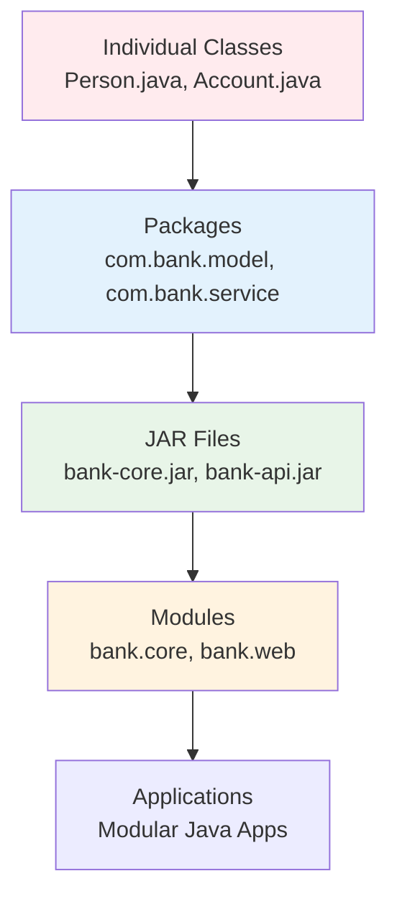
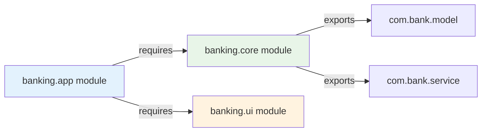

# Packages and Modularity

**Why This Matters**: Packages are essential for organizing large applications, preventing naming conflicts, and controlling access. The module system enables building maintainable, secure applications with explicit dependencies. Critical for enterprise development and library creation.

**Core Concepts**:
- **Packages**: Organize classes, prevent naming conflicts, control access
- **Modules**: Group packages, declare dependencies explicitly, improve security
- **Encapsulation**: Hide internal implementation, expose only public APIs





Packages and modules create clean architectural boundaries and explicit dependency management.

## Understanding Packages

Packages group related classes and interfaces, prevent naming conflicts, and provide access control:

### Package Declaration and Structure

```java
// File: dev/codersbox/banking/Account.java
package com.codersbox.banking;

import java.util.Date;
import java.util.UUID;

public class Account {
    private String accountId;
    private String accountHolder;
    private double balance;
    private Date createdDate;
    
    public Account(String accountHolder, double initialBalance) {
        this.accountId = UUID.randomUUID().toString();
        this.accountHolder = accountHolder;
        this.balance = initialBalance;
        this.createdDate = new Date();
    }
    
    // Package-private method - accessible within same package
    void updateBalance(double newBalance) {
        this.balance = newBalance;
    }
    
    // Public methods
    public String getAccountId() { return accountId; }
    public String getAccountHolder() { return accountHolder; }
    public double getBalance() { return balance; }
    public Date getCreatedDate() { return createdDate; }
    
    @Override
    public String toString() {
        return String.format("Account[id=%s, holder=%s, balance=$%.2f]", 
                           accountId.substring(0, 8) + "...", accountHolder, balance);
    }
}

// File: dev/codersbox/banking/BankingService.java
package com.codersbox.banking;

import java.util.*;

public class BankingService {
    private Map<String, Account> accounts;
    private static BankingService instance;
    
    private BankingService() {
        accounts = new HashMap<>();
    }
    
    // Singleton pattern
    public static synchronized BankingService getInstance() {
        if (instance == null) {
            instance = new BankingService();
        }
        return instance;
    }
    
    public Account createAccount(String accountHolder, double initialBalance) {
        if (initialBalance < 0) {
            throw new IllegalArgumentException("Initial balance cannot be negative");
        }
        
        Account account = new Account(accountHolder, initialBalance);
        accounts.put(account.getAccountId(), account);
        System.out.println("Created account: " + account);
        return account;
    }
    
    public boolean transfer(String fromAccountId, String toAccountId, double amount) {
        Account fromAccount = accounts.get(fromAccountId);
        Account toAccount = accounts.get(toAccountId);
        
        if (fromAccount == null || toAccount == null) {
            System.out.println("Transfer failed: Account not found");
            return false;
        }
        
        if (fromAccount.getBalance() < amount) {
            System.out.println("Transfer failed: Insufficient funds");
            return false;
        }
        
        // Using package-private method
        fromAccount.updateBalance(fromAccount.getBalance() - amount);
        toAccount.updateBalance(toAccount.getBalance() + amount);
        
        System.out.printf("Transferred $%.2f from %s to %s\n", 
                         amount, fromAccount.getAccountHolder(), toAccount.getAccountHolder());
        return true;
    }
    
    public List<Account> getAllAccounts() {
        return new ArrayList<>(accounts.values());
    }
    
    public Account getAccount(String accountId) {
        return accounts.get(accountId);
    }
}

// File: dev/codersbox/banking/TransactionRecord.java
package com.codersbox.banking;

import java.util.Date;

// Package-private class - only accessible within banking package
class TransactionRecord {
    private String fromAccountId;
    private String toAccountId;
    private double amount;
    private Date timestamp;
    private TransactionType type;
    
    public TransactionRecord(String fromAccountId, String toAccountId, double amount, TransactionType type) {
        this.fromAccountId = fromAccountId;
        this.toAccountId = toAccountId;
        this.amount = amount;
        this.type = type;
        this.timestamp = new Date();
    }
    
    // Getters
    public String getFromAccountId() { return fromAccountId; }
    public String getToAccountId() { return toAccountId; }
    public double getAmount() { return amount; }
    public Date getTimestamp() { return timestamp; }
    public TransactionType getType() { return type; }
    
    @Override
    public String toString() {
        return String.format("Transaction[%s: $%.2f from %s to %s at %s]", 
                           type, amount, fromAccountId, toAccountId, timestamp);
    }
}

// File: dev/codersbox/banking/TransactionType.java
package com.codersbox.banking;

public enum TransactionType {
    DEPOSIT("Deposit"),
    WITHDRAWAL("Withdrawal"),
    TRANSFER("Transfer"),
    FEE("Fee");
    
    private final String displayName;
    
    TransactionType(String displayName) {
        this.displayName = displayName;
    }
    
    public String getDisplayName() {
        return displayName;
    }
}
```

### Using Different Packages

```java
// File: dev/codersbox/ui/BankingApp.java
package com.codersbox.ui;

// Import specific classes
import com.codersbox.banking.Account;
import com.codersbox.banking.BankingService;
import com.codersbox.banking.TransactionType;

// Import all classes from a package (not recommended for production)
// import com.codersbox.banking.*;

// Import static methods
import static java.lang.System.out;
import static java.lang.Math.round;

import java.util.Scanner;

public class BankingApp {
    private BankingService bankingService;
    private Scanner scanner;
    
    public BankingApp() {
        bankingService = BankingService.getInstance();
        scanner = new Scanner(System.in);
    }
    
    public void start() {
        out.println("=== Welcome to CodersBox Banking ===");
        
        // Create some demo accounts
        Account alice = bankingService.createAccount("Alice Johnson", 1000.0);
        Account bob = bankingService.createAccount("Bob Smith", 500.0);
        Account charlie = bankingService.createAccount("Charlie Brown", 750.0);
        
        displayMenu();
        
        while (true) {
            out.print("\nEnter choice: ");
            int choice = scanner.nextInt();
            scanner.nextLine(); // Consume newline
            
            switch (choice) {
                case 1: listAccounts(); break;
                case 2: performTransfer(); break;
                case 3: showAccountDetails(); break;
                case 4: 
                    out.println("Thank you for using CodersBox Banking!");
                    return;
                default:
                    out.println("Invalid choice. Please try again.");
            }
        }
    }
    
    private void displayMenu() {
        out.println("\n1. List all accounts");
        out.println("2. Transfer money");
        out.println("3. Show account details");
        out.println("4. Exit");
    }
    
    private void listAccounts() {
        out.println("\n=== All Accounts ===");
        bankingService.getAllAccounts().forEach(out::println);
    }
    
    private void performTransfer() {
        out.println("\n=== Money Transfer ===");
        listAccounts();
        
        out.print("Enter source account ID (first 8 chars): ");
        String fromPrefix = scanner.nextLine();
        
        out.print("Enter destination account ID (first 8 chars): ");
        String toPrefix = scanner.nextLine();
        
        out.print("Enter amount to transfer: $");
        double amount = scanner.nextDouble();
        scanner.nextLine();
        
        // Find accounts by ID prefix (simplified for demo)
        Account fromAccount = findAccountByPrefix(fromPrefix);
        Account toAccount = findAccountByPrefix(toPrefix);
        
        if (fromAccount != null && toAccount != null) {
            bankingService.transfer(fromAccount.getAccountId(), toAccount.getAccountId(), amount);
        } else {
            out.println("Could not find one or both accounts.");
        }
    }
    
    private void showAccountDetails() {
        out.println("\n=== Account Details ===");
        listAccounts();
        
        out.print("Enter account ID prefix: ");
        String prefix = scanner.nextLine();
        
        Account account = findAccountByPrefix(prefix);
        if (account != null) {
            out.println("\nDetailed Account Information:");
            out.println("ID: " + account.getAccountId());
            out.println("Holder: " + account.getAccountHolder());
            out.printf("Balance: $%.2f%n", account.getBalance());
            out.println("Created: " + account.getCreatedDate());
        } else {
            out.println("Account not found.");
        }
    }
    
    private Account findAccountByPrefix(String prefix) {
        return bankingService.getAllAccounts().stream()
            .filter(account -> account.getAccountId().startsWith(prefix))
            .findFirst()
            .orElse(null);
    }
    
    public static void main(String[] args) {
        new BankingApp().start();
    }
}

// File: dev/codersbox/util/StringHelper.java
package com.codersbox.util;

public class StringHelper {
    private StringHelper() {} // Utility class - prevent instantiation
    
    public static String capitalize(String input) {
        if (input == null || input.isEmpty()) {
            return input;
        }
        return input.substring(0, 1).toUpperCase() + input.substring(1).toLowerCase();
    }
    
    public static String formatCurrency(double amount) {
        return String.format("$%.2f", amount);
    }
    
    public static String truncate(String input, int maxLength) {
        if (input == null || input.length() <= maxLength) {
            return input;
        }
        return input.substring(0, maxLength - 3) + "...";
    }
    
    public static boolean isValidEmail(String email) {
        return email != null && email.contains("@") && email.contains(".");
    }
}

// File: dev/codersbox/util/DateHelper.java
package com.codersbox.util;

import java.text.SimpleDateFormat;
import java.util.Date;

public class DateHelper {
    private static final SimpleDateFormat DATE_FORMAT = new SimpleDateFormat("yyyy-MM-dd");
    private static final SimpleDateFormat DATETIME_FORMAT = new SimpleDateFormat("yyyy-MM-dd HH:mm:ss");
    
    private DateHelper() {} // Utility class
    
    public static String formatDate(Date date) {
        return date != null ? DATE_FORMAT.format(date) : "N/A";
    }
    
    public static String formatDateTime(Date date) {
        return date != null ? DATETIME_FORMAT.format(date) : "N/A";
    }
    
    public static boolean isToday(Date date) {
        if (date == null) return false;
        
        Date today = new Date();
        return formatDate(date).equals(formatDate(today));
    }
}
```

### Directory Structure

```
src/
└── com/
    └── codersbox/
        ├── banking/
        │   ├── Account.java
        │   ├── BankingService.java
        │   ├── TransactionRecord.java
        │   └── TransactionType.java
        ├── ui/
        │   └── BankingApp.java
        └── util/
            ├── StringHelper.java
            └── DateHelper.java
```

## Import Statements

### Types of Imports

```java
package com.codersbox.demo;

// 1. Single class import (preferred)
import java.util.ArrayList;
import java.util.HashMap;
import java.util.List;

// 2. Wildcard import (use sparingly)
import java.io.*; // Imports all classes from java.io

// 3. Static imports for constants and utility methods
import static java.lang.Math.PI;
import static java.lang.Math.sqrt;
import static java.lang.System.out;

// 4. Static wildcard import (use very sparingly)
import static java.lang.Math.*;

public class ImportDemo {
    public void demonstrateImports() {
        // Using imported classes
        List<String> list = new ArrayList<>(); // ArrayList imported explicitly
        HashMap<String, Integer> map = new HashMap<>(); // HashMap imported explicitly
        
        // Using wildcard imports
        try {
            FileReader reader = new FileReader("test.txt"); // From java.io.*
        } catch (FileNotFoundException e) { // From java.io.*
            out.println("File not found"); // static import of System.out
        }
        
        // Using static imports
        double circumference = 2 * PI * 5.0; // PI imported statically
        double distance = sqrt(25); // sqrt imported statically
        
        out.printf("Circumference: %.2f, Distance: %.2f%n", circumference, distance);
    }
}
```

### Import Best Practices

```java
// Good: Explicit imports
import java.util.ArrayList;
import java.util.HashMap;
import java.util.List;
import java.util.Map;

// Avoid: Wildcard imports in production code
// import java.util.*;

// Good: Static imports for commonly used utilities
import static org.junit.Assert.assertEquals;
import static org.junit.Assert.assertTrue;

// Avoid: Too many static imports
// import static java.lang.Math.*;
// import static java.util.Collections.*;

public class ImportBestPractices {
    // Class implementation
}
```

## Access Control with Packages

### Access Modifier Summary

```java
// File: dev/codersbox/access/AccessDemo.java
package com.codersbox.access;

public class AccessDemo {
    private int privateField = 1;        // Only within this class
    int packageField = 2;                // Within this package (default)
    protected int protectedField = 3;    // Within package + subclasses
    public int publicField = 4;          // Everywhere
    
    private void privateMethod() {
        System.out.println("Private method - only within AccessDemo");
    }
    
    void packageMethod() {
        System.out.println("Package method - within com.codersbox.access package");
    }
    
    protected void protectedMethod() {
        System.out.println("Protected method - within package + subclasses");
    }
    
    public void publicMethod() {
        System.out.println("Public method - accessible everywhere");
    }
    
    public void demonstrateAccess() {
        // All accessible within same class
        System.out.println("Private field: " + privateField);
        System.out.println("Package field: " + packageField);
        System.out.println("Protected field: " + protectedField);
        System.out.println("Public field: " + publicField);
        
        privateMethod();
        packageMethod();
        protectedMethod();
        publicMethod();
    }
}

// File: dev/codersbox/access/SamePackageAccess.java
package com.codersbox.access;

public class SamePackageAccess {
    public void testAccess() {
        AccessDemo demo = new AccessDemo();
        
        // System.out.println(demo.privateField);   // ERROR: Not accessible
        System.out.println(demo.packageField);     // OK: Same package
        System.out.println(demo.protectedField);   // OK: Same package
        System.out.println(demo.publicField);      // OK: Public
        
        // demo.privateMethod();   // ERROR: Not accessible
        demo.packageMethod();     // OK: Same package
        demo.protectedMethod();   // OK: Same package
        demo.publicMethod();      // OK: Public
    }
}
```

### Different Package Access

```java
// File: dev/codersbox/external/ExternalAccess.java
package com.codersbox.external;

import com.codersbox.access.AccessDemo;

public class ExternalAccess {
    public void testAccess() {
        AccessDemo demo = new AccessDemo();
        
        // System.out.println(demo.privateField);   // ERROR: Not accessible
        // System.out.println(demo.packageField);   // ERROR: Different package
        // System.out.println(demo.protectedField); // ERROR: Different package, not subclass
        System.out.println(demo.publicField);      // OK: Public
        
        // demo.privateMethod();   // ERROR: Not accessible
        // demo.packageMethod();   // ERROR: Different package
        // demo.protectedMethod(); // ERROR: Different package, not subclass
        demo.publicMethod();      // OK: Public
    }
}

// File: dev/codersbox/external/SubclassAccess.java
package com.codersbox.external;

import com.codersbox.access.AccessDemo;

public class SubclassAccess extends AccessDemo {
    public void testAccess() {
        // System.out.println(privateField);   // ERROR: Not accessible
        // System.out.println(packageField);   // ERROR: Different package
        System.out.println(protectedField);   // OK: Subclass can access protected
        System.out.println(publicField);      // OK: Public
        
        // privateMethod();   // ERROR: Not accessible
        // packageMethod();   // ERROR: Different package
        protectedMethod();   // OK: Subclass can access protected
        publicMethod();      // OK: Public
    }
}
```

## Creating and Using JAR Files

### Building JAR Files

```bash
# Compile all Java files
javac -d build src/dev/codersbox/*/*.java

# Create JAR file with manifest
jar cfm banking-app.jar manifest.txt -C build .

# Alternative: Create JAR with main class specified
jar cfe banking-app.jar com.codersbox.ui.BankingApp -C build .
```

### Manifest File (manifest.txt)

```
Manifest-Version: 1.0
Main-Class: com.codersbox.ui.BankingApp
Class-Path: lib/commons-lang3.jar lib/gson.jar
Created-By: CodersBox Banking System
```

### Using JAR Files

```bash
# Run JAR file
java -jar banking-app.jar

# Add JAR to classpath
java -cp "banking-app.jar:other-lib.jar" com.codersbox.ui.BankingApp

# Extract JAR contents
jar xf banking-app.jar
```

### Programmatic JAR Creation

```java
// File: dev/codersbox/build/JarBuilder.java
package com.codersbox.build;

import java.io.*;
import java.util.jar.*;
import java.nio.file.*;
import java.util.zip.ZipEntry;

public class JarBuilder {
    public static void createJar(String jarFileName, String sourceDirectory, String mainClass) {
        try {
            // Create manifest
            Manifest manifest = new Manifest();
            manifest.getMainAttributes().put(Attributes.Name.MANIFEST_VERSION, "1.0");
            if (mainClass != null) {
                manifest.getMainAttributes().put(Attributes.Name.MAIN_CLASS, mainClass);
            }
            
            // Create JAR file
            try (JarOutputStream jarOut = new JarOutputStream(
                    new FileOutputStream(jarFileName), manifest)) {
                
                Path sourcePath = Paths.get(sourceDirectory);
                Files.walk(sourcePath)
                    .filter(Files::isRegularFile)
                    .forEach(file -> addFileToJar(jarOut, sourcePath, file));
            }
            
            System.out.println("JAR file created: " + jarFileName);
            
        } catch (IOException e) {
            System.err.println("Error creating JAR: " + e.getMessage());
        }
    }
    
    private static void addFileToJar(JarOutputStream jarOut, Path basePath, Path file) {
        try {
            String relativePath = basePath.relativize(file).toString().replace("\\", "/");
            ZipEntry entry = new ZipEntry(relativePath);
            jarOut.putNextEntry(entry);
            
            Files.copy(file, jarOut);
            jarOut.closeEntry();
            
        } catch (IOException e) {
            System.err.println("Error adding file to JAR: " + e.getMessage());
        }
    }
    
    public static void main(String[] args) {
        createJar("my-banking-app.jar", "build", "com.codersbox.ui.BankingApp");
    }
}
```

## Java Module System (Java 9+)

### Module Declaration

```java
// File: src/banking/module-info.java
module com.codersbox.banking {
    // Export packages to other modules
    exports com.codersbox.banking;
    exports com.codersbox.banking.types;
    
    // Don't export internal packages
    // com.codersbox.banking.internal is not exported
    
    // Require other modules
    requires java.base; // Implicit - always required
    requires java.logging;
    
    // Optional dependency
    requires static java.desktop; // Optional at runtime
    
    // Transitive dependency - modules requiring this module also get java.sql
    requires transitive java.sql;
    
    // Service provider
    provides com.codersbox.banking.spi.AccountValidator 
        with com.codersbox.banking.internal.DefaultAccountValidator;
    
    // Service consumer
    uses com.codersbox.banking.spi.PaymentProcessor;
}
```

### Module Structure

```
banking-system/
├── banking-core/
│   └── src/
│       ├── module-info.java
│       └── dev/codersbox/banking/
├── banking-ui/
│   └── src/
│       ├── module-info.java
│       └── dev/codersbox/banking/ui/
├── banking-persistence/
│   └── src/
│       ├── module-info.java
│       └── dev/codersbox/banking/persistence/
└── banking-app/
    └── src/
        ├── module-info.java
        └── dev/codersbox/banking/app/
```

### Banking Core Module

```java
// File: banking-core/src/module-info.java
module com.codersbox.banking.core {
    exports com.codersbox.banking.core.model;
    exports com.codersbox.banking.core.service;
    exports com.codersbox.banking.core.exception;
    
    requires java.logging;
    requires transitive java.sql; // Clients also get java.sql
}

// File: banking-core/src/dev/codersbox/banking/core/model/Account.java
package com.codersbox.banking.core.model;

import java.math.BigDecimal;
import java.time.LocalDateTime;
import java.util.Objects;

public class Account {
    private final String accountId;
    private final String accountHolder;
    private BigDecimal balance;
    private final LocalDateTime createdAt;
    
    public Account(String accountId, String accountHolder, BigDecimal initialBalance) {
        this.accountId = Objects.requireNonNull(accountId, "Account ID cannot be null");
        this.accountHolder = Objects.requireNonNull(accountHolder, "Account holder cannot be null");
        this.balance = Objects.requireNonNull(initialBalance, "Initial balance cannot be null");
        this.createdAt = LocalDateTime.now();
        
        if (initialBalance.compareTo(BigDecimal.ZERO) < 0) {
            throw new IllegalArgumentException("Initial balance cannot be negative");
        }
    }
    
    // Getters and business methods
    public String getAccountId() { return accountId; }
    public String getAccountHolder() { return accountHolder; }
    public BigDecimal getBalance() { return balance; }
    public LocalDateTime getCreatedAt() { return createdAt; }
    
    public synchronized void deposit(BigDecimal amount) {
        if (amount.compareTo(BigDecimal.ZERO) <= 0) {
            throw new IllegalArgumentException("Deposit amount must be positive");
        }
        balance = balance.add(amount);
    }
    
    public synchronized boolean withdraw(BigDecimal amount) {
        if (amount.compareTo(BigDecimal.ZERO) <= 0) {
            throw new IllegalArgumentException("Withdrawal amount must be positive");
        }
        if (balance.compareTo(amount) >= 0) {
            balance = balance.subtract(amount);
            return true;
        }
        return false;
    }
    
    @Override
    public boolean equals(Object obj) {
        if (this == obj) return true;
        if (!(obj instanceof Account)) return false;
        Account account = (Account) obj;
        return Objects.equals(accountId, account.accountId);
    }
    
    @Override
    public int hashCode() {
        return Objects.hash(accountId);
    }
    
    @Override
    public String toString() {
        return String.format("Account[id=%s, holder=%s, balance=%s]", 
                           accountId, accountHolder, balance);
    }
}

// File: banking-core/src/dev/codersbox/banking/core/service/BankingService.java
package com.codersbox.banking.core.service;

import com.codersbox.banking.core.model.Account;
import com.codersbox.banking.core.exception.InsufficientFundsException;
import com.codersbox.banking.core.exception.AccountNotFoundException;

import java.math.BigDecimal;
import java.util.*;
import java.util.concurrent.ConcurrentHashMap;
import java.util.logging.Logger;

public class BankingService {
    private static final Logger LOGGER = Logger.getLogger(BankingService.class.getName());
    private final Map<String, Account> accounts = new ConcurrentHashMap<>();
    
    public Account createAccount(String accountHolder, BigDecimal initialBalance) {
        String accountId = UUID.randomUUID().toString();
        Account account = new Account(accountId, accountHolder, initialBalance);
        accounts.put(accountId, account);
        
        LOGGER.info("Created account: " + accountId + " for " + accountHolder);
        return account;
    }
    
    public Account getAccount(String accountId) {
        Account account = accounts.get(accountId);
        if (account == null) {
            throw new AccountNotFoundException("Account not found: " + accountId);
        }
        return account;
    }
    
    public void transfer(String fromAccountId, String toAccountId, BigDecimal amount) {
        Account fromAccount = getAccount(fromAccountId);
        Account toAccount = getAccount(toAccountId);
        
        // Ensure consistent locking order to prevent deadlock
        Account firstLock = fromAccount.getAccountId().compareTo(toAccount.getAccountId()) < 0 
                           ? fromAccount : toAccount;
        Account secondLock = firstLock == fromAccount ? toAccount : fromAccount;
        
        synchronized (firstLock) {
            synchronized (secondLock) {
                if (!fromAccount.withdraw(amount)) {
                    throw new InsufficientFundsException("Insufficient funds in account: " + fromAccountId);
                }
                toAccount.deposit(amount);
            }
        }
        
        LOGGER.info(String.format("Transferred %s from %s to %s", amount, fromAccountId, toAccountId));
    }
    
    public List<Account> getAllAccounts() {
        return new ArrayList<>(accounts.values());
    }
}
```

### Banking UI Module

```java
// File: banking-ui/src/module-info.java
module com.codersbox.banking.ui {
    requires com.codersbox.banking.core;
    requires java.desktop;
    
    exports com.codersbox.banking.ui;
}

// File: banking-ui/src/dev/codersbox/banking/ui/BankingUI.java
package com.codersbox.banking.ui;

import com.codersbox.banking.core.model.Account;
import com.codersbox.banking.core.service.BankingService;

import java.math.BigDecimal;
import java.util.Scanner;

public class BankingUI {
    private final BankingService bankingService;
    private final Scanner scanner;
    
    public BankingUI() {
        this.bankingService = new BankingService();
        this.scanner = new Scanner(System.in);
    }
    
    public void start() {
        System.out.println("=== Modular Banking System ===");
        
        while (true) {
            displayMenu();
            int choice = scanner.nextInt();
            scanner.nextLine(); // Consume newline
            
            try {
                switch (choice) {
                    case 1: createAccount(); break;
                    case 2: viewAccount(); break;
                    case 3: performTransfer(); break;
                    case 4: listAllAccounts(); break;
                    case 5: 
                        System.out.println("Goodbye!");
                        return;
                    default:
                        System.out.println("Invalid choice.");
                }
            } catch (Exception e) {
                System.err.println("Error: " + e.getMessage());
            }
        }
    }
    
    private void displayMenu() {
        System.out.println("\n1. Create Account");
        System.out.println("2. View Account");
        System.out.println("3. Transfer Money");
        System.out.println("4. List All Accounts");
        System.out.println("5. Exit");
        System.out.print("Choice: ");
    }
    
    private void createAccount() {
        System.out.print("Account holder name: ");
        String name = scanner.nextLine();
        
        System.out.print("Initial balance: $");
        BigDecimal balance = new BigDecimal(scanner.nextLine());
        
        Account account = bankingService.createAccount(name, balance);
        System.out.println("Account created: " + account.getAccountId());
    }
    
    private void viewAccount() {
        System.out.print("Account ID: ");
        String accountId = scanner.nextLine();
        
        Account account = bankingService.getAccount(accountId);
        System.out.println(account);
    }
    
    private void performTransfer() {
        System.out.print("From Account ID: ");
        String fromId = scanner.nextLine();
        
        System.out.print("To Account ID: ");
        String toId = scanner.nextLine();
        
        System.out.print("Amount: $");
        BigDecimal amount = new BigDecimal(scanner.nextLine());
        
        bankingService.transfer(fromId, toId, amount);
        System.out.println("Transfer completed.");
    }
    
    private void listAllAccounts() {
        System.out.println("\n=== All Accounts ===");
        bankingService.getAllAccounts().forEach(System.out::println);
    }
    
    public static void main(String[] args) {
        new BankingUI().start();
    }
}
```

### Building and Running Modules

```bash
# Compile modules
javac -d out --module-source-path src -m com.codersbox.banking.core,com.codersbox.banking.ui

# Create modular JARs
jar --create --file lib/banking-core.jar --module-version=1.0 -C out/com.codersbox.banking.core .
jar --create --file lib/banking-ui.jar --module-version=1.0 -C out/com.codersbox.banking.ui .

# Run modular application
java --module-path lib -m com.codersbox.banking.ui/com.codersbox.banking.ui.BankingUI
```

## Package Naming Conventions

### Standard Conventions

```java
// Company/Organization domain (reversed)
package com.codersbox.banking;
package org.apache.commons.lang;
package edu.stanford.nlp.parser;

// Project-specific naming
package com.codersbox.banking.core.model;    // Core business models
package com.codersbox.banking.core.service;  // Business services
package com.codersbox.banking.core.repository; // Data access
package com.codersbox.banking.web.controller; // Web controllers
package com.codersbox.banking.web.dto;       // Data transfer objects
package com.codersbox.banking.util;          // Utilities
package com.codersbox.banking.config;        // Configuration
package com.codersbox.banking.exception;     // Custom exceptions

// Avoid
package banking;           // Too generic
package com.MyCompany;     // Wrong capitalization
package com.123company;    // Invalid - starts with number
```

## Performance Considerations

### Classpath Management

```bash
# Efficient classpath - specific JARs
java -cp "app.jar:lib/gson.jar:lib/commons-lang3.jar" MainClass

# Inefficient - wildcard can slow startup
java -cp "app.jar:lib/*" MainClass

# Module path (Java 9+) - better performance
java --module-path lib -m myapp/com.example.MainClass
```

### Package Loading

```java
// Lazy loading example
public class ResourceManager {
    private static SomeHeavyResource heavyResource;
    
    // Only loaded when actually needed
    public static synchronized SomeHeavyResource getHeavyResource() {
        if (heavyResource == null) {
            heavyResource = new SomeHeavyResource();
        }
        return heavyResource;
    }
}
```

## Best Practices

1. **Use reverse domain naming** for package names
2. **Keep packages cohesive** - related classes together
3. **Minimize dependencies** between packages
4. **Use explicit imports** instead of wildcards
5. **Follow access modifier principles** - most restrictive first
6. **Document package purposes** in package-info.java
7. **Use modules** for large applications (Java 9+)
8. **Avoid circular dependencies** between packages

## Common Pitfalls

### 1. Circular Dependencies
```java
// Bad: Package A depends on Package B, Package B depends on Package A
// Solution: Create a common package or use interfaces

// Good: Use common interfaces
package com.codersbox.common;
public interface Service { }

package com.codersbox.service1;
public class Service1 implements Service { }

package com.codersbox.service2;
public class Service2 implements Service { }
```

### 2. Inappropriate Access Levels
```java
// Bad: Everything public
public class BadDesign {
    public int internalState; // Should be private
    public void internalMethod() { } // Should be private
}

// Good: Appropriate access levels
public class GoodDesign {
    private int internalState;
    private void internalMethod() { }
    public void publicAPI() { }
}
```

## Next Steps

In the next part, we’ll move into Exception Handling and then I/O Streams, building on how packages and modules structure your code and dependencies.