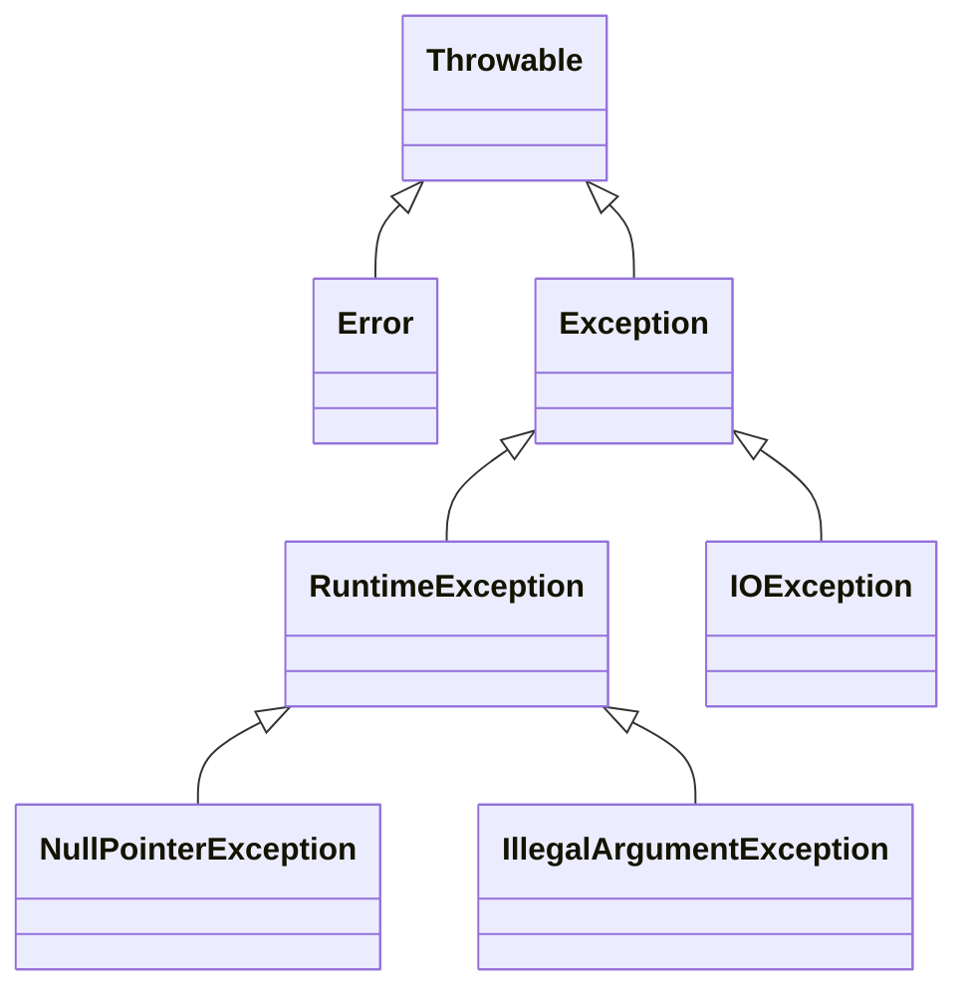

# Exception Handling

A simplified view of the exception hierarchy:


Exception handling is Java's mechanism for dealing with runtime errors and exceptional conditions. It allows programs to gracefully handle errors, recover when possible, and provide meaningful feedback to users.

## Understanding Exceptions

### Exception Hierarchy

```java
// Java Exception Hierarchy (simplified)
/*
Throwable
├── Error (JVM errors - shouldn't catch)
│   ├── OutOfMemoryError
│   ├── StackOverflowError
│   └── VirtualMachineError
└── Exception
    ├── RuntimeException (Unchecked)
    │   ├── NullPointerException
    │   ├── IllegalArgumentException
    │   ├── IndexOutOfBoundsException
    │   └── ClassCastException
    └── Checked Exceptions
        ├── IOException
        ├── SQLException
        ├── ClassNotFoundException
        └── ParseException
*/

// Demonstration of common exceptions
public class ExceptionTypes {
    public static void demonstrateExceptions() {
        // 1. NullPointerException (Runtime/Unchecked)
        try {
            String str = null;
            int length = str.length(); // Throws NullPointerException
        } catch (NullPointerException e) {
            System.out.println("Caught NullPointerException: " + e.getMessage());
        }
        
        // 2. ArrayIndexOutOfBoundsException (Runtime/Unchecked)
        try {
            int[] array = {1, 2, 3};
            int value = array[5]; // Throws ArrayIndexOutOfBoundsException
        } catch (ArrayIndexOutOfBoundsException e) {
            System.out.println("Caught ArrayIndexOutOfBoundsException: " + e.getMessage());
        }
        
        // 3. IllegalArgumentException (Runtime/Unchecked)
        try {
            int result = divide(10, 0); // Our method will throw IllegalArgumentException
        } catch (IllegalArgumentException e) {
            System.out.println("Caught IllegalArgumentException: " + e.getMessage());
        }
        
        // 4. ClassCastException (Runtime/Unchecked)
        try {
            Object obj = "Hello";
            Integer num = (Integer) obj; // Throws ClassCastException
        } catch (ClassCastException e) {
            System.out.println("Caught ClassCastException: " + e.getMessage());
        }
    }
    
    private static int divide(int a, int b) {
        if (b == 0) {
            throw new IllegalArgumentException("Division by zero is not allowed");
        }
        return a / b;
    }
}
```

## Try-Catch-Finally Blocks

### Basic Try-Catch

```java
import java.util.Scanner;
import java.util.InputMismatchException;

public class BasicExceptionHandling {
    public static void main(String[] args) {
        Scanner scanner = new Scanner(System.in);
        
        // Simple try-catch
        try {
            System.out.print("Enter a number: ");
            int number = scanner.nextInt();
            System.out.println("You entered: " + number);
            
        } catch (InputMismatchException e) {
            System.out.println("That's not a valid number!");
            scanner.nextLine(); // Clear the invalid input
        }
        
        // Multiple catch blocks
        try {
            System.out.print("Enter first number: ");
            int num1 = scanner.nextInt();
            
            System.out.print("Enter second number: ");
            int num2 = scanner.nextInt();
            
            int result = num1 / num2;
            System.out.println("Result: " + result);
            
        } catch (InputMismatchException e) {
            System.out.println("Please enter valid integers!");
            
        } catch (ArithmeticException e) {
            System.out.println("Cannot divide by zero!");
            
        } catch (Exception e) {
            System.out.println("An unexpected error occurred: " + e.getMessage());
        }
        
        scanner.close();
    }
}
```

### Try-Catch-Finally

```java
import java.io.*;
import java.util.logging.Logger;

public class TryCatchFinallyDemo {
    private static final Logger LOGGER = Logger.getLogger(TryCatchFinallyDemo.class.getName());
    
    public static String readFileContent(String filename) {
        FileReader fileReader = null;
        BufferedReader bufferedReader = null;
        StringBuilder content = new StringBuilder();
        
        try {
            fileReader = new FileReader(filename);
            bufferedReader = new BufferedReader(fileReader);
            
            String line;
            while ((line = bufferedReader.readLine()) != null) {
                content.append(line).append("\n");
            }
            
            LOGGER.info("Successfully read file: " + filename);
            return content.toString();
            
        } catch (FileNotFoundException e) {
            LOGGER.severe("File not found: " + filename);
            return "File not found: " + filename;
            
        } catch (IOException e) {
            LOGGER.severe("Error reading file: " + e.getMessage());
            return "Error reading file: " + e.getMessage();
            
        } finally {
            // This block always executes, regardless of exceptions
            System.out.println("Cleaning up resources...");
            
            try {
                if (bufferedReader != null) {
                    bufferedReader.close();
                }
                if (fileReader != null) {
                    fileReader.close();
                }
            } catch (IOException e) {
                LOGGER.warning("Error closing file resources: " + e.getMessage());
            }
        }
    }
    
    public static void demonstrateFinallyBehavior() {
        System.out.println("=== Finally Block Behavior ===");
        
        // Case 1: Normal execution
        try {
            System.out.println("Normal execution");
            return; // Finally still executes!
        } finally {
            System.out.println("Finally block executed after return");
        }
    }
    
    public static int finallyWithReturn() {
        try {
            return 1;
        } catch (Exception e) {
            return 2;
        } finally {
            // This changes the return value!
            return 3; // Not recommended - masks the original return
        }
    }
    
    public static void main(String[] args) {
        // Test file reading
        String content = readFileContent("test.txt");
        System.out.println("File content: " + content);
        
        // Test finally behavior
        demonstrateFinallyBehavior();
        
        // Test finally with return
        System.out.println("Finally with return result: " + finallyWithReturn()); // Returns 3
    }
}
```

## Try-With-Resources (Java 7+)

### Automatic Resource Management

```java
import java.io.*;
import java.nio.file.*;
import java.util.Scanner;

public class TryWithResourcesDemo {
    
    // Before Java 7 - Manual resource management
    public static String readFileOldWay(String filename) {
        FileReader fileReader = null;
        BufferedReader bufferedReader = null;
        
        try {
            fileReader = new FileReader(filename);
            bufferedReader = new BufferedReader(fileReader);
            
            StringBuilder content = new StringBuilder();
            String line;
            while ((line = bufferedReader.readLine()) != null) {
                content.append(line).append("\n");
            }
            return content.toString();
            
        } catch (IOException e) {
            System.err.println("Error reading file: " + e.getMessage());
            return null;
            
        } finally {
            // Manual cleanup - error-prone
            if (bufferedReader != null) {
                try {
                    bufferedReader.close();
                } catch (IOException e) {
                    System.err.println("Error closing BufferedReader: " + e.getMessage());
                }
            }
            if (fileReader != null) {
                try {
                    fileReader.close();
                } catch (IOException e) {
                    System.err.println("Error closing FileReader: " + e.getMessage());
                }
            }
        }
    }
    
    // Java 7+ - Automatic resource management
    public static String readFileNewWay(String filename) {
        try (FileReader fileReader = new FileReader(filename);
             BufferedReader bufferedReader = new BufferedReader(fileReader)) {
            
            StringBuilder content = new StringBuilder();
            String line;
            while ((line = bufferedReader.readLine()) != null) {
                content.append(line).append("\n");
            }
            return content.toString();
            
        } catch (IOException e) {
            System.err.println("Error reading file: " + e.getMessage());
            return null;
        }
        // Resources are automatically closed here, even if exception occurs
    }
    
    // Multiple resources in try-with-resources
    public static void copyFile(String sourcePath, String destPath) {
        try (InputStream source = Files.newInputStream(Paths.get(sourcePath));
             OutputStream dest = Files.newOutputStream(Paths.get(destPath))) {
            
            byte[] buffer = new byte[4096];
            int bytesRead;
            
            while ((bytesRead = source.read(buffer)) != -1) {
                dest.write(buffer, 0, bytesRead);
            }
            
            System.out.println("File copied successfully from " + sourcePath + " to " + destPath);
            
        } catch (IOException e) {
            System.err.println("Error copying file: " + e.getMessage());
        }
    }
    
    // Custom resource that implements AutoCloseable
    public static class DatabaseConnection implements AutoCloseable {
        private final String connectionString;
        private boolean isConnected;
        
        public DatabaseConnection(String connectionString) {
            this.connectionString = connectionString;
            this.isConnected = true;
            System.out.println("Connected to database: " + connectionString);
        }
        
        public void executeQuery(String query) {
            if (!isConnected) {
                throw new IllegalStateException("Connection is closed");
            }
            System.out.println("Executing query: " + query);
            
            // Simulate query execution
            try {
                Thread.sleep(100);
            } catch (InterruptedException e) {
                Thread.currentThread().interrupt();
            }
        }
        
        @Override
        public void close() {
            if (isConnected) {
                isConnected = false;
                System.out.println("Database connection closed: " + connectionString);
            }
        }
        
        public boolean isConnected() {
            return isConnected;
        }
    }
    
    public static void demonstrateCustomResource() {
        // Custom resource automatically closed
        try (DatabaseConnection db = new DatabaseConnection("jdbc:mysql://localhost/testdb")) {
            
            db.executeQuery("SELECT * FROM users");
            db.executeQuery("SELECT * FROM orders");
            
            // Exception here will still close the connection
            if (Math.random() > 0.5) {
                throw new RuntimeException("Simulated database error");
            }
            
        } catch (RuntimeException e) {
            System.out.println("Caught exception: " + e.getMessage());
        }
        // Connection is automatically closed here
    }
    
    public static void main(String[] args) {
        // Create a test file
        try (PrintWriter writer = new PrintWriter("test-file.txt")) {
            writer.println("Line 1: Hello World");
            writer.println("Line 2: Java Exception Handling");
            writer.println("Line 3: Try-with-resources");
        } catch (FileNotFoundException e) {
            System.err.println("Could not create test file: " + e.getMessage());
        }
        
        // Read file using new way
        String content = readFileNewWay("test-file.txt");
        if (content != null) {
            System.out.println("File content:\n" + content);
        }
        
        // Demonstrate custom resource
        demonstrateCustomResource();
        
        // Clean up test file
        try {
            Files.deleteIfExists(Paths.get("test-file.txt"));
        } catch (IOException e) {
            System.err.println("Could not delete test file: " + e.getMessage());
        }
    }
}
```

## Custom Exceptions

### Creating Custom Exception Classes

```java
// Custom checked exception
public class InsufficientFundsException extends Exception {
    private final double currentBalance;
    private final double requestedAmount;
    
    public InsufficientFundsException(double currentBalance, double requestedAmount) {
        super(String.format("Insufficient funds: Current balance %.2f, requested %.2f", 
                           currentBalance, requestedAmount));
        this.currentBalance = currentBalance;
        this.requestedAmount = requestedAmount;
    }
    
    public InsufficientFundsException(String message, double currentBalance, double requestedAmount) {
        super(message);
        this.currentBalance = currentBalance;
        this.requestedAmount = requestedAmount;
    }
    
    public InsufficientFundsException(String message, Throwable cause, double currentBalance, double requestedAmount) {
        super(message, cause);
        this.currentBalance = currentBalance;
        this.requestedAmount = requestedAmount;
    }
    
    public double getCurrentBalance() { return currentBalance; }
    public double getRequestedAmount() { return requestedAmount; }
    public double getShortfall() { return requestedAmount - currentBalance; }
}

// Custom unchecked exception
public class InvalidAccountNumberException extends RuntimeException {
    private final String accountNumber;
    
    public InvalidAccountNumberException(String accountNumber) {
        super("Invalid account number: " + accountNumber);
        this.accountNumber = accountNumber;
    }
    
    public InvalidAccountNumberException(String accountNumber, String message) {
        super(message);
        this.accountNumber = accountNumber;
    }
    
    public InvalidAccountNumberException(String accountNumber, String message, Throwable cause) {
        super(message, cause);
        this.accountNumber = accountNumber;
    }
    
    public String getAccountNumber() { return accountNumber; }
}

// Business exception hierarchy
public abstract class BankingException extends Exception {
    private final String errorCode;
    private final long timestamp;
    
    protected BankingException(String errorCode, String message) {
        super(message);
        this.errorCode = errorCode;
        this.timestamp = System.currentTimeMillis();
    }
    
    protected BankingException(String errorCode, String message, Throwable cause) {
        super(message, cause);
        this.errorCode = errorCode;
        this.timestamp = System.currentTimeMillis();
    }
    
    public String getErrorCode() { return errorCode; }
    public long getTimestamp() { return timestamp; }
    
    public abstract String getErrorCategory();
}

public class AccountNotFoundBankingException extends BankingException {
    private final String accountId;
    
    public AccountNotFoundBankingException(String accountId) {
        super("ACC_NOT_FOUND", "Account not found: " + accountId);
        this.accountId = accountId;
    }
    
    @Override
    public String getErrorCategory() {
        return "ACCOUNT_MANAGEMENT";
    }
    
    public String getAccountId() { return accountId; }
}

public class TransactionException extends BankingException {
    private final String transactionId;
    private final String transactionType;
    
    public TransactionException(String transactionId, String transactionType, String message) {
        super("TRANS_ERROR", message);
        this.transactionId = transactionId;
        this.transactionType = transactionType;
    }
    
    @Override
    public String getErrorCategory() {
        return "TRANSACTION";
    }
    
    public String getTransactionId() { return transactionId; }
    public String getTransactionType() { return transactionType; }
}
```

### Using Custom Exceptions

```java
import java.util.*;
import java.util.concurrent.ConcurrentHashMap;
import java.util.logging.Logger;

public class BankAccount {
    private static final Logger LOGGER = Logger.getLogger(BankAccount.class.getName());
    
    private final String accountNumber;
    private final String accountHolder;
    private double balance;
    private final List<String> transactionHistory;
    
    public BankAccount(String accountNumber, String accountHolder, double initialBalance) {
        if (!isValidAccountNumber(accountNumber)) {
            throw new InvalidAccountNumberException(accountNumber, 
                "Account number must be 8-12 digits");
        }
        
        if (accountHolder == null || accountHolder.trim().isEmpty()) {
            throw new IllegalArgumentException("Account holder name cannot be empty");
        }
        
        if (initialBalance < 0) {
            throw new IllegalArgumentException("Initial balance cannot be negative");
        }
        
        this.accountNumber = accountNumber;
        this.accountHolder = accountHolder;
        this.balance = initialBalance;
        this.transactionHistory = new ArrayList<>();
        
        addTransaction("Account opened with balance: $" + initialBalance);
    }
    
    public synchronized void deposit(double amount) {
        if (amount <= 0) {
            throw new IllegalArgumentException("Deposit amount must be positive");
        }
        
        balance += amount;
        addTransaction("Deposited: $" + amount + " | Balance: $" + balance);
        LOGGER.info("Deposited $" + amount + " to account " + accountNumber);
    }
    
    public synchronized void withdraw(double amount) throws InsufficientFundsException {
        if (amount <= 0) {
            throw new IllegalArgumentException("Withdrawal amount must be positive");
        }
        
        if (balance < amount) {
            throw new InsufficientFundsException(balance, amount);
        }
        
        balance -= amount;
        addTransaction("Withdrew: $" + amount + " | Balance: $" + balance);
        LOGGER.info("Withdrew $" + amount + " from account " + accountNumber);
    }
    
    public synchronized void transfer(BankAccount toAccount, double amount) 
            throws InsufficientFundsException, TransactionException {
        
        String transactionId = UUID.randomUUID().toString();
        
        try {
            // Validate transfer
            if (toAccount == null) {
                throw new TransactionException(transactionId, "TRANSFER", 
                    "Destination account cannot be null");
            }
            
            if (amount <= 0) {
                throw new TransactionException(transactionId, "TRANSFER", 
                    "Transfer amount must be positive");
            }
            
            if (this == toAccount) {
                throw new TransactionException(transactionId, "TRANSFER", 
                    "Cannot transfer to the same account");
            }
            
            // Check funds
            if (balance < amount) {
                throw new InsufficientFundsException(balance, amount);
            }
            
            // Perform transfer (ensure atomic operation)
            balance -= amount;
            toAccount.balance += amount;
            
            // Record transactions
            addTransaction("Transfer OUT: $" + amount + " to " + toAccount.accountNumber + 
                         " | Balance: $" + balance);
            toAccount.addTransaction("Transfer IN: $" + amount + " from " + accountNumber + 
                                   " | Balance: $" + toAccount.balance);
            
            LOGGER.info("Transfer completed: $" + amount + " from " + accountNumber + 
                       " to " + toAccount.accountNumber);
            
        } catch (Exception e) {
            LOGGER.severe("Transfer failed for transaction " + transactionId + ": " + e.getMessage());
            throw e;
        }
    }
    
    private void addTransaction(String transaction) {
        String timestampedTransaction = new Date() + ": " + transaction;
        transactionHistory.add(timestampedTransaction);
        
        // Keep only last 100 transactions
        if (transactionHistory.size() > 100) {
            transactionHistory.remove(0);
        }
    }
    
    private static boolean isValidAccountNumber(String accountNumber) {
        return accountNumber != null && 
               accountNumber.matches("\\d{8,12}") && // 8-12 digits
               !accountNumber.equals("000000000"); // Not all zeros
    }
    
    // Getters
    public String getAccountNumber() { return accountNumber; }
    public String getAccountHolder() { return accountHolder; }
    public synchronized double getBalance() { return balance; }
    public List<String> getTransactionHistory() { return new ArrayList<>(transactionHistory); }
    
    @Override
    public String toString() {
        return String.format("BankAccount[number=%s, holder=%s, balance=$%.2f]", 
                           accountNumber, accountHolder, balance);
    }
}

public class Banking {
    private final Map<String, BankAccount> accounts;
    private static final Logger LOGGER = Logger.getLogger(Banking.class.getName());
    
    public Banking() {
        this.accounts = new ConcurrentHashMap<>();
    }
    
    public BankAccount createAccount(String accountNumber, String accountHolder, double initialBalance) {
        try {
            if (accounts.containsKey(accountNumber)) {
                throw new IllegalArgumentException("Account already exists: " + accountNumber);
            }
            
            BankAccount account = new BankAccount(accountNumber, accountHolder, initialBalance);
            accounts.put(accountNumber, account);
            
            LOGGER.info("Created account: " + accountNumber + " for " + accountHolder);
            return account;
            
        } catch (InvalidAccountNumberException e) {
            LOGGER.warning("Failed to create account with invalid number: " + e.getAccountNumber());
            throw e;
        }
    }
    
    public BankAccount getAccount(String accountNumber) throws AccountNotFoundBankingException {
        BankAccount account = accounts.get(accountNumber);
        if (account == null) {
            throw new AccountNotFoundBankingException(accountNumber);
        }
        return account;
    }
    
    public void transferMoney(String fromAccountNumber, String toAccountNumber, double amount) 
            throws AccountNotFoundBankingException, InsufficientFundsException, TransactionException {
        
        BankAccount fromAccount = getAccount(fromAccountNumber);
        BankAccount toAccount = getAccount(toAccountNumber);
        
        fromAccount.transfer(toAccount, amount);
    }
    
    public List<BankAccount> getAllAccounts() {
        return new ArrayList<>(accounts.values());
    }
}
```

## Exception Handling Best Practices

### Comprehensive Example

```java
import java.io.*;
import java.net.*;
import java.util.logging.*;

public class ExceptionBestPractices {
    private static final Logger LOGGER = Logger.getLogger(ExceptionBestPractices.class.getName());
    
    // 1. Be specific with exception types
    public void processFile(String filename) {
        try (BufferedReader reader = new BufferedReader(new FileReader(filename))) {
            
            String line;
            int lineNumber = 0;
            
            while ((line = reader.readLine()) != null) {
                lineNumber++;
                processLine(line, lineNumber);
            }
            
        } catch (FileNotFoundException e) {
            // Specific handling for file not found
            LOGGER.severe("File not found: " + filename);
            throw new IllegalArgumentException("Required file missing: " + filename, e);
            
        } catch (SecurityException e) {
            // Specific handling for security issues
            LOGGER.severe("Permission denied accessing file: " + filename);
            throw new RuntimeException("Access denied to file: " + filename, e);
            
        } catch (IOException e) {
            // General I/O problems
            LOGGER.severe("I/O error processing file: " + filename + " - " + e.getMessage());
            throw new RuntimeException("Failed to process file: " + filename, e);
        }
    }
    
    // 2. Validate inputs early
    public double calculateInterest(double principal, double rate, int years) {
        // Fail fast with clear error messages
        if (principal < 0) {
            throw new IllegalArgumentException(
                "Principal amount cannot be negative: " + principal);
        }
        if (rate < 0 || rate > 1) {
            throw new IllegalArgumentException(
                "Interest rate must be between 0 and 1: " + rate);
        }
        if (years <= 0) {
            throw new IllegalArgumentException(
                "Years must be positive: " + years);
        }
        
        return principal * Math.pow(1 + rate, years);
    }
    
    // 3. Use meaningful error messages
    public User findUserById(long userId) throws UserNotFoundException {
        if (userId <= 0) {
            throw new IllegalArgumentException(
                String.format("User ID must be positive, got: %d", userId));
        }
        
        // Simulate database lookup
        User user = databaseLookup(userId);
        if (user == null) {
            throw new UserNotFoundException(
                String.format("No user found with ID: %d. Please check the ID and try again.", userId),
                userId);
        }
        
        return user;
    }
    
    // 4. Don't swallow exceptions
    public void badExceptionHandling() {
        try {
            riskyOperation();
        } catch (Exception e) {
            // BAD: Swallowing exception - debugging nightmare
            // e.printStackTrace(); // Even worse - production code shouldn't print stack traces
        }
    }
    
    public void goodExceptionHandling() {
        try {
            riskyOperation();
        } catch (SpecificException e) {
            // GOOD: Log with context and either handle or rethrow
            LOGGER.log(Level.SEVERE, "Failed to perform risky operation", e);
            
            // If we can't handle it, wrap and rethrow with context
            throw new ServiceException("Operation failed due to external service error", e);
        }
    }
    
    // 5. Use exception chaining
    public void processUserData(long userId) throws ProcessingException {
        try {
            User user = findUserById(userId);
            validateUser(user);
            enrichUserData(user);
            saveUser(user);
            
        } catch (UserNotFoundException e) {
            // Chain exceptions to preserve stack trace
            throw new ProcessingException(
                "Cannot process user data: user not found", e);
            
        } catch (ValidationException e) {
            throw new ProcessingException(
                "Cannot process user data: validation failed", e);
                
        } catch (DataEnrichmentException e) {
            throw new ProcessingException(
                "Cannot process user data: enrichment failed", e);
        }
    }
    
    // 6. Resource management with multiple resources
    public String fetchAndProcessData(String url, String outputFile) throws DataProcessingException {
        HttpURLConnection connection = null;
        InputStream input = null;
        FileOutputStream output = null;
        
        try {
            // Open connection
            connection = (HttpURLConnection) new URL(url).openConnection();
            connection.setRequestMethod("GET");
            connection.setConnectTimeout(5000);
            connection.setReadTimeout(10000);
            
            int responseCode = connection.getResponseCode();
            if (responseCode != 200) {
                throw new DataProcessingException(
                    String.format("HTTP request failed with code %d for URL: %s", responseCode, url));
            }
            
            // Process data
            input = connection.getInputStream();
            output = new FileOutputStream(outputFile);
            
            byte[] buffer = new byte[4096];
            int bytesRead;
            long totalBytes = 0;
            
            while ((bytesRead = input.read(buffer)) != -1) {
                output.write(buffer, 0, bytesRead);
                totalBytes += bytesRead;
            }
            
            LOGGER.info(String.format("Successfully downloaded %d bytes from %s to %s", 
                                    totalBytes, url, outputFile));
            return outputFile;
            
        } catch (MalformedURLException e) {
            throw new DataProcessingException("Invalid URL: " + url, e);
            
        } catch (SocketTimeoutException e) {
            throw new DataProcessingException("Timeout connecting to: " + url, e);
            
        } catch (IOException e) {
            throw new DataProcessingException("I/O error processing data from: " + url, e);
            
        } finally {
            // Clean up resources in reverse order
            if (output != null) {
                try {
                    output.close();
                } catch (IOException e) {
                    LOGGER.warning("Error closing output file: " + e.getMessage());
                }
            }
            if (input != null) {
                try {
                    input.close();
                } catch (IOException e) {
                    LOGGER.warning("Error closing input stream: " + e.getMessage());
                }
            }
            if (connection != null) {
                connection.disconnect();
            }
        }
    }
    
    // 7. Recovery strategies
    public String fetchDataWithRetry(String url, int maxRetries) throws DataProcessingException {
        Exception lastException = null;
        
        for (int attempt = 1; attempt <= maxRetries; attempt++) {
            try {
                return fetchAndProcessData(url, "temp-" + attempt + ".dat");
                
            } catch (DataProcessingException e) {
                lastException = e;
                
                if (attempt == maxRetries) {
                    LOGGER.severe(String.format("Failed to fetch data after %d attempts from %s", 
                                               maxRetries, url));
                    break;
                }
                
                // Calculate exponential backoff
                long delay = (long) (Math.pow(2, attempt) * 1000);
                LOGGER.warning(String.format("Attempt %d failed, retrying in %d ms: %s", 
                                            attempt, delay, e.getMessage()));
                
                try {
                    Thread.sleep(delay);
                } catch (InterruptedException ie) {
                    Thread.currentThread().interrupt();
                    throw new DataProcessingException("Interrupted during retry delay", ie);
                }
            }
        }
        
        throw new DataProcessingException(
            String.format("Failed to fetch data after %d attempts from %s", maxRetries, url), 
            lastException);
    }
    
    // Helper methods and classes
    private void processLine(String line, int lineNumber) {
        // Process line logic
    }
    
    private User databaseLookup(long userId) {
        // Simulate database lookup
        return userId == 123 ? new User(userId, "John Doe") : null;
    }
    
    private void riskyOperation() throws SpecificException {
        if (Math.random() > 0.5) {
            throw new SpecificException("Simulated failure");
        }
    }
    
    private void validateUser(User user) throws ValidationException {
        if (user.getName() == null || user.getName().trim().isEmpty()) {
            throw new ValidationException("User name cannot be empty");
        }
    }
    
    private void enrichUserData(User user) throws DataEnrichmentException {
        // Enrich user data
    }
    
    private void saveUser(User user) {
        // Save user
    }
}

// Supporting classes
class User {
    private long id;
    private String name;
    
    public User(long id, String name) {
        this.id = id;
        this.name = name;
    }
    
    public long getId() { return id; }
    public String getName() { return name; }
    public void setName(String name) { this.name = name; }
}

class UserNotFoundException extends Exception {
    private final long userId;
    
    public UserNotFoundException(String message, long userId) {
        super(message);
        this.userId = userId;
    }
    
    public long getUserId() { return userId; }
}

class ValidationException extends Exception {
    public ValidationException(String message) {
        super(message);
    }
}

class DataEnrichmentException extends Exception {
    public DataEnrichmentException(String message) {
        super(message);
    }
}

class ProcessingException extends Exception {
    public ProcessingException(String message, Throwable cause) {
        super(message, cause);
    }
}

class DataProcessingException extends Exception {
    public DataProcessingException(String message) {
        super(message);
    }
    
    public DataProcessingException(String message, Throwable cause) {
        super(message, cause);
    }
}

class SpecificException extends Exception {
    public SpecificException(String message) {
        super(message);
    }
}

class ServiceException extends RuntimeException {
    public ServiceException(String message, Throwable cause) {
        super(message, cause);
    }
}
```

## Multi-Catch and Exception Suppression

### Multi-Catch (Java 7+)

```java
import java.io.*;
import java.net.*;
import java.text.ParseException;

public class MultiCatchDemo {
    
    public void processMultipleExceptions(String input) {
        try {
            // Operations that might throw different exceptions
            parseNumber(input);
            openFile(input);
            connectToUrl(input);
            
        } catch (NumberFormatException | IllegalArgumentException e) {
            // Handle multiple exception types the same way
            System.err.println("Invalid input format: " + e.getMessage());
            
        } catch (IOException | ParseException e) {
            // Different group of exceptions
            System.err.println("Processing error: " + e.getMessage());
            logError(e);
            
        } catch (Exception e) {
            // Catch-all for unexpected exceptions
            System.err.println("Unexpected error: " + e.getMessage());
            e.printStackTrace();
        }
    }
    
    // Exception suppression demonstration
    public void demonstrateSuppression() {
        Resource resource = null;
        
        try {
            resource = new Resource();
            resource.doWork(); // Might throw exception
            
        } catch (Exception e) {
            System.err.println("Primary exception: " + e.getMessage());
            
            // Check for suppressed exceptions
            Throwable[] suppressed = e.getSuppressed();
            for (Throwable t : suppressed) {
                System.err.println("Suppressed exception: " + t.getMessage());
            }
            
        } finally {
            if (resource != null) {
                try {
                    resource.close(); // Might also throw exception
                } catch (Exception e) {
                    System.err.println("Exception in finally block: " + e.getMessage());
                }
            }
        }
    }
    
    // Better approach with try-with-resources
    public void demonstrateSuppressionWithTryWithResources() {
        try (Resource resource = new Resource()) {
            resource.doWork(); // Primary exception
            
        } catch (Exception e) {
            System.err.println("Primary exception: " + e.getMessage());
            
            // Exceptions from close() are automatically suppressed
            for (Throwable suppressed : e.getSuppressed()) {
                System.err.println("Suppressed: " + suppressed.getMessage());
            }
        }
    }
    
    private void parseNumber(String input) throws NumberFormatException {
        Integer.parseInt(input);
    }
    
    private void openFile(String filename) throws IOException {
        new FileInputStream(filename);
    }
    
    private void connectToUrl(String url) throws IOException {
        new URL(url).openConnection();
    }
    
    private void logError(Exception e) {
        // Log the error
        System.out.println("Logged: " + e.getClass().getSimpleName());
    }
    
    // Test resource class
    static class Resource implements AutoCloseable {
        public void doWork() throws Exception {
            throw new RuntimeException("Work failed");
        }
        
        @Override
        public void close() throws Exception {
            throw new RuntimeException("Close failed");
        }
    }
    
    public static void main(String[] args) {
        MultiCatchDemo demo = new MultiCatchDemo();
        
        // Test multi-catch
        demo.processMultipleExceptions("invalid_number");
        demo.processMultipleExceptions("nonexistent_file.txt");
        
        // Test suppression
        System.out.println("\n=== Suppression Demo ===");
        demo.demonstrateSuppressionWithTryWithResources();
    }
}
```

## Exception Handling Anti-Patterns

### What NOT to Do

```java
import java.io.*;

public class ExceptionAntiPatterns {
    
    // ❌ ANTI-PATTERN 1: Swallowing exceptions
    public void badPattern1() {
        try {
            riskyOperation();
        } catch (Exception e) {
            // Swallowing exception - very bad!
        }
    }
    
    // ❌ ANTI-PATTERN 2: Generic Exception catching
    public void badPattern2() throws Exception { // Too generic
        try {
            specificOperation();
        } catch (Exception e) { // Too broad
            throw e; // Not adding value
        }
    }
    
    // ❌ ANTI-PATTERN 3: Returning null on exception
    public String badPattern3() {
        try {
            return readFile("config.txt");
        } catch (IOException e) {
            return null; // Loses error information
        }
    }
    
    // ❌ ANTI-PATTERN 4: Exception for control flow
    public boolean badPattern4(String input) {
        try {
            Integer.parseInt(input);
            return true;
        } catch (NumberFormatException e) {
            return false; // Using exceptions for control flow
        }
    }
    
    // ❌ ANTI-PATTERN 5: Printing stack traces in production
    public void badPattern5() {
        try {
            connectToDatabase();
        } catch (Exception e) {
            e.printStackTrace(); // Exposes internal details
        }
    }
    
    // ❌ ANTI-PATTERN 6: Over-catching
    public void badPattern6() {
        try {
            processData();
            validateData();
            saveData();
        } catch (Exception e) {
            // Can't tell which operation failed
            System.out.println("Something went wrong");
        }
    }
    
    // ✅ CORRECT PATTERNS
    
    // ✅ CORRECT 1: Specific exception handling
    public void goodPattern1() {
        try {
            riskyOperation();
        } catch (SpecificException e) {
            logger.log(Level.WARNING, "Specific operation failed", e);
            // Handle appropriately or rethrow with context
            throw new ServiceException("Service operation failed", e);
        }
    }
    
    // ✅ CORRECT 2: Specific exceptions with meaningful handling
    public void goodPattern2() throws ServiceException {
        try {
            specificOperation();
        } catch (NetworkException e) {
            throw new ServiceException("Network connectivity issue", e);
        } catch (DataException e) {
            throw new ServiceException("Data processing error", e);
        }
    }
    
    // ✅ CORRECT 3: Optional or Result pattern instead of null
    public Optional<String> goodPattern3() {
        try {
            return Optional.of(readFile("config.txt"));
        } catch (IOException e) {
            logger.log(Level.WARNING, "Could not read config file", e);
            return Optional.empty();
        }
    }
    
    // ✅ CORRECT 4: Validation instead of exception handling
    public boolean goodPattern4(String input) {
        if (input == null || input.trim().isEmpty()) {
            return false;
        }
        
        // Use regex or other validation instead of exception catching
        return input.matches("\\d+");
    }
    
    // ✅ CORRECT 5: Proper logging
    public void goodPattern5() {
        try {
            connectToDatabase();
        } catch (DatabaseConnectionException e) {
            logger.log(Level.SEVERE, "Database connection failed", e);
            throw new ServiceException("Service temporarily unavailable", e);
        }
    }
    
    // ✅ CORRECT 6: Granular exception handling
    public void goodPattern6() {
        try {
            processData();
        } catch (DataProcessingException e) {
            logger.log(Level.WARNING, "Data processing failed", e);
            throw new ServiceException("Unable to process data", e);
        }
        
        try {
            validateData();
        } catch (ValidationException e) {
            logger.log(Level.WARNING, "Data validation failed", e);
            throw new ServiceException("Data validation error", e);
        }
        
        try {
            saveData();
        } catch (DataPersistenceException e) {
            logger.log(Level.SEVERE, "Data save failed", e);
            throw new ServiceException("Unable to save data", e);
        }
    }
    
    // Helper methods
    private void riskyOperation() throws SpecificException { }
    private void specificOperation() throws NetworkException, DataException { }
    private String readFile(String filename) throws IOException { return "content"; }
    private void connectToDatabase() throws DatabaseConnectionException { }
    private void processData() throws DataProcessingException { }
    private void validateData() throws ValidationException { }
    private void saveData() throws DataPersistenceException { }
    
    private static final java.util.logging.Logger logger = 
        java.util.logging.Logger.getLogger(ExceptionAntiPatterns.class.getName());
}

// Supporting exception classes
class SpecificException extends Exception {
    public SpecificException(String message) { super(message); }
}

class NetworkException extends Exception {
    public NetworkException(String message) { super(message); }
}

class DataException extends Exception {
    public DataException(String message) { super(message); }
}

class ServiceException extends Exception {
    public ServiceException(String message, Throwable cause) { super(message, cause); }
}

class DatabaseConnectionException extends Exception {
    public DatabaseConnectionException(String message) { super(message); }
}

class DataProcessingException extends Exception {
    public DataProcessingException(String message) { super(message); }
}

class ValidationException extends Exception {
    public ValidationException(String message) { super(message); }
}

class DataPersistenceException extends Exception {
    public DataPersistenceException(String message) { super(message); }
}
```

## Performance and Best Practices

### Exception Handling Performance

```java
public class ExceptionPerformance {
    
    // Exceptions are expensive - use for exceptional cases only
    public void demonstratePerformanceImpact() {
        long startTime, endTime;
        
        // Test 1: Normal control flow
        startTime = System.nanoTime();
        for (int i = 0; i < 100000; i++) {
            if (isValidNumber("123")) {
                // Process number
            }
        }
        endTime = System.nanoTime();
        System.out.printf("Normal validation: %.2f ms%n", (endTime - startTime) / 1_000_000.0);
        
        // Test 2: Exception-based control flow (SLOW)
        startTime = System.nanoTime();
        for (int i = 0; i < 100000; i++) {
            try {
                Integer.parseInt("123");
                // Process number
            } catch (NumberFormatException e) {
                // Handle invalid number
            }
        }
        endTime = System.nanoTime();
        System.out.printf("Exception-based: %.2f ms%n", (endTime - startTime) / 1_000_000.0);
    }
    
    private boolean isValidNumber(String str) {
        if (str == null || str.isEmpty()) return false;
        return str.matches("\\d+");
    }
    
    // Pre-allocate exceptions for performance-critical code
    private static final IllegalStateException INVALID_STATE = 
        new IllegalStateException("Invalid state detected");
    
    public void throwPreallocatedException() {
        // For very performance-critical code, you can pre-allocate exceptions
        // But this loses stack trace information
        throw INVALID_STATE;
    }
    
    public static void main(String[] args) {
        new ExceptionPerformance().demonstratePerformanceImpact();
    }
}
```

## Summary

Exception handling is crucial for building robust Java applications. Key takeaways:

1. **Use specific exceptions** rather than generic ones
2. **Handle exceptions at the right level** - where you can do something meaningful
3. **Don't swallow exceptions** - always log or rethrow with context
4. **Use try-with-resources** for automatic resource management
5. **Create custom exceptions** when standard ones don't convey enough information
6. **Chain exceptions** to preserve stack traces
7. **Validate early** to fail fast with clear messages
8. **Don't use exceptions for control flow** - they're expensive

## Next Steps

Exception handling provides the safety net for robust applications. In Part 14, we'll explore Input/Output (I/O) Streams - Java's powerful system for reading from and writing to files, networks, and other data sources, building on the exception handling concepts you've learned here.