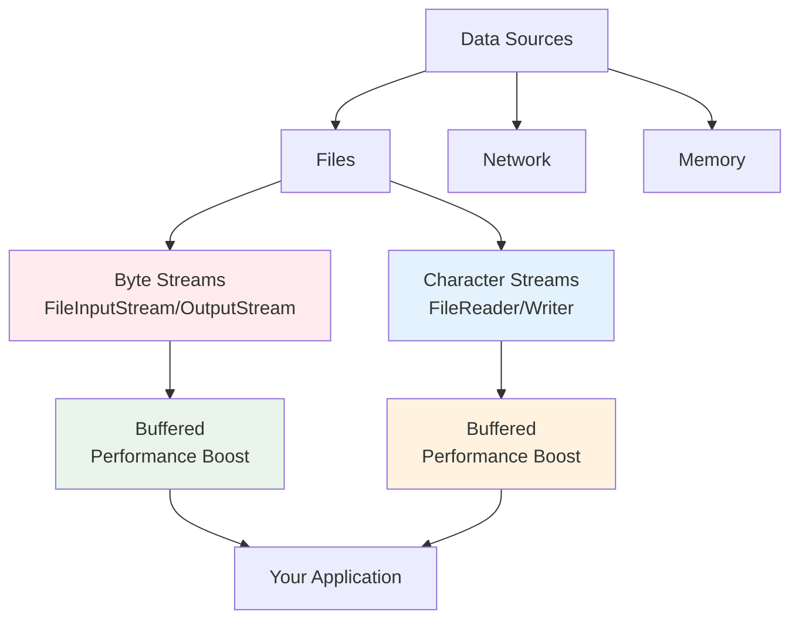

# Input/Output (I/O) Streams

**Why This Matters**: I/O operations are fundamental to real applications - reading configuration files, processing data, saving user information, network communication, and database interactions. Every production Java application uses I/O extensively.

**Core Concepts**:
- **Byte Streams**: Handle binary data (images, videos, executables)
- **Character Streams**: Handle text data (files, user input, logs)  
- **Buffered Streams**: Improve performance by reducing system calls
- **Modern NIO**: Non-blocking, high-performance I/O for servers



I/O streams provide a unified way to handle data from any source with consistent APIs.

## Understanding I/O Streams

### Stream Types Overview

```java
/**
 * Java I/O Stream Hierarchy
 * 
 * InputStream (byte-based)
 * ├── FileInputStream
 * ├── BufferedInputStream  
 * ├── DataInputStream
 * ├── ObjectInputStream
 * └── ByteArrayInputStream
 * 
 * OutputStream (byte-based)
 * ├── FileOutputStream
 * ├── BufferedOutputStream
 * ├── DataOutputStream
 * ├── ObjectOutputStream
 * └── ByteArrayOutputStream
 * 
 * Reader (character-based)
 * ├── FileReader
 * ├── BufferedReader
 * ├── StringReader
 * ├── InputStreamReader
 * └── CharArrayReader
 * 
 * Writer (character-based)  
 * ├── FileWriter
 * ├── BufferedWriter
 * ├── StringWriter
 * ├── OutputStreamWriter
 * └── CharArrayWriter
 */

import java.io.*;
import java.nio.charset.StandardCharsets;

public class StreamTypesDemo {
    
    public static void demonstrateByteStreams() throws IOException {
        System.out.println("=== Byte Stream Operations ===");
        
        // Write binary data
        try (FileOutputStream fos = new FileOutputStream("binary-data.dat")) {
            // Write different data types as bytes
            fos.write(65); // ASCII 'A'
            fos.write(66); // ASCII 'B' 
            fos.write(67); // ASCII 'C'
            
            // Write byte array
            byte[] data = {72, 101, 108, 108, 111}; // "Hello" in ASCII
            fos.write(data);
            
            System.out.println("Written binary data to file");
        }
        
        // Read binary data
        try (FileInputStream fis = new FileInputStream("binary-data.dat")) {
            int byteData;
            System.out.print("Read bytes: ");
            
            while ((byteData = fis.read()) != -1) {
                System.out.print((char) byteData); // Convert to char for display
            }
            System.out.println();
        }
    }
    
    public static void demonstrateCharacterStreams() throws IOException {
        System.out.println("\n=== Character Stream Operations ===");
        
        String text = "Hello, 世界! This is Unicode text with émojis 🚀";
        
        // Write character data
        try (FileWriter writer = new FileWriter("text-data.txt", StandardCharsets.UTF_8)) {
            writer.write(text);
            writer.write("\n");
            writer.write("Second line with special chars: àáâãäå");
            
            System.out.println("Written character data to file");
        }
        
        // Read character data
        try (FileReader reader = new FileReader("text-data.txt", StandardCharsets.UTF_8)) {
            int charData;
            System.out.print("Read characters: ");
            
            while ((charData = reader.read()) != -1) {
                System.out.print((char) charData);
            }
        }
    }
    
    public static void demonstrateBufferedStreams() throws IOException {
        System.out.println("\n=== Buffered Stream Performance ===");
        
        String largeText = "This line will be repeated many times.\n".repeat(10000);
        
        // Unbuffered write (slower)
        long startTime = System.currentTimeMillis();
        try (FileWriter writer = new FileWriter("unbuffered.txt")) {
            for (char c : largeText.toCharArray()) {
                writer.write(c); // Each character written individually
            }
        }
        long unbufferedTime = System.currentTimeMillis() - startTime;
        
        // Buffered write (faster)
        startTime = System.currentTimeMillis();
        try (BufferedWriter writer = new BufferedWriter(new FileWriter("buffered.txt"))) {
            writer.write(largeText); // Buffered internally
        }
        long bufferedTime = System.currentTimeMillis() - startTime;
        
        System.out.printf("Unbuffered write: %d ms%n", unbufferedTime);
        System.out.printf("Buffered write: %d ms%n", bufferedTime);
        System.out.printf("Performance improvement: %.1fx%n", (double) unbufferedTime / bufferedTime);
    }
    
    public static void main(String[] args) {
        try {
            demonstrateByteStreams();
            demonstrateCharacterStreams();
            demonstrateBufferedStreams();
            
            // Cleanup
            cleanupFiles("binary-data.dat", "text-data.txt", "unbuffered.txt", "buffered.txt");
            
        } catch (IOException e) {
            System.err.println("I/O error: " + e.getMessage());
        }
    }
    
    private static void cleanupFiles(String... filenames) {
        for (String filename : filenames) {
            new File(filename).delete();
        }
    }
}
```

## File Operations

### Reading and Writing Files

```java
import java.io.*;
import java.nio.charset.StandardCharsets;
import java.util.*;

public class FileOperations {
    
    // Reading files line by line
    public static List<String> readFileLines(String filename) throws IOException {
        List<String> lines = new ArrayList<>();
        
        try (BufferedReader reader = new BufferedReader(
                new FileReader(filename, StandardCharsets.UTF_8))) {
            
            String line;
            while ((line = reader.readLine()) != null) {
                lines.add(line);
            }
        }
        
        return lines;
    }
    
    // Writing files with various methods
    public static void writeFile(String filename, List<String> lines) throws IOException {
        try (BufferedWriter writer = new BufferedWriter(
                new FileWriter(filename, StandardCharsets.UTF_8))) {
            
            for (String line : lines) {
                writer.write(line);
                writer.newLine(); // Platform-independent line separator
            }
        }
    }
    
    // Append to file
    public static void appendToFile(String filename, String content) throws IOException {
        try (BufferedWriter writer = new BufferedWriter(
                new FileWriter(filename, StandardCharsets.UTF_8, true))) { // true for append mode
            
            writer.write(content);
            writer.newLine();
        }
    }
    
    // Copy file using byte streams
    public static void copyFile(String sourceFile, String destinationFile) throws IOException {
        try (FileInputStream source = new FileInputStream(sourceFile);
             FileOutputStream dest = new FileOutputStream(destinationFile);
             BufferedInputStream bufferedSource = new BufferedInputStream(source);
             BufferedOutputStream bufferedDest = new BufferedOutputStream(dest)) {
            
            byte[] buffer = new byte[8192]; // 8KB buffer
            int bytesRead;
            
            while ((bytesRead = bufferedSource.read(buffer)) != -1) {
                bufferedDest.write(buffer, 0, bytesRead);
            }
        }
    }
    
    // File information and manipulation
    public static void analyzeFile(String filename) {
        File file = new File(filename);
        
        System.out.println("=== File Analysis: " + filename + " ===");
        System.out.println("Exists: " + file.exists());
        System.out.println("Is file: " + file.isFile());
        System.out.println("Is directory: " + file.isDirectory());
        System.out.println("Is readable: " + file.canRead());
        System.out.println("Is writable: " + file.canWrite());
        System.out.println("Is executable: " + file.canExecute());
        System.out.println("Size: " + file.length() + " bytes");
        System.out.println("Last modified: " + new Date(file.lastModified()));
        System.out.println("Absolute path: " + file.getAbsolutePath());
        System.out.println("Parent: " + file.getParent());
    }
    
    // Directory operations
    public static void listDirectoryContents(String directoryPath) {
        File directory = new File(directoryPath);
        
        if (!directory.exists() || !directory.isDirectory()) {
            System.out.println("Directory does not exist: " + directoryPath);
            return;
        }
        
        System.out.println("\n=== Directory Contents: " + directoryPath + " ===");
        File[] files = directory.listFiles();
        
        if (files != null) {
            for (File file : files) {
                String type = file.isDirectory() ? "[DIR]" : "[FILE]";
                System.out.printf("%-8s %10d bytes  %s%n", 
                                type, file.length(), file.getName());
            }
        }
    }
    
    // Create directory structure
    public static boolean createDirectoryStructure(String path) {
        File directory = new File(path);
        return directory.mkdirs(); // Creates parent directories if needed
    }
    
    // Delete directory recursively
    public static boolean deleteDirectory(File directory) {
        if (directory.exists()) {
            File[] files = directory.listFiles();
            if (files != null) {
                for (File file : files) {
                    if (file.isDirectory()) {
                        deleteDirectory(file); // Recursive call
                    } else {
                        file.delete();
                    }
                }
            }
        }
        return directory.delete();
    }
    
    public static void main(String[] args) {
        try {
            // Create sample data
            List<String> sampleLines = Arrays.asList(
                "First line of text",
                "Second line with numbers: 12345",
                "Third line with special chars: àáâãäå",
                "Fourth line with emoji: 🚀💻📚"
            );
            
            // Test file operations
            String filename = "sample.txt";
            writeFile(filename, sampleLines);
            System.out.println("Created file with sample data");
            
            // Read back and display
            List<String> readLines = readFileLines(filename);
            System.out.println("\nRead lines from file:");
            readLines.forEach(System.out::println);
            
            // Append more data
            appendToFile(filename, "Appended line 1");
            appendToFile(filename, "Appended line 2");
            
            // Analyze file
            analyzeFile(filename);
            
            // Copy file
            String copyFilename = "sample-copy.txt";
            copyFile(filename, copyFilename);
            System.out.println("\nFile copied to: " + copyFilename);
            
            // Create directory structure
            String testDir = "test-directory/subdirectory";
            if (createDirectoryStructure(testDir)) {
                System.out.println("\nCreated directory structure: " + testDir);
                
                // Move file to directory
                File originalFile = new File(copyFilename);
                File movedFile = new File(testDir + "/moved-file.txt");
                if (originalFile.renameTo(movedFile)) {
                    System.out.println("Moved file to: " + movedFile.getPath());
                }
            }
            
            // List directory contents
            listDirectoryContents(".");
            listDirectoryContents("test-directory");
            
            // Cleanup
            new File(filename).delete();
            deleteDirectory(new File("test-directory"));
            System.out.println("\nCleanup completed");
            
        } catch (IOException e) {
            System.err.println("File operation error: " + e.getMessage());
            e.printStackTrace();
        }
    }
}
```

## Data Streams and Object Serialization

### DataInputStream and DataOutputStream

```java
import java.io.*;
import java.util.Date;

public class DataStreamDemo {
    
    public static void writeDataTypes() throws IOException {
        System.out.println("=== Writing Primitive Data Types ===");
        
        try (DataOutputStream dos = new DataOutputStream(
                new BufferedOutputStream(new FileOutputStream("data-types.dat")))) {
            
            // Write various primitive types
            dos.writeBoolean(true);
            dos.writeByte(127);
            dos.writeShort(32767);
            dos.writeInt(2147483647);
            dos.writeLong(9223372036854775807L);
            dos.writeFloat(3.14159f);
            dos.writeDouble(2.718281828459045);
            dos.writeChar('A');
            
            // Write strings (UTF-8 encoded with length prefix)
            dos.writeUTF("Hello, World!");
            dos.writeUTF("Unicode text: 你好世界");
            
            // Write arrays
            int[] numbers = {1, 2, 3, 4, 5};
            dos.writeInt(numbers.length); // Write array length first
            for (int number : numbers) {
                dos.writeInt(number);
            }
            
            System.out.println("Data written successfully");
        }
    }
    
    public static void readDataTypes() throws IOException {
        System.out.println("\n=== Reading Primitive Data Types ===");
        
        try (DataInputStream dis = new DataInputStream(
                new BufferedInputStream(new FileInputStream("data-types.dat")))) {
            
            // Read in same order as written
            boolean boolValue = dis.readBoolean();
            byte byteValue = dis.readByte();
            short shortValue = dis.readShort();
            int intValue = dis.readInt();
            long longValue = dis.readLong();
            float floatValue = dis.readFloat();
            double doubleValue = dis.readDouble();
            char charValue = dis.readChar();
            
            System.out.println("Boolean: " + boolValue);
            System.out.println("Byte: " + byteValue);
            System.out.println("Short: " + shortValue);
            System.out.println("Int: " + intValue);
            System.out.println("Long: " + longValue);
            System.out.println("Float: " + floatValue);
            System.out.println("Double: " + doubleValue);
            System.out.println("Char: " + charValue);
            
            // Read strings
            String string1 = dis.readUTF();
            String string2 = dis.readUTF();
            System.out.println("String 1: " + string1);
            System.out.println("String 2: " + string2);
            
            // Read array
            int arrayLength = dis.readInt();
            int[] numbers = new int[arrayLength];
            for (int i = 0; i < arrayLength; i++) {
                numbers[i] = dis.readInt();
            }
            System.out.println("Array: " + java.util.Arrays.toString(numbers));
        }
    }
    
    public static void main(String[] args) {
        try {
            writeDataTypes();
            readDataTypes();
            
            // Cleanup
            new File("data-types.dat").delete();
            
        } catch (IOException e) {
            System.err.println("Data stream error: " + e.getMessage());
        }
    }
}
```

### Object Serialization

```java
import java.io.*;
import java.util.*;

// Serializable class
class Person implements Serializable {
    private static final long serialVersionUID = 1L; // Version control for serialization
    
    private String name;
    private int age;
    private String email;
    private Date birthDate;
    private transient String password; // transient = not serialized
    private static String company = "CodersBox"; // static = not serialized
    
    public Person(String name, int age, String email, String password) {
        this.name = name;
        this.age = age;
        this.email = email;
        this.password = password;
        this.birthDate = new Date();
    }
    
    // Custom serialization methods
    private void writeObject(ObjectOutputStream out) throws IOException {
        out.defaultWriteObject(); // Serialize non-transient fields
        
        // Custom serialization for sensitive data
        String encryptedPassword = "encrypted:" + password;
        out.writeObject(encryptedPassword);
        
        System.out.println("Custom writeObject called for: " + name);
    }
    
    private void readObject(ObjectInputStream in) throws IOException, ClassNotFoundException {
        in.defaultReadObject(); // Deserialize non-transient fields
        
        // Custom deserialization for sensitive data
        String encryptedPassword = (String) in.readObject();
        this.password = encryptedPassword.replace("encrypted:", "");
        
        System.out.println("Custom readObject called for: " + name);
    }
    
    // Getters and setters
    public String getName() { return name; }
    public int getAge() { return age; }
    public String getEmail() { return email; }
    public String getPassword() { return password; }
    public Date getBirthDate() { return birthDate; }
    public static String getCompany() { return company; }
    
    @Override
    public String toString() {
        return String.format("Person{name='%s', age=%d, email='%s', password='%s', birthDate=%s, company='%s'}", 
                           name, age, email, password, birthDate, company);
    }
}

// Complex serializable class with collections
class Department implements Serializable {
    private static final long serialVersionUID = 1L;
    
    private String name;
    private List<Person> employees;
    private Map<String, Integer> salaries;
    
    public Department(String name) {
        this.name = name;
        this.employees = new ArrayList<>();
        this.salaries = new HashMap<>();
    }
    
    public void addEmployee(Person person, int salary) {
        employees.add(person);
        salaries.put(person.getName(), salary);
    }
    
    public String getName() { return name; }
    public List<Person> getEmployees() { return employees; }
    public Map<String, Integer> getSalaries() { return salaries; }
    
    @Override
    public String toString() {
        return String.format("Department{name='%s', employees=%d, totalSalaries=%d}", 
                           name, employees.size(), salaries.size());
    }
}

public class SerializationDemo {
    
    public static void serializeObjects() throws IOException {
        System.out.println("=== Serializing Objects ===");
        
        // Create objects
        Person person1 = new Person("Alice Johnson", 30, "alice@example.com", "secret123");
        Person person2 = new Person("Bob Smith", 25, "bob@example.com", "password456");
        Person person3 = new Person("Charlie Brown", 35, "charlie@example.com", "mypass789");
        
        Department engineering = new Department("Engineering");
        engineering.addEmployee(person1, 75000);
        engineering.addEmployee(person2, 65000);
        engineering.addEmployee(person3, 80000);
        
        List<Object> objectsToSerialize = Arrays.asList(person1, person2, engineering);
        
        // Serialize objects
        try (ObjectOutputStream oos = new ObjectOutputStream(
                new BufferedOutputStream(new FileOutputStream("objects.ser")))) {
            
            for (Object obj : objectsToSerialize) {
                oos.writeObject(obj);
                System.out.println("Serialized: " + obj.getClass().getSimpleName());
            }
        }
        
        System.out.println("Objects serialized successfully");
    }
    
    public static void deserializeObjects() throws IOException, ClassNotFoundException {
        System.out.println("\n=== Deserializing Objects ===");
        
        try (ObjectInputStream ois = new ObjectInputStream(
                new BufferedInputStream(new FileInputStream("objects.ser")))) {
            
            // Deserialize in same order
            Person person1 = (Person) ois.readObject();
            Person person2 = (Person) ois.readObject();
            Department department = (Department) ois.readObject();
            
            System.out.println("Deserialized objects:");
            System.out.println("Person 1: " + person1);
            System.out.println("Person 2: " + person2);
            System.out.println("Department: " + department);
            
            // Show that transient fields are not serialized
            System.out.println("\nTransient field test:");
            System.out.println("Person 1 password (should be restored): " + person1.getPassword());
            System.out.println("Static company field: " + Person.getCompany());
            
            // Show collection serialization
            System.out.println("\nDepartment details:");
            for (Person emp : department.getEmployees()) {
                Integer salary = department.getSalaries().get(emp.getName());
                System.out.printf("Employee: %s, Salary: $%d%n", emp.getName(), salary);
            }
        }
    }
    
    // Demonstrate serialization versioning
    public static void demonstrateVersioning() throws IOException {
        System.out.println("\n=== Serialization Versioning ===");
        
        // The serialVersionUID helps maintain compatibility
        // If you change the class structure, you might need to update the UID
        
        Person person = new Person("Test User", 25, "test@example.com", "testpass");
        
        try (ObjectOutputStream oos = new ObjectOutputStream(new FileOutputStream("version-test.ser"))) {
            oos.writeObject(person);
        }
        
        try (ObjectInputStream ois = new ObjectInputStream(new FileInputStream("version-test.ser"))) {
            Person deserializedPerson = (Person) ois.readObject();
            System.out.println("Version compatibility test passed: " + deserializedPerson.getName());
        } catch (Exception e) {
            System.out.println("Version compatibility issue: " + e.getMessage());
        }
        
        new File("version-test.ser").delete();
    }
    
    // Performance comparison
    public static void performanceTest() throws IOException, ClassNotFoundException {
        System.out.println("\n=== Serialization Performance Test ===");
        
        List<Person> people = new ArrayList<>();
        for (int i = 0; i < 10000; i++) {
            people.add(new Person("Person" + i, 20 + (i % 50), "person" + i + "@example.com", "pass" + i));
        }
        
        // Test serialization performance
        long startTime = System.currentTimeMillis();
        
        try (ObjectOutputStream oos = new ObjectOutputStream(
                new BufferedOutputStream(new FileOutputStream("performance-test.ser")))) {
            oos.writeObject(people);
        }
        
        long serializationTime = System.currentTimeMillis() - startTime;
        
        // Test deserialization performance
        startTime = System.currentTimeMillis();
        
        try (ObjectInputStream ois = new ObjectInputStream(
                new BufferedInputStream(new FileInputStream("performance-test.ser")))) {
            @SuppressWarnings("unchecked")
            List<Person> deserializedPeople = (List<Person>) ois.readObject();
            System.out.println("Deserialized " + deserializedPeople.size() + " objects");
        }
        
        long deserializationTime = System.currentTimeMillis() - startTime;
        
        System.out.printf("Serialization: %d ms%n", serializationTime);
        System.out.printf("Deserialization: %d ms%n", deserializationTime);
        
        File testFile = new File("performance-test.ser");
        System.out.printf("File size: %.2f KB%n", testFile.length() / 1024.0);
        testFile.delete();
    }
    
    public static void main(String[] args) {
        try {
            serializeObjects();
            deserializeObjects();
            demonstrateVersioning();
            performanceTest();
            
            // Cleanup
            new File("objects.ser").delete();
            
        } catch (Exception e) {
            System.err.println("Serialization error: " + e.getMessage());
            e.printStackTrace();
        }
    }
}
```

## Modern I/O with NIO (New I/O)

### NIO.2 File Operations (Java 7+)

```java
import java.io.IOException;
import java.nio.charset.StandardCharsets;
import java.nio.file.*;
import java.nio.file.attribute.*;
import java.util.*;
import java.util.stream.Stream;

public class NIODemo {
    
    public static void demonstratePathOperations() {
        System.out.println("=== Path Operations ===");
        
        // Creating paths
        Path path1 = Paths.get("documents", "projects", "myapp", "src", "Main.java");
        Path path2 = Paths.get("/home/user/documents/readme.txt");
        Path path3 = Paths.get("C:\\Users\\user\\Documents\\file.txt");
        
        System.out.println("Path 1: " + path1);
        System.out.println("Path 2: " + path2);
        System.out.println("Path 3: " + path3);
        
        // Path manipulation
        System.out.println("\nPath Analysis:");
        System.out.println("File name: " + path1.getFileName());
        System.out.println("Parent: " + path1.getParent());
        System.out.println("Root: " + path1.getRoot());
        System.out.println("Name count: " + path1.getNameCount());
        System.out.println("Is absolute: " + path1.isAbsolute());
        
        // Path resolution
        Path basePath = Paths.get("/home/user");
        Path relativePath = Paths.get("documents/file.txt");
        Path resolvedPath = basePath.resolve(relativePath);
        System.out.println("Resolved path: " + resolvedPath);
        
        // Path normalization
        Path unnormalizedPath = Paths.get("/home/user/../user/./documents//file.txt");
        Path normalizedPath = unnormalizedPath.normalize();
        System.out.println("Unnormalized: " + unnormalizedPath);
        System.out.println("Normalized: " + normalizedPath);
    }
    
    public static void demonstrateFileOperations() throws IOException {
        System.out.println("\n=== NIO File Operations ===");
        
        Path testDir = Paths.get("nio-test");
        Path testFile = testDir.resolve("test-file.txt");
        
        // Create directory
        if (!Files.exists(testDir)) {
            Files.createDirectory(testDir);
            System.out.println("Created directory: " + testDir);
        }
        
        // Write file
        List<String> lines = Arrays.asList(
            "First line of NIO file",
            "Second line with timestamp: " + new Date(),
            "Third line with Unicode: 🚀💻📚",
            "Fourth line with special chars: àáâãäå"
        );
        
        Files.write(testFile, lines, StandardCharsets.UTF_8, 
                   StandardOpenOption.CREATE, StandardOpenOption.WRITE);
        System.out.println("Written file: " + testFile);
        
        // Read file
        List<String> readLines = Files.readAllLines(testFile, StandardCharsets.UTF_8);
        System.out.println("Read " + readLines.size() + " lines:");
        readLines.forEach(line -> System.out.println("  " + line));
        
        // File attributes
        System.out.println("\nFile attributes:");
        BasicFileAttributes attrs = Files.readAttributes(testFile, BasicFileAttributes.class);
        System.out.println("Size: " + attrs.size() + " bytes");
        System.out.println("Created: " + attrs.creationTime());
        System.out.println("Modified: " + attrs.lastModifiedTime());
        System.out.println("Is directory: " + attrs.isDirectory());
        System.out.println("Is regular file: " + attrs.isRegularFile());
        
        // Copy file
        Path copiedFile = testDir.resolve("copied-file.txt");
        Files.copy(testFile, copiedFile, StandardCopyOption.REPLACE_EXISTING);
        System.out.println("Copied file to: " + copiedFile);
        
        // Move/rename file
        Path movedFile = testDir.resolve("moved-file.txt");
        Files.move(copiedFile, movedFile, StandardCopyOption.REPLACE_EXISTING);
        System.out.println("Moved file to: " + movedFile);
        
        // Delete files
        Files.deleteIfExists(movedFile);
        System.out.println("Deleted: " + movedFile);
    }
    
    public static void demonstrateDirectoryWalking() throws IOException {
        System.out.println("\n=== Directory Walking ===");
        
        Path startDir = Paths.get(".");
        
        // Walk directory tree
        System.out.println("All .java files in current directory tree:");
        try (Stream<Path> paths = Files.walk(startDir)) {
            paths.filter(Files::isRegularFile)
                 .filter(path -> path.toString().endsWith(".java"))
                 .limit(10) // Limit output
                 .forEach(System.out::println);
        }
        
        // Find files by criteria
        System.out.println("\nFiles larger than 1KB:");
        try (Stream<Path> paths = Files.find(startDir, 3, // max depth
                (path, attrs) -> attrs.isRegularFile() && attrs.size() > 1024)) {
            paths.limit(5)
                 .forEach(path -> {
                     try {
                         long size = Files.size(path);
                         System.out.printf("%s (%d bytes)%n", path, size);
                     } catch (IOException e) {
                         System.err.println("Error getting size for: " + path);
                     }
                 });
        }
        
        // List directory contents
        System.out.println("\nCurrent directory contents:");
        try (Stream<Path> paths = Files.list(Paths.get("."))) {
            paths.sorted()
                 .limit(10)
                 .forEach(path -> {
                     try {
                         String type = Files.isDirectory(path) ? "[DIR]" : "[FILE]";
                         long size = Files.isDirectory(path) ? 0 : Files.size(path);
                         System.out.printf("%-6s %8d bytes  %s%n", type, size, path.getFileName());
                     } catch (IOException e) {
                         System.err.println("Error processing: " + path);
                     }
                 });
        }
    }
    
    public static void demonstrateWatchService() throws IOException, InterruptedException {
        System.out.println("\n=== Watch Service Demo ===");
        
        Path watchDir = Paths.get("watch-test");
        if (!Files.exists(watchDir)) {
            Files.createDirectory(watchDir);
        }
        
        // Create watch service
        WatchService watchService = FileSystems.getDefault().newWatchService();
        
        // Register directory for watching
        watchDir.register(watchService, 
                         StandardWatchEventKinds.ENTRY_CREATE,
                         StandardWatchEventKinds.ENTRY_DELETE,
                         StandardWatchEventKinds.ENTRY_MODIFY);
        
        System.out.println("Watching directory: " + watchDir);
        System.out.println("Create, modify, or delete files in this directory...");
        
        // Start a thread to simulate file changes
        Thread simulatorThread = new Thread(() -> {
            try {
                Thread.sleep(1000);
                
                // Create file
                Path testFile = watchDir.resolve("watch-test.txt");
                Files.write(testFile, Arrays.asList("Initial content"), StandardCharsets.UTF_8);
                Thread.sleep(500);
                
                // Modify file
                Files.write(testFile, Arrays.asList("Modified content"), StandardCharsets.UTF_8);
                Thread.sleep(500);
                
                // Delete file
                Files.deleteIfExists(testFile);
                
            } catch (Exception e) {
                System.err.println("Simulator error: " + e.getMessage());
            }
        });
        
        simulatorThread.start();
        
        // Watch for events (limited time for demo)
        long startTime = System.currentTimeMillis();
        while (System.currentTimeMillis() - startTime < 5000) { // Watch for 5 seconds
            WatchKey key = watchService.poll();
            if (key != null) {
                for (WatchEvent<?> event : key.pollEvents()) {
                    WatchEvent.Kind<?> kind = event.kind();
                    Path filename = (Path) event.context();
                    
                    System.out.printf("Event: %s - %s%n", kind.name(), filename);
                }
                
                boolean valid = key.reset();
                if (!valid) {
                    System.out.println("Watch key no longer valid");
                    break;
                }
            }
            
            Thread.sleep(100);
        }
        
        simulatorThread.join();
        watchService.close();
        
        // Cleanup
        Files.deleteIfExists(watchDir);
        System.out.println("Watch service demo completed");
    }
    
    public static void demonstrateMemoryMappedFiles() throws IOException {
        System.out.println("\n=== Memory Mapped Files ===");
        
        Path largeFile = Paths.get("large-file.dat");
        
        // Create a large file
        try (java.nio.channels.FileChannel channel = java.nio.channels.FileChannel.open(
                largeFile, StandardOpenOption.CREATE, StandardOpenOption.WRITE, StandardOpenOption.READ)) {
            
            // Map file to memory (1MB)
            int fileSize = 1024 * 1024;
            java.nio.MappedByteBuffer buffer = channel.map(
                java.nio.channels.FileChannel.MapMode.READ_WRITE, 0, fileSize);
            
            // Write data
            long startTime = System.currentTimeMillis();
            for (int i = 0; i < fileSize; i++) {
                buffer.put((byte) (i % 256));
            }
            long writeTime = System.currentTimeMillis() - startTime;
            
            // Read data
            buffer.rewind();
            startTime = System.currentTimeMillis();
            int sum = 0;
            while (buffer.hasRemaining()) {
                sum += buffer.get() & 0xFF; // Convert to unsigned
            }
            long readTime = System.currentTimeMillis() - startTime;
            
            System.out.printf("Memory mapped file operations:%n");
            System.out.printf("Write time: %d ms%n", writeTime);
            System.out.printf("Read time: %d ms%n", readTime);
            System.out.printf("Checksum: %d%n", sum);
        }
        
        Files.deleteIfExists(largeFile);
    }
    
    public static void main(String[] args) {
        try {
            demonstratePathOperations();
            demonstrateFileOperations();
            demonstrateDirectoryWalking();
            demonstrateMemoryMappedFiles();
            
            // Note: Uncomment to test watch service (interactive)
            // demonstrateWatchService();
            
            // Cleanup
            Path testDir = Paths.get("nio-test");
            if (Files.exists(testDir)) {
                try (Stream<Path> paths = Files.walk(testDir)) {
                    paths.sorted(Comparator.reverseOrder())
                         .forEach(path -> {
                             try {
                                 Files.deleteIfExists(path);
                             } catch (IOException e) {
                                 System.err.println("Error deleting: " + path);
                             }
                         });
                }
            }
            
        } catch (Exception e) {
            System.err.println("NIO demo error: " + e.getMessage());
            e.printStackTrace();
        }
    }
}
```

## Practical I/O Applications

### Log File Processor

```java
import java.io.*;
import java.nio.file.*;
import java.time.LocalDateTime;
import java.time.format.DateTimeFormatter;
import java.util.*;
import java.util.regex.Pattern;
import java.util.stream.Collectors;

public class LogFileProcessor {
    
    // Log entry class
    static class LogEntry {
        private final LocalDateTime timestamp;
        private final String level;
        private final String message;
        private final String source;
        
        public LogEntry(LocalDateTime timestamp, String level, String message, String source) {
            this.timestamp = timestamp;
            this.level = level;
            this.message = message;
            this.source = source;
        }
        
        public LocalDateTime getTimestamp() { return timestamp; }
        public String getLevel() { return level; }
        public String getMessage() { return message; }
        public String getSource() { return source; }
        
        @Override
        public String toString() {
            return String.format("%s [%s] %s: %s", 
                timestamp.format(DateTimeFormatter.ISO_LOCAL_DATE_TIME),
                level, source, message);
        }
    }
    
    private final Pattern logPattern = Pattern.compile(
        "(\\d{4}-\\d{2}-\\d{2}T\\d{2}:\\d{2}:\\d{2})\\s+\\[([A-Z]+)\\]\\s+(\\S+):\\s+(.+)"
    );
    
    // Parse log file
    public List<LogEntry> parseLogFile(Path logFile) throws IOException {
        List<LogEntry> entries = new ArrayList<>();
        
        try (BufferedReader reader = Files.newBufferedReader(logFile)) {
            String line;
            while ((line = reader.readLine()) != null) {
                LogEntry entry = parseLogLine(line);
                if (entry != null) {
                    entries.add(entry);
                }
            }
        }
        
        return entries;
    }
    
    private LogEntry parseLogLine(String line) {
        var matcher = logPattern.matcher(line);
        if (matcher.matches()) {
            try {
                LocalDateTime timestamp = LocalDateTime.parse(matcher.group(1));
                String level = matcher.group(2);
                String source = matcher.group(3);
                String message = matcher.group(4);
                
                return new LogEntry(timestamp, level, message, source);
            } catch (Exception e) {
                System.err.println("Error parsing log line: " + line);
                return null;
            }
        }
        return null;
    }
    
    // Generate sample log file
    public void generateSampleLogFile(Path logFile) throws IOException {
        List<String> levels = Arrays.asList("INFO", "WARN", "ERROR", "DEBUG");
        List<String> sources = Arrays.asList("UserService", "DatabaseManager", "PaymentProcessor", "EmailSender");
        List<String> messages = Arrays.asList(
            "User login successful",
            "Database connection established",
            "Payment processed successfully",
            "Email sent to user",
            "Invalid user credentials",
            "Database connection timeout",
            "Payment failed - insufficient funds",
            "Email delivery failed",
            "User session expired",
            "Cache miss for key: user:123"
        );
        
        Random random = new Random();
        LocalDateTime baseTime = LocalDateTime.now().minusDays(7);
        
        try (BufferedWriter writer = Files.newBufferedWriter(logFile)) {
            for (int i = 0; i < 1000; i++) {
                LocalDateTime timestamp = baseTime.plusMinutes(i);
                String level = levels.get(random.nextInt(levels.size()));
                String source = sources.get(random.nextInt(sources.size()));
                String message = messages.get(random.nextInt(messages.size()));
                
                writer.write(String.format("%s [%s] %s: %s%n",
                    timestamp.format(DateTimeFormatter.ISO_LOCAL_DATE_TIME),
                    level, source, message));
            }
        }
    }
    
    // Analyze logs
    public void analyzeLogFile(Path logFile) throws IOException {
        List<LogEntry> entries = parseLogFile(logFile);
        
        System.out.println("=== Log File Analysis ===");
        System.out.println("Total entries: " + entries.size());
        
        // Count by level
        Map<String, Long> levelCounts = entries.stream()
            .collect(Collectors.groupingBy(LogEntry::getLevel, Collectors.counting()));
        
        System.out.println("\nEntries by level:");
        levelCounts.entrySet().stream()
            .sorted(Map.Entry.<String, Long>comparingByValue().reversed())
            .forEach(entry -> System.out.printf("  %s: %d%n", entry.getKey(), entry.getValue()));
        
        // Count by source
        Map<String, Long> sourceCounts = entries.stream()
            .collect(Collectors.groupingBy(LogEntry::getSource, Collectors.counting()));
        
        System.out.println("\nEntries by source:");
        sourceCounts.entrySet().stream()
            .sorted(Map.Entry.<String, Long>comparingByValue().reversed())
            .forEach(entry -> System.out.printf("  %s: %d%n", entry.getKey(), entry.getValue()));
        
        // Find errors
        List<LogEntry> errors = entries.stream()
            .filter(entry -> "ERROR".equals(entry.getLevel()))
            .collect(Collectors.toList());
        
        System.out.println("\nError entries (" + errors.size() + "):");
        errors.stream()
            .limit(5)
            .forEach(entry -> System.out.println("  " + entry));
        
        // Time range analysis
        if (!entries.isEmpty()) {
            LocalDateTime firstEntry = entries.stream()
                .map(LogEntry::getTimestamp)
                .min(LocalDateTime::compareTo)
                .orElse(null);
            
            LocalDateTime lastEntry = entries.stream()
                .map(LogEntry::getTimestamp)
                .max(LocalDateTime::compareTo)
                .orElse(null);
            
            System.out.println("\nTime range:");
            System.out.println("  First entry: " + firstEntry);
            System.out.println("  Last entry: " + lastEntry);
        }
    }
    
    // Filter and export logs
    public void filterAndExport(Path inputFile, Path outputFile, String levelFilter) throws IOException {
        List<LogEntry> entries = parseLogFile(inputFile);
        
        List<LogEntry> filteredEntries = entries.stream()
            .filter(entry -> levelFilter == null || levelFilter.equals(entry.getLevel()))
            .collect(Collectors.toList());
        
        try (BufferedWriter writer = Files.newBufferedWriter(outputFile)) {
            for (LogEntry entry : filteredEntries) {
                writer.write(entry.toString());
                writer.newLine();
            }
        }
        
        System.out.printf("Exported %d entries (filtered by %s) to %s%n", 
                         filteredEntries.size(), levelFilter, outputFile);
    }
    
    public static void main(String[] args) {
        try {
            LogFileProcessor processor = new LogFileProcessor();
            Path logFile = Paths.get("application.log");
            Path errorLogFile = Paths.get("errors-only.log");
            
            // Generate sample log file
            System.out.println("Generating sample log file...");
            processor.generateSampleLogFile(logFile);
            
            // Analyze log file
            processor.analyzeLogFile(logFile);
            
            // Filter and export errors
            processor.filterAndExport(logFile, errorLogFile, "ERROR");
            
            // Show file sizes
            System.out.printf("\nFile sizes:%n");
            System.out.printf("Original log: %.2f KB%n", Files.size(logFile) / 1024.0);
            System.out.printf("Error log: %.2f KB%n", Files.size(errorLogFile) / 1024.0);
            
            // Cleanup
            Files.deleteIfExists(logFile);
            Files.deleteIfExists(errorLogFile);
            
        } catch (IOException e) {
            System.err.println("Log processing error: " + e.getMessage());
            e.printStackTrace();
        }
    }
}
```

## Best Practices and Performance

### I/O Performance Guidelines

```java
import java.io.*;
import java.nio.file.*;
import java.util.*;

public class IOPerformanceTips {
    
    public static void compareReadingStrategies() throws IOException {
        // Create test file
        Path testFile = Paths.get("performance-test.txt");
        List<String> lines = new ArrayList<>();
        for (int i = 0; i < 50000; i++) {
            lines.add("Line " + i + ": This is some sample text for performance testing.");
        }
        Files.write(testFile, lines);
        
        System.out.println("=== Reading Performance Comparison ===");
        
        // 1. Unbuffered character reading (SLOW)
        long startTime = System.currentTimeMillis();
        try (FileReader reader = new FileReader(testFile.toFile())) {
            int ch;
            int count = 0;
            while ((ch = reader.read()) != -1) {
                count++;
            }
            System.out.println("Characters read (unbuffered): " + count);
        }
        long unbufferedTime = System.currentTimeMillis() - startTime;
        
        // 2. Buffered character reading (BETTER)
        startTime = System.currentTimeMillis();
        try (BufferedReader reader = new BufferedReader(new FileReader(testFile.toFile()))) {
            String line;
            int lines_read = 0;
            while ((line = reader.readLine()) != null) {
                lines_read++;
            }
            System.out.println("Lines read (buffered): " + lines_read);
        }
        long bufferedTime = System.currentTimeMillis() - startTime;
        
        // 3. NIO read all lines (FASTEST for small to medium files)
        startTime = System.currentTimeMillis();
        List<String> allLines = Files.readAllLines(testFile);
        System.out.println("Lines read (NIO): " + allLines.size());
        long nioTime = System.currentTimeMillis() - startTime;
        
        // 4. NIO with streaming (BEST for large files)
        startTime = System.currentTimeMillis();
        try (Stream<String> stream = Files.lines(testFile)) {
            long lineCount = stream.count();
            System.out.println("Lines read (NIO stream): " + lineCount);
        }
        long nioStreamTime = System.currentTimeMillis() - startTime;
        
        System.out.printf("Performance results:%n");
        System.out.printf("Unbuffered: %d ms%n", unbufferedTime);
        System.out.printf("Buffered: %d ms%n", bufferedTime);
        System.out.printf("NIO readAllLines: %d ms%n", nioTime);
        System.out.printf("NIO streaming: %d ms%n", nioStreamTime);
        
        Files.deleteIfExists(testFile);
    }
    
    public static void compareWritingStrategies() throws IOException {
        System.out.println("\n=== Writing Performance Comparison ===");
        
        List<String> data = new ArrayList<>();
        for (int i = 0; i < 10000; i++) {
            data.add("Line " + i + ": Sample data for writing performance test");
        }
        
        // 1. Unbuffered writing (SLOW)
        Path file1 = Paths.get("write-test-unbuffered.txt");
        long startTime = System.currentTimeMillis();
        try (FileWriter writer = new FileWriter(file1.toFile())) {
            for (String line : data) {
                writer.write(line + "\n");
            }
        }
        long unbufferedTime = System.currentTimeMillis() - startTime;
        
        // 2. Buffered writing (BETTER)
        Path file2 = Paths.get("write-test-buffered.txt");
        startTime = System.currentTimeMillis();
        try (BufferedWriter writer = new BufferedWriter(new FileWriter(file2.toFile()))) {
            for (String line : data) {
                writer.write(line);
                writer.newLine();
            }
        }
        long bufferedTime = System.currentTimeMillis() - startTime;
        
        // 3. NIO write all lines (FASTEST)
        Path file3 = Paths.get("write-test-nio.txt");
        startTime = System.currentTimeMillis();
        Files.write(file3, data);
        long nioTime = System.currentTimeMillis() - startTime;
        
        System.out.printf("Write performance results:%n");
        System.out.printf("Unbuffered: %d ms%n", unbufferedTime);
        System.out.printf("Buffered: %d ms%n", bufferedTime);
        System.out.printf("NIO: %d ms%n", nioTime);
        
        // Cleanup
        Files.deleteIfExists(file1);
        Files.deleteIfExists(file2);
        Files.deleteIfExists(file3);
    }
    
    // Resource management best practices
    public static void demonstrateResourceManagement() {
        System.out.println("\n=== Resource Management Best Practices ===");
        
        // ❌ BAD: Manual resource management
        FileInputStream inputStream = null;
        try {
            inputStream = new FileInputStream("nonexistent-file.txt");
            // Process file...
        } catch (IOException e) {
            System.out.println("Manual management - Error: " + e.getMessage());
        } finally {
            if (inputStream != null) {
                try {
                    inputStream.close();
                } catch (IOException e) {
                    System.err.println("Error closing stream: " + e.getMessage());
                }
            }
        }
        
        // ✅ GOOD: Try-with-resources
        try (FileInputStream autoManagedStream = new FileInputStream("nonexistent-file.txt")) {
            // Process file...
        } catch (IOException e) {
            System.out.println("Auto-managed - Error: " + e.getMessage());
        }
        // Stream is automatically closed here
        
        // ✅ BEST: Multiple resources
        try (FileInputStream input = new FileInputStream("source.txt");
             FileOutputStream output = new FileOutputStream("dest.txt");
             BufferedInputStream bufferedInput = new BufferedInputStream(input);
             BufferedOutputStream bufferedOutput = new BufferedOutputStream(output)) {
            
            // All resources managed automatically
            // Closed in reverse order of declaration
            
        } catch (IOException e) {
            System.out.println("Multiple resources - Error: " + e.getMessage());
        }
    }
    
    public static void main(String[] args) {
        try {
            compareReadingStrategies();
            compareWritingStrategies();
            demonstrateResourceManagement();
            
        } catch (IOException e) {
            System.err.println("Performance test error: " + e.getMessage());
        }
    }
}
```

## Common I/O Patterns and Pitfalls

### Error Handling and Best Practices

```java
import java.io.*;
import java.nio.file.*;
import java.nio.charset.StandardCharsets;
import java.util.List;

public class IOBestPractices {
    
    // ❌ Bad patterns
    public static void badIOPatterns() {
        // Bad: Not closing resources
        try {
            FileReader reader = new FileReader("file.txt");
            // Process file...
            // reader never closed - resource leak!
        } catch (IOException e) {
            e.printStackTrace(); // Bad: printing stack trace in production
        }
        
        // Bad: Generic exception handling
        try (FileReader reader = new FileReader("file.txt")) {
            // Process file...
        } catch (Exception e) { // Too broad
            // Handle all exceptions the same way
        }
        
        // Bad: Ignoring character encoding
        try (FileWriter writer = new FileWriter("file.txt")) {
            writer.write("Special chars: àáâãäå"); // Uses platform default encoding
        } catch (IOException e) {
            // Handle error
        }
    }
    
    // ✅ Good patterns
    public static void goodIOPatterns() {
        // Good: Proper resource management with try-with-resources
        try (BufferedReader reader = Files.newBufferedReader(
                Paths.get("file.txt"), StandardCharsets.UTF_8)) {
            
            String line;
            while ((line = reader.readLine()) != null) {
                processLine(line);
            }
            
        } catch (NoSuchFileException e) {
            System.err.println("File not found: " + e.getFile());
            // Handle missing file appropriately
            
        } catch (AccessDeniedException e) {
            System.err.println("Access denied: " + e.getFile());
            // Handle permission issues
            
        } catch (IOException e) {
            System.err.println("I/O error reading file: " + e.getMessage());
            // Log error appropriately
        }
        
        // Good: Explicit character encoding
        try (BufferedWriter writer = Files.newBufferedWriter(
                Paths.get("output.txt"), StandardCharsets.UTF_8)) {
            
            writer.write("Special chars: àáâãäå");
            writer.newLine();
            
        } catch (IOException e) {
            System.err.println("Error writing file: " + e.getMessage());
        }
    }
    
    // Robust file processing with validation
    public static ProcessingResult processFileRobustly(Path inputFile, Path outputFile) {
        // Validation
        if (inputFile == null || outputFile == null) {
            return new ProcessingResult(false, "File paths cannot be null");
        }
        
        if (!Files.exists(inputFile)) {
            return new ProcessingResult(false, "Input file does not exist: " + inputFile);
        }
        
        if (!Files.isReadable(inputFile)) {
            return new ProcessingResult(false, "Input file is not readable: " + inputFile);
        }
        
        // Ensure output directory exists
        Path outputDir = outputFile.getParent();
        if (outputDir != null && !Files.exists(outputDir)) {
            try {
                Files.createDirectories(outputDir);
            } catch (IOException e) {
                return new ProcessingResult(false, "Cannot create output directory: " + e.getMessage());
            }
        }
        
        int linesProcessed = 0;
        
        try (BufferedReader reader = Files.newBufferedReader(inputFile, StandardCharsets.UTF_8);
             BufferedWriter writer = Files.newBufferedWriter(outputFile, StandardCharsets.UTF_8)) {
            
            String line;
            while ((line = reader.readLine()) != null) {
                String processedLine = processLine(line);
                if (processedLine != null) {
                    writer.write(processedLine);
                    writer.newLine();
                    linesProcessed++;
                }
            }
            
            return new ProcessingResult(true, "Successfully processed " + linesProcessed + " lines");
            
        } catch (OutOfMemoryError e) {
            return new ProcessingResult(false, "File too large to process in memory");
            
        } catch (SecurityException e) {
            return new ProcessingResult(false, "Security error: " + e.getMessage());
            
        } catch (IOException e) {
            return new ProcessingResult(false, "I/O error: " + e.getMessage());
        }
    }
    
    // Stream processing for large files
    public static void processLargeFile(Path filePath) throws IOException {
        System.out.println("Processing large file: " + filePath);
        
        // Process file line by line to avoid loading entire file into memory
        try (Stream<String> lines = Files.lines(filePath, StandardCharsets.UTF_8)) {
            
            long processedCount = lines
                .filter(line -> !line.trim().isEmpty()) // Skip empty lines
                .filter(line -> !line.startsWith("#"))  // Skip comments
                .map(String::toUpperCase)               // Transform
                .peek(line -> {
                    // Process each line (side effect)
                    // In real application, you might write to another file,
                    // send to a queue, etc.
                })
                .count();
            
            System.out.println("Processed " + processedCount + " lines");
        }
    }
    
    // Atomic file operations
    public static void atomicFileWrite(Path targetFile, List<String> content) throws IOException {
        // Write to temporary file first
        Path tempFile = Files.createTempFile(targetFile.getParent(), "temp", ".tmp");
        
        try {
            // Write content to temp file
            Files.write(tempFile, content, StandardCharsets.UTF_8);
            
            // Atomic move (rename) - either succeeds completely or fails completely
            Files.move(tempFile, targetFile, StandardCopyOption.ATOMIC_MOVE, 
                      StandardCopyOption.REPLACE_EXISTING);
            
        } catch (IOException e) {
            // Clean up temp file if operation failed
            Files.deleteIfExists(tempFile);
            throw e;
        }
    }
    
    private static String processLine(String line) {
        // Simple line processing - remove extra whitespace and convert to uppercase
        return line.trim().toUpperCase();
    }
    
    // Result class for robust operations
    static class ProcessingResult {
        private final boolean success;
        private final String message;
        
        public ProcessingResult(boolean success, String message) {
            this.success = success;
            this.message = message;
        }
        
        public boolean isSuccess() { return success; }
        public String getMessage() { return message; }
        
        @Override
        public String toString() {
            return String.format("ProcessingResult{success=%s, message='%s'}", success, message);
        }
    }
    
    public static void main(String[] args) {
        try {
            System.out.println("=== I/O Best Practices Demo ===");
            
            // Create test file
            Path testFile = Paths.get("test-input.txt");
            List<String> testContent = List.of(
                "# This is a comment",
                "First line of data",
                "",  // Empty line
                "Second line of data",
                "Third line with special chars: àáâãäå"
            );
            Files.write(testFile, testContent, StandardCharsets.UTF_8);
            
            // Test robust processing
            Path outputFile = Paths.get("output", "processed.txt");
            ProcessingResult result = processFileRobustly(testFile, outputFile);
            System.out.println("Processing result: " + result);
            
            // Test large file processing
            processLargeFile(testFile);
            
            // Test atomic write
            List<String> newContent = List.of("Atomically written content", "Second line");
            atomicFileWrite(Paths.get("atomic-output.txt"), newContent);
            System.out.println("Atomic write completed");
            
            // Cleanup
            Files.deleteIfExists(testFile);
            Files.deleteIfExists(outputFile);
            Files.deleteIfExists(outputFile.getParent());
            Files.deleteIfExists(Paths.get("atomic-output.txt"));
            
        } catch (Exception e) {
            System.err.println("Demo error: " + e.getMessage());
            e.printStackTrace();
        }
    }
}
```

## Summary

Java I/O provides comprehensive tools for data processing:

### Key Concepts
1. **Byte vs Character Streams** - Choose based on data type
2. **Buffered I/O** - Essential for performance
3. **Try-with-resources** - Automatic resource management
4. **NIO.2** - Modern, efficient file operations
5. **Serialization** - Object persistence and transmission

### Best Practices
1. **Always use try-with-resources** for automatic cleanup
2. **Specify character encoding explicitly** (UTF-8)
3. **Use buffered streams** for better performance
4. **Handle specific exceptions** rather than generic ones
5. **Validate inputs and paths** before processing
6. **Use NIO.2 for modern applications**
7. **Stream large files** to avoid memory issues

### Performance Tips
1. **Buffer size matters** - 8KB to 64KB typically optimal
2. **NIO.2 is faster** for most file operations
3. **Memory-mapped files** for very large files
4. **Stream processing** for data that doesn't fit in memory

## Next Steps

I/O operations are fundamental to most applications. In Part 15, we'll explore the Collections Framework - Java's powerful library of data structures including List, Set, Map, and specialized collections that work hand-in-hand with I/O for processing and managing data efficiently.