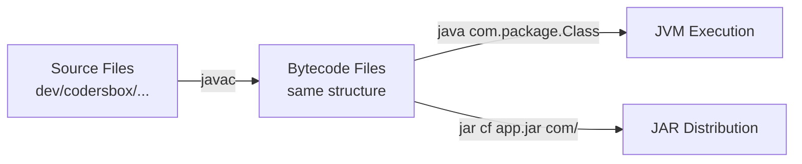
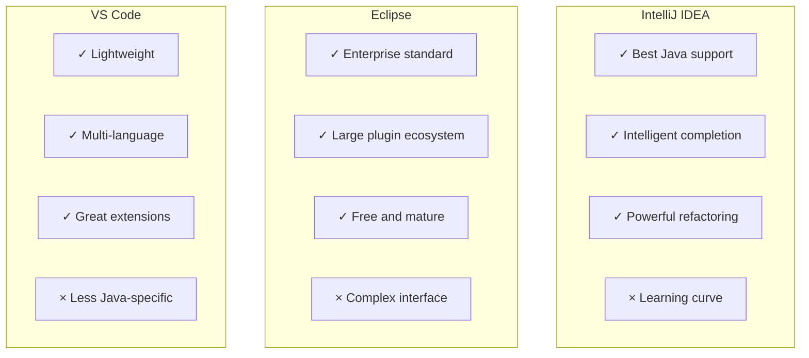
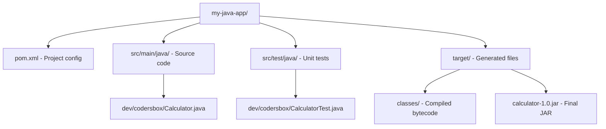

# Java Complete - Part 2: Setting Up Development Environment

**Why This Matters**: Professional developers are 5-10x more productive with proper tooling. The right IDE, build tools, and debugging setup can mean the difference between struggling with code and enjoying the development process.

A craftsman is only as good as their tools. This tutorial establishes a professional development environment that will serve you throughout your Java journey.

## Command Line Mastery

**Essential Skill**: Command-line tools are fundamental - IDEs use them behind the scenes, servers require them, and automation depends on them.

### Core Workflow: Compile → Run

```java
// Hello.java - minimal starting point
public class Hello {
    public static void main(String[] args) {
        System.out.println("Hello, tools!");
    }
}
```

```bash
$ javac Hello.java    # Compile: source → bytecode  
$ java Hello          # Run: bytecode → execution
Hello, tools!
```

### Multi-File Projects

```java
// Adder.java
public class Adder {
    public static int add(int a, int b) { return a + b; }
}

// UseAdder.java  
public class UseAdder {
    public static void main(String[] args) {
        System.out.println(Adder.add(2, 3));
    }
}
```

```bash
$ javac *.java        # Compile all Java files
$ java UseAdder       # Run main class
5
```

### Compilation Options

The `javac` compiler offers many options. Here are the most useful:

```bash
# Specify output directory
javac -d build Calculator.java

# Include external libraries (classpath)
javac -cp lib/commons-math.jar:. Calculator.java

# Enable all warnings
javac -Xlint:all Calculator.java

# Set target Java version
javac --release 11 Calculator.java

# Generate debugging information
javac -g Calculator.java
```

### Working with Packages

**Purpose**: Packages organize code and prevent naming conflicts, like folders for classes.

```java
// dev/codersbox/util/MathHelper.java
package com.codersbox.util;
public class MathHelper {
    public static int doubleIt(int x) { return x * 2; }
}

// dev/codersbox/app/Main.java  
package com.codersbox.app;
import com.codersbox.util.MathHelper;
public class Main {
    public static void main(String[] args) {
        System.out.println(MathHelper.doubleIt(21)); // 42
    }
}
```

```bash
$ javac dev/codersbox/**/*.java    # Compile all packages
$ java com.codersbox.app.Main      # Run with full package name
42
```



## Creating JAR Files

JAR (Java Archive) files package your classes for distribution:

```bash
# Create a JAR file from compiled classes (assumes current dir is project root)
jar cf app.jar com/

# Create an executable JAR with manifest (entry point is our Main class)
echo "Main-Class: com.codersbox.app.Main" > manifest.txt
jar cfm app.jar manifest.txt com/

# Run the JAR
java -jar app.jar
```

## Choosing an IDE

**Why IDEs Matter**: Code completion saves 40% of typing, real-time error detection prevents bugs, and integrated debugging speeds up problem-solving dramatically.

### IDE Comparison



### Recommended: IntelliJ IDEA Community

**Why IntelliJ?** Best-in-class Java support, free Community Edition, used by most professional Java developers.

**Quick Setup:**
1. Download from [jetbrains.com/idea](https://www.jetbrains.com/idea/)
2. Create New Project → Java → Choose JDK 21
3. Project name: "JavaPractice"

**Instant Productivity Boost:**
- `Ctrl+Space` - Code completion
- `Alt+Enter` - Quick fixes and imports
- `Ctrl+B` - Go to definition
- `Shift+F10` - Run current class

## Debugging Techniques

**Critical Skill**: Professional developers spend 50% of their time debugging. Mastering debugging tools is essential for productivity.

### Debugging a Buggy Calculator

```java
public class BuggyCalculator {
    private double result = 1000; // Starting amount
    
    public void applyInterest(double rate, int years) {
        for (int i = 0; i <= years; i++) {  // Bug: should be < years  
            result *= (1 + rate);
        }
    }
    
    public static void main(String[] args) {
        BuggyCalculator calc = new BuggyCalculator();
        calc.applyInterest(0.05, 5);  // 5% for 5 years
        
        // Expected: $1276.28, Actual: $1340.10 (too high!)
        System.out.println("Result: $" + calc.result);
    }
}
```

**The Bug**: Loop runs 6 times instead of 5 (`i <= years` should be `i < years`)

### Command-Line Debugging

Compile with debug information:
```bash
javac -g CalculatorWithBug.java
```

Use `jdb` (Java Debugger):
```bash
$ jdb CalculatorWithBug
> stop at CalculatorWithBug:6
> run
Breakpoint hit: "thread=main", CalculatorWithBug.divide(), line=6 bci=0
> print number
number = 0.0
> step
> print result
result = Infinity
```

### IDE Debugging (Recommended)

**IntelliJ Debugging Steps:**
1. Click left margin on line 189 to set breakpoint (red dot)
2. Right-click → "Debug BuggyCalculator"
3. When paused, examine Variables panel
4. Use `F8` (Step Over) to execute line by line
5. Watch `i` go from 0→5 (6 iterations, not 5!)

**Pro Tip**: Use "Evaluate Expression" (`Alt+F8`) to test fixes before changing code.

## Build Tools: Maven 

**Why Build Tools?** Manual compilation breaks down with 10+ classes. Build tools handle dependencies, testing, packaging, and deployment automatically.

### Maven Project Structure (Industry Standard)



### Essential Maven Commands
```bash
mvn compile      # Compile all source files
mvn test         # Run all unit tests  
mvn package      # Create distributable JAR
mvn clean        # Remove all generated files
```

**Key Benefit**: `mvn test` automatically downloads test libraries, compiles code, runs tests, and reports results.

## Version Control with Git

Modern development requires version control. Initialize a Git repository:

```bash
git init
```

Create `.gitignore`:
```
# Compiled class files
*.class

# Log files
*.log

# Package Files
*.jar
*.war
*.nar
*.ear
*.zip
*.tar.gz
*.rar

# IDE files
.idea/
*.iml
.vscode/
.eclipse/

# Maven
target/

# Gradle
build/
.gradle/

# OS generated files
.DS_Store
Thumbs.db
```

Track changes:
```bash
git add .
git commit -m "Initial commit: Calculator with basic operations"
```

## Performance Profiling

Java provides built-in profiling tools. Let's create a performance test:

```java
public class PerformanceTest {
    public static void main(String[] args) {
        testPrimeGeneration();
    }
    
    private static void testPrimeGeneration() {
        long start = System.nanoTime();
        int primeCount = 0;
        
        for (int i = 2; i < 100000; i++) {
            if (isPrime(i)) {
                primeCount++;
            }
        }
        
        long end = System.nanoTime();
        System.out.println("Found " + primeCount + " primes in " + 
                          (end - start) / 1_000_000 + "ms");
    }
    
    private static boolean isPrime(int n) {
        if (n < 2) return false;
        for (int i = 2; i * i <= n; i++) {
            if (n % i == 0) return false;
        }
        return true;
    }
}
```

Use Java's built-in profiler:
```bash
java -XX:+FlightRecorder -XX:StartFlightRecording=duration=30s,filename=profile.jfr PerformanceTest
```

## Productive Development Habits

### Code Formatting
Configure your IDE for consistent formatting:
- IntelliJ: File → Settings → Editor → Code Style → Java
- Set tab size to 4 spaces
- Enable "Reformat code" on save

### Live Templates/Code Snippets
Create shortcuts for common patterns:
- `main` → generates main method
- `sout` → generates System.out.println
- `fori` → generates for loop

### Keyboard Shortcuts (IntelliJ)
Essential shortcuts:
- `Ctrl+Space` - Code completion
- `Ctrl+B` - Go to declaration
- `Ctrl+Alt+L` - Reformat code
- `Shift+F6` - Rename
- `Ctrl+Alt+V` - Extract variable
- `F9` - Resume program (debugging)
- `F8` - Step over (debugging)

## Hands-On Exercise: File Word Counter

**Apply Your Skills**: Build a practical utility demonstrating IDE features, debugging, and command-line tools.

```java
package com.codersbox.textutil;

import java.io.*;
import java.nio.file.*;
import java.util.*;

public class WordCounter {
    private Map<String, Integer> wordCounts = new HashMap<>();
    
    public void processFile(String filename) throws IOException {
        try (BufferedReader reader = Files.newBufferedReader(Paths.get(filename))) {
            reader.lines()
                  .flatMap(line -> Arrays.stream(line.toLowerCase()
                                                   .replaceAll("[^a-zA-Z\\s]", "")
                                                   .split("\\s+")))
                  .filter(word -> !word.isEmpty())
                  .forEach(word -> wordCounts.merge(word, 1, Integer::sum));
        }
    }
    
    public void printTop10() {
        wordCounts.entrySet().stream()
                 .sorted(Map.Entry.<String, Integer>comparingByValue().reversed())
                 .limit(10)
                 .forEach(entry -> System.out.printf("%s: %d%n", 
                                                   entry.getKey(), entry.getValue()));
    }
    
    public static void main(String[] args) {
        if (args.length == 0) {
            System.out.println("Usage: java WordCounter <filename>");
            return;
        }
        
        try {
            WordCounter counter = new WordCounter();
            counter.processFile(args[0]);
            counter.printTop10();
        } catch (IOException e) {
            System.err.println("Error: " + e.getMessage());
        }
    }
}
```

**Practice Tasks:**
1. Create project in IntelliJ with proper package structure
2. Set breakpoint in `processFile` method and debug execution
3. Use "Evaluate Expression" to test different regex patterns
4. Package as executable JAR and run from command line

## Next Steps

You now have a professional Java development environment. In the next tutorial, we'll dive into Java's syntax, data types, and fundamental programming constructs. We'll use the tools we've configured here to write, debug, and understand increasingly sophisticated programs.

The environment you've built will serve you throughout your Java journey. As you grow more experienced, you'll discover additional tools and customizations that fit your workflow, but this foundation will remain solid regardless of what kind of Java development you pursue.