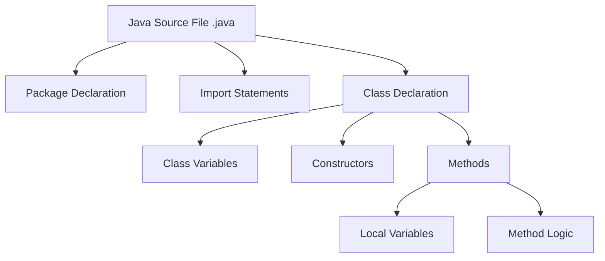
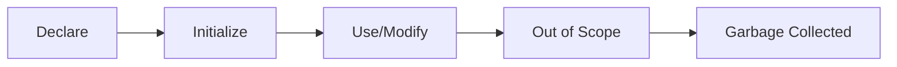
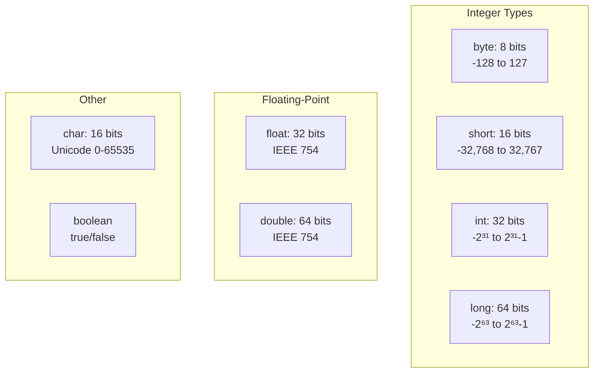
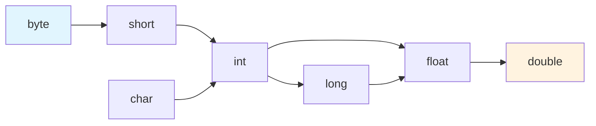
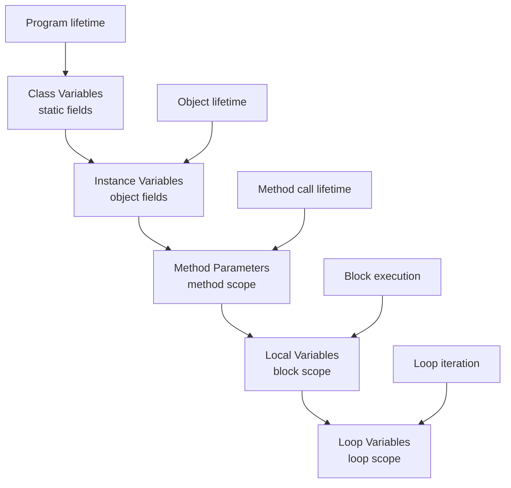

# Java Complete - Part 3: Basic Syntax and Data Types

Every programming language has rules that govern how you express ideas in code. Java's syntax balances expressiveness with clarity, designed to be readable by both compiler and human. In this tutorial, we'll explore the fundamental elements that form every Java program: variables, data types, and the structure that holds them together.

## Anatomy of a Java Program

Let's dissect a simple but complete Java program:

```java
package com.codersbox.basics;          // Package declaration

import java.time.LocalDateTime;        // Import statement
import java.text.NumberFormat;

/**
 * A program demonstrating Java's basic syntax and data types.
 * This class calculates compound interest and displays results.
 */
public class InvestmentCalculator {    // Class declaration
    // Class-level constant
    private static final double DEFAULT_RATE = 0.05;
    
    public static void main(String[] args) {  // Method declaration
        // Local variables
        double principal = 10000.0;
        double interestRate = 0.07;
        int years = 5;
        boolean isCompounding = true;
        
        // Calculate compound interest
        double finalAmount = calculateCompoundInterest(
            principal, interestRate, years, isCompounding
        );
        
        // Display results
        displayResults(principal, interestRate, years, finalAmount);
    }
    
    private static double calculateCompoundInterest(
            double principal, double rate, int periods, boolean compound) {
        if (compound) {
            return principal * Math.pow(1 + rate, periods);
        } else {
            return principal * (1 + rate * periods);
        }
    }
    
    private static void displayResults(
            double principal, double rate, int years, double result) {
        NumberFormat currency = NumberFormat.getCurrencyInstance();
        NumberFormat percent = NumberFormat.getPercentInstance();
        
        System.out.println("=== Investment Analysis ===");
        System.out.printf("Initial investment: %s%n", currency.format(principal));
        System.out.printf("Annual interest rate: %s%n", percent.format(rate));
        System.out.printf("Investment period: %d years%n", years);
        System.out.printf("Final amount: %s%n", currency.format(result));
        System.out.printf("Total gain: %s%n", currency.format(result - principal));
        System.out.println("Calculated at: " + LocalDateTime.now());
    }
}
```

When you run this program:
```
=== Investment Analysis ===
Initial investment: $10,000.00
Annual interest rate: 7%
Investment period: 5 years
Final amount: $14,025.52
Total gain: $4,025.52
Calculated at: 2025-01-29T10:30:45.123
```

## Java Program Structure

Java programs follow a strict hierarchical structure that promotes organization and clarity:



### Package Declaration
```java
package com.codersbox.basics;
```
**Purpose**: Organizes classes and prevents naming conflicts. Must be first non-comment line.

### Import Statements
```java
import java.time.LocalDateTime;    // Specific import (preferred)
import java.util.*;               // Wildcard import (use sparingly)
```
**Purpose**: Makes classes from other packages available without fully qualified names.

### Class Declaration
```java
public class InvestmentCalculator {
    // class body
}
```
**Key Rule**: Filename must match public class name exactly (`InvestmentCalculator.java`).

## Variables and Identifiers

Variables are named storage locations that hold data. Java enforces **declare before use**:

```java
// Basic variable patterns
int age = 25;                    // Declaration + initialization
String name;                     // Declaration only
name = "Alice";                  // Assignment (must happen before use)

// Multiple variables
int width = 800, height = 600;   // Same type, same line

// Constants
final double PI = 3.14159;       // Cannot be reassigned
```

### Variable Lifecycle


### Identifier Rules
Valid identifiers must:
- Start with a letter, underscore (_), or dollar sign ($)
- Contain only letters, digits, underscores, and dollar signs
- Not be a Java keyword
- Be case-sensitive

```java
// Valid identifiers
int studentAge;
double _temperature;
String $currency;
boolean isReady2Go;

// Invalid identifiers
// int 2students;     // Starts with digit
// double class;      // Java keyword
// String student-name; // Contains hyphen
```

### Naming Conventions
Java follows consistent naming patterns:
- **Variables and methods**: camelCase (`studentName`, `calculateInterest`)
- **Constants**: UPPER_SNAKE_CASE (`MAX_SIZE`, `DEFAULT_TIMEOUT`)
- **Classes**: PascalCase (`BankAccount`, `HttpClient`)
- **Packages**: lowercase (`com.company.utilities`)

## Primitive Data Types

Java provides 8 primitive types that store data efficiently in memory. Understanding their ranges prevents overflow errors:



### Integer Types - Essential Patterns

```java
// Common declarations
int count = 42;                    // Most common integer type
long distance = 9_460_730_472_580_800L; // Light year in meters
byte flags = 0b10110011;           // Binary representation
int hex = 0xFF00FF;                // Hexadecimal color

// Critical: Overflow behavior
int maxInt = Integer.MAX_VALUE;    // 2,147,483,647
int overflow = maxInt + 1;         // Wraps to -2,147,483,648!
```

**Key Insight**: Integer overflow wraps around silently. Use `Math.addExact()` to detect overflow.

### Floating-Point Types - Critical Precision Rules

```java
// Basic declarations
float f = 3.14159f;               // 32-bit, requires 'f' suffix
double d = 3.141592653589793;     // 64-bit, default for decimals

// Scientific notation
double avogadro = 6.022e23;       // 6.022 × 10²³
double planck = 6.626e-34;        // 6.626 × 10⁻³⁴

// The floating-point precision trap
double result = 0.1 + 0.2;        // NOT exactly 0.3!
boolean isEqual = result == 0.3;   // false - never use == with floats
```

**Critical Warning**: Floating-point arithmetic is approximate. For exact decimal calculations, use `BigDecimal`:

```java
BigDecimal exact = new BigDecimal("0.1").add(new BigDecimal("0.2"));
// Result: exactly 0.3
```

### Character and Boolean Types

```java
// Character - 16-bit Unicode
char letter = 'A';               // Single quotes for char literals
char unicode = '\u0041';         // Unicode escape (also 'A')
char newline = '\n';             // Escape sequences
char tab = '\t';

// Characters are numbers underneath
int asciiValue = (char) 'A';     // 65
char fromNumber = (char) 66;     // 'B'

// Boolean - only true or false
boolean isActive = true;
boolean isComplete = false;
boolean result = isActive && !isComplete;  // true
```

**Important**: `char` is unsigned (0 to 65,535), unlike other integer types which are signed.

## Type Conversion and Casting

Java's type system enforces safety through automatic widening and explicit narrowing:



### Automatic Widening (Safe)
```java
int num = 100;
long bigNum = num;           // int → long (automatic)
double decimal = bigNum;     // long → double (automatic)
```

### Explicit Narrowing (Potentially Lossy)
```java
double pi = 3.14159;
int truncated = (int) pi;    // 3 (decimal part lost)
byte small = (byte) 1000;    // -24 (overflow wraparound!)
```

### String Conversions
```java
// To String
String s1 = String.valueOf(42);    // "42"
String s2 = Integer.toString(42);  // "42"  
String s3 = "" + 42;              // "42" (concat trick)

// From String
int parsed = Integer.parseInt("42");      // 42
double d = Double.parseDouble("3.14");    // 3.14
```

**Critical Rule**: Always handle `NumberFormatException` when parsing user input.

## Wrapper Classes and Autoboxing

Each primitive type has a corresponding wrapper class that provides additional functionality:

```java
import java.util.ArrayList;
import java.util.List;

public class WrapperDemo {
    public static void main(String[] args) {
        // Wrapper classes
        Integer wrappedInt = 42;           // Autoboxing
        Double wrappedDouble = 3.14;
        Boolean wrappedBoolean = true;
        Character wrappedChar = 'A';
        
        // Unboxing
        int primitiveInt = wrappedInt;     // Automatic unboxing
        double primitiveDouble = wrappedDouble;
        
        // Collections require wrapper classes
        List<Integer> numbers = new ArrayList<>();
        numbers.add(10);    // Autoboxing: int → Integer
        numbers.add(20);
        numbers.add(30);
        
        int first = numbers.get(0);  // Unboxing: Integer → int
        System.out.println("First number: " + first);
        
        // Wrapper utility methods
        String binaryString = Integer.toBinaryString(42);
        String hexString = Integer.toHexString(42);
        int maxInt = Integer.MAX_VALUE;
        int minInt = Integer.MIN_VALUE;
        
        System.out.println("42 in binary: " + binaryString);
        System.out.println("42 in hex: " + hexString);
        System.out.println("Integer range: " + minInt + " to " + maxInt);
        
        // Comparing wrapper objects
        Integer a = 127;
        Integer b = 127;
        Integer c = 128;
        Integer d = 128;
        
        System.out.println("127 == 127: " + (a == b));     // true (cached)
        System.out.println("128 == 128: " + (c == d));     // false (not cached)
        System.out.println("128 equals 128: " + c.equals(d)); // true (content)
        
        // Null values
        Integer nullInteger = null;
        try {
            int value = nullInteger;  // NullPointerException
        } catch (NullPointerException e) {
            System.out.println("Cannot unbox null wrapper");
        }
    }
}
```

## Constants and Final Variables

Use `final` to create constants that cannot be reassigned:

```java
public class Constants {
    // Class constants (compile-time constants)
    public static final int MAX_CONNECTIONS = 100;
    public static final String APPLICATION_NAME = "Java Calculator";
    public static final double CONVERSION_RATE = 1.609344; // miles to km
    
    // Instance constants
    private final String userId;
    private final long creationTime;
    
    public Constants(String userId) {
        this.userId = userId;           // Can initialize in constructor
        this.creationTime = System.currentTimeMillis();
    }
    
    public static void main(String[] args) {
        // Local constants
        final double TAX_RATE = 0.08;
        final int DAYS_IN_WEEK = 7;
        
        // Cannot reassign final variables
        // TAX_RATE = 0.09;  // Compile error
        
        double price = 100.0;
        double tax = price * TAX_RATE;
        double total = price + tax;
        
        System.out.println("Price: $" + price);
        System.out.println("Tax: $" + tax);
        System.out.println("Total: $" + total);
        
        // Final objects can still be modified
        final List<String> names = new ArrayList<>();
        names.add("Alice");      // OK - modifying contents
        names.add("Bob");
        // names = new ArrayList<>();  // Error - reassigning reference
        
        System.out.println("Names: " + names);
        
        // Demonstrate class constants
        System.out.println("Max connections: " + MAX_CONNECTIONS);
        System.out.println("App name: " + APPLICATION_NAME);
        
        // Miles to kilometers conversion
        double miles = 26.2;  // Marathon distance
        double kilometers = miles * CONVERSION_RATE;
        System.out.printf("%.1f miles = %.1f kilometers%n", miles, kilometers);
    }
}
```

## Variable Scope and Lifetime

Java variables have different lifetimes based on where they're declared:



### Scope Rules in Action

```java
public class ScopeDemo {
    static int classVar = 1;        // Accessible everywhere
    int instanceVar = 2;            // Accessible in instance methods
    
    public void method(int param) { // param: method scope
        int local = 3;              // local: method scope
        
        if (true) {
            int blockVar = 4;       // blockVar: block scope only
            // Can access: classVar, instanceVar, param, local, blockVar
        }
        // blockVar not accessible here - compile error
        
        for (int i = 0; i < 5; i++) {  // i: loop scope only
            // Can access: classVar, instanceVar, param, local, i
        }
        // i not accessible here - compile error
    }
}
```

**Key Rule**: Inner scopes can access outer scope variables, but not vice versa.

## Practical Example: Temperature Converter

Here's a focused example demonstrating key concepts:

```java
public class TemperatureConverter {
    // Constants demonstrate final variables
    private static final double KELVIN_OFFSET = 273.15;
    private static final double FAHRENHEIT_RATIO = 9.0 / 5.0;
    
    public static void main(String[] args) {
        // Primitive types in action
        double celsius = 25.0;        // double for precision
        boolean isHot = celsius > 30; // boolean for logic
        
        // Type conversion and calculations
        double fahrenheit = celsiusToFahrenheit(celsius);
        double kelvin = celsius + KELVIN_OFFSET;
        
        // String formatting and output
        System.out.printf("%.1f°C = %.1f°F = %.1fK%n", 
                         celsius, fahrenheit, kelvin);
        System.out.println("Is hot? " + isHot);
        
        // Demonstrate scope
        demonstrateScope();
    }
    
    private static double celsiusToFahrenheit(double c) {
        return c * FAHRENHEIT_RATIO + 32;  // Method parameter scope
    }
    
    private static void demonstrateScope() {
        int outerVar = 10;           // Method scope
        
        for (int i = 0; i < 3; i++) {    // Loop variable scope
            int innerVar = i * 2;        // Block scope
            System.out.println("Loop " + i + ": " + innerVar);
        }
        // i and innerVar not accessible here
        
        System.out.println("Outer variable: " + outerVar);
    }
}
```

**Key Concepts Demonstrated**:
- Constants with meaningful names
- Primitive types for specific purposes
- Method parameters and local variables
- Variable scope boundaries
- Type conversions in calculations

## Critical Pitfalls to Avoid

### Integer Overflow (Silent Failure)
```java
int maxInt = Integer.MAX_VALUE;  // 2,147,483,647
int overflow = maxInt + 1;       // -2,147,483,648 (wraps around!)
```
**Solution**: Use `long` for large numbers or `Math.addExact()` to detect overflow.

### Floating-Point Precision Loss
```java
double result = 0.1 + 0.2;      // 0.30000000000000004 (not 0.3!)
boolean wrong = result == 0.3;  // false
```
**Solution**: Use `BigDecimal` for exact decimal arithmetic or epsilon comparison.

### Null Wrapper Unboxing
```java
Integer wrapper = null;
int primitive = wrapper;        // NullPointerException at runtime
```
**Solution**: Null-check before unboxing: `int safe = wrapper != null ? wrapper : 0;`

## Looking Ahead

You now understand Java's fundamental building blocks: variables, primitive types, constants, and type conversions. These concepts form the foundation for everything we'll build in future tutorials.

In the next tutorial, we'll explore operators and expressions - how to combine these data elements to perform calculations, make decisions, and manipulate data. We'll also dive into Java's operator precedence rules and learn how to write complex expressions that are both efficient and readable.

Remember: mastering these basics thoroughly will make advanced topics much easier to understand. Take time to experiment with the examples, modify them, and see how changes affect the results. This hands-on practice builds the intuition you'll rely on as you tackle more complex programming challenges.