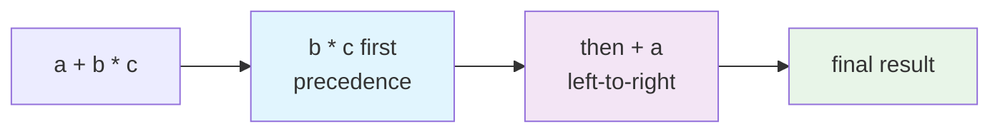
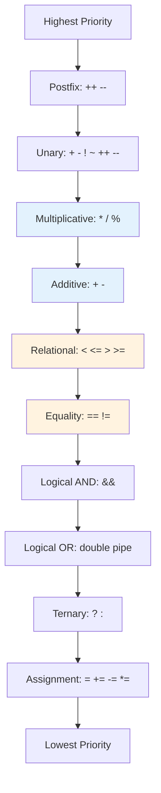

# Java Complete - Part 4: Operators and Expressions

**Why This Matters**: Operators are the building blocks of all computations. Mastering precedence rules prevents bugs, while understanding different operator types enables complex logic and calculations.



Operators are the verbs of programming - they perform actions on data. Java provides a rich set of operators for arithmetic, comparison, logic, and assignment operations.

## Arithmetic Operators

**Core Operations**: `+` `-` `*` `/` `%` work as expected, but Java has specific rules for integer division and modulo.

```java
// Basic arithmetic - straightforward
int a = 15, b = 4;
System.out.println(a + b);    // Addition: 19
System.out.println(a - b);    // Subtraction: 11  
System.out.println(a * b);    // Multiplication: 60
System.out.println(a / b);    // Integer division: 3 (not 3.75!)
System.out.println(a % b);    // Remainder: 3
```

### Critical Integer Division Rule
```java
int result1 = 3 / 4;           // 0 (integers → integer result)
double result2 = 3.0 / 4;      // 0.75 (double involved → double result)
double result3 = (double)3/4;  // 0.75 (cast forces double division)
```

### Modulo Operator Uses
```java
// Check if even/odd
boolean isEven = (number % 2) == 0;

// Cycle through values (0, 1, 2, 0, 1, 2...)
int cycleValue = counter % 3;

// Negative numbers keep sign of dividend
System.out.println(-15 % 4);   // -3 (not 1!)
```

### Unary Operators

**Single Operand**: Work on one value. The critical difference is **when** the increment/decrement happens.

```java
int x = 5;
System.out.println(+x);    // Unary plus: 5 (rarely used)
System.out.println(-x);    // Unary minus: -5 (x still 5)
System.out.println(!true); // Boolean NOT: false
```

### Increment/Decrement: Before vs After

```java
int a = 10;

// Pre-increment: change FIRST, then use
int result1 = ++a;  // a becomes 11, result1 gets 11

// Post-increment: use FIRST, then change  
int result2 = a++;  // result2 gets 11, then a becomes 12
```

**Common Usage**: Loop counters
```java
// Pre-increment in condition (common pattern)
for (int i = 0; i < 10; ++i) { /* faster by tiny amount */ }

// Post-increment when you need original value
while (countdown > 0) {
    System.out.println(countdown--);  // print, then decrement
}
```

## Assignment Operators

**Compound Assignment**: Perform operation and assignment in one step. More concise and often more efficient.

```java
int balance = 1000;

// Compound assignment - shorthand for common operations
balance += 250;     // Same as: balance = balance + 250
balance -= 100;     // Same as: balance = balance - 100  
balance *= 2;       // Same as: balance = balance * 2
balance /= 3;       // Same as: balance = balance / 3
balance %= 100;     // Same as: balance = balance % 100

// Works with other operators too
String message = "Hello";
message += " World";  // String concatenation: "Hello World"
        
// Shift assignment
int value = 8;
value <<= 2;       // Left shift by 2 positions (multiply by 4)
System.out.println("8 << 2 = " + value);  // 32

value >>= 3;       // Right shift by 3 positions (divide by 8)
System.out.println("32 >> 3 = " + value); // 4
```

## Comparison Operators

Comparison operators evaluate relationships between values and return boolean results:

```java
public class ComparisonOperators {
    public static void main(String[] args) {
        int a = 10, b = 20, c = 10;
        
        System.out.println("a = " + a + ", b = " + b + ", c = " + c);
        
        // Equality and inequality
        System.out.println("a == b: " + (a == b));  // false
        System.out.println("a == c: " + (a == c));  // true
        System.out.println("a != b: " + (a != b));  // true
        System.out.println("a != c: " + (a != c));  // false
        
        // Relational comparisons
        System.out.println("a < b: " + (a < b));    // true
        System.out.println("a > b: " + (a > b));    // false
        System.out.println("a <= c: " + (a <= c));  // true
        System.out.println("a >= c: " + (a >= c));  // true
        
        // Comparing floating-point numbers (careful!)
        double x = 0.1 + 0.2;
        double y = 0.3;
        System.out.println("0.1 + 0.2 = " + x);
        System.out.println("0.3 = " + y);
        System.out.println("x == y: " + (x == y));  // false due to precision
        
        // Proper way to compare floating-point numbers
        double epsilon = 1e-10;
        boolean isEqual = Math.abs(x - y) < epsilon;
        System.out.println("Are they equal (with epsilon)? " + isEqual);
        
        // String comparison pitfall
        String str1 = "hello";
        String str2 = "hello";
        String str3 = new String("hello");
        
        System.out.println("str1 == str2: " + (str1 == str2));    // true (string pooling)
        System.out.println("str1 == str3: " + (str1 == str3));    // false (different objects)
        System.out.println("str1.equals(str3): " + str1.equals(str3)); // true (content comparison)
        
        // Chaining comparisons (mathematical style doesn't work!)
        int age = 25;
        // boolean isAdult = 18 <= age <= 65;  // Compile error!
        boolean isAdult = (18 <= age) && (age <= 65);  // Correct way
        System.out.println("Is adult (18-65): " + isAdult);
    }
}
```

## Logical Operators

Logical operators combine boolean expressions:

```java
public class LogicalOperators {
    public static void main(String[] args) {
        boolean isWeekend = true;
        boolean isHoliday = false;
        boolean isRaining = true;
        int temperature = 75;
        
        // AND operator - both conditions must be true
        boolean perfectDay = isWeekend && !isRaining && (temperature > 70);
        System.out.println("Perfect day for outdoor activity: " + perfectDay);
        
        // OR operator - at least one condition must be true
        boolean stayHome = isRaining || isHoliday || (temperature < 32);
        System.out.println("Good day to stay home: " + stayHome);
        
        // NOT operator - negates boolean value
        boolean workDay = !isWeekend && !isHoliday;
        System.out.println("Work day: " + workDay);
        
        // Short-circuit evaluation demonstration
        System.out.println("\n--- Short-circuit Evaluation ---");
        
        int x = 5, y = 0;
        
        // Short-circuit AND: if first is false, second isn't evaluated
        boolean result1 = (y != 0) && (x / y > 2);
        System.out.println("Safe division with AND: " + result1);
        
        // Short-circuit OR: if first is true, second isn't evaluated
        boolean result2 = (x > 0) || (x / y > 2);  // Second part not evaluated
        System.out.println("Short-circuit OR: " + result2);
        
        // Demonstrating short-circuit with method calls
        System.out.println("Testing short-circuit with methods:");
        boolean test1 = falseMethod() && trueMethod();  // trueMethod() not called
        System.out.println("Result: " + test1);
        
        boolean test2 = trueMethod() || falseMethod();  // falseMethod() not called
        System.out.println("Result: " + test2);
        
        // Complex logical expressions
        int score = 85;
        char grade = 'B';
        boolean hasExtraCredit = true;
        
        boolean passesClass = (score >= 60) && 
                              ((grade != 'F') || hasExtraCredit) &&
                              (score > 0);
        System.out.println("Student passes: " + passesClass);
        
        // De Morgan's Laws demonstration
        boolean p = true, q = false;
        System.out.println("\n--- De Morgan's Laws ---");
        System.out.println("!(p && q) = " + (!(p && q)));
        System.out.println("!p || !q = " + (!p || !q));
        System.out.println("Are they equal? " + ((!(p && q)) == (!p || !q)));
        
        System.out.println("!(p || q) = " + (!(p || q)));
        System.out.println("!p && !q = " + (!p && !q));
        System.out.println("Are they equal? " + ((!(p || q)) == (!p && !q)));
    }
    
    private static boolean falseMethod() {
        System.out.println("falseMethod() called");
        return false;
    }
    
    private static boolean trueMethod() {
        System.out.println("trueMethod() called");
        return true;
    }
}
```

## Bitwise Operators

Bitwise operators work on individual bits and are useful for low-level programming, flags, and optimization:

```java
public class BitwiseOperators {
    public static void main(String[] args) {
        int a = 0b1100;  // 12 in decimal
        int b = 0b1010;  // 10 in decimal
        
        System.out.println("a = " + a + " (binary: " + Integer.toBinaryString(a) + ")");
        System.out.println("b = " + b + " (binary: " + Integer.toBinaryString(b) + ")");
        
        // Bitwise AND: 1 if both bits are 1
        int andResult = a & b;  // 1100 & 1010 = 1000 (8)
        System.out.println("a & b = " + andResult + " (binary: " + Integer.toBinaryString(andResult) + ")");
        
        // Bitwise OR: 1 if at least one bit is 1
        int orResult = a | b;   // 1100 | 1010 = 1110 (14)
        System.out.println("a | b = " + orResult + " (binary: " + Integer.toBinaryString(orResult) + ")");
        
        // Bitwise XOR: 1 if bits are different
        int xorResult = a ^ b;  // 1100 ^ 1010 = 0110 (6)
        System.out.println("a ^ b = " + xorResult + " (binary: " + Integer.toBinaryString(xorResult) + ")");
        
        // Bitwise NOT: flips all bits
        int notResult = ~a;     // ~1100 = ...11110011 (in 32-bit)
        System.out.println("~a = " + notResult);
        
        // Bit shifts
        int value = 8;  // 1000 in binary
        System.out.println("\nBit shifting with " + value + ":");
        
        // Left shift: multiply by 2^n
        int leftShift = value << 2;  // 1000 << 2 = 100000 (32)
        System.out.println(value + " << 2 = " + leftShift);
        
        // Right shift (arithmetic): divide by 2^n, preserves sign
        int rightShift = value >> 1;  // 1000 >> 1 = 100 (4)
        System.out.println(value + " >> 1 = " + rightShift);
        
        // Unsigned right shift: always fills with 0
        int negativeValue = -8;
        int unsignedShift = negativeValue >>> 1;
        System.out.println(negativeValue + " >>> 1 = " + unsignedShift);
        
        // Practical application: fast multiplication and division by powers of 2
        System.out.println("\nFast arithmetic with bit shifts:");
        int number = 100;
        System.out.println(number + " * 4 = " + (number << 2));  // Multiply by 4
        System.out.println(number + " * 8 = " + (number << 3));  // Multiply by 8
        System.out.println(number + " / 4 = " + (number >> 2));  // Divide by 4
        System.out.println(number + " / 8 = " + (number >> 3));  // Divide by 8
        
        // Practical application: using bits as flags
        demonstrateBitFlags();
    }
    
    private static void demonstrateBitFlags() {
        System.out.println("\n--- Using Bits as Flags ---");
        
        // Define flag constants
        final int READ_PERMISSION = 1;     // 001
        final int WRITE_PERMISSION = 2;    // 010
        final int EXECUTE_PERMISSION = 4;  // 100
        
        // Set multiple flags
        int permissions = READ_PERMISSION | WRITE_PERMISSION;  // 011
        System.out.println("Initial permissions: " + Integer.toBinaryString(permissions));
        
        // Check if a specific flag is set
        boolean canRead = (permissions & READ_PERMISSION) != 0;
        boolean canWrite = (permissions & WRITE_PERMISSION) != 0;
        boolean canExecute = (permissions & EXECUTE_PERMISSION) != 0;
        
        System.out.println("Can read: " + canRead);
        System.out.println("Can write: " + canWrite);
        System.out.println("Can execute: " + canExecute);
        
        // Add execute permission
        permissions |= EXECUTE_PERMISSION;  // 011 | 100 = 111
        System.out.println("After adding execute: " + Integer.toBinaryString(permissions));
        
        // Remove write permission
        permissions &= ~WRITE_PERMISSION;   // 111 & 101 = 101
        System.out.println("After removing write: " + Integer.toBinaryString(permissions));
        
        // Toggle read permission
        permissions ^= READ_PERMISSION;     // 101 ^ 001 = 100
        System.out.println("After toggling read: " + Integer.toBinaryString(permissions));
    }
}
```

## The Ternary Operator

The ternary operator provides a concise way to make simple decisions:

```java
public class TernaryOperator {
    public static void main(String[] args) {
        // Basic syntax: condition ? valueIfTrue : valueIfFalse
        int age = 17;
        String status = (age >= 18) ? "adult" : "minor";
        System.out.println("Age " + age + " is classified as: " + status);
        
        // Nested ternary operators (use sparingly)
        int score = 85;
        String grade = (score >= 90) ? "A" :
                      (score >= 80) ? "B" :
                      (score >= 70) ? "C" :
                      (score >= 60) ? "D" : "F";
        System.out.println("Score " + score + " gets grade: " + grade);
        
        // Ternary with different types (must be compatible)
        boolean isPositive = true;
        Number result = isPositive ? 42 : -3.14;  // Number is common supertype
        System.out.println("Result: " + result);
        
        // Practical examples
        demonstratePracticalTernary();
        
        // Avoid complex ternary operators
        System.out.println("\n--- Readability Comparison ---");
        
        int x = 10, y = 5;
        
        // Hard to read (avoid)
        int complex = (x > y) ? (x % 2 == 0) ? x * 2 : x * 3 : (y % 2 == 0) ? y * 2 : y * 3;
        
        // More readable alternative
        int readable;
        if (x > y) {
            readable = (x % 2 == 0) ? x * 2 : x * 3;
        } else {
            readable = (y % 2 == 0) ? y * 2 : y * 3;
        }
        
        System.out.println("Complex ternary result: " + complex);
        System.out.println("Readable alternative result: " + readable);
    }
    
    private static void demonstratePracticalTernary() {
        System.out.println("\n--- Practical Ternary Examples ---");
        
        // Safe division
        int dividend = 100, divisor = 0;
        int quotient = (divisor != 0) ? dividend / divisor : 0;
        System.out.println("Safe division result: " + quotient);
        
        // Default values
        String name = null;
        String displayName = (name != null) ? name : "Unknown User";
        System.out.println("Display name: " + displayName);
        
        // Min/max without Math.min/Math.max
        int a = 15, b = 23;
        int min = (a < b) ? a : b;
        int max = (a > b) ? a : b;
        System.out.println("Min of " + a + " and " + b + ": " + min);
        System.out.println("Max of " + a + " and " + b + ": " + max);
        
        // Formatting output
        int itemCount = 1;
        System.out.println("You have " + itemCount + " item" + (itemCount == 1 ? "" : "s"));
        
        itemCount = 3;
        System.out.println("You have " + itemCount + " item" + (itemCount == 1 ? "" : "s"));
        
        // Setting bounds
        int userInput = 150;
        int boundedValue = (userInput > 100) ? 100 : (userInput < 0) ? 0 : userInput;
        System.out.println("Bounded value (0-100): " + boundedValue);
    }
}
```

## Operator Precedence and Associativity

**Critical for Bug Prevention**: Java evaluates expressions in a specific order. Knowing precedence rules prevents logic errors and unexpected results.



**Memory Aid**: **Math** (*, /, %) → **Add/Sub** (+, -) → **Compare** (<, >=, ==) → **Logic** (&&, ||) → **Assign** (=)

### Essential Precedence Examples

```java
// Math operators first: *, /, % before +, -
int result1 = 2 + 3 * 4;        // 14, not 20 (3*4 first, then +2)
int result2 = (2 + 3) * 4;      // 20 (parentheses override precedence)

// Comparison before logic: <, >= before &&, ||
boolean valid1 = age >= 18 && score > 60;        // Safe: compares first
boolean valid2 = age >= 18 && score > 60 || vip; // (age>=18 && score>60) || vip

// Logic order: && before ||
boolean result = true || false && false;  // true (false && false first)
boolean result2 = (true || false) && false; // false (parentheses change it)
        
        // Comparison vs. logical operators
        int x = 5, y = 10, z = 15;
        boolean result5 = x < y && y < z;    // (x < y) && (y < z) = true && true = true
        // boolean result6 = x < y && z;     // Compile error! Can't use && with int
        System.out.println("x < y && y < z = " + result5);
        
        // Assignment has lowest precedence
        int value;
        value = x + y * z;  // value = x + (y * z) = 5 + 150 = 155
        System.out.println("value = x + y * z: " + value);
        
        // Associativity examples
        System.out.println("\n--- Associativity ---");
        
        // Left-to-right associativity for same precedence
        int divide = 100 / 5 / 2;    // (100 / 5) / 2 = 20 / 2 = 10
        int power = 2;
        // Java doesn't have ** operator, but if it did:
        // 2 ** 3 ** 2 would be right-associative: 2 ** (3 ** 2) = 2 ** 9 = 512
        System.out.println("100 / 5 / 2 = " + divide);
        
        // Assignment is right-associative
        int p, q, r;
        p = q = r = 10;  // r = 10; q = r; p = q;
        System.out.println("p = q = r = 10: p=" + p + ", q=" + q + ", r=" + r);
        
        // Increment/decrement with other operators
        int n = 5;
        int result6 = n++ * 2;  // n * 2, then n++: 5 * 2 = 10, n becomes 6
        System.out.println("n++ * 2 = " + result6 + ", n is now " + n);
        
        int m = 5;
        int result7 = ++m * 2;  // ++m, then m * 2: 6 * 2 = 12
        System.out.println("++m * 2 = " + result7 + ", m is now " + m);
        
        // Demonstrating precedence table
        demonstratePrecedenceTable();
    }
    
    private static void demonstratePrecedenceTable() {
        System.out.println("\n--- Precedence Demonstration ---");
        
        int a = 10, b = 5, c = 2;
        boolean x = true, y = false;
        
        // Complex expression
        boolean result = a > b + c && x || !y && a / c > b % c;
        
        // Breaking it down step by step:
        System.out.println("Original: a > b + c && x || !y && a / c > b % c");
        System.out.println("Step 1 - arithmetic: " + a + " > " + (b + c) + " && " + x + " || !" + y + " && " + (a / c) + " > " + (b % c));
        System.out.println("Step 2 - comparison: " + (a > (b + c)) + " && " + x + " || !" + y + " && " + ((a / c) > (b % c)));
        System.out.println("Step 3 - logical NOT: " + (a > (b + c)) + " && " + x + " || " + (!y) + " && " + ((a / c) > (b % c)));
        System.out.println("Step 4 - logical AND: " + ((a > (b + c)) && x) + " || " + ((!y) && ((a / c) > (b % c))));
        System.out.println("Step 5 - logical OR: " + result);
        
        // Same expression with explicit parentheses for clarity
        boolean clarified = ((a > (b + c)) && x) || ((!y) && ((a / c) > (b % c)));
        System.out.println("With explicit parentheses: " + clarified);
        System.out.println("Results match: " + (result == clarified));
    }
}
```

## Practical Application: Expression Calculator

Let's build a calculator that demonstrates these concepts:

```java
import java.util.Scanner;

public class ExpressionCalculator {
    public static void main(String[] args) {
        Scanner scanner = new Scanner(System.in);
        boolean continueCalculating = true;
        
        System.out.println("=== Expression Calculator ===");
        System.out.println("Supports: +, -, *, /, %, ^(power), sqrt");
        System.out.println("Type 'help' for examples, 'quit' to exit");
        
        while (continueCalculating) {
            System.out.print("\nEnter expression: ");
            String input = scanner.nextLine().trim();
            
            if (input.equalsIgnoreCase("quit")) {
                continueCalculating = false;
                continue;
            }
            
            if (input.equalsIgnoreCase("help")) {
                showHelp();
                continue;
            }
            
            try {
                double result = evaluateExpression(input);
                System.out.printf("Result: %.6f%n", result);
                
                // Additional information about the result
                analyzeResult(result);
                
            } catch (Exception e) {
                System.out.println("Error: " + e.getMessage());
            }
        }
        
        scanner.close();
        System.out.println("Calculator closed.");
    }
    
    private static void showHelp() {
        System.out.println("\nExamples:");
        System.out.println("  2 + 3 * 4        → 14");
        System.out.println("  (2 + 3) * 4      → 20");
        System.out.println("  10 / 3           → 3.333333");
        System.out.println("  10 % 3           → 1");
        System.out.println("  2 ^ 8            → 256 (power)");
        System.out.println("  sqrt 16          → 4");
        System.out.println("  -5 + 3           → -2");
    }
    
    private static double evaluateExpression(String expression) {
        expression = expression.replaceAll("\\s+", ""); // Remove whitespace
        
        // Handle special functions
        if (expression.startsWith("sqrt")) {
            double value = Double.parseDouble(expression.substring(4));
            if (value < 0) {
                throw new IllegalArgumentException("Cannot take square root of negative number");
            }
            return Math.sqrt(value);
        }
        
        // Simple recursive descent parser for basic arithmetic
        return parseExpression(expression, 0)[0];
    }
    
    // Simplified expression parser (handles +, -, *, /, %, ^, parentheses)
    private static double[] parseExpression(String expr, int pos) {
        double[] left = parseTerm(expr, pos);
        double result = left[0];
        pos = (int) left[1];
        
        while (pos < expr.length()) {
            char op = expr.charAt(pos);
            if (op == '+' || op == '-') {
                double[] right = parseTerm(expr, pos + 1);
                if (op == '+') {
                    result += right[0];
                } else {
                    result -= right[0];
                }
                pos = (int) right[1];
            } else {
                break;
            }
        }
        
        return new double[]{result, pos};
    }
    
    private static double[] parseTerm(String expr, int pos) {
        double[] left = parseFactor(expr, pos);
        double result = left[0];
        pos = (int) left[1];
        
        while (pos < expr.length()) {
            char op = expr.charAt(pos);
            if (op == '*' || op == '/' || op == '%') {
                double[] right = parseFactor(expr, pos + 1);
                if (op == '*') {
                    result *= right[0];
                } else if (op == '/') {
                    if (right[0] == 0) {
                        throw new ArithmeticException("Division by zero");
                    }
                    result /= right[0];
                } else {
                    result %= right[0];
                }
                pos = (int) right[1];
            } else {
                break;
            }
        }
        
        return new double[]{result, pos};
    }
    
    private static double[] parseFactor(String expr, int pos) {
        if (pos >= expr.length()) {
            throw new IllegalArgumentException("Unexpected end of expression");
        }
        
        // Handle parentheses
        if (expr.charAt(pos) == '(') {
            double[] result = parseExpression(expr, pos + 1);
            if ((int)result[1] >= expr.length() || expr.charAt((int)result[1]) != ')') {
                throw new IllegalArgumentException("Missing closing parenthesis");
            }
            return new double[]{result[0], result[1] + 1};
        }
        
        // Handle unary minus
        if (expr.charAt(pos) == '-') {
            double[] result = parseFactor(expr, pos + 1);
            return new double[]{-result[0], result[1]};
        }
        
        // Handle numbers
        int start = pos;
        if (expr.charAt(pos) == '+') {
            pos++;
        }
        
        while (pos < expr.length() && (Character.isDigit(expr.charAt(pos)) || expr.charAt(pos) == '.')) {
            pos++;
        }
        
        if (start == pos || (start + 1 == pos && expr.charAt(start) == '+')) {
            throw new IllegalArgumentException("Invalid number format");
        }
        
        double number = Double.parseDouble(expr.substring(start, pos));
        
        // Handle power operator
        if (pos < expr.length() && expr.charAt(pos) == '^') {
            double[] exponent = parseFactor(expr, pos + 1);
            number = Math.pow(number, exponent[0]);
            pos = (int) exponent[1];
        }
        
        return new double[]{number, pos};
    }
    
    private static void analyzeResult(double result) {
        System.out.println("Analysis:");
        
        // Check if result is an integer
        if (result == Math.floor(result)) {
            System.out.println("  - Result is a whole number");
            
            long longResult = (long) result;
            if (longResult > 0) {
                // Check if it's even or odd
                System.out.println("  - Number is " + (longResult % 2 == 0 ? "even" : "odd"));
                
                // Check if it's a perfect square
                double sqrt = Math.sqrt(longResult);
                if (sqrt == Math.floor(sqrt)) {
                    System.out.println("  - Number is a perfect square (√" + longResult + " = " + (int)sqrt + ")");
                }
                
                // Check if it's a power of 2
                if ((longResult & (longResult - 1)) == 0) {
                    System.out.println("  - Number is a power of 2");
                }
            }
        } else {
            System.out.printf("  - Decimal part: %.6f%n", result - Math.floor(result));
        }
        
        // Special values
        if (Double.isInfinite(result)) {
            System.out.println("  - Result is infinite");
        } else if (Double.isNaN(result)) {
            System.out.println("  - Result is not a number (NaN)");
        } else if (result == 0.0) {
            System.out.println("  - Result is zero");
        } else if (result < 0) {
            System.out.println("  - Result is negative");
        }
        
        // Scientific notation for very large or small numbers
        if (Math.abs(result) > 1e6 || (Math.abs(result) < 1e-3 && result != 0)) {
            System.out.printf("  - Scientific notation: %.3e%n", result);
        }
    }
}
```

## Common Mistakes and Best Practices

### 1. Integer Division Trap
```java
// Wrong - integer division
double average = (a + b + c) / 3;

// Right - ensure floating-point division
double average = (a + b + c) / 3.0;
// or
double average = (double)(a + b + c) / 3;
```

### 2. Floating-Point Comparison
```java
// Wrong - exact comparison
if (result == 0.3) { /* might not work */ }

// Right - epsilon comparison
final double EPSILON = 1e-10;
if (Math.abs(result - 0.3) < EPSILON) { /* more reliable */ }
```

### 3. Increment/Decrement in Complex Expressions
```java
// Confusing - avoid
int result = ++i + i++ + --j + j--;

// Clearer - separate operations
i++;
j--;
int result = i + old_i + j + old_j;
```

### 4. Operator Precedence Clarity
```java
// Unclear
boolean valid = age > 18 && score >= 60 || hasPermission && status == ACTIVE;

// Clear with parentheses
boolean valid = ((age > 18) && (score >= 60)) || (hasPermission && (status == ACTIVE));
```

## Looking Ahead

You now understand how to combine Java's basic data types using operators to create expressions. In the next tutorial, we'll explore control flow statements - how to make decisions and alter program execution based on these expressions. We'll cover if-else statements, switch expressions, and how to structure complex decision-making logic.

The expression evaluation skills you've learned here are fundamental to every aspect of Java programming. Whether you're calculating business logic, processing user input, or making algorithmic decisions, you'll use these operators constantly. Practice building complex expressions and always prioritize clarity over cleverness - your future self (and your teammates) will thank you.