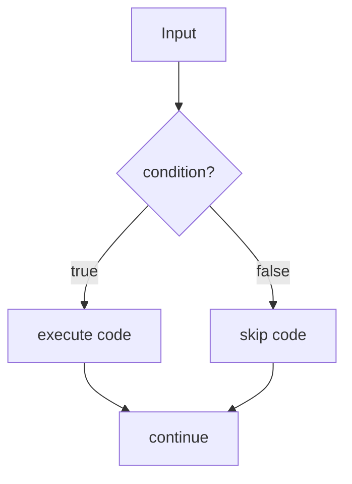
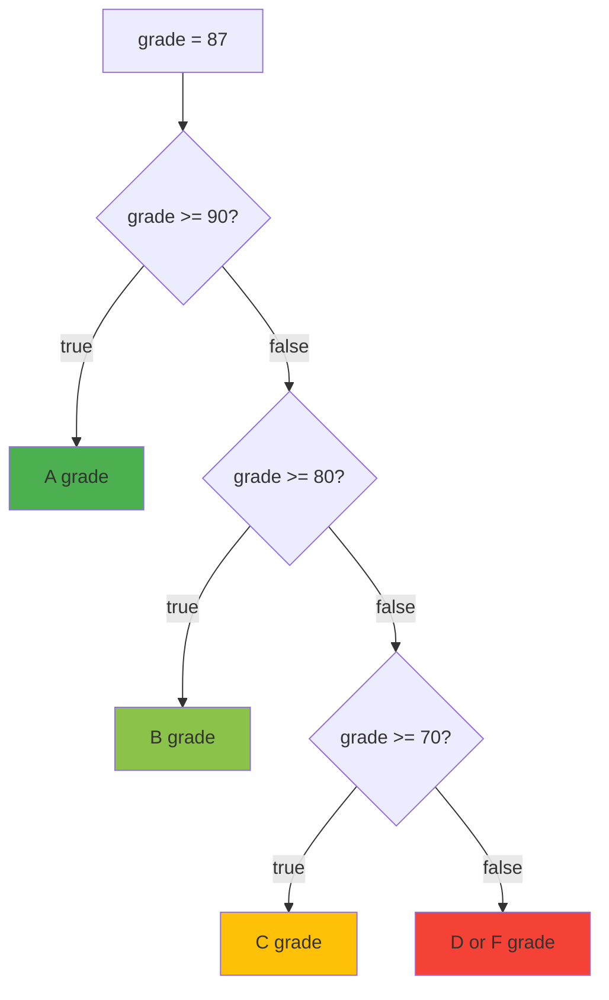
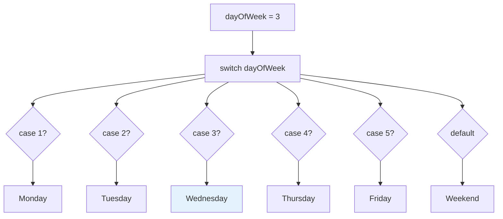
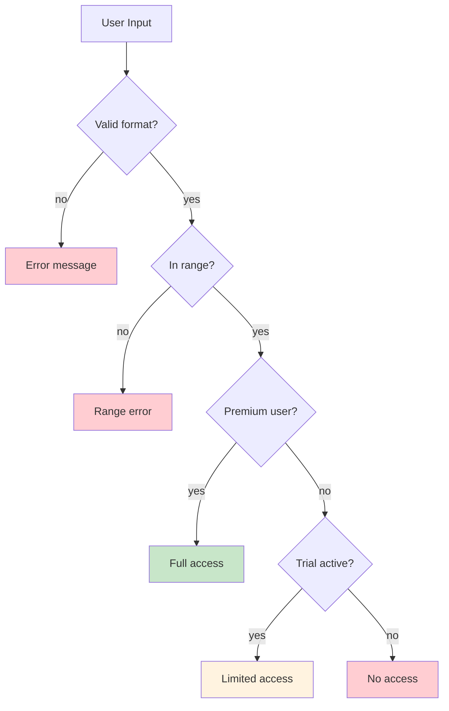
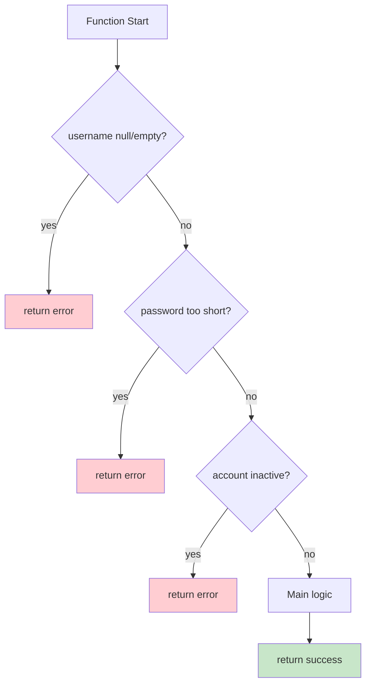

# Java Complete - Part 5: Control Flow Statements

**Why This Matters**: Control flow is what makes programs intelligent. Without conditionals, every program would execute the same way every time. Mastering if-else and switch statements enables your code to respond to different situations and user inputs.

Programs become powerful when they can make decisions based on data, user input, or computed results.

## The if Statement

A quick mental model of branching:


**Basic Pattern**: `if (condition) { code }` - executes code only when condition is true.

```java
int temperature = 75;
boolean isSunny = true;

// Simple condition
if (temperature > 70) {
    System.out.println("It's warm today!");
}

// Compound conditions
if (temperature > 70 && isSunny) {
    System.out.println("Perfect weather!");
}

// Complex logic with parentheses for clarity
if (age >= 18 || (hasLicense && hasParentPermission)) {
    System.out.println("Can drive legally.");
}
```

**Key Rule**: Use parentheses to make complex conditions clear, even when not required by precedence.

## if-else Chains

The `if-else` chain handles multiple decision paths:



**Pattern**: Chain conditions from most specific to most general.

```java
int grade = 87;
String result;

if (grade >= 90) {
    result = "A - Outstanding!";
} else if (grade >= 80) {    // Only checked if grade < 90
    result = "B - Good work!";
} else if (grade >= 70) {    // Only checked if grade < 80  
    result = "C - Satisfactory";
} else if (grade >= 60) {    // Only checked if grade < 70
    result = "D - Needs improvement";
} else {                     // Everything else (grade < 60)
    result = "F - Must retake";
}

System.out.println("Grade " + grade + ": " + result);
```

## Switch Statements

The `switch` statement efficiently handles multiple value-based choices:



### Traditional Switch (Before Java 14)

**Critical Rule**: Always include `break;` or cases will "fall through" to the next case!

```java
int day = 3;
String dayName;

switch (day) {
    case 1:
        dayName = "Monday";
        break;                  // Essential! Without this, execution continues
    case 2:
        dayName = "Tuesday";
        break;
    case 3:
        dayName = "Wednesday";
        break;
    case 6:                     // Fall-through is sometimes useful
    case 7:
        dayName = "Weekend";    // Both case 6 and 7 execute this
        break;
    default:
        dayName = "Invalid day";
}
```

### Modern Switch Expressions (Java 14+)

**Advantages**: No `break` needed, can return values directly, more concise.

```java
// Switch expression - cleaner and safer
String dayType = switch (day) {
    case 1, 2, 3, 4, 5 -> "Weekday";    // Multiple cases in one line
    case 6, 7 -> "Weekend";
    default -> "Invalid";
};

// For complex logic, use yield
String workload = switch (day) {
    case 1 -> {
        System.out.println("Monday blues!");
        yield "Heavy";                    // yield returns the value
    }
    case 6, 7 -> "Light";
    default -> "Normal";
};
```

## Nested Conditions and Logic Patterns

Understanding how conditions nest and combine:



### Input Validation Pattern

```java
import java.util.Scanner;

public class ValidationExample {
    public static void main(String[] args) {
        Scanner scanner = new Scanner(System.in);
        
        System.out.print("Enter your age: ");
        
        if (scanner.hasNextInt()) {
            int age = scanner.nextInt();
            
            if (age < 0 || age > 150) {
                System.out.println("Invalid age range!");
            } else {
                // Valid age - determine category
                String category = switch (age) {
                    case 0, 1, 2, 3, 4, 5, 6, 7, 8, 9, 10, 11, 12 -> "Child";
                    case 13, 14, 15, 16, 17, 18, 19 -> "Teenager";
                    default -> age >= 65 ? "Senior" : "Adult";
                };
                
                System.out.println("You are a " + category);
                
                // Age-based permissions
                if (age >= 18) System.out.println("✓ Can vote");
                if (age >= 21) System.out.println("✓ Can drink (US)");
                if (age >= 65) System.out.println("✓ Senior discounts");
            }
        } else {
            System.out.println("Please enter a valid number!");
        }
        
        scanner.close();
    }
}
```

## Guard Clauses Pattern

Instead of deep nesting, use early returns for cleaner code:



```java
public class AuthenticationSystem {
    public static String authenticateUser(String username, String password, boolean accountActive) {
        // Guard clauses - handle errors early
        if (username == null || username.trim().isEmpty()) {
            return "ERROR: Username required";
        }
        
        if (password == null || password.length() < 6) {
            return "ERROR: Password must be at least 6 characters";
        }
        
        if (!accountActive) {
            return "ERROR: Account deactivated";
        }
        
        // Main logic - no nested conditions needed
        if (isValidCredentials(username, password)) {
            return "SUCCESS: Login successful";
        } else {
            return "ERROR: Invalid credentials";
        }
    }
    
    private static boolean isValidCredentials(String username, String password) {
        return username.equals("admin") && password.equals("password123");
    }
    
    public static void main(String[] args) {
        System.out.println(authenticateUser("admin", "password123", true));
        System.out.println(authenticateUser("", "password123", true));
        System.out.println(authenticateUser("admin", "123", true));
    }
}
```

## Practical Example: Simple Calculator

Putting it all together in a real-world scenario:

```java
import java.util.Scanner;

public class SimpleCalculator {
    public static void main(String[] args) {
        Scanner scanner = new Scanner(System.in);
        
        System.out.print("Enter first number: ");
        double num1 = scanner.nextDouble();
        
        System.out.print("Enter operator (+, -, *, /): ");
        char operator = scanner.next().charAt(0);
        
        System.out.print("Enter second number: ");
        double num2 = scanner.nextDouble();
        
        double result = calculateResult(num1, operator, num2);
        
        if (Double.isNaN(result)) {
            System.out.println("Error in calculation!");
        } else {
            System.out.printf("%.2f %c %.2f = %.2f%n", num1, operator, num2, result);
        }
        
        scanner.close();
    }
    
    private static double calculateResult(double num1, char operator, double num2) {
        return switch (operator) {
            case '+' -> num1 + num2;
            case '-' -> num1 - num2;
            case '*' -> num1 * num2;
            case '/' -> {
                if (num2 == 0) {
                    System.out.println("Error: Division by zero!");
                    yield Double.NaN;
                } else {
                    yield num1 / num2;
                }
            }
            default -> {
                System.out.println("Error: Unknown operator " + operator);
                yield Double.NaN;
            }
        };
    }
}
```

## Best Practices

### 1. Always Use Braces
```java
// Dangerous - can lead to bugs
if (condition)
    doSomething();

// Safe and clear
if (condition) {
    doSomething();
}
```

### 2. Prefer Modern Switch When Possible
```java
// Old way - verbose and error-prone
String result;
switch (value) {
    case 1: result = "One"; break;
    case 2: result = "Two"; break;
    default: result = "Other";
}

// Modern way - concise and safe
String result = switch (value) {
    case 1 -> "One";
    case 2 -> "Two";
    default -> "Other";
};
```

### 3. Use Guard Clauses to Reduce Nesting
```java
// Avoid deep nesting
if (user != null) {
    if (user.isActive()) {
        if (user.hasPermission()) {
            doSomething();
        }
    }
}

// Use guard clauses instead
if (user == null) return;
if (!user.isActive()) return;
if (!user.hasPermission()) return;

doSomething();
```

## Looking Ahead

You now understand how to control program flow with conditional statements. These decision-making structures are essential building blocks that you'll use in every Java program. 

In the next tutorial, we'll explore loops - structures that let you repeat code efficiently and handle collections of data. The combination of conditionals and loops gives you the power to solve complex problems by breaking them down into manageable, repeatable steps.