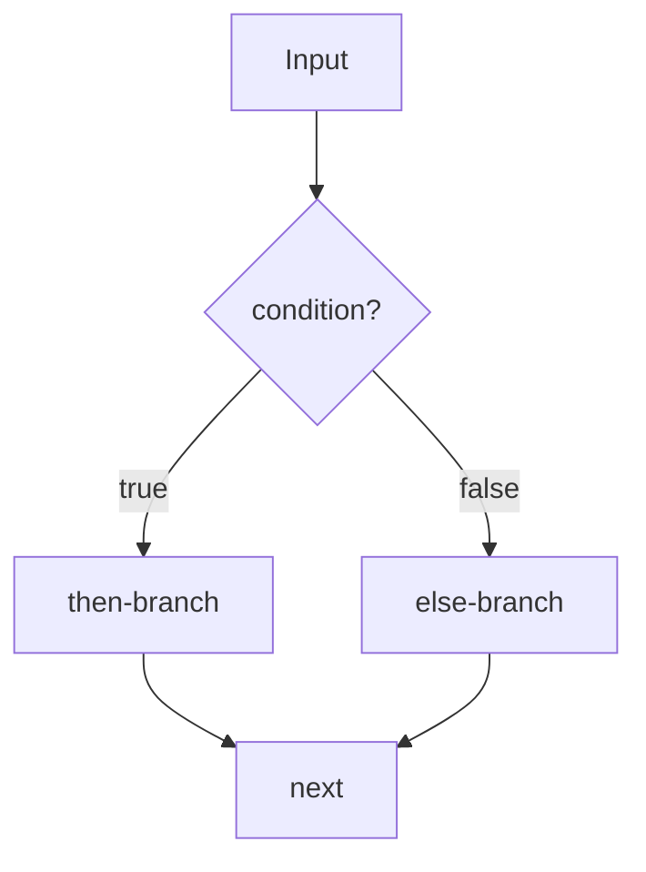

# Java Complete - Part 5: Control Flow Statements

Programs become powerful when they can make decisions. Control flow statements let your code choose different paths based on data, user input, or computed results. Java provides several mechanisms for controlling program flow, each suited to different types of decision-making scenarios.

## The if Statement

A quick mental model of branching:


The `if` statement is the foundation of conditional programming. It executes code only when a condition is true:

```java
public class BasicIfStatements {
    public static void main(String[] args) {
        int temperature = 75;
        boolean isSunny = true;
        boolean hasUmbrella = false;
        
        // Simple if statement
        if (temperature > 70) {
            System.out.println("It's warm today!");
        }
        
        // if with compound condition
        if (temperature > 70 && isSunny) {
            System.out.println("Perfect weather for outdoor activities.");
        }
        
        // if statement with block
        if (!hasUmbrella && temperature < 50) {
            System.out.println("You might want to grab an umbrella.");
            System.out.println("It's cold and you're not prepared.");
            System.out.println("Consider staying inside.");
        }
        
        // Single statement doesn't require braces (but recommended)
        if (isSunny)
            System.out.println("Don't forget sunglasses!");
        
        // Always use braces for clarity and maintainability
        if (isSunny) {
            System.out.println("UV protection is important.");
        }
        
        // Demonstration of expression evaluation in conditions
        int score = 85;
        if (score >= 90) {
            System.out.println("Excellent work!");
        }
        
        // Complex conditions
        int age = 16;
        boolean hasLicense = false;
        boolean hasParentPermission = true;
        
        if (age >= 18 || (age >= 16 && hasLicense && hasParentPermission)) {
            System.out.println("Can drive legally.");
        }
    }
}
```

## if-else Statements

The `if-else` statement provides an alternative path when the condition is false:

```java
public class IfElseStatements {
    public static void main(String[] args) {
        // Simple if-else
        int number = 7;
        if (number % 2 == 0) {
            System.out.println(number + " is even");
        } else {
            System.out.println(number + " is odd");
        }
        
        // Multi-way decision with else-if
        int grade = 87;
        char letterGrade;
        
        if (grade >= 90) {
            letterGrade = 'A';
            System.out.println("Outstanding performance!");
        } else if (grade >= 80) {
            letterGrade = 'B';
            System.out.println("Good work!");
        } else if (grade >= 70) {
            letterGrade = 'C';
            System.out.println("Satisfactory.");
        } else if (grade >= 60) {
            letterGrade = 'D';
            System.out.println("Needs improvement.");
        } else {
            letterGrade = 'F';
            System.out.println("Must retake the course.");
        }
        
        System.out.println("Letter grade: " + letterGrade);
        
        // Nested if-else statements
        boolean isWeekend = false;
        int hour = 14; // 2 PM in 24-hour format
        
        if (isWeekend) {
            if (hour < 10) {
                System.out.println("Weekend morning - sleep in!");
            } else if (hour < 17) {
                System.out.println("Weekend afternoon - time for hobbies!");
            } else {
                System.out.println("Weekend evening - relax!");
            }
        } else {
            if (hour < 9) {
                System.out.println("Early morning - prepare for work!");
            } else if (hour < 17) {
                System.out.println("Work hours - stay focused!");
            } else if (hour < 20) {
                System.out.println("Evening - time to unwind!");
            } else {
                System.out.println("Night time - get ready for bed!");
            }
        }
        
        // Demonstrating the dangling else problem
        boolean condition1 = true;
        boolean condition2 = false;
        
        // Which if does the else belong to?
        if (condition1)
            if (condition2)
                System.out.println("Both conditions true");
        // This else belongs to the inner if, not the outer one
            else
                System.out.println("Condition1 true, Condition2 false");
        
        // Better: always use braces to be explicit
        if (condition1) {
            if (condition2) {
                System.out.println("Both conditions true");
            } else {
                System.out.println("Condition1 true, Condition2 false");
            }
        }
        
        // Range checking with logical operators
        int value = 50;
        if (value >= 0 && value <= 100) {
            System.out.println("Value is within normal range");
        } else {
            System.out.println("Value is out of range");
        }
    }
}
```

## Switch Statements

The `switch` statement provides a clean way to choose among multiple alternatives based on a single value:

```java
public class SwitchStatements {
    public static void main(String[] args) {
        // Traditional switch statement
        int dayOfWeek = 3; // Wednesday
        String dayName;
        
        switch (dayOfWeek) {
            case 1:
                dayName = "Monday";
                break;
            case 2:
                dayName = "Tuesday";
                break;
            case 3:
                dayName = "Wednesday";
                break;
            case 4:
                dayName = "Thursday";
                break;
            case 5:
                dayName = "Friday";
                break;
            case 6:
                dayName = "Saturday";
                break;
            case 7:
                dayName = "Sunday";
                break;
            default:
                dayName = "Invalid day";
                break;
        }
        
        System.out.println("Day " + dayOfWeek + " is " + dayName);
        
        // Switch with fall-through (intentional)
        int month = 2; // February
        int days;
        
        switch (month) {
            case 1: case 3: case 5: case 7: case 8: case 10: case 12:
                days = 31;
                break;
            case 4: case 6: case 9: case 11:
                days = 30;
                break;
            case 2:
                days = 28; // Simplified - not handling leap years
                break;
            default:
                days = -1; // Invalid month
        }
        
        System.out.println("Month " + month + " has " + days + " days");
        
        // Switch with String (Java 7+)
        String operation = "add";
        double a = 10, b = 5;
        double result = 0;
        
        switch (operation.toLowerCase()) {
            case "add":
            case "addition":
            case "+":
                result = a + b;
                System.out.println(a + " + " + b + " = " + result);
                break;
            case "subtract":
            case "subtraction":
            case "-":
                result = a - b;
                System.out.println(a + " - " + b + " = " + result);
                break;
            case "multiply":
            case "multiplication":
            case "*":
                result = a * b;
                System.out.println(a + " * " + b + " = " + result);
                break;
            case "divide":
            case "division":
            case "/":
                if (b != 0) {
                    result = a / b;
                    System.out.println(a + " / " + b + " = " + result);
                } else {
                    System.out.println("Error: Division by zero");
                }
                break;
            default:
                System.out.println("Unknown operation: " + operation);
        }
        
        // Modern switch expressions (Java 14+)
        demonstrateModernSwitch();
        
        // Common pitfall: missing break statements
        demonstrateMissingBreak();
    }
    
    private static void demonstrateModernSwitch() {
        System.out.println("\n--- Modern Switch Expressions ---");
        
        // Switch expression with arrow syntax (Java 14+)
        int dayNum = 1;
        
        String dayType = switch (dayNum) {
            case 1, 2, 3, 4, 5 -> "Weekday";
            case 6, 7 -> "Weekend";
            default -> "Invalid day";
        };
        
        System.out.println("Day " + dayNum + " type: " + dayType);
        
        // Switch expression with yield (for complex cases)
        char grade = 'B';
        String description = switch (grade) {
            case 'A' -> {
                System.out.println("Calculating GPA impact for A grade...");
                yield "Excellent - GPA impact: 4.0";
            }
            case 'B' -> {
                System.out.println("Calculating GPA impact for B grade...");
                yield "Good - GPA impact: 3.0";
            }
            case 'C' -> "Average - GPA impact: 2.0";
            case 'D' -> "Below average - GPA impact: 1.0";
            case 'F' -> "Failing - GPA impact: 0.0";
            default -> "Invalid grade";
        };
        
        System.out.println("Grade " + grade + ": " + description);
        
        // Switch expression in method call
        int priority = 1;
        System.out.println("Task priority: " + getPriorityName(priority));
    }
    
    private static String getPriorityName(int priority) {
        return switch (priority) {
            case 1 -> "Critical";
            case 2 -> "High";
            case 3 -> "Medium";
            case 4 -> "Low";
            default -> "Unknown";
        };
    }
    
    private static void demonstrateMissingBreak() {
        System.out.println("\n--- Missing Break Demonstration ---");
        
        int score = 85;
        System.out.println("Score: " + score);
        
        // Intentionally missing break statements to show fall-through
        switch (score / 10) {
            case 10:
                System.out.println("Perfect score bonus!");
            case 9:
                System.out.println("A grade - Excellent!");
            case 8:
                System.out.println("B grade - Good work!");
            case 7:
                System.out.println("C grade - Satisfactory");
                break; // Only break here
            case 6:
                System.out.println("D grade - Needs improvement");
                break;
            default:
                System.out.println("F grade - Must retake");
        }
        
        System.out.println("(Notice how multiple messages printed due to fall-through)");
    }
}
```

## Conditional Assignment and Validation

Let's explore practical patterns for decision-making:

```java
import java.util.Scanner;

public class ConditionalPatterns {
    public static void main(String[] args) {
        Scanner scanner = new Scanner(System.in);
        
        // Input validation with nested conditions
        System.out.print("Enter your age: ");
        if (scanner.hasNextInt()) {
            int age = scanner.nextInt();
            
            if (age < 0) {
                System.out.println("Age cannot be negative!");
            } else if (age > 150) {
                System.out.println("Age seems unrealistic!");
            } else {
                System.out.println("Age " + age + " is valid.");
                
                // Further categorization
                String category;
                if (age < 13) {
                    category = "Child";
                } else if (age < 20) {
                    category = "Teenager";
                } else if (age < 60) {
                    category = "Adult";
                } else {
                    category = "Senior";
                }
                
                System.out.println("Category: " + category);
                
                // Age-based permissions
                System.out.println("Permissions:");
                if (age >= 16) System.out.println("- Can drive (with license)");
                if (age >= 18) System.out.println("- Can vote");
                if (age >= 21) System.out.println("- Can drink alcohol (US)");
                if (age >= 25) System.out.println("- Reduced car rental rates");
                if (age >= 65) System.out.println("- Eligible for senior discounts");
            }
        } else {
            System.out.println("Please enter a valid integer!");
        }
        
        // Complex business logic example
        demonstrateBusinessLogic();
        
        // Guard clauses pattern
        demonstrateGuardClauses();
        
        scanner.close();
    }
    
    private static void demonstrateBusinessLogic() {
        System.out.println("\n--- Business Logic Example ---");
        
        // E-commerce discount calculation
        double orderTotal = 250.0;
        boolean isPremiumMember = true;
        boolean hasPromoCode = false;
        int itemCount = 3;
        String customerType = "returning";
        
        double discount = 0.0;
        String discountReason = "";
        
        // Complex discount logic
        if (isPremiumMember) {
            if (orderTotal >= 200) {
                discount = 0.20; // 20% for premium members with large orders
                discountReason = "Premium member bulk discount";
            } else if (orderTotal >= 100) {
                discount = 0.15; // 15% for premium members with medium orders
                discountReason = "Premium member discount";
            } else {
                discount = 0.10; // 10% for premium members
                discountReason = "Premium member base discount";
            }
        } else {
            // Non-premium member discounts
            if (customerType.equals("new") && orderTotal >= 50) {
                discount = 0.10; // Welcome discount for new customers
                discountReason = "New customer welcome discount";
            } else if (customerType.equals("returning") && orderTotal >= 150) {
                discount = 0.05; // Small discount for loyal customers
                discountReason = "Customer loyalty discount";
            }
        }
        
        // Additional discount for promotional codes
        if (hasPromoCode) {
            double promoDiscount = 0.05;
            discount = Math.min(discount + promoDiscount, 0.30); // Cap at 30%
            discountReason += " + promo code";
        }
        
        // Free shipping logic
        boolean freeShipping = isPremiumMember || orderTotal >= 75 || itemCount >= 5;
        double shippingCost = freeShipping ? 0.0 : 9.99;
        
        // Calculate final amounts
        double discountAmount = orderTotal * discount;
        double finalTotal = orderTotal - discountAmount + shippingCost;
        
        // Display results
        System.out.printf("Order total: $%.2f%n", orderTotal);
        if (discount > 0) {
            System.out.printf("Discount (%.0f%%): -$%.2f (%s)%n", 
                            discount * 100, discountAmount, discountReason);
        }
        System.out.printf("Shipping: $%.2f%s%n", shippingCost, 
                         freeShipping ? " (FREE)" : "");
        System.out.printf("Final total: $%.2f%n", finalTotal);
    }
    
    private static void demonstrateGuardClauses() {
        System.out.println("\n--- Guard Clauses Pattern ---");
        
        String username = "john_doe";
        String password = "secret123";
        boolean accountActive = true;
        int loginAttempts = 2;
        
        String loginResult = authenticateUser(username, password, accountActive, loginAttempts);
        System.out.println("Login result: " + loginResult);
    }
    
    // Guard clauses: handle error conditions early and exit
    private static String authenticateUser(String username, String password, 
                                         boolean accountActive, int loginAttempts) {
        // Guard clause: check for null or empty username
        if (username == null || username.trim().isEmpty()) {
            return "ERROR: Username cannot be empty";
        }
        
        // Guard clause: check password
        if (password == null || password.length() < 6) {
            return "ERROR: Password must be at least 6 characters";
        }
        
        // Guard clause: check account status
        if (!accountActive) {
            return "ERROR: Account is deactivated";
        }
        
        // Guard clause: check login attempts
        if (loginAttempts >= 3) {
            return "ERROR: Account locked due to too many failed attempts";
        }
        
        // If we get here, all conditions are valid
        // Main logic without nested conditions
        if (isValidCredentials(username, password)) {
            return "SUCCESS: Login successful";
        } else {
            return "ERROR: Invalid username or password";
        }
    }
    
    private static boolean isValidCredentials(String username, String password) {
        // Simplified credential check
        return username.equals("john_doe") && password.equals("secret123");
    }
}
```

## Practical Application: Grade Management System

Let's build a comprehensive example that demonstrates various control flow patterns:

```java
import java.util.Scanner;

public class GradeManager {
    // Grade boundaries
    private static final int A_THRESHOLD = 90;
    private static final int B_THRESHOLD = 80;
    private static final int C_THRESHOLD = 70;
    private static final int D_THRESHOLD = 60;
    
    // Grade point values
    private static final double A_POINTS = 4.0;
    private static final double B_POINTS = 3.0;
    private static final double C_POINTS = 2.0;
    private static final double D_POINTS = 1.0;
    private static final double F_POINTS = 0.0;
    
    public static void main(String[] args) {
        Scanner scanner = new Scanner(System.in);
        boolean continueProgram = true;
        
        System.out.println("=== Grade Management System ===");
        
        while (continueProgram) {
            displayMenu();
            int choice = getValidChoice(scanner);
            
            switch (choice) {
                case 1:
                    calculateLetterGrade(scanner);
                    break;
                case 2:
                    calculateGPA(scanner);
                    break;
                case 3:
                    determineAcademicStatus(scanner);
                    break;
                case 4:
                    calculateFinalGradeNeeded(scanner);
                    break;
                case 5:
                    continueProgram = false;
                    System.out.println("Goodbye!");
                    break;
                default:
                    System.out.println("Invalid option. Please try again.");
            }
            
            if (continueProgram) {
                System.out.print("\nPress Enter to continue...");
                scanner.nextLine();
                System.out.println();
            }
        }
        
        scanner.close();
    }
    
    private static void displayMenu() {
        System.out.println("Choose an option:");
        System.out.println("1. Calculate letter grade from numeric score");
        System.out.println("2. Calculate GPA from multiple grades");
        System.out.println("3. Determine academic status");
        System.out.println("4. Calculate final exam grade needed");
        System.out.println("5. Exit");
        System.out.print("Your choice: ");
    }
    
    private static int getValidChoice(Scanner scanner) {
        while (!scanner.hasNextInt()) {
            System.out.print("Please enter a valid number (1-5): ");
            scanner.next(); // Clear invalid input
        }
        int choice = scanner.nextInt();
        scanner.nextLine(); // Consume newline
        return choice;
    }
    
    private static void calculateLetterGrade(Scanner scanner) {
        System.out.print("Enter numeric grade (0-100): ");
        
        if (!scanner.hasNextDouble()) {
            System.out.println("Invalid input. Please enter a number.");
            scanner.nextLine(); // Clear invalid input
            return;
        }
        
        double score = scanner.nextDouble();
        scanner.nextLine(); // Consume newline
        
        // Validate input
        if (score < 0 || score > 100) {
            System.out.println("Grade must be between 0 and 100.");
            return;
        }
        
        // Calculate letter grade and GPA
        char letterGrade = getLetterGrade(score);
        double gradePoints = getGradePoints(letterGrade);
        String status = getGradeStatus(letterGrade);
        
        // Display results
        System.out.printf("Numeric Grade: %.1f%n", score);
        System.out.printf("Letter Grade: %c%n", letterGrade);
        System.out.printf("Grade Points: %.1f%n", gradePoints);
        System.out.printf("Status: %s%n", status);
        
        // Additional feedback
        if (score >= A_THRESHOLD) {
            System.out.println("Excellent work! Keep it up!");
        } else if (score >= B_THRESHOLD) {
            System.out.println("Good job! You're doing well.");
        } else if (score >= C_THRESHOLD) {
            System.out.println("Satisfactory. Consider studying more.");
        } else if (score >= D_THRESHOLD) {
            System.out.println("Needs improvement. Seek help if needed.");
        } else {
            System.out.println("Failing grade. Please see your instructor.");
        }
    }
    
    private static char getLetterGrade(double score) {
        if (score >= A_THRESHOLD) {
            return 'A';
        } else if (score >= B_THRESHOLD) {
            return 'B';
        } else if (score >= C_THRESHOLD) {
            return 'C';
        } else if (score >= D_THRESHOLD) {
            return 'D';
        } else {
            return 'F';
        }
    }
    
    private static double getGradePoints(char grade) {
        switch (grade) {
            case 'A':
                return A_POINTS;
            case 'B':
                return B_POINTS;
            case 'C':
                return C_POINTS;
            case 'D':
                return D_POINTS;
            case 'F':
                return F_POINTS;
            default:
                return 0.0;
        }
    }
    
    private static String getGradeStatus(char grade) {
        return switch (grade) {
            case 'A' -> "Excellent";
            case 'B' -> "Good";
            case 'C' -> "Satisfactory";
            case 'D' -> "Needs Improvement";
            case 'F' -> "Failing";
            default -> "Unknown";
        };
    }
    
    private static void calculateGPA(Scanner scanner) {
        System.out.print("How many courses? ");
        
        if (!scanner.hasNextInt()) {
            System.out.println("Invalid input. Please enter a number.");
            scanner.nextLine();
            return;
        }
        
        int numCourses = scanner.nextInt();
        scanner.nextLine();
        
        if (numCourses <= 0) {
            System.out.println("Number of courses must be positive.");
            return;
        }
        
        double totalPoints = 0;
        int totalCredits = 0;
        
        for (int i = 1; i <= numCourses; i++) {
            System.out.printf("Course %d:%n", i);
            System.out.print("  Enter letter grade (A, B, C, D, F): ");
            String gradeInput = scanner.nextLine().trim().toUpperCase();
            
            if (gradeInput.length() != 1) {
                System.out.println("  Invalid grade format. Skipping this course.");
                continue;
            }
            
            char grade = gradeInput.charAt(0);
            
            if (grade != 'A' && grade != 'B' && grade != 'C' && grade != 'D' && grade != 'F') {
                System.out.println("  Invalid grade. Skipping this course.");
                continue;
            }
            
            System.out.print("  Enter credit hours: ");
            if (!scanner.hasNextInt()) {
                System.out.println("  Invalid credit hours. Skipping this course.");
                scanner.nextLine();
                continue;
            }
            
            int credits = scanner.nextInt();
            scanner.nextLine();
            
            if (credits <= 0) {
                System.out.println("  Credit hours must be positive. Skipping this course.");
                continue;
            }
            
            double gradePoints = getGradePoints(grade);
            totalPoints += gradePoints * credits;
            totalCredits += credits;
            
            System.out.printf("  Grade: %c, Credits: %d, Points: %.1f%n", 
                            grade, credits, gradePoints);
        }
        
        if (totalCredits == 0) {
            System.out.println("No valid courses entered.");
            return;
        }
        
        double gpa = totalPoints / totalCredits;
        System.out.printf("Total Credits: %d%n", totalCredits);
        System.out.printf("Total Grade Points: %.1f%n", totalPoints);
        System.out.printf("GPA: %.2f%n", gpa);
        
        // GPA assessment
        if (gpa >= 3.5) {
            System.out.println("Dean's List - Outstanding academic performance!");
        } else if (gpa >= 3.0) {
            System.out.println("Good academic standing.");
        } else if (gpa >= 2.0) {
            System.out.println("Satisfactory academic standing.");
        } else {
            System.out.println("Academic probation - improvement needed.");
        }
    }
    
    private static void determineAcademicStatus(Scanner scanner) {
        System.out.print("Enter current GPA: ");
        
        if (!scanner.hasNextDouble()) {
            System.out.println("Invalid GPA format.");
            scanner.nextLine();
            return;
        }
        
        double gpa = scanner.nextDouble();
        scanner.nextLine();
        
        System.out.print("Enter total credit hours completed: ");
        
        if (!scanner.hasNextInt()) {
            System.out.println("Invalid credit hours format.");
            scanner.nextLine();
            return;
        }
        
        int credits = scanner.nextInt();
        scanner.nextLine();
        
        // Determine class standing
        String classStanding;
        if (credits < 30) {
            classStanding = "Freshman";
        } else if (credits < 60) {
            classStanding = "Sophomore";
        } else if (credits < 90) {
            classStanding = "Junior";
        } else {
            classStanding = "Senior";
        }
        
        // Determine academic status
        String academicStatus;
        boolean goodStanding = true;
        
        if (gpa >= 3.5) {
            academicStatus = "Dean's List";
        } else if (gpa >= 3.0) {
            academicStatus = "Good Standing";
        } else if (gpa >= 2.0) {
            academicStatus = "Satisfactory Standing";
        } else if (gpa >= 1.5) {
            academicStatus = "Academic Probation";
            goodStanding = false;
        } else {
            academicStatus = "Academic Suspension Risk";
            goodStanding = false;
        }
        
        // Graduation eligibility (simplified)
        boolean canGraduate = classStanding.equals("Senior") && credits >= 120 && gpa >= 2.0;
        
        // Display results
        System.out.println("\n--- Academic Status Report ---");
        System.out.printf("GPA: %.2f%n", gpa);
        System.out.printf("Credits: %d%n", credits);
        System.out.printf("Class Standing: %s%n", classStanding);
        System.out.printf("Academic Status: %s%n", academicStatus);
        
        if (canGraduate) {
            System.out.println("✓ Eligible for graduation!");
        } else if (classStanding.equals("Senior")) {
            if (credits < 120) {
                System.out.printf("Need %d more credits for graduation.%n", 120 - credits);
            }
            if (gpa < 2.0) {
                System.out.println("GPA must be at least 2.0 for graduation.");
            }
        }
        
        if (!goodStanding) {
            System.out.println("\n⚠ Academic Warning:");
            System.out.println("Consider meeting with an academic advisor.");
            System.out.println("Tutoring resources may be helpful.");
        }
    }
    
    private static void calculateFinalGradeNeeded(Scanner scanner) {
        System.out.print("Enter current grade average: ");
        if (!scanner.hasNextDouble()) {
            System.out.println("Invalid input.");
            scanner.nextLine();
            return;
        }
        double currentAverage = scanner.nextDouble();
        
        System.out.print("Enter weight of final exam (as decimal, e.g., 0.3 for 30%): ");
        if (!scanner.hasNextDouble()) {
            System.out.println("Invalid input.");
            scanner.nextLine();
            return;
        }
        double finalWeight = scanner.nextDouble();
        
        System.out.print("Enter desired final grade: ");
        if (!scanner.hasNextDouble()) {
            System.out.println("Invalid input.");
            scanner.nextLine();
            return;
        }
        double desiredGrade = scanner.nextDouble();
        scanner.nextLine();
        
        // Validation
        if (finalWeight <= 0 || finalWeight >= 1) {
            System.out.println("Final exam weight must be between 0 and 1.");
            return;
        }
        
        // Calculate needed grade
        // Formula: desiredGrade = currentAverage * (1 - finalWeight) + finalGrade * finalWeight
        // Solve for finalGrade: finalGrade = (desiredGrade - currentAverage * (1 - finalWeight)) / finalWeight
        double currentWeight = 1 - finalWeight;
        double neededFinalGrade = (desiredGrade - currentAverage * currentWeight) / finalWeight;
        
        System.out.printf("\nCurrent average: %.1f%n", currentAverage);
        System.out.printf("Final exam weight: %.0f%%%n", finalWeight * 100);
        System.out.printf("Desired final grade: %.1f%n", desiredGrade);
        System.out.printf("Grade needed on final: %.1f%n", neededFinalGrade);
        
        // Provide feedback
        if (neededFinalGrade <= 100 && neededFinalGrade >= 0) {
            if (neededFinalGrade >= 90) {
                System.out.println("You need an A on the final exam.");
            } else if (neededFinalGrade >= 80) {
                System.out.println("You need a B on the final exam.");
            } else if (neededFinalGrade >= 70) {
                System.out.println("You need a C on the final exam.");
            } else if (neededFinalGrade >= 60) {
                System.out.println("You need a D on the final exam.");
            } else {
                System.out.println("Any passing grade on the final will achieve your goal!");
            }
        } else if (neededFinalGrade > 100) {
            System.out.println("Impossible to achieve desired grade (would need over 100% on final).");
        } else {
            System.out.println("Your current grade is already above your desired final grade!");
        }
    }
}
```

## Best Practices and Common Pitfalls

### 1. Always Use Braces
```java
// Risky - can lead to bugs when adding statements
if (condition)
    doSomething();

// Safe - always clear and maintainable
if (condition) {
    doSomething();
}
```

### 2. Avoid Deep Nesting
```java
// Hard to read and maintain
if (condition1) {
    if (condition2) {
        if (condition3) {
            if (condition4) {
                doSomething();
            }
        }
    }
}

// Better - use guard clauses or logical operators
if (!condition1) return;
if (!condition2) return;
if (!condition3) return;
if (!condition4) return;

doSomething();
```

### 3. Prefer Switch Expressions (Modern Java)
```java
// Traditional - verbose
String result;
switch (value) {
    case 1:
        result = "One";
        break;
    case 2:
        result = "Two";
        break;
    default:
        result = "Other";
}

// Modern - concise and safer
String result = switch (value) {
    case 1 -> "One";
    case 2 -> "Two";
    default -> "Other";
};
```

### 4. Handle Edge Cases
```java
// Always validate input
if (value == null) {
    // Handle null case
}

if (denominator == 0) {
    // Handle division by zero
}

if (array.length == 0) {
    // Handle empty array
}
```

## Looking Ahead

You now understand how to control program flow with conditional statements. These decision-making structures are essential building blocks that you'll use in every Java program. In the next tutorial, we'll explore loops - structures that let you repeat code efficiently and handle collections of data.

The combination of conditional statements and loops (which we'll cover next) gives you the power to solve complex problems by breaking them down into manageable, repeatable steps. Practice building decision trees with if-else chains, experiment with switch statements for menu-driven programs, and always prioritize code readability over cleverness.