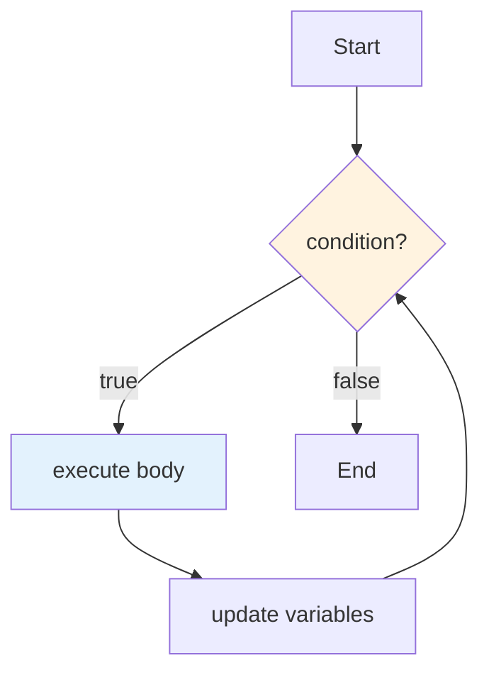
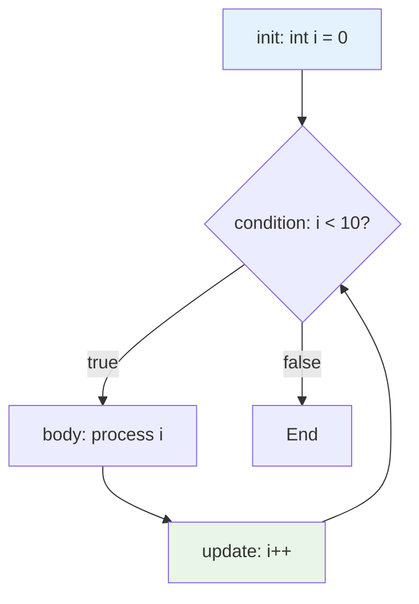

# Java Complete - Part 6: Loops

**Why This Matters**: Loops are the foundation of data processing and automation. Without loops, you'd need to write thousands of lines of repetitive code. Mastering different loop types enables efficient data processing, user input validation, and algorithm implementation.



Loops let you repeat operations efficiently, process collections of data, and implement algorithms. Java provides several loop types optimized for different scenarios.

## The while Loop

**Pattern**: `while (condition) { body }` - executes body repeatedly while condition is true.

**Critical Rule**: Always modify the loop variable inside the loop, or you'll create an infinite loop!

```java
// Basic countdown - condition becomes false eventually
int count = 5;
while (count > 0) {
    System.out.println(count);
    count--;                    // Must modify loop variable!
}

// Input validation - loop until valid input
Scanner scanner = new Scanner(System.in);
int number = 0;
while (number <= 0) {
    System.out.print("Enter positive number: ");
    number = scanner.nextInt();
}

// Mathematical computation - factorial
int factorial = 1, i = 1;
while (i <= 5) {
    factorial *= i;
    i++;
}
// Result: 5! = 120
```

**When to Use**: Unknown number of iterations, input validation, sentinel-controlled loops.

## The do-while Loop

The `do-while` loop executes its body at least once before checking the condition:

```java
import java.util.Scanner;

public class DoWhileLoops {
    public static void main(String[] args) {
        Scanner scanner = new Scanner(System.in);
        
        // Menu-driven program - classic do-while use case
        int choice;
        do {
            displayMenu();
            choice = getValidInput(scanner, 1, 5);
            processChoice(choice);
        } while (choice != 5);
        
        // Input validation with do-while
        int age;
        do {
            System.out.print("Enter your age (1-120): ");
            while (!scanner.hasNextInt()) {
                System.out.print("Please enter a valid number: ");
                scanner.next(); // Clear invalid input
            }
            age = scanner.nextInt();
            
            if (age < 1 || age > 120) {
                System.out.println("Age must be between 1 and 120.");
            }
        } while (age < 1 || age > 120);
        
        System.out.println("Valid age entered: " + age);
        
        // Password verification
        String correctPassword = "secret123";
        String enteredPassword;
        int attempts = 0;
        int maxAttempts = 3;
        
        System.out.println("\n--- Password Verification ---");
        do {
            attempts++;
            System.out.print("Enter password (attempt " + attempts + "/" + maxAttempts + "): ");
            enteredPassword = scanner.nextLine();
            
            if (!enteredPassword.equals(correctPassword)) {
                System.out.println("Incorrect password.");
                if (attempts < maxAttempts) {
                    System.out.println("Try again.");
                }
            }
        } while (!enteredPassword.equals(correctPassword) && attempts < maxAttempts);
        
        if (enteredPassword.equals(correctPassword)) {
            System.out.println("Access granted!");
        } else {
            System.out.println("Access denied. Too many failed attempts.");
        }
        
        // Mathematical example: Sum of digits
        int number = 9876;
        int sum = 0;
        int temp = number;
        
        System.out.println("\n--- Sum of Digits ---");
        System.out.println("Number: " + number);
        
        do {
            int digit = temp % 10;
            sum += digit;
            System.out.println("Digit: " + digit + ", Running sum: " + sum);
            temp /= 10;
        } while (temp > 0);
        
        System.out.println("Sum of digits: " + sum);
        
        scanner.close();
    }
    
    private static void displayMenu() {
        System.out.println("\n=== Calculator Menu ===");
        System.out.println("1. Add two numbers");
        System.out.println("2. Subtract two numbers");
        System.out.println("3. Multiply two numbers");
        System.out.println("4. Divide two numbers");
        System.out.println("5. Exit");
        System.out.print("Choose an option: ");
    }
    
    private static int getValidInput(Scanner scanner, int min, int max) {
        int input;
        do {
            while (!scanner.hasNextInt()) {
                System.out.print("Please enter a valid number (" + min + "-" + max + "): ");
                scanner.next();
            }
            input = scanner.nextInt();
            scanner.nextLine(); // Consume newline
            
            if (input < min || input > max) {
                System.out.print("Please enter a number between " + min + " and " + max + ": ");
            }
        } while (input < min || input > max);
        
        return input;
    }
    
    private static void processChoice(int choice) {
        Scanner scanner = new Scanner(System.in);
        
        switch (choice) {
            case 1:
                System.out.println("Addition selected");
                break;
            case 2:
                System.out.println("Subtraction selected");
                break;
            case 3:
                System.out.println("Multiplication selected");
                break;
            case 4:
                System.out.println("Division selected");
                break;
            case 5:
                System.out.println("Exiting program...");
                break;
        }
    }
}
```

## The for Loop

**Best Choice**: When you know exactly how many times to loop. Perfect for counting and array processing.

**Pattern**: `for (init; condition; update) { body }`



```java
public class ForLoops {
    public static void main(String[] args) {
        // Basic for loop - counting
        System.out.println("Counting from 1 to 10:");
        for (int i = 1; i <= 10; i++) {
            System.out.print(i + " ");
        }
        System.out.println();
        
        // Counting backwards
        System.out.println("Countdown from 10 to 1:");
        for (int i = 10; i >= 1; i--) {
            System.out.print(i + " ");
        }
        System.out.println();
        
        // Step by different amounts
        System.out.println("Even numbers from 2 to 20:");
        for (int i = 2; i <= 20; i += 2) {
            System.out.print(i + " ");
        }
        System.out.println();
        
        // Multiple variables in for loop
        System.out.println("Multiple variables:");
        for (int i = 0, j = 10; i < j; i++, j--) {
            System.out.println("i = " + i + ", j = " + j);
        }
        
        // Infinite for loop (be careful!)
        System.out.println("Printing first 5 numbers with 'infinite' loop:");
        int count = 0;
        for (;;) { // Empty condition means true
            if (count >= 5) break;
            System.out.print(count + " ");
            count++;
        }
        System.out.println();
        
        // Nested for loops - multiplication table
        System.out.println("\nMultiplication Table (5x5):");
        for (int row = 1; row <= 5; row++) {
            for (int col = 1; col <= 5; col++) {
                System.out.printf("%4d", row * col);
            }
            System.out.println(); // New line after each row
        }
        
        // Pattern printing with nested loops
        printPatterns();
        
        // Mathematical computations
        mathematicalExamples();
        
        // Loop performance considerations
        performanceExamples();
    }
    
    private static void printPatterns() {
        System.out.println("\n--- Pattern Examples ---");
        
        // Right triangle pattern
        System.out.println("Right Triangle:");
        for (int i = 1; i <= 5; i++) {
            for (int j = 1; j <= i; j++) {
                System.out.print("* ");
            }
            System.out.println();
        }
        
        // Inverted triangle
        System.out.println("\nInverted Triangle:");
        for (int i = 5; i >= 1; i--) {
            for (int j = 1; j <= i; j++) {
                System.out.print("* ");
            }
            System.out.println();
        }
        
        // Diamond pattern
        System.out.println("\nDiamond Pattern:");
        int n = 5;
        
        // Upper half
        for (int i = 1; i <= n; i++) {
            // Print spaces
            for (int j = i; j < n; j++) {
                System.out.print(" ");
            }
            // Print stars
            for (int j = 1; j <= (2 * i - 1); j++) {
                System.out.print("*");
            }
            System.out.println();
        }
        
        // Lower half
        for (int i = n - 1; i >= 1; i--) {
            // Print spaces
            for (int j = n; j > i; j--) {
                System.out.print(" ");
            }
            // Print stars
            for (int j = 1; j <= (2 * i - 1); j++) {
                System.out.print("*");
            }
            System.out.println();
        }
    }
    
    private static void mathematicalExamples() {
        System.out.println("\n--- Mathematical Examples ---");
        
        // Calculate sum of first n natural numbers
        int n = 100;
        long sum = 0;
        for (int i = 1; i <= n; i++) {
            sum += i;
        }
        System.out.println("Sum of first " + n + " natural numbers: " + sum);
        System.out.println("Formula verification: " + (n * (n + 1) / 2));
        
        // Generate Fibonacci sequence
        System.out.println("\nFirst 15 Fibonacci numbers:");
        int prev1 = 0, prev2 = 1;
        System.out.print(prev1 + " " + prev2 + " ");
        
        for (int i = 2; i < 15; i++) {
            int current = prev1 + prev2;
            System.out.print(current + " ");
            prev1 = prev2;
            prev2 = current;
        }
        System.out.println();
        
        // Find prime numbers using Sieve of Eratosthenes
        int limit = 50;
        boolean[] isPrime = new boolean[limit + 1];
        
        // Initialize all numbers as prime
        for (int i = 2; i <= limit; i++) {
            isPrime[i] = true;
        }
        
        // Sieve algorithm
        for (int i = 2; i * i <= limit; i++) {
            if (isPrime[i]) {
                for (int j = i * i; j <= limit; j += i) {
                    isPrime[j] = false;
                }
            }
        }
        
        System.out.println("\nPrime numbers up to " + limit + ":");
        for (int i = 2; i <= limit; i++) {
            if (isPrime[i]) {
                System.out.print(i + " ");
            }
        }
        System.out.println();
    }
    
    private static void performanceExamples() {
        System.out.println("\n--- Performance Considerations ---");
        
        // Inefficient: computing array length in every iteration
        int[] numbers = new int[1000000];
        long startTime = System.nanoTime();
        
        for (int i = 0; i < numbers.length; i++) { // length computed each time
            numbers[i] = i;
        }
        
        long endTime = System.nanoTime();
        System.out.println("Time with length in condition: " + (endTime - startTime) / 1_000_000 + "ms");
        
        // More efficient: cache the length
        startTime = System.nanoTime();
        int length = numbers.length;
        
        for (int i = 0; i < length; i++) { // length cached
            numbers[i] = i;
        }
        
        endTime = System.nanoTime();
        System.out.println("Time with cached length: " + (endTime - startTime) / 1_000_000 + "ms");
    }
}
```

## Enhanced for Loop (for-each)

Java 5 introduced the enhanced for loop for iterating over collections and arrays:

```java
import java.util.*;

public class EnhancedForLoop {
    public static void main(String[] args) {
        // Enhanced for loop with arrays
        int[] numbers = {10, 20, 30, 40, 50};
        
        System.out.println("Array elements using enhanced for loop:");
        for (int number : numbers) {
            System.out.print(number + " ");
        }
        System.out.println();
        
        // String array
        String[] names = {"Alice", "Bob", "Charlie", "Diana"};
        
        System.out.println("\nNames:");
        for (String name : names) {
            System.out.println("Hello, " + name + "!");
        }
        
        // 2D array iteration
        int[][] matrix = {
            {1, 2, 3},
            {4, 5, 6},
            {7, 8, 9}
        };
        
        System.out.println("\nMatrix elements:");
        for (int[] row : matrix) {
            for (int element : row) {
                System.out.print(element + " ");
            }
            System.out.println();
        }
        
        // Collections with enhanced for loop
        List<String> fruits = Arrays.asList("apple", "banana", "cherry", "date");
        
        System.out.println("\nFruits:");
        for (String fruit : fruits) {
            System.out.println("- " + fruit);
        }
        
        // Set iteration
        Set<Integer> uniqueNumbers = new HashSet<>();
        uniqueNumbers.add(1);
        uniqueNumbers.add(2);
        uniqueNumbers.add(3);
        uniqueNumbers.add(2); // Duplicate - won't be added
        
        System.out.println("\nUnique numbers:");
        for (Integer num : uniqueNumbers) {
            System.out.print(num + " ");
        }
        System.out.println();
        
        // Map iteration
        Map<String, Integer> ages = new HashMap<>();
        ages.put("Alice", 25);
        ages.put("Bob", 30);
        ages.put("Charlie", 35);
        
        System.out.println("\nAges (key-value pairs):");
        for (Map.Entry<String, Integer> entry : ages.entrySet()) {
            System.out.println(entry.getKey() + " is " + entry.getValue() + " years old");
        }
        
        // Keys only
        System.out.println("\nJust names:");
        for (String name : ages.keySet()) {
            System.out.print(name + " ");
        }
        System.out.println();
        
        // Values only
        System.out.println("\nJust ages:");
        for (Integer age : ages.values()) {
            System.out.print(age + " ");
        }
        System.out.println();
        
        // Limitations of enhanced for loop
        demonstrateLimitations();
    }
    
    private static void demonstrateLimitations() {
        System.out.println("\n--- Enhanced For Loop Limitations ---");
        
        int[] numbers = {1, 2, 3, 4, 5};
        
        // Cannot modify array elements directly
        System.out.println("Original array:");
        for (int num : numbers) {
            System.out.print(num + " ");
        }
        System.out.println();
        
        // This doesn't modify the original array
        System.out.println("\nTrying to modify in enhanced for loop:");
        for (int num : numbers) {
            num = num * 2; // This only modifies the local copy
        }
        
        System.out.println("Array after 'modification':");
        for (int num : numbers) {
            System.out.print(num + " ");
        }
        System.out.println("(unchanged - modifications don't affect original)");
        
        // To modify, use traditional for loop
        System.out.println("\nUsing traditional for loop to modify:");
        for (int i = 0; i < numbers.length; i++) {
            numbers[i] = numbers[i] * 2;
        }
        
        System.out.println("Array after modification:");
        for (int num : numbers) {
            System.out.print(num + " ");
        }
        System.out.println();
        
        // Cannot access index in enhanced for loop
        String[] words = {"Java", "is", "awesome"};
        
        System.out.println("\nWith traditional for loop (with index):");
        for (int i = 0; i < words.length; i++) {
            System.out.println("Index " + i + ": " + words[i]);
        }
        
        System.out.println("\nWith enhanced for loop (no index access):");
        int index = 0;
        for (String word : words) {
            System.out.println("Index " + index++ + ": " + word);
        }
    }
}
```

## Loop Control: break and continue

The `break` and `continue` statements provide fine-grained control over loop execution:

```java
public class LoopControl {
    public static void main(String[] args) {
        // break statement - exit loop immediately
        System.out.println("Finding first number divisible by 7:");
        for (int i = 1; i <= 100; i++) {
            if (i % 7 == 0) {
                System.out.println("Found: " + i);
                break; // Exit loop immediately
            }
        }
        
        // continue statement - skip current iteration
        System.out.println("\nOdd numbers from 1 to 20:");
        for (int i = 1; i <= 20; i++) {
            if (i % 2 == 0) {
                continue; // Skip even numbers
            }
            System.out.print(i + " ");
        }
        System.out.println();
        
        // Nested loops with labeled break/continue
        System.out.println("\nSearching in 2D array:");
        int[][] matrix = {
            {1, 2, 3, 4},
            {5, 6, 7, 8},
            {9, 10, 11, 12}
        };
        
        int target = 7;
        boolean found = false;
        
        outerLoop: // Label for outer loop
        for (int row = 0; row < matrix.length; row++) {
            for (int col = 0; col < matrix[row].length; col++) {
                if (matrix[row][col] == target) {
                    System.out.println("Found " + target + " at position [" + row + "][" + col + "]");
                    found = true;
                    break outerLoop; // Break out of both loops
                }
            }
        }
        
        if (!found) {
            System.out.println("Target " + target + " not found");
        }
        
        // Using continue with labels
        System.out.println("\nSkipping certain rows in matrix:");
        outerLoop2:
        for (int row = 0; row < matrix.length; row++) {
            if (row == 1) {
                System.out.println("Skipping row " + row);
                continue outerLoop2; // Skip entire row
            }
            
            System.out.print("Row " + row + ": ");
            for (int col = 0; col < matrix[row].length; col++) {
                System.out.print(matrix[row][col] + " ");
            }
            System.out.println();
        }
        
        // Practical example: input validation with breaks
        demonstrateInputValidation();
        
        // Prime number checker using break
        demonstratePrimeChecker();
    }
    
    private static void demonstrateInputValidation() {
        System.out.println("\n--- Input Validation Example ---");
        java.util.Scanner scanner = new java.util.Scanner(System.in);
        
        // Simulate multiple validation attempts
        String[] inputs = {"abc", "-5", "0", "25", "150", "30"}; // Simulated inputs
        int inputIndex = 0;
        
        System.out.println("Looking for valid age (1-100):");
        
        while (inputIndex < inputs.length) {
            String input = inputs[inputIndex++];
            System.out.println("Input: " + input);
            
            try {
                int age = Integer.parseInt(input);
                
                if (age < 1 || age > 100) {
                    System.out.println("Age must be between 1 and 100");
                    continue; // Try next input
                }
                
                System.out.println("Valid age found: " + age);
                break; // Exit the validation loop
                
            } catch (NumberFormatException e) {
                System.out.println("Invalid number format");
                continue; // Try next input
            }
        }
        
        if (inputIndex >= inputs.length) {
            System.out.println("No valid input found in simulated inputs");
        }
    }
    
    private static void demonstratePrimeChecker() {
        System.out.println("\n--- Prime Number Checker ---");
        
        int[] candidates = {17, 24, 29, 33, 37};
        
        for (int number : candidates) {
            System.out.print(number + " is ");
            
            if (number < 2) {
                System.out.println("not prime (less than 2)");
                continue;
            }
            
            boolean isPrime = true;
            
            // Check for factors from 2 to sqrt(number)
            for (int i = 2; i * i <= number; i++) {
                if (number % i == 0) {
                    System.out.println("not prime (divisible by " + i + ")");
                    isPrime = false;
                    break; // No need to check further
                }
            }
            
            if (isPrime) {
                System.out.println("prime");
            }
        }
    }
}
```

## Practical Application: Text Analysis Tool

Let's build a comprehensive example that uses various loop types:

```java
import java.util.*;
import java.io.*;

public class TextAnalyzer {
    public static void main(String[] args) {
        Scanner scanner = new Scanner(System.in);
        
        System.out.println("=== Text Analysis Tool ===");
        
        // Get text input
        System.out.println("Enter text to analyze (type 'END' on a new line to finish):");
        StringBuilder textBuilder = new StringBuilder();
        String line;
        
        // do-while loop for collecting input
        do {
            line = scanner.nextLine();
            if (!"END".equalsIgnoreCase(line)) {
                textBuilder.append(line).append("\n");
            }
        } while (!"END".equalsIgnoreCase(line));
        
        String text = textBuilder.toString();
        
        if (text.trim().isEmpty()) {
            System.out.println("No text entered.");
            return;
        }
        
        // Analyze the text
        analyzeText(text);
        
        // Interactive analysis menu
        boolean continueAnalysis = true;
        do {
            displayAnalysisMenu();
            int choice = getChoice(scanner);
            
            switch (choice) {
                case 1:
                    findWordFrequency(text);
                    break;
                case 2:
                    findLongestWords(text);
                    break;
                case 3:
                    analyzeCharacterFrequency(text);
                    break;
                case 4:
                    findPatterns(text, scanner);
                    break;
                case 5:
                    generateStatistics(text);
                    break;
                case 6:
                    continueAnalysis = false;
                    System.out.println("Goodbye!");
                    break;
                default:
                    System.out.println("Invalid choice. Please try again.");
            }
        } while (continueAnalysis);
        
        scanner.close();
    }
    
    private static void analyzeText(String text) {
        System.out.println("\n=== Basic Text Analysis ===");
        
        // Character count
        int totalChars = text.length();
        int nonWhitespaceChars = 0;
        int digitCount = 0;
        int letterCount = 0;
        int punctuationCount = 0;
        
        // Enhanced for loop over character array
        for (char c : text.toCharArray()) {
            if (!Character.isWhitespace(c)) {
                nonWhitespaceChars++;
            }
            
            if (Character.isDigit(c)) {
                digitCount++;
            } else if (Character.isLetter(c)) {
                letterCount++;
            } else if (!Character.isWhitespace(c)) {
                punctuationCount++;
            }
        }
        
        // Word count
        String[] words = text.trim().split("\\s+");
        int wordCount = text.trim().isEmpty() ? 0 : words.length;
        
        // Line count
        int lineCount = 0;
        for (int i = 0; i < text.length(); i++) {
            if (text.charAt(i) == '\n') {
                lineCount++;
            }
        }
        
        // Display results
        System.out.println("Total characters: " + totalChars);
        System.out.println("Non-whitespace characters: " + nonWhitespaceChars);
        System.out.println("Letters: " + letterCount);
        System.out.println("Digits: " + digitCount);
        System.out.println("Punctuation: " + punctuationCount);
        System.out.println("Words: " + wordCount);
        System.out.println("Lines: " + (lineCount + 1)); // +1 for last line
        
        if (wordCount > 0) {
            double avgWordLength = (double) letterCount / wordCount;
            System.out.printf("Average word length: %.2f characters%n", avgWordLength);
        }
    }
    
    private static void displayAnalysisMenu() {
        System.out.println("\n=== Analysis Options ===");
        System.out.println("1. Word frequency analysis");
        System.out.println("2. Find longest words");
        System.out.println("3. Character frequency analysis");
        System.out.println("4. Find patterns");
        System.out.println("5. Generate detailed statistics");
        System.out.println("6. Exit");
        System.out.print("Choose an option: ");
    }
    
    private static int getChoice(Scanner scanner) {
        while (!scanner.hasNextInt()) {
            System.out.print("Please enter a valid number: ");
            scanner.next();
        }
        int choice = scanner.nextInt();
        scanner.nextLine(); // Consume newline
        return choice;
    }
    
    private static void findWordFrequency(String text) {
        System.out.println("\n--- Word Frequency Analysis ---");
        
        Map<String, Integer> wordCount = new HashMap<>();
        String[] words = text.toLowerCase().replaceAll("[^a-zA-Z\\s]", "").split("\\s+");
        
        // Count word frequencies
        for (String word : words) {
            if (!word.isEmpty()) {
                wordCount.put(word, wordCount.getOrDefault(word, 0) + 1);
            }
        }
        
        // Sort by frequency (descending)
        List<Map.Entry<String, Integer>> sortedWords = new ArrayList<>(wordCount.entrySet());
        sortedWords.sort((a, b) -> b.getValue().compareTo(a.getValue()));
        
        System.out.println("Top 10 most frequent words:");
        int count = 0;
        for (Map.Entry<String, Integer> entry : sortedWords) {
            if (count >= 10) break;
            System.out.printf("%d. %s (%d occurrences)%n", 
                            count + 1, entry.getKey(), entry.getValue());
            count++;
        }
        
        System.out.println("\nUnique words: " + wordCount.size());
    }
    
    private static void findLongestWords(String text) {
        System.out.println("\n--- Longest Words ---");
        
        String[] words = text.replaceAll("[^a-zA-Z\\s]", "").split("\\s+");
        int maxLength = 0;
        List<String> longestWords = new ArrayList<>();
        
        // Find maximum length
        for (String word : words) {
            if (word.length() > maxLength) {
                maxLength = word.length();
            }
        }
        
        // Collect all words with maximum length
        for (String word : words) {
            if (word.length() == maxLength && !longestWords.contains(word.toLowerCase())) {
                longestWords.add(word.toLowerCase());
            }
        }
        
        System.out.println("Longest word(s) (" + maxLength + " characters):");
        for (String word : longestWords) {
            System.out.println("- " + word);
        }
        
        // Show length distribution
        Map<Integer, Integer> lengthDistribution = new HashMap<>();
        for (String word : words) {
            if (!word.isEmpty()) {
                int length = word.length();
                lengthDistribution.put(length, lengthDistribution.getOrDefault(length, 0) + 1);
            }
        }
        
        System.out.println("\nWord length distribution:");
        for (int length = 1; length <= maxLength; length++) {
            int count = lengthDistribution.getOrDefault(length, 0);
            if (count > 0) {
                System.out.printf("%d characters: %d words%n", length, count);
            }
        }
    }
    
    private static void analyzeCharacterFrequency(String text) {
        System.out.println("\n--- Character Frequency Analysis ---");
        
        Map<Character, Integer> charCount = new HashMap<>();
        
        // Count character frequencies (letters only)
        for (char c : text.toLowerCase().toCharArray()) {
            if (Character.isLetter(c)) {
                charCount.put(c, charCount.getOrDefault(c, 0) + 1);
            }
        }
        
        // Sort by frequency
        List<Map.Entry<Character, Integer>> sortedChars = new ArrayList<>(charCount.entrySet());
        sortedChars.sort((a, b) -> b.getValue().compareTo(a.getValue()));
        
        System.out.println("Character frequencies:");
        int totalLetters = sortedChars.stream().mapToInt(Map.Entry::getValue).sum();
        
        for (Map.Entry<Character, Integer> entry : sortedChars) {
            char ch = entry.getKey();
            int count = entry.getValue();
            double percentage = (double) count / totalLetters * 100;
            System.out.printf("%c: %d (%.1f%%)%n", ch, count, percentage);
        }
        
        // Vowel vs consonant analysis
        int vowelCount = 0;
        String vowels = "aeiou";
        
        for (Map.Entry<Character, Integer> entry : charCount.entrySet()) {
            if (vowels.indexOf(entry.getKey()) != -1) {
                vowelCount += entry.getValue();
            }
        }
        
        int consonantCount = totalLetters - vowelCount;
        System.out.printf("\nVowels: %d (%.1f%%)%n", vowelCount, 
                         (double) vowelCount / totalLetters * 100);
        System.out.printf("Consonants: %d (%.1f%%)%n", consonantCount, 
                         (double) consonantCount / totalLetters * 100);
    }
    
    private static void findPatterns(String text, Scanner scanner) {
        System.out.println("\n--- Pattern Search ---");
        System.out.print("Enter pattern to search for: ");
        String pattern = scanner.nextLine();
        
        if (pattern.isEmpty()) {
            System.out.println("Empty pattern entered.");
            return;
        }
        
        List<Integer> positions = new ArrayList<>();
        String lowerText = text.toLowerCase();
        String lowerPattern = pattern.toLowerCase();
        
        // Find all occurrences
        int index = 0;
        while ((index = lowerText.indexOf(lowerPattern, index)) != -1) {
            positions.add(index);
            index++;
        }
        
        System.out.println("Pattern '" + pattern + "' found " + positions.size() + " times");
        
        if (positions.size() > 0) {
            System.out.println("Positions:");
            
            for (int i = 0; i < positions.size() && i < 20; i++) { // Limit to first 20
                int pos = positions.get(i);
                
                // Show context around the match
                int start = Math.max(0, pos - 10);
                int end = Math.min(text.length(), pos + pattern.length() + 10);
                String context = text.substring(start, end);
                
                System.out.printf("Position %d: ...%s...%n", pos, context);
            }
            
            if (positions.size() > 20) {
                System.out.println("... and " + (positions.size() - 20) + " more");
            }
        }
    }
    
    private static void generateStatistics(String text) {
        System.out.println("\n--- Detailed Statistics ---");
        
        String[] sentences = text.split("[.!?]+");
        String[] words = text.trim().split("\\s+");
        
        // Sentence analysis
        int sentenceCount = 0;
        int totalSentenceLength = 0;
        
        for (String sentence : sentences) {
            String trimmed = sentence.trim();
            if (!trimmed.isEmpty()) {
                sentenceCount++;
                totalSentenceLength += trimmed.split("\\s+").length;
            }
        }
        
        // Reading level estimation (simplified Flesch Reading Ease)
        double avgWordsPerSentence = sentenceCount > 0 ? (double) words.length / sentenceCount : 0;
        
        int totalSyllables = 0;
        for (String word : words) {
            totalSyllables += estimateSyllables(word);
        }
        
        double avgSyllablesPerWord = words.length > 0 ? (double) totalSyllables / words.length : 0;
        
        // Display statistics
        System.out.println("Sentences: " + sentenceCount);
        System.out.printf("Average words per sentence: %.1f%n", avgWordsPerSentence);
        System.out.printf("Average syllables per word: %.1f%n", avgSyllablesPerWord);
        System.out.println("Total syllables: " + totalSyllables);
        
        // Reading level
        if (sentenceCount > 0 && words.length > 0) {
            double fleschScore = 206.835 - (1.015 * avgWordsPerSentence) - (84.6 * avgSyllablesPerWord);
            System.out.printf("Estimated Flesch Reading Score: %.1f%n", fleschScore);
            
            String readingLevel;
            if (fleschScore >= 90) readingLevel = "Very Easy";
            else if (fleschScore >= 80) readingLevel = "Easy";
            else if (fleschScore >= 70) readingLevel = "Fairly Easy";
            else if (fleschScore >= 60) readingLevel = "Standard";
            else if (fleschScore >= 50) readingLevel = "Fairly Difficult";
            else if (fleschScore >= 30) readingLevel = "Difficult";
            else readingLevel = "Very Difficult";
            
            System.out.println("Reading Level: " + readingLevel);
        }
    }
    
    private static int estimateSyllables(String word) {
        if (word == null || word.isEmpty()) return 0;
        
        word = word.toLowerCase().replaceAll("[^a-z]", "");
        if (word.isEmpty()) return 0;
        
        int syllables = 0;
        boolean previousWasVowel = false;
        
        for (int i = 0; i < word.length(); i++) {
            char c = word.charAt(i);
            boolean isVowel = "aeiouy".indexOf(c) != -1;
            
            if (isVowel && !previousWasVowel) {
                syllables++;
            }
            previousWasVowel = isVowel;
        }
        
        // Handle silent 'e'
        if (word.endsWith("e") && syllables > 1) {
            syllables--;
        }
        
        return Math.max(1, syllables); // Every word has at least one syllable
    }
}
```

## Common Loop Pitfalls and Best Practices

### 1. Infinite Loops
```java
// Wrong - condition never becomes false
int i = 0;
while (i < 10) {
    System.out.println(i);
    // Forgot to increment i!
}

// Right - ensure loop variable changes
int i = 0;
while (i < 10) {
    System.out.println(i);
    i++; // Critical: modify loop variable
}
```

### 2. Off-by-One Errors
```java
// Wrong - misses last element
int[] array = {1, 2, 3, 4, 5};
for (int i = 0; i < array.length - 1; i++) { // Should be < array.length
    System.out.println(array[i]);
}

// Right - correct boundary
for (int i = 0; i < array.length; i++) {
    System.out.println(array[i]);
}
```

### 3. Modifying Collections During Iteration
```java
List<String> list = new ArrayList<>(Arrays.asList("a", "b", "c"));

// Wrong - can cause ConcurrentModificationException
for (String item : list) {
    if (item.equals("b")) {
        list.remove(item); // Don't do this!
    }
}

// Right - use iterator or index-based loop
Iterator<String> iterator = list.iterator();
while (iterator.hasNext()) {
    String item = iterator.next();
    if (item.equals("b")) {
        iterator.remove(); // Safe removal
    }
}
```

## Performance Considerations

1. **Choose the right loop type:**
   - Use enhanced for loops for simple iteration
   - Use traditional for loops when you need the index
   - Use while loops for conditions that aren't counter-based

2. **Cache expensive computations:**
```java
// Inefficient
for (int i = 0; i < expensiveMethod(); i++) {
    // expensiveMethod() called every iteration
}

// Efficient
int limit = expensiveMethod();
for (int i = 0; i < limit; i++) {
    // expensiveMethod() called only once
}
```

3. **Consider loop unrolling for performance-critical code:**
```java
// Standard loop
for (int i = 0; i < array.length; i++) {
    process(array[i]);
}

// Unrolled loop (for very performance-critical scenarios)
int i = 0;
for (; i < array.length - 3; i += 4) {
    process(array[i]);
    process(array[i + 1]);
    process(array[i + 2]);
    process(array[i + 3]);
}
// Handle remaining elements
for (; i < array.length; i++) {
    process(array[i]);
}
```

## Looking Ahead

You now have mastery over Java's looping constructs - the tools needed to process data efficiently and implement complex algorithms. In the next tutorial, we'll explore arrays and strings, which are fundamental data structures that you'll often process using the loop techniques you've learned here.

The combination of loops, conditional statements, and data structures forms the foundation of algorithmic thinking. Practice implementing various algorithms using different loop types, and always consider readability and maintainability alongside performance when choosing which loop construct to use.