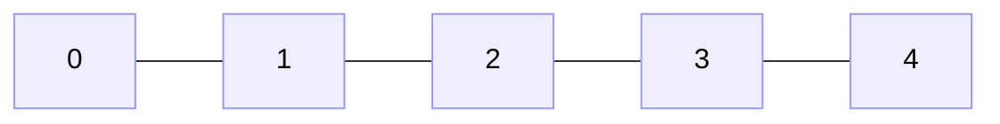

# Java Complete - Part 7: Arrays and Strings

**Why This Matters**: Arrays and strings power 90% of data processing in Java. Arrays store collections efficiently, while strings handle all text operations. Mastering these fundamentals enables everything from user input handling to complex data analysis.

Arrays and strings are the backbone of data processing in Java - they appear in nearly every Java program you'll write.

## Arrays: The Foundation

Visualizing an array in memory:


**Key Concept**: Array is a container holding multiple values of the same type, accessed by index (0-based).

### Array Creation and Access

```java
// Two ways to create arrays
int[] numbers = new int[5];           // Empty array, size 5 (all zeros)
String[] fruits = {"apple", "banana", "cherry"}; // With initial values

// Access by index (0-based!)
numbers[0] = 42;                      // First element  
numbers[4] = 99;                      // Last element
System.out.println(numbers[0]);       // Prints: 42
System.out.println(fruits.length);   // Prints: 3

// Enhanced for loop (recommended for reading)
for (String fruit : fruits) {
    System.out.println(fruit);        // Cleaner than index-based loop
}
```

### Critical Array Rules

```java
int[] arr = {10, 20, 30};

// ✅ Valid indices: 0, 1, 2
System.out.println(arr[0]);           // 10 
System.out.println(arr[arr.length-1]); // 30 (last element)

// ❌ Runtime error - ArrayIndexOutOfBoundsException
System.out.println(arr[3]);           // CRASH! Index 3 doesn't exist
```
        
        System.out.printf("Sum: %.2f%n", sum);
        System.out.printf("Average: %.2f%n", average);
        
        // Find minimum and maximum
        double min = values[0];
        double max = values[0];
        
        for (int i = 1; i < values.length; i++) {
            if (values[i] < min) min = values[i];
            if (values[i] > max) max = values[i];
        }
        
        System.out.printf("Minimum: %.2f%n", min);
        System.out.printf("Maximum: %.2f%n", max);
        
        // Search for a value
        double target = 1.41;
        int index = -1;
        
        for (int i = 0; i < values.length; i++) {
            if (Math.abs(values[i] - target) < 0.001) { // Handle floating-point precision
                index = i;
                break;
            }
        }
        
        if (index != -1) {
            System.out.println("Found " + target + " at index " + index);
        } else {
            System.out.println("Value " + target + " not found");
        }
        
        // Copy arrays
        double[] copy = new double[values.length];
        for (int i = 0; i < values.length; i++) {
            copy[i] = values[i];
        }
        
        // Or use System.arraycopy
        double[] copy2 = new double[values.length];
        System.arraycopy(values, 0, copy2, 0, values.length);
        
        // Or use Arrays.copyOf
        double[] copy3 = java.util.Arrays.copyOf(values, values.length);
        
        System.out.println("Original and copies have same content: " + 
                          java.util.Arrays.equals(values, copy3));
    }
}
```

## Multi-Dimensional Arrays

Java supports arrays of arrays, commonly used for matrices, grids, and tabular data:

```java
import java.util.Arrays;

public class MultiDimensionalArrays {
    public static void main(String[] args) {
        // 2D array - matrix
        int[][] matrix = {
            {1, 2, 3, 4},
            {5, 6, 7, 8},
            {9, 10, 11, 12}
        };
        
        System.out.println("Matrix:");
        printMatrix(matrix);
        
        // Creating 2D array with new
        double[][] grades = new double[3][4]; // 3 students, 4 subjects
        
        // Fill with sample data
        grades[0] = new double[]{85.5, 92.0, 78.5, 88.0}; // Student 1
        grades[1] = new double[]{90.0, 87.5, 92.5, 85.0}; // Student 2
        grades[2] = new double[]{78.0, 85.0, 80.5, 87.5}; // Student 3
        
        System.out.println("\nStudent Grades:");
        String[] subjects = {"Math", "Science", "English", "History"};
        
        for (int student = 0; student < grades.length; student++) {
            System.out.printf("Student %d: ", student + 1);
            for (int subject = 0; subject < grades[student].length; subject++) {
                System.out.printf("%.1f ", grades[student][subject]);
            }
            System.out.println();
        }
        
        // Calculate averages
        System.out.println("\nSubject Averages:");
        for (int subject = 0; subject < subjects.length; subject++) {
            double sum = 0;
            for (int student = 0; student < grades.length; student++) {
                sum += grades[student][subject];
            }
            double average = sum / grades.length;
            System.out.printf("%s: %.2f%n", subjects[subject], average);
        }
        
        // Jagged arrays (arrays with different lengths)
        int[][] jaggedArray = {
            {1, 2},
            {3, 4, 5, 6},
            {7},
            {8, 9, 10}
        };
        
        System.out.println("\nJagged Array:");
        for (int i = 0; i < jaggedArray.length; i++) {
            System.out.print("Row " + i + ": ");
            for (int j = 0; j < jaggedArray[i].length; j++) {
                System.out.print(jaggedArray[i][j] + " ");
            }
            System.out.println();
        }
        
        // 3D array example - cube of data
        int[][][] cube = new int[3][3][3];
        int value = 1;
        
        // Fill cube with sequential values
        for (int i = 0; i < cube.length; i++) {
            for (int j = 0; j < cube[i].length; j++) {
                for (int k = 0; k < cube[i][j].length; k++) {
                    cube[i][j][k] = value++;
                }
            }
        }
        
        System.out.println("\n3D Cube:");
        for (int i = 0; i < cube.length; i++) {
            System.out.println("Layer " + i + ":");
            printMatrix(cube[i]);
            System.out.println();
        }
        
        // Matrix operations
        demonstrateMatrixOperations();
    }
    
    private static void printMatrix(int[][] matrix) {
        for (int[] row : matrix) {
            for (int element : row) {
                System.out.printf("%4d", element);
            }
            System.out.println();
        }
    }
    
    private static void demonstrateMatrixOperations() {
        System.out.println("--- Matrix Operations ---");
        
        int[][] matrixA = {
            {1, 2, 3},
            {4, 5, 6}
        };
        
        int[][] matrixB = {
            {7, 8, 9},
            {10, 11, 12}
        };
        
        // Matrix addition
        int[][] sum = addMatrices(matrixA, matrixB);
        System.out.println("Matrix A + Matrix B:");
        printMatrix(sum);
        
        // Matrix transpose
        int[][] transposed = transpose(matrixA);
        System.out.println("\nMatrix A transposed:");
        printMatrix(transposed);
        
        // Matrix multiplication (simplified - square matrices)
        int[][] squareA = {{1, 2}, {3, 4}};
        int[][] squareB = {{5, 6}, {7, 8}};
        int[][] product = multiplyMatrices(squareA, squareB);
        
        System.out.println("\nMatrix multiplication:");
        System.out.println("A:");
        printMatrix(squareA);
        System.out.println("B:");
        printMatrix(squareB);
        System.out.println("A × B:");
        printMatrix(product);
    }
    
    private static int[][] addMatrices(int[][] a, int[][] b) {
        if (a.length != b.length || a[0].length != b[0].length) {
            throw new IllegalArgumentException("Matrices must have same dimensions");
        }
        
        int[][] result = new int[a.length][a[0].length];
        for (int i = 0; i < a.length; i++) {
            for (int j = 0; j < a[i].length; j++) {
                result[i][j] = a[i][j] + b[i][j];
            }
        }
        return result;
    }
    
    private static int[][] transpose(int[][] matrix) {
        int[][] result = new int[matrix[0].length][matrix.length];
        for (int i = 0; i < matrix.length; i++) {
            for (int j = 0; j < matrix[i].length; j++) {
                result[j][i] = matrix[i][j];
            }
        }
        return result;
    }
    
    private static int[][] multiplyMatrices(int[][] a, int[][] b) {
        int rows = a.length;
        int cols = b[0].length;
        int common = a[0].length;
        
        if (common != b.length) {
            throw new IllegalArgumentException("Invalid matrix dimensions for multiplication");
        }
        
        int[][] result = new int[rows][cols];
        
        for (int i = 0; i < rows; i++) {
            for (int j = 0; j < cols; j++) {
                for (int k = 0; k < common; k++) {
                    result[i][j] += a[i][k] * b[k][j];
                }
            }
        }
        
        return result;
    }
}
```

## Array Sorting and Searching

Java provides built-in utilities for common array operations:

```java
import java.util.Arrays;
import java.util.Collections;

public class ArrayAlgorithms {
    public static void main(String[] args) {
        // Sorting arrays
        int[] numbers = {64, 34, 25, 12, 22, 11, 90, 88, 76, 50, 42};
        System.out.println("Original array: " + Arrays.toString(numbers));
        
        // Built-in sorting
        int[] copy1 = Arrays.copyOf(numbers, numbers.length);
        Arrays.sort(copy1);
        System.out.println("Sorted (ascending): " + Arrays.toString(copy1));
        
        // Sorting objects
        String[] names = {"Charlie", "Alice", "Bob", "David", "Eve"};
        System.out.println("Original names: " + Arrays.toString(names));
        Arrays.sort(names);
        System.out.println("Sorted names: " + Arrays.toString(names));
        
        // Reverse sorting using Collections
        String[] copy2 = Arrays.copyOf(names, names.length);
        Arrays.sort(copy2, Collections.reverseOrder());
        System.out.println("Reverse sorted: " + Arrays.toString(copy2));
        
        // Custom sorting with Comparator
        String[] words = {"apple", "pie", "a", "programming", "java"};
        System.out.println("Original words: " + Arrays.toString(words));
        
        // Sort by length
        Arrays.sort(words, (a, b) -> Integer.compare(a.length(), b.length()));
        System.out.println("Sorted by length: " + Arrays.toString(words));
        
        // Binary search (array must be sorted first)
        int[] sortedNumbers = {1, 3, 5, 7, 9, 11, 13, 15, 17, 19};
        int target = 7;
        int index = Arrays.binarySearch(sortedNumbers, target);
        System.out.println("Binary search for " + target + ": index " + index);
        
        // Linear search implementation
        int linearIndex = linearSearch(numbers, target);
        System.out.println("Linear search for " + target + ": index " + linearIndex);
        
        // Demonstrate sorting algorithms
        demonstrateSortingAlgorithms();
        
        // Array utility methods
        demonstrateArrayUtils();
    }
    
    private static int linearSearch(int[] array, int target) {
        for (int i = 0; i < array.length; i++) {
            if (array[i] == target) {
                return i;
            }
        }
        return -1; // Not found
    }
    
    private static void demonstrateSortingAlgorithms() {
        System.out.println("\n--- Sorting Algorithms ---");
        
        int[] original = {64, 34, 25, 12, 22, 11, 90};
        
        // Bubble Sort
        int[] bubbleArray = Arrays.copyOf(original, original.length);
        System.out.println("Bubble Sort:");
        System.out.println("Before: " + Arrays.toString(bubbleArray));
        bubbleSort(bubbleArray);
        System.out.println("After:  " + Arrays.toString(bubbleArray));
        
        // Selection Sort
        int[] selectionArray = Arrays.copyOf(original, original.length);
        System.out.println("\nSelection Sort:");
        System.out.println("Before: " + Arrays.toString(selectionArray));
        selectionSort(selectionArray);
        System.out.println("After:  " + Arrays.toString(selectionArray));
        
        // Insertion Sort
        int[] insertionArray = Arrays.copyOf(original, original.length);
        System.out.println("\nInsertion Sort:");
        System.out.println("Before: " + Arrays.toString(insertionArray));
        insertionSort(insertionArray);
        System.out.println("After:  " + Arrays.toString(insertionArray));
    }
    
    private static void bubbleSort(int[] array) {
        int n = array.length;
        for (int i = 0; i < n - 1; i++) {
            boolean swapped = false;
            for (int j = 0; j < n - i - 1; j++) {
                if (array[j] > array[j + 1]) {
                    // Swap elements
                    int temp = array[j];
                    array[j] = array[j + 1];
                    array[j + 1] = temp;
                    swapped = true;
                }
            }
            // If no swapping occurred, array is sorted
            if (!swapped) break;
        }
    }
    
    private static void selectionSort(int[] array) {
        int n = array.length;
        for (int i = 0; i < n - 1; i++) {
            int minIndex = i;
            for (int j = i + 1; j < n; j++) {
                if (array[j] < array[minIndex]) {
                    minIndex = j;
                }
            }
            // Swap minimum element with first element
            int temp = array[minIndex];
            array[minIndex] = array[i];
            array[i] = temp;
        }
    }
    
    private static void insertionSort(int[] array) {
        int n = array.length;
        for (int i = 1; i < n; i++) {
            int key = array[i];
            int j = i - 1;
            
            // Move elements greater than key one position ahead
            while (j >= 0 && array[j] > key) {
                array[j + 1] = array[j];
                j = j - 1;
            }
            array[j + 1] = key;
        }
    }
    
    private static void demonstrateArrayUtils() {
        System.out.println("\n--- Array Utilities ---");
        
        int[] array1 = {1, 2, 3, 4, 5};
        int[] array2 = {1, 2, 3, 4, 5};
        int[] array3 = {5, 4, 3, 2, 1};
        
        // Array comparison
        System.out.println("array1 equals array2: " + Arrays.equals(array1, array2));
        System.out.println("array1 equals array3: " + Arrays.equals(array1, array3));
        
        // Fill array with value
        int[] fillArray = new int[10];
        Arrays.fill(fillArray, 42);
        System.out.println("Filled array: " + Arrays.toString(fillArray));
        
        // Partial fill
        Arrays.fill(fillArray, 2, 5, 99); // Fill indexes 2-4 with 99
        System.out.println("Partially filled: " + Arrays.toString(fillArray));
        
        // Array copying
        int[] original = {1, 2, 3, 4, 5};
        int[] copy = Arrays.copyOf(original, 8); // Extend to length 8
        System.out.println("Extended copy: " + Arrays.toString(copy));
        
        int[] partial = Arrays.copyOfRange(original, 1, 4); // Copy indexes 1-3
        System.out.println("Partial copy: " + Arrays.toString(partial));
    }
}
```

## Strings: Text Processing Powerhouse

Strings in Java are objects that represent sequences of characters. Understanding string behavior is crucial for text processing:

```java
public class StringBasics {
    public static void main(String[] args) {
        // String creation
        String str1 = "Hello";              // String literal
        String str2 = new String("Hello");  // String object
        String str3 = "Hello";              // Another literal
        
        // String pooling demonstration
        System.out.println("String pooling:");
        System.out.println("str1 == str2: " + (str1 == str2)); // false - different objects
        System.out.println("str1 == str3: " + (str1 == str3)); // true - same pool reference
        System.out.println("str1.equals(str2): " + str1.equals(str2)); // true - same content
        
        // String immutability
        String original = "Java";
        String modified = original.concat(" Programming");
        System.out.println("\nString immutability:");
        System.out.println("Original: " + original);     // "Java" - unchanged
        System.out.println("Modified: " + modified);     // "Java Programming" - new string
        
        // Basic string operations
        String text = "Java Programming Language";
        System.out.println("\nBasic operations:");
        System.out.println("Length: " + text.length());
        System.out.println("Character at index 5: " + text.charAt(5));
        System.out.println("Substring (5-16): " + text.substring(5, 16));
        System.out.println("Index of 'gram': " + text.indexOf("gram"));
        System.out.println("Last index of 'a': " + text.lastIndexOf('a'));
        System.out.println("Contains 'Program': " + text.contains("Program"));
        System.out.println("Starts with 'Java': " + text.startsWith("Java"));
        System.out.println("Ends with 'Language': " + text.endsWith("Language"));
        
        // Case operations
        System.out.println("\nCase operations:");
        System.out.println("Upper case: " + text.toUpperCase());
        System.out.println("Lower case: " + text.toLowerCase());
        
        // String comparison
        demonstrateStringComparison();
        
        // String manipulation
        demonstrateStringManipulation();
        
        // String formatting
        demonstrateStringFormatting();
    }
    
    private static void demonstrateStringComparison() {
        System.out.println("\n--- String Comparison ---");
        
        String s1 = "apple";
        String s2 = "Apple";
        String s3 = "banana";
        
        // Case-sensitive comparison
        System.out.println("s1.equals(s2): " + s1.equals(s2));           // false
        System.out.println("s1.equalsIgnoreCase(s2): " + s1.equalsIgnoreCase(s2)); // true
        
        // Lexicographic comparison
        System.out.println("s1.compareTo(s3): " + s1.compareTo(s3));     // negative (apple < banana)
        System.out.println("s3.compareTo(s1): " + s3.compareTo(s1));     // positive (banana > apple)
        System.out.println("s1.compareTo(s1): " + s1.compareTo(s1));     // 0 (equal)
        
        // Null-safe comparison
        String nullString = null;
        String emptyString = "";
        
        // Safe way to compare with potential null
        System.out.println("Null-safe comparison:");
        System.out.println("Objects.equals(s1, nullString): " + 
                          java.util.Objects.equals(s1, nullString));
        
        // Check for null or empty
        System.out.println("nullString is null or empty: " + isNullOrEmpty(nullString));
        System.out.println("emptyString is null or empty: " + isNullOrEmpty(emptyString));
        System.out.println("s1 is null or empty: " + isNullOrEmpty(s1));
    }
    
    private static boolean isNullOrEmpty(String str) {
        return str == null || str.isEmpty();
    }
    
    private static void demonstrateStringManipulation() {
        System.out.println("\n--- String Manipulation ---");
        
        String messy = "  Hello, Java World!  ";
        System.out.println("Original: '" + messy + "'");
        
        // Trimming whitespace
        String trimmed = messy.trim();
        System.out.println("Trimmed: '" + trimmed + "'");
        
        // Replacing characters and substrings
        String replaced = trimmed.replace("Java", "Programming");
        System.out.println("Replaced: " + replaced);
        
        String replacedAll = trimmed.replaceAll("\\w+", "[WORD]"); // Regex replacement
        System.out.println("Replaced all words: " + replacedAll);
        
        // Splitting strings
        String csv = "apple,banana,cherry,date,elderberry";
        String[] fruits = csv.split(",");
        System.out.println("Split CSV: " + java.util.Arrays.toString(fruits));
        
        // Joining strings
        String joined = String.join(" | ", fruits);
        System.out.println("Joined: " + joined);
        
        // Character array conversion
        String word = "Hello";
        char[] chars = word.toCharArray();
        System.out.println("Character array: " + java.util.Arrays.toString(chars));
        
        // Reverse a string using character array
        char[] reversed = new char[chars.length];
        for (int i = 0; i < chars.length; i++) {
            reversed[i] = chars[chars.length - 1 - i];
        }
        String reversedString = new String(reversed);
        System.out.println("Reversed: " + reversedString);
        
        // String to bytes and back
        byte[] bytes = word.getBytes();
        String fromBytes = new String(bytes);
        System.out.println("From bytes: " + fromBytes);
    }
    
    private static void demonstrateStringFormatting() {
        System.out.println("\n--- String Formatting ---");
        
        String name = "Alice";
        int age = 30;
        double salary = 75000.50;
        java.time.LocalDate date = java.time.LocalDate.now();
        
        // String.format()
        String formatted = String.format("Name: %s, Age: %d, Salary: $%.2f", name, age, salary);
        System.out.println("Formatted: " + formatted);
        
        // printf-style formatting
        System.out.printf("Employee: %-10s Age: %3d Salary: $%,10.2f%n", name, age, salary);
        
        // Various format specifiers
        System.out.println("\nFormat specifiers:");
        System.out.printf("Decimal: %d%n", 42);
        System.out.printf("Hexadecimal: %x%n", 42);
        System.out.printf("Octal: %o%n", 42);
        System.out.printf("Float: %.3f%n", Math.PI);
        System.out.printf("Scientific: %.2e%n", 123456.789);
        System.out.printf("Date: %tF%n", date);
        System.out.printf("Time: %tT%n", new java.util.Date());
        
        // Field width and alignment
        System.out.println("\nAlignment:");
        System.out.printf("|%10s|%n", "right");     // Right-aligned
        System.out.printf("|%-10s|%n", "left");     // Left-aligned
        System.out.printf("|%010d|%n", 42);         // Zero-padded
        
        // Text blocks (Java 13+)
        String textBlock = """
            This is a text block.
            It preserves line breaks
            and indentation naturally.
            Name: %s
            Age: %d
            """.formatted(name, age);
        
        System.out.println("\nText block:");
        System.out.println(textBlock);
    }
}
```

## StringBuilder and StringBuffer

For frequent string modifications, use StringBuilder or StringBuffer to avoid creating many temporary objects:

```java
public class StringBuilderDemo {
    public static void main(String[] args) {
        // Performance comparison
        demonstratePerformance();
        
        // StringBuilder operations
        StringBuilder sb = new StringBuilder();
        
        // Building strings efficiently
        sb.append("Java");
        sb.append(" is");
        sb.append(" awesome!");
        
        System.out.println("Built string: " + sb.toString());
        
        // Method chaining
        StringBuilder chained = new StringBuilder()
            .append("Method")
            .append(" chaining")
            .append(" is")
            .append(" elegant");
        
        System.out.println("Chained: " + chained);
        
        // StringBuilder with initial capacity
        StringBuilder efficient = new StringBuilder(100); // Pre-allocate capacity
        for (int i = 1; i <= 10; i++) {
            efficient.append("Number ").append(i).append(" ");
        }
        System.out.println("Efficient building: " + efficient);
        
        // Various StringBuilder operations
        StringBuilder demo = new StringBuilder("Hello World");
        
        System.out.println("\nStringBuilder operations:");
        System.out.println("Original: " + demo);
        System.out.println("Length: " + demo.length());
        System.out.println("Capacity: " + demo.capacity());
        
        // Insert
        demo.insert(5, ",");
        System.out.println("After insert: " + demo);
        
        // Delete
        demo.delete(5, 6); // Remove the comma
        System.out.println("After delete: " + demo);
        
        // Replace
        demo.replace(6, 11, "Java");
        System.out.println("After replace: " + demo);
        
        // Reverse
        demo.reverse();
        System.out.println("Reversed: " + demo);
        demo.reverse(); // Reverse back
        
        // Character operations
        demo.setCharAt(0, 'h'); // Change first character
        System.out.println("Changed first char: " + demo);
        
        // Practical example: building HTML
        buildHtmlExample();
        
        // StringBuffer vs StringBuilder
        demonstrateStringBufferVsBuilder();
    }
    
    private static void demonstratePerformance() {
        System.out.println("--- Performance Comparison ---");
        
        int iterations = 10000;
        
        // String concatenation (inefficient)
        long start = System.nanoTime();
        String result = "";
        for (int i = 0; i < iterations; i++) {
            result += "a"; // Creates new string object each time
        }
        long stringTime = System.nanoTime() - start;
        
        // StringBuilder (efficient)
        start = System.nanoTime();
        StringBuilder sb = new StringBuilder();
        for (int i = 0; i < iterations; i++) {
            sb.append("a"); // Modifies existing buffer
        }
        String builderResult = sb.toString();
        long builderTime = System.nanoTime() - start;
        
        System.out.printf("String concatenation: %d ms%n", stringTime / 1_000_000);
        System.out.printf("StringBuilder: %d ms%n", builderTime / 1_000_000);
        System.out.printf("StringBuilder is %.1fx faster%n", 
                         (double) stringTime / builderTime);
        
        // Verify results are the same
        System.out.println("Results equal: " + result.equals(builderResult));
    }
    
    private static void buildHtmlExample() {
        System.out.println("\n--- Building HTML ---");
        
        String[] items = {"Apple", "Banana", "Cherry", "Date"};
        
        StringBuilder html = new StringBuilder();
        html.append("<!DOCTYPE html>\n")
            .append("<html>\n")
            .append("<head>\n")
            .append("  <title>Fruit List</title>\n")
            .append("</head>\n")
            .append("<body>\n")
            .append("  <h1>My Favorite Fruits</h1>\n")
            .append("  <ul>\n");
        
        for (String item : items) {
            html.append("    <li>").append(item).append("</li>\n");
        }
        
        html.append("  </ul>\n")
            .append("</body>\n")
            .append("</html>");
        
        System.out.println("Generated HTML:");
        System.out.println(html.toString());
    }
    
    private static void demonstrateStringBufferVsBuilder() {
        System.out.println("\n--- StringBuffer vs StringBuilder ---");
        
        // StringBuilder - not thread-safe, faster
        StringBuilder builder = new StringBuilder("StringBuilder: ");
        builder.append("Not thread-safe, ")
               .append("but faster for single-threaded use");
        
        // StringBuffer - thread-safe, slower
        StringBuffer buffer = new StringBuffer("StringBuffer: ");
        buffer.append("Thread-safe, ")
              .append("but slower due to synchronization");
        
        System.out.println(builder.toString());
        System.out.println(buffer.toString());
        
        // When to use which:
        System.out.println("\nGuidelines:");
        System.out.println("- Use StringBuilder for single-threaded applications (most common)");
        System.out.println("- Use StringBuffer when multiple threads access the same buffer");
        System.out.println("- Use String for small, infrequent concatenations");
    }
}
```

## Regular Expressions with Strings

Java's string class integrates with regular expressions for powerful pattern matching:

```java
import java.util.regex.Pattern;
import java.util.regex.Matcher;

public class StringRegex {
    public static void main(String[] args) {
        // Basic pattern matching
        String text = "The year 2024 was great, and 2025 will be even better!";
        
        // Simple matches method
        System.out.println("Contains digits: " + text.matches(".*\\d+.*"));
        
        // Replace with regex
        String noDigits = text.replaceAll("\\d+", "[YEAR]");
        System.out.println("Digits replaced: " + noDigits);
        
        // Split with regex
        String data = "apple,banana;cherry:date|elderberry";
        String[] fruits = data.split("[,;:|]");
        System.out.println("Split result: " + java.util.Arrays.toString(fruits));
        
        // Email validation
        validateEmails();
        
        // Phone number extraction
        extractPhoneNumbers();
        
        // Password strength validation
        validatePasswords();
        
        // Text cleanup
        cleanupText();
    }
    
    private static void validateEmails() {
        System.out.println("\n--- Email Validation ---");
        
        String[] emails = {
            "user@example.com",
            "test.email+tag@domain.co.uk",
            "invalid.email",
            "user@.com",
            "user@example.",
            "valid123@test-domain.org"
        };
        
        // Simple email regex (not comprehensive, but illustrative)
        String emailPattern = "^[\\w._%+-]+@[\\w.-]+\\.[A-Za-z]{2,}$";
        Pattern pattern = Pattern.compile(emailPattern);
        
        for (String email : emails) {
            boolean isValid = pattern.matcher(email).matches();
            System.out.printf("%-30s -> %s%n", email, isValid ? "VALID" : "INVALID");
        }
    }
    
    private static void extractPhoneNumbers() {
        System.out.println("\n--- Phone Number Extraction ---");
        
        String text = """
            Contact us at (555) 123-4567 or call our toll-free number 1-800-555-0199.
            International customers can reach us at +1-555-987-6543.
            You can also try 555.111.2222 or 5551234567.
            """;
        
        // Pattern for various phone number formats
        String phonePattern = "(?:\\+1[-\\s]?)?(?:\\(\\d{3}\\)|\\d{3})[-\\s.]?\\d{3}[-\\s.]?\\d{4}";
        Pattern pattern = Pattern.compile(phonePattern);
        Matcher matcher = pattern.matcher(text);
        
        System.out.println("Found phone numbers:");
        while (matcher.find()) {
            System.out.println("- " + matcher.group());
        }
    }
    
    private static void validatePasswords() {
        System.out.println("\n--- Password Validation ---");
        
        String[] passwords = {
            "password",
            "Password1",
            "Pass123!",
            "MySecureP@ss123",
            "12345",
            "AbC123!@#"
        };
        
        // Password requirements: At least 8 chars, 1 uppercase, 1 lowercase, 1 digit, 1 special
        String strongPattern = "^(?=.*[a-z])(?=.*[A-Z])(?=.*\\d)(?=.*[@$!%*?&])[A-Za-z\\d@$!%*?&]{8,}$";
        Pattern pattern = Pattern.compile(strongPattern);
        
        for (String password : passwords) {
            boolean isStrong = pattern.matcher(password).matches();
            String strength = analyzePasswordStrength(password);
            System.out.printf("%-20s -> %-6s (%s)%n", password, 
                            isStrong ? "STRONG" : "WEAK", strength);
        }
    }
    
    private static String analyzePasswordStrength(String password) {
        StringBuilder analysis = new StringBuilder();
        
        if (password.length() < 8) analysis.append("Too short, ");
        if (!password.matches(".*[a-z].*")) analysis.append("No lowercase, ");
        if (!password.matches(".*[A-Z].*")) analysis.append("No uppercase, ");
        if (!password.matches(".*\\d.*")) analysis.append("No digit, ");
        if (!password.matches(".*[@$!%*?&].*")) analysis.append("No special char, ");
        
        if (analysis.length() == 0) {
            return "All requirements met";
        } else {
            return analysis.substring(0, analysis.length() - 2); // Remove last comma
        }
    }
    
    private static void cleanupText() {
        System.out.println("\n--- Text Cleanup ---");
        
        String messyText = """
            This    text   has     irregular    spacing.
            
            
            It also has multiple blank lines.
            And some trailing whitespace.   
            """;
        
        System.out.println("Original text:");
        System.out.println("'" + messyText + "'");
        
        // Clean up multiple spaces
        String cleaned = messyText.replaceAll("\\s+", " ");
        System.out.println("\nAfter cleaning multiple spaces:");
        System.out.println("'" + cleaned + "'");
        
        // Remove extra blank lines
        cleaned = messyText.replaceAll("\\n\\s*\\n", "\n");
        System.out.println("\nAfter removing blank lines:");
        System.out.println("'" + cleaned + "'");
        
        // Comprehensive cleanup
        cleaned = messyText
            .replaceAll("\\s+", " ")           // Multiple spaces to single space
            .replaceAll("\\n\\s*\\n", "\n")    // Remove blank lines
            .trim();                           // Remove leading/trailing whitespace
        
        System.out.println("\nFully cleaned:");
        System.out.println("'" + cleaned + "'");
        
        // Extract words only
        String[] words = messyText.split("\\s+");
        System.out.println("\nExtracted words:");
        for (String word : words) {
            if (!word.trim().isEmpty()) {
                System.out.print("'" + word.trim() + "' ");
            }
        }
        System.out.println();
    }
}
```

## Practical Application: Text File Processor

Let's build a comprehensive program that processes text files using arrays and strings:

```java
import java.io.*;
import java.util.*;
import java.util.regex.*;

public class TextFileProcessor {
    public static void main(String[] args) {
        // Create sample text data
        String sampleText = """
            Java is a high-level, class-based, object-oriented programming language.
            It was designed to have as few implementation dependencies as possible.
            Java applications are typically compiled to bytecode that can run on any
            Java Virtual Machine (JVM) regardless of the underlying computer architecture.
            
            The syntax of Java is similar to C and C++, but has fewer low-level facilities.
            Java is one of the most popular programming languages in use according to
            GitHub and various industry surveys.
            
            Key features of Java include:
            - Platform independence (Write Once, Run Anywhere)
            - Object-oriented programming paradigm
            - Robust memory management with garbage collection
            - Strong typing and compile-time error checking
            - Rich standard library (Java API)
            - Multithreading support
            - Security features
            
            Java was originally developed by James Gosling at Sun Microsystems.
            It was released in 1995 as a core component of Sun's Java platform.
            """;
        
        System.out.println("=== Text File Processor ===");
        
        // Process the text
        TextAnalysisResult result = analyzeText(sampleText);
        displayAnalysisResult(result);
        
        // Interactive processing
        Scanner scanner = new Scanner(System.in);
        boolean continueProcessing = true;
        
        while (continueProcessing) {
            displayProcessingMenu();
            int choice = getChoice(scanner);
            
            switch (choice) {
                case 1:
                    findWordOccurrences(sampleText, scanner);
                    break;
                case 2:
                    extractSentences(sampleText);
                    break;
                case 3:
                    findKeyPhrases(sampleText);
                    break;
                case 4:
                    analyzeReadability(sampleText);
                    break;
                case 5:
                    createWordCloud(sampleText);
                    break;
                case 6:
                    continueProcessing = false;
                    break;
                default:
                    System.out.println("Invalid choice.");
            }
        }
        
        scanner.close();
    }
    
    static class TextAnalysisResult {
        int totalWords;
        int uniqueWords;
        int sentences;
        int paragraphs;
        int characters;
        int charactersNoSpaces;
        double averageWordsPerSentence;
        double averageCharactersPerWord;
        String[] mostCommonWords;
        int[] wordFrequencies;
        String longestWord;
        String shortestWord;
    }
    
    private static TextAnalysisResult analyzeText(String text) {
        TextAnalysisResult result = new TextAnalysisResult();
        
        // Basic counts
        result.characters = text.length();
        result.charactersNoSpaces = text.replaceAll("\\s", "").length();
        
        // Count paragraphs (separated by blank lines)
        String[] paragraphs = text.split("\\n\\s*\\n");
        result.paragraphs = paragraphs.length;
        
        // Count sentences
        String[] sentences = text.split("[.!?]+");
        result.sentences = 0;
        for (String sentence : sentences) {
            if (sentence.trim().length() > 0) {
                result.sentences++;
            }
        }
        
        // Extract words (alphabetic only)
        String[] allWords = text.toLowerCase()
                               .replaceAll("[^a-zA-Z\\s]", "")
                               .split("\\s+");
        
        // Filter out empty strings
        List<String> wordList = new ArrayList<>();
        for (String word : allWords) {
            if (!word.trim().isEmpty()) {
                wordList.add(word.trim());
            }
        }
        
        result.totalWords = wordList.size();
        
        // Count unique words and frequencies
        Map<String, Integer> wordCount = new HashMap<>();
        String longest = "";
        String shortest = wordList.isEmpty() ? "" : wordList.get(0);
        
        for (String word : wordList) {
            wordCount.put(word, wordCount.getOrDefault(word, 0) + 1);
            
            if (word.length() > longest.length()) {
                longest = word;
            }
            if (word.length() < shortest.length()) {
                shortest = word;
            }
        }
        
        result.uniqueWords = wordCount.size();
        result.longestWord = longest;
        result.shortestWord = shortest;
        
        // Calculate averages
        if (result.sentences > 0) {
            result.averageWordsPerSentence = (double) result.totalWords / result.sentences;
        }
        
        if (result.totalWords > 0) {
            result.averageCharactersPerWord = (double) result.charactersNoSpaces / result.totalWords;
        }
        
        // Find most common words
        List<Map.Entry<String, Integer>> sortedWords = new ArrayList<>(wordCount.entrySet());
        sortedWords.sort((a, b) -> b.getValue().compareTo(a.getValue()));
        
        int topCount = Math.min(10, sortedWords.size());
        result.mostCommonWords = new String[topCount];
        result.wordFrequencies = new int[topCount];
        
        for (int i = 0; i < topCount; i++) {
            Map.Entry<String, Integer> entry = sortedWords.get(i);
            result.mostCommonWords[i] = entry.getKey();
            result.wordFrequencies[i] = entry.getValue();
        }
        
        return result;
    }
    
    private static void displayAnalysisResult(TextAnalysisResult result) {
        System.out.println("\n=== Text Analysis Results ===");
        System.out.printf("Total words: %,d%n", result.totalWords);
        System.out.printf("Unique words: %,d%n", result.uniqueWords);
        System.out.printf("Sentences: %,d%n", result.sentences);
        System.out.printf("Paragraphs: %,d%n", result.paragraphs);
        System.out.printf("Characters (with spaces): %,d%n", result.characters);
        System.out.printf("Characters (no spaces): %,d%n", result.charactersNoSpaces);
        System.out.printf("Average words per sentence: %.1f%n", result.averageWordsPerSentence);
        System.out.printf("Average characters per word: %.1f%n", result.averageCharactersPerWord);
        System.out.printf("Longest word: %s (%d characters)%n", 
                         result.longestWord, result.longestWord.length());
        System.out.printf("Shortest word: %s (%d characters)%n", 
                         result.shortestWord, result.shortestWord.length());
        
        System.out.println("\nMost common words:");
        for (int i = 0; i < result.mostCommonWords.length; i++) {
            System.out.printf("%2d. %-15s (%d occurrences)%n", 
                             i + 1, result.mostCommonWords[i], result.wordFrequencies[i]);
        }
    }
    
    private static void displayProcessingMenu() {
        System.out.println("\n=== Processing Options ===");
        System.out.println("1. Find word occurrences");
        System.out.println("2. Extract sentences");
        System.out.println("3. Find key phrases");
        System.out.println("4. Analyze readability");
        System.out.println("5. Create word cloud data");
        System.out.println("6. Exit");
        System.out.print("Choose an option: ");
    }
    
    private static int getChoice(Scanner scanner) {
        while (!scanner.hasNextInt()) {
            System.out.print("Please enter a valid number: ");
            scanner.next();
        }
        int choice = scanner.nextInt();
        scanner.nextLine(); // Consume newline
        return choice;
    }
    
    private static void findWordOccurrences(String text, Scanner scanner) {
        System.out.print("Enter word to search for: ");
        String searchWord = scanner.nextLine().toLowerCase();
        
        if (searchWord.trim().isEmpty()) {
            System.out.println("No word entered.");
            return;
        }
        
        // Find all occurrences with context
        String lowerText = text.toLowerCase();
        List<Integer> positions = new ArrayList<>();
        
        int index = 0;
        while ((index = lowerText.indexOf(searchWord, index)) != -1) {
            positions.add(index);
            index++;
        }
        
        System.out.printf("\nFound '%s' %d times:%n", searchWord, positions.size());
        
        for (int i = 0; i < positions.size() && i < 10; i++) { // Show first 10
            int pos = positions.get(i);
            int start = Math.max(0, pos - 20);
            int end = Math.min(text.length(), pos + searchWord.length() + 20);
            
            String context = text.substring(start, end);
            // Highlight the found word
            String highlighted = context.replaceAll("(?i)" + Pattern.quote(searchWord), 
                                                   "[" + searchWord.toUpperCase() + "]");
            
            System.out.printf("Position %d: ...%s...%n", pos, highlighted);
        }
        
        if (positions.size() > 10) {
            System.out.printf("... and %d more occurrences%n", positions.size() - 10);
        }
    }
    
    private static void extractSentences(String text) {
        System.out.println("\n=== Sentence Extraction ===");
        
        // Split by sentence terminators
        String[] sentences = text.split("(?<=[.!?])\\s+");
        
        System.out.printf("Found %d sentences:%n%n", sentences.length);
        
        for (int i = 0; i < sentences.length; i++) {
            String sentence = sentences[i].trim();
            if (!sentence.isEmpty()) {
                System.out.printf("Sentence %d: %s%n", i + 1, sentence);
                System.out.printf("  Words: %d, Characters: %d%n%n", 
                                 sentence.split("\\s+").length, sentence.length());
            }
        }
    }
    
    private static void findKeyPhrases(String text) {
        System.out.println("\n=== Key Phrase Detection ===");
        
        // Simple key phrase detection using common patterns
        String[] patterns = {
            "(?i)key features?[^.!?]*[.!?]",
            "(?i)important[^.!?]*[.!?]",
            "(?i)benefits?[^.!?]*[.!?]",
            "(?i)advantages?[^.!?]*[.!?]",
            "(?i)\\b\\w+ is \\w+[^.!?]*[.!?]",
            "(?i)\\b\\w+ was \\w+[^.!?]*[.!?]"
        };
        
        System.out.println("Detected key phrases:");
        
        for (String patternStr : patterns) {
            Pattern pattern = Pattern.compile(patternStr);
            Matcher matcher = pattern.matcher(text);
            
            while (matcher.find()) {
                String phrase = matcher.group().trim();
                System.out.println("- " + phrase);
            }
        }
        
        // Find bullet points or list items
        String[] lines = text.split("\n");
        System.out.println("\nList items found:");
        
        for (String line : lines) {
            line = line.trim();
            if (line.matches("^[-*•]\\s+.*")) {
                System.out.println("- " + line.substring(2));
            }
        }
    }
    
    private static void analyzeReadability(String text) {
        System.out.println("\n=== Readability Analysis ===");
        
        // Calculate various readability metrics
        String[] sentences = text.split("[.!?]+");
        String[] words = text.toLowerCase()
                            .replaceAll("[^a-zA-Z\\s]", "")
                            .split("\\s+");
        
        int sentenceCount = 0;
        for (String sentence : sentences) {
            if (sentence.trim().length() > 0) {
                sentenceCount++;
            }
        }
        
        int wordCount = 0;
        int syllableCount = 0;
        
        for (String word : words) {
            if (!word.trim().isEmpty()) {
                wordCount++;
                syllableCount += estimateSyllables(word.trim());
            }
        }
        
        if (sentenceCount > 0 && wordCount > 0) {
            double avgWordsPerSentence = (double) wordCount / sentenceCount;
            double avgSyllablesPerWord = (double) syllableCount / wordCount;
            
            // Flesch Reading Ease Score
            double fleschScore = 206.835 - (1.015 * avgWordsPerSentence) - (84.6 * avgSyllablesPerWord);
            
            // Flesch-Kincaid Grade Level
            double gradeLevel = (0.39 * avgWordsPerSentence) + (11.8 * avgSyllablesPerWord) - 15.59;
            
            System.out.printf("Words: %,d%n", wordCount);
            System.out.printf("Sentences: %,d%n", sentenceCount);
            System.out.printf("Syllables: %,d%n", syllableCount);
            System.out.printf("Average words per sentence: %.1f%n", avgWordsPerSentence);
            System.out.printf("Average syllables per word: %.1f%n", avgSyllablesPerWord);
            System.out.printf("Flesch Reading Ease Score: %.1f%n", fleschScore);
            System.out.printf("Flesch-Kincaid Grade Level: %.1f%n", gradeLevel);
            
            // Interpret the scores
            String readingLevel;
            if (fleschScore >= 90) readingLevel = "Very Easy (5th grade)";
            else if (fleschScore >= 80) readingLevel = "Easy (6th grade)";
            else if (fleschScore >= 70) readingLevel = "Fairly Easy (7th grade)";
            else if (fleschScore >= 60) readingLevel = "Standard (8th-9th grade)";
            else if (fleschScore >= 50) readingLevel = "Fairly Difficult (10th-12th grade)";
            else if (fleschScore >= 30) readingLevel = "Difficult (college level)";
            else readingLevel = "Very Difficult (graduate level)";
            
            System.out.println("Reading Level: " + readingLevel);
        }
    }
    
    private static int estimateSyllables(String word) {
        if (word.length() <= 3) return 1;
        
        word = word.toLowerCase();
        int syllables = 0;
        boolean previousWasVowel = false;
        
        for (int i = 0; i < word.length(); i++) {
            char c = word.charAt(i);
            boolean isVowel = "aeiouy".indexOf(c) != -1;
            
            if (isVowel && !previousWasVowel) {
                syllables++;
            }
            previousWasVowel = isVowel;
        }
        
        // Adjust for silent 'e'
        if (word.endsWith("e") && syllables > 1) {
            syllables--;
        }
        
        return Math.max(1, syllables);
    }
    
    private static void createWordCloud(String text) {
        System.out.println("\n=== Word Cloud Data ===");
        
        // Extract words and count frequencies
        String[] words = text.toLowerCase()
                            .replaceAll("[^a-zA-Z\\s]", "")
                            .split("\\s+");
        
        // Common stop words to filter out
        Set<String> stopWords = Set.of(
            "a", "an", "and", "are", "as", "at", "be", "by", "for", "from",
            "has", "he", "in", "is", "it", "its", "of", "on", "that", "the",
            "to", "was", "will", "with", "have", "had", "can", "or", "but"
        );
        
        Map<String, Integer> wordCount = new HashMap<>();
        
        for (String word : words) {
            word = word.trim();
            if (word.length() > 2 && !stopWords.contains(word)) {
                wordCount.put(word, wordCount.getOrDefault(word, 0) + 1);
            }
        }
        
        // Sort by frequency
        List<Map.Entry<String, Integer>> sortedWords = new ArrayList<>(wordCount.entrySet());
        sortedWords.sort((a, b) -> b.getValue().compareTo(a.getValue()));
        
        System.out.println("Top words for word cloud (excluding common stop words):");
        
        for (int i = 0; i < Math.min(20, sortedWords.size()); i++) {
            Map.Entry<String, Integer> entry = sortedWords.get(i);
            int fontSize = Math.max(10, Math.min(48, entry.getValue() * 8));
            
            System.out.printf("%-15s (frequency: %2d, suggested font size: %2dpx)%n", 
                             entry.getKey(), entry.getValue(), fontSize);
        }
    }
}
```

## Common Pitfalls and Best Practices

### 1. Array Index Bounds
```java
// Wrong - can cause IndexOutOfBoundsException
int[] array = new int[5];
for (int i = 0; i <= array.length; i++) { // Should be < array.length
    array[i] = i;
}

// Right - proper bounds checking
for (int i = 0; i < array.length; i++) {
    array[i] = i;
}

// Even better - use enhanced for loop when possible
for (int value : array) {
    System.out.println(value);
}
```

### 2. String Comparison
```java
// Wrong - compares object references
String s1 = new String("hello");
String s2 = new String("hello");
if (s1 == s2) { /* This is false! */ }

// Right - compare content
if (s1.equals(s2)) { /* This is true */ }

// Safe for nulls
if (Objects.equals(s1, s2)) { /* Handles nulls safely */ }
```

### 3. String Building Performance
```java
// Wrong - creates many temporary objects
String result = "";
for (int i = 0; i < 1000; i++) {
    result += "a"; // Very inefficient
}

// Right - use StringBuilder for multiple concatenations
StringBuilder sb = new StringBuilder();
for (int i = 0; i < 1000; i++) {
    sb.append("a");
}
String result = sb.toString();
```

### 4. Array Copying
```java
// Shallow copy - changes affect original
int[] original = {1, 2, 3, 4, 5};
int[] copy = original; // Just copies reference!
copy[0] = 999; // This changes original[0] too!

// Deep copy - independent arrays
int[] realCopy = Arrays.copyOf(original, original.length);
int[] anotherCopy = original.clone();
```

## Performance Considerations

1. **Choose appropriate data structures:**
   - Arrays for fixed-size, indexed access
   - ArrayList for dynamic size with indexed access
   - LinkedList for frequent insertions/deletions

2. **String handling:**
   - Use String for immutable text
   - Use StringBuilder for building strings
   - Use StringBuffer only when thread safety is required

3. **Array operations:**
   - Cache array.length in loops
   - Use System.arraycopy() for large array copying
   - Consider using Arrays utility methods

## Looking Ahead

You now understand arrays and strings - Java's fundamental data structures for storing and manipulating collections of data and text. In our final beginner tutorial, we'll explore methods and functions, which will let you organize code into reusable, modular units.

The combination of arrays, strings, control structures, and methods forms the complete foundation you need to solve complex programming problems. In the next tutorial, we'll learn how to break down large problems into smaller, manageable functions - a key skill for writing maintainable, professional code.