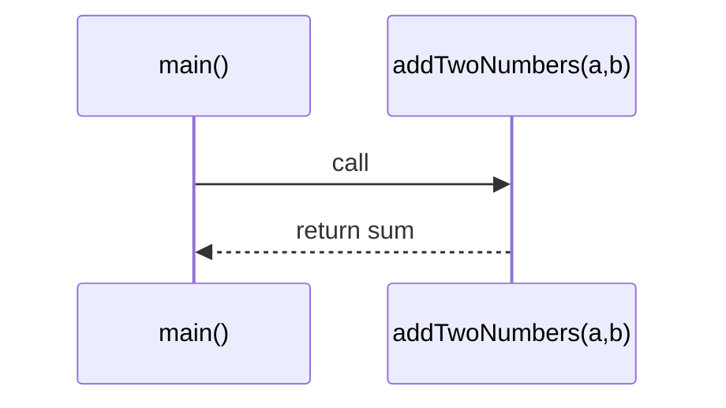

# Java Complete - Part 8: Methods and Functions

How calls move through the call stack:


Methods are the building blocks of organized code. They let you break complex problems into smaller, manageable pieces, avoid repetition, and create reusable functionality. In Java, every piece of executable code belongs to a method - even your `main` method is just a special method that starts your program.

## Understanding Methods

A method is a named block of code that performs a specific task. Think of methods as mini-programs within your larger program:

```java
public class MethodBasics {
    public static void main(String[] args) {
        // Calling methods
        sayHello();
        sayHello();
        sayHello();
        
        // Methods with parameters
        greetPerson("Alice");
        greetPerson("Bob");
        
        // Methods that return values
        int sum = addTwoNumbers(15, 27);
        System.out.println("Sum: " + sum);
        
        double area = calculateCircleArea(5.0);
        System.out.println("Circle area: " + area);
        
        // Using return values in expressions
        double volume = calculateSphereVolume(5.0);
        System.out.println("Sphere volume: " + volume);
        
        // Method call chains
        String message = formatCurrency(calculateTax(1000.0, 0.08));
        System.out.println("Tax amount: " + message);
    }
    
    // Method with no parameters, no return value
    public static void sayHello() {
        System.out.println("Hello, World!");
    }
    
    // Method with parameter, no return value
    public static void greetPerson(String name) {
        System.out.println("Hello, " + name + "!");
    }
    
    // Method with parameters and return value
    public static int addTwoNumbers(int a, int b) {
        int result = a + b;
        return result; // Return statement ends method execution
    }
    
    // Method with different parameter types
    public static double calculateCircleArea(double radius) {
        return Math.PI * radius * radius;
    }
    
    // Method that calls other methods
    public static double calculateSphereVolume(double radius) {
        double area = calculateCircleArea(radius);
        return (4.0 / 3.0) * area * radius;
    }
    
    // Methods working together
    public static double calculateTax(double amount, double rate) {
        return amount * rate;
    }
    
    public static String formatCurrency(double amount) {
        return String.format("$%.2f", amount);
    }
}
```

## Method Anatomy

Every method has several components:

```java
public class MethodAnatomy {
    // Method signature components:
    //   [access modifier] [static] [return type] [method name] ([parameters])
    
    public static void demonstrateMethodComponents() {
        // Access modifier: public, private, protected, or package-private (default)
        // static: method belongs to class, not instance
        // return type: void, int, String, etc.
        // method name: follows camelCase convention
        // parameters: data passed to the method
    }
    
    // Different access modifiers
    public static void publicMethod() {
        System.out.println("Accessible from anywhere");
    }
    
    private static void privateMethod() {
        System.out.println("Only accessible within this class");
    }
    
    // Method with multiple parameters
    public static double calculateCompoundInterest(
            double principal,    // Initial amount
            double rate,        // Interest rate (as decimal)
            int periods,        // Number of compounding periods
            int years          // Number of years
    ) {
        return principal * Math.pow(1 + (rate / periods), periods * years);
    }
    
    // Method with different return types
    public static boolean isEven(int number) {
        return number % 2 == 0;
    }
    
    public static String getGradeDescription(char grade) {
        switch (grade) {
            case 'A': return "Excellent";
            case 'B': return "Good";
            case 'C': return "Satisfactory";
            case 'D': return "Needs Improvement";
            case 'F': return "Failing";
            default: return "Invalid Grade";
        }
    }
    
    public static int[] createRange(int start, int end) {
        int[] range = new int[end - start + 1];
        for (int i = 0; i < range.length; i++) {
            range[i] = start + i;
        }
        return range;
    }
    
    public static void main(String[] args) {
        // Test different method types
        publicMethod();
        privateMethod();
        
        double investment = calculateCompoundInterest(1000, 0.05, 12, 10);
        System.out.printf("Investment value: $%.2f%n", investment);
        
        System.out.println("15 is even: " + isEven(15));
        System.out.println("20 is even: " + isEven(20));
        
        System.out.println("Grade A: " + getGradeDescription('A'));
        System.out.println("Grade X: " + getGradeDescription('X'));
        
        int[] numbers = createRange(5, 10);
        System.out.println("Range 5-10: " + java.util.Arrays.toString(numbers));
    }
}
```

## Parameter Passing and Variable Scope

Understanding how data flows in and out of methods is crucial:

```java
public class ParameterPassing {
    public static void main(String[] args) {
        // Primitive parameter passing (pass by value)
        int originalNumber = 10;
        System.out.println("Before method call: " + originalNumber);
        
        modifyPrimitive(originalNumber);
        System.out.println("After method call: " + originalNumber); // Unchanged
        
        // Array parameter passing (pass by reference)
        int[] originalArray = {1, 2, 3, 4, 5};
        System.out.println("Before method call: " + java.util.Arrays.toString(originalArray));
        
        modifyArray(originalArray);
        System.out.println("After method call: " + java.util.Arrays.toString(originalArray)); // Changed!
        
        // String parameter passing (special case)
        String originalString = "Hello";
        System.out.println("Before method call: " + originalString);
        
        modifyString(originalString);
        System.out.println("After method call: " + originalString); // Unchanged (strings are immutable)
        
        // Demonstration of variable scope
        demonstrateScope();
        
        // Return multiple values using arrays or objects
        int[] minMax = findMinMax(new int[]{3, 7, 1, 9, 2, 8});
        System.out.printf("Min: %d, Max: %d%n", minMax[0], minMax[1]);
        
        Statistics stats = calculateStatistics(new double[]{2.5, 3.7, 1.2, 4.8, 3.1});
        System.out.printf("Mean: %.2f, Std Dev: %.2f%n", stats.mean, stats.standardDeviation);
    }
    
    // Primitive parameters are copied (pass by value)
    public static void modifyPrimitive(int number) {
        number = number * 2; // Only modifies the local copy
        System.out.println("Inside method: " + number);
    }
    
    // Array parameters pass the reference (pass by reference)
    public static void modifyArray(int[] array) {
        for (int i = 0; i < array.length; i++) {
            array[i] = array[i] * 2; // Modifies the original array
        }
        System.out.println("Inside method: " + java.util.Arrays.toString(array));
    }
    
    // Strings are immutable, so they behave like primitives
    public static void modifyString(String str) {
        str = str + " World"; // Creates new string, doesn't modify original
        System.out.println("Inside method: " + str);
    }
    
    // Variable scope demonstration
    public static void demonstrateScope() {
        int outerVariable = 100;
        System.out.println("\n--- Variable Scope ---");
        System.out.println("Outer variable: " + outerVariable);
        
        if (true) {
            int blockVariable = 200;
            outerVariable = 150; // Can modify outer variable
            System.out.println("Block variable: " + blockVariable);
            System.out.println("Modified outer: " + outerVariable);
        }
        
        // blockVariable not accessible here
        System.out.println("Outer after block: " + outerVariable);
        
        // Method parameters and local variables
        testLocalVariables(42);
    }
    
    public static void testLocalVariables(int parameter) {
        int localVariable = parameter * 2;
        System.out.println("Parameter: " + parameter);
        System.out.println("Local variable: " + localVariable);
        // Both parameter and localVariable are only accessible within this method
    }
    
    // Returning multiple values using array
    public static int[] findMinMax(int[] numbers) {
        if (numbers.length == 0) {
            return new int[]{0, 0}; // Handle empty array
        }
        
        int min = numbers[0];
        int max = numbers[0];
        
        for (int number : numbers) {
            if (number < min) min = number;
            if (number > max) max = number;
        }
        
        return new int[]{min, max};
    }
    
    // Using a simple class to return multiple values
    static class Statistics {
        double mean;
        double standardDeviation;
        
        Statistics(double mean, double standardDeviation) {
            this.mean = mean;
            this.standardDeviation = standardDeviation;
        }
    }
    
    public static Statistics calculateStatistics(double[] values) {
        if (values.length == 0) {
            return new Statistics(0, 0);
        }
        
        // Calculate mean
        double sum = 0;
        for (double value : values) {
            sum += value;
        }
        double mean = sum / values.length;
        
        // Calculate standard deviation
        double sumSquaredDiff = 0;
        for (double value : values) {
            double diff = value - mean;
            sumSquaredDiff += diff * diff;
        }
        double variance = sumSquaredDiff / values.length;
        double standardDeviation = Math.sqrt(variance);
        
        return new Statistics(mean, standardDeviation);
    }
}
```

## Method Overloading

Java allows multiple methods with the same name but different parameters:

```java
public class MethodOverloading {
    public static void main(String[] args) {
        // Different versions of the same method
        System.out.println("No parameters: " + calculate());
        System.out.println("One parameter: " + calculate(5));
        System.out.println("Two parameters: " + calculate(5, 3));
        System.out.println("Three parameters: " + calculate(5, 3, 2));
        System.out.println("With doubles: " + calculate(5.5, 3.2));
        System.out.println("Mixed types: " + calculate(5, 3.2));
        
        // String formatting overloads
        printMessage("Simple message");
        printMessage("Formatted message", "INFO");
        printMessage("Detailed message", "WARNING", true);
        
        // Array processing overloads
        int[] intArray = {1, 2, 3, 4, 5};
        double[] doubleArray = {1.1, 2.2, 3.3, 4.4, 5.5};
        String[] stringArray = {"apple", "banana", "cherry"};
        
        printArray(intArray);
        printArray(doubleArray);
        printArray(stringArray);
        
        // Search method overloads
        System.out.println("Search for 3 in array: " + search(intArray, 3));
        System.out.println("Search for 2.2 in array: " + search(doubleArray, 2.2));
        System.out.println("Search for 'banana' in array: " + search(stringArray, "banana"));
    }
    
    // Method overloading: same name, different parameters
    
    // No parameters - default calculation
    public static int calculate() {
        return 0;
    }
    
    // One parameter - square the number
    public static int calculate(int a) {
        return a * a;
    }
    
    // Two parameters - multiply
    public static int calculate(int a, int b) {
        return a * b;
    }
    
    // Three parameters - multiply all
    public static int calculate(int a, int b, int c) {
        return a * b * c;
    }
    
    // Different types - doubles
    public static double calculate(double a, double b) {
        return a * b;
    }
    
    // Mixed types - int and double
    public static double calculate(int a, double b) {
        return a * b;
    }
    
    // Note: return type alone cannot distinguish overloaded methods
    // This would be a compilation error:
    // public static double calculate(int a) { return a * a; }
    
    // String message formatting overloads
    public static void printMessage(String message) {
        System.out.println("[MESSAGE] " + message);
    }
    
    public static void printMessage(String message, String level) {
        System.out.println("[" + level + "] " + message);
    }
    
    public static void printMessage(String message, String level, boolean timestamp) {
        String prefix = "[" + level + "]";
        if (timestamp) {
            prefix = java.time.LocalTime.now() + " " + prefix;
        }
        System.out.println(prefix + " " + message);
    }
    
    // Array printing overloads
    public static void printArray(int[] array) {
        System.out.print("Int array: ");
        for (int value : array) {
            System.out.print(value + " ");
        }
        System.out.println();
    }
    
    public static void printArray(double[] array) {
        System.out.print("Double array: ");
        for (double value : array) {
            System.out.printf("%.1f ", value);
        }
        System.out.println();
    }
    
    public static void printArray(String[] array) {
        System.out.print("String array: ");
        for (String value : array) {
            System.out.print(value + " ");
        }
        System.out.println();
    }
    
    // Generic search method overloads
    public static int search(int[] array, int target) {
        for (int i = 0; i < array.length; i++) {
            if (array[i] == target) {
                return i;
            }
        }
        return -1;
    }
    
    public static int search(double[] array, double target) {
        for (int i = 0; i < array.length; i++) {
            if (Math.abs(array[i] - target) < 0.0001) { // Handle floating-point precision
                return i;
            }
        }
        return -1;
    }
    
    public static int search(String[] array, String target) {
        for (int i = 0; i < array.length; i++) {
            if (array[i].equals(target)) {
                return i;
            }
        }
        return -1;
    }
}
```

## Recursion

Recursion is when a method calls itself. It's powerful for problems that have self-similar subproblems:

```java
public class RecursionExamples {
    public static void main(String[] args) {
        // Simple recursion examples
        System.out.println("5! = " + factorial(5));
        System.out.println("Fibonacci(10) = " + fibonacci(10));
        
        System.out.println("\nFibonacci sequence (first 15 numbers):");
        for (int i = 0; i < 15; i++) {
            System.out.print(fibonacci(i) + " ");
        }
        System.out.println();
        
        // String processing with recursion
        System.out.println("\nReverse 'Hello': " + reverseString("Hello"));
        System.out.println("Is 'racecar' a palindrome? " + isPalindrome("racecar"));
        System.out.println("Is 'hello' a palindrome? " + isPalindrome("hello"));
        
        // Mathematical recursion
        System.out.println("\nGCD(48, 18) = " + gcd(48, 18));
        System.out.println("2^10 = " + power(2, 10));
        System.out.println("Sum 1 to 100 = " + sumRange(1, 100));
        
        // Array processing with recursion
        int[] numbers = {3, 7, 1, 9, 2, 8, 4};
        System.out.println("\nArray: " + java.util.Arrays.toString(numbers));
        System.out.println("Array sum: " + arraySum(numbers, 0));
        System.out.println("Array max: " + arrayMax(numbers, 0));
        
        // Tree-like structure processing
        System.out.println("\nBinary search in sorted array:");
        int[] sortedArray = {1, 3, 5, 7, 9, 11, 13, 15, 17, 19};
        System.out.println("Array: " + java.util.Arrays.toString(sortedArray));
        System.out.println("Search for 7: index " + binarySearch(sortedArray, 7, 0, sortedArray.length - 1));
        System.out.println("Search for 12: index " + binarySearch(sortedArray, 12, 0, sortedArray.length - 1));
        
        // Tower of Hanoi demonstration
        System.out.println("\nTower of Hanoi with 3 disks:");
        towerOfHanoi(3, 'A', 'C', 'B');
        
        // Performance comparison
        compareRecursionPerformance();
    }
    
    // Classic factorial example
    public static long factorial(int n) {
        // Base case: stop recursion
        if (n <= 1) {
            return 1;
        }
        // Recursive case: n! = n * (n-1)!
        return n * factorial(n - 1);
    }
    
    // Fibonacci sequence (inefficient but educational)
    public static int fibonacci(int n) {
        // Base cases
        if (n <= 1) {
            return n;
        }
        // Recursive case: F(n) = F(n-1) + F(n-2)
        return fibonacci(n - 1) + fibonacci(n - 2);
    }
    
    // More efficient Fibonacci using memoization concept
    public static long fibonacciEfficient(int n, long[] memo) {
        if (n <= 1) return n;
        
        if (memo[n] != 0) {
            return memo[n]; // Return cached result
        }
        
        memo[n] = fibonacciEfficient(n - 1, memo) + fibonacciEfficient(n - 2, memo);
        return memo[n];
    }
    
    // String reversal with recursion
    public static String reverseString(String str) {
        // Base case: empty string or single character
        if (str.length() <= 1) {
            return str;
        }
        // Recursive case: last character + reverse of remaining string
        return str.charAt(str.length() - 1) + reverseString(str.substring(0, str.length() - 1));
    }
    
    // Palindrome check
    public static boolean isPalindrome(String str) {
        return isPalindromeHelper(str.toLowerCase(), 0, str.length() - 1);
    }
    
    private static boolean isPalindromeHelper(String str, int left, int right) {
        // Base case: pointers meet or cross
        if (left >= right) {
            return true;
        }
        // Check if characters match
        if (str.charAt(left) != str.charAt(right)) {
            return false;
        }
        // Recursive case: check inner substring
        return isPalindromeHelper(str, left + 1, right - 1);
    }
    
    // Greatest Common Divisor using Euclidean algorithm
    public static int gcd(int a, int b) {
        // Base case: when b is 0, GCD is a
        if (b == 0) {
            return a;
        }
        // Recursive case: GCD(a,b) = GCD(b, a mod b)
        return gcd(b, a % b);
    }
    
    // Power function using recursion
    public static long power(int base, int exponent) {
        // Base case
        if (exponent == 0) {
            return 1;
        }
        if (exponent == 1) {
            return base;
        }
        
        // Optimize: use divide and conquer
        if (exponent % 2 == 0) {
            long half = power(base, exponent / 2);
            return half * half;
        } else {
            return base * power(base, exponent - 1);
        }
    }
    
    // Sum of range using recursion
    public static int sumRange(int start, int end) {
        // Base case
        if (start > end) {
            return 0;
        }
        if (start == end) {
            return start;
        }
        // Recursive case
        return start + sumRange(start + 1, end);
    }
    
    // Array sum with recursion
    public static int arraySum(int[] array, int index) {
        // Base case: reached end of array
        if (index >= array.length) {
            return 0;
        }
        // Recursive case: current element + sum of rest
        return array[index] + arraySum(array, index + 1);
    }
    
    // Array maximum with recursion
    public static int arrayMax(int[] array, int index) {
        // Base case: last element
        if (index == array.length - 1) {
            return array[index];
        }
        // Recursive case: max of current and max of rest
        int maxOfRest = arrayMax(array, index + 1);
        return Math.max(array[index], maxOfRest);
    }
    
    // Binary search with recursion
    public static int binarySearch(int[] array, int target, int left, int right) {
        // Base case: element not found
        if (left > right) {
            return -1;
        }
        
        int mid = left + (right - left) / 2; // Avoid integer overflow
        
        // Base case: found target
        if (array[mid] == target) {
            return mid;
        }
        
        // Recursive cases
        if (target < array[mid]) {
            return binarySearch(array, target, left, mid - 1); // Search left half
        } else {
            return binarySearch(array, target, mid + 1, right); // Search right half
        }
    }
    
    // Tower of Hanoi puzzle
    public static void towerOfHanoi(int n, char source, char destination, char auxiliary) {
        // Base case: move one disk
        if (n == 1) {
            System.out.println("Move disk 1 from " + source + " to " + destination);
            return;
        }
        
        // Move n-1 disks from source to auxiliary
        towerOfHanoi(n - 1, source, auxiliary, destination);
        
        // Move the largest disk from source to destination
        System.out.println("Move disk " + n + " from " + source + " to " + destination);
        
        // Move n-1 disks from auxiliary to destination
        towerOfHanoi(n - 1, auxiliary, destination, source);
    }
    
    // Performance comparison between recursive and iterative approaches
    private static void compareRecursionPerformance() {
        System.out.println("\n--- Performance Comparison ---");
        
        int n = 40;
        
        // Time recursive Fibonacci (very slow)
        long start = System.nanoTime();
        int fibResult = fibonacci(20); // Using smaller number due to inefficiency
        long recursiveTime = System.nanoTime() - start;
        
        // Time efficient Fibonacci
        start = System.nanoTime();
        long[] memo = new long[n + 1];
        long efficientResult = fibonacciEfficient(n, memo);
        long efficientTime = System.nanoTime() - start;
        
        // Time iterative Fibonacci
        start = System.nanoTime();
        long iterativeResult = fibonacciIterative(n);
        long iterativeTime = System.nanoTime() - start;
        
        System.out.println("Fibonacci(20) recursive: " + fibResult + 
                          " (" + recursiveTime / 1_000_000 + " ms)");
        System.out.println("Fibonacci(40) efficient: " + efficientResult + 
                          " (" + efficientTime / 1_000_000 + " ms)");
        System.out.println("Fibonacci(40) iterative: " + iterativeResult + 
                          " (" + iterativeTime / 1_000_000 + " ms)");
    }
    
    // Iterative Fibonacci for comparison
    public static long fibonacciIterative(int n) {
        if (n <= 1) return n;
        
        long prev1 = 0, prev2 = 1;
        for (int i = 2; i <= n; i++) {
            long current = prev1 + prev2;
            prev1 = prev2;
            prev2 = current;
        }
        return prev2;
    }
}
```

## Variable Arguments (Varargs)

Java allows methods to accept a variable number of arguments:

```java
public class VarargsDemo {
    public static void main(String[] args) {
        // Methods with variable arguments
        System.out.println("Sum of 1, 2, 3: " + sum(1, 2, 3));
        System.out.println("Sum of 1 to 10: " + sum(1, 2, 3, 4, 5, 6, 7, 8, 9, 10));
        System.out.println("Sum of no args: " + sum()); // Empty varargs
        
        // String joining with varargs
        System.out.println("Join with commas: " + join(", ", "apple", "banana", "cherry"));
        System.out.println("Join with pipes: " + join(" | ", "red", "green", "blue", "yellow"));
        
        // Formatting with varargs
        printFormatted("Hello %s, you have %d messages", "Alice", 5);
        printFormatted("Pi is approximately %.2f", Math.PI);
        
        // Finding maximum with varargs
        System.out.println("Max of 3, 7, 1, 9, 2: " + findMax(3, 7, 1, 9, 2));
        
        // Statistical functions
        double[] values = {2.5, 3.7, 1.2, 4.8, 3.1, 2.9, 4.2};
        System.out.printf("Mean: %.2f%n", mean(2.5, 3.7, 1.2, 4.8, 3.1, 2.9, 4.2));
        
        // Building SQL-like queries
        String query = buildSelectQuery("users", "name", "email", "age");
        System.out.println("SQL Query: " + query);
        
        // Event logging with varargs
        logEvent("UserLogin", "user_id", "12345", "timestamp", "2025-01-29T10:30:00");
        
        // Array vs varargs demonstration
        demonstrateArrayVsVarargs();
    }
    
    // Basic varargs method
    public static int sum(int... numbers) {
        int total = 0;
        for (int number : numbers) {
            total += number;
        }
        return total;
    }
    
    // Varargs with other parameters (varargs must be last)
    public static String join(String separator, String... strings) {
        if (strings.length == 0) {
            return "";
        }
        
        StringBuilder result = new StringBuilder();
        result.append(strings[0]);
        
        for (int i = 1; i < strings.length; i++) {
            result.append(separator).append(strings[i]);
        }
        
        return result.toString();
    }
    
    // String formatting with varargs
    public static void printFormatted(String format, Object... args) {
        System.out.println(String.format(format, args));
    }
    
    // Finding maximum with varargs
    public static int findMax(int first, int... rest) { // At least one parameter required
        int max = first;
        for (int value : rest) {
            if (value > max) {
                max = value;
            }
        }
        return max;
    }
    
    // Statistical function with varargs
    public static double mean(double... values) {
        if (values.length == 0) {
            return 0.0;
        }
        
        double sum = 0.0;
        for (double value : values) {
            sum += value;
        }
        return sum / values.length;
    }
    
    // Building dynamic SQL queries
    public static String buildSelectQuery(String table, String... columns) {
        StringBuilder query = new StringBuilder("SELECT ");
        
        if (columns.length == 0) {
            query.append("*");
        } else {
            query.append(join(", ", columns));
        }
        
        query.append(" FROM ").append(table);
        return query.toString();
    }
    
    // Event logging with key-value pairs
    public static void logEvent(String eventType, String... keyValuePairs) {
        System.out.print("EVENT: " + eventType);
        
        // Process key-value pairs
        for (int i = 0; i < keyValuePairs.length; i += 2) {
            if (i + 1 < keyValuePairs.length) {
                String key = keyValuePairs[i];
                String value = keyValuePairs[i + 1];
                System.out.print(" | " + key + "=" + value);
            }
        }
        System.out.println();
    }
    
    // Demonstrate array vs varargs
    public static void demonstrateArrayVsVarargs() {
        System.out.println("\n--- Array vs Varargs ---");
        
        // Varargs can be called with individual arguments
        int varargsSum = sum(1, 2, 3, 4, 5);
        System.out.println("Varargs sum: " + varargsSum);
        
        // Varargs can also be called with an array
        int[] numbers = {1, 2, 3, 4, 5};
        int arraySum = sum(numbers); // Array passed to varargs method
        System.out.println("Array to varargs sum: " + arraySum);
        
        // Regular array method
        int regularSum = sumArray(numbers);
        System.out.println("Regular array sum: " + regularSum);
        
        // Performance consideration
        performanceComparison();
    }
    
    // Regular method that takes an array
    public static int sumArray(int[] numbers) {
        int total = 0;
        for (int number : numbers) {
            total += number;
        }
        return total;
    }
    
    // Performance comparison
    private static void performanceComparison() {
        System.out.println("\nPerformance comparison (varargs vs array):");
        
        int[] largeArray = new int[1000000];
        for (int i = 0; i < largeArray.length; i++) {
            largeArray[i] = i;
        }
        
        // Time array method
        long start = System.nanoTime();
        int arrayResult = sumArray(largeArray);
        long arrayTime = System.nanoTime() - start;
        
        // Time varargs method (same array)
        start = System.nanoTime();
        int varargsResult = sum(largeArray);
        long varargsTime = System.nanoTime() - start;
        
        System.out.printf("Array method: %d ms%n", arrayTime / 1_000_000);
        System.out.printf("Varargs method: %d ms%n", varargsTime / 1_000_000);
        System.out.printf("Results equal: %s%n", arrayResult == varargsResult);
    }
}
```

## Practical Application: Math Library

Let's build a comprehensive math library that demonstrates all method concepts:

```java
/**
 * A comprehensive math library demonstrating various method concepts:
 * - Method overloading
 * - Parameter passing
 * - Return values
 * - Recursion
 * - Varargs
 * - Static utility methods
 */
public class MathLibrary {
    // Mathematical constants
    public static final double E = Math.E;
    public static final double PI = Math.PI;
    public static final double GOLDEN_RATIO = (1 + Math.sqrt(5)) / 2;
    
    public static void main(String[] args) {
        // Test the math library
        System.out.println("=== Math Library Demo ===");
        
        // Basic arithmetic
        System.out.println("add(5, 3) = " + add(5, 3));
        System.out.println("add(5.5, 3.2) = " + add(5.5, 3.2));
        
        // Power functions
        System.out.println("power(2, 10) = " + power(2, 10));
        System.out.println("power(2.5, 3) = " + power(2.5, 3));
        
        // Factorial and combinatorics
        System.out.println("factorial(8) = " + factorial(8));
        System.out.println("combination(10, 3) = " + combination(10, 3));
        System.out.println("permutation(10, 3) = " + permutation(10, 3));
        
        // Sequence functions
        System.out.println("fibonacci(15) = " + fibonacci(15));
        System.out.println("tribonacci(10) = " + tribonacci(10));
        
        // Statistical functions
        double[] data = {2.5, 3.7, 1.2, 4.8, 3.1, 2.9, 4.2, 3.6, 2.8, 4.1};
        System.out.printf("mean: %.2f%n", mean(data));
        System.out.printf("median: %.2f%n", median(data));
        System.out.printf("mode: %.2f%n", mode(data));
        System.out.printf("standard deviation: %.2f%n", standardDeviation(data));
        
        // Geometric functions
        System.out.printf("circle area (r=5): %.2f%n", circleArea(5));
        System.out.printf("circle circumference (r=5): %.2f%n", circleCircumference(5));
        System.out.printf("sphere volume (r=5): %.2f%n", sphereVolume(5));
        
        // Prime number functions
        System.out.println("isPrime(17): " + isPrime(17));
        System.out.println("isPrime(18): " + isPrime(18));
        System.out.println("nextPrime(100): " + nextPrime(100));
        
        int[] primes = primesUpTo(50);
        System.out.println("Primes up to 50: " + java.util.Arrays.toString(primes));
        
        // Number theory
        System.out.println("gcd(48, 18) = " + gcd(48, 18));
        System.out.println("lcm(12, 18) = " + lcm(12, 18));
        
        // Trigonometric functions (degrees)
        System.out.printf("sin(30°) = %.4f%n", sinDegrees(30));
        System.out.printf("cos(60°) = %.4f%n", cosDegrees(60));
        System.out.printf("tan(45°) = %.4f%n", tanDegrees(45));
        
        // Matrix operations
        double[][] matrixA = {{1, 2}, {3, 4}};
        double[][] matrixB = {{5, 6}, {7, 8}};
        
        double[][] product = matrixMultiply(matrixA, matrixB);
        System.out.println("Matrix multiplication result:");
        printMatrix(product);
        
        // Polynomial evaluation
        double[] coefficients = {1, -2, 1}; // x^2 - 2x + 1
        System.out.printf("Polynomial at x=3: %.2f%n", evaluatePolynomial(coefficients, 3));
        
        // Financial calculations
        System.out.printf("Compound interest: $%.2f%n", 
                         compoundInterest(1000, 0.05, 4, 10));
        System.out.printf("Monthly payment: $%.2f%n", 
                         monthlyLoanPayment(200000, 0.04, 30));
    }
    
    // ===== BASIC ARITHMETIC OPERATIONS =====
    
    // Addition overloads
    public static int add(int a, int b) {
        return a + b;
    }
    
    public static double add(double a, double b) {
        return a + b;
    }
    
    public static int add(int... numbers) {
        int sum = 0;
        for (int num : numbers) {
            sum += num;
        }
        return sum;
    }
    
    // Power functions
    public static long power(int base, int exponent) {
        if (exponent < 0) {
            throw new IllegalArgumentException("Exponent must be non-negative");
        }
        if (exponent == 0) return 1;
        
        long result = 1;
        for (int i = 0; i < exponent; i++) {
            result *= base;
        }
        return result;
    }
    
    public static double power(double base, int exponent) {
        if (exponent < 0) {
            return 1.0 / power(base, -exponent);
        }
        
        double result = 1.0;
        for (int i = 0; i < exponent; i++) {
            result *= base;
        }
        return result;
    }
    
    // ===== FACTORIAL AND COMBINATORICS =====
    
    public static long factorial(int n) {
        if (n < 0) {
            throw new IllegalArgumentException("Factorial undefined for negative numbers");
        }
        if (n <= 1) return 1;
        
        long result = 1;
        for (int i = 2; i <= n; i++) {
            result *= i;
        }
        return result;
    }
    
    public static long combination(int n, int r) {
        if (r > n || r < 0) return 0;
        if (r == 0 || r == n) return 1;
        
        // Use symmetry: C(n,r) = C(n,n-r)
        if (r > n - r) r = n - r;
        
        long result = 1;
        for (int i = 0; i < r; i++) {
            result = result * (n - i) / (i + 1);
        }
        return result;
    }
    
    public static long permutation(int n, int r) {
        if (r > n || r < 0) return 0;
        
        long result = 1;
        for (int i = n; i > n - r; i--) {
            result *= i;
        }
        return result;
    }
    
    // ===== SEQUENCE FUNCTIONS =====
    
    // Fibonacci with memoization
    private static long[] fibMemo = new long[100];
    
    public static long fibonacci(int n) {
        if (n < 0) throw new IllegalArgumentException("n must be non-negative");
        if (n <= 1) return n;
        
        if (fibMemo[n] != 0) return fibMemo[n];
        
        fibMemo[n] = fibonacci(n - 1) + fibonacci(n - 2);
        return fibMemo[n];
    }
    
    // Tribonacci sequence: T(n) = T(n-1) + T(n-2) + T(n-3)
    public static long tribonacci(int n) {
        if (n < 0) throw new IllegalArgumentException("n must be non-negative");
        if (n <= 1) return n;
        if (n == 2) return 1;
        
        long a = 0, b = 1, c = 1;
        for (int i = 3; i <= n; i++) {
            long next = a + b + c;
            a = b;
            b = c;
            c = next;
        }
        return c;
    }
    
    // ===== STATISTICAL FUNCTIONS =====
    
    public static double mean(double... values) {
        if (values.length == 0) return 0;
        
        double sum = 0;
        for (double value : values) {
            sum += value;
        }
        return sum / values.length;
    }
    
    public static double median(double[] values) {
        if (values.length == 0) return 0;
        
        double[] sorted = values.clone();
        java.util.Arrays.sort(sorted);
        
        int n = sorted.length;
        if (n % 2 == 0) {
            return (sorted[n/2 - 1] + sorted[n/2]) / 2.0;
        } else {
            return sorted[n/2];
        }
    }
    
    public static double mode(double[] values) {
        if (values.length == 0) return 0;
        
        java.util.Map<Double, Integer> frequency = new java.util.HashMap<>();
        for (double value : values) {
            frequency.put(value, frequency.getOrDefault(value, 0) + 1);
        }
        
        double mode = values[0];
        int maxFreq = 0;
        
        for (java.util.Map.Entry<Double, Integer> entry : frequency.entrySet()) {
            if (entry.getValue() > maxFreq) {
                maxFreq = entry.getValue();
                mode = entry.getKey();
            }
        }
        
        return mode;
    }
    
    public static double standardDeviation(double[] values) {
        if (values.length <= 1) return 0;
        
        double mean = mean(values);
        double sumSquaredDiff = 0;
        
        for (double value : values) {
            double diff = value - mean;
            sumSquaredDiff += diff * diff;
        }
        
        return Math.sqrt(sumSquaredDiff / (values.length - 1)); // Sample standard deviation
    }
    
    // ===== GEOMETRIC FUNCTIONS =====
    
    public static double circleArea(double radius) {
        if (radius < 0) throw new IllegalArgumentException("Radius must be non-negative");
        return PI * radius * radius;
    }
    
    public static double circleCircumference(double radius) {
        if (radius < 0) throw new IllegalArgumentException("Radius must be non-negative");
        return 2 * PI * radius;
    }
    
    public static double sphereVolume(double radius) {
        if (radius < 0) throw new IllegalArgumentException("Radius must be non-negative");
        return (4.0/3.0) * PI * radius * radius * radius;
    }
    
    // ===== PRIME NUMBER FUNCTIONS =====
    
    public static boolean isPrime(int n) {
        if (n < 2) return false;
        if (n == 2) return true;
        if (n % 2 == 0) return false;
        
        for (int i = 3; i * i <= n; i += 2) {
            if (n % i == 0) return false;
        }
        return true;
    }
    
    public static int nextPrime(int n) {
        int candidate = n + 1;
        while (!isPrime(candidate)) {
            candidate++;
        }
        return candidate;
    }
    
    public static int[] primesUpTo(int limit) {
        java.util.List<Integer> primes = new java.util.ArrayList<>();
        
        for (int i = 2; i <= limit; i++) {
            if (isPrime(i)) {
                primes.add(i);
            }
        }
        
        return primes.stream().mapToInt(Integer::intValue).toArray();
    }
    
    // ===== NUMBER THEORY =====
    
    public static int gcd(int a, int b) {
        a = Math.abs(a);
        b = Math.abs(b);
        
        while (b != 0) {
            int temp = b;
            b = a % b;
            a = temp;
        }
        return a;
    }
    
    public static int lcm(int a, int b) {
        return Math.abs(a * b) / gcd(a, b);
    }
    
    // ===== TRIGONOMETRIC FUNCTIONS (DEGREES) =====
    
    public static double sinDegrees(double degrees) {
        return Math.sin(Math.toRadians(degrees));
    }
    
    public static double cosDegrees(double degrees) {
        return Math.cos(Math.toRadians(degrees));
    }
    
    public static double tanDegrees(double degrees) {
        return Math.tan(Math.toRadians(degrees));
    }
    
    // ===== MATRIX OPERATIONS =====
    
    public static double[][] matrixMultiply(double[][] a, double[][] b) {
        int rowsA = a.length;
        int colsA = a[0].length;
        int rowsB = b.length;
        int colsB = b[0].length;
        
        if (colsA != rowsB) {
            throw new IllegalArgumentException("Matrix dimensions incompatible for multiplication");
        }
        
        double[][] result = new double[rowsA][colsB];
        
        for (int i = 0; i < rowsA; i++) {
            for (int j = 0; j < colsB; j++) {
                for (int k = 0; k < colsA; k++) {
                    result[i][j] += a[i][k] * b[k][j];
                }
            }
        }
        
        return result;
    }
    
    public static void printMatrix(double[][] matrix) {
        for (double[] row : matrix) {
            for (double value : row) {
                System.out.printf("%8.2f", value);
            }
            System.out.println();
        }
    }
    
    // ===== POLYNOMIAL EVALUATION =====
    
    public static double evaluatePolynomial(double[] coefficients, double x) {
        // Evaluate polynomial using Horner's method
        double result = 0;
        for (int i = coefficients.length - 1; i >= 0; i--) {
            result = result * x + coefficients[i];
        }
        return result;
    }
    
    // ===== FINANCIAL CALCULATIONS =====
    
    public static double compoundInterest(double principal, double annualRate, 
                                        int compoundingPerYear, int years) {
        return principal * Math.pow(1 + annualRate / compoundingPerYear, 
                                   compoundingPerYear * years);
    }
    
    public static double monthlyLoanPayment(double principal, double annualRate, int years) {
        double monthlyRate = annualRate / 12;
        int numPayments = years * 12;
        
        if (monthlyRate == 0) return principal / numPayments;
        
        return principal * (monthlyRate * Math.pow(1 + monthlyRate, numPayments)) /
               (Math.pow(1 + monthlyRate, numPayments) - 1);
    }
}
```

## Best Practices and Common Pitfalls

### 1. Method Naming
```java
// Good - verb phrases that describe what the method does
public static int calculateTotal(int[] prices) { }
public static boolean isValidEmail(String email) { }
public static void printReport(Report report) { }

// Bad - unclear or misleading names
public static int process(int[] data) { } // What kind of processing?
public static boolean check(String input) { } // Check for what?
public static void doStuff() { } // Too vague
```

### 2. Parameter Validation
```java
public static double calculateCircleArea(double radius) {
    // Always validate input parameters
    if (radius < 0) {
        throw new IllegalArgumentException("Radius cannot be negative");
    }
    
    return Math.PI * radius * radius;
}

public static int findIndex(int[] array, int target) {
    // Check for null arrays
    if (array == null) {
        throw new IllegalArgumentException("Array cannot be null");
    }
    
    // Implementation...
    return -1;
}
```

### 3. Single Responsibility
```java
// Good - each method has one clear purpose
public static double calculateTax(double amount, double rate) {
    return amount * rate;
}

public static String formatCurrency(double amount) {
    return String.format("$%.2f", amount);
}

// Bad - method doing too many things
public static void processOrder(double amount, double taxRate) {
    // Calculate tax
    double tax = amount * taxRate;
    
    // Format currency
    String formattedAmount = String.format("$%.2f", amount + tax);
    
    // Print receipt
    System.out.println("Total: " + formattedAmount);
    
    // Send email (too many responsibilities!)
    sendEmailReceipt(formattedAmount);
}
```

### 4. Avoid Deeply Nested Methods
```java
// Hard to follow
public static String processData(String input) {
    if (input != null) {
        if (input.length() > 0) {
            if (input.matches("\\d+")) {
                if (Integer.parseInt(input) > 0) {
                    return "Valid positive number";
                }
            }
        }
    }
    return "Invalid input";
}

// Better - use guard clauses
public static String processDataBetter(String input) {
    if (input == null) return "Invalid input";
    if (input.length() == 0) return "Invalid input";
    if (!input.matches("\\d+")) return "Invalid input";
    if (Integer.parseInt(input) <= 0) return "Invalid input";
    
    return "Valid positive number";
}
```

## Looking Ahead

You've now completed the Beginner Fundamentals level! You understand:

- Java's basic syntax and data types
- Control flow with conditionals and loops  
- Arrays and strings for data storage
- Methods for organizing and reusing code

With these foundations, you can solve a wide variety of programming problems. In our next tutorial, we'll tackle a comprehensive project that combines all these concepts - building either a command-line calculator or a tic-tac-toe game.

These fundamentals form the bedrock of all Java programming. Every advanced topic we'll explore in the Intermediate level builds upon these core concepts. Take time to practice writing methods, experiment with recursion, and try implementing your own utility functions. The better you understand these basics, the easier advanced topics will become.