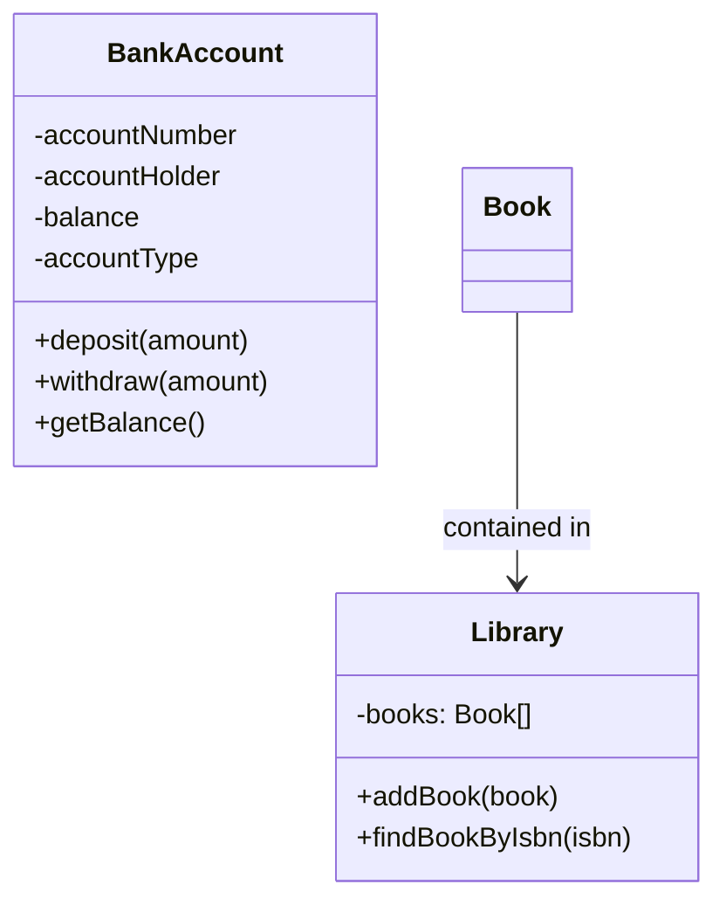

# Object-Oriented Programming (OOP) Basics

Object-oriented programming transforms how we think about code organization. Instead of procedures operating on data, we model real-world entities as objects that contain both data and the methods to manipulate that data.

## The Paradigm Shift

Consider our Level 1 calculator. It used static methods and global variables:

```java
// Procedural approach
private static Scanner scanner = new Scanner(System.in);
private static ArrayList<String> history = new ArrayList<>();

public static void main(String[] args) {
    performBasicOperation();
}

private static void performBasicOperation() {
    // All data is global or passed as parameters
}
```

Object-oriented programming organizes this differently:

```java
// Object-oriented approach
public class Calculator {
    private Scanner scanner;
    private ArrayList<String> history;
    
    public Calculator() {
        scanner = new Scanner(System.in);
        history = new ArrayList<>();
    }
    
    public void performBasicOperation() {
        // Data belongs to this specific calculator instance
    }
}
```

## Classes and Objects

A **class** is a blueprint for creating objects. An **object** is an instance of a class.

A quick visual of object relationships in this section:


### Bank Account Example

```java
public class BankAccount {
    // Instance variables (attributes/fields)
    private String accountNumber;
    private String accountHolder;
    private double balance;
    private String accountType;
    
    // Constructor - special method for creating objects
    public BankAccount(String accountNumber, String accountHolder, double initialBalance) {
        this.accountNumber = accountNumber;
        this.accountHolder = accountHolder;
        this.balance = initialBalance;
        this.accountType = "CHECKING";
    }
    
    // Overloaded constructor
    public BankAccount(String accountNumber, String accountHolder, double initialBalance, String accountType) {
        this.accountNumber = accountNumber;
        this.accountHolder = accountHolder;
        this.balance = initialBalance;
        this.accountType = accountType.toUpperCase();
    }
    
    // Instance methods (behaviors)
    public void deposit(double amount) {
        if (amount > 0) {
            balance += amount;
            System.out.printf("Deposited $%.2f. New balance: $%.2f\n", amount, balance);
        } else {
            System.out.println("Deposit amount must be positive.");
        }
    }
    
    public boolean withdraw(double amount) {
        if (amount > 0 && amount <= balance) {
            balance -= amount;
            System.out.printf("Withdrew $%.2f. New balance: $%.2f\n", amount, balance);
            return true;
        } else {
            System.out.println("Invalid withdrawal amount or insufficient funds.");
            return false;
        }
    }
    
    public double getBalance() {
        return balance;
    }
    
    public String getAccountInfo() {
        return String.format("Account: %s | Holder: %s | Type: %s | Balance: $%.2f", 
                           accountNumber, accountHolder, accountType, balance);
    }
}
```

### Using the Class

```java
public class BankingDemo {
    public static void main(String[] args) {
        // Creating objects (instantiation)
        BankAccount account1 = new BankAccount("ACC001", "Alice Johnson", 1000.0);
        BankAccount account2 = new BankAccount("ACC002", "Bob Smith", 500.0, "SAVINGS");
        
        // Each object has its own data
        System.out.println(account1.getAccountInfo());
        System.out.println(account2.getAccountInfo());
        
        // Calling methods on objects
        account1.deposit(250.0);
        account1.withdraw(100.0);
        
        account2.deposit(75.0);
        account2.withdraw(600.0); // This will fail
        
        // Objects maintain independent state
        System.out.println("Final balances:");
        System.out.println("Alice: $" + account1.getBalance());
        System.out.println("Bob: $" + account2.getBalance());
    }
}
```

**Output:**
```
Account: ACC001 | Holder: Alice Johnson | Type: CHECKING | Balance: $1000.00
Account: ACC002 | Holder: Bob Smith | Type: SAVINGS | Balance: $500.00
Deposited $250.00. New balance: $1250.00
Withdrew $100.00. New balance: $1150.00
Deposited $75.00. New balance: $575.00
Invalid withdrawal amount or insufficient funds.
Final balances:
Alice: $1150.00
Bob: $575.00
```

## The `this` Keyword

The `this` keyword refers to the current object instance:

```java
public class Employee {
    private String name;
    private double salary;
    
    public Employee(String name, double salary) {
        this.name = name;     // this.name refers to instance variable
        this.salary = salary; // salary refers to parameter
    }
    
    public void displayInfo() {
        System.out.printf("Employee: %s, Salary: $%.2f\n", this.name, this.salary);
        // 'this.' is optional when no naming conflict exists
    }
    
    public Employee createCopy() {
        return new Employee(this.name, this.salary); // Return new object with same data
    }
    
    public boolean isSameEmployee(Employee other) {
        return this.name.equals(other.name); // Compare this object with another
    }
}
```

## Instance vs Static Members

### Instance Variables and Methods
- Belong to specific object instances
- Each object has its own copy
- Accessed through object references

### Static Variables and Methods
- Belong to the class itself
- Shared by all instances
- Accessed through class name

```java
public class Counter {
    private int instanceCount;        // Instance variable
    private static int totalCreated = 0; // Static variable (class variable)
    
    public Counter() {
        instanceCount = 0;
        totalCreated++; // Increment shared counter
    }
    
    public void increment() {
        instanceCount++; // Instance method accessing instance variable
    }
    
    public int getCount() {
        return instanceCount;
    }
    
    // Static method - can only access static variables directly
    public static int getTotalCounters() {
        return totalCreated;
        // return instanceCount; // ERROR: Cannot access instance variable from static context
    }
    
    public static void resetTotalCount() {
        totalCreated = 0;
    }
}

// Usage demonstration
public class CounterDemo {
    public static void main(String[] args) {
        System.out.println("Initial total: " + Counter.getTotalCounters()); // 0
        
        Counter c1 = new Counter();
        Counter c2 = new Counter();
        Counter c3 = new Counter();
        
        System.out.println("Total counters created: " + Counter.getTotalCounters()); // 3
        
        c1.increment();
        c1.increment();
        c2.increment();
        
        System.out.println("c1 count: " + c1.getCount()); // 2
        System.out.println("c2 count: " + c2.getCount()); // 1
        System.out.println("c3 count: " + c3.getCount()); // 0
        System.out.println("Total objects: " + Counter.getTotalCounters()); // Still 3
    }
}
```

## Access Modifiers

Access modifiers control visibility and access to class members:

| Modifier | Same Class | Same Package | Subclass | Different Package |
|----------|------------|--------------|----------|-------------------|
| `private` | ✓ | ✗ | ✗ | ✗ |
| (default) | ✓ | ✓ | ✗ | ✗ |
| `protected` | ✓ | ✓ | ✓ | ✗ |
| `public` | ✓ | ✓ | ✓ | ✓ |

### Practical Example

```java
public class Student {
    private String studentId;      // Only accessible within this class
    protected String name;         // Accessible within package and subclasses
    String major;                  // Package-private (default)
    public String email;           // Accessible everywhere
    
    private double gpa;            // Private - needs controlled access
    
    public Student(String studentId, String name, String major, String email) {
        this.studentId = studentId;
        this.name = name;
        this.major = major;
        this.email = email;
        this.gpa = 0.0;
    }
    
    // Public getter for private field
    public String getStudentId() {
        return studentId;
    }
    
    // Public setter with validation
    public void setGpa(double gpa) {
        if (gpa >= 0.0 && gpa <= 4.0) {
            this.gpa = gpa;
        } else {
            System.out.println("GPA must be between 0.0 and 4.0");
        }
    }
    
    public double getGpa() {
        return gpa;
    }
    
    // Private helper method
    private String calculateGpaLevel() {
        if (gpa >= 3.7) return "Summa Cum Laude";
        if (gpa >= 3.3) return "Magna Cum Laude";
        if (gpa >= 3.0) return "Cum Laude";
        return "Regular Standing";
    }
    
    public void displayAcademicStatus() {
        System.out.printf("%s (%s): GPA %.2f - %s\n", 
            name, studentId, gpa, calculateGpaLevel());
    }
}
```

## Encapsulation and Data Hiding

Encapsulation bundles data and methods together while hiding internal implementation details:

```java
public class Temperature {
    private double celsius;
    
    public Temperature(double celsius) {
        setCelsius(celsius);
    }
    
    // Controlled access with validation
    public void setCelsius(double celsius) {
        if (celsius < -273.15) {
            throw new IllegalArgumentException("Temperature cannot be below absolute zero");
        }
        this.celsius = celsius;
    }
    
    public double getCelsius() {
        return celsius;
    }
    
    // Computed properties
    public double getFahrenheit() {
        return (celsius * 9.0 / 5.0) + 32.0;
    }
    
    public double getKelvin() {
        return celsius + 273.15;
    }
    
    public void setFahrenheit(double fahrenheit) {
        setCelsius((fahrenheit - 32.0) * 5.0 / 9.0);
    }
    
    public void setKelvin(double kelvin) {
        setCelsius(kelvin - 273.15);
    }
    
    // Internal state remains consistent
    public String getTemperatureScale() {
        if (celsius < 0) return "Below freezing";
        if (celsius < 100) return "Normal range";
        return "Above boiling";
    }
}

// Usage
public class TemperatureDemo {
    public static void main(String[] args) {
        Temperature temp = new Temperature(25.0);
        
        System.out.printf("%.1f°C = %.1f°F = %.1fK\n", 
            temp.getCelsius(), temp.getFahrenheit(), temp.getKelvin());
        
        temp.setFahrenheit(98.6);
        System.out.printf("Body temperature: %.1f°C\n", temp.getCelsius());
        
        try {
            temp.setCelsius(-300); // Will throw exception
        } catch (IllegalArgumentException e) {
            System.out.println("Error: " + e.getMessage());
        }
    }
}
```

## Comprehensive Example: Library Management System

Let's build a more complex example that demonstrates all OOP basics:

```java
public class Book {
    private String isbn;
    private String title;
    private String author;
    private boolean isAvailable;
    private String borrowerName;
    private static int totalBooks = 0;
    
    public Book(String isbn, String title, String author) {
        this.isbn = isbn;
        this.title = title;
        this.author = author;
        this.isAvailable = true;
        this.borrowerName = null;
        totalBooks++;
    }
    
    // Encapsulated borrowing logic
    public boolean borrowBook(String borrowerName) {
        if (isAvailable) {
            this.isAvailable = false;
            this.borrowerName = borrowerName;
            System.out.println("Book '" + title + "' borrowed by " + borrowerName);
            return true;
        } else {
            System.out.println("Book '" + title + "' is already borrowed by " + this.borrowerName);
            return false;
        }
    }
    
    public boolean returnBook() {
        if (!isAvailable) {
            System.out.println("Book '" + title + "' returned by " + borrowerName);
            this.isAvailable = true;
            this.borrowerName = null;
            return true;
        } else {
            System.out.println("Book '" + title + "' is not currently borrowed");
            return false;
        }
    }
    
    // Getters with controlled access
    public String getIsbn() { return isbn; }
    public String getTitle() { return title; }
    public String getAuthor() { return author; }
    public boolean isAvailable() { return isAvailable; }
    public String getBorrowerName() { return borrowerName; }
    
    public static int getTotalBooks() {
        return totalBooks;
    }
    
    public String getBookInfo() {
        String status = isAvailable ? "Available" : "Borrowed by " + borrowerName;
        return String.format("ISBN: %s | Title: %s | Author: %s | Status: %s", 
                           isbn, title, author, status);
    }
}

public class Library {
    private String libraryName;
    private Book[] books;
    private int bookCount;
    private static final int MAX_BOOKS = 1000;
    
    public Library(String libraryName) {
        this.libraryName = libraryName;
        this.books = new Book[MAX_BOOKS];
        this.bookCount = 0;
    }
    
    public boolean addBook(Book book) {
        if (bookCount < MAX_BOOKS) {
            books[bookCount] = book;
            bookCount++;
            System.out.println("Added: " + book.getTitle());
            return true;
        } else {
            System.out.println("Library is full, cannot add more books");
            return false;
        }
    }
    
    public Book findBookByIsbn(String isbn) {
        for (int i = 0; i < bookCount; i++) {
            if (books[i].getIsbn().equals(isbn)) {
                return books[i];
            }
        }
        return null;
    }
    
    public void displayAvailableBooks() {
        System.out.println("\n=== Available Books in " + libraryName + " ===");
        for (int i = 0; i < bookCount; i++) {
            if (books[i].isAvailable()) {
                System.out.println(books[i].getBookInfo());
            }
        }
    }
    
    public void displayAllBooks() {
        System.out.println("\n=== All Books in " + libraryName + " ===");
        for (int i = 0; i < bookCount; i++) {
            System.out.println(books[i].getBookInfo());
        }
    }
    
    public int getBookCount() {
        return bookCount;
    }
    
    public String getLibraryName() {
        return libraryName;
    }
}

// Demonstration
public class LibraryDemo {
    public static void main(String[] args) {
        Library cityLibrary = new Library("City Central Library");
        
        // Add books
        Book book1 = new Book("978-0134685991", "Effective Java", "Joshua Bloch");
        Book book2 = new Book("978-0132350884", "Clean Code", "Robert Martin");
        Book book3 = new Book("978-0596009205", "Head First Design Patterns", "Freeman & Freeman");
        
        cityLibrary.addBook(book1);
        cityLibrary.addBook(book2);
        cityLibrary.addBook(book3);
        
        System.out.println("Total books in system: " + Book.getTotalBooks());
        
        cityLibrary.displayAvailableBooks();
        
        // Borrow books
        book1.borrowBook("Alice Johnson");
        book2.borrowBook("Bob Smith");
        book1.borrowBook("Charlie Brown"); // Will fail - already borrowed
        
        cityLibrary.displayAllBooks();
        
        // Return a book
        book1.returnBook();
        
        cityLibrary.displayAvailableBooks();
    }
}
```

**Output:**
```
Added: Effective Java
Added: Clean Code
Added: Head First Design Patterns
Total books in system: 3

=== Available Books in City Central Library ===
ISBN: 978-0134685991 | Title: Effective Java | Author: Joshua Bloch | Status: Available
ISBN: 978-0132350884 | Title: Clean Code | Author: Robert Martin | Status: Available
ISBN: 978-0596009205 | Title: Head First Design Patterns | Author: Freeman & Freeman | Status: Available
Book 'Effective Java' borrowed by Alice Johnson
Book 'Clean Code' borrowed by Bob Smith
Book 'Effective Java' is already borrowed by Alice Johnson

=== All Books in City Central Library ===
ISBN: 978-0134685991 | Title: Effective Java | Author: Joshua Bloch | Status: Borrowed by Alice Johnson
ISBN: 978-0132350884 | Title: Clean Code | Author: Robert Martin | Status: Borrowed by Bob Smith
ISBN: 978-0596009205 | Title: Head First Design Patterns | Author: Freeman & Freeman | Status: Available
Book 'Effective Java' returned by Alice Johnson

=== Available Books in City Central Library ===
ISBN: 978-0134685991 | Title: Effective Java | Author: Joshua Bloch | Status: Available
ISBN: 978-0596009205 | Title: Head First Design Patterns | Author: Freeman & Freeman | Status: Available
```

## Common OOP Pitfalls

### 1. Exposing Internal State
```java
// Bad: Direct field access
public class BadStudent {
    public double gpa; // Anyone can modify this
}

// Good: Controlled access
public class GoodStudent {
    private double gpa;
    
    public void setGpa(double gpa) {
        if (gpa >= 0.0 && gpa <= 4.0) {
            this.gpa = gpa;
        }
    }
}
```

### 2. Constructor Validation
```java
public class Person {
    private String name;
    private int age;
    
    public Person(String name, int age) {
        if (name == null || name.trim().isEmpty()) {
            throw new IllegalArgumentException("Name cannot be null or empty");
        }
        if (age < 0) {
            throw new IllegalArgumentException("Age cannot be negative");
        }
        this.name = name;
        this.age = age;
    }
}
```

### 3. Static Context Confusion
```java
public class MathUtils {
    private int lastResult; // Instance variable
    
    // ERROR: Static method cannot access instance variables
    public static int badAdd(int a, int b) {
        // return lastResult + a + b; // Compilation error
        return a + b;
    }
    
    // Correct: Instance method can access instance variables
    public int goodAdd(int a, int b) {
        lastResult = a + b;
        return lastResult;
    }
}
```

## Performance Considerations

### Object Creation Cost
```java
// Expensive: Creating many objects in loops
for (int i = 0; i < 1000000; i++) {
    String s = new String("Hello"); // Avoid this
}

// Better: Reuse objects when possible
String s = "Hello"; // String literal reuse
for (int i = 0; i < 1000000; i++) {
    System.out.println(s);
}
```

### Memory Management
```java
public class ResourceManager {
    private List<String> data = new ArrayList<>();
    
    public void processLargeDataset() {
        // Process data
        data.clear(); // Help garbage collector
        data = null;  // Remove reference
    }
}
```

## Best Practices Summary

1. **Encapsulate**: Make fields private, provide controlled access through methods
2. **Validate**: Check constructor parameters and setter inputs
3. **Initialize**: Always initialize object state in constructors
4. **Name clearly**: Use descriptive names for classes, methods, and variables
5. **Single responsibility**: Each class should have one clear purpose
6. **Immutable when possible**: Consider making objects unchangeable after creation
7. **Override toString()**: Provide meaningful string representation for debugging

## Next Steps

Object-oriented programming provides the foundation for building maintainable, scalable applications. In Part 10, we'll explore inheritance and polymorphism - the mechanisms that allow objects to share common behavior while maintaining their unique characteristics.

The concepts you've learned here - classes, objects, encapsulation, and access control - form the bedrock of professional Java development. Every framework, library, and enterprise application relies on these fundamental OOP principles.