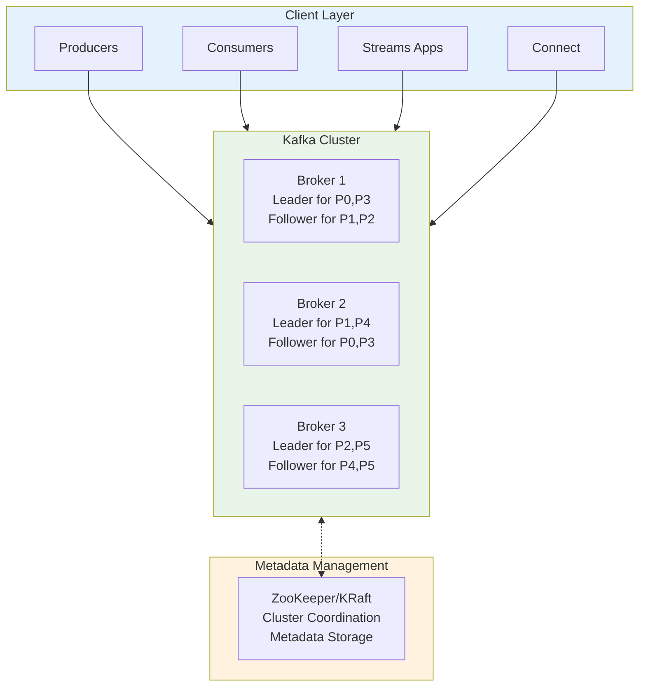
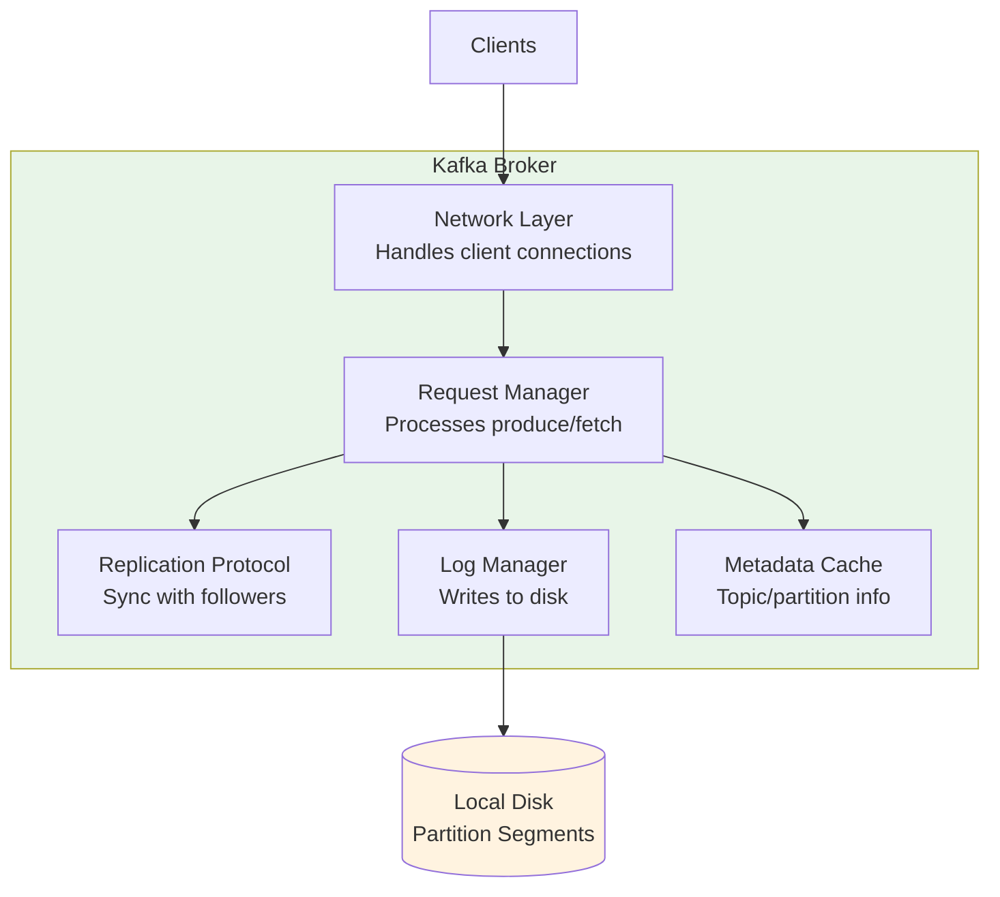
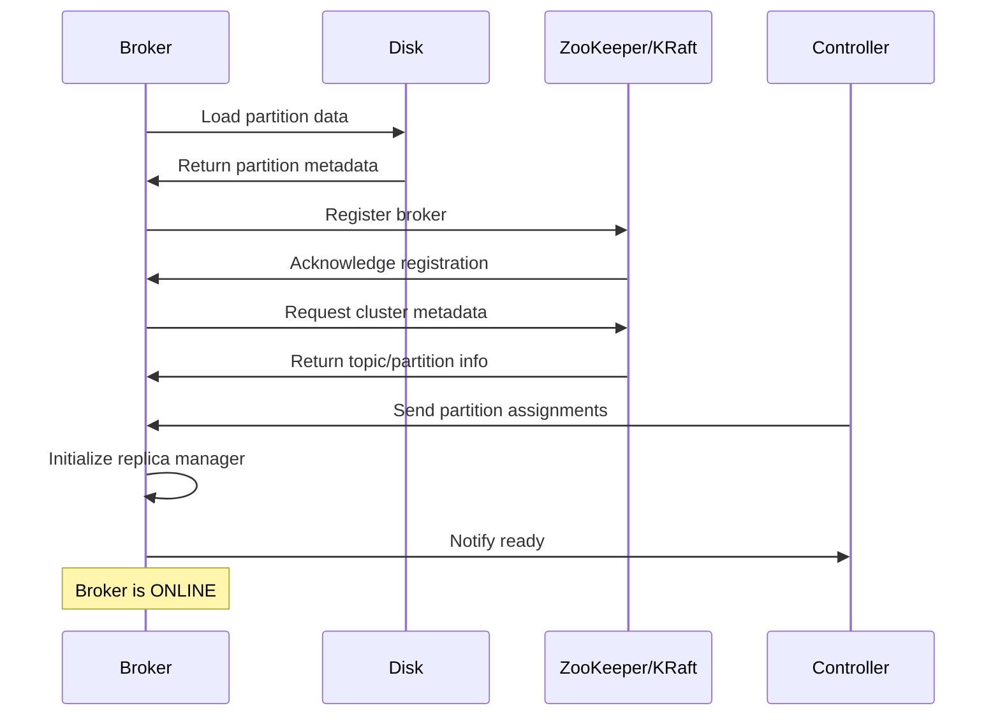
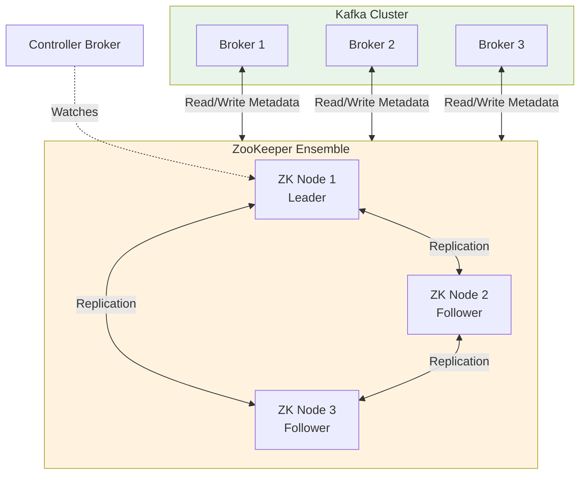
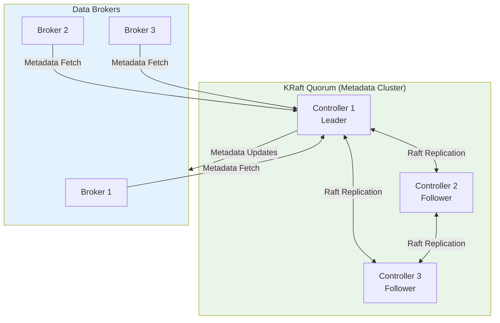
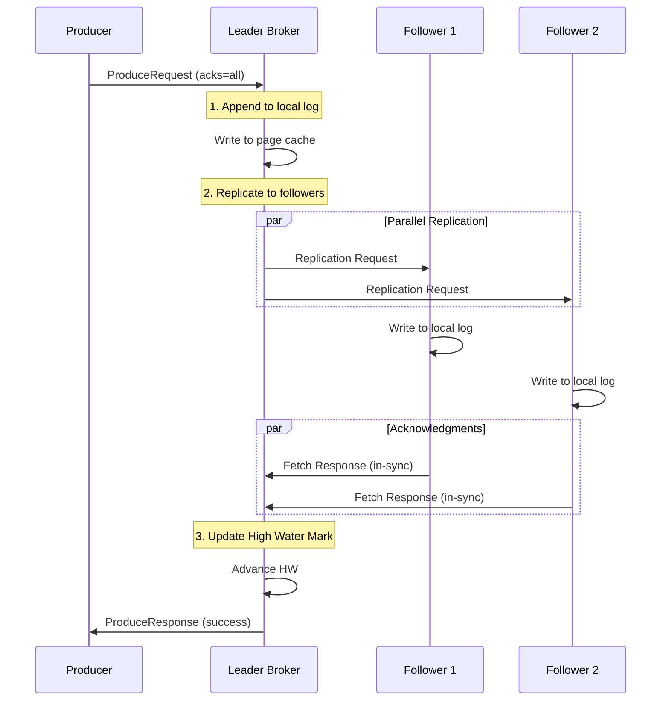
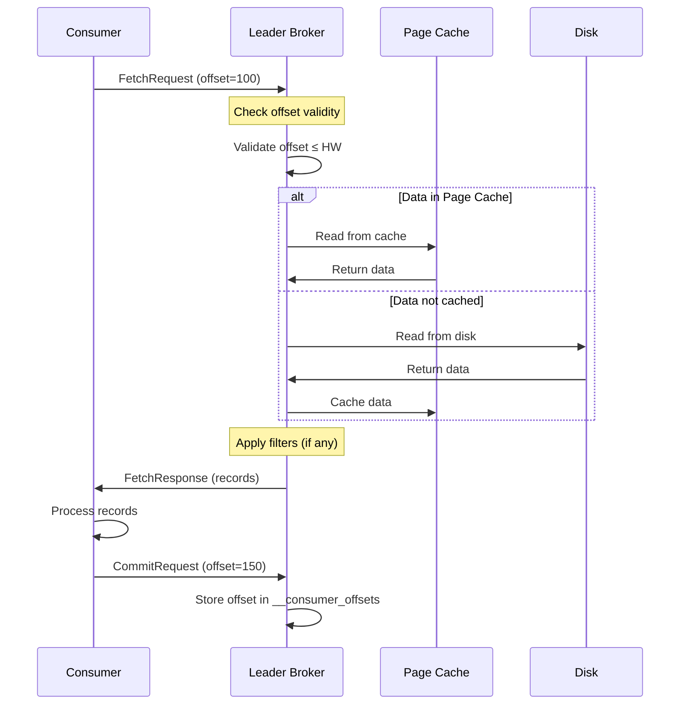
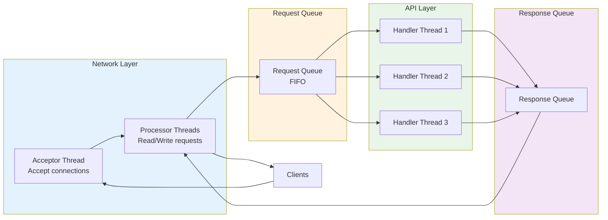
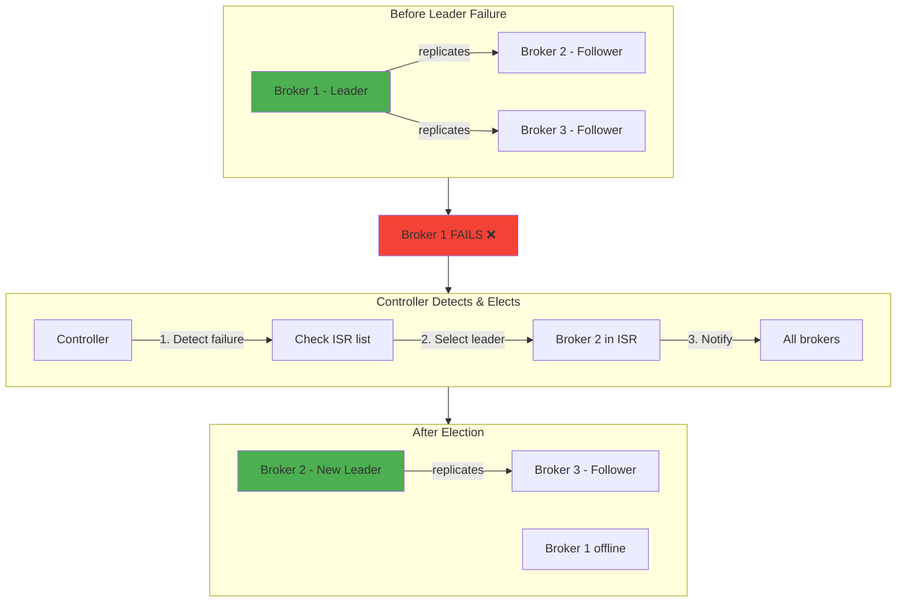
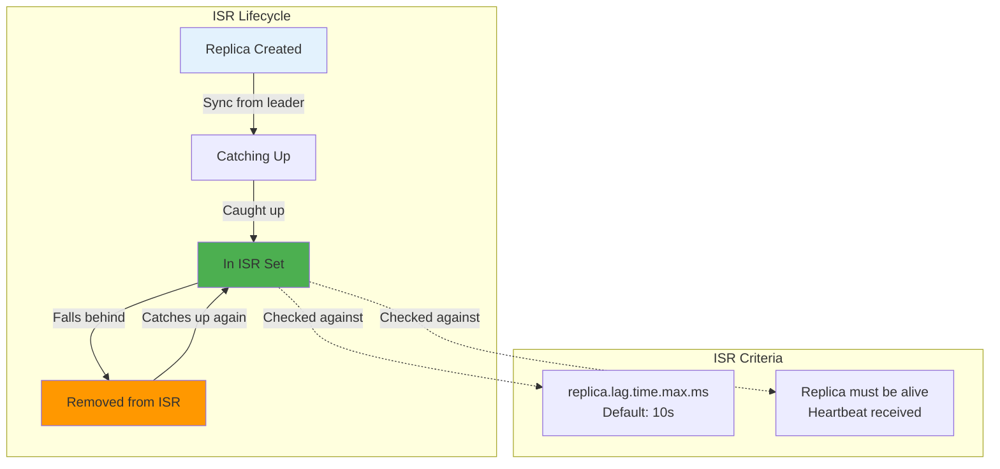

# Kafka Deep Dive - Part 1: Architecture and Fundamental Concepts

This comprehensive series serves as a detailed reference for understanding Apache Kafka's core concepts, internals, and production patterns. Whether you're debugging production issues or designing new systems, this series provides the depth you need.

## Kafka Architecture Overview

At its core, Kafka is a **distributed commit log** that provides a unified, high-throughput, low-latency platform for handling real-time data feeds.

### High-Level Architecture



### Core Components

**Broker**: A Kafka server that stores data and serves clients. Each broker:
- Handles read/write requests
- Manages partition replicas
- Participates in replication protocol
- Stores data on disk

**Cluster**: A group of brokers working together:
- Provides horizontal scalability
- Ensures fault tolerance through replication
- Distributes load across brokers

**Controller**: A special broker elected to manage cluster-wide operations:
- Partition leader election
- Broker failure detection
- Metadata updates

## Brokers: The Workhorses of Kafka

### Broker Responsibilities



### Broker Configuration Anatomy

**Critical Settings**:

```kotlin
// broker.id - Unique identifier for this broker
broker.id=1

// log.dirs - Where partition data is stored
// PITFALL: Never change this without migration plan
log.dirs=/var/kafka-logs-1,/var/kafka-logs-2

// num.network.threads - Handle network requests
// Rule of thumb: num_cores * 2
num.network.threads=8

// num.io.threads - Handle disk I/O
// Rule of thumb: num_disks * 2
num.io.threads=16

// socket.send.buffer.bytes & socket.receive.buffer.bytes
// PITFALL: Too small = poor throughput, too large = memory pressure
socket.send.buffer.bytes=102400  // 100KB
socket.receive.buffer.bytes=102400

// replica.fetch.max.bytes
// PITFALL: Must be larger than max.message.bytes
replica.fetch.max.bytes=1048576  // 1MB
```

**Real-World Example**: E-commerce Platform

```kotlin
// Production broker configuration for high-throughput e-commerce
val brokerConfig = mapOf(
    // Identity
    "broker.id" to "1",
    "broker.rack" to "us-east-1a",  // For rack-aware replica placement

    // Storage - separate disks for better I/O
    "log.dirs" to "/data1/kafka,/data2/kafka,/data3/kafka",

    // Network - tuned for high throughput
    "num.network.threads" to "16",  // 8-core machine
    "num.io.threads" to "12",       // 6 disks

    // Memory
    "socket.send.buffer.bytes" to "1048576",    // 1MB
    "socket.receive.buffer.bytes" to "1048576",

    // Replication
    "replica.fetch.max.bytes" to "10485760",    // 10MB
    "num.replica.fetchers" to "4"               // Parallel fetchers
)
```

### Broker Startup Sequence



**Pitfall: Broker Startup Failures**

```kotlin
// Common startup issues and detection
fun monitorBrokerStartup(brokerId: Int) {
    // Issue 1: Corrupted log segments
    // Symptom: Broker stuck in recovery
    // Solution: Delete corrupted segments (data loss) or restore from replica

    // Issue 2: Out of disk space
    // Symptom: Broker crashes immediately
    checkDiskSpace(minFreeGB = 10)

    // Issue 3: Port already in use
    // Symptom: "Address already in use" error
    checkPortAvailability(port = 9092)

    // Issue 4: ZooKeeper unreachable
    // Symptom: Timeout errors
    // Solution: Verify ZK connectivity before starting
    verifyZooKeeperConnection()
}

fun checkDiskSpace(minFreeGB: Int) {
    val logDirs = listOf("/data1/kafka", "/data2/kafka")
    logDirs.forEach { dir ->
        val freeSpace = getFreeSpaceGB(dir)
        if (freeSpace < minFreeGB) {
            error("Insufficient disk space in $dir: ${freeSpace}GB free")
        }
    }
}
```

## ZooKeeper vs KRaft: Metadata Management

### ZooKeeper Architecture (Legacy)



**ZooKeeper Stores**:
- Broker registration and liveness
- Topic configuration
- Partition assignments
- ACLs (Access Control Lists)
- Controller election

**Pitfalls with ZooKeeper**:

```kotlin
// Common ZooKeeper issues

// PITFALL 1: ZooKeeper session timeout
// Symptoms: Broker drops from cluster, controller re-election
// Impact: Brief unavailability during re-election
val zkSessionTimeout = 18000  // 18 seconds (default 6s is too aggressive)

// PITFALL 2: Too many ZK watchers
// Symptom: ZK performance degradation with large clusters
// Solution: Upgrade to KRaft or tune ZK

// PITFALL 3: ZK split-brain
// Symptom: Two controllers elected simultaneously
// Cause: Network partition between ZK nodes
// Prevention: Proper ZK ensemble sizing (odd number: 3, 5, 7)

// Example: Detecting ZK issues
fun monitorZooKeeperHealth() {
    // Check connection state
    val state = zkClient.state
    if (state != "CONNECTED") {
        alert("ZooKeeper disconnected: $state")
    }

    // Check session expiry
    if (zkClient.sessionTimeout < 10000) {
        warn("ZK session timeout too low: ${zkClient.sessionTimeout}ms")
    }

    // Monitor outstanding requests
    val outstanding = zkClient.outstandingRequests
    if (outstanding > 100) {
        alert("ZK request queue buildup: $outstanding")
    }
}
```

### KRaft Architecture (Modern)

KRaft (Kafka Raft) replaces ZooKeeper with a Kafka-native metadata quorum.



**KRaft Advantages**:

```kotlin
// KRaft Benefits and Configuration

// 1. Simpler Operations
// - No separate ZooKeeper cluster to manage
// - Fewer components to monitor and tune

// 2. Faster Controller Operations
// - Metadata changes propagate faster
// - Quicker partition leader elections

// 3. Better Scalability
// - Support for millions of partitions
// - Linear scalability with cluster size

// KRaft Configuration Example
val kraftConfig = """
    # Server role: broker, controller, or combined
    process.roles=broker,controller

    # Node ID (replaces broker.id)
    node.id=1

    # Controller quorum voters
    controller.quorum.voters=1@localhost:9093,2@host2:9093,3@host3:9093

    # Metadata log directory (separate from data)
    metadata.log.dir=/var/kafka-metadata

    # Listeners
    listeners=PLAINTEXT://localhost:9092,CONTROLLER://localhost:9093
""".trimIndent()
```

**Migration Considerations**:

```kotlin
// Migrating from ZooKeeper to KRaft

fun planZkToKraftMigration() {
    // Phase 1: Upgrade to Kafka 3.3+
    // - KRaft became production-ready in 3.3

    // Phase 2: Setup KRaft controllers
    // - Deploy 3 or 5 controller nodes
    // - Separate from data brokers (recommended)

    // Phase 3: Migration process
    // WARNING: Requires cluster downtime
    // - Snapshot ZK metadata
    // - Load into KRaft
    // - Update broker configs
    // - Restart brokers

    // PITFALL: No in-place migration
    // You cannot convert a running cluster without downtime

    println("""
        Migration Checklist:
        □ Backup all ZooKeeper data
        □ Test migration in staging
        □ Schedule maintenance window
        □ Update monitoring systems
        □ Train team on KRaft operations
    """.trimIndent())
}
```

## Data Flow Architecture

### Write Path (Producer → Broker)



**Key Concepts**:

```kotlin
// Understanding the Write Path

data class WritePathMetrics(
    val appendLatency: Long,      // Time to write to leader's log
    val replicationLatency: Long, // Time for followers to sync
    val ackLatency: Long          // Total time for ack
)

fun explainWritePath() {
    // Step 1: Producer sends batch
    // - Multiple records batched together
    // - Compressed (snappy, lz4, zstd)
    // - Sent to partition leader

    // Step 2: Leader validates and writes
    // - Validates CRC checksum
    // - Assigns offset
    // - Writes to page cache (not disk yet!)

    // Step 3: Replication
    // - Followers fetch from leader
    // - Write to their own logs
    // - Send acknowledgment

    // Step 4: High Water Mark (HW) update
    // - HW = min offset replicated to all ISR
    // - Only messages up to HW are consumable
    // - Critical for consistency!

    // PITFALL: acks=1 vs acks=all
    // acks=1: Leader ack only (fast, but risky)
    // acks=all: All ISR ack (slow, but safe)
}

// Real-world: E-commerce order processing
fun produceOrder(order: Order) {
    val producer = KafkaProducer<String, Order>(
        Properties().apply {
            // CRITICAL: Use acks=all for financial data
            put("acks", "all")

            // PITFALL: Don't set too high or latency suffers
            put("linger.ms", "5")

            // Batch multiple orders together
            put("batch.size", "32768")  // 32KB

            // PITFALL: Too short = message loss on retry
            put("delivery.timeout.ms", "120000")  // 2 minutes
        }
    )

    producer.send(ProducerRecord("orders", order.id, order))
}
```

### Read Path (Consumer ← Broker)



**Zero-Copy Optimization**:

```kotlin
// Kafka's Zero-Copy for Reads

fun explainZeroCopy() {
    // Traditional read path (4 copies):
    // 1. Disk → Kernel buffer
    // 2. Kernel buffer → Application buffer
    // 3. Application buffer → Socket buffer
    // 4. Socket buffer → NIC

    // Kafka's sendfile() syscall (0 copies):
    // Disk → Kernel buffer → NIC
    // - No copying to/from application space
    // - Massive performance improvement

    // PITFALL: Zero-copy doesn't work with SSL/TLS
    // When encryption is enabled:
    // - Data must be copied to user space for encryption
    // - Performance impact: ~30-50% slower

    println("""
        Zero-Copy Performance:
        - 1M msg/sec with zero-copy
        - 600K msg/sec with SSL (same hardware)
    """.trimIndent())
}

// Real-world: Analytics pipeline
fun consumeClickstream() {
    val consumer = KafkaConsumer<String, ClickEvent>(
        Properties().apply {
            // Fetch in large batches for analytics
            put("fetch.min.bytes", "1048576")  // 1MB
            put("fetch.max.wait.ms", "500")    // Wait up to 500ms

            // PITFALL: Too large = OOM errors
            put("max.partition.fetch.bytes", "10485760")  // 10MB

            // For analytics, read_committed not necessary
            put("isolation.level", "read_uncommitted")
        }
    )

    consumer.subscribe(listOf("clickstream"))

    while (true) {
        val records = consumer.poll(Duration.ofMillis(100))
        // Process large batches efficiently
        processClickBatch(records)
    }
}
```

## Request Processing Pipeline

### Request Lifecycle



**Request Types and Priorities**:

```kotlin
// Kafka Request Types (by priority)

enum class RequestType(val priority: Int) {
    // Priority 0: Controller requests (highest)
    CONTROLLED_SHUTDOWN(0),
    LEADER_AND_ISR(0),
    STOP_REPLICA(0),
    UPDATE_METADATA(0),

    // Priority 1: Client requests
    PRODUCE(1),
    FETCH(1),
    LIST_OFFSETS(1),

    // Priority 2: Metadata requests
    METADATA(2),
    FIND_COORDINATOR(2),

    // Priority 3: Group coordination
    JOIN_GROUP(3),
    HEARTBEAT(3),
    LEAVE_GROUP(3),
    SYNC_GROUP(3)
}

// PITFALL: Request timeout configuration
fun configureRequestTimeouts() {
    // Producer
    val producerTimeouts = mapOf(
        "request.timeout.ms" to "30000",     // How long to wait for response
        "delivery.timeout.ms" to "120000",   // Total time including retries

        // PITFALL: delivery.timeout < request.timeout
        // Will cause early failures
        // Must satisfy: delivery.timeout >= linger.ms + request.timeout
    )

    // Consumer
    val consumerTimeouts = mapOf(
        "request.timeout.ms" to "30000",
        "session.timeout.ms" to "45000",     // How long before kicked from group
        "max.poll.interval.ms" to "300000",  // 5 min between polls

        // PITFALL: session.timeout.ms too low
        // Cause: Frequent rebalances
        // Effect: Processing interruptions
    )
}
```

## Cluster Coordination Patterns

### Leader Election



**Election Process Deep Dive**:

```kotlin
// Understanding Leader Election

data class Replica(
    val brokerId: Int,
    val logEndOffset: Long,  // Last offset in log
    val isr: Boolean         // In-sync replica?
)

fun simulateLeaderElection(
    replicas: List<Replica>,
    currentLeader: Int
) {
    println("Current leader: Broker $currentLeader FAILED")

    // Step 1: Controller detects failure
    // - Via ZooKeeper session timeout (ZK mode)
    // - Via heartbeat timeout (KRaft mode)

    // Step 2: Filter eligible replicas
    val eligible = replicas.filter { it.isr && it.brokerId != currentLeader }

    if (eligible.isEmpty()) {
        // CRITICAL SITUATION: No ISR available
        println("⚠️ NO ISR AVAILABLE")

        // Option 1: Wait for ISR to recover (data safe)
        println("Waiting for ISR recovery...")

        // Option 2: Unclean leader election (DANGEROUS)
        // Set unclean.leader.election.enable=true
        println("⚠️ Consider unclean election? (DATA LOSS RISK)")
        handleUncleanElection(replicas)
        return
    }

    // Step 3: Select new leader (first ISR replica)
    val newLeader = eligible.maxByOrNull { it.logEndOffset }!!

    println("✓ New leader elected: Broker ${newLeader.brokerId}")
    println("  Log end offset: ${newLeader.logEndOffset}")

    // Step 4: Controller updates metadata
    // Step 5: All brokers notified via LeaderAndIsrRequest
}

// PITFALL: Unclean leader election
fun handleUncleanElection(replicas: List<Replica>) {
    println("""
        ⚠️  UNCLEAN LEADER ELECTION

        What happens:
        - Out-of-sync replica becomes leader
        - Messages not replicated to it are LOST
        - Data divergence between replicas

        When to allow:
        ✓ Availability > Consistency (rare)
        ✓ Data loss acceptable (logs, metrics)

        When to NEVER allow:
        ✗ Financial transactions
        ✗ User data
        ✗ Critical business data

        Configuration:
        unclean.leader.election.enable=false (RECOMMENDED)
    """.trimIndent())
}
```

### ISR (In-Sync Replicas) Management



**ISR Management Code**:

```kotlin
// ISR Monitoring and Management

data class ISRStatus(
    val partition: Int,
    val leader: Int,
    val isr: Set<Int>,
    val replicas: Set<Int>
)

fun monitorISR(status: ISRStatus) {
    val isrCount = status.isr.size
    val replicaCount = status.replicas.size

    when {
        isrCount == 1 -> {
            // CRITICAL: Only leader in ISR
            alert("""
                ⚠️  CRITICAL: Partition ${status.partition} has single ISR
                Leader: ${status.leader}
                Risk: No redundancy, data loss on leader failure
                Action: Investigate why followers are out of sync
            """.trimIndent())
        }

        isrCount < replicaCount / 2 -> {
            // WARNING: Majority of replicas out of sync
            warn("""
                ⚠️  WARNING: Partition ${status.partition} ISR degraded
                ISR: ${status.isr.size}/${status.replicas.size}
                Action: Check follower lag and network
            """.trimIndent())
        }

        isrCount < replicaCount -> {
            // INFO: Some replicas out of sync
            info("Partition ${status.partition}: ${status.isr.size}/${status.replicas.size} in ISR")
        }
    }
}

// PITFALL: replica.lag.time.max.ms tuning
fun tuneISRParameters() {
    println("""
        replica.lag.time.max.ms Configuration:

        Too Low (e.g., 1000ms):
        - Replicas removed from ISR frequently
        - Causes unnecessary re-replication
        - Impacts during network hiccups

        Too High (e.g., 60000ms):
        - Slow to detect actual failures
        - Risk of data loss if leader fails
        - Impacts availability

        Recommended: 10000ms (10 seconds)

        Factors to consider:
        - Network latency between brokers
        - Disk I/O performance
        - Replication throughput requirements
        - Broker load (CPU, disk)
    """.trimIndent())
}

// Real-world: Monitoring ISR shrinkage
fun detectISRShrinkage(topic: String, partition: Int) {
    val historicalISR = getHistoricalISR(topic, partition)
    val currentISR = getCurrentISR(topic, partition)

    if (currentISR.size < historicalISR.size) {
        val removed = historicalISR - currentISR

        alert("""
            ISR shrinkage detected:
            Topic: $topic
            Partition: $partition
            Removed replicas: $removed

            Possible causes:
            1. Slow follower (disk I/O bottleneck)
            2. Network issues between leader and follower
            3. Follower broker overloaded
            4. GC pauses on follower

            Investigate:
            - Check follower broker metrics
            - Review broker logs for errors
            - Verify network connectivity
        """.trimIndent())
    }
}
```

## Key Takeaways

- **Brokers** are the fundamental unit of Kafka, handling storage and serving clients
- **Controller** manages cluster-wide operations like partition leadership
- **ZooKeeper vs KRaft**: KRaft is the future, simpler and more scalable
- **Write path** involves leader append, replication, and HW update
- **Read path** leverages zero-copy for performance (except with SSL)
- **Leader election** maintains availability during failures, but understand unclean election risks
- **ISR management** is critical for balancing availability and durability

**Critical Pitfalls**:
- ⚠️ Never set `unclean.leader.election.enable=true` for critical data
- ⚠️ Monitor ISR size - single ISR means no redundancy
- ⚠️ Tune `replica.lag.time.max.ms` based on your environment
- ⚠️ ZooKeeper session timeouts too low cause instability
- ⚠️ SSL/TLS disables zero-copy optimization

## What's Next

In Part 2, we'll dive deep into Topics, Partitions, and Replication - understanding partition assignment strategies, replication protocols, min.insync.replicas, and how to design partition schemes for optimal performance and scalability.
