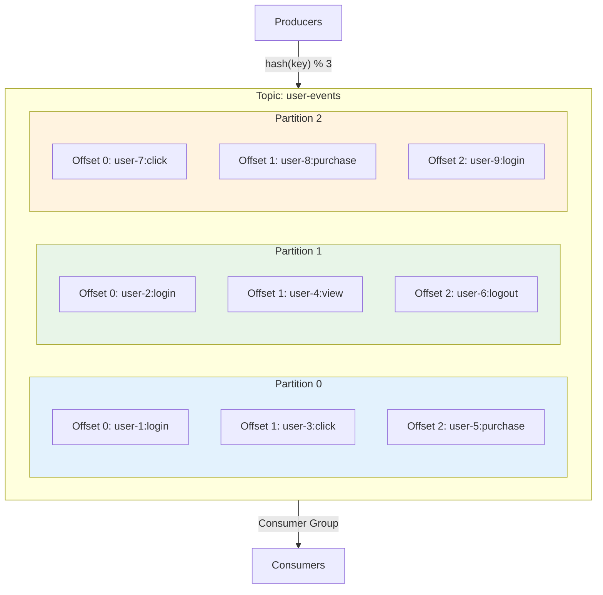
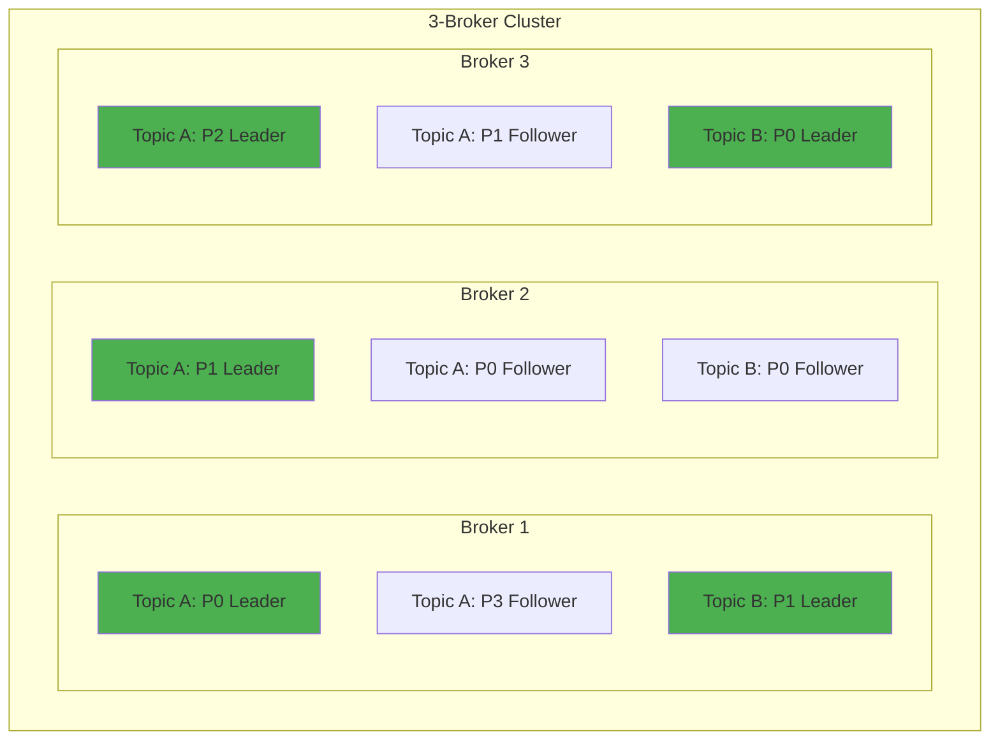
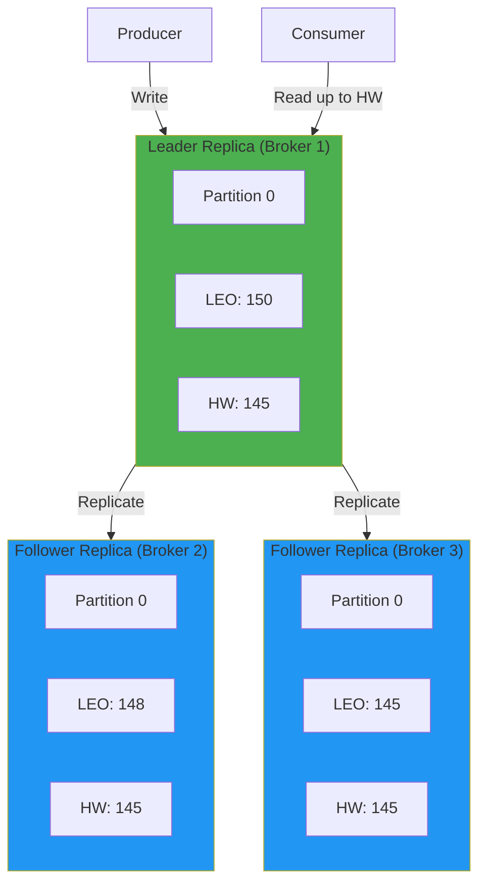
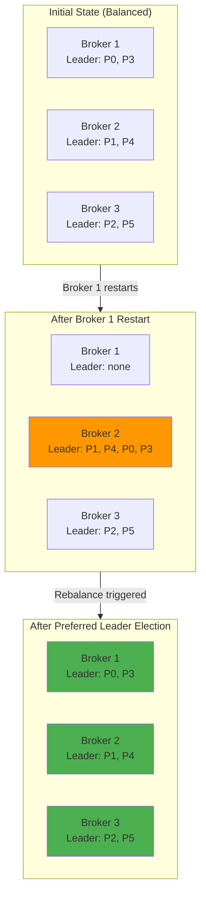

# Kafka Deep Dive - Part 2: Topics, Partitions, and Replication

Understanding how Kafka organizes and replicates data is fundamental to building reliable, scalable systems. This tutorial provides deep insights into topics, partitions, replication mechanics, and design patterns.

## Topics: Logical Data Organization

A **topic** is a category or feed name to which records are published. Topics are the fundamental abstraction in Kafka.

### Topic Anatomy



### Topic Configuration Deep Dive

```kotlin
// Critical topic configurations

data class TopicConfig(
    // Retention settings
    val retentionMs: Long = 604800000,      // 7 days (default)
    val retentionBytes: Long = -1,           // Unlimited (default)

    // Cleanup policy
    val cleanupPolicy: String = "delete",    // or "compact" or "delete,compact"

    // Segment settings
    val segmentMs: Long = 604800000,        // 7 days
    val segmentBytes: Long = 1073741824,    // 1GB

    // Replication
    val replicationFactor: Short = 3,
    val minInsyncReplicas: Int = 2,

    // Performance
    val compressionType: String = "producer", // inherit from producer
    val maxMessageBytes: Int = 1048588,      // ~1MB

    // Compaction (if cleanup.policy=compact)
    val minCleanableDirtyRatio: Double = 0.5,
    val deleteRetentionMs: Long = 86400000   // 24 hours
)

// PITFALL: Retention configuration interactions
fun explainRetentionPitfalls() {
    println("""
        Retention Pitfall #1: Time vs Size
        ===================================
        retention.ms=86400000 (1 day)
        retention.bytes=1GB

        What happens?
        - Deletion occurs when EITHER limit is reached
        - If throughput is high, size limit hit first
        - If throughput is low, time limit hit first

        Example:
        - 1TB/day throughput = deleted after ~24MB (not 1 day!)
        - 1MB/day throughput = deleted after 1 day (size never hit)

        Solution: Set both carefully or use only one


        Retention Pitfall #2: Segment rollover
        =======================================
        retention.ms=86400000 (1 day)
        segment.ms=604800000 (7 days)

        What happens?
        - Segments deleted as a UNIT (can't delete part of segment)
        - Data retained for up to 8 days (7 days segment + 1 day retention)

        Rule: segment.ms should be LESS than retention.ms


        Retention Pitfall #3: Compacted topics
        =======================================
        cleanup.policy=compact
        min.cleanable.dirty.ratio=0.5

        What happens?
        - Compaction doesn't run until 50% of data is "dirty"
        - Can consume significant disk space before cleanup
        - Older data retained longer than expected

        For aggressive compaction: min.cleanable.dirty.ratio=0.1
    """.trimIndent())
}
```

### Topic Naming Conventions

```kotlin
// Recommended topic naming patterns

object TopicNamingConventions {

    // Pattern 1: Domain-driven
    // Format: <domain>.<entity>.<event-type>
    val orderingTopics = listOf(
        "orders.order.created",
        "orders.order.updated",
        "orders.order.cancelled",
        "orders.payment.processed",
        "orders.shipment.dispatched"
    )

    // Pattern 2: Data pipeline
    // Format: <source>.<dataset>.<environment>
    val pipelineTopics = listOf(
        "mysql.users.prod",
        "postgres.transactions.prod",
        "mongodb.products.staging"
    )

    // Pattern 3: Stream processing
    // Format: <app>.<processing-stage>
    val streamTopics = listOf(
        "analytics.raw-events",
        "analytics.enriched-events",
        "analytics.aggregated-metrics"
    )

    // PITFALL: Avoid these patterns
    val badTopicNames = listOf(
        "test",                    // Too generic
        "user_events",             // Inconsistent naming (use hyphens)
        "MySpecialTopic",          // CamelCase (use lowercase)
        "events-2024-01-01",       // Date-based (use partitioning instead)
        "topic.with.too.many.dots" // Overly complex hierarchy
    )

    // Topic naming rules
    fun validateTopicName(name: String): List<String> {
        val issues = mutableListOf<String>()

        if (name.length > 249) {
            issues.add("Name too long (max 249 characters)")
        }

        if (!name.matches(Regex("[a-z0-9._-]+"))) {
            issues.add("Use only lowercase, numbers, dots, hyphens, underscores")
        }

        if (name.contains("..")) {
            issues.add("Avoid consecutive dots")
        }

        // Reserved names
        if (name.startsWith("__")) {
            issues.add("Names starting with __ are reserved (e.g., __consumer_offsets)")
        }

        return issues
    }
}
```

## Partitions: The Unit of Parallelism

Partitions are the fundamental unit of parallelism and scalability in Kafka.

### Partition Distribution



### Partition Count: The Critical Decision

```kotlin
// How to determine partition count

data class PartitionRequirements(
    val targetThroughputMBps: Int,       // Required throughput
    val partitionThroughputMBps: Int,    // Per-partition capacity
    val consumerParallelism: Int,        // Number of consumers
    val futureGrowth: Double = 1.5       // Growth factor
)

fun calculatePartitionCount(req: PartitionRequirements): Int {
    // Method 1: Based on throughput
    val throughputPartitions =
        (req.targetThroughputMBps / req.partitionThroughputMBps.toDouble()).toInt()

    // Method 2: Based on consumer parallelism
    val consumerPartitions = req.consumerParallelism

    // Take maximum and apply growth factor
    val basePartitions = maxOf(throughputPartitions, consumerPartitions)
    val recommended = (basePartitions * req.futureGrowth).toInt()

    println("""
        Partition Count Calculation:
        ============================
        Target throughput: ${req.targetThroughputMBps} MB/s
        Per-partition capacity: ${req.partitionThroughputMBps} MB/s
        Consumer parallelism: ${req.consumerParallelism}

        Throughput-based: $throughputPartitions partitions
        Consumer-based: $consumerPartitions partitions
        With growth factor (${req.futureGrowth}x): $recommended partitions

        Recommendation: $recommended partitions
    """.trimIndent())

    return recommended
}

// Real-world example: E-commerce orders
fun designOrderTopicPartitions() {
    val requirements = PartitionRequirements(
        targetThroughputMBps = 100,          // 100 MB/s at peak
        partitionThroughputMBps = 10,        // Measured capacity
        consumerParallelism = 12,            // 12 order processors
        futureGrowth = 2.0                   // Expect 2x growth
    )

    val partitions = calculatePartitionCount(requirements)

    println("""
        Order Topic Design:
        Topic: orders
        Partitions: $partitions
        Replication factor: 3
        Min ISR: 2

        Expected performance:
        - Max throughput: ${partitions * 10} MB/s
        - Max consumers: $partitions (one per partition)
        - Growth capacity: 2x current requirements
    """.trimIndent())
}

// PITFALL: Too many partitions
fun warnAboutTooManyPartitions() {
    println("""
        ⚠️  TOO MANY PARTITIONS PITFALL

        Problems with excessive partitions (e.g., 1000s per topic):

        1. Increased Leader Election Time
           - Controller iterates all partitions
           - Cluster unavailability during failover
           - Can take minutes for 100k+ partitions

        2. Memory Overhead
           - Each partition = file handles
           - Each partition = producer/consumer buffers
           - Broker memory pressure

        3. Replication Lag
           - More partitions = more replication threads
           - Thread contention and context switching
           - Slower replication overall

        4. Consumer Rebalancing
           - Longer rebalance times with many partitions
           - Application unavailability during rebalance

        Guidelines:
        - Per broker: < 4000 partitions (leaders + followers)
        - Per cluster: < 200,000 total partitions
        - Per topic: < 100 partitions (for most use cases)

        Solution: Use fewer, larger partitions when possible
    """.trimIndent())
}

// PITFALL: Too few partitions
fun warnAboutTooFewPartitions() {
    println("""
        ⚠️  TOO FEW PARTITIONS PITFALL

        Problems with too few partitions (e.g., 1-3):

        1. Limited Parallelism
           - Max consumers = partition count
           - Can't scale consumer processing
           - Bottleneck on single partition

        2. Poor Load Distribution
           - Hot partitions with skewed keys
           - Some brokers idle, others overloaded

        3. No Elasticity
           - Can't add partitions later without re-partitioning
           - Adding partitions breaks key ordering guarantee

        Example: 1 partition for high-traffic topic
        - Only 1 consumer can process
        - All data on 1 broker (leader)
        - No parallelism, single point of bottleneck

        Rule of Thumb:
        - Start with: max(10, expected_peak_consumers)
        - For high traffic: 30-50 partitions
        - Can always consume with fewer consumers than partitions
        - Cannot easily add partitions later
    """.trimIndent())
}
```

### Partition Assignment Strategies

```kotlin
// How records are assigned to partitions

interface PartitionStrategy {
    fun selectPartition(key: String?, value: String, partitionCount: Int): Int
}

// Strategy 1: Default (hash-based)
class DefaultPartitioner : PartitionStrategy {
    override fun selectPartition(key: String?, value: String, partitionCount: Int): Int {
        return if (key != null) {
            // Hash key and modulo partition count
            Math.abs(key.hashCode()) % partitionCount
        } else {
            // Round-robin for null keys (sticky partitioning in newer versions)
            // Simplified for illustration
            (Math.random() * partitionCount).toInt()
        }
    }

    fun explain() {
        println("""
            Default Partitioner Behavior:
            ==============================

            With Key:
            - partition = abs(hash(key)) % partition_count
            - Same key → same partition (ordering preserved)
            - Keys distributed evenly (usually)

            Without Key (null):
            - Kafka 2.4+: Sticky partitioning
              * Batches stick to one partition until full
              * Better batching and throughput
            - Kafka < 2.4: Round-robin
              * Each record to next partition
              * Poor batching

            PITFALL: Hash function changes
            - Partition count change breaks key → partition mapping
            - Never change partition count for keyed topics!
        """.trimIndent())
    }
}

// Strategy 2: Custom partitioner for user sharding
class UserShardPartitioner : PartitionStrategy {
    // Shard users by user ID ranges for co-location
    private val shardRanges = listOf(
        0..999,
        1000..1999,
        2000..2999,
        3000..3999
    )

    override fun selectPartition(key: String?, value: String, partitionCount: Int): Int {
        if (key == null) return 0

        // Extract user ID from key (e.g., "user-1234")
        val userId = key.substringAfter("user-").toIntOrNull() ?: 0

        // Find shard
        val shard = shardRanges.indexOfFirst { userId in it }
        return if (shard >= 0) shard else 0
    }

    fun realWorldUseCase() {
        println("""
            Use Case: User Activity Tracking
            =================================

            Requirement:
            - All events for a user should be in same partition
            - User data co-located for efficient stream joins
            - User 0-999 in partition 0, 1000-1999 in partition 1, etc.

            Benefits:
            - Predictable partition assignment
            - Efficient user-level aggregations
            - Simplified stream processing

            Implementation:
            ```kotlin
            val partitioner = UserShardPartitioner()
            val partition = partitioner.selectPartition(
                key = "user-1234",
                value = "login event",
                partitionCount = 4
            )
            // partition = 1 (user 1234 in range 1000-1999)
            ```
        """.trimIndent())
    }
}

// Strategy 3: Geographic partitioner
class GeographicPartitioner : PartitionStrategy {
    private val regionPartitions = mapOf(
        "us-east" to 0,
        "us-west" to 1,
        "eu-west" to 2,
        "ap-south" to 3
    )

    override fun selectPartition(key: String?, value: String, partitionCount: Int): Int {
        // Extract region from key (e.g., "us-east:user-123")
        val region = key?.substringBefore(":")

        return regionPartitions[region] ?: 0
    }

    fun realWorldUseCase() {
        println("""
            Use Case: Geo-Distributed Applications
            =======================================

            Requirement:
            - Data locality for compliance (GDPR)
            - Reduced latency (process data near origin)
            - Regional consumer groups

            Benefits:
            - EU data stays in EU partitions
            - US consumers only process US data
            - Simplified compliance and auditing

            Example:
            ```kotlin
            // EU user event → Partition 2
            producer.send(ProducerRecord(
                "user-events",
                "eu-west:user-456",
                "purchase"
            ))

            // EU consumer group processes only partition 2
            consumer.assign(listOf(TopicPartition("user-events", 2)))
            ```
        """.trimIndent())
    }
}

// PITFALL: Skewed partition distribution
fun detectPartitionSkew(partitionSizes: Map<Int, Long>) {
    val avgSize = partitionSizes.values.average()
    val skewedPartitions = partitionSizes.filter { (partition, size) ->
        size > avgSize * 1.5  // 50% larger than average
    }

    if (skewedPartitions.isNotEmpty()) {
        println("""
            ⚠️  PARTITION SKEW DETECTED

            Average partition size: ${avgSize / 1_000_000} MB
            Skewed partitions: ${skewedPartitions.map { (p, size) ->
                "P$p: ${size / 1_000_000}MB (${((size / avgSize - 1) * 100).toInt()}% larger)"
            }}

            Causes:
            1. Poor key distribution (few keys dominate)
            2. Custom partitioner not balanced
            3. Temporal patterns (e.g., all Monday data to one partition)

            Solutions:
            1. Add salt to keys: "user-123" → "user-123-{random}"
            2. Use composite keys: "region:user-id"
            3. Review custom partitioner logic
            4. Consider time-based partitioning
        """.trimIndent())
    }
}
```

## Replication: Ensuring Durability

Replication is how Kafka ensures data durability and availability.

### Replication Architecture



**Key Concepts**:
- **LEO (Log End Offset)**: The offset of the last message written to a replica
- **HW (High Water Mark)**: The minimum LEO across all ISR replicas (consumer-visible)

### Understanding High Water Mark

```kotlin
// High Water Mark explained

data class ReplicaState(
    val brokerId: Int,
    val leo: Long,  // Log End Offset
    val isISR: Boolean
)

fun calculateHighWaterMark(replicas: List<ReplicaState>): Long {
    // HW = minimum LEO of all ISR replicas
    val isrReplicas = replicas.filter { it.isISR }

    if (isrReplicas.isEmpty()) {
        println("⚠️  WARNING: No ISR replicas!")
        return -1
    }

    val hw = isrReplicas.minOf { it.leo }

    println("""
        High Water Mark Calculation:
        ============================
        ${replicas.joinToString("\n") {
            "Broker ${it.brokerId}: LEO=${it.leo}, ISR=${it.isISR}"
        }}

        High Water Mark: $hw

        Explanation:
        - Only messages up to offset $hw are visible to consumers
        - Messages from ${hw + 1} onward exist but are not consumable
        - Ensures consumers only see fully replicated data
    """.trimIndent())

    return hw
}

// Example scenario
fun demonstrateHWScenario() {
    val replicas = listOf(
        ReplicaState(brokerId = 1, leo = 150, isISR = true),  // Leader
        ReplicaState(brokerId = 2, leo = 148, isISR = true),  // Follower catching up
        ReplicaState(brokerId = 3, leo = 145, isISR = true),  // Slower follower
        ReplicaState(brokerId = 4, leo = 100, isISR = false)  // Out of sync
    )

    val hw = calculateHighWaterMark(replicas)

    println("""

        Consumer View:
        - Can read offsets 0 to $hw
        - Cannot read offsets ${hw + 1} to 150 (not fully replicated)

        If Broker 1 (leader) fails now:
        - Broker 2 or 3 can become leader (both in ISR)
        - No data loss (all data up to HW is safe)
        - Offsets 146-150 on Broker 1 would be lost (not in HW)
    """.trimIndent())
}

// PITFALL: High Water Mark lag
fun detectHWLag(leader: ReplicaState, hw: Long) {
    val uncommittedMessages = leader.leo - hw

    if (uncommittedMessages > 1000) {
        println("""
            ⚠️  HIGH WATER MARK LAG DETECTED

            Leader LEO: ${leader.leo}
            High Water Mark: $hw
            Uncommitted messages: $uncommittedMessages

            Implications:
            1. Consumers delayed (can't read latest data)
            2. Risk of data loss if leader fails
            3. Followers falling behind

            Causes:
            - Slow followers (I/O bottleneck)
            - Network issues
            - Follower broker overload

            Actions:
            - Check follower fetch lag
            - Inspect follower broker metrics (disk, CPU)
            - Consider replica.fetch.max.bytes tuning
        """.trimIndent())
    }
}
```

### min.insync.replicas: The Safety Net

```kotlin
// Understanding min.insync.replicas

fun explainMinInsyncReplicas() {
    println("""
        min.insync.replicas (min ISR)
        =============================

        Purpose:
        - Minimum replicas that must acknowledge a write
        - Works with acks=all
        - Safety vs availability tradeoff

        Configuration Patterns:
        =======================

        Pattern 1: Maximum Safety
        - replication.factor = 3
        - min.insync.replicas = 3
        - acks = all

        Behavior:
        ✓ All 3 replicas must ack
        ✗ If any replica down, writes FAIL
        Use case: Critical financial data

        Pattern 2: Balanced (RECOMMENDED)
        - replication.factor = 3
        - min.insync.replicas = 2
        - acks = all

        Behavior:
        ✓ Leader + 1 follower must ack
        ✓ Tolerates 1 replica failure
        ✗ If 2 replicas down, writes FAIL
        Use case: Most production systems

        Pattern 3: High Availability
        - replication.factor = 3
        - min.insync.replicas = 1
        - acks = all

        Behavior:
        ✓ Only leader must ack
        ✓ Tolerates 2 replica failures
        ⚠️  Risk: Data loss if leader fails before replication
        Use case: Logs, metrics (lossy acceptable)

        Pattern 4: DANGEROUS (avoid!)
        - replication.factor = 1
        - min.insync.replicas = 1
        - acks = 1

        Behavior:
        ⚠️  Single point of failure
        ⚠️  Data loss on broker failure
        Use case: Only for testing/development
    """.trimIndent())
}

// Real-world: E-commerce configuration
fun ecommerceTopicConfig() {
    val configs = mapOf(
        "orders" to TopicSafetyConfig(
            replicationFactor = 3,
            minISR = 2,
            acks = "all",
            rationale = "Financial data - cannot lose orders"
        ),
        "clickstream" to TopicSafetyConfig(
            replicationFactor = 3,
            minISR = 1,
            acks = "1",
            rationale = "Analytics data - some loss acceptable for speed"
        ),
        "inventory" to TopicSafetyConfig(
            replicationFactor = 3,
            minISR = 2,
            acks = "all",
            rationale = "Stock levels - critical for business operations"
        ),
        "recommendations" to TopicSafetyConfig(
            replicationFactor = 2,
            minISR = 1,
            acks = "1",
            rationale = "ML-generated - can regenerate if lost"
        )
    )

    configs.forEach { (topic, config) ->
        println("""
            Topic: $topic
            RF: ${config.replicationFactor}, min ISR: ${config.minISR}, acks: ${config.acks}
            Rationale: ${config.rationale}
        """.trimIndent())
    }
}

data class TopicSafetyConfig(
    val replicationFactor: Int,
    val minISR: Int,
    val acks: String,
    val rationale: String
)

// PITFALL: min ISR violations
fun handleMinISRViolation(topic: String, partition: Int, currentISR: Int, minISR: Int) {
    if (currentISR < minISR) {
        println("""
            ⚠️  MIN ISR VIOLATION

            Topic: $topic
            Partition: $partition
            Current ISR count: $currentISR
            Required min ISR: $minISR

            Impact:
            - Writes with acks=all will FAIL
            - Error: NotEnoughReplicasException
            - Topic becomes read-only until ISR recovers

            Immediate Actions:
            1. Check broker health (are followers down?)
            2. Check network connectivity
            3. Review replica lag metrics
            4. Consider temporary minISR reduction (risky!)

            Prevention:
            - Monitor ISR count continuously
            - Alert before violation occurs
            - Ensure replication.factor > minISR (headroom)
            - Typical: RF=3, minISR=2 (can lose 1 replica)
        """.trimIndent())
    }
}
```

### Replication Protocol Deep Dive

```mermaid
sequenceDiagram
    participant P as Producer
    participant L as Leader
    participant F1 as Follower 1
    participant F2 as Follower 2

    Note over P,F2: acks=all, min.insync.replicas=2

    P->>L: ProduceRequest (batch of records)

    Note over L: 1. Validate
    L->>L: Check CRC, quotas

    Note over L: 2. Write locally
    L->>L: Append to log (LEO: 99→105)

    Note over F1,F2: 3. Followers fetch (pull model)
    F1->>L: FetchRequest (offset 99)
    F2->>L: FetchRequest (offset 99)

    L->>F1: FetchResponse (records 99-105)
    L->>F2: FetchResponse (records 99-105)

    Note over F1: Write to local log
    F1->>F1: Append (LEO: 99→105)

    Note over F2: Write to local log
    F2->>F2: Append (LEO: 99→105)

    Note over F1,F2: 4. Next fetch confirms write
    F1->>L: FetchRequest (offset 105)
    F2->>L: FetchRequest (offset 105)

    Note over L: 5. Update HW
    L->>L: HW = min(105, 105, 105) = 105

    Note over L: 6. Ack producer
    L->>P: ProduceResponse (success)
```



```kotlin
// Replication protocol insights

fun explainReplicationProtocol() {
    println("""
        Kafka Replication Protocol
        ==========================

        Key Insight: PULL model (not push)
        - Followers pull from leader
        - Leader doesn't track followers
        - Simpler, more scalable

        Step-by-Step:
        =============

        1. Producer writes to leader
           - Leader assigns offsets
           - Appends to local log
           - Updates LEO (Log End Offset)

        2. Followers fetch from leader
           - Continuous polling (replica.fetch.wait.max.ms)
           - Fetch from their current offset
           - Write to local log

        3. Followers acknowledge via next fetch
           - FetchRequest for offset X means: "I have up to offset X-1"
           - Leader infers follower progress

        4. Leader updates High Water Mark
           - HW = minimum LEO of all ISR
           - Consumers can read up to HW

        5. Leader responds to producer
           - If acks=all: wait for min ISR to fetch
           - If acks=1: respond immediately

        PITFALL: Follower fetch delay
        ==============================
        replica.fetch.wait.max.ms = 500 (default)

        - Followers wait up to 500ms before fetching
        - Reduces network calls but increases lag
        - Trade-off: latency vs network efficiency

        For low latency: replica.fetch.wait.max.ms = 50
        For high throughput: replica.fetch.wait.max.ms = 500
    """.trimIndent())
}

// Monitoring replication lag
fun monitorReplicationLag(
    leader: ReplicaState,
    followers: List<ReplicaState>
) {
    followers.forEach { follower ->
        val lag = leader.leo - follower.leo

        when {
            lag > 10000 -> {
                println("""
                    🔴 CRITICAL: Follower ${follower.brokerId} severely behind
                    Lag: $lag messages
                    Risk: May be removed from ISR soon
                    Action: Investigate follower broker immediately
                """.trimIndent())
            }

            lag > 1000 -> {
                println("""
                    ⚠️  WARNING: Follower ${follower.brokerId} lagging
                    Lag: $lag messages
                    Action: Monitor closely, check broker metrics
                """.trimIndent())
            }

            lag > 100 -> {
                println("""
                    ℹ️  INFO: Minor lag on follower ${follower.brokerId}
                    Lag: $lag messages (normal variation)
                """.trimIndent())
            }
        }
    }
}
```

## Partition Leadership and Preferred Leaders



```kotlin
// Preferred Leader Election

fun explainPreferredLeaders() {
    println("""
        Preferred Leader Concept
        ========================

        Preferred Leader:
        - First replica in the replica list
        - Target leadership distribution after failures

        Why it matters:
        - After broker restart, leadership is imbalanced
        - Some brokers have more leaders than others
        - Uneven load distribution

        Example:
        Partition 0: replicas = [1, 2, 3]
        - Preferred leader: Broker 1
        - If Broker 1 fails: Broker 2 becomes leader
        - When Broker 1 returns: Still Broker 2 as leader
        - Result: Broker 1 underutilized, Broker 2 overloaded

        Solution: Preferred Leader Election
        ===================================

        Manual trigger:
        ```bash
        kafka-preferred-replica-election.sh \\
          --bootstrap-server localhost:9092 \\
          --all-topic-partitions
        ```

        Automatic (recommended):
        ```properties
        # Enable auto preferred leader election
        auto.leader.rebalance.enable=true

        # Check interval (default 5 minutes)
        leader.imbalance.check.interval.seconds=300

        # Trigger if imbalance > 10% (default)
        leader.imbalance.per.broker.percentage=10
        ```

        PITFALL: Auto-rebalance impact
        ==============================
        - Brief unavailability during leadership change
        - Can impact latency-sensitive applications
        - Consider disabling during peak hours

        For production:
        - auto.leader.rebalance.enable=true
        - Run during off-peak hours only
        - Or use manual trigger with careful planning
    """.trimIndent())
}

// Calculate leader imbalance
fun calculateLeaderImbalance(
    brokerLeaderCounts: Map<Int, Int>,
    brokerReplicaCounts: Map<Int, Int>
): Double {
    val totalBrokers = brokerLeaderCounts.size
    val imbalances = brokerLeaderCounts.map { (brokerId, leaderCount) ->
        val replicaCount = brokerReplicaCounts[brokerId] ?: 0
        val expectedLeaders = replicaCount / totalBrokers.toDouble()
        val imbalance = ((leaderCount - expectedLeaders) / expectedLeaders).coerceAtLeast(0.0)
        imbalance
    }

    val avgImbalance = imbalances.average()

    println("""
        Leader Imbalance Analysis:
        ==========================
        ${brokerLeaderCounts.map { (id, count) ->
            "Broker $id: $count leaders, ${brokerReplicaCounts[id]} replicas"
        }.joinToString("\n        ")}

        Average imbalance: ${(avgImbalance * 100).toInt()}%
        Threshold: 10%

        ${if (avgImbalance > 0.1) {
            "⚠️  Imbalance detected - consider preferred leader election"
        } else {
            "✓ Leaders balanced"
        }}
    """.trimIndent())

    return avgImbalance
}
```

## Key Takeaways

- **Topics** are logical categories; configure retention, compaction, and replication carefully
- **Partition count** is critical - balance parallelism with overhead (sweet spot: 30-50 for high traffic)
- **Partition strategies** determine data distribution - default hash works well, custom for special cases
- **Replication factor 3** with **min ISR 2** is the production standard for most use cases
- **High Water Mark** ensures consumers only see fully replicated data
- **Preferred leader election** maintains balanced load after broker failures
- **Monitor ISR** continuously - single ISR means no fault tolerance

**Critical Pitfalls to Avoid**:
- ⚠️ Never change partition count for keyed topics (breaks key → partition mapping)
- ⚠️ Don't set min ISR = replication factor (no failure tolerance)
- ⚠️ Watch for partition skew - indicates poor key distribution
- ⚠️ Setting retention.ms without considering segment.ms
- ⚠️ Too many partitions causes controller slowdown
- ⚠️ Too few partitions limits parallelism (can't add partitions easily later)

## What's Next

In Part 3, we'll dive deep into Producers - understanding batching, compression, idempotence, transactions, exactly-once semantics, and how to optimize producer performance for your specific use case.