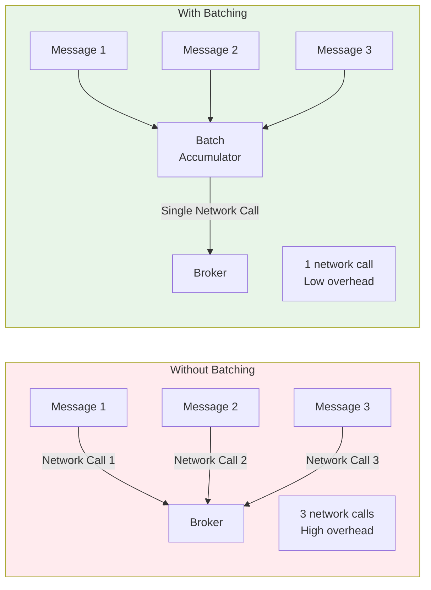
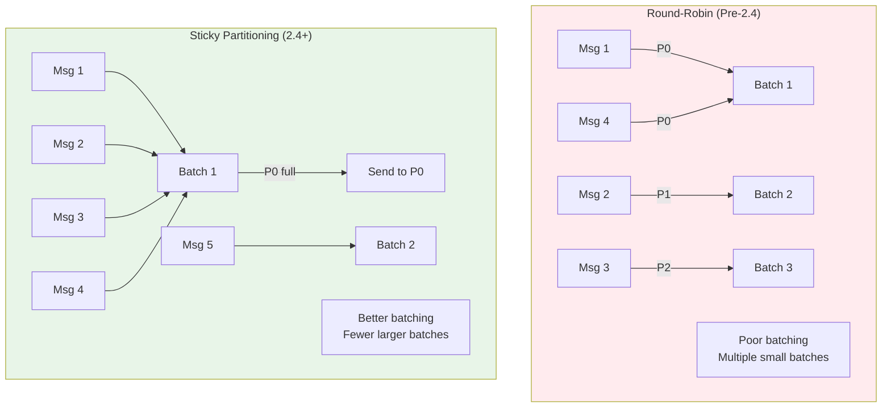
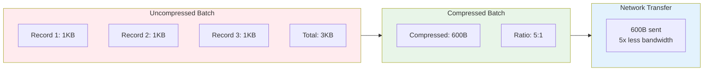
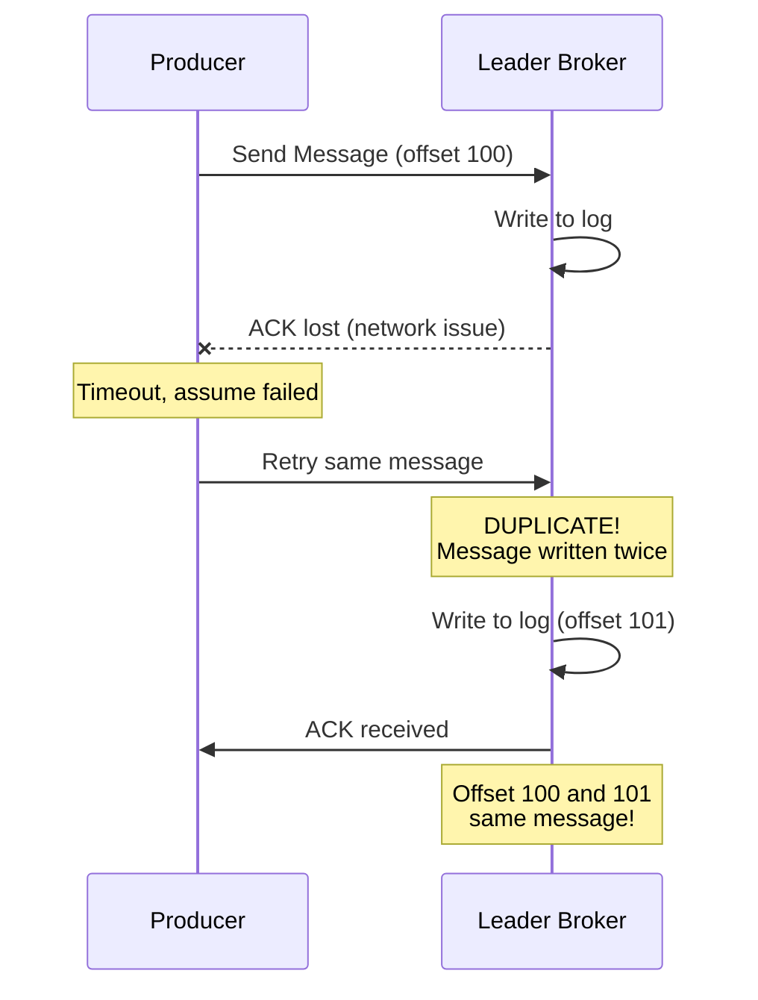
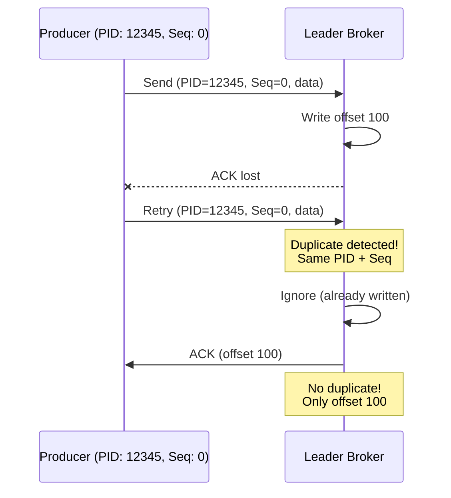
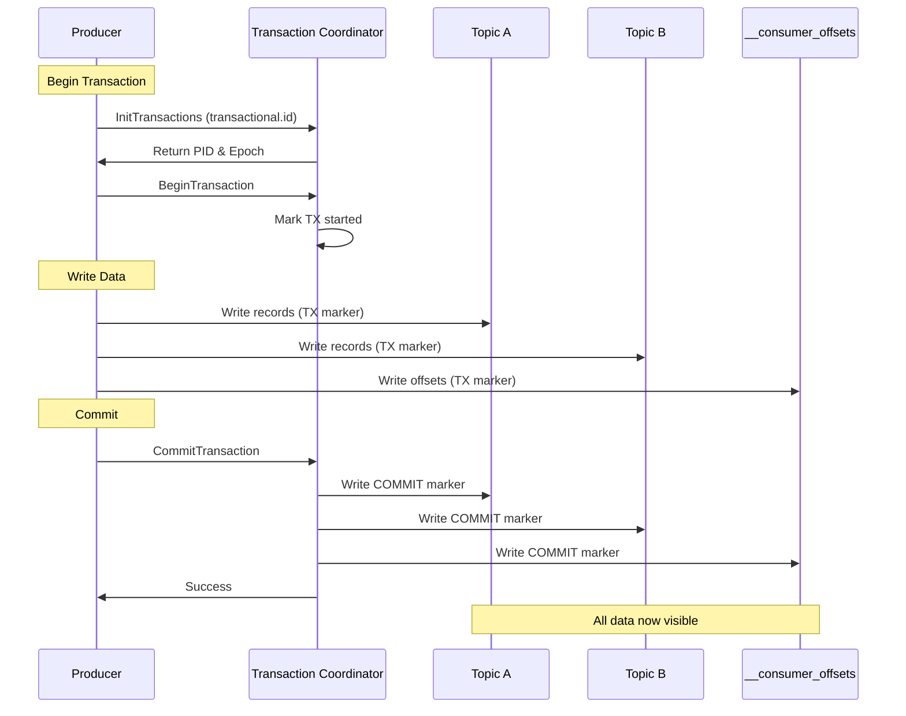

# Kafka Deep Dive - Part 3: Producer Internals and Optimization

Understanding producer internals is crucial for building high-performance, reliable Kafka applications. This tutorial explores batching, compression, delivery guarantees, and advanced patterns.

## Producer Architecture

### Producer Component Breakdown

```mermaid
flowchart TB
    subgraph App["Application Thread"]
        Send[send() call]
        Callback[Callback Handler]
    end

    subgraph Producer["Kafka Producer"]
        Serializer[Key/Value Serializers]
        Partitioner[Partitioner Logic]
        Accumulator[Record Accumulator<br/>In-Memory Buffers]
        Sender[Sender Thread<br/>I/O Thread]
    end

    subgraph Network["Network Layer"]
        Selector[Selector<br/>NIO]
        Connections[TCP Connections<br/>to Brokers]
    end

    Send --> Serializer
    Serializer --> Partitioner
    Partitioner --> Accumulator
    Accumulator --> Sender
    Sender --> Selector
    Selector --> Connections
    Connections -.->|Response| Sender
    Sender -.->|Success/Error| Callback

    style App fill:#e3f2fd
    style Producer fill:#e8f5e8
    style Network fill:#fff3e0
```

### Producer Lifecycle

```kotlin
// Complete producer lifecycle

class ProducerLifecycle {

    fun demonstrateLifecycle() {
        println("""
            Producer Lifecycle Phases:
            ==========================

            1. INITIALIZATION
               - Load configuration
               - Create serializers
               - Initialize partitioner
               - Allocate buffer memory
               - Start sender (I/O) thread

            2. METADATA REFRESH
               - Connect to bootstrap servers
               - Fetch cluster metadata
               - Discover all brokers
               - Cache topic/partition info

            3. RECORD SENDING (Application Thread)
               - serialize() - Convert key/value to bytes
               - partition() - Determine target partition
               - append() - Add to accumulator batch

            4. BATCH SENDING (Sender Thread)
               - Batch records per partition
               - Compress batches
               - Send to broker
               - Handle responses/retries

            5. SHUTDOWN
               - Flush remaining records
               - Close connections
               - Release resources
        """.trimIndent())
    }

    // Proper producer initialization
    fun createProducer(): org.apache.kafka.clients.producer.KafkaProducer<String, String> {
        val props = mapOf(
            "bootstrap.servers" to "localhost:9092",

            // Serializers (required)
            "key.serializer" to "org.apache.kafka.common.serialization.StringSerializer",
            "value.serializer" to "org.apache.kafka.common.serialization.StringSerializer",

            // Client identification
            "client.id" to "my-producer-1",

            // PITFALL: Always set these for production
            "acks" to "all",
            "retries" to Int.MAX_VALUE,
            "max.in.flight.requests.per.connection" to 5,
            "enable.idempotence" to true
        )

        return org.apache.kafka.clients.producer.KafkaProducer(
            props.mapKeys { it.key.toString() }
                .mapValues { it.value.toString() }
                .toProperties()
        )
    }

    // PITFALL: Resource leaks
    fun demonstrateProperShutdown() {
        val producer = createProducer()

        try {
            // Send messages
            producer.send(
                org.apache.kafka.clients.producer.ProducerRecord("topic", "key", "value")
            )

            // PITFALL: Not flushing before close
            // Unflushed records will be lost!
            producer.flush()  // Wait for all in-flight requests

        } finally {
            // CRITICAL: Always close producer
            // Default timeout: Long.MAX_VALUE (blocks forever)
            producer.close(java.time.Duration.ofSeconds(60))

            // Alternative: Non-blocking close (loses in-flight messages)
            // producer.close(Duration.ZERO)  // DON'T DO THIS in production!
        }
    }
}

fun Map<String, Any>.toProperties(): java.util.Properties {
    return java.util.Properties().apply {
        this@toProperties.forEach { (k, v) -> setProperty(k, v.toString()) }
    }
}
```

## Record Batching: The Performance Multiplier

### Batching Mechanics



### Batch Configuration Deep Dive

```kotlin
// Understanding batch configuration

data class BatchConfig(
    val batchSize: Int,           // Max batch size in bytes
    val lingerMs: Long,           // Max wait time before sending
    val bufferMemory: Long,       // Total producer buffer
    val maxBlockMs: Long          // Max time to block send()
)

fun explainBatching() {
    println("""
        Batching Configuration:
        =======================

        1. batch.size (default: 16384 bytes = 16KB)
           - Maximum bytes per batch
           - Batch sent when full OR linger.ms expires
           - Per-partition batching

           Too Low (e.g., 1KB):
           - Frequent network calls
           - Poor throughput
           - Higher CPU usage

           Too High (e.g., 10MB):
           - Memory pressure
           - Longer wait times
           - Risk of buffer exhaustion

           Sweet Spot: 16-64KB for most cases


        2. linger.ms (default: 0)
           - Time to wait for batch to fill
           - 0 = send immediately when batch has data
           - >0 = wait for more records

           linger.ms = 0:
           - Lowest latency
           - Poor batching
           - Use for latency-sensitive apps

           linger.ms = 10-100:
           - Better batching
           - Higher throughput
           - Small latency increase
           - RECOMMENDED for most cases

           PITFALL: linger.ms = 1000+ (1 second)
           - Excessive latency
           - Poor user experience
           - Only for batch processing


        3. buffer.memory (default: 33554432 bytes = 32MB)
           - Total memory for all batches
           - Shared across all partitions
           - When exhausted, send() blocks

           Calculation:
           buffer.memory = batch.size × partitions × 2

           Example: 100 partitions, 32KB batches
           buffer.memory = 32KB × 100 × 2 = 6.4MB (minimum)
           Recommended: 32-64MB


        4. max.block.ms (default: 60000 = 60 seconds)
           - How long send() blocks if buffer full
           - Also applies to metadata fetch

           PITFALL: Too high
           - Application threads hang
           - Poor user experience

           PITFALL: Too low
           - Frequent exceptions
           - Lost messages if not handled

           Recommended: 10000-30000 (10-30 seconds)
    """.trimIndent())
}

// Real-world batching scenarios
fun batchingScenarios() {
    // Scenario 1: High-throughput logging
    val highThroughputConfig = BatchConfig(
        batchSize = 65536,        // 64KB
        lingerMs = 10,            // Wait 10ms
        bufferMemory = 67108864,  // 64MB
        maxBlockMs = 10000        // 10s
    )

    println("""
        Use Case: Application Logs
        - 10,000 messages/sec
        - Latency tolerance: 10-100ms

        Config: ${highThroughputConfig}

        Result:
        - ~640 messages per batch (64KB / 100 bytes avg)
        - Excellent throughput
        - Minimal network overhead
    """.trimIndent())

    // Scenario 2: Low-latency transactions
    val lowLatencyConfig = BatchConfig(
        batchSize = 16384,        // 16KB
        lingerMs = 0,             // No waiting
        bufferMemory = 33554432,  // 32MB
        maxBlockMs = 5000         // 5s
    )

    println("""
        Use Case: Payment Processing
        - <10ms latency required
        - Cannot batch/delay

        Config: ${lowLatencyConfig}

        Result:
        - Immediate sends
        - Opportunistic batching only
        - Slight throughput sacrifice for latency
    """.trimIndent())
}

// PITFALL: Buffer exhaustion
fun detectBufferExhaustion(
    bufferMemory: Long,
    batchSize: Int,
    activePartitions: Int,
    produceRate: Int  // messages per second
) {
    val avgMessageSize = 1024  // 1KB average
    val messagesInBuffer = bufferMemory / avgMessageSize
    val bufferTimeSeconds = messagesInBuffer / produceRate.toDouble()

    if (bufferTimeSeconds < 1.0) {
        println("""
            ⚠️  BUFFER EXHAUSTION RISK

            Current Configuration:
            - Buffer memory: ${bufferMemory / 1_000_000}MB
            - Active partitions: $activePartitions
            - Produce rate: $produceRate msg/s
            - Average message size: ${avgMessageSize}B

            Analysis:
            - Buffer holds ~${messagesInBuffer} messages
            - At current rate, buffer fills in ${bufferTimeSeconds}s
            - ⚠️  Less than 1 second buffering!

            Symptoms:
            - send() calls block frequently
            - TimeoutException errors
            - Application threads stuck

            Solutions:
            1. Increase buffer.memory to ${bufferMemory * 4 / 1_000_000}MB
            2. Reduce batch.size (free memory faster)
            3. Increase linger.ms (better batching)
            4. Add more producer instances (distribute load)
        """.trimIndent())
    }
}
```

### Sticky Partitioning (Kafka 2.4+)



```kotlin
// Sticky partitioning behavior

fun explainStickyPartitioning() {
    println("""
        Sticky Partitioning (Kafka 2.4+)
        =================================

        For null-keyed messages:

        OLD Behavior (Round-Robin):
        - Each message to next partition
        - Poor batching (spreads across partitions)
        - More network requests
        - Lower throughput

        NEW Behavior (Sticky):
        - Stick to one partition until batch full
        - Then switch to another partition
        - Better batching
        - Higher throughput (~50% improvement!)

        Example:
        --------
        Send 100 messages with null keys:

        Round-Robin:
        - Partition 0: 33 messages (33 batches)
        - Partition 1: 33 messages (33 batches)
        - Partition 2: 34 messages (34 batches)
        - Total: 100 batches sent

        Sticky Partitioning:
        - Partition 0: 100 messages (1 batch)
        - Total: 1 batch sent
        - 100x fewer network calls!

        PITFALL: Ordering implications
        ================================
        With sticky partitioning, order depends on batch completion:
        - Messages 1-100 → Partition 0 (batch 1)
        - Messages 101-200 → Partition 1 (batch 2)
        - Messages 201-300 → Partition 0 (batch 3)

        Within partition: Ordered
        Across partitions: Not ordered (but never was for null keys)

        If you need ordering: USE KEYS!
    """.trimIndent())
}
```

## Compression: Bandwidth and Storage Optimization

### Compression Algorithms



```kotlin
// Compression algorithm comparison

enum class CompressionType(
    val codec: String,
    val compressionRatio: Double,  // Typical ratio
    val cpuCost: String,
    val speed: String
) {
    NONE("none", 1.0, "None", "Fastest"),
    GZIP("gzip", 4.0, "High", "Slow"),
    SNAPPY("snappy", 2.5, "Low", "Fast"),
    LZ4("lz4", 2.2, "Very Low", "Very Fast"),
    ZSTD("zstd", 3.5, "Medium", "Medium");

    companion object {
        fun compare() {
            println("""
                Compression Algorithm Comparison:
                =================================

                1. NONE
                   Ratio: 1:1 (no compression)
                   CPU: None
                   Speed: Fastest
                   When to use:
                   - Pre-compressed data (images, video)
                   - CPU-constrained producers
                   - Low bandwidth costs

                2. GZIP
                   Ratio: 4:1 (best compression)
                   CPU: High (slowest)
                   Speed: ~20 MB/s encode
                   When to use:
                   - Long-term storage (reduce costs)
                   - Expensive bandwidth
                   - Text-heavy data
                   PITFALL: High CPU usage on broker (decompress)

                3. SNAPPY
                   Ratio: 2.5:1 (good compression)
                   CPU: Low
                   Speed: ~250 MB/s encode
                   When to use:
                   - Balanced use case
                   - RECOMMENDED for most scenarios
                   - Good compression + speed

                4. LZ4
                   Ratio: 2.2:1 (decent compression)
                   CPU: Very Low
                   Speed: ~400 MB/s encode (fastest)
                   When to use:
                   - CPU-sensitive applications
                   - Ultra-low latency required
                   - High throughput systems

                5. ZSTD (Kafka 2.1+)
                   Ratio: 3.5:1 (excellent compression)
                   CPU: Medium
                   Speed: ~200 MB/s encode
                   When to use:
                   - Better than Snappy compression
                   - Reasonable CPU usage
                   - Modern clusters (2.1+)
                   RECOMMENDED for new deployments
            """.trimIndent())
        }
    }
}

// Measure compression effectiveness
fun measureCompressionRatio(
    uncompressedSize: Long,
    compressedSize: Long,
    codec: String
) {
    val ratio = uncompressedSize.toDouble() / compressedSize
    val savings = ((1 - compressedSize.toDouble() / uncompressedSize) * 100).toInt()

    println("""
        Compression Results:
        ====================
        Codec: $codec
        Uncompressed: ${uncompressedSize / 1_000_000}MB
        Compressed: ${compressedSize / 1_000_000}MB
        Ratio: ${String.format("%.1f", ratio)}:1
        Savings: $savings%

        Annual Savings (1TB/day):
        - Network: ${savings * 365}GB/year
        - Storage: ${savings * 365}GB/year (× replication factor)
        - Costs: ~\$${savings * 365 / 10} (at \$0.10/GB transfer)
    """.trimIndent())
}

// PITFALL: Compression and small batches
fun warnAboutCompressionPitfall() {
    println("""
        ⚠️  COMPRESSION PITFALL: Small Batches

        Problem:
        ========
        Compression works best on LARGE batches
        Small batches = poor compression ratio

        Example:
        --------
        Single 1KB message:
        - Snappy compression: 1KB → 950B (5% savings)
        - Overhead > savings!

        Batch of 100×1KB messages:
        - Snappy compression: 100KB → 40KB (60% savings)
        - Excellent compression!

        Why?
        ----
        - Compression finds patterns in data
        - More data = more patterns
        - Compression overhead amortized

        Solution:
        =========
        If using compression, ensure good batching:
        - batch.size ≥ 32KB
        - linger.ms ≥ 5 (allow batches to fill)

        If batches are small:
        - Consider compression.type=none
        - Overhead may exceed benefit
    """.trimIndent())
}

// Real-world compression configuration
fun chooseCompression(
    dataType: String,
    throughputMBps: Int,
    cpuAvailable: Boolean
): String {
    return when {
        dataType == "json" && cpuAvailable -> {
            "zstd  // Best for text data, good CPU available"
        }
        dataType == "json" && !cpuAvailable -> {
            "snappy  // Balanced for text, low CPU"
        }
        throughputMBps > 100 -> {
            "lz4  // Fastest, needed for high throughput"
        }
        dataType == "binary" -> {
            "none  // Already compressed (images, etc.)"
        }
        else -> {
            "snappy  // Safe default choice"
        }
    }
}
```

## Idempotent Producer: Eliminating Duplicates

### The Duplicate Problem



### Idempotence Solution



```kotlin
// Idempotent producer configuration

fun explainIdempotence() {
    println("""
        Idempotent Producer
        ===================

        Purpose:
        - Eliminate duplicates from retries
        - Guarantee exactly-once delivery to partition
        - No application code changes needed

        How it works:
        =============

        1. Producer ID (PID)
           - Assigned by broker on first connect
           - Unique per producer instance
           - Persists for session lifetime

        2. Sequence Number
           - Per-partition counter
           - Increments with each batch
           - Sent with every request

        3. Broker Deduplication
           - Broker tracks: (PID, Partition) → Last Sequence
           - If Sequence ≤ Last Sequence: Duplicate (ignore)
           - If Sequence = Last + 1: New message (accept)
           - If Sequence > Last + 1: Gap (error)

        Configuration:
        ==============
        ```kotlin
        val config = mapOf(
            "enable.idempotence" to "true",

            // These are set automatically:
            "acks" to "all",  // Must ack all ISR
            "retries" to Int.MAX_VALUE,  // Infinite retries
            "max.in.flight.requests.per.connection" to 5  // Allows pipelining
        )
        ```

        AUTOMATIC in Kafka 3.0+:
        - Idempotence enabled by default
        - No configuration needed
        - Recommended for ALL producers

        Performance Impact:
        ===================
        - Minimal overhead (~2-3% throughput)
        - Small increase in broker memory (tracking state)
        - Well worth it for correctness!

        Limitations:
        ============
        1. Per-partition guarantee only
           - Duplicates still possible across partitions
           - Not exactly-once across topics

        2. Single producer session
           - PID lost on producer restart
           - New session = new PID = can't detect old duplicates

        3. Broker epoch (5 minutes default)
           - After 5 min of inactivity, state cleaned
           - Duplicates possible after gap

        For stronger guarantees: Use Transactions!
    """.trimIndent())
}

// PITFALL: Idempotence and max.in.flight
fun explainMaxInFlight() {
    println("""
        ⚠️  max.in.flight.requests.per.connection
        =========================================

        Definition:
        - Maximum unacknowledged requests per connection
        - Higher = more pipelining = better throughput
        - Lower = less reordering risk

        With Idempotence:
        =================
        - max.in.flight ≤ 5 (enforced)
        - Ordering guaranteed even with retries
        - Safe to use 5 for best performance

        Without Idempotence:
        ====================
        - max.in.flight = 1 (for ordering)
        - Very low throughput
        - No pipelining

        Example: Message Reordering
        ============================
        max.in.flight = 5, idempotence = false

        Send: [Msg1, Msg2, Msg3, Msg4, Msg5]
        - Msg1 fails, retried
        - Msg2-5 succeed
        - Msg1 retry succeeds
        Result: [Msg2, Msg3, Msg4, Msg5, Msg1]  ❌ Out of order!

        With idempotence = true:
        - Broker detects gap in sequence numbers
        - Waits for Msg1 before accepting Msg2
        Result: [Msg1, Msg2, Msg3, Msg4, Msg5]  ✓ In order!

        Recommendation:
        ===============
        Always enable idempotence (default in 3.0+)
        Use max.in.flight = 5 for best performance
    """.trimIndent())
}

// Detecting idempotence issues
fun monitorIdempotence(metrics: Map<String, Double>) {
    val duplicates = metrics["record-send-total"]!! - metrics["record-send-rate"]!!

    if (duplicates > 100) {
        println("""
            ⚠️  HIGH DUPLICATE RATE DETECTED

            Duplicates: $duplicates

            Possible causes:
            1. Idempotence not enabled
            2. Producer restarts (PID change)
            3. Broker state cleanup (long idle period)

            Check:
            - enable.idempotence configuration
            - Producer restart frequency
            - Error logs for OutOfOrderSequenceException
        """.trimIndent())
    }
}
```

## Transactions: Exactly-Once Across Topics

### Transaction Lifecycle



```kotlin
// Transactional producer implementation

class TransactionalProducer(
    private val transactionalId: String
) {

    private val producer = createTransactionalProducer()

    private fun createTransactionalProducer() =
        org.apache.kafka.clients.producer.KafkaProducer<String, String>(
            mapOf(
                "bootstrap.servers" to "localhost:9092",
                "key.serializer" to "org.apache.kafka.common.serialization.StringSerializer",
                "value.serializer" to "org.apache.kafka.common.serialization.StringSerializer",

                // REQUIRED for transactions
                "transactional.id" to transactionalId,

                // Automatically set:
                "enable.idempotence" to "true",
                "acks" to "all",
                "retries" to Int.MAX_VALUE
            ).mapKeys { it.key.toString() }
             .mapValues { it.value.toString() }
             .toProperties()
        )

    fun demonstrateTransaction() {
        // MUST call this before using transactions
        producer.initTransactions()

        try {
            // Start transaction
            producer.beginTransaction()

            // Send to multiple topics atomically
            producer.send(
                org.apache.kafka.clients.producer.ProducerRecord(
                    "orders", "order-123", "created"
                )
            )

            producer.send(
                org.apache.kafka.clients.producer.ProducerRecord(
                    "inventory", "product-456", "reserved"
                )
            )

            producer.send(
                org.apache.kafka.clients.producer.ProducerRecord(
                    "notifications", "user-789", "order confirmation"
                )
            )

            // All or nothing!
            producer.commitTransaction()
            println("✓ Transaction committed - all writes visible")

        } catch (e: Exception) {
            // Rollback on error
            producer.abortTransaction()
            println("✗ Transaction aborted - no writes visible")
            throw e
        }
    }

    // Real-world: Read-Process-Write pattern
    fun processMessages(
        inputTopic: String,
        outputTopic: String
    ) {
        val consumer = createTransactionalConsumer()
        consumer.subscribe(listOf(inputTopic))

        producer.initTransactions()

        while (true) {
            val records = consumer.poll(java.time.Duration.ofMillis(100))

            if (records.isEmpty) continue

            try {
                producer.beginTransaction()

                records.forEach { record ->
                    // Process record
                    val result = processRecord(record.value())

                    // Write result
                    producer.send(
                        org.apache.kafka.clients.producer.ProducerRecord(
                            outputTopic, record.key(), result
                        )
                    )
                }

                // Send consumer offsets to transaction
                // CRITICAL: Ties consumption to production
                val offsets = records.groupBy { it.topic() to it.partition() }
                    .mapKeys { (topic, partition) ->
                        org.apache.kafka.common.TopicPartition(topic, partition)
                    }
                    .mapValues { (_, records) ->
                        org.apache.kafka.clients.consumer.OffsetAndMetadata(
                            records.last().offset() + 1
                        )
                    }

                producer.sendOffsetsToTransaction(
                    offsets,
                    consumer.groupMetadata()
                )

                // Commit: outputs + offsets atomically
                producer.commitTransaction()

            } catch (e: Exception) {
                producer.abortTransaction()
                // Will re-process same records (idempotent)
            }
        }
    }

    private fun processRecord(value: String): String {
        // Business logic
        return value.uppercase()
    }

    private fun createTransactionalConsumer() =
        org.apache.kafka.clients.consumer.KafkaConsumer<String, String>(
            mapOf(
                "bootstrap.servers" to "localhost:9092",
                "group.id" to "transactional-consumer",
                "key.deserializer" to "org.apache.kafka.common.serialization.StringDeserializer",
                "value.deserializer" to "org.apache.kafka.common.serialization.StringDeserializer",

                // CRITICAL for exactly-once
                "isolation.level" to "read_committed",

                // Disable auto-commit (use transaction offsets)
                "enable.auto.commit" to "false"
            ).mapKeys { it.key.toString() }
             .mapValues { it.value.toString() }
             .toProperties()
        )
}

// Transaction coordinator internals
fun explainTransactionCoordinator() {
    println("""
        Transaction Coordinator
        =======================

        Role:
        - Manages transaction state
        - Coordinates commit/abort
        - Ensures atomicity across partitions

        Transaction Log:
        ================
        - Special topic: __transaction_state
        - 50 partitions (default)
        - Replication factor: 3 (recommended)
        - Stores transaction metadata

        Transaction States:
        ===================
        1. Empty - No active transaction
        2. Ongoing - Transaction in progress
        3. PrepareCommit - Committing
        4. PrepareAbort - Aborting
        5. CompleteCommit - Committed
        6. CompleteAbort - Aborted

        Coordinator Selection:
        ======================
        Partition = hash(transactional.id) % 50

        Same transactional.id → same coordinator
        Important for fencing!

        PITFALL: Transaction timeout
        =============================
        transaction.timeout.ms (default: 60000 = 1 minute)

        - Max time for transaction to complete
        - If exceeded: Coordinator aborts
        - Must be > processing time

        Too Low:
        - Transactions aborted prematurely
        - Wasted work

        Too High:
        - Hung transactions block progress
        - Zombie producers not fenced

        Recommended: 30000-300000 (30s - 5min)
    """.trimIndent())
}

// PITFALL: Zombie producers
fun explainZombieFencing() {
    println("""
        ⚠️  ZOMBIE PRODUCER FENCING
        ===========================

        Problem:
        --------
        Producer instance 1 starts transaction
        Instance 1 network partitioned
        Instance 2 starts (same transactional.id)
        Instance 1 comes back - both active!

        Without Fencing:
        ================
        Both instances write to same topics
        Corrupted data / duplicates
        Transaction guarantees broken

        With Fencing (Epoch):
        =====================
        Each producer has epoch number:
        - Instance 1: Epoch 5
        - Instance 2: Epoch 6 (bumped on init)

        When Instance 1 returns:
        - Sends request with Epoch 5
        - Broker rejects (current epoch is 6)
        - Instance 1 fenced out

        Configuration:
        ==============
        ```kotlin
        // CRITICAL: Unique transactional.id per logical producer
        "transactional.id" to "order-processor-1"

        // WRONG: Same ID for multiple instances
        "transactional.id" to "order-processor"  ❌

        // RIGHT: Instance-specific ID
        "transactional.id" to "order-processor-\${instanceId}"  ✓
        ```

        Deployment Pattern:
        ===================
        Kubernetes StatefulSet:
        - order-processor-0 → transactional.id = "order-processor-0"
        - order-processor-1 → transactional.id = "order-processor-1"
        - order-processor-2 → transactional.id = "order-processor-2"

        Each instance has unique ID
        No zombie conflicts!
    """.trimIndent())
}
```

## Producer Performance Optimization

### Performance Tuning Matrix

```kotlin
// Performance optimization strategies

data class PerformanceProfile(
    val name: String,
    val config: Map<String, Any>,
    val throughputMBps: Int,
    val latencyMs: Int,
    val cpuUsage: String
)

fun performanceProfiles(): List<PerformanceProfile> {
    return listOf(
        // Profile 1: Maximum Throughput
        PerformanceProfile(
            name = "Maximum Throughput",
            config = mapOf(
                "batch.size" to 65536,              // 64KB
                "linger.ms" to 20,                  // Wait 20ms
                "compression.type" to "lz4",        // Fast compression
                "acks" to "1",                      // Leader only
                "buffer.memory" to 134217728,       // 128MB
                "max.in.flight.requests.per.connection" to 5
            ),
            throughputMBps = 500,
            latencyMs = 25,
            cpuUsage = "Medium"
        ),

        // Profile 2: Minimum Latency
        PerformanceProfile(
            name = "Minimum Latency",
            config = mapOf(
                "batch.size" to 16384,              // 16KB
                "linger.ms" to 0,                   // No waiting
                "compression.type" to "none",       // No compression
                "acks" to "1",                      // Leader only
                "buffer.memory" to 33554432,        // 32MB
                "max.in.flight.requests.per.connection" to 1
            ),
            throughputMBps = 100,
            latencyMs = 2,
            cpuUsage = "Low"
        ),

        // Profile 3: Balanced (RECOMMENDED)
        PerformanceProfile(
            name = "Balanced",
            config = mapOf(
                "batch.size" to 32768,              // 32KB
                "linger.ms" to 5,                   // Small wait
                "compression.type" to "snappy",     // Balanced
                "acks" to "all",                    // All ISR
                "enable.idempotence" to true,
                "buffer.memory" to 67108864,        // 64MB
                "max.in.flight.requests.per.connection" to 5
            ),
            throughputMBps = 300,
            latencyMs = 10,
            cpuUsage = "Medium"
        ),

        // Profile 4: Maximum Reliability
        PerformanceProfile(
            name = "Maximum Reliability",
            config = mapOf(
                "batch.size" to 16384,              // 16KB
                "linger.ms" to 1,
                "compression.type" to "zstd",       // Best compression
                "acks" to "all",
                "enable.idempotence" to true,
                "max.in.flight.requests.per.connection" to 1,
                "retries" to Int.MAX_VALUE,
                "delivery.timeout.ms" to 300000     // 5 minutes
            ),
            throughputMBps = 150,
            latencyMs = 15,
            cpuUsage = "High"
        )
    )
}

// Performance monitoring
fun analyzeProducerPerformance(metrics: ProducerMetrics) {
    println("""
        Producer Performance Analysis:
        ==============================

        Throughput Metrics:
        - Record send rate: ${metrics.recordSendRate} records/sec
        - Byte rate: ${metrics.byteRate / 1_000_000} MB/sec
        - Batch size avg: ${metrics.batchSizeAvg / 1024} KB

        Latency Metrics:
        - Request latency avg: ${metrics.requestLatencyAvg} ms
        - Request latency max: ${metrics.requestLatencyMax} ms
        - Record queue time avg: ${metrics.recordQueueTimeAvg} ms

        Efficiency Metrics:
        - Records per request avg: ${metrics.recordsPerRequestAvg}
        - Compression ratio: ${metrics.compressionRatio}
        - Buffer utilization: ${metrics.bufferUtilization}%

        Error Metrics:
        - Record error rate: ${metrics.recordErrorRate}
        - Record retry rate: ${metrics.recordRetryRate}

        ${analyzeBottlenecks(metrics)}
    """.trimIndent())
}

data class ProducerMetrics(
    val recordSendRate: Double,
    val byteRate: Double,
    val batchSizeAvg: Double,
    val requestLatencyAvg: Double,
    val requestLatencyMax: Double,
    val recordQueueTimeAvg: Double,
    val recordsPerRequestAvg: Double,
    val compressionRatio: Double,
    val bufferUtilization: Double,
    val recordErrorRate: Double,
    val recordRetryRate: Double
)

fun analyzeBottlenecks(metrics: ProducerMetrics): String {
    val issues = mutableListOf<String>()

    // Low batching
    if (metrics.recordsPerRequestAvg < 10) {
        issues.add("""
            ⚠️  Poor Batching (${metrics.recordsPerRequestAvg} records/batch)
            - Increase linger.ms (currently too low)
            - Increase batch.size
            - Reduce produce rate to allow batching
        """.trimIndent())
    }

    // High queue time
    if (metrics.recordQueueTimeAvg > 100) {
        issues.add("""
            ⚠️  High Queue Time (${metrics.recordQueueTimeAvg}ms)
            - Producer falling behind
            - Consider adding more producer instances
            - Check for backpressure
        """.trimIndent())
    }

    // Poor compression
    if (metrics.compressionRatio < 1.5) {
        issues.add("""
            ⚠️  Poor Compression (${metrics.compressionRatio}:1)
            - Data may not be compressible
            - Small batches reduce compression effectiveness
            - Consider compression.type=none
        """.trimIndent())
    }

    // High error rate
    if (metrics.recordErrorRate > 0.01) {
        issues.add("""
            ⚠️  High Error Rate (${metrics.recordErrorRate * 100}%)
            - Check broker logs
            - Verify network connectivity
            - Review producer configuration
        """.trimIndent())
    }

    return if (issues.isEmpty()) {
        "✓ No bottlenecks detected"
    } else {
        "Bottlenecks Detected:\n${issues.joinToString("\n\n")}"
    }
}
```

## Key Takeaways

- **Batching** is the primary performance lever - tune batch.size and linger.ms carefully
- **Compression** saves bandwidth and storage - use snappy/zstd for most cases
- **Idempotence** should be enabled by default (automatic in Kafka 3.0+)
- **Transactions** provide exactly-once across topics but add latency overhead
- **Sticky partitioning** improves batching for null-keyed messages
- **Monitor metrics** continuously to detect bottlenecks and optimize

**Critical Pitfalls**:
- ⚠️ Compression without batching is wasteful
- ⚠️ Buffer memory too small causes send() blocking
- ⚠️ Same transactional.id across instances creates zombies
- ⚠️ linger.ms=0 with compression defeats the purpose
- ⚠️ Not calling producer.flush() before close() loses data
- ⚠️ max.in.flight > 1 without idempotence risks reordering

## What's Next

In Part 4, we'll dive deep into Consumers and Consumer Groups - understanding group coordination, rebalancing, offset management, lag monitoring, and parallel processing patterns.
