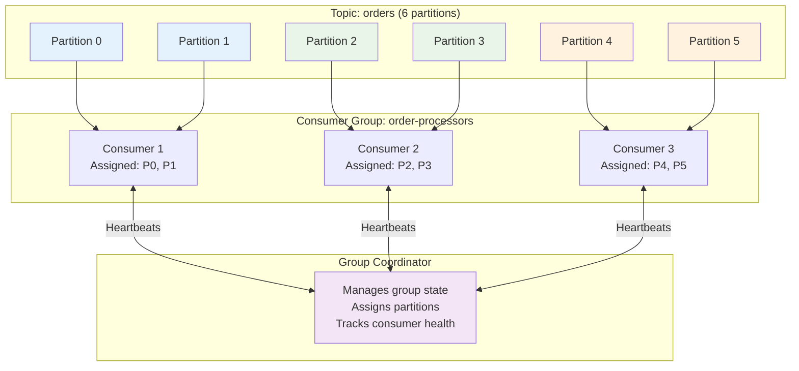
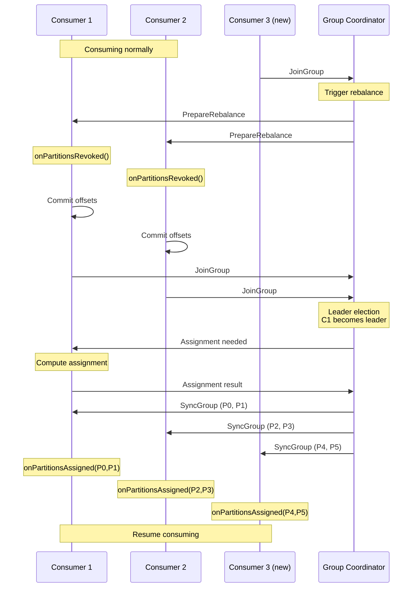
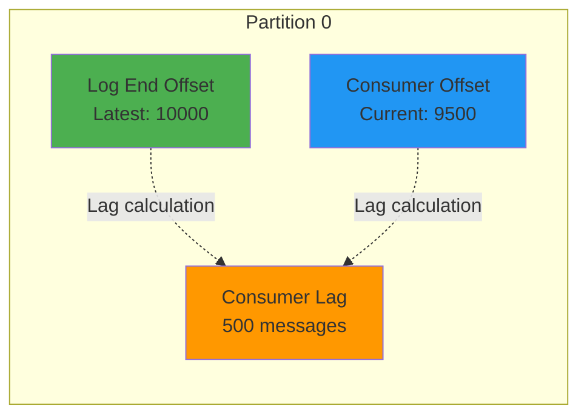

# Kafka Deep Dive - Part 4: Consumer Groups and Offset Management

Consumer groups are the foundation of Kafka's scalability and fault tolerance. This tutorial explores group coordination, rebalancing, offset management, and optimization patterns.

## Consumer Architecture

### Consumer Component Breakdown

```mermaid
flowchart TB
    subgraph App["Application Thread"]
        Poll[poll() loop]
        Process[Process Records]
        Commit[Commit Offsets]
    end

    subgraph Consumer["Kafka Consumer"]
        Fetcher[Fetcher<br/>Fetch records]
        Coordinator[Consumer Coordinator<br/>Group management]
        OffsetMgr[Offset Manager<br/>Commit/fetch offsets]
        Metadata[Metadata Cache<br/>Topic/partition info]
    end

    subgraph Broker["Kafka Broker"]
        GC[Group Coordinator<br/>Manage group state]
        OffsetTopic[__consumer_offsets<br/>Store offsets]
        DataPartitions[Data Partitions]
    end

    Poll --> Fetcher
    Fetcher --> DataPartitions
    DataPartitions -.->|Records| Fetcher
    Fetcher -.->|Records| Process

    Process --> Commit
    Commit --> OffsetMgr
    OffsetMgr --> OffsetTopic

    Coordinator <--> GC

    style App fill:#e3f2fd
    style Consumer fill:#e8f5e8
    style Broker fill:#fff3e0
```

### Consumer Lifecycle

```kotlin
// Complete consumer lifecycle

class ConsumerLifecycle {

    fun demonstrateLifecycle() {
        println("""
            Consumer Lifecycle Phases:
            ==========================

            1. INITIALIZATION
               - Load configuration
               - Create deserializers
               - Initialize fetcher
               - Allocate buffer memory

            2. GROUP COORDINATION
               - Find group coordinator
               - Join consumer group
               - Wait for partition assignment
               - Receive assignment from coordinator

            3. PARTITION ASSIGNMENT
               - Partitions assigned based on strategy
               - Fetch initial offsets
               - Position to committed offset or reset policy

            4. FETCHING (poll loop)
               - poll() - Fetch records from assigned partitions
               - Heartbeat (background) - Stay alive in group
               - Process records
               - Commit offsets (auto or manual)

            5. REBALANCING
               - Triggered by: new consumer, consumer failure, partition change
               - onPartitionsRevoked() callback
               - Wait for new assignment
               - onPartitionsAssigned() callback
               - Resume consuming

            6. SHUTDOWN
               - Leave consumer group gracefully
               - Commit final offsets
               - Close connections
               - Release resources
        """.trimIndent())
    }

    // Proper consumer initialization
    fun createConsumer(): org.apache.kafka.clients.consumer.KafkaConsumer<String, String> {
        val props = mapOf(
            "bootstrap.servers" to "localhost:9092",

            // Group coordination (required)
            "group.id" to "my-consumer-group",

            // Deserializers (required)
            "key.deserializer" to "org.apache.kafka.common.serialization.StringDeserializer",
            "value.deserializer" to "org.apache.kafka.common.serialization.StringDeserializer",

            // Consumer behavior
            "auto.offset.reset" to "earliest",  // earliest, latest, none
            "enable.auto.commit" to "false",    // Manual commit recommended

            // Session management
            "session.timeout.ms" to "45000",         // 45s
            "heartbeat.interval.ms" to "3000",       // 3s (< 1/3 session timeout)
            "max.poll.interval.ms" to "300000",      // 5 min

            // Fetch configuration
            "fetch.min.bytes" to "1",                // Immediate fetch
            "fetch.max.wait.ms" to "500",            // Max wait
            "max.partition.fetch.bytes" to "1048576" // 1MB per partition
        ).toProperties()

        return org.apache.kafka.clients.consumer.KafkaConsumer(props)
    }

    // PITFALL: Improper shutdown
    fun demonstrateProperShutdown() {
        val consumer = createConsumer()
        val shutdown = java.util.concurrent.atomic.AtomicBoolean(false)

        // Shutdown hook
        Runtime.getRuntime().addShutdownHook(Thread {
            println("Shutting down consumer...")
            shutdown.set(true)
        })

        try {
            consumer.subscribe(listOf("my-topic"))

            while (!shutdown.get()) {
                val records = consumer.poll(java.time.Duration.ofMillis(100))

                records.forEach { record ->
                    processRecord(record)
                }

                // Commit after processing
                consumer.commitSync()
            }

        } finally {
            // CRITICAL: Close consumer gracefully
            // - Commits offsets
            // - Leaves group (triggers rebalance)
            // - Closes connections
            consumer.close(java.time.Duration.ofSeconds(30))

            // PITFALL: Not closing or timeout too short
            // - Uncommitted offsets lost
            // - Consumer marked as failed (slow rebalance)
            // - Resource leaks
        }
    }

    private fun processRecord(record: org.apache.kafka.clients.consumer.ConsumerRecord<String, String>) {
        println("Processing: ${record.value()}")
    }
}

fun Map<String, Any>.toProperties(): java.util.Properties {
    return java.util.Properties().apply {
        this@toProperties.forEach { (k, v) -> setProperty(k, v.toString()) }
    }
}
```

## Consumer Groups: Parallel Processing

### Group Coordination



### Partition Assignment Strategies

```kotlin
// Assignment strategies explained

enum class AssignmentStrategy(val className: String) {
    RANGE("org.apache.kafka.clients.consumer.RangeAssignor"),
    ROUND_ROBIN("org.apache.kafka.clients.consumer.RoundRobinAssignor"),
    STICKY("org.apache.kafka.clients.consumer.StickyAssignor"),
    COOPERATIVE_STICKY("org.apache.kafka.clients.consumer.CooperativeStickyAssignor");

    companion object {
        fun explain() {
            println("""
                Partition Assignment Strategies:
                =================================

                1. RANGE (default)
                -------------------
                - Assign partitions per topic
                - Sort partitions and consumers
                - Divide partitions / consumers
                - Assign ranges to each consumer

                Example: Topic with 6 partitions, 3 consumers
                - Consumer 1: P0, P1
                - Consumer 2: P2, P3
                - Consumer 3: P4, P5

                Multiple topics example: 2 topics (A, B), each 6 partitions
                - Consumer 1: A(P0,P1), B(P0,P1) = 4 partitions
                - Consumer 2: A(P2,P3), B(P2,P3) = 4 partitions
                - Consumer 3: A(P4,P5), B(P4,P5) = 4 partitions

                ⚠️  PITFALL: Uneven with multiple topics
                If topic A has 7 partitions:
                - Consumer 1: A(P0,P1,P2), B(P0,P1) = 5 partitions
                - Consumer 2: A(P3,P4), B(P2,P3) = 4 partitions
                - Consumer 3: A(P5,P6), B(P4,P5) = 4 partitions
                Unbalanced!


                2. ROUND-ROBIN
                --------------
                - Assign partitions across ALL topics
                - Distribute evenly round-robin style
                - Better balance than Range

                Example: 2 topics (A, B), 6 partitions each, 3 consumers
                - Consumer 1: A(P0), A(P3), B(P0), B(P3) = 4 partitions
                - Consumer 2: A(P1), A(P4), B(P1), B(P4) = 4 partitions
                - Consumer 3: A(P2), A(P5), B(P2), B(P5) = 4 partitions
                Perfectly balanced!

                ⚠️  PITFALL: All consumers must subscribe to same topics
                If consumers subscribe to different topics, can't balance


                3. STICKY
                ---------
                - Minimize partition movement during rebalance
                - Keep existing assignments when possible
                - Balance when adding/removing consumers

                Example: Rebalance scenario
                Before: C1(P0,P1,P2), C2(P3,P4,P5)
                C3 joins:
                - Range: C1(P0,P1), C2(P2,P3), C3(P4,P5) - ALL reassigned!
                - Sticky: C1(P0,P1), C2(P3,P4), C3(P2,P5) - Only 2 moved

                Benefits:
                - Less disruption during rebalance
                - Faster rebalance (less state transfer)
                - Better for stateful processing


                4. COOPERATIVE STICKY (Kafka 2.4+)
                -----------------------------------
                - Like Sticky but incremental rebalancing
                - Only reassign partitions that need to move
                - Consumers keep processing while rebalancing

                Traditional (Stop-the-world):
                1. Revoke ALL partitions
                2. Pause processing
                3. Assign new partitions
                4. Resume processing

                Cooperative:
                1. Identify partitions to move
                2. Revoke only those partitions
                3. Other partitions keep processing
                4. Assign revoked partitions to new consumer
                5. Minimal interruption!

                ⚠️  PITFALL: Requires all consumers on same protocol
                Mix of eager and cooperative = fallback to eager


                RECOMMENDED:
                ============
                For most use cases: CooperativeStickyAssignor
                - Best balance and rebalance performance
                - Minimal interruption
                - Default in newer Kafka versions
            """.trimIndent())
        }

        fun visualizeRebalance() {
            println("""
                Rebalance Comparison:
                =====================

                Scenario: 6 partitions, 2 consumers → 3 consumers join

                EAGER (Range/RoundRobin):
                -------------------------
                Initial: C1(P0,P1,P2), C2(P3,P4,P5)
                C3 joins:
                Step 1: Revoke ALL → C1(), C2()
                Step 2: Reassign → C1(P0,P1), C2(P2,P3), C3(P4,P5)
                Downtime: ALL partitions stopped during rebalance


                COOPERATIVE STICKY:
                -------------------
                Initial: C1(P0,P1,P2), C2(P3,P4,P5)
                C3 joins:
                Step 1: Keep C1(P0,P1), C2(P3,P4), revoke C1(P2), C2(P5)
                Step 2: Assign C3(P2,P5)
                Downtime: Only P2 and P5 stopped briefly

                Impact: 66% reduction in processing interruption!
            """.trimIndent())
        }
    }
}

// Configure assignment strategy
fun configureAssignmentStrategy() {
    val props = mapOf(
        "bootstrap.servers" to "localhost:9092",
        "group.id" to "my-group",
        "key.deserializer" to "org.apache.kafka.common.serialization.StringDeserializer",
        "value.deserializer" to "org.apache.kafka.common.serialization.StringDeserializer",

        // Set assignment strategy
        "partition.assignment.strategy" to AssignmentStrategy.COOPERATIVE_STICKY.className,

        // Can specify multiple (fallback order)
        // "partition.assignment.strategy" to listOf(
        //     AssignmentStrategy.COOPERATIVE_STICKY.className,
        //     AssignmentStrategy.STICKY.className,
        //     AssignmentStrategy.RANGE.className
        // ).joinToString(",")
    )

    println("Configured: ${props["partition.assignment.strategy"]}")
}
```

## Rebalancing Protocol

### Rebalance Sequence



### Rebalance Callbacks

```kotlin
// Implementing rebalance listeners

class RebalanceAwareConsumer {

    private val currentOffsets = mutableMapOf<
        org.apache.kafka.common.TopicPartition,
        org.apache.kafka.clients.consumer.OffsetAndMetadata
    >()

    fun consumeWithRebalanceHandling() {
        val consumer = createConsumer()

        // Custom rebalance listener
        val listener = object : org.apache.kafka.clients.consumer.ConsumerRebalanceListener {

            override fun onPartitionsRevoked(
                partitions: Collection<org.apache.kafka.common.TopicPartition>
            ) {
                println("⚠️  Partitions revoked: $partitions")

                // CRITICAL: Commit offsets before losing partitions
                try {
                    consumer.commitSync(currentOffsets)
                    println("✓ Committed offsets: $currentOffsets")
                } catch (e: Exception) {
                    println("✗ Failed to commit: ${e.message}")
                }

                // Cleanup partition-specific state
                partitions.forEach { partition ->
                    cleanupPartitionState(partition)
                }

                currentOffsets.clear()
            }

            override fun onPartitionsAssigned(
                partitions: Collection<org.apache.kafka.common.TopicPartition>
            ) {
                println("✓ Partitions assigned: $partitions")

                // Initialize partition-specific state
                partitions.forEach { partition ->
                    initializePartitionState(partition)

                    // Optional: Seek to specific offset
                    val committedOffset = consumer.committed(setOf(partition))[partition]
                    println("  $partition starting at offset ${committedOffset?.offset()}")
                }
            }

            // Cooperative rebalancing (Kafka 2.4+)
            override fun onPartitionsLost(
                partitions: Collection<org.apache.kafka.common.TopicPartition>
            ) {
                println("⚠️  Partitions LOST (didn't revoke cleanly): $partitions")

                // Partitions lost without revoke callback
                // Cannot commit offsets (already reassigned)
                // Cleanup local state only
                partitions.forEach { partition ->
                    cleanupPartitionState(partition)
                }
            }
        }

        consumer.subscribe(listOf("orders"), listener)

        try {
            while (true) {
                val records = consumer.poll(java.time.Duration.ofMillis(100))

                records.forEach { record ->
                    processRecord(record)

                    // Track offset for manual commit
                    currentOffsets[
                        org.apache.kafka.common.TopicPartition(
                            record.topic(),
                            record.partition()
                        )
                    ] = org.apache.kafka.clients.consumer.OffsetAndMetadata(
                        record.offset() + 1
                    )
                }

                // Periodic commit
                if (currentOffsets.isNotEmpty()) {
                    consumer.commitAsync(currentOffsets, null)
                }
            }
        } finally {
            consumer.close()
        }
    }

    private fun cleanupPartitionState(partition: org.apache.kafka.common.TopicPartition) {
        println("  Cleaning up state for $partition")
        // Close resources, flush caches, etc.
    }

    private fun initializePartitionState(partition: org.apache.kafka.common.TopicPartition) {
        println("  Initializing state for $partition")
        // Load caches, open connections, etc.
    }

    private fun processRecord(record: org.apache.kafka.clients.consumer.ConsumerRecord<String, String>) {
        // Business logic
    }

    private fun createConsumer() =
        org.apache.kafka.clients.consumer.KafkaConsumer<String, String>(
            mapOf(
                "bootstrap.servers" to "localhost:9092",
                "group.id" to "rebalance-aware-group",
                "key.deserializer" to "org.apache.kafka.common.serialization.StringDeserializer",
                "value.deserializer" to "org.apache.kafka.common.serialization.StringDeserializer",
                "enable.auto.commit" to "false"
            ).toProperties()
        )
}

// PITFALL: Rebalance storms
fun explainRebalanceStorms() {
    println("""
        ⚠️  REBALANCE STORM PITFALL
        ==========================

        Symptom:
        --------
        Continuous rebalancing, consumers never stable
        - Group constantly in "PreparingRebalance" state
        - Processing interrupted repeatedly
        - Severe performance degradation

        Causes:
        -------

        1. max.poll.interval.ms too low
           - Consumer can't process batch in time
           - Kicked from group, triggers rebalance
           - Rejoins, triggers another rebalance

           Example:
           max.poll.interval.ms = 30000 (30s)
           Processing time = 60s
           → Consumer kicked every 30s!

           Solution: Increase max.poll.interval.ms
           Or reduce max.poll.records


        2. session.timeout.ms too low
           - Consumer heartbeat delayed (GC pause, network)
           - Marked as failed, triggers rebalance

           Example:
           session.timeout.ms = 10000 (10s)
           GC pause = 15s
           → Consumer kicked!

           Solution: Increase session.timeout.ms
           Recommended: 45000 (45s) minimum


        3. Processing in poll loop
           - Long-running processing blocks heartbeat
           - Consumer appears stuck

           Bad:
           ```kotlin
           while (true) {
               val records = consumer.poll(Duration.ofMillis(100))
               records.forEach { record ->
                   processExpensiveOperation(record)  // 10 seconds!
               }
           }
           ```

           Good:
           ```kotlin
           while (true) {
               val records = consumer.poll(Duration.ofMillis(100))
               val batch = records.toList()

               // Process in thread pool
               batch.forEach { record ->
                   executor.submit { processExpensiveOperation(record) }
               }

               // Don't commit until processing done
               executor.awaitTermination()
               consumer.commitSync()
           }
           ```


        4. Consumer failures/restarts
           - Frequent crashes or deployments
           - Each restart triggers rebalance

           Solution:
           - Fix consumer stability issues
           - Use blue-green deployments
           - Increase session.timeout.ms during deployments


        Detection:
        ----------
        Monitor these metrics:
        - Rebalance rate (should be near 0)
        - Rebalance latency
        - Failed rebalance attempts
        - Consumer group state

        Prevention:
        -----------
        Configuration:
        - max.poll.interval.ms: 300000 (5 min)
        - session.timeout.ms: 45000 (45s)
        - heartbeat.interval.ms: 3000 (3s, <1/3 session timeout)
        - max.poll.records: 500 (tune based on processing time)
    """.trimIndent())
}
```

## Offset Management

### Offset Storage

```mermaid
flowchart TB
    subgraph Consumer["Consumer"]
        Poll[poll() records]
        Process[Process records]
        Commit[Commit offsets]
    end

    subgraph Broker["Kafka Broker"]
        Topic[__consumer_offsets<br/>Internal topic<br/>50 partitions]
    end

    subgraph Storage["Offset Storage Format"]
        Key[Key: group + topic + partition]
        Value[Value: offset + metadata]
    end

    Poll --> Process
    Process --> Commit
    Commit --> Topic
    Topic -.-> Storage

    style Consumer fill:#e3f2fd
    style Broker fill:#e8f5e8
    style Storage fill:#fff3e0
```

### Commit Strategies

```kotlin
// Offset commit patterns

class OffsetCommitStrategies {

    // Strategy 1: Auto-commit (simplest, least safe)
    fun autoCommitExample() {
        val props = mapOf(
            "bootstrap.servers" to "localhost:9092",
            "group.id" to "auto-commit-group",
            "key.deserializer" to "org.apache.kafka.common.serialization.StringDeserializer",
            "value.deserializer" to "org.apache.kafka.common.serialization.StringDeserializer",

            "enable.auto.commit" to "true",
            "auto.commit.interval.ms" to "5000"  // Every 5 seconds
        ).toProperties()

        val consumer = org.apache.kafka.clients.consumer.KafkaConsumer<String, String>(props)

        println("""
            Auto-Commit Strategy:
            =====================

            How it works:
            - Commits offsets every 5 seconds (configurable)
            - Commits latest polled offset
            - Happens in background during poll()

            Pros:
            - Simple, no code needed
            - Low overhead

            Cons:
            - Can commit before processing (duplicates on crash)
            - Can commit after processing (message loss on crash)
            - No control over timing

            ⚠️  PITFALL: At-most-once processing
            ================================
            1. poll() returns 100 records
            2. Auto-commit timer fires, commits offset 100
            3. Processing crashes at record 50
            4. On restart: starts from offset 100
            5. Records 50-99 LOST!

            ⚠️  PITFALL: At-least-once processing
            ================================
            1. poll() returns 100 records
            2. Process all 100 records
            3. Crash before auto-commit
            4. On restart: re-process all 100
            5. DUPLICATES!

            When to use:
            - Non-critical data (logs, metrics)
            - Idempotent processing
            - Can tolerate duplicates or loss
        """.trimIndent())
    }

    // Strategy 2: Manual sync commit (safest, slowest)
    fun manualSyncCommitExample() {
        val consumer = createManualConsumer()

        try {
            consumer.subscribe(listOf("orders"))

            while (true) {
                val records = consumer.poll(java.time.Duration.ofMillis(100))

                records.forEach { record ->
                    processRecord(record)
                }

                // Commit after processing entire batch
                try {
                    consumer.commitSync()
                    println("✓ Committed batch of ${records.count()} records")
                } catch (e: org.apache.kafka.clients.consumer.CommitFailedException) {
                    println("✗ Commit failed: ${e.message}")
                    // Rebalance occurred, retry not needed
                }
            }
        } finally {
            consumer.close()
        }

        println("""
            Manual Sync Commit:
            ===================

            Pros:
            - Guaranteed commit before continuing
            - At-least-once processing guarantee
            - Full control over commit timing

            Cons:
            - Blocks until commit completes
            - Reduced throughput
            - Latency on each poll cycle

            When to use:
            - Critical data (financial, user data)
            - Need strict at-least-once guarantees
            - Can tolerate latency
        """.trimIndent())
    }

    // Strategy 3: Manual async commit (fast, eventually consistent)
    fun manualAsyncCommitExample() {
        val consumer = createManualConsumer()

        try {
            consumer.subscribe(listOf("orders"))

            while (true) {
                val records = consumer.poll(java.time.Duration.ofMillis(100))

                records.forEach { record ->
                    processRecord(record)
                }

                // Non-blocking commit
                consumer.commitAsync { offsets, exception ->
                    if (exception != null) {
                        println("✗ Async commit failed: ${exception.message}")
                        // Log, alert, or retry
                    } else {
                        println("✓ Committed: $offsets")
                    }
                }
            }
        } finally {
            // CRITICAL: Sync commit on shutdown
            consumer.commitSync()
            consumer.close()
        }

        println("""
            Manual Async Commit:
            ====================

            Pros:
            - Non-blocking, high throughput
            - Can continue processing immediately
            - Better latency than sync

            Cons:
            - No guarantee when commit completes
            - Can't retry on failure (may commit older offset)
            - Need sync commit on shutdown

            Pattern:
            - Async commits during normal operation
            - Sync commit on shutdown (ensure final state)

            When to use:
            - High-throughput applications
            - Can tolerate small risk of duplicates
            - Most production use cases
        """.trimIndent())
    }

    // Strategy 4: Per-record commit (safest, very slow)
    fun perRecordCommitExample() {
        val consumer = createManualConsumer()

        try {
            consumer.subscribe(listOf("orders"))

            while (true) {
                val records = consumer.poll(java.time.Duration.ofMillis(100))

                records.forEach { record ->
                    processRecord(record)

                    // Commit after each record
                    val partition = org.apache.kafka.common.TopicPartition(
                        record.topic(),
                        record.partition()
                    )
                    val offset = org.apache.kafka.clients.consumer.OffsetAndMetadata(
                        record.offset() + 1
                    )

                    consumer.commitSync(mapOf(partition to offset))
                }
            }
        } finally {
            consumer.close()
        }

        println("""
            Per-Record Commit:
            ==================

            Pros:
            - Minimal duplicate risk
            - Precise offset control

            Cons:
            - Very slow (network call per record)
            - Massive overhead
            - Poor throughput

            ⚠️  WARNING: Almost never use this!
            Only for critical, low-volume data

            Better alternative:
            - Batch processing with idempotent operations
            - Transactional writes with offset commits
        """.trimIndent())
    }

    // Strategy 5: Hybrid (async + periodic sync)
    fun hybridCommitExample() {
        val consumer = createManualConsumer()
        var recordCount = 0
        val syncInterval = 1000  // Sync every 1000 records

        try {
            consumer.subscribe(listOf("orders"))

            while (true) {
                val records = consumer.poll(java.time.Duration.ofMillis(100))

                records.forEach { record ->
                    processRecord(record)
                    recordCount++
                }

                // Async commit normally
                consumer.commitAsync()

                // Periodic sync for certainty
                if (recordCount >= syncInterval) {
                    consumer.commitSync()
                    println("✓ Sync commit at $recordCount records")
                    recordCount = 0
                }
            }
        } finally {
            consumer.commitSync()
            consumer.close()
        }

        println("""
            Hybrid Commit (RECOMMENDED):
            ============================

            Pattern:
            - Async commits for performance
            - Periodic sync commits for safety
            - Sync commit on shutdown

            Benefits:
            - Good throughput (mostly async)
            - Periodic guarantees (sync checkpoints)
            - Safe shutdown

            When to use:
            - Production applications
            - Balance safety and performance
        """.trimIndent())
    }

    private fun processRecord(record: org.apache.kafka.clients.consumer.ConsumerRecord<String, String>) {
        // Business logic
    }

    private fun createManualConsumer() =
        org.apache.kafka.clients.consumer.KafkaConsumer<String, String>(
            mapOf(
                "bootstrap.servers" to "localhost:9092",
                "group.id" to "manual-commit-group",
                "key.deserializer" to "org.apache.kafka.common.serialization.StringDeserializer",
                "value.deserializer" to "org.apache.kafka.common.serialization.StringDeserializer",
                "enable.auto.commit" to "false"
            ).toProperties()
        )
}
```

### Seeking to Specific Offsets

```kotlin
// Advanced offset control

class OffsetSeeking {

    fun seekExamples() {
        val consumer = org.apache.kafka.clients.consumer.KafkaConsumer<String, String>(
            mapOf(
                "bootstrap.servers" to "localhost:9092",
                "group.id" to "seek-demo",
                "key.deserializer" to "org.apache.kafka.common.serialization.StringDeserializer",
                "value.deserializer" to "org.apache.kafka.common.serialization.StringDeserializer",
                "enable.auto.commit" to "false"
            ).toProperties()
        )

        consumer.subscribe(listOf("orders"))

        // Trigger assignment
        consumer.poll(java.time.Duration.ofMillis(0))

        val partitions = consumer.assignment()

        // 1. Seek to beginning
        consumer.seekToBeginning(partitions)
        println("Seeked to beginning of all partitions")

        // 2. Seek to end
        consumer.seekToEnd(partitions)
        println("Seeked to end of all partitions")

        // 3. Seek to specific offset
        val partition = partitions.first()
        consumer.seek(partition, 1000)
        println("Seeked to offset 1000 on $partition")

        // 4. Seek to timestamp (time travel!)
        val yesterday = System.currentTimeMillis() - 86400000
        val timestampMap = partitions.associateWith { yesterday }

        val offsetsForTimes = consumer.offsetsForTimes(timestampMap)

        offsetsForTimes.forEach { (partition, offsetAndTimestamp) ->
            if (offsetAndTimestamp != null) {
                consumer.seek(partition, offsetAndTimestamp.offset())
                println("Seeked $partition to offset ${offsetAndTimestamp.offset()} (timestamp: $yesterday)")
            }
        }

        // 5. Seek backwards (replay)
        val currentOffset = consumer.position(partition)
        consumer.seek(partition, currentOffset - 100)
        println("Replaying last 100 messages from $partition")

        consumer.close()
    }

    fun timeTravel Example() {
        println("""
            Time Travel with Kafka:
            =======================

            Use Case: Reprocess data from specific time

            Scenario: Bug in processing logic detected
            - Deployed buggy code at 10:00 AM
            - Fixed at 2:00 PM
            - Need to reprocess 10 AM - 2 PM data

            Solution:
            ```kotlin
            val tenAM = LocalDateTime.of(2025, 10, 3, 10, 0)
                .atZone(ZoneId.systemDefault())
                .toInstant()
                .toEpochMilli()

            val timestampMap = partitions.associateWith { tenAM }
            val offsets = consumer.offsetsForTimes(timestampMap)

            offsets.forEach { (partition, offsetTimestamp) ->
                consumer.seek(partition, offsetTimestamp.offset())
            }

            // Now consuming from 10 AM onwards
            while (shouldReprocess()) {
                val records = consumer.poll(Duration.ofMillis(100))
                // Reprocess with fixed logic
            }
            ```

            ⚠️  PITFALL: Timestamp availability
            ================================
            - Requires log.message.timestamp.type=CreateTime
            - Retention must include target time
            - If logs compacted/deleted, can't seek

            ⚠️  PITFALL: Offset for timestamp not exact
            ==========================================
            - Returns first offset >= timestamp
            - May not be exact timestamp match
            - Check record timestamp after seeking
        """.trimIndent())
    }
}
```

## Consumer Lag Monitoring



```kotlin
// Monitoring consumer lag

class LagMonitoring {

    fun monitorLag(consumer: org.apache.kafka.clients.consumer.KafkaConsumer<String, String>) {
        val partitions = consumer.assignment()

        // Get end offsets (latest)
        val endOffsets = consumer.endOffsets(partitions)

        // Get current positions
        val currentOffsets = partitions.associateWith { consumer.position(it) }

        println("\nConsumer Lag Report:")
        println("=" repeat 50)

        var totalLag = 0L

        partitions.forEach { partition ->
            val endOffset = endOffsets[partition] ?: 0
            val currentOffset = currentOffsets[partition] ?: 0
            val lag = endOffset - currentOffset

            totalLag += lag

            val status = when {
                lag == 0L -> "✓ Caught up"
                lag < 100 -> "ℹ️  Minor lag"
                lag < 1000 -> "⚠️  Moderate lag"
                else -> "🔴 HIGH LAG"
            }

            println("$partition: lag=$lag $status")
            println("  Current: $currentOffset, End: $endOffset")

            if (lag > 10000) {
                analyzeHighLag(partition, lag)
            }
        }

        println("=" repeat 50)
        println("Total lag: $totalLag messages")

        if (totalLag > partitions.size * 1000) {
            alertHighTotalLag(totalLag)
        }
    }

    private fun analyzeHighLag(
        partition: org.apache.kafka.common.TopicPartition,
        lag: Long
    ) {
        println("""
            ⚠️  HIGH LAG ANALYSIS for $partition
            ================================

            Current lag: $lag messages

            Possible causes:
            1. Consumer too slow
               - Check processing time per record
               - Look for slow operations (DB, API calls)
               - Consider parallel processing

            2. Producer rate spike
               - Check if production rate increased
               - Temporary spike vs sustained increase

            3. Consumer downtime
               - Check consumer uptime
               - Look for recent restarts/rebalances

            4. Partition skew
               - Compare lag across partitions
               - Check if specific partitions have more data

            Actions:
            --------
            Short-term:
            - Add more consumers (if partitions available)
            - Increase max.poll.records
            - Optimize processing logic

            Long-term:
            - Increase partition count (new topic)
            - Review partitioning strategy
            - Scale infrastructure
        """.trimIndent())
    }

    private fun alertHighTotalLag(totalLag: Long) {
        println("""
            🔴 ALERT: HIGH TOTAL LAG
            =======================

            Total lag: $totalLag messages

            Estimated time behind:
            At 1000 msg/sec: ${totalLag / 1000} seconds
            At 100 msg/sec: ${totalLag / 100} seconds

            Impact:
            - Data freshness affected
            - Downstream systems delayed
            - Risk of resource exhaustion

            Immediate actions:
            1. Check consumer health
            2. Verify processing rate
            3. Add consumers if needed
            4. Review recent changes
        """.trimIndent())
    }

    // Real-world: Continuous lag monitoring
    fun continuousMonitoring() {
        val consumer = createConsumer()
        consumer.subscribe(listOf("orders"))

        // Monitor lag every 30 seconds
        val lagMonitorScheduler = java.util.concurrent.Executors.newScheduledThreadPool(1)

        lagMonitorScheduler.scheduleAtFixedRate({
            try {
                monitorLag(consumer)
            } catch (e: Exception) {
                println("Lag monitoring failed: ${e.message}")
            }
        }, 0, 30, java.util.concurrent.TimeUnit.SECONDS)

        try {
            while (true) {
                val records = consumer.poll(java.time.Duration.ofMillis(100))
                // Process records...
            }
        } finally {
            lagMonitorScheduler.shutdown()
            consumer.close()
        }
    }

    private fun createConsumer() =
        org.apache.kafka.clients.consumer.KafkaConsumer<String, String>(
            mapOf(
                "bootstrap.servers" to "localhost:9092",
                "group.id" to "lag-monitored-group",
                "key.deserializer" to "org.apache.kafka.common.serialization.StringDeserializer",
                "value.deserializer" to "org.apache.kafka.common.serialization.StringDeserializer"
            ).toProperties()
        )
}

// PITFALL: Lag calculation during rebalance
fun warnAboutLagDuringRebalance() {
    println("""
        ⚠️  LAG CALCULATION DURING REBALANCE
        ===================================

        Problem:
        During rebalance, partitions are reassigned
        Lag calculation can be misleading

        Scenario:
        1. Consumer has lag of 1000
        2. Rebalance starts
        3. Partitions revoked
        4. Lag appears to be 0 (no partitions assigned)
        5. New partitions assigned
        6. Lag jumps to 5000

        False positives:
        - Lag drops to 0 (partitions revoked)
        - Lag spikes (new partitions assigned)

        Solution:
        - Ignore lag during rebalance
        - Check consumer group state
        - Only alert if stable and high lag

        ```kotlin
        val groupState = adminClient
            .describeConsumerGroups(listOf("my-group"))
            .all()
            .get()["my-group"]
            ?.state()

        if (groupState == "Stable") {
            // Safe to monitor lag
            monitorLag()
        } else {
            // Rebalancing, skip monitoring
            println("Group in $groupState state, skipping lag check")
        }
        ```
    """.trimIndent())
}
```

## Key Takeaways

- **Consumer groups** enable parallel processing with automatic partition assignment
- **Assignment strategies** balance load - CooperativeStickyAssignor is best for most cases
- **Rebalancing** redistributes partitions - handle callbacks properly to avoid data loss
- **Offset commits** determine delivery guarantees - choose strategy based on requirements
- **Manual commits** provide control - use async for performance, sync for safety
- **Seek operations** enable replay and time travel - powerful for error recovery
- **Lag monitoring** is critical - high lag indicates consumer can't keep up

**Critical Pitfalls**:
- ⚠️ Auto-commit with long processing = message loss risk
- ⚠️ max.poll.interval.ms too low = rebalance storms
- ⚠️ Not committing in onPartitionsRevoked = duplicate processing
- ⚠️ session.timeout.ms too low = false consumer failures
- ⚠️ Processing in poll loop = heartbeat delays
- ⚠️ Ignoring consumer lag = cascading failures

## What's Next

In Part 5, we'll explore Kafka's storage internals - log segments, compaction, indexes, retention policies, and how Kafka achieves its exceptional performance through clever storage design.
