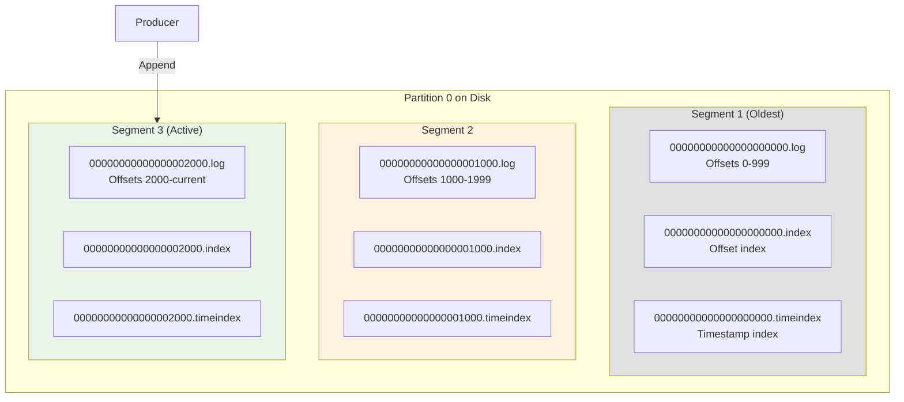
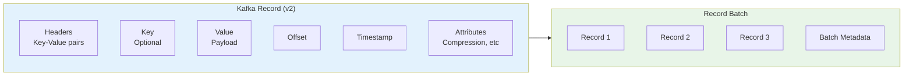
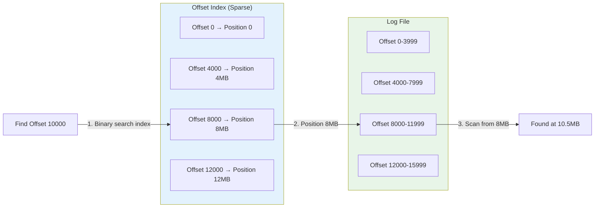
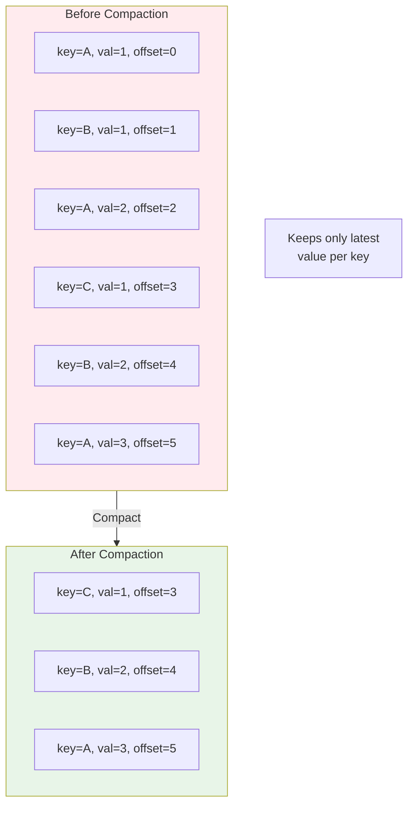

# Kafka Deep Dive - Part 5: Storage Internals and Log Management

Kafka's storage layer is the foundation of its performance and durability. Understanding log structure, segmentation, compaction, and indexing is essential for capacity planning and troubleshooting.

## Log Structure

### Partition as Commit Log



### Segment Anatomy

```kotlin
// Understanding Kafka segments

data class LogSegment(
    val baseOffset: Long,           // First offset in segment
    val logFile: String,             // .log file
    val indexFile: String,           // .index file
    val timeIndexFile: String,       // .timeindex file
    val txnIndexFile: String? = null // .txnindex file (if transactional)
)

fun explainSegments() {
    println("""
        Kafka Segment Structure:
        ========================

        What is a segment?
        ------------------
        - Partition divided into fixed-size segments
        - Each segment = separate files on disk
        - Only active segment accepts writes
        - Older segments are immutable (read-only)

        Segment files:
        --------------
        1. .log file - Actual message data
           - Format: offset, size, timestamp, key, value, headers
           - Append-only
           - Sequential writes (fast!)

        2. .index file - Offset → file position mapping
           - Sparse index (not every offset)
           - Binary format
           - Enables fast seeking

        3. .timeindex file - Timestamp → offset mapping
           - Find messages by time
           - Required for time-based queries

        4. .txnindex file - Transaction metadata (optional)
           - Tracks aborted transactions
           - Only if transactions used

        Example directory:
        ------------------
        /var/kafka-logs/orders-0/
        ├── 00000000000000000000.log        (1GB)
        ├── 00000000000000000000.index      (10MB)
        ├── 00000000000000000000.timeindex  (10MB)
        ├── 00000000000001000000.log        (1GB)
        ├── 00000000000001000000.index      (10MB)
        ├── 00000000000001000000.timeindex  (10MB)
        └── 00000000000002000000.log        (active segment)

        Segment naming:
        ---------------
        Filename = base offset (padded to 20 digits)
        - 00000000000000000000.log = offsets starting at 0
        - 00000000000001000000.log = offsets starting at 1,000,000

        Why segments?
        -------------
        1. Deletion efficiency
           - Delete old segment files (not individual messages)
           - O(1) operation vs scanning entire log

        2. Retention management
           - Time-based: Delete segments older than X
           - Size-based: Delete oldest when total > X

        3. Compaction efficiency
           - Compact segments independently
           - Parallelize compaction work

        4. File system limits
           - Avoid huge files (2GB limit on some systems)
           - Better OS cache management
    """.trimIndent())
}

// Segment configuration
fun segmentConfiguration() {
    println("""
        Segment Configuration:
        ======================

        1. segment.bytes (default: 1073741824 = 1GB)
           - Maximum size of segment before rolling
           - New segment when current reaches this size

           Too small (e.g., 100MB):
           - Too many files (file descriptor exhaustion)
           - More overhead
           - Faster deletion (smaller granularity)

           Too large (e.g., 10GB):
           - Slower deletion (coarse granularity)
           - Risk hitting file system limits
           - Longer retention than intended

           Recommended: 512MB - 1GB


        2. segment.ms (default: 604800000 = 7 days)
           - Maximum time before rolling segment
           - New segment even if not full

           Interaction with retention:
           retention.ms = 86400000 (1 day)
           segment.ms = 604800000 (7 days)

           Problem: Segments kept for 7 days (not 1!)
           Solution: segment.ms < retention.ms

           Rule: segment.ms ≤ retention.ms / 2


        3. segment.index.bytes (default: 10485760 = 10MB)
           - Maximum size of index file
           - Rarely needs tuning

           Too small: Coarse index (slower seeks)
           Too large: Memory waste


        4. segment.jitter.ms (default: 0)
           - Random delay before rolling segment
           - Prevents all partitions rolling simultaneously

           Use case: 1000 partitions
           - Without jitter: All roll at same time (I/O spike)
           - With jitter: Spread over time (smooth I/O)

           Recommended: 10-20% of segment.ms
    """.trimIndent())
}

// PITFALL: Segment rolling and retention
fun warnAboutSegmentRetention() {
    println("""
        ⚠️  SEGMENT RETENTION PITFALL
        ============================

        Problem:
        --------
        Segments deleted as atomic units
        Actual retention can exceed configured retention

        Example:
        --------
        Configuration:
        - retention.ms = 86400000 (1 day)
        - segment.ms = 604800000 (7 days)
        - segment.bytes = 1GB

        Scenario:
        Day 0: Segment A created (0-1GB)
        Day 7: Segment B created (1-2GB)
        Day 8: Segment A is 8 days old

        Expected: Segment A deleted (> 1 day)
        Reality: Segment A kept until fully beyond retention

        Actual retention: Up to segment.ms + retention.ms!

        Solution:
        ---------
        Set segment.ms = retention.ms / 2

        For retention.ms = 1 day:
        segment.ms = 43200000 (12 hours)

        This ensures segments roll at least twice during retention period
        Maximum actual retention: 1.5 days (acceptable)

        ⚠️  PITFALL: Active segment never deleted
        =========================================

        The active segment is NEVER deleted, even if old

        Scenario:
        - Low traffic topic
        - segment.bytes = 1GB
        - Partition only receives 1MB/day
        - Active segment never reaches 1GB
        - Active segment never rolls
        - Data retained forever!

        Solution:
        Set segment.ms to reasonable value (e.g., 1 day)
        Forces rollover even on low-traffic topics
    """.trimIndent())
}
```

## Message Format

### Record Structure



```kotlin
// Message format internals

fun explainMessageFormat() {
    println("""
        Kafka Message Format v2 (Kafka 0.11+):
        ======================================

        Record Batch (Header):
        ----------------------
        - Base Offset: First offset in batch
        - Batch Length: Total batch size
        - Partition Leader Epoch: For fencing
        - Magic: Format version (2)
        - CRC: Checksum
        - Attributes: Compression, timestamp type
        - Last Offset Delta: Last offset in batch
        - First Timestamp: Timestamp of first record
        - Max Timestamp: Timestamp of last record
        - Producer ID: For idempotence
        - Producer Epoch: For fencing
        - Base Sequence: For deduplication
        - Records Count: Number of records in batch

        Individual Record:
        ------------------
        - Length: Record size
        - Attributes: Reserved
        - Timestamp Delta: Offset from batch timestamp
        - Offset Delta: Offset from base offset
        - Key Length: -1 if null
        - Key: Optional
        - Value Length: -1 if null
        - Value: Message payload
        - Headers Count: Number of headers
        - Headers: Key-value pairs

        Size Optimization:
        ------------------
        Old format (v1): Each record has full metadata
        New format (v2): Batch-level metadata

        Example:
        100 records, 1KB each = 100KB payload

        v1 format: 100KB + (100 × 50B overhead) = 105KB
        v2 format: 100KB + (1 × 200B batch) + (100 × 10B) = 101.2KB

        Savings: 3.8KB (3.6%)
        More records = more savings!

        Compression Benefits:
        ---------------------
        v2 compresses entire batch (not individual records)
        - Better compression ratio
        - Single compress/decompress operation

        Example with Snappy:
        100 records × 1KB = 100KB uncompressed
        v2 batch compressed: 40KB (60% reduction)
        v1 individual: 60KB (40% reduction)

        ⚠️  PITFALL: Message size limits
        =================================

        max.message.bytes (broker default: 1048588 = ~1MB)
        - Maximum batch size (compressed)
        - Includes all headers and metadata

        If batch exceeds limit:
        - Producer gets RecordTooLargeException
        - Entire batch rejected (not individual records)

        Solutions:
        1. Reduce batch.size on producer
        2. Increase max.message.bytes on broker
        3. Split large messages (application level)
        4. Use references (store in S3, send link)

        Note: max.message.bytes is BATCH limit
        Individual record can be larger if batch compressed well
    """.trimIndent())
}

// Record overhead calculation
fun calculateOverhead() {
    val recordCount = 1000
    val avgRecordSize = 500 // bytes
    val batchHeaderSize = 61
    val recordOverheadV2 = 5 // per record

    val payloadSize = recordCount * avgRecordSize
    val totalOverhead = batchHeaderSize + (recordCount * recordOverheadV2)
    val totalSize = payloadSize + totalOverhead
    val overheadPercent = (totalOverhead.toDouble() / totalSize * 100)

    println("""
        Overhead Calculation:
        =====================
        Records: $recordCount
        Avg record size: $avgRecordSize bytes

        Payload: ${payloadSize / 1024}KB
        Overhead: ${totalOverhead / 1024}KB
        Total: ${totalSize / 1024}KB

        Overhead: ${String.format("%.2f", overheadPercent)}%

        Conclusion: Larger batches = lower overhead percentage
    """.trimIndent())
}
```

## Indexes

### Offset Index



```kotlin
// Index internals

fun explainIndexes() {
    println("""
        Kafka Index Structure:
        ======================

        Why sparse index?
        -----------------
        - Full index would be huge (1 entry per message)
        - Sparse index: 1 entry per N bytes
        - Trade-off: Index size vs seek speed

        Offset Index Entry:
        -------------------
        - Offset (relative to base): 4 bytes
        - Position in file: 4 bytes
        - Total: 8 bytes per entry

        Example:
        --------
        Segment: 1GB, index.interval.bytes=4096 (4KB)
        Index entries: 1GB / 4KB = 262,144 entries
        Index size: 262,144 × 8 bytes = 2MB

        Finding a message:
        ------------------
        Goal: Find offset 10,500 in segment base offset 0

        Step 1: Binary search in index
        - Index has entries for: 0, 4000, 8000, 12000, 16000...
        - Search finds: 8000 ≤ 10,500 < 12000
        - Return position: 8,388,608 (8MB)

        Step 2: Scan log from position
        - Seek to position 8MB in .log file
        - Scan records: 8000, 8001, 8002... 10,500
        - Find target at position 10,485,760

        Worst case: Scan 4KB of log file (one index interval)

        Time Index:
        -----------
        Similar to offset index but maps timestamp → offset

        Entry:
        - Timestamp (relative to base): 8 bytes
        - Offset (relative to base): 4 bytes
        - Total: 12 bytes per entry

        Use case: Consumer seeks to timestamp
        - Find offset for timestamp 1633024800000
        - Binary search time index
        - Get offset
        - Use offset index to find position

        Index Rebuilding:
        -----------------
        Indexes are derived (can be reconstructed from log)

        When rebuilt:
        - Broker starts (indexes in memory)
        - Index file corruption detected
        - After unclean shutdown

        Process:
        1. Scan entire .log file
        2. Create index entries every N bytes
        3. Write .index file

        Time: ~100MB/sec (depends on disk speed)
        For 1GB segment: ~10 seconds

        ⚠️  PITFALL: Index cache size
        ==============================
        Indexes loaded into memory for performance

        Configuration: index.cache.size (default: 512MB per broker)

        Problem:
        1000 partitions × 10 segments avg = 10,000 segments
        10,000 × 2MB index = 20GB needed
        Only 512MB cache = thrashing!

        Symptoms:
        - Slow consumer seeks
        - High disk I/O (reading indexes repeatedly)

        Solution:
        - Increase index.cache.size
        - Reduce partition count
        - Increase segment.bytes (fewer segments)

        Recommended: index.cache.size = num_partitions × 2MB
    """.trimIndent())
}

// Index configuration tuning
fun tuneIndexConfiguration() {
    val partitionCount = 1000
    val avgSegmentsPerPartition = 10
    val avgIndexSize = 2_000_000 // 2MB

    val totalIndexSize = partitionCount * avgSegmentsPerPartition * avgIndexSize
    val recommendedCacheSize = totalIndexSize

    println("""
        Index Cache Sizing:
        ===================
        Partitions: $partitionCount
        Avg segments per partition: $avgSegmentsPerPartition
        Avg index size: ${avgIndexSize / 1_000_000}MB

        Total index size: ${totalIndexSize / 1_000_000_000}GB
        Recommended cache: ${recommendedCacheSize / 1_000_000}MB

        Current default: 512MB
        ${if (recommendedCacheSize > 512_000_000) "⚠️  INSUFFICIENT!" else "✓ Adequate"}

        Add to server.properties:
        log.index.size.max.bytes=${recommendedCacheSize}
    """.trimIndent())
}
```

## Log Compaction

### Compaction Concept



```kotlin
// Log compaction explained

fun explainCompaction() {
    println("""
        Log Compaction:
        ===============

        Purpose:
        --------
        Keep only the latest value for each key
        Retain full history for recent messages
        Compress history for old messages

        Use Cases:
        ----------
        1. Database changelogs (CDC)
           - User table: Keep latest user state
           - Don't need every update, just current value

        2. Configuration updates
           - App config by ID
           - Only latest config matters

        3. Cache rebuilding
           - Product catalog
           - Rebuild cache from compacted log

        How it works:
        -------------
        Log divided into:
        - Clean section: Already compacted (head)
        - Dirty section: Not yet compacted (tail)

        Compaction process:
        1. Read dirty section
        2. Build map: key → latest offset
        3. Scan clean section
        4. Keep records if key's latest offset
        5. Write cleaned segment
        6. Replace old segment

        Example:
        --------
        Input:
        offset=0, key=user-1, value={name: "Alice", age: 25}
        offset=1, key=user-2, value={name: "Bob", age: 30}
        offset=2, key=user-1, value={name: "Alice", age: 26}
        offset=3, key=user-1, value={name: "Alice", age: 27}

        After compaction:
        offset=1, key=user-2, value={name: "Bob", age: 30}
        offset=3, key=user-1, value={name: "Alice", age: 27}

        Records 0, 2 deleted (superseded by 3)

        Configuration:
        --------------
        cleanup.policy=compact (or "delete,compact")

        min.cleanable.dirty.ratio=0.5 (default)
        - Wait until 50% of log is dirty
        - Lower value = more frequent compaction
        - Higher value = less compaction overhead

        delete.retention.ms=86400000 (default: 24 hours)
        - How long to keep delete markers (tombstones)
        - Allows consumers to see deletions

        segment.ms=604800000 (default: 7 days)
        - Active segment never compacted
        - Roll segment to enable compaction

        Tombstones (Delete marker):
        ---------------------------
        Send message with null value to delete key

        producer.send(ProducerRecord("users", "user-1", null))

        - Kept for delete.retention.ms
        - Then removed by compaction
        - All instances of key removed

        ⚠️  PITFALL: Compaction lag
        ============================

        Problem:
        Compaction not instantaneous

        Scenario:
        - Dirty ratio not met (only 30% dirty)
        - Compaction doesn't run
        - Old values retained longer than expected
        - Disk usage higher than anticipated

        Solution:
        - Lower min.cleanable.dirty.ratio (e.g., 0.1)
        - Monitor compaction lag metric
        - Ensure enough compaction threads

        ⚠️  PITFALL: Compaction and offsets
        ====================================

        After compaction, offset gaps exist!

        Before: offsets 0, 1, 2, 3, 4, 5
        After: offsets 1, 3, 5 (others deleted)

        Consumer seeking to offset 2:
        - Offset 2 doesn't exist
        - Consumer gets offset 3 (next available)
        - No error, but "jumped" offsets

        Implication:
        - Can't rely on contiguous offsets
        - Offset is logical position, not physical
    """.trimIndent())
}

// Compaction configuration
fun configureCompaction() {
    println("""
        Compaction Configuration Guide:
        ================================

        Aggressive Compaction (small logs, frequent updates):
        -----------------------------------------------------
        cleanup.policy=compact
        min.cleanable.dirty.ratio=0.1       # Compact at 10% dirty
        segment.ms=3600000                  # Roll every hour
        delete.retention.ms=3600000         # Keep tombstones 1 hour
        min.compaction.lag.ms=0             # Compact immediately

        Use case: Configuration service, small dataset


        Balanced Compaction (default, most use cases):
        -----------------------------------------------
        cleanup.policy=compact
        min.cleanable.dirty.ratio=0.5       # Compact at 50% dirty
        segment.ms=86400000                 # Roll daily
        delete.retention.ms=86400000        # Keep tombstones 1 day
        min.compaction.lag.ms=0

        Use case: User profiles, product catalog


        Conservative Compaction (large logs, batch updates):
        ----------------------------------------------------
        cleanup.policy=compact
        min.cleanable.dirty.ratio=0.7       # Compact at 70% dirty
        segment.ms=604800000                # Roll weekly
        delete.retention.ms=604800000       # Keep tombstones 1 week
        min.compaction.lag.ms=3600000       # Wait 1 hour before compact

        Use case: Database changelog, infrequent updates


        Hybrid (delete + compact):
        --------------------------
        cleanup.policy=delete,compact
        retention.ms=2592000000             # Delete after 30 days
        min.cleanable.dirty.ratio=0.5

        Use case: Keep recent history + compact old data
    """.trimIndent())
}

// Monitor compaction
fun monitorCompaction() {
    println("""
        Monitoring Compaction:
        ======================

        Key Metrics:
        ------------
        1. log-cleaner-records-cleaned-rate
           - Records cleaned per second
           - Should be > 0 for compacted topics

        2. log-cleaner-buffer-utilization
           - % of cleaner buffer used
           - High value = may need more memory

        3. max-dirty-percent
           - % of log that is dirty
           - Should oscillate (increase → compact → decrease)

        4. max-compaction-delay-secs
           - Time since last compaction
           - High value = compaction falling behind

        CLI Command:
        ------------
        kafka-log-dirs.sh --describe \\
          --bootstrap-server localhost:9092 \\
          --topic-list users \\
          --broker-list 0,1,2

        Troubleshooting:
        ----------------
        Symptom: Compaction not running

        Check:
        1. cleanup.policy=compact set?
        2. Active segment too new? (wait for segment.ms)
        3. Dirty ratio met? (check min.cleanable.dirty.ratio)
        4. Cleaner threads configured? (log.cleaner.threads)

        Increase cleaner threads:
        log.cleaner.threads=2 (default: 1)

        For many partitions, increase to 4-8
    """.trimIndent())
}
```

## Retention Policies

```kotlin
// Retention strategies

fun explainRetentionPolicies() {
    println("""
        Retention Policies:
        ===================

        1. Time-Based Retention:
        ------------------------
        retention.ms=604800000 (7 days)

        - Delete segments older than 7 days
        - Based on segment's largest timestamp
        - Common for time-series data

        Example:
        Monday: Segment A (offsets 0-1M)
        Tuesday: Segment B (offsets 1M-2M)
        Monday next week: Segment A deleted

        2. Size-Based Retention:
        ------------------------
        retention.bytes=107374182400 (100GB)

        - Keep max 100GB per partition
        - Delete oldest segments when exceeded
        - Common for space-constrained systems

        Example:
        Partition at 98GB
        New segment 5GB added
        Total: 103GB > 100GB limit
        Delete oldest segment (frees 3GB)
        Total: 100GB

        3. Compaction (covered earlier):
        --------------------------------
        cleanup.policy=compact

        - Keep latest value per key
        - Common for changelogs, state stores

        4. Hybrid (Time + Compaction):
        ------------------------------
        cleanup.policy=delete,compact
        retention.ms=2592000000 (30 days)

        - Compact data within 30 days
        - Delete data older than 30 days
        - Best of both worlds

        Retention Checker:
        ------------------
        Runs every retention.check.interval.ms (default: 300000 = 5 min)

        - Scans all segments
        - Deletes eligible segments
        - Low overhead operation

        ⚠️  PITFALL: Retention and active segment
        ==========================================

        Active segment NEVER deleted, regardless of age!

        Scenario:
        - retention.ms = 1 day
        - Low-traffic topic (1 message/day)
        - segment.bytes = 1GB
        - Active segment has 365 messages = 365KB
        - Active segment never rolls (doesn't reach 1GB)
        - Data retained for 365+ days!

        Solution:
        Set segment.ms to force rollover
        segment.ms = 86400000 (1 day)
        Now segments roll daily, deletion works correctly

        ⚠️  PITFALL: Retention and replication
        =======================================

        Retention independent per replica!

        Scenario:
        - Follower behind leader
        - Retention runs
        - Leader deletes old segments
        - Follower still has those segments
        - Follower catches up (fetches deleted offsets)
        - Error: OffsetOutOfRangeException

        Prevention:
        - Monitor replica lag
        - Ensure followers catch up before retention
        - Set replica.lag.time.max.ms appropriately
    """.trimIndent())
}

// Calculate retention needs
fun calculateRetentionNeeds(
    messagesPerSecond: Int,
    avgMessageSize: Int,
    retentionDays: Int
): RetentionRequirements {
    val messagesPerDay = messagesPerSecond * 86400L
    val bytesPerDay = messagesPerDay * avgMessageSize
    val totalMessages = messagesPerDay * retentionDays
    val totalBytes = bytesPerDay * retentionDays

    println("""
        Retention Calculation:
        ======================
        Input:
        - Messages/sec: $messagesPerSecond
        - Avg message size: $avgMessageSize bytes
        - Retention: $retentionDays days

        Output:
        - Messages/day: ${messagesPerDay / 1_000_000}M
        - Data/day: ${bytesPerDay / 1_000_000_000}GB
        - Total messages: ${totalMessages / 1_000_000}M
        - Total data: ${totalBytes / 1_000_000_000}GB

        Per partition (replication factor 3):
        - Disk per replica: ${totalBytes / 1_000_000_000}GB
        - Total cluster: ${totalBytes * 3 / 1_000_000_000}GB

        Recommendation:
        - Provision: ${totalBytes * 3 * 1.5 / 1_000_000_000}GB (with 50% buffer)
    """.trimIndent())

    return RetentionRequirements(totalMessages, totalBytes)
}

data class RetentionRequirements(
    val totalMessages: Long,
    val totalBytes: Long
)
```

## Performance Characteristics

```kotlin
// Storage performance insights

fun explainStoragePerformance() {
    println("""
        Why Kafka is Fast:
        ==================

        1. Sequential I/O:
        ------------------
        - All writes append to log (sequential)
        - No random writes
        - Sequential writes: 100MB/s+
        - Random writes: 1MB/s

        Modern disk sequential performance:
        - SSD: 500MB/s write, 550MB/s read
        - NVMe: 3000MB/s write, 3500MB/s read
        - HDD: 100MB/s write/read

        Kafka primarily uses sequential I/O = fast even on HDD!

        2. Page Cache:
        --------------
        - Kafka relies on OS page cache
        - Minimal heap usage for broker
        - OS caches hot data in RAM
        - Zero-copy transfer (sendfile syscall)

        Memory allocation:
        - Broker heap: 4-6GB
        - Page cache: Remaining RAM
        - For 64GB machine: 58-60GB page cache

        3. Zero-Copy:
        -------------
        Traditional path (4 copies):
        Disk → Kernel buffer → App buffer → Socket buffer → NIC

        Zero-copy path (0 copies to app):
        Disk → Kernel buffer → NIC

        Performance impact:
        - 3x faster for reads
        - Lower CPU usage
        - Higher throughput

        Note: Zero-copy disabled with SSL/TLS
        (Data must be encrypted in user space)

        4. Batching:
        ------------
        - Producer batches messages
        - Broker writes batch at once
        - Consumer fetches batches
        - Amortizes overhead

        Single message: 100 µs
        1000-message batch: 150 µs (1.5 µs per message)

        5. Compression:
        ---------------
        - Compress once at producer
        - Store compressed on disk
        - Transfer compressed over network
        - Decompress once at consumer

        Benefits:
        - Less disk I/O
        - Less network I/O
        - More data in page cache

        ⚠️  PITFALL: Disk type matters
        ===============================

        SSD vs HDD for Kafka:

        SSD Benefits:
        - Faster compaction
        - Faster index rebuilding
        - Better for time-sensitive seeks
        - Lower latency tail (p99, p999)

        HDD Benefits:
        - Much cheaper ($/GB)
        - Sequential writes still fast
        - Sufficient for most workloads

        Recommendation:
        - High-throughput batch: HDD okay
        - Low-latency transactional: SSD better
        - Hybrid: HDD for data, SSD for ZooKeeper/KRaft

        RAID Configuration:
        ===================
        - RAID 10: Best performance, 50% capacity
        - RAID 5/6: Better capacity, slower writes
        - JBOD: Good for Kafka (replication provides redundancy)

        Recommended: JBOD with separate disks
        - Distribute partitions across disks
        - Parallel I/O
        - Broker-level replication vs RAID

        File System:
        ============
        - XFS: Recommended
        - EXT4: Good alternative
        - Avoid: NFS, remote storage (too slow)
    """.trimIndent())
}
```

## Key Takeaways

- **Segments** are the unit of deletion and compaction - tune segment.bytes and segment.ms carefully
- **Indexes** are sparse for efficiency - loaded into memory for fast seeks
- **Log compaction** keeps latest value per key - essential for changelogs and state stores
- **Retention** policies (time/size/compaction) determine storage needs
- **Sequential I/O** and **page cache** are keys to Kafka's performance
- **Active segments** are never deleted - set segment.ms to force rollover on low-traffic topics

**Critical Pitfalls**:
- ⚠️ segment.ms > retention.ms causes retention violations
- ⚠️ Active segment never deleted on low-traffic topics
- ⚠️ Index cache too small causes thrashing
- ⚠️ Compaction lag from dirty ratio not met
- ⚠️ Offset gaps after compaction (expected behavior)
- ⚠️ Zero-copy disabled with SSL/TLS (performance impact)

## What's Next

In Part 6, we'll explore Kafka's internal components - the Controller, Group Coordinator, replication protocol details, and how these systems work together to provide Kafka's reliability guarantees.
