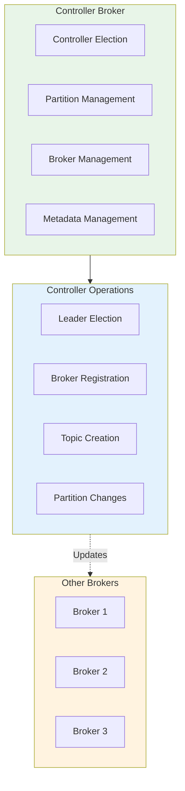
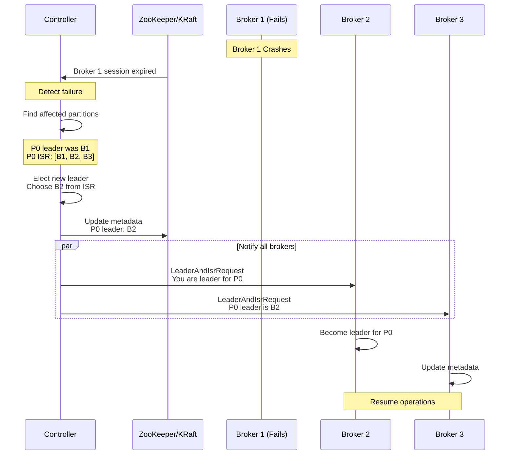
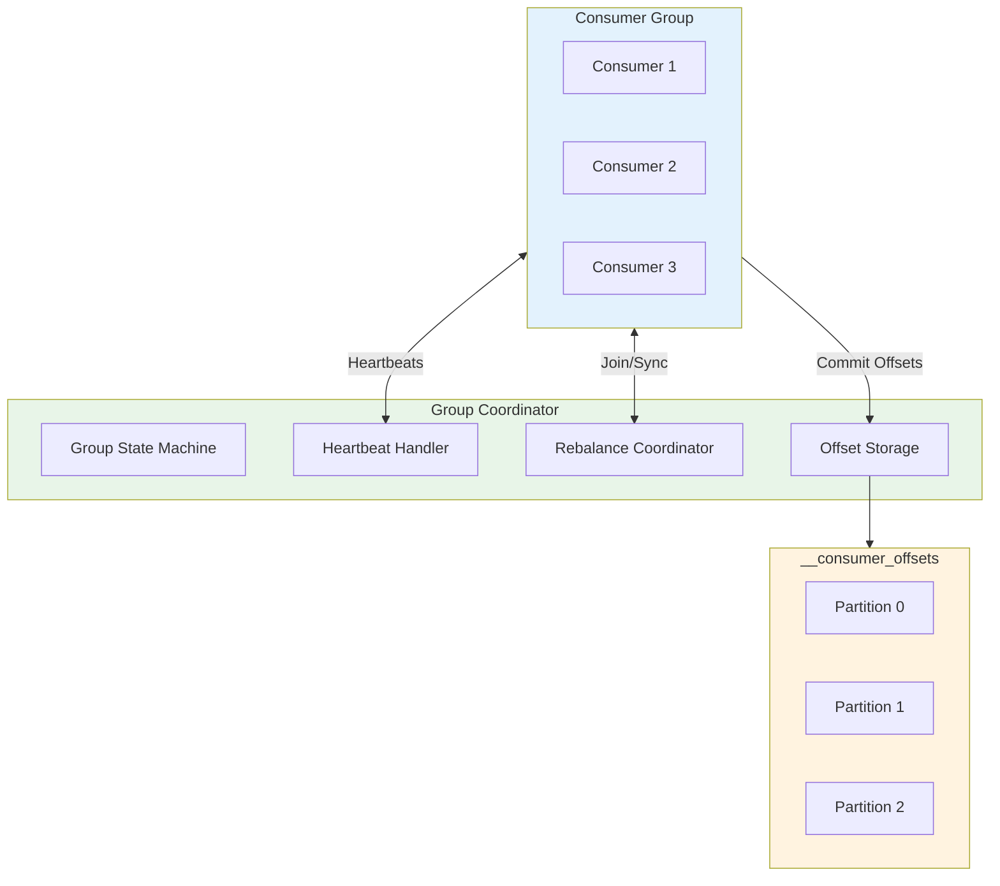
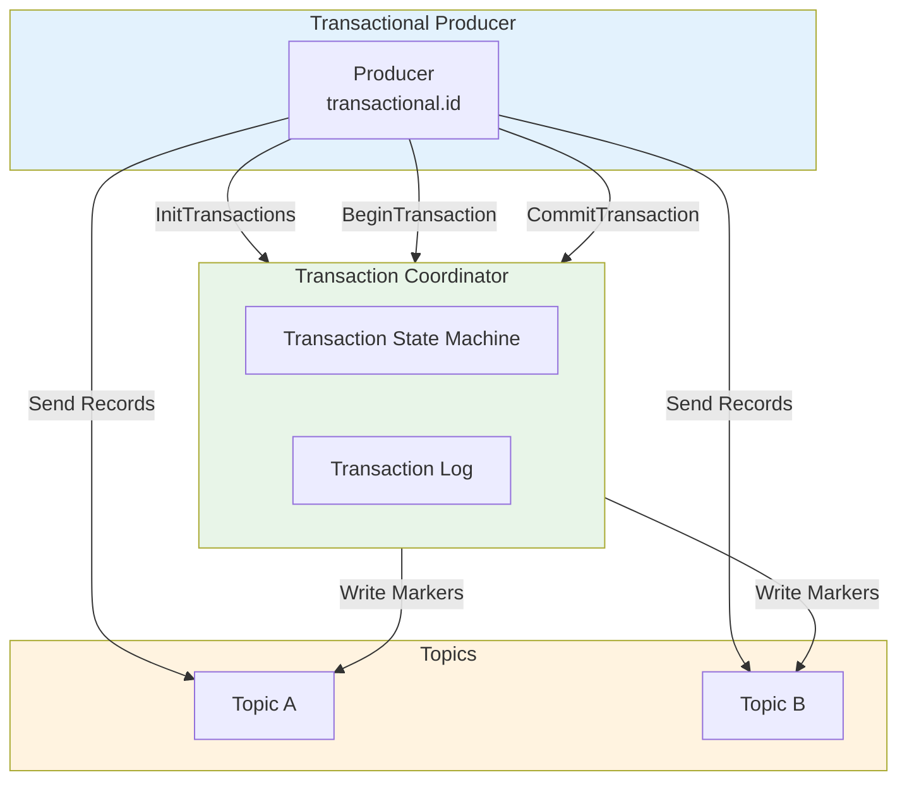
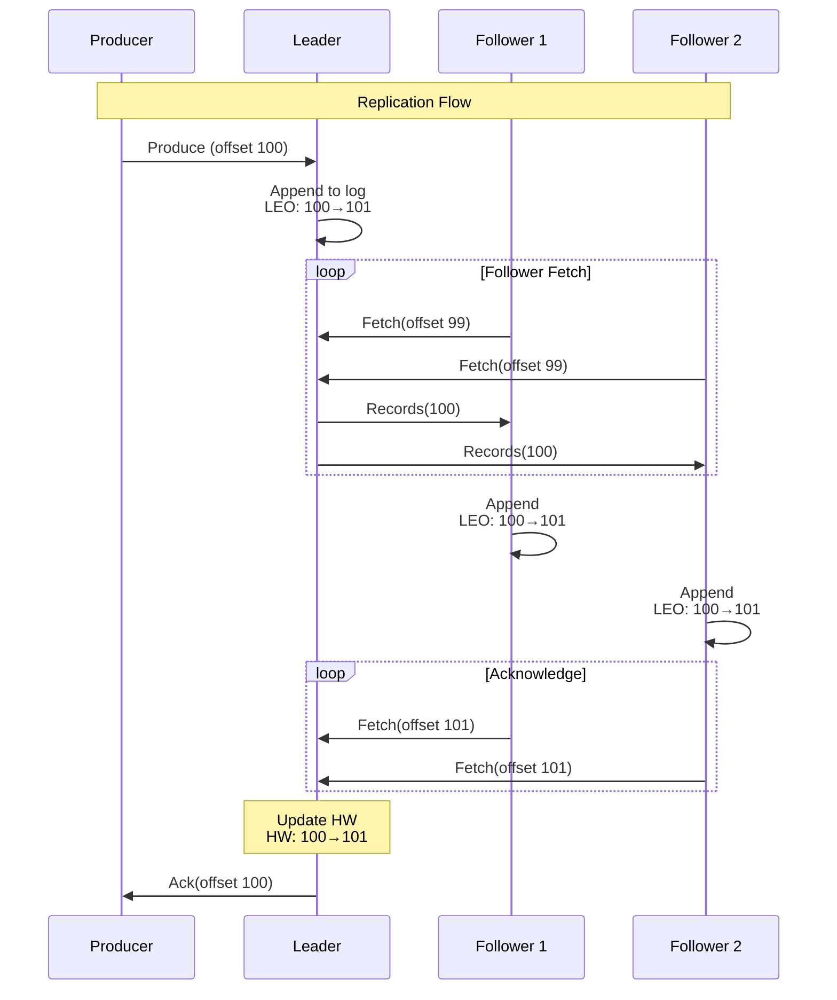

# Kafka Deep Dive - Part 6: Controller, Coordinators, and Internal Protocols

Kafka's reliability depends on sophisticated coordination systems. This tutorial explores the Controller, Group Coordinator, Transaction Coordinator, and the protocols that keep everything running smoothly.

## The Controller: Cluster Brain

### Controller Responsibilities



### Controller Election

```kotlin
// Controller election process

fun explainControllerElection() {
    println("""
        Controller Election:
        ====================

        What is the Controller?
        -----------------------
        - Special broker elected to manage cluster-wide operations
        - Only ONE controller in cluster at any time
        - All brokers compete, first to register wins

        ZooKeeper Mode:
        ---------------
        1. All brokers watch /controller node in ZooKeeper
        2. Node empty → election needed
        3. Brokers race to create ephemeral node
        4. First broker to create = Controller
        5. Others become followers

        Sequence:
        ```
        Broker 1: Create /controller → SUCCESS (becomes controller)
        Broker 2: Create /controller → FAIL (already exists)
        Broker 3: Create /controller → FAIL (already exists)
        ```

        KRaft Mode:
        -----------
        - Dedicated controller quorum (3 or 5 nodes)
        - Raft consensus for leader election
        - More predictable, faster failover

        Controller Epoch:
        -----------------
        - Increments with each new controller
        - Included in all controller requests
        - Prevents zombie controllers

        Example:
        - Controller 1 elected: Epoch 5
        - Controller 1 network partitioned
        - Controller 2 elected: Epoch 6
        - Controller 1 returns, sends request with Epoch 5
        - Brokers reject (current epoch is 6)
        - Controller 1 fenced out!

        ⚠️  PITFALL: Split-brain scenario
        ==================================

        Problem (rare in ZooKeeper mode):
        - Network partition between ZooKeeper and Controller
        - Controller thinks it's still leader
        - ZooKeeper elects new controller
        - TWO controllers active!

        Prevention:
        - Epoch numbers (fencing)
        - Proper ZooKeeper ensemble sizing (odd number: 3, 5, 7)
        - Network reliability

        KRaft eliminates this risk:
        - Raft consensus prevents split-brain
        - No dependency on external system
    """.trimIndent())
}

// Controller state machine
fun demonstrateControllerStateMachine() {
    println("""
        Controller State Machine:
        =========================

        States:
        -------
        1. NOT_CONTROLLER
           - Normal broker, not elected
           - Watches for controller changes

        2. CONTROLLER_ELECT
           - Just won election
           - Loading cluster state
           - Not yet operational

        3. ACTIVE_CONTROLLER
           - Fully operational
           - Handling cluster operations

        4. RESIGNING
           - Graceful shutdown
           - Handing off responsibilities

        Transitions:
        ------------
        NOT_CONTROLLER → CONTROLLER_ELECT
        - Won election

        CONTROLLER_ELECT → ACTIVE_CONTROLLER
        - Finished loading state

        ACTIVE_CONTROLLER → RESIGNING
        - Graceful shutdown OR higher epoch detected

        RESIGNING → NOT_CONTROLLER
        - Handoff complete

        Startup Sequence (ZooKeeper):
        ------------------------------
        1. Broker starts
        2. Register in /brokers/ids
        3. Attempt to create /controller
        4. If successful:
           a. Read all cluster metadata from ZooKeeper
           b. Build in-memory state
           c. Set up watchers
           d. Transition to ACTIVE_CONTROLLER
        5. If failed:
           a. Watch /controller for changes
           b. Remain in NOT_CONTROLLER

        Loading State (can take time on large clusters):
        - Topics: 10,000 topics
        - Partitions: 100,000 partitions
        - Brokers: 100 brokers
        - ACLs: 1,000 ACLs

        Load time: 10-60 seconds (depends on cluster size)

        During this time: NO controller operations!
        - No leader elections
        - No topic creation
        - No partition reassignment

        ⚠️  PITFALL: Controller failover window
        ========================================

        During controller election and state loading:
        - Cluster in degraded state
        - Cannot handle broker failures
        - Cannot elect new partition leaders

        For large clusters (100k+ partitions):
        - Controller load time: 60+ seconds
        - Extended unavailability window

        Mitigation:
        - Reduce partition count
        - Upgrade to KRaft (faster)
        - Optimize controller.socket.timeout.ms
    """.trimIndent())
}
```

### Controller Operations



```kotlin
// Controller operations explained

fun explainControllerOperations() {
    println("""
        Controller Responsibilities:
        ============================

        1. Partition Leader Election:
        ------------------------------
        Triggered by:
        - Broker failure
        - Preferred leader election
        - Partition reassignment
        - ISR shrinkage below min.insync.replicas

        Process:
        a. Detect trigger event
        b. Identify affected partitions
        c. Select new leader from ISR
        d. Update metadata in ZooKeeper/KRaft
        e. Send LeaderAndIsrRequest to all brokers
        f. Wait for broker acknowledgments

        Election algorithm:
        - Select first replica in ISR list
        - If no ISR and unclean.leader.election.enable=true:
          Select first replica (DATA LOSS risk!)

        2. Broker Registration:
        ------------------------
        New broker joins:
        a. Broker registers in /brokers/ids
        b. Controller detects new broker
        c. Controller sends UpdateMetadataRequest
        d. Broker receives full cluster metadata
        e. Broker ready to serve

        3. Topic Creation/Deletion:
        ----------------------------
        Create topic:
        a. Admin client sends CreateTopicsRequest
        b. Controller writes to /brokers/topics
        c. Controller assigns partitions to brokers
        d. Controller elects partition leaders
        e. Controller sends LeaderAndIsrRequest
        f. Brokers create partition directories

        Delete topic:
        a. Admin client sends DeleteTopicsRequest
        b. Controller marks topic for deletion
        c. Controller sends StopReplicaRequest (delete=true)
        d. Brokers delete partition data
        e. Controller removes topic metadata

        ⚠️  Deletion is asynchronous!
        May take minutes for large topics

        4. Partition Reassignment:
        --------------------------
        Moving partitions between brokers:
        a. Admin triggers reassignment
        b. Controller adds new replicas
        c. New replicas catch up (sync from leader)
        d. Controller waits for new replicas in ISR
        e. Controller updates leader/ISR
        f. Controller removes old replicas
        g. Old brokers delete data

        Time: Depends on data size and network
        - 1GB partition: ~10 seconds
        - 100GB partition: ~20 minutes

        5. ISR Management:
        ------------------
        Controller monitors ISR:
        - Follower falls behind → Remove from ISR
        - Follower catches up → Add to ISR

        Shrinkage:
        - Partition P0: ISR = [1, 2, 3]
        - Broker 3 falls behind
        - Controller: ISR = [1, 2]
        - If min.insync.replicas=2: Still writable
        - If min.insync.replicas=3: Becomes read-only!

        Expansion:
        - Broker 3 catches up
        - Controller: ISR = [1, 2, 3]
        - Partition fully redundant again

        ⚠️  PITFALL: Controller bottleneck
        ===================================

        Large clusters (100k+ partitions):
        - Controller handles ALL partition state changes
        - Single-threaded processing (in ZooKeeper mode)
        - Can become bottleneck

        Symptoms:
        - Slow leader elections (minutes instead of seconds)
        - Delayed partition reassignments
        - Slow topic creation

        Monitoring:
        - controller-event-queue-size (should be near 0)
        - leader-election-rate
        - partition-reassignment-time

        Solutions:
        - Reduce partition count
        - Upgrade to KRaft (multi-threaded controller)
        - Increase controller.socket.timeout.ms
        - Batch operations when possible
    """.trimIndent())
}

// Controller metrics
fun monitorController() {
    println("""
        Controller Monitoring:
        ======================

        Critical Metrics:
        -----------------
        1. ActiveControllerCount
           - Should be exactly 1 in cluster
           - 0 = no controller (election in progress)
           - 2+ = split-brain (CRITICAL!)

        2. OfflinePartitionsCount
           - Partitions with no leader
           - Should be 0
           - > 0 = unavailable partitions

        3. PreferredReplicaImbalanceCount
           - Partitions not on preferred leader
           - Increases after broker failures
           - Run preferred leader election to fix

        4. GlobalPartitionCount
           - Total partitions in cluster
           - Monitor growth

        5. GlobalTopicCount
           - Total topics in cluster

        6. LeaderElectionRateAndTimeMs
           - How fast leader elections complete
           - Slow = controller overload

        Alerts:
        -------
        CRITICAL:
        - ActiveControllerCount != 1
        - OfflinePartitionsCount > 0

        WARNING:
        - LeaderElectionTime > 5000ms
        - PreferredReplicaImbalanceCount > 10%
        - GlobalPartitionCount > 100,000

        CLI Commands:
        -------------
        # Check controller
        kafka-metadata.sh --snapshot \\
          /var/kafka-metadata/__cluster_metadata-0/*.snapshot \\
          --print

        # Trigger preferred leader election
        kafka-leader-election.sh \\
          --bootstrap-server localhost:9092 \\
          --election-type PREFERRED \\
          --all-topic-partitions
    """.trimIndent())
}
```

## Group Coordinator

### Consumer Group Coordination



```kotlin
// Group Coordinator internals

fun explainGroupCoordinator() {
    println("""
        Group Coordinator:
        ==================

        Purpose:
        --------
        - Manage consumer group membership
        - Coordinate rebalancing
        - Store committed offsets

        Coordinator Selection:
        ----------------------
        Each group assigned to specific broker:

        coordinator = hash(group_id) % num_partitions(__consumer_offsets)

        __consumer_offsets has 50 partitions (default)
        Group "my-group" hashes to partition 23
        Partition 23 leader = Coordinator for "my-group"

        Advantage:
        - Distributed coordination
        - No single point of failure
        - Load balanced across brokers

        Group States:
        -------------
        1. Empty
           - No members
           - Created when first consumer joins

        2. PreparingRebalance
           - Rebalance triggered
           - Waiting for all members to rejoin

        3. CompletingRebalance
           - All members joined
           - Waiting for assignment sync

        4. Stable
           - All members have assignments
           - Normal operation

        5. Dead
           - All members left
           - Group marked for deletion (after 7 days default)

        State Transitions:
        ------------------
        Empty → PreparingRebalance (first consumer joins)
        PreparingRebalance → CompletingRebalance (all members rejoined)
        CompletingRebalance → Stable (assignments synced)
        Stable → PreparingRebalance (member joins/leaves)
        Stable/Empty → Dead (all members leave)

        Rebalance Protocol:
        -------------------
        Step 1: JoinGroup
        - Consumer sends JoinGroupRequest
        - Coordinator waits for all members (timeout: session.timeout.ms)
        - First member = group leader

        Step 2: SyncGroup
        - Leader computes partition assignment
        - Leader sends SyncGroupRequest with assignment
        - Coordinator distributes assignments
        - All members receive their partitions

        Step 3: Heartbeats
        - Members send periodic heartbeats (heartbeat.interval.ms)
        - Coordinator tracks liveness
        - Missing heartbeats → member evicted

        ⚠️  PITFALL: Frequent rebalancing
        ==================================

        Causes:
        1. session.timeout.ms too low
           - Consumer can't send heartbeat in time
           - Kicked from group
           - Rejoins, triggers rebalance

        2. max.poll.interval.ms exceeded
           - Consumer processing too slow
           - Doesn't call poll() in time
           - Coordinator assumes dead

        3. Consumer crashes/restarts
           - Deployment, OOM, bugs
           - Each restart = rebalance

        Impact:
        - Processing stops during rebalance
        - Duplicate processing (uncommitted offsets)
        - Poor throughput

        Detection:
        - Monitor rebalance-rate metric
        - Should be near 0 for stable groups
        - Spikes indicate instability

        Solutions:
        - Increase session.timeout.ms (45s+)
        - Increase max.poll.interval.ms (5 min+)
        - Reduce max.poll.records (faster processing)
        - Fix consumer stability issues
    """.trimIndent())
}

// Offset storage internals
fun explainOffsetStorage() {
    println("""
        Offset Storage:
        ===============

        __consumer_offsets Topic:
        --------------------------
        - Internal compacted topic
        - Stores committed offsets
        - 50 partitions (default)
        - Replication factor 3 (recommended)

        Message Format:
        ---------------
        Key:
        - Version
        - Group ID
        - Topic
        - Partition

        Value:
        - Offset
        - Metadata (optional)
        - Commit timestamp
        - Expiration timestamp

        Example:
        ```kotlin
        Key: {
          version: 1,
          group: "my-group",
          topic: "orders",
          partition: 0
        }
        Value: {
          offset: 12345,
          metadata: "",
          timestamp: 1633024800000
        }
        ```

        Compaction:
        -----------
        - Keeps latest offset per (group, topic, partition)
        - Old offsets automatically removed
        - Tombstones (null value) delete offsets

        Offset Commit Flow:
        -------------------
        1. Consumer commits offset 12345
        2. Message written to __consumer_offsets
        3. Partition = hash(group_id) % 50
        4. Message replicated (acks=all)
        5. Committed offset durable

        Offset Fetch Flow:
        ------------------
        1. Consumer joins group
        2. Receives partition assignment
        3. Fetches committed offset from coordinator
        4. Coordinator reads from __consumer_offsets
        5. Consumer positions to committed offset
        6. Start consuming

        Offset Retention:
        -----------------
        Configuration: offsets.retention.minutes (default: 10080 = 7 days)

        - Offsets for inactive groups deleted after 7 days
        - Active groups: Offsets never deleted
        - Inactive = no consumers in group

        ⚠️  PITFALL: Offset retention
        ==============================

        Scenario:
        - Consumer group "analytics" processes daily
        - Runs for 1 hour, then stops
        - Inactive for 23 hours/day
        - After 7 days: Offsets deleted
        - Next run: Starts from auto.offset.reset (beginning/latest)
        - Reprocesses data OR skips data!

        Solution:
        - Keep at least one consumer running (sends heartbeats)
        - Increase offsets.retention.minutes
        - Use external offset storage
        - Commit offsets during processing (extends retention)

        Monitoring:
        -----------
        # View consumer group state
        kafka-consumer-groups.sh --bootstrap-server localhost:9092 \\
          --describe --group my-group

        Output:
        GROUP           TOPIC      PARTITION  CURRENT-OFFSET  LOG-END-OFFSET  LAG
        my-group        orders     0          12345          12350          5
        my-group        orders     1          12300          12300          0
    """.trimIndent())
}
```

## Transaction Coordinator



```kotlin
// Transaction Coordinator explained

fun explainTransactionCoordinator() {
    println("""
        Transaction Coordinator:
        ========================

        Purpose:
        --------
        - Manage transactional producers
        - Coordinate atomic writes across partitions
        - Ensure exactly-once semantics

        Coordinator Selection:
        ----------------------
        Similar to group coordinator:

        coordinator = hash(transactional_id) % num_partitions(__transaction_state)

        __transaction_state has 50 partitions (default)
        Each partition leader = coordinator for its transactions

        Transaction Log:
        ----------------
        - Topic: __transaction_state
        - 50 partitions (default)
        - Stores transaction metadata
        - Compacted (keeps latest state)

        Producer ID (PID) and Epoch:
        ----------------------------
        - Each transactional producer gets unique PID
        - Epoch prevents zombie producers
        - Increments when producer restarts

        Example:
        - Producer 1 starts: PID=100, Epoch=0
        - Producer 1 crashes
        - Producer 1 restarts: PID=100, Epoch=1
        - Old instance with Epoch=0 fenced out

        Transaction States:
        -------------------
        1. Empty - No active transaction
        2. Ongoing - Transaction in progress
        3. PrepareCommit - Committing
        4. PrepareAbort - Aborting
        5. CompleteCommit - Committed
        6. CompleteAbort - Aborted

        Commit Protocol:
        ----------------
        Step 1: BeginTransaction
        - Producer starts transaction
        - Coordinator marks state: Ongoing

        Step 2: Send Records
        - Producer writes to multiple partitions
        - Records marked with PID + Epoch

        Step 3: CommitTransaction
        - Producer requests commit
        - Coordinator: State = PrepareCommit
        - Write to transaction log (durable)

        Step 4: Write Control Markers
        - Coordinator writes COMMIT markers to all partitions
        - Markers indicate transaction boundary

        Step 5: Complete
        - All markers written
        - Coordinator: State = CompleteCommit
        - Transaction log updated

        Abort Protocol:
        ---------------
        Similar to commit, but writes ABORT markers
        - Consumers skip aborted records
        - Ensures atomicity

        Read Committed Isolation:
        --------------------------
        Consumers with isolation.level=read_committed:
        - Only read up to last stable offset (LSO)
        - LSO = earliest transaction start in partition
        - Skip aborted transactions

        Example:
        Offsets: 0, 1, 2(TX1), 3(TX1), 4, 5(TX2-aborted), 6(TX2-aborted), 7
        Markers: offset 8 (TX1-COMMIT), offset 9 (TX2-ABORT)

        Consumer sees: 0, 1, 2, 3, 4, 7
        (Skips 5, 6 from aborted TX2)

        ⚠️  PITFALL: Transaction timeout
        =================================

        Configuration: transaction.timeout.ms (default: 60000 = 1 min)

        - Maximum time for transaction
        - If exceeded: Coordinator aborts automatically

        Scenario:
        - Producer begins transaction
        - Processing takes 2 minutes
        - Transaction timeout = 1 minute
        - Coordinator aborts transaction
        - Producer's commit fails!

        Solution:
        - Set transaction.timeout.ms > processing time
        - Typical: 300000 (5 minutes)
        - Maximum: 900000 (15 minutes)

        ⚠️  PITFALL: Transactional.id uniqueness
        =========================================

        CRITICAL: transactional.id must be unique per producer instance

        Wrong:
        - Multiple instances with same transactional.id
        - Zombie fencing conflicts
        - Transaction failures

        Right:
        - Include instance ID in transactional.id
        - Example: "order-processor-instance-1"
        - Each instance gets unique ID

        Kubernetes StatefulSet:
        - Pod 0: transactional.id = "processor-0"
        - Pod 1: transactional.id = "processor-1"
        - Pod 2: transactional.id = "processor-2"

        Monitoring:
        -----------
        Metrics:
        - transaction-start-rate
        - transaction-commit-rate
        - transaction-abort-rate
        - transaction-duration

        Healthy:
        - commit-rate ≈ start-rate
        - abort-rate ≈ 0
        - duration < timeout

        CLI:
        kafka-transactions.sh --bootstrap-server localhost:9092 \\
          --describe --transactional-id my-tx-id
    """.trimIndent())
}
```

## Replication Protocol Details



```kotlin
// Replication protocol internals

fun explainReplicationProtocol() {
    println("""
        Replication Protocol:
        =====================

        Pull-Based Replication:
        -----------------------
        - Followers PULL from leader (not pushed)
        - Continuous polling (replica.fetch.wait.max.ms)
        - Leader doesn't track followers

        Benefits:
        - Simpler leader logic
        - Followers control pace
        - More scalable

        Fetch Request Contents:
        -----------------------
        - Replica ID (follower broker ID)
        - Fetch offset (what follower has)
        - Max bytes to fetch

        Fetch Response:
        ---------------
        - Records (if available)
        - High Water Mark (HW)
        - Log End Offset (LEO)

        High Water Mark (HW):
        ---------------------
        HW = min(LEO of all ISR replicas)

        Example:
        - Leader LEO: 105
        - Follower 1 LEO: 103
        - Follower 2 LEO: 105
        - ISR: [Leader, F1, F2]
        - HW = min(105, 103, 105) = 103

        Consumers can only read up to HW (103)
        Records 104-105 exist but not yet consumable

        ISR Tracking:
        -------------
        Leader tracks each follower's fetch offset:
        - Follower fetches offset X
        - Leader knows: Follower has offsets 0 to X-1

        If follower stops fetching:
        - Leader detects lag > replica.lag.time.max.ms
        - Remove from ISR
        - Update HW (may decrease!)

        Example:
        Initial: ISR=[L, F1, F2], HW=100
        F2 falls behind (last fetch 30s ago)
        replica.lag.time.max.ms = 10s
        Leader: ISR=[L, F1], HW=min(105, 103)=103

        Catching Up:
        ------------
        Follower out of ISR wants back in:
        1. Catch up to leader LEO
        2. Fetch at leader's LEO for replica.lag.time.max.ms
        3. Leader adds back to ISR
        4. HW updated

        ⚠️  PITFALL: Under-replicated partitions
        =========================================

        Under-replicated = Replicas < Replication Factor

        Causes:
        - Broker down
        - Disk failure
        - Slow follower removed from ISR

        Impact:
        - Reduced fault tolerance
        - If leader fails, data loss risk

        Example:
        RF=3, ISR=[L, F1, F2]
        F2 removed: ISR=[L, F1] (under-replicated!)
        If L fails and F1 fails: DATA LOSS

        Monitoring:
        - UnderReplicatedPartitions metric
        - Should be 0
        - Alert if > 0

        ⚠️  PITFALL: Replication throttling
        ====================================

        Large partition reassignments can saturate network

        Throttling:
        - Limit replication bandwidth
        - Prevents impacting production traffic

        Configuration:
        leader.replication.throttled.rate=10485760 (10 MB/s)
        follower.replication.throttled.rate=10485760

        Trade-off:
        - Lower throttle: Slower reassignment
        - Higher throttle: Network saturation

        Balance: Set to 50% of available bandwidth
    """.trimIndent())
}
```

## Key Takeaways

- **Controller** manages cluster-wide operations - single point of coordination (one per cluster)
- **Group Coordinator** handles consumer groups - distributed across brokers by group ID hash
- **Transaction Coordinator** enables exactly-once semantics - manages transactional producers
- **Replication protocol** is pull-based - followers fetch from leaders continuously
- **High Water Mark** determines consumer visibility - only fully replicated data is consumable
- **Epochs and fencing** prevent split-brain and zombie instances

**Critical Pitfalls**:
- ⚠️ Controller bottleneck on large clusters (100k+ partitions)
- ⚠️ Offset retention can delete offsets for inactive groups
- ⚠️ Transaction timeout must exceed processing time
- ⚠️ Duplicate transactional.id across instances causes conflicts
- ⚠️ Under-replicated partitions reduce fault tolerance
- ⚠️ Rebalance storms from timeout misconfigurations

## What's Next

In Part 7, we'll explore performance optimization, scalability, and capacity planning - how to size your cluster, tune for throughput vs latency, and scale Kafka to handle massive workloads.
