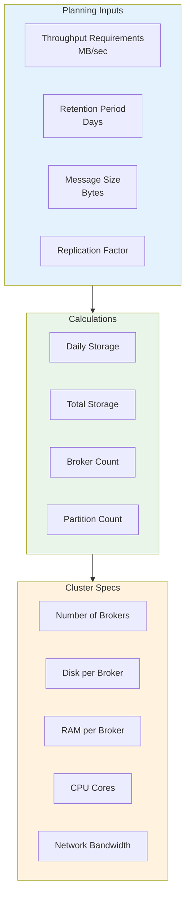
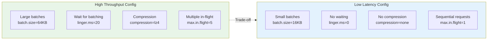
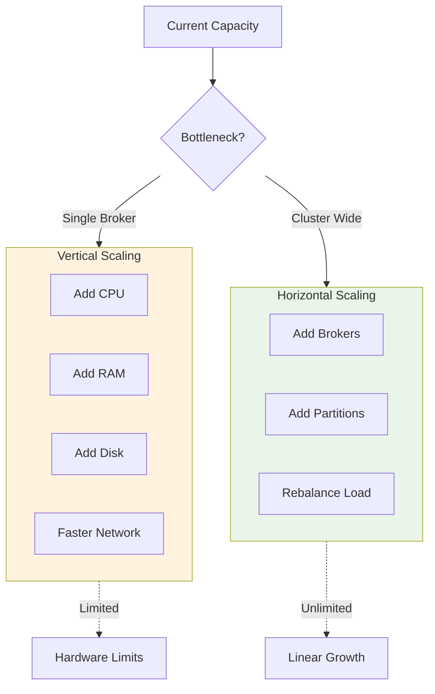

# Kafka Deep Dive - Part 7: Performance, Scalability, and Capacity Planning

Optimizing Kafka for performance and planning capacity correctly is crucial for production success. This tutorial covers sizing, tuning, scaling strategies, and comprehensive monitoring.

## Capacity Planning

### Sizing Methodology



```kotlin
// Comprehensive capacity planning

data class WorkloadRequirements(
    val peakThroughputMBps: Int,          // Peak throughput in MB/s
    val avgThroughputMBps: Int,           // Average throughput
    val retentionDays: Int,               // Data retention period
    val avgMessageSizeBytes: Int,         // Average message size
    val replicationFactor: Int = 3,       // Replication factor
    val expectedGrowth: Double = 1.5      // Growth multiplier
)

data class ClusterSizing(
    val brokerCount: Int,
    val diskPerBrokerGB: Int,
    val ramPerBrokerGB: Int,
    val cpuCores: Int,
    val networkGbps: Int,
    val partitionCount: Int
)

fun calculateClusterSize(req: WorkloadRequirements): ClusterSizing {
    // 1. Storage calculations
    val messagesPerDay = (req.avgThroughputMBps * 1_000_000.0 * 86400) / req.avgMessageSizeBytes
    val dataPerDayGB = req.avgThroughputMBps * 86400 / 1024.0
    val totalDataGB = (dataPerDayGB * req.retentionDays * req.replicationFactor).toInt()
    val withGrowth = (totalDataGB * req.expectedGrowth).toInt()

    // 2. Throughput-based broker count
    val brokerThroughputMBps = 100  // Conservative: 100 MB/s per broker
    val brokersForThroughput = (req.peakThroughputMBps * req.replicationFactor / brokerThroughputMBps.toDouble()).toInt() + 1

    // 3. Storage-based broker count
    val diskPerBrokerGB = 2000  // 2TB per broker (with buffer)
    val brokersForStorage = (withGrowth / diskPerBrokerGB.toDouble()).toInt() + 1

    // 4. Final broker count (max of both)
    val brokerCount = maxOf(brokersForThroughput, brokersForStorage, 3)  // Minimum 3

    // 5. Partition count
    val partitionThroughputMBps = 10  // 10 MB/s per partition
    val partitionsForThroughput = (req.peakThroughputMBps / partitionThroughputMBps.toDouble()).toInt()
    val partitionsForParallelism = brokerCount * 10  // 10 partitions per broker
    val partitionCount = maxOf(partitionsForThroughput, partitionsForParallelism)

    // 6. Resource calculations
    val diskPerBroker = withGrowth / brokerCount
    val ramPerBroker = 64  // 64GB recommended
    val cpuCores = 16      // 16 cores recommended
    val networkGbps = 10   // 10 Gbps network

    println("""
        Capacity Planning Results:
        ==========================

        Workload:
        - Peak throughput: ${req.peakThroughputMBps} MB/s
        - Average throughput: ${req.avgThroughputMBps} MB/s
        - Retention: ${req.retentionDays} days
        - Replication factor: ${req.replicationFactor}

        Storage:
        - Data per day: ${String.format("%.0f", dataPerDayGB)} GB
        - Total data (RF=${req.replicationFactor}): ${totalDataGB} GB
        - With growth (${req.expectedGrowth}x): ${withGrowth} GB

        Cluster Sizing:
        - Brokers: $brokerCount (${brokersForThroughput} for throughput, ${brokersForStorage} for storage)
        - Disk per broker: ${diskPerBroker} GB
        - RAM per broker: ${ramPerBroker} GB
        - CPU cores: ${cpuCores}
        - Network: ${networkGbps} Gbps
        - Partitions: ${partitionCount}

        Per Broker Capacity:
        - Throughput: ${req.peakThroughputMBps / brokerCount} MB/s
        - Partitions: ${partitionCount / brokerCount}
        - Data: ${diskPerBroker} GB
    """.trimIndent())

    return ClusterSizing(
        brokerCount = brokerCount,
        diskPerBrokerGB = diskPerBroker,
        ramPerBrokerGB = ramPerBroker,
        cpuCores = cpuCores,
        networkGbps = networkGbps,
        partitionCount = partitionCount
    )
}

// Real-world examples
fun capacityPlanningExamples() {
    println("Example 1: High-Throughput Logging")
    println("=" * 40)
    calculateClusterSize(
        WorkloadRequirements(
            peakThroughputMBps = 500,      // 500 MB/s peak
            avgThroughputMBps = 300,       // 300 MB/s average
            retentionDays = 7,             // 1 week retention
            avgMessageSizeBytes = 1024,    // 1KB messages
            replicationFactor = 3
        )
    )

    println("\n\nExample 2: Event Streaming Platform")
    println("=" * 40)
    calculateClusterSize(
        WorkloadRequirements(
            peakThroughputMBps = 200,      // 200 MB/s peak
            avgThroughputMBps = 100,       // 100 MB/s average
            retentionDays = 30,            // 30 days retention
            avgMessageSizeBytes = 2048,    // 2KB messages
            replicationFactor = 3
        )
    )

    println("\n\nExample 3: Database CDC (Change Data Capture)")
    println("=" * 40)
    calculateClusterSize(
        WorkloadRequirements(
            peakThroughputMBps = 50,       // 50 MB/s peak
            avgThroughputMBps = 20,        // 20 MB/s average
            retentionDays = 90,            // 90 days retention
            avgMessageSizeBytes = 512,     // 512B messages
            replicationFactor = 3
        )
    )
}

// PITFALL: Common sizing mistakes
fun warnAboutSizingPitfalls() {
    println("""
        ⚠️  CAPACITY PLANNING PITFALLS
        ==============================

        Pitfall 1: Using average instead of peak
        -----------------------------------------
        Wrong: Size for average throughput
        - Works during normal times
        - Fails during spikes
        - Data loss or producer blocking

        Right: Size for peak throughput (+ headroom)
        - Handle traffic spikes
        - Add 50-100% buffer

        Pitfall 2: Forgetting replication factor
        -----------------------------------------
        Storage calculation must include RF:
        - 1TB/day data
        - RF=3
        - Actual storage: 3TB/day (not 1TB!)

        Pitfall 3: Ignoring growth
        --------------------------
        - Cluster grows over time
        - Add 50-100% growth buffer
        - Easier to over-provision than migrate

        Pitfall 4: Too many partitions
        ------------------------------
        - >100 partitions per broker = overhead
        - Controller slowdown
        - Longer failover times

        Rule: <100 partitions per broker

        Pitfall 5: Undersizing RAM
        --------------------------
        - Kafka relies on page cache
        - Minimum: 8GB heap + 32GB page cache
        - Recommended: 64GB total RAM

        Pitfall 6: Slow disks
        ---------------------
        - HDD acceptable for throughput
        - SSD better for latency
        - NVMe for ultra-low latency
        - Never use network storage (NFS, EBS gp2)

        Pitfall 7: Network bottleneck
        -----------------------------
        - Replication multiplies network traffic
        - 100 MB/s writes = 300 MB/s network (RF=3)
        - 1 Gbps insufficient for high throughput
        - Recommend: 10 Gbps network
    """.trimIndent())
}
```

## Performance Tuning

### Throughput vs Latency Trade-offs



```kotlin
// Performance tuning profiles

object KafkaPerformanceProfiles {

    // Profile 1: Maximum Throughput
    fun highThroughputBroker() = mapOf(
        // Network threads
        "num.network.threads" to "16",          // 2x CPU cores
        "num.io.threads" to "16",               // Match disk count × 2

        // Socket buffers
        "socket.send.buffer.bytes" to "1048576",      // 1MB
        "socket.receive.buffer.bytes" to "1048576",
        "socket.request.max.bytes" to "104857600",    // 100MB

        // Replica fetching
        "num.replica.fetchers" to "8",          // Parallel fetchers
        "replica.fetch.max.bytes" to "10485760", // 10MB

        // Log flush (let OS handle it)
        "log.flush.interval.messages" to "Long.MAX_VALUE",
        "log.flush.interval.ms" to "Long.MAX_VALUE",

        // Compression
        "compression.type" to "producer"         // Inherit from producer
    )

    fun highThroughputProducer() = mapOf(
        "batch.size" to "65536",                // 64KB
        "linger.ms" to "20",                    // Wait 20ms
        "compression.type" to "lz4",            // Fast compression
        "buffer.memory" to "67108864",          // 64MB
        "max.in.flight.requests.per.connection" to "5",
        "acks" to "1"                           // Leader only (faster)
    )

    fun highThroughputConsumer() = mapOf(
        "fetch.min.bytes" to "1048576",         // 1MB
        "fetch.max.wait.ms" to "500",           // Wait up to 500ms
        "max.partition.fetch.bytes" to "10485760", // 10MB
        "max.poll.records" to "1000"            // Large batches
    )

    // Profile 2: Low Latency
    fun lowLatencyBroker() = mapOf(
        "num.network.threads" to "8",
        "num.io.threads" to "8",
        "socket.send.buffer.bytes" to "131072",       // 128KB
        "socket.receive.buffer.bytes" to "131072",
        "replica.fetch.max.bytes" to "1048576",       // 1MB
        "num.replica.fetchers" to "4"
    )

    fun lowLatencyProducer() = mapOf(
        "batch.size" to "16384",                // 16KB
        "linger.ms" to "0",                     // No waiting
        "compression.type" to "none",           // No compression
        "buffer.memory" to "33554432",          // 32MB
        "max.in.flight.requests.per.connection" to "1",
        "acks" to "1"
    )

    fun lowLatencyConsumer() = mapOf(
        "fetch.min.bytes" to "1",               // Immediate fetch
        "fetch.max.wait.ms" to "100",           // Short wait
        "max.partition.fetch.bytes" to "1048576", // 1MB
        "max.poll.records" to "100"             // Small batches
    )

    // Profile 3: Balanced (RECOMMENDED)
    fun balancedBroker() = mapOf(
        "num.network.threads" to "12",
        "num.io.threads" to "12",
        "socket.send.buffer.bytes" to "524288",       // 512KB
        "socket.receive.buffer.bytes" to "524288",
        "replica.fetch.max.bytes" to "5242880",       // 5MB
        "num.replica.fetchers" to "6"
    )

    fun balancedProducer() = mapOf(
        "batch.size" to "32768",                // 32KB
        "linger.ms" to "5",                     // Small wait
        "compression.type" to "snappy",         // Balanced
        "buffer.memory" to "67108864",          // 64MB
        "max.in.flight.requests.per.connection" to "5",
        "acks" to "all",                        // All ISR
        "enable.idempotence" to "true"
    )

    fun balancedConsumer() = mapOf(
        "fetch.min.bytes" to "10240",           // 10KB
        "fetch.max.wait.ms" to "500",
        "max.partition.fetch.bytes" to "5242880", // 5MB
        "max.poll.records" to "500"
    )

    // Performance comparison
    fun compareProfiles() {
        println("""
            Performance Profile Comparison:
            ================================

            Metric                  | High Throughput | Low Latency | Balanced
            -------------------------|-----------------|-------------|----------
            Throughput (MB/s)       | 500+            | 100         | 300
            Latency (p99)           | 50ms            | 5ms         | 15ms
            Batching efficiency     | Excellent       | Poor        | Good
            Resource usage          | High            | Low         | Medium
            Data durability         | Medium (acks=1) | Medium      | High (acks=all)

            Use Cases:
            ----------
            High Throughput:
            - Log aggregation
            - Metrics collection
            - Batch analytics

            Low Latency:
            - Payment processing
            - Trading systems
            - Real-time notifications

            Balanced:
            - Event streaming
            - Microservices communication
            - Most production use cases (RECOMMENDED)
        """.trimIndent())
    }
}

// Tuning based on workload characteristics
fun tuneForWorkload(workloadType: String) {
    when (workloadType.lowercase()) {
        "write-heavy" -> {
            println("""
                Write-Heavy Workload Tuning:
                ============================
                - Optimize producer batching
                - Increase producer buffer.memory
                - Enable compression
                - Multiple producer instances
                - Tune num.io.threads on broker

                Config:
                Producer:
                - batch.size=65536
                - linger.ms=10-20
                - compression.type=lz4
                - buffer.memory=134217728 (128MB)

                Broker:
                - num.io.threads=16 (or disk count × 2)
                - log.flush.interval.ms=Long.MAX_VALUE (let OS handle)
            """.trimIndent())
        }

        "read-heavy" -> {
            println("""
                Read-Heavy Workload Tuning:
                ===========================
                - Maximize page cache usage
                - Increase consumer fetch sizes
                - Multiple consumer instances
                - Tune replica.fetch.max.bytes

                Config:
                Consumer:
                - fetch.min.bytes=1048576 (1MB)
                - max.partition.fetch.bytes=10485760 (10MB)
                - max.poll.records=1000

                Broker:
                - Allocate most RAM to page cache
                - Minimize heap (6GB max)
                - replica.fetch.max.bytes=10485760
            """.trimIndent())
        }

        "mixed" -> {
            println("""
                Mixed Workload Tuning:
                ======================
                - Balance producer and consumer configs
                - Use balanced profiles
                - Monitor and adjust based on metrics

                Start with balanced profile
                Adjust based on observed bottlenecks:
                - High producer lag → increase buffer.memory
                - High consumer lag → increase fetch sizes
                - High disk I/O → check log.flush settings
            """.trimIndent())
        }
    }
}
```

### OS and JVM Tuning

```kotlin
// Operating system and JVM optimization

fun osOptimization() {
    println("""
        Operating System Tuning:
        ========================

        1. File System
        --------------
        Recommended: XFS
        Alternative: ext4
        Avoid: NFS, network storage

        Mount options:
        ```bash
        /dev/sda1 /var/kafka-logs xfs noatime,nodiratime 0 0
        ```

        - noatime: Don't update access time (faster)
        - nodiratime: Don't update directory access time

        2. File Descriptors
        -------------------
        Kafka opens many files (log segments, connections)

        Increase limits:
        ```bash
        # /etc/security/limits.conf
        kafka soft nofile 100000
        kafka hard nofile 100000
        kafka soft nproc 32000
        kafka hard nproc 32000
        ```

        Check:
        ```bash
        ulimit -n  # Should show 100000
        ```

        3. VM Settings
        --------------
        /etc/sysctl.conf:

        # Network buffers
        net.core.rmem_max=134217728           # 128MB
        net.core.wmem_max=134217728
        net.core.rmem_default=134217728
        net.core.wmem_default=134217728
        net.ipv4.tcp_rmem=4096 87380 134217728
        net.ipv4.tcp_wmem=4096 87380 134217728

        # Connection handling
        net.core.netdev_max_backlog=5000
        net.ipv4.tcp_max_syn_backlog=8096

        # Memory management
        vm.swappiness=1                       # Avoid swap
        vm.dirty_ratio=80                     # Flush at 80% dirty
        vm.dirty_background_ratio=5           # Background flush at 5%

        Apply:
        ```bash
        sudo sysctl -p
        ```

        4. Swap
        -------
        Disable swap or set swappiness=1:
        ```bash
        sudo swapoff -a
        # Or
        sudo sysctl vm.swappiness=1
        ```

        Swap = performance death for Kafka!

        5. Disk Scheduler
        -----------------
        For SSD: noop or deadline
        For HDD: deadline

        ```bash
        echo deadline > /sys/block/sda/queue/scheduler
        ```

        6. CPU Governor
        ---------------
        Set to performance mode:
        ```bash
        echo performance | sudo tee /sys/devices/system/cpu/cpu*/cpufreq/scaling_governor
        ```

        ⚠️  PITFALL: Transparent Huge Pages
        ====================================
        Disable THP (causes memory bloat):
        ```bash
        echo never > /sys/kernel/mm/transparent_hugepage/enabled
        echo never > /sys/kernel/mm/transparent_hugepage/defrag
        ```
    """.trimIndent())
}

fun jvmOptimization() {
    println("""
        JVM Tuning for Kafka Broker:
        =============================

        1. Heap Size
        ------------
        Recommended: 6GB (don't exceed 8GB)
        - Most memory for OS page cache
        - Heap only for broker operations

        Example: 64GB machine
        - Heap: 6GB
        - Page cache: 58GB

        KAFKA_HEAP_OPTS:
        ```bash
        export KAFKA_HEAP_OPTS="-Xms6g -Xmx6g"
        ```

        -Xms = -Xmx: Avoid dynamic resizing

        2. Garbage Collection
        ---------------------
        G1GC (recommended for Kafka):
        ```bash
        export KAFKA_JVM_PERFORMANCE_OPTS="-XX:+UseG1GC \\
          -XX:MaxGCPauseMillis=20 \\
          -XX:InitiatingHeapOccupancyPercent=35 \\
          -XX:G1HeapRegionSize=16M \\
          -XX:MinMetaspaceSize=96m \\
          -XX:MaxMetaspaceSize=256m"
        ```

        Goals:
        - Low pause times (<20ms)
        - Predictable performance
        - Efficient memory usage

        Alternative (Java 11+): ZGC
        ```bash
        -XX:+UseZGC \\
        -XX:ZCollectionInterval=5
        ```

        Ultra-low pause times (<10ms)

        3. GC Logging
        -------------
        Essential for troubleshooting:
        ```bash
        -Xlog:gc*:file=/var/log/kafka/gc.log:time,tags:filecount=10,filesize=100M
        ```

        4. Out of Memory Handling
        --------------------------
        ```bash
        -XX:+HeapDumpOnOutOfMemoryError \\
        -XX:HeapDumpPath=/var/log/kafka/heap_dump.hprof
        ```

        5. JMX Monitoring
        -----------------
        ```bash
        export JMX_PORT=9999
        export KAFKA_JMX_OPTS="-Dcom.sun.management.jmxremote \\
          -Dcom.sun.management.jmxremote.authenticate=false \\
          -Dcom.sun.management.jmxremote.ssl=false \\
          -Djava.rmi.server.hostname=broker1.example.com"
        ```

        ⚠️  PITFALL: Heap too large
        ============================
        >8GB heap = long GC pauses
        - Stick to 6GB
        - Let page cache use remaining RAM

        ⚠️  PITFALL: Mixed GC algorithms
        =================================
        Don't mix GC flags
        - Choose G1GC OR ZGC
        - Not both!

        Monitor GC:
        -----------
        - GC pause time (should be <20ms)
        - GC frequency (should be low)
        - Old gen usage (should be <70%)

        JVM flags summary:
        ------------------
        ```bash
        export KAFKA_HEAP_OPTS="-Xms6g -Xmx6g"
        export KAFKA_JVM_PERFORMANCE_OPTS="-XX:+UseG1GC \\
          -XX:MaxGCPauseMillis=20 \\
          -XX:InitiatingHeapOccupancyPercent=35 \\
          -XX:G1HeapRegionSize=16M \\
          -XX:MinMetaspaceSize=96m \\
          -XX:MaxMetaspaceSize=256m \\
          -XX:+UseStringDeduplication \\
          -XX:+ParallelRefProcEnabled \\
          -XX:+HeapDumpOnOutOfMemoryError \\
          -XX:HeapDumpPath=/var/log/kafka/heap_dump.hprof"
        ```
    """.trimIndent())
}
```

## Monitoring and Metrics

### Key Metrics Dashboard

```kotlin
// Comprehensive monitoring strategy

object KafkaMonitoring {

    data class MetricThreshold(
        val warning: Double,
        val critical: Double,
        val description: String
    )

    fun brokerMetrics() = mapOf(
        "MessagesInPerSec" to MetricThreshold(
            warning = 50000.0,
            critical = 100000.0,
            description = "Incoming message rate"
        ),
        "BytesInPerSec" to MetricThreshold(
            warning = 50_000_000.0,   // 50 MB/s
            critical = 100_000_000.0, // 100 MB/s
            description = "Incoming byte rate"
        ),
        "BytesOutPerSec" to MetricThreshold(
            warning = 100_000_000.0,
            critical = 200_000_000.0,
            description = "Outgoing byte rate (reads)"
        ),
        "RequestsPerSec" to MetricThreshold(
            warning = 10000.0,
            critical = 20000.0,
            description = "Request rate"
        ),
        "UnderReplicatedPartitions" to MetricThreshold(
            warning = 1.0,
            critical = 10.0,
            description = "Partitions below replication factor"
        ),
        "OfflinePartitionsCount" to MetricThreshold(
            warning = 0.0,
            critical = 1.0,
            description = "Partitions without leader"
        ),
        "ActiveControllerCount" to MetricThreshold(
            warning = 1.0,    // Should be exactly 1
            critical = 0.0,   // 0 or 2+ is critical
            description = "Active controller count"
        ),
        "NetworkProcessorAvgIdlePercent" to MetricThreshold(
            warning = 30.0,   // <30% idle = warning
            critical = 10.0,  // <10% idle = critical
            description = "Network thread idle percentage"
        ),
        "RequestHandlerAvgIdlePercent" to MetricThreshold(
            warning = 30.0,
            critical = 10.0,
            description = "Request handler idle percentage"
        )
    )

    fun producerMetrics() = mapOf(
        "record-send-rate" to "Records sent per second",
        "record-error-rate" to "Record errors per second (should be 0)",
        "record-retry-rate" to "Record retries per second",
        "request-latency-avg" to "Average request latency (ms)",
        "request-latency-max" to "Max request latency (ms)",
        "batch-size-avg" to "Average batch size (bytes)",
        "compression-rate-avg" to "Compression ratio",
        "buffer-available-bytes" to "Available buffer memory",
        "buffer-total-bytes" to "Total buffer memory"
    )

    fun consumerMetrics() = mapOf(
        "records-consumed-rate" to "Records consumed per second",
        "bytes-consumed-rate" to "Bytes consumed per second",
        "records-lag-max" to "Maximum lag across partitions",
        "fetch-latency-avg" to "Average fetch latency (ms)",
        "fetch-rate" to "Fetch requests per second",
        "commit-latency-avg" to "Average commit latency (ms)",
        "commit-rate" to "Commits per second"
    )

    fun systemMetrics() = mapOf(
        "CPU utilization" to "Should be <80%",
        "Memory usage" to "Page cache utilization",
        "Disk I/O" to "Read/write throughput and latency",
        "Disk usage" to "Should be <80% full",
        "Network throughput" to "Utilization <70%",
        "Network errors" to "Should be 0"
    )

    // Alert rules
    fun defineAlerts() {
        println("""
            Kafka Alerting Rules:
            =====================

            CRITICAL Alerts:
            ----------------
            1. OfflinePartitionsCount > 0
               - Partitions unavailable
               - Data cannot be written/read
               - Immediate action required

            2. ActiveControllerCount != 1
               - No controller (0) or split-brain (2+)
               - Cluster management impaired
               - Check controller logs immediately

            3. UnderReplicatedPartitions > 0 (sustained)
               - Reduced fault tolerance
               - Risk of data loss
               - Check broker health

            4. Consumer lag > 1,000,000
               - Consumer severely behind
               - Risk of running out of retention
               - Scale consumers or optimize processing

            5. Disk usage > 90%
               - Risk of disk full
               - Can cause broker crashes
               - Add capacity or reduce retention

            WARNING Alerts:
            ---------------
            1. NetworkProcessorAvgIdlePercent < 30%
               - Network threads busy
               - May need more threads or brokers

            2. RequestHandlerAvgIdlePercent < 30%
               - Request handlers busy
               - May need more threads

            3. Disk I/O wait > 20%
               - Disk bottleneck
               - Consider faster disks or more brokers

            4. GC pause time > 50ms
               - JVM tuning needed
               - Check heap size and GC algorithm

            5. Producer buffer exhaustion > 10% of requests
               - Producer buffer too small
               - Increase buffer.memory

            INFO Alerts:
            ------------
            1. Partition count > 10,000
               - Approaching controller limits
               - Plan for scaling

            2. Rebalance rate > 1/hour
               - Consumer group instability
               - Tune session.timeout.ms and max.poll.interval.ms

            3. ISR shrink rate > 10/hour
               - Replicas falling behind frequently
               - Check replica lag and network

            Monitoring Tools:
            -----------------
            - Prometheus + Grafana (recommended)
            - Confluent Control Center
            - Datadog, New Relic
            - JMX monitoring
            - Kafka Manager / CMAK
        """.trimIndent())
    }

    // Example Prometheus queries
    fun prometheusQueries() {
        println("""
            Example Prometheus Queries:
            ===========================

            # Broker throughput
            rate(kafka_server_brokertopicmetrics_messagesin_total[5m])

            # Under-replicated partitions
            kafka_server_replicamanager_underreplicatedpartitions

            # Consumer lag
            kafka_consumergroup_lag

            # Request rate
            rate(kafka_network_requestmetrics_requests_total[5m])

            # GC pause time
            rate(jvm_gc_pause_seconds_sum[5m])

            # Disk usage
            (node_filesystem_size_bytes - node_filesystem_avail_bytes) / node_filesystem_size_bytes * 100
        """.trimIndent())
    }
}
```

## Scaling Strategies



```kotlin
// Scaling strategies

fun scalingGuide() {
    println("""
        Kafka Scaling Strategies:
        =========================

        When to Scale:
        --------------
        1. Throughput near capacity (>70%)
        2. Storage near capacity (>80%)
        3. High CPU utilization (>80%)
        4. Consumer lag increasing
        5. Request queue buildup

        Vertical Scaling (Scale Up):
        ----------------------------
        Pros:
        - Simple (no rebalancing)
        - No partition reassignment
        - Faster per-broker performance

        Cons:
        - Limited by hardware
        - Expensive
        - Single point of failure

        When to use:
        - Small clusters (<10 brokers)
        - Specific bottleneck (CPU, disk I/O)
        - Want to avoid rebalancing

        Horizontal Scaling (Scale Out):
        -------------------------------
        Pros:
        - Nearly unlimited scaling
        - Better fault tolerance
        - Cost-effective

        Cons:
        - Requires partition reassignment
        - More complexity
        - Network overhead

        When to use:
        - Large clusters (10+ brokers)
        - Long-term growth
        - Need fault tolerance

        Scaling Procedure:
        ------------------
        Step 1: Add New Brokers
        ```bash
        # Start new broker with unique broker.id
        broker.id=10
        ```

        Step 2: Verify Broker Health
        ```bash
        kafka-broker-api-versions.sh \\
          --bootstrap-server localhost:9092
        ```

        Step 3: Reassign Partitions
        ```bash
        # Generate reassignment plan
        kafka-reassign-partitions.sh \\
          --bootstrap-server localhost:9092 \\
          --topics-to-move-json-file topics.json \\
          --broker-list "0,1,2,3,4,5,6,7,8,9,10" \\
          --generate

        # Execute reassignment
        kafka-reassign-partitions.sh \\
          --bootstrap-server localhost:9092 \\
          --reassignment-json-file reassignment.json \\
          --execute

        # Verify completion
        kafka-reassign-partitions.sh \\
          --bootstrap-server localhost:9092 \\
          --reassignment-json-file reassignment.json \\
          --verify
        ```

        Step 4: Monitor Progress
        - Watch replica lag
        - Monitor network throughput
        - Check reassignment status

        Step 5: Remove Throttles (after completion)
        ```bash
        kafka-configs.sh --bootstrap-server localhost:9092 \\
          --entity-type brokers --entity-name 0 \\
          --alter --delete-config follower.replication.throttled.rate
        ```

        ⚠️  PITFALL: Partition reassignment impact
        ==========================================
        - Network saturation
        - Increased latency
        - Possible production impact

        Mitigation:
        - Set replication throttle
        - Do during off-peak hours
        - Monitor closely

        Example throttle (10 MB/s):
        ```bash
        kafka-configs.sh --bootstrap-server localhost:9092 \\
          --entity-type brokers --entity-name 0 \\
          --alter --add-config follower.replication.throttled.rate=10485760
        ```

        Adding Partitions:
        ------------------
        ⚠️  WARNING: Cannot be undone!

        ```bash
        kafka-topics.sh --bootstrap-server localhost:9092 \\
          --alter --topic my-topic --partitions 20
        ```

        Implications:
        - Breaks key-to-partition mapping
        - Old keys may go to different partitions
        - Only add partitions if keys not critical
        - Better: Create new topic with more partitions

        Consumer Scaling:
        -----------------
        Easy: Just add more consumer instances
        - Automatic rebalancing
        - Up to partition count
        - Max consumers = partition count

        Example:
        - Topic has 12 partitions
        - Can have up to 12 consumers
        - 13th consumer will be idle
    """.trimIndent())
}
```

## Key Takeaways

- **Capacity planning** requires considering peak throughput, retention, and replication factor
- **Performance tuning** involves trade-offs between throughput and latency
- **OS and JVM optimization** are critical for Kafka performance
- **Monitoring** is essential - track broker, producer, consumer, and system metrics
- **Horizontal scaling** (adding brokers) is preferred for large deployments
- **Partition reassignment** should be throttled to avoid production impact

**Critical Pitfalls**:
- ⚠️ Undersizing RAM - Kafka needs large page cache
- ⚠️ Swap enabled - causes severe performance degradation
- ⚠️ Heap size >8GB - causes long GC pauses
- ⚠️ Too many partitions per broker - controller bottleneck
- ⚠️ Partition reassignment without throttling - network saturation
- ⚠️ Sizing for average instead of peak throughput

## What's Next

In Part 8 (final), we'll cover Kafka Security, ACLs, and Multi-tenancy - securing your cluster, implementing authentication and authorization, managing quotas, and running multiple isolated workloads on a shared cluster.
