# Kafka Deep Dive Part 8: Security, ACLs, and Multi-tenancy

## Introduction

Kafka security is a critical aspect of production deployments, especially in multi-tenant environments or when handling sensitive data. This comprehensive guide explores Kafka's security model, covering authentication, authorization, encryption, ACLs, quotas, and multi-tenancy patterns.

### What We'll Cover

1. **Kafka Security Architecture**
   - Security layers overview
   - Threat model and attack vectors
   - Security best practices

2. **Authentication Mechanisms**
   - SSL/TLS authentication
   - SASL (PLAIN, SCRAM, GSSAPI/Kerberos, OAUTHBEARER)
   - Delegation tokens
   - mTLS patterns

3. **Authorization with ACLs**
   - ACL model and operations
   - Resource types and patterns
   - ACL management strategies
   - Common ACL patterns

4. **Encryption**
   - Encryption in transit (SSL/TLS)
   - Encryption at rest
   - Performance implications

5. **Multi-tenancy Patterns**
   - Namespace isolation strategies
   - Topic naming conventions
   - Quota management
   - Tenant isolation levels

6. **Quotas and Throttling**
   - Producer quotas
   - Consumer quotas
   - Request quotas
   - Quota implementation

7. **Security Best Practices**
   - Defense in depth
   - Audit logging
   - Credential rotation
   - Vulnerability management

---

## 1. Kafka Security Architecture

### Security Layers Overview

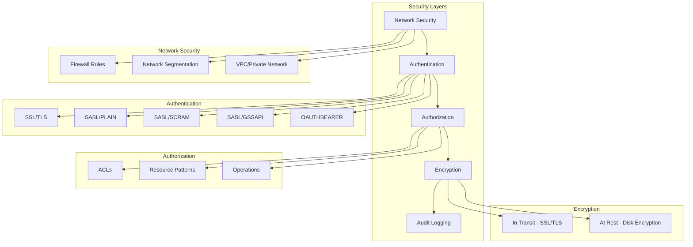

### Complete Security Model

```kotlin
data class KafkaSecurityModel(
    val authentication: AuthenticationConfig,
    val authorization: AuthorizationConfig,
    val encryption: EncryptionConfig,
    val auditing: AuditConfig
)

data class AuthenticationConfig(
    val mechanisms: List<AuthMechanism>,
    val sslConfig: SslConfig?,
    val saslConfig: SaslConfig?
)

data class AuthorizationConfig(
    val authorizerClass: String = "kafka.security.authorizer.AclAuthorizer",
    val superUsers: List<String>,
    val allowEveryoneIfNoAclFound: Boolean = false
)

data class EncryptionConfig(
    val inTransit: Boolean,
    val atRest: Boolean,
    val cipherSuites: List<String>
)

enum class AuthMechanism {
    SSL,
    SASL_PLAIN,
    SASL_SCRAM_SHA_256,
    SASL_SCRAM_SHA_512,
    SASL_GSSAPI,
    OAUTHBEARER
}
```

### Threat Model

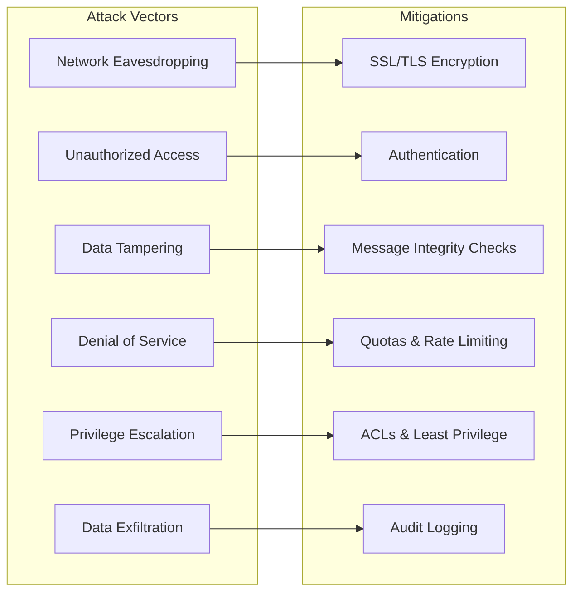

⚠️ **PITFALL #1: Security as an Afterthought**

**Problem**: Adding security to an existing unsecured Kafka cluster is complex and risky.

**Consequences**:
- Requires rolling restarts with careful configuration
- Client applications need updates
- Potential downtime or connectivity issues
- Complex migration path

**Solution**:
```kotlin
// Plan security from day one
data class SecurityMigrationPlan(
    val phases: List<Phase>
) {
    data class Phase(
        val name: String,
        val steps: List<String>,
        val rollbackPlan: String
    )
}

fun createSecurityMigrationPlan(): SecurityMigrationPlan {
    return SecurityMigrationPlan(
        phases = listOf(
            SecurityMigrationPlan.Phase(
                name = "Phase 1: Enable SSL Listeners",
                steps = listOf(
                    "Add SSL listener on new port (9093)",
                    "Keep plaintext listener (9092) active",
                    "Roll brokers one by one",
                    "Test connectivity on both ports"
                ),
                rollbackPlan = "Remove SSL listener config and restart"
            ),
            SecurityMigrationPlan.Phase(
                name = "Phase 2: Migrate Clients",
                steps = listOf(
                    "Update client configurations to use SSL",
                    "Deploy client updates gradually",
                    "Monitor for connection errors",
                    "Verify all clients connected via SSL"
                ),
                rollbackPlan = "Revert client configs to plaintext"
            ),
            SecurityMigrationPlan.Phase(
                name = "Phase 3: Enable Authentication",
                steps = listOf(
                    "Configure SASL on brokers",
                    "Create user credentials",
                    "Update inter-broker communication",
                    "Roll brokers with SASL enabled"
                ),
                rollbackPlan = "Disable SASL, restart brokers"
            ),
            SecurityMigrationPlan.Phase(
                name = "Phase 4: Enable Authorization",
                steps = listOf(
                    "Set allow.everyone.if.no.acl.found=true initially",
                    "Enable ACL authorizer",
                    "Create necessary ACLs",
                    "Test access patterns",
                    "Set allow.everyone.if.no.acl.found=false"
                ),
                rollbackPlan = "Set allow.everyone.if.no.acl.found=true"
            ),
            SecurityMigrationPlan.Phase(
                name = "Phase 5: Remove Plaintext Access",
                steps = listOf(
                    "Verify no clients using plaintext",
                    "Remove plaintext listener",
                    "Roll all brokers",
                    "Verify cluster health"
                ),
                rollbackPlan = "Re-add plaintext listener"
            )
        )
    )
}
```

---

## 2. Authentication Mechanisms

### SSL/TLS Authentication

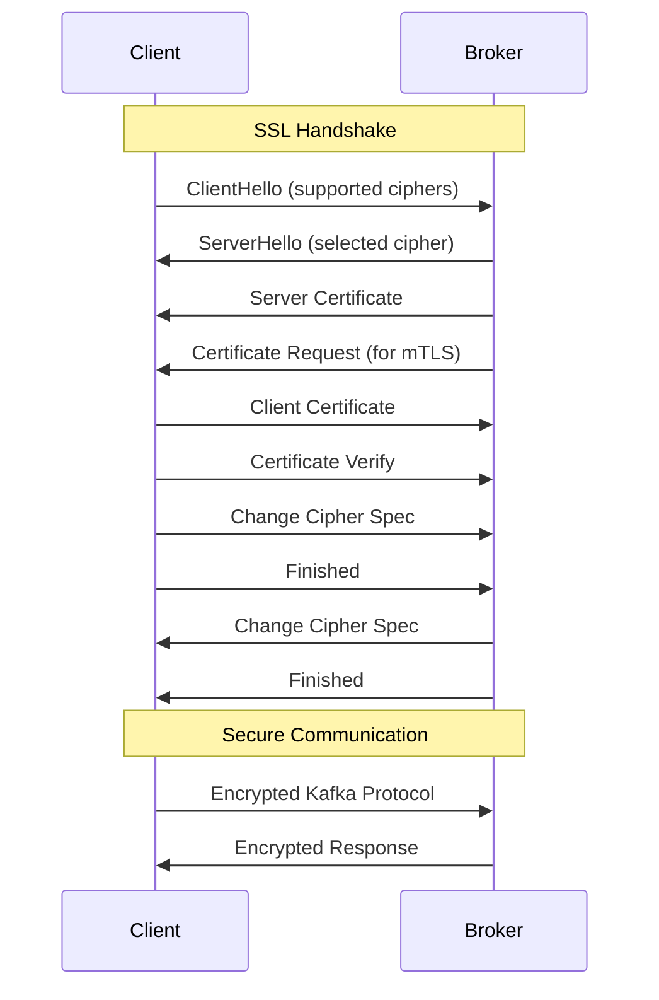

#### Broker SSL Configuration

```kotlin
data class BrokerSslConfig(
    val keystoreLocation: String,
    val keystorePassword: String,
    val keyPassword: String,
    val truststoreLocation: String,
    val truststorePassword: String,
    val clientAuth: String = "required",  // none, requested, required
    val enabledProtocols: List<String> = listOf("TLSv1.3", "TLSv1.2"),
    val cipherSuites: List<String>
)

fun generateBrokerSslProperties(config: BrokerSslConfig): Properties {
    return Properties().apply {
        // Listeners
        put("listeners", "SSL://0.0.0.0:9093,PLAINTEXT://0.0.0.0:9092")
        put("advertised.listeners", "SSL://broker1.example.com:9093,PLAINTEXT://broker1.example.com:9092")
        put("listener.security.protocol.map", "SSL:SSL,PLAINTEXT:PLAINTEXT")

        // SSL Configuration
        put("ssl.keystore.location", config.keystoreLocation)
        put("ssl.keystore.password", config.keystorePassword)
        put("ssl.key.password", config.keyPassword)
        put("ssl.truststore.location", config.truststoreLocation)
        put("ssl.truststore.password", config.truststorePassword)

        // Client Authentication
        put("ssl.client.auth", config.clientAuth)

        // Protocols and Ciphers
        put("ssl.enabled.protocols", config.enabledProtocols.joinToString(","))
        put("ssl.cipher.suites", config.cipherSuites.joinToString(","))

        // Inter-broker SSL
        put("security.inter.broker.protocol", "SSL")
    }
}

// Generate certificates (example using keytool)
fun generateKeystore() {
    val commands = """
        # Generate broker keystore with private key
        keytool -keystore broker1.keystore.jks -alias broker1 \
                -validity 365 -genkey -keyalg RSA \
                -dname "CN=broker1.example.com,OU=Engineering,O=Company,L=City,ST=State,C=US" \
                -ext SAN=dns:broker1.example.com,dns:localhost,ip:192.168.1.10 \
                -storepass changeit -keypass changeit

        # Generate CA certificate
        openssl req -new -x509 -keyout ca-key -out ca-cert -days 365 \
                -subj "/CN=Kafka-CA/OU=Engineering/O=Company/L=City/ST=State/C=US"

        # Import CA into truststore
        keytool -keystore broker1.truststore.jks -alias CARoot \
                -importcert -file ca-cert -storepass changeit -noprompt

        # Create certificate signing request
        keytool -keystore broker1.keystore.jks -alias broker1 \
                -certreq -file broker1.csr -storepass changeit

        # Sign certificate with CA
        openssl x509 -req -CA ca-cert -CAkey ca-key -in broker1.csr \
                -out broker1-signed.crt -days 365 -CAcreateserial

        # Import CA into keystore
        keytool -keystore broker1.keystore.jks -alias CARoot \
                -importcert -file ca-cert -storepass changeit -noprompt

        # Import signed certificate into keystore
        keytool -keystore broker1.keystore.jks -alias broker1 \
                -importcert -file broker1-signed.crt -storepass changeit
    """.trimIndent()

    println(commands)
}
```

#### Client SSL Configuration

```kotlin
data class ClientSslConfig(
    val keystoreLocation: String,
    val keystorePassword: String,
    val truststoreLocation: String,
    val truststorePassword: String
)

fun createSslProducerConfig(config: ClientSslConfig): Properties {
    return Properties().apply {
        put("bootstrap.servers", "broker1.example.com:9093,broker2.example.com:9093")
        put("security.protocol", "SSL")

        // SSL Configuration
        put("ssl.truststore.location", config.truststoreLocation)
        put("ssl.truststore.password", config.truststorePassword)

        // For mTLS (client authentication)
        put("ssl.keystore.location", config.keystoreLocation)
        put("ssl.keystore.password", config.keystorePassword)

        // Optional: specify protocols and ciphers
        put("ssl.enabled.protocols", "TLSv1.3,TLSv1.2")

        // Standard producer configs
        put("key.serializer", "org.apache.kafka.common.serialization.StringSerializer")
        put("value.serializer", "org.apache.kafka.common.serialization.StringSerializer")
    }
}
```

⚠️ **PITFALL #2: Certificate Expiration**

**Problem**: SSL certificates expire, and expired certificates cause immediate cluster failure.

**Consequences**:
- Complete cluster outage
- All client connections fail
- Inter-broker communication breaks

**Solution**:
```kotlin
data class CertificateMonitoring(
    val certPath: String,
    val warningDays: Int = 30,
    val criticalDays: Int = 7
)

fun monitorCertificateExpiration(config: CertificateMonitoring) {
    val command = """
        # Check certificate expiration
        echo | openssl s_client -connect broker1.example.com:9093 2>/dev/null | \
        openssl x509 -noout -dates

        # Extract expiration date
        EXPIRY=$(echo | openssl s_client -connect broker1.example.com:9093 2>/dev/null | \
                 openssl x509 -noout -enddate | cut -d= -f2)

        # Calculate days until expiration
        EXPIRY_EPOCH=$(date -d "${'$'}EXPIRY" +%s)
        NOW_EPOCH=$(date +%s)
        DAYS_LEFT=$(( (${'$'}EXPIRY_EPOCH - ${'$'}NOW_EPOCH) / 86400 ))

        # Alert based on thresholds
        if [ ${'$'}DAYS_LEFT -lt ${config.criticalDays} ]; then
            echo "CRITICAL: Certificate expires in ${'$'}DAYS_LEFT days"
            # Trigger critical alert
        elif [ ${'$'}DAYS_LEFT -lt ${config.warningDays} ]; then
            echo "WARNING: Certificate expires in ${'$'}DAYS_LEFT days"
            # Trigger warning alert
        fi
    """.trimIndent()

    println(command)
}

// Implement automated certificate rotation
data class CertRotationPlan(
    val oldCertExpiry: String,
    val newCertReady: String,
    val rotationWindow: String
)

fun rotateCertificates(plan: CertRotationPlan) {
    println("""
        Certificate Rotation Procedure:

        1. Generate new certificates 60 days before expiration
        2. Add new CA to truststores (doesn't require restart)
        3. Rolling restart with dual keystores:
           - Configure both old and new certs
           - Roll one broker at a time
        4. Once all brokers have new certs, remove old CA
        5. Final rolling restart to clean up old certs

        Zero-downtime rotation: Use keystore with multiple aliases
    """.trimIndent())
}
```

### SASL Authentication

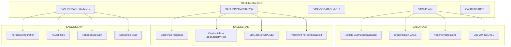

#### SASL/SCRAM Configuration

```kotlin
// Broker configuration for SASL/SCRAM
fun configureSaslScramBroker() {
    val brokerProperties = """
        # Listeners with SASL
        listeners=SASL_SSL://0.0.0.0:9093
        advertised.listeners=SASL_SSL://broker1.example.com:9093
        security.inter.broker.protocol=SASL_SSL
        sasl.mechanism.inter.broker.protocol=SCRAM-SHA-512
        sasl.enabled.mechanisms=SCRAM-SHA-512,SCRAM-SHA-256

        # SSL Config (combined with SASL)
        ssl.keystore.location=/var/ssl/kafka.broker1.keystore.jks
        ssl.keystore.password=changeit
        ssl.key.password=changeit
        ssl.truststore.location=/var/ssl/kafka.broker1.truststore.jks
        ssl.truststore.password=changeit

        # Authorizer
        authorizer.class.name=kafka.security.authorizer.AclAuthorizer
        super.users=User:admin;User:kafka
    """.trimIndent()

    val jaasConfig = """
        KafkaServer {
            org.apache.kafka.common.security.scram.ScramLoginModule required
            username="kafka"
            password="kafka-secret";
        };
    """.trimIndent()

    println("Broker Properties:\n$brokerProperties\n")
    println("JAAS Config (kafka_server_jaas.conf):\n$jaasConfig")
}

// Create SCRAM credentials in ZooKeeper
fun createScramUsers() {
    val commands = """
        # Create admin user with SCRAM-SHA-512
        kafka-configs.sh --bootstrap-server localhost:9092 \
            --alter --add-config 'SCRAM-SHA-512=[password=admin-secret]' \
            --entity-type users --entity-name admin

        # Create producer user
        kafka-configs.sh --bootstrap-server localhost:9092 \
            --alter --add-config 'SCRAM-SHA-512=[password=producer-secret]' \
            --entity-type users --entity-name producer-user

        # Create consumer user
        kafka-configs.sh --bootstrap-server localhost:9092 \
            --alter --add-config 'SCRAM-SHA-512=[password=consumer-secret]' \
            --entity-type users --entity-name consumer-user

        # List SCRAM credentials
        kafka-configs.sh --bootstrap-server localhost:9092 \
            --describe --entity-type users

        # Delete user
        kafka-configs.sh --bootstrap-server localhost:9092 \
            --alter --delete-config 'SCRAM-SHA-512' \
            --entity-type users --entity-name old-user
    """.trimIndent()

    println(commands)
}

// Client configuration for SASL/SCRAM
data class SaslScramClientConfig(
    val username: String,
    val password: String,
    val mechanism: String = "SCRAM-SHA-512"
)

fun createSaslScramProducerConfig(config: SaslScramClientConfig): Properties {
    return Properties().apply {
        put("bootstrap.servers", "broker1.example.com:9093")
        put("security.protocol", "SASL_SSL")
        put("sasl.mechanism", config.mechanism)

        val jaasConfig = """
            org.apache.kafka.common.security.scram.ScramLoginModule required
            username="${config.username}"
            password="${config.password}";
        """.trimIndent()

        put("sasl.jaas.config", jaasConfig)

        // SSL config
        put("ssl.truststore.location", "/var/ssl/kafka.client.truststore.jks")
        put("ssl.truststore.password", "changeit")

        // Serializers
        put("key.serializer", "org.apache.kafka.common.serialization.StringSerializer")
        put("value.serializer", "org.apache.kafka.common.serialization.StringSerializer")
    }
}
```

#### SASL/GSSAPI (Kerberos) Configuration

```kotlin
// Broker Kerberos configuration
fun configureKerberosBroker() {
    val brokerProperties = """
        # SASL/GSSAPI Configuration
        listeners=SASL_PLAINTEXT://0.0.0.0:9093
        advertised.listeners=SASL_PLAINTEXT://broker1.example.com:9093
        security.inter.broker.protocol=SASL_PLAINTEXT
        sasl.mechanism.inter.broker.protocol=GSSAPI
        sasl.enabled.mechanisms=GSSAPI

        # Kerberos settings
        sasl.kerberos.service.name=kafka
    """.trimIndent()

    val jaasConfig = """
        KafkaServer {
            com.sun.security.auth.module.Krb5LoginModule required
            useKeyTab=true
            storeKey=true
            keyTab="/etc/security/keytabs/kafka_broker.keytab"
            principal="kafka/broker1.example.com@EXAMPLE.COM";
        };

        Client {
            com.sun.security.auth.module.Krb5LoginModule required
            useKeyTab=true
            storeKey=true
            keyTab="/etc/security/keytabs/kafka_broker.keytab"
            principal="kafka/broker1.example.com@EXAMPLE.COM";
        };
    """.trimIndent()

    println("Broker Properties:\n$brokerProperties\n")
    println("JAAS Config:\n$jaasConfig")
}

// Create Kerberos principals and keytabs
fun createKerberosPrincipals() {
    val commands = """
        # On KDC server

        # Create Kafka broker principal
        kadmin.local -q "addprinc -randkey kafka/broker1.example.com@EXAMPLE.COM"

        # Create keytab for broker
        kadmin.local -q "xst -norandkey -k /tmp/kafka_broker.keytab kafka/broker1.example.com@EXAMPLE.COM"

        # Create client principals
        kadmin.local -q "addprinc -randkey producer@EXAMPLE.COM"
        kadmin.local -q "xst -norandkey -k /tmp/producer.keytab producer@EXAMPLE.COM"

        kadmin.local -q "addprinc -randkey consumer@EXAMPLE.COM"
        kadmin.local -q "xst -norandkey -k /tmp/consumer.keytab consumer@EXAMPLE.COM"

        # Verify keytab
        klist -kt /tmp/kafka_broker.keytab

        # Copy keytabs to brokers (securely)
        scp /tmp/kafka_broker.keytab broker1.example.com:/etc/security/keytabs/

        # Set permissions
        chmod 400 /etc/security/keytabs/kafka_broker.keytab
        chown kafka:kafka /etc/security/keytabs/kafka_broker.keytab
    """.trimIndent()

    println(commands)
}

// Client Kerberos configuration
fun createKerberosClientConfig(principal: String, keytabPath: String): Properties {
    return Properties().apply {
        put("bootstrap.servers", "broker1.example.com:9093")
        put("security.protocol", "SASL_PLAINTEXT")
        put("sasl.mechanism", "GSSAPI")
        put("sasl.kerberos.service.name", "kafka")

        val jaasConfig = """
            com.sun.security.auth.module.Krb5LoginModule required
            useKeyTab=true
            storeKey=true
            keyTab="$keytabPath"
            principal="$principal";
        """.trimIndent()

        put("sasl.jaas.config", jaasConfig)

        put("key.serializer", "org.apache.kafka.common.serialization.StringSerializer")
        put("value.serializer", "org.apache.kafka.common.serialization.StringSerializer")
    }
}
```

⚠️ **PITFALL #3: SASL Credential Management**

**Problem**: Hardcoded credentials in configuration files or source code.

**Consequences**:
- Security breach if configs exposed
- Difficult credential rotation
- Compliance violations

**Solution**:
```kotlin
// Use external secret management
interface SecretProvider {
    fun getSecret(key: String): String
}

class VaultSecretProvider(private val vaultUrl: String, private val token: String) : SecretProvider {
    override fun getSecret(key: String): String {
        // Call HashiCorp Vault API
        return "secret-from-vault"
    }
}

class AwsSecretsManagerProvider(private val region: String) : SecretProvider {
    override fun getSecret(key: String): String {
        // Call AWS Secrets Manager
        return "secret-from-aws"
    }
}

class KubernetesSecretProvider : SecretProvider {
    override fun getSecret(key: String): String {
        // Read from mounted Kubernetes secret
        val secretPath = "/var/run/secrets/kafka/$key"
        return java.io.File(secretPath).readText().trim()
    }
}

// Use in configuration
fun createSecureProducerConfig(secretProvider: SecretProvider): Properties {
    val username = secretProvider.getSecret("kafka-username")
    val password = secretProvider.getSecret("kafka-password")

    return Properties().apply {
        put("bootstrap.servers", "broker1.example.com:9093")
        put("security.protocol", "SASL_SSL")
        put("sasl.mechanism", "SCRAM-SHA-512")

        val jaasConfig = """
            org.apache.kafka.common.security.scram.ScramLoginModule required
            username="$username"
            password="$password";
        """.trimIndent()

        put("sasl.jaas.config", jaasConfig)

        // Other configs...
    }
}

// Implement credential rotation
data class CredentialRotationPolicy(
    val rotationIntervalDays: Int = 90,
    val warningDays: Int = 14,
    val gracePeriodDays: Int = 7  // Old credentials still valid
)

fun rotateScramCredentials(
    username: String,
    newPassword: String,
    policy: CredentialRotationPolicy
) {
    println("""
        Credential Rotation Steps:

        1. Generate new password: $newPassword
        2. Update SCRAM credential with both old and new:
           kafka-configs.sh --alter \
               --add-config 'SCRAM-SHA-512=[iterations=4096,password=$newPassword]' \
               --entity-type users --entity-name $username

        3. Update secret in secret manager
        4. Rolling restart of clients to pick up new credential
        5. After grace period (${policy.gracePeriodDays} days), verify all clients migrated
        6. Remove old credential

        Monitor during rotation:
        - Authentication failures
        - Client connection errors
        - Application logs for credential errors
    """.trimIndent())
}
```

---

## 3. Authorization with ACLs

### ACL Model

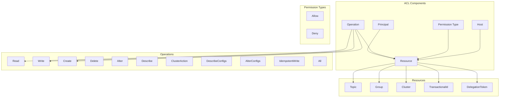

### ACL Data Model

```kotlin
data class AclRule(
    val principal: Principal,
    val permissionType: PermissionType,
    val operation: Operation,
    val resource: Resource,
    val host: String = "*"
)

data class Principal(
    val principalType: String,  // User, Group
    val name: String
) {
    override fun toString() = "$principalType:$name"
}

enum class PermissionType {
    ALLOW, DENY
}

enum class Operation {
    READ,
    WRITE,
    CREATE,
    DELETE,
    ALTER,
    DESCRIBE,
    CLUSTER_ACTION,
    DESCRIBE_CONFIGS,
    ALTER_CONFIGS,
    IDEMPOTENT_WRITE,
    ALL
}

sealed class Resource {
    abstract val name: String
    abstract val patternType: PatternType

    data class Topic(
        override val name: String,
        override val patternType: PatternType = PatternType.LITERAL
    ) : Resource()

    data class Group(
        override val name: String,
        override val patternType: PatternType = PatternType.LITERAL
    ) : Resource()

    data class Cluster(
        override val name: String = "kafka-cluster"
    ) : Resource() {
        override val patternType = PatternType.LITERAL
    }

    data class TransactionalId(
        override val name: String,
        override val patternType: PatternType = PatternType.LITERAL
    ) : Resource()

    data class DelegationToken(
        override val name: String
    ) : Resource() {
        override val patternType = PatternType.LITERAL
    }
}

enum class PatternType {
    LITERAL,    // Exact match
    PREFIXED    // Prefix match
}
```

### ACL Management

```kotlin
// Create ACLs using kafka-acls.sh
fun createProducerAcls(username: String, topic: String) {
    val commands = """
        # Write permission on topic
        kafka-acls.sh --bootstrap-server localhost:9093 \
            --command-config admin.properties \
            --add --allow-principal User:$username \
            --operation Write --topic $topic

        # Describe permission on topic (for metadata)
        kafka-acls.sh --bootstrap-server localhost:9093 \
            --command-config admin.properties \
            --add --allow-principal User:$username \
            --operation Describe --topic $topic

        # Create permission (if topic doesn't exist)
        kafka-acls.sh --bootstrap-server localhost:9093 \
            --command-config admin.properties \
            --add --allow-principal User:$username \
            --operation Create --topic $topic

        # IdempotentWrite on cluster (for idempotent producer)
        kafka-acls.sh --bootstrap-server localhost:9093 \
            --command-config admin.properties \
            --add --allow-principal User:$username \
            --operation IdempotentWrite --cluster
    """.trimIndent()

    println(commands)
}

fun createConsumerAcls(username: String, topic: String, consumerGroup: String) {
    val commands = """
        # Read permission on topic
        kafka-acls.sh --bootstrap-server localhost:9093 \
            --command-config admin.properties \
            --add --allow-principal User:$username \
            --operation Read --topic $topic

        # Describe permission on topic
        kafka-acls.sh --bootstrap-server localhost:9093 \
            --command-config admin.properties \
            --add --allow-principal User:$username \
            --operation Describe --topic $topic

        # Read permission on consumer group
        kafka-acls.sh --bootstrap-server localhost:9093 \
            --command-config admin.properties \
            --add --allow-principal User:$username \
            --operation Read --group $consumerGroup
    """.trimIndent()

    println(commands)
}

fun createTransactionalProducerAcls(username: String, topic: String, transactionalId: String) {
    val commands = """
        # Standard producer permissions
        kafka-acls.sh --bootstrap-server localhost:9093 \
            --command-config admin.properties \
            --add --allow-principal User:$username \
            --operation Write --operation Describe --topic $topic

        # Write permission on transactional ID
        kafka-acls.sh --bootstrap-server localhost:9093 \
            --command-config admin.properties \
            --add --allow-principal User:$username \
            --operation Write --transactional-id $transactionalId

        # Describe permission on transactional ID
        kafka-acls.sh --bootstrap-server localhost:9093 \
            --command-config admin.properties \
            --add --allow-principal User:$username \
            --operation Describe --transactional-id $transactionalId

        # IdempotentWrite on cluster
        kafka-acls.sh --bootstrap-server localhost:9093 \
            --command-config admin.properties \
            --add --allow-principal User:$username \
            --operation IdempotentWrite --cluster
    """.trimIndent()

    println(commands)
}
```

### ACL Pattern Matching

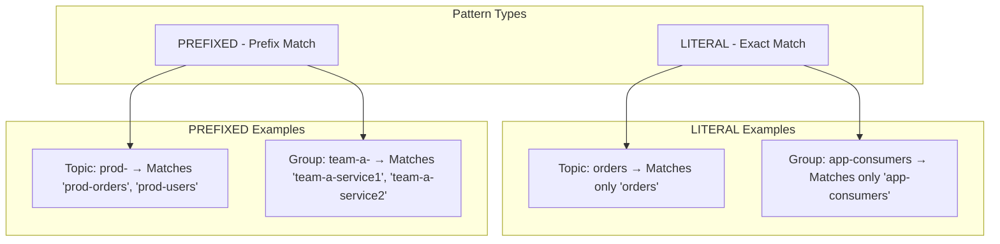

```kotlin
// Using prefixed ACLs for multi-tenancy
fun createTenantAcls(tenantId: String, username: String) {
    val topicPrefix = "tenant-$tenantId-"
    val groupPrefix = "tenant-$tenantId-"

    val commands = """
        # Producer permissions for all tenant topics
        kafka-acls.sh --bootstrap-server localhost:9093 \
            --command-config admin.properties \
            --add --allow-principal User:$username \
            --operation Write --operation Describe --operation Create \
            --topic $topicPrefix --resource-pattern-type prefixed

        # Consumer permissions for all tenant topics
        kafka-acls.sh --bootstrap-server localhost:9093 \
            --command-config admin.properties \
            --add --allow-principal User:$username \
            --operation Read --operation Describe \
            --topic $topicPrefix --resource-pattern-type prefixed

        # Consumer group permissions
        kafka-acls.sh --bootstrap-server localhost:9093 \
            --command-config admin.properties \
            --add --allow-principal User:$username \
            --operation Read \
            --group $groupPrefix --resource-pattern-type prefixed
    """.trimIndent()

    println("Creating ACLs for tenant: $tenantId")
    println(commands)
}

// List and describe ACLs
fun listAcls() {
    val commands = """
        # List all ACLs
        kafka-acls.sh --bootstrap-server localhost:9093 \
            --command-config admin.properties --list

        # List ACLs for specific principal
        kafka-acls.sh --bootstrap-server localhost:9093 \
            --command-config admin.properties --list \
            --principal User:producer-user

        # List ACLs for specific topic
        kafka-acls.sh --bootstrap-server localhost:9093 \
            --command-config admin.properties --list \
            --topic orders

        # List ACLs for topic prefix
        kafka-acls.sh --bootstrap-server localhost:9093 \
            --command-config admin.properties --list \
            --topic prod- --resource-pattern-type prefixed
    """.trimIndent()

    println(commands)
}

// Remove ACLs
fun removeAcls(username: String, topic: String) {
    val commands = """
        # Remove specific ACL
        kafka-acls.sh --bootstrap-server localhost:9093 \
            --command-config admin.properties \
            --remove --allow-principal User:$username \
            --operation Write --topic $topic

        # Remove all ACLs for a principal
        kafka-acls.sh --bootstrap-server localhost:9093 \
            --command-config admin.properties \
            --remove --principal User:$username

        # Remove all ACLs for a topic
        kafka-acls.sh --bootstrap-server localhost:9093 \
            --command-config admin.properties \
            --remove --topic $topic
    """.trimIndent()

    println(commands)
}
```

⚠️ **PITFALL #4: ACL Precedence and Deny Rules**

**Problem**: DENY rules take precedence over ALLOW rules, which can cause unexpected access denials.

**Consequences**:
- Users blocked even with explicit ALLOW rules
- Difficult to debug authorization failures
- Accidental denial of service

**Solution**:
```kotlin
// Understanding ACL evaluation
fun explainAclEvaluation() {
    println("""
        ACL Evaluation Order:

        1. If any DENY ACL matches → Access DENIED
        2. If any ALLOW ACL matches → Access ALLOWED
        3. If no ACLs match → Access DENIED (default deny)

        Example Problem:
        - ALLOW: User:alice can Write to topic orders
        - DENY: User:alice cannot Write to topic orders from host 192.168.1.100

        Result: Alice CANNOT write from ANY host (DENY takes precedence)

        Best Practice: Avoid DENY rules unless absolutely necessary
        Use ALLOW rules with specific principals and hosts
    """.trimIndent())
}

// Safe ACL management patterns
data class AclPolicy(
    val defaultDeny: Boolean = true,
    val useDenyRules: Boolean = false,
    val requireExplicitAllow: Boolean = true
)

fun createSafeAcl(
    username: String,
    topic: String,
    operation: Operation,
    policy: AclPolicy
) {
    if (policy.useDenyRules) {
        println("WARNING: Using DENY rules can cause unexpected access denials")
        println("Consider using ALLOW rules with specific principals instead")
    }

    val commands = """
        # Prefer specific ALLOW rules
        kafka-acls.sh --bootstrap-server localhost:9093 \
            --command-config admin.properties \
            --add --allow-principal User:$username \
            --operation ${operation.name} --topic $topic \
            --host 10.0.1.0/24

        # Instead of DENY rules, simply don't create ALLOW rules
        # This achieves the same effect with default deny
    """.trimIndent()

    println(commands)
}

// ACL debugging
fun debugAclIssues(username: String, topic: String, operation: Operation) {
    val commands = """
        # Check all ACLs for user
        kafka-acls.sh --bootstrap-server localhost:9093 \
            --command-config admin.properties --list \
            --principal User:$username

        # Check ACLs for topic
        kafka-acls.sh --bootstrap-server localhost:9093 \
            --command-config admin.properties --list \
            --topic $topic

        # Enable debug logging on broker
        log4j.logger.kafka.authorizer.logger=DEBUG

        # Check broker logs for authorization failures
        grep "Principal = User:$username" /var/log/kafka/server.log | grep "Authorized"

        # Common issues:
        # 1. Missing IdempotentWrite permission for producers
        # 2. Missing Describe permission (required for metadata)
        # 3. DENY rules blocking access
        # 4. Wrong principal format (User: vs user:)
        # 5. Pattern type mismatch (LITERAL vs PREFIXED)
    """.trimIndent()

    println("Debugging ACL issues for User:$username on topic $topic")
    println(commands)
}
```

### Common ACL Patterns

```kotlin
// 1. Service account with scoped access
fun createServiceAccountAcls(serviceAccount: String, topics: List<String>) {
    topics.forEach { topic ->
        println("""
            # Service: $serviceAccount, Topic: $topic
            kafka-acls.sh --bootstrap-server localhost:9093 \
                --command-config admin.properties \
                --add --allow-principal User:$serviceAccount \
                --operation Read --operation Write --operation Describe \
                --topic $topic
        """.trimIndent())
    }
}

// 2. Admin user with cluster-wide access
fun createAdminAcls(adminUser: String) {
    val commands = """
        # Cluster-level permissions
        kafka-acls.sh --bootstrap-server localhost:9093 \
            --command-config admin.properties \
            --add --allow-principal User:$adminUser \
            --operation All --cluster

        # All operations on all topics
        kafka-acls.sh --bootstrap-server localhost:9093 \
            --command-config admin.properties \
            --add --allow-principal User:$adminUser \
            --operation All --topic '*' --resource-pattern-type literal

        # All operations on all consumer groups
        kafka-acls.sh --bootstrap-server localhost:9093 \
            --command-config admin.properties \
            --add --allow-principal User:$adminUser \
            --operation All --group '*' --resource-pattern-type literal
    """.trimIndent()

    println(commands)
}

// 3. Read-only monitoring user
fun createMonitoringAcls(monitoringUser: String) {
    val commands = """
        # Describe cluster
        kafka-acls.sh --bootstrap-server localhost:9093 \
            --command-config admin.properties \
            --add --allow-principal User:$monitoringUser \
            --operation Describe --cluster

        # Describe all topics
        kafka-acls.sh --bootstrap-server localhost:9093 \
            --command-config admin.properties \
            --add --allow-principal User:$monitoringUser \
            --operation Describe --topic '*' --resource-pattern-type literal

        # Describe all consumer groups
        kafka-acls.sh --bootstrap-server localhost:9093 \
            --command-config admin.properties \
            --add --allow-principal User:$monitoringUser \
            --operation Describe --group '*' --resource-pattern-type literal

        # DescribeConfigs on cluster
        kafka-acls.sh --bootstrap-server localhost:9093 \
            --command-config admin.properties \
            --add --allow-principal User:$monitoringUser \
            --operation DescribeConfigs --cluster
    """.trimIndent()

    println(commands)
}

// 4. Application with transactional writes
fun createTransactionalAppAcls(
    appUser: String,
    inputTopics: List<String>,
    outputTopics: List<String>,
    consumerGroup: String,
    transactionalId: String
) {
    println("""
        # Read from input topics
        ${inputTopics.joinToString("\n") { topic ->
            """
            kafka-acls.sh --bootstrap-server localhost:9093 \
                --command-config admin.properties \
                --add --allow-principal User:$appUser \
                --operation Read --operation Describe --topic $topic
            """.trimIndent()
        }}

        # Write to output topics
        ${outputTopics.joinToString("\n") { topic ->
            """
            kafka-acls.sh --bootstrap-server localhost:9093 \
                --command-config admin.properties \
                --add --allow-principal User:$appUser \
                --operation Write --operation Describe --topic $topic
            """.trimIndent()
        }}

        # Consumer group access
        kafka-acls.sh --bootstrap-server localhost:9093 \
            --command-config admin.properties \
            --add --allow-principal User:$appUser \
            --operation Read --group $consumerGroup

        # Transactional ID access
        kafka-acls.sh --bootstrap-server localhost:9093 \
            --command-config admin.properties \
            --add --allow-principal User:$appUser \
            --operation Write --operation Describe \
            --transactional-id $transactionalId

        # Cluster-level permissions for idempotent writes
        kafka-acls.sh --bootstrap-server localhost:9093 \
            --command-config admin.properties \
            --add --allow-principal User:$appUser \
            --operation IdempotentWrite --cluster
    """.trimIndent())
}
```

---

## 4. Encryption

### Encryption in Transit (SSL/TLS)

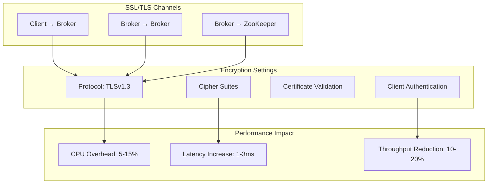

#### SSL Performance Tuning

```kotlin
data class SslPerformanceConfig(
    val protocol: String = "TLSv1.3",  // TLSv1.3 is faster than TLSv1.2
    val cipherSuites: List<String> = listOf(
        // AES-GCM cipher suites (hardware accelerated on modern CPUs)
        "TLS_AES_256_GCM_SHA384",
        "TLS_AES_128_GCM_SHA256",
        "TLS_CHACHA20_POLY1305_SHA256"
    ),
    val sessionCacheSize: Int = 20480,
    val sessionTimeout: Int = 86400  // 24 hours
)

fun configureHighPerformanceSsl(config: SslPerformanceConfig): Properties {
    return Properties().apply {
        // Use TLSv1.3 for improved performance
        put("ssl.enabled.protocols", config.protocol)

        // Prefer hardware-accelerated ciphers
        put("ssl.cipher.suites", config.cipherSuites.joinToString(","))

        // Enable session resumption for reduced handshake overhead
        put("ssl.secure.random.implementation", "SHA1PRNG")

        println("""
            SSL Performance Optimizations:

            1. TLSv1.3 Benefits:
               - 1-RTT handshake (vs 2-RTT in TLSv1.2)
               - Better cipher suites
               - Forward secrecy by default

            2. AES-GCM Ciphers:
               - Hardware acceleration via AES-NI instructions
               - Significantly lower CPU usage
               - Better throughput

            3. Session Resumption:
               - Reduces handshake overhead
               - Faster connection establishment
               - Lower CPU usage for long-lived connections

            4. JVM Tuning for SSL:
               - Ensure AES-NI enabled: -XX:+UseAES -XX:+UseAESIntrinsics
               - Use G1GC for better latency: -XX:+UseG1GC
               - Increase direct memory: -XX:MaxDirectMemorySize=1G
        """.trimIndent())
    }
}

// Benchmark SSL performance
data class SslBenchmarkResult(
    val throughputMbps: Double,
    val p99LatencyMs: Double,
    val cpuUsagePercent: Double
)

fun benchmarkSslImpact(
    withSsl: SslBenchmarkResult,
    withoutSsl: SslBenchmarkResult
) {
    val throughputImpact = ((withoutSsl.throughputMbps - withSsl.throughputMbps) / withoutSsl.throughputMbps) * 100
    val latencyImpact = ((withSsl.p99LatencyMs - withoutSsl.p99LatencyMs) / withoutSsl.p99LatencyMs) * 100
    val cpuImpact = withSsl.cpuUsagePercent - withoutSsl.cpuUsagePercent

    println("""
        SSL Performance Impact:

        Throughput: -${String.format("%.1f", throughputImpact)}%
        P99 Latency: +${String.format("%.1f", latencyImpact)}%
        CPU Usage: +${String.format("%.1f", cpuImpact)}%

        Typical Impact Ranges:
        - TLSv1.3 + AES-GCM: 5-10% throughput reduction, 1-2ms latency increase
        - TLSv1.2 + RSA: 15-25% throughput reduction, 3-5ms latency increase

        Mitigation Strategies:
        1. Use TLSv1.3 and hardware-accelerated ciphers
        2. Enable compression to reduce encrypted payload
        3. Batch more aggressively to amortize handshake cost
        4. Use persistent connections (already default in Kafka)
        5. Consider dedicated SSL/TLS hardware accelerators for very high throughput
    """.trimIndent())
}
```

### Encryption at Rest

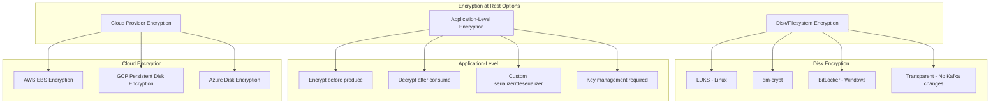

#### Application-Level Encryption

```kotlin
// Custom serializer with encryption
class EncryptingSerializer<T>(
    private val innerSerializer: Serializer<T>,
    private val encryptor: Encryptor
) : Serializer<T> {
    override fun serialize(topic: String, data: T): ByteArray {
        val plainBytes = innerSerializer.serialize(topic, data)
        return encryptor.encrypt(plainBytes)
    }

    override fun close() {
        innerSerializer.close()
    }
}

class DecryptingDeserializer<T>(
    private val innerDeserializer: Deserializer<T>,
    private val encryptor: Encryptor
) : Deserializer<T> {
    override fun deserialize(topic: String, data: ByteArray): T {
        val decryptedBytes = encryptor.decrypt(data)
        return innerDeserializer.deserialize(topic, decryptedBytes)
    }

    override fun close() {
        innerDeserializer.close()
    }
}

// Encryption implementation using AES-GCM
interface Encryptor {
    fun encrypt(plaintext: ByteArray): ByteArray
    fun decrypt(ciphertext: ByteArray): ByteArray
}

class AesGcmEncryptor(private val keyProvider: KeyProvider) : Encryptor {
    private val cipher = javax.crypto.Cipher.getInstance("AES/GCM/NoPadding")

    override fun encrypt(plaintext: ByteArray): ByteArray {
        val key = keyProvider.getCurrentKey()
        val iv = generateIv()

        cipher.init(javax.crypto.Cipher.ENCRYPT_MODE, key, javax.crypto.spec.GCMParameterSpec(128, iv))
        val ciphertext = cipher.doFinal(plaintext)

        // Prepend key version and IV to ciphertext
        return buildEncryptedMessage(keyProvider.getKeyVersion(), iv, ciphertext)
    }

    override fun decrypt(ciphertext: ByteArray): ByteArray {
        val (keyVersion, iv, encrypted) = parseEncryptedMessage(ciphertext)
        val key = keyProvider.getKey(keyVersion)

        cipher.init(javax.crypto.Cipher.DECRYPT_MODE, key, javax.crypto.spec.GCMParameterSpec(128, iv))
        return cipher.doFinal(encrypted)
    }

    private fun generateIv(): ByteArray {
        val iv = ByteArray(12)
        java.security.SecureRandom().nextBytes(iv)
        return iv
    }

    private fun buildEncryptedMessage(keyVersion: Int, iv: ByteArray, ciphertext: ByteArray): ByteArray {
        val buffer = java.nio.ByteBuffer.allocate(4 + 12 + ciphertext.size)
        buffer.putInt(keyVersion)
        buffer.put(iv)
        buffer.put(ciphertext)
        return buffer.array()
    }

    private fun parseEncryptedMessage(message: ByteArray): Triple<Int, ByteArray, ByteArray> {
        val buffer = java.nio.ByteBuffer.wrap(message)
        val keyVersion = buffer.getInt()
        val iv = ByteArray(12)
        buffer.get(iv)
        val ciphertext = ByteArray(buffer.remaining())
        buffer.get(ciphertext)
        return Triple(keyVersion, iv, ciphertext)
    }
}

// Key management
interface KeyProvider {
    fun getCurrentKey(): javax.crypto.SecretKey
    fun getKey(version: Int): javax.crypto.SecretKey
    fun getKeyVersion(): Int
    fun rotateKey()
}

class VaultKeyProvider(
    private val vaultClient: VaultClient,
    private val keyPath: String
) : KeyProvider {
    private var currentVersion: Int = 1
    private val keyCache = mutableMapOf<Int, javax.crypto.SecretKey>()

    override fun getCurrentKey(): javax.crypto.SecretKey {
        return getKey(currentVersion)
    }

    override fun getKey(version: Int): javax.crypto.SecretKey {
        return keyCache.getOrPut(version) {
            val keyMaterial = vaultClient.getSecret("$keyPath/v$version")
            javax.crypto.spec.SecretKeySpec(keyMaterial.toByteArray(), "AES")
        }
    }

    override fun getKeyVersion(): Int = currentVersion

    override fun rotateKey() {
        currentVersion++
        println("Rotated to key version $currentVersion")
        // Old keys remain available for decryption
    }
}

// Usage
fun createEncryptedProducer(keyProvider: KeyProvider): Properties {
    val encryptor = AesGcmEncryptor(keyProvider)

    return Properties().apply {
        put("bootstrap.servers", "broker1.example.com:9093")
        put("key.serializer", "org.apache.kafka.common.serialization.StringSerializer")

        // Use encrypting serializer
        put("value.serializer", EncryptingSerializer::class.java.name)
        put("value.serializer.inner", "org.apache.kafka.common.serialization.StringSerializer")
        put("value.serializer.encryptor", encryptor)
    }
}
```

⚠️ **PITFALL #5: Key Management for Encryption at Rest**

**Problem**: Poor key management practices compromise encryption security.

**Consequences**:
- Keys stored with encrypted data (no protection)
- Lost keys = data loss
- No key rotation capability
- Compliance violations

**Solution**:
```kotlin
data class KeyManagementPolicy(
    val rotationIntervalDays: Int = 90,
    val keyBackupRequired: Boolean = true,
    val auditAccessRequired: Boolean = true,
    val keyDerivationFunction: String = "PBKDF2"
)

class SecureKeyManagement(private val policy: KeyManagementPolicy) {

    fun implementBestPractices() {
        println("""
            Key Management Best Practices:

            1. Key Storage:
               ✓ Use dedicated key management service (AWS KMS, HashiCorp Vault)
               ✓ Never store keys in application code or config files
               ✓ Never store keys on same disk as encrypted data
               ✗ Don't hardcode keys
               ✗ Don't store keys in version control

            2. Key Rotation:
               ✓ Rotate keys every ${policy.rotationIntervalDays} days
               ✓ Keep old key versions for decryption
               ✓ Encrypt new messages with new key
               ✓ Re-encrypt old data gradually (optional)

            3. Key Hierarchy:
               ✓ Use master key to encrypt data encryption keys
               ✓ Master key stored in HSM or KMS
               ✓ Data keys can be cached locally (encrypted)

            4. Access Control:
               ✓ Least privilege access to keys
               ✓ Audit all key access
               ✓ Multi-factor authentication for key admin

            5. Backup and Recovery:
               ✓ Backup keys securely (encrypted)
               ✓ Test recovery procedures
               ✓ Document key recovery process
               ✗ Don't backup to same location as primary
        """.trimIndent())
    }

    fun implementKeyRotation(keyProvider: KeyProvider) {
        println("""
            Key Rotation Process:

            1. Generate new key version in KMS
            2. Update key provider to use new version for encryption
            3. Continue using old versions for decryption
            4. Monitor that new key is being used
            5. After retention period, archive old key versions

            Zero-downtime rotation:
            - New writes use new key immediately
            - Old data readable with old keys
            - No re-encryption required (but recommended for very old data)
        """.trimIndent())
    }
}

// Envelope encryption pattern
class EnvelopeEncryption(private val masterKeyProvider: KeyProvider) {

    fun encrypt(plaintext: ByteArray): ByteArray {
        // Generate data encryption key (DEK)
        val dek = generateDataKey()

        // Encrypt plaintext with DEK
        val ciphertext = encryptWithDek(plaintext, dek)

        // Encrypt DEK with master key
        val encryptedDek = encryptDek(dek)

        // Package encrypted DEK with ciphertext
        return packageEncryptedMessage(encryptedDek, ciphertext)
    }

    fun decrypt(encrypted: ByteArray): ByteArray {
        val (encryptedDek, ciphertext) = unpackageEncryptedMessage(encrypted)

        // Decrypt DEK with master key
        val dek = decryptDek(encryptedDek)

        // Decrypt ciphertext with DEK
        return decryptWithDek(ciphertext, dek)
    }

    private fun generateDataKey(): javax.crypto.SecretKey {
        val keyGen = javax.crypto.KeyGenerator.getInstance("AES")
        keyGen.init(256)
        return keyGen.generateKey()
    }

    private fun encryptWithDek(plaintext: ByteArray, dek: javax.crypto.SecretKey): ByteArray {
        // AES-GCM encryption with DEK
        val cipher = javax.crypto.Cipher.getInstance("AES/GCM/NoPadding")
        val iv = ByteArray(12).also { java.security.SecureRandom().nextBytes(it) }
        cipher.init(javax.crypto.Cipher.ENCRYPT_MODE, dek, javax.crypto.spec.GCMParameterSpec(128, iv))
        return iv + cipher.doFinal(plaintext)
    }

    private fun encryptDek(dek: javax.crypto.SecretKey): ByteArray {
        // Encrypt DEK with master key from KMS
        return AesGcmEncryptor(masterKeyProvider).encrypt(dek.encoded)
    }

    private fun decryptWithDek(ciphertext: ByteArray, dek: javax.crypto.SecretKey): ByteArray {
        val iv = ciphertext.sliceArray(0..11)
        val encrypted = ciphertext.sliceArray(12 until ciphertext.size)
        val cipher = javax.crypto.Cipher.getInstance("AES/GCM/NoPadding")
        cipher.init(javax.crypto.Cipher.DECRYPT_MODE, dek, javax.crypto.spec.GCMParameterSpec(128, iv))
        return cipher.doFinal(encrypted)
    }

    private fun decryptDek(encryptedDek: ByteArray): javax.crypto.SecretKey {
        val dekBytes = AesGcmEncryptor(masterKeyProvider).decrypt(encryptedDek)
        return javax.crypto.spec.SecretKeySpec(dekBytes, "AES")
    }

    private fun packageEncryptedMessage(encryptedDek: ByteArray, ciphertext: ByteArray): ByteArray {
        val buffer = java.nio.ByteBuffer.allocate(4 + encryptedDek.size + ciphertext.size)
        buffer.putInt(encryptedDek.size)
        buffer.put(encryptedDek)
        buffer.put(ciphertext)
        return buffer.array()
    }

    private fun unpackageEncryptedMessage(encrypted: ByteArray): Pair<ByteArray, ByteArray> {
        val buffer = java.nio.ByteBuffer.wrap(encrypted)
        val dekSize = buffer.getInt()
        val encryptedDek = ByteArray(dekSize).also { buffer.get(it) }
        val ciphertext = ByteArray(buffer.remaining()).also { buffer.get(it) }
        return encryptedDek to ciphertext
    }
}
```

---

## 5. Multi-tenancy Patterns

### Tenant Isolation Levels

```mermaid
graph TB
    subgraph "Isolation Levels"
        L1[Soft Isolation - Shared Cluster]
        L2[Medium Isolation - Topic/ACL Separation]
        L3[Hard Isolation - Dedicated Clusters]
    end

    subgraph "Soft Isolation"
        S1[Topic naming convention]
        S2[ACLs for authorization]
        S3[Quotas for resource limits]
        S4[Shared infrastructure]
    end

    subgraph "Medium Isolation"
        M1[Dedicated topics per tenant]
        M2[Strict ACLs]
        M3[Quota enforcement]
        M4[Separate consumer groups]
        M5[Optional: Dedicated brokers via racks]
    end

    subgraph "Hard Isolation"
        H1[Separate Kafka clusters]
        H2[Complete resource isolation]
        H3[Independent scaling]
        H4[Higher operational cost]
    end

    L1 --> S1
    L1 --> S2
    L1 --> S3
    L1 --> S4
    L2 --> M1
    L2 --> M2
    L2 --> M3
    L2 --> M4
    L2 --> M5
    L3 --> H1
    L3 --> H2
    L3 --> H3
    L3 --> H4
```

### Topic Naming Conventions

```kotlin
sealed class TenantTopicNaming {
    abstract fun buildTopicName(tenant: String, domain: String, name: String): String
    abstract fun parseTenantId(topicName: String): String?

    object FlatNaming : TenantTopicNaming() {
        // tenant-domain-name
        override fun buildTopicName(tenant: String, domain: String, name: String) =
            "$tenant-$domain-$name"

        override fun parseTenantId(topicName: String) =
            topicName.split("-").firstOrNull()
    }

    object HierarchicalNaming : TenantTopicNaming() {
        // tenant.domain.name
        override fun buildTopicName(tenant: String, domain: String, name: String) =
            "$tenant.$domain.$name"

        override fun parseTenantId(topicName: String) =
            topicName.split(".").firstOrNull()
    }

    object PrefixedNaming : TenantTopicNaming() {
        // tenants/{tenant}/{domain}-{name}
        override fun buildTopicName(tenant: String, domain: String, name: String) =
            "tenants/$tenant/$domain-$name"

        override fun parseTenantId(topicName: String) =
            topicName.removePrefix("tenants/").split("/").firstOrNull()
    }
}

data class TenantMetadata(
    val tenantId: String,
    val domain: String,
    val environment: String,  // dev, staging, prod
    val tier: TenantTier
)

enum class TenantTier {
    FREE,
    STANDARD,
    PREMIUM,
    ENTERPRISE
}

class MultiTenantTopicManager(
    private val namingStrategy: TenantTopicNaming,
    private val adminClient: AdminClient
) {

    fun createTenantTopic(
        metadata: TenantMetadata,
        topicName: String,
        partitions: Int,
        replicationFactor: Short
    ) {
        val fullTopicName = namingStrategy.buildTopicName(
            metadata.tenantId,
            metadata.domain,
            topicName
        )

        val config = mutableMapOf<String, String>()

        // Apply tier-specific configurations
        when (metadata.tier) {
            TenantTier.FREE -> {
                config["retention.ms"] = (7 * 24 * 60 * 60 * 1000).toString()  // 7 days
                config["retention.bytes"] = (100 * 1024 * 1024).toString()  // 100MB
            }
            TenantTier.STANDARD -> {
                config["retention.ms"] = (30 * 24 * 60 * 60 * 1000).toString()  // 30 days
                config["retention.bytes"] = (1024 * 1024 * 1024).toString()  // 1GB
            }
            TenantTier.PREMIUM -> {
                config["retention.ms"] = (90 * 24 * 60 * 60 * 1000).toString()  // 90 days
                config["retention.bytes"] = (10L * 1024 * 1024 * 1024).toString()  // 10GB
            }
            TenantTier.ENTERPRISE -> {
                config["retention.ms"] = (365 * 24 * 60 * 60 * 1000).toString()  // 1 year
                config["retention.bytes"] = "-1"  // Unlimited (subject to quotas)
            }
        }

        val newTopic = NewTopic(fullTopicName, partitions, replicationFactor)
            .configs(config)

        adminClient.createTopics(listOf(newTopic)).all().get()

        println("Created topic: $fullTopicName for tenant ${metadata.tenantId}")
    }

    fun listTenantTopics(tenantId: String): List<String> {
        val allTopics = adminClient.listTopics().names().get()
        return allTopics.filter { topic ->
            namingStrategy.parseTenantId(topic) == tenantId
        }
    }

    fun deleteTenantTopics(tenantId: String) {
        val tenantTopics = listTenantTopics(tenantId)
        if (tenantTopics.isNotEmpty()) {
            adminClient.deleteTopics(tenantTopics).all().get()
            println("Deleted ${tenantTopics.size} topics for tenant $tenantId")
        }
    }
}
```

### Multi-tenancy ACL Management

```kotlin
class TenantAclManager(private val adminClient: AdminClient) {

    fun setupTenantAcls(
        tenantId: String,
        username: String,
        permissions: TenantPermissions,
        namingStrategy: TenantTopicNaming
    ) {
        val principal = KafkaPrincipal("User", username)
        val aclBindings = mutableListOf<AclBinding>()

        // Topic permissions with prefix matching
        val topicPrefix = when (namingStrategy) {
            is TenantTopicNaming.FlatNaming -> "$tenantId-"
            is TenantTopicNaming.HierarchicalNaming -> "$tenantId."
            is TenantTopicNaming.PrefixedNaming -> "tenants/$tenantId/"
        }

        if (permissions.canProduce) {
            // Write and Describe on tenant topics
            aclBindings.add(createAclBinding(
                principal,
                ResourceType.TOPIC,
                topicPrefix,
                PatternType.PREFIXED,
                AclOperation.WRITE,
                AclPermissionType.ALLOW
            ))

            aclBindings.add(createAclBinding(
                principal,
                ResourceType.TOPIC,
                topicPrefix,
                PatternType.PREFIXED,
                AclOperation.DESCRIBE,
                AclPermissionType.ALLOW
            ))

            // IdempotentWrite on cluster
            aclBindings.add(createAclBinding(
                principal,
                ResourceType.CLUSTER,
                "kafka-cluster",
                PatternType.LITERAL,
                AclOperation.IDEMPOTENT_WRITE,
                AclPermissionType.ALLOW
            ))
        }

        if (permissions.canConsume) {
            // Read and Describe on tenant topics
            aclBindings.add(createAclBinding(
                principal,
                ResourceType.TOPIC,
                topicPrefix,
                PatternType.PREFIXED,
                AclOperation.READ,
                AclPermissionType.ALLOW
            ))

            aclBindings.add(createAclBinding(
                principal,
                ResourceType.TOPIC,
                topicPrefix,
                PatternType.PREFIXED,
                AclOperation.DESCRIBE,
                AclPermissionType.ALLOW
            ))

            // Read on tenant consumer groups
            val groupPrefix = "$tenantId-"
            aclBindings.add(createAclBinding(
                principal,
                ResourceType.GROUP,
                groupPrefix,
                PatternType.PREFIXED,
                AclOperation.READ,
                AclPermissionType.ALLOW
            ))
        }

        if (permissions.canManageTopics) {
            // Create, Delete, Alter on tenant topics
            listOf(AclOperation.CREATE, AclOperation.DELETE, AclOperation.ALTER).forEach { op ->
                aclBindings.add(createAclBinding(
                    principal,
                    ResourceType.TOPIC,
                    topicPrefix,
                    PatternType.PREFIXED,
                    op,
                    AclPermissionType.ALLOW
                ))
            }

            // AlterConfigs on tenant topics
            aclBindings.add(createAclBinding(
                principal,
                ResourceType.TOPIC,
                topicPrefix,
                PatternType.PREFIXED,
                AclOperation.ALTER_CONFIGS,
                AclPermissionType.ALLOW
            ))
        }

        // Create all ACLs
        adminClient.createAcls(aclBindings).all().get()
        println("Created ${aclBindings.size} ACL bindings for tenant $tenantId, user $username")
    }

    private fun createAclBinding(
        principal: KafkaPrincipal,
        resourceType: ResourceType,
        resourceName: String,
        patternType: PatternType,
        operation: AclOperation,
        permissionType: AclPermissionType
    ): AclBinding {
        val resourcePattern = ResourcePattern(resourceType, resourceName, patternType)
        val accessControlEntry = AccessControlEntry(
            principal.toString(),
            "*",  // Any host
            operation,
            permissionType
        )
        return AclBinding(resourcePattern, accessControlEntry)
    }

    fun removeTenantAcls(tenantId: String, username: String) {
        val principal = KafkaPrincipal("User", username)

        // List all ACLs for this principal
        val filter = AclBindingFilter(
            ResourcePatternFilter.ANY,
            AccessControlEntryFilter(
                principal.toString(),
                null,
                AclOperation.ANY,
                AclPermissionType.ANY
            )
        )

        val existingAcls = adminClient.describeAcls(filter).values().get()

        // Filter to only tenant-related ACLs
        val tenantAcls = existingAcls.filter { binding ->
            binding.pattern().name().contains(tenantId)
        }

        if (tenantAcls.isNotEmpty()) {
            adminClient.deleteAcls(tenantAcls.map { it.toFilter() }).all().get()
            println("Removed ${tenantAcls.size} ACLs for tenant $tenantId, user $username")
        }
    }
}

data class TenantPermissions(
    val canProduce: Boolean,
    val canConsume: Boolean,
    val canManageTopics: Boolean
)

data class KafkaPrincipal(
    val principalType: String,
    val name: String
) {
    override fun toString() = "$principalType:$name"
}
```

---

## 6. Quotas and Throttling

### Quota Types

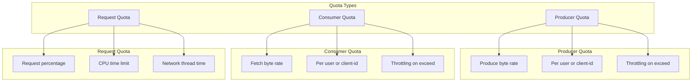

### Quota Configuration

```kotlin
data class TenantQuota(
    val tenantId: String,
    val tier: TenantTier,
    val producerByteRate: Long,  // bytes/second
    val consumerByteRate: Long,  // bytes/second
    val requestPercentage: Double  // % of broker capacity
)

class QuotaManager(private val adminClient: AdminClient) {

    // Default quotas by tier
    private val tierQuotas = mapOf(
        TenantTier.FREE to TenantQuota(
            tenantId = "",
            tier = TenantTier.FREE,
            producerByteRate = 1024 * 1024,  // 1 MB/s
            consumerByteRate = 2 * 1024 * 1024,  // 2 MB/s
            requestPercentage = 10.0  // 10% of broker capacity
        ),
        TenantTier.STANDARD to TenantQuota(
            tenantId = "",
            tier = TenantTier.STANDARD,
            producerByteRate = 10 * 1024 * 1024,  // 10 MB/s
            consumerByteRate = 20 * 1024 * 1024,  // 20 MB/s
            requestPercentage = 25.0
        ),
        TenantTier.PREMIUM to TenantQuota(
            tenantId = "",
            tier = TenantTier.PREMIUM,
            producerByteRate = 50 * 1024 * 1024,  // 50 MB/s
            consumerByteRate = 100 * 1024 * 1024,  // 100 MB/s
            requestPercentage = 50.0
        ),
        TenantTier.ENTERPRISE to TenantQuota(
            tenantId = "",
            tier = TenantTier.ENTERPRISE,
            producerByteRate = 200 * 1024 * 1024,  // 200 MB/s
            consumerByteRate = 400 * 1024 * 1024,  // 400 MB/s
            requestPercentage = 100.0  // No limit
        )
    )

    fun setTenantQuota(tenantId: String, tier: TenantTier) {
        val quota = tierQuotas[tier]!!.copy(tenantId = tenantId)

        // Set user-level quotas
        val userEntity = ClientQuotaEntity(mapOf(
            ClientQuotaEntity.USER to tenantId
        ))

        val quotaOps = listOf(
            ClientQuotaAlteration(
                userEntity,
                listOf(
                    ClientQuotaAlteration.Op("producer_byte_rate", quota.producerByteRate.toDouble()),
                    ClientQuotaAlteration.Op("consumer_byte_rate", quota.consumerByteRate.toDouble()),
                    ClientQuotaAlteration.Op("request_percentage", quota.requestPercentage)
                )
            )
        )

        adminClient.alterClientQuotas(quotaOps).all().get()

        println("""
            Set quotas for tenant $tenantId (${tier.name}):
            - Producer: ${quota.producerByteRate / (1024 * 1024)} MB/s
            - Consumer: ${quota.consumerByteRate / (1024 * 1024)} MB/s
            - Request: ${quota.requestPercentage}%
        """.trimIndent())
    }

    fun setClientQuota(clientId: String, quota: TenantQuota) {
        // Set client-id level quotas (more specific than user-level)
        val clientEntity = ClientQuotaEntity(mapOf(
            ClientQuotaEntity.CLIENT_ID to clientId
        ))

        val quotaOps = listOf(
            ClientQuotaAlteration(
                clientEntity,
                listOf(
                    ClientQuotaAlteration.Op("producer_byte_rate", quota.producerByteRate.toDouble()),
                    ClientQuotaAlteration.Op("consumer_byte_rate", quota.consumerByteRate.toDouble())
                )
            )
        )

        adminClient.alterClientQuotas(quotaOps).all().get()
        println("Set quotas for client-id: $clientId")
    }

    fun setUserAndClientQuota(username: String, clientId: String, quota: TenantQuota) {
        // Most specific: user + client-id combination
        val entity = ClientQuotaEntity(mapOf(
            ClientQuotaEntity.USER to username,
            ClientQuotaEntity.CLIENT_ID to clientId
        ))

        val quotaOps = listOf(
            ClientQuotaAlteration(
                entity,
                listOf(
                    ClientQuotaAlteration.Op("producer_byte_rate", quota.producerByteRate.toDouble()),
                    ClientQuotaAlteration.Op("consumer_byte_rate", quota.consumerByteRate.toDouble())
                )
            )
        )

        adminClient.alterClientQuotas(quotaOps).all().get()
        println("Set quotas for user $username, client-id $clientId")
    }

    fun listQuotas() {
        val filter = ClientQuotaFilter(null, null)
        val quotas = adminClient.describeClientQuotas(filter).entities().get()

        quotas.forEach { (entity, quotaMap) ->
            println("Entity: $entity")
            quotaMap.forEach { (key, value) ->
                println("  $key: $value")
            }
        }
    }

    fun removeQuota(username: String) {
        val entity = ClientQuotaEntity(mapOf(
            ClientQuotaEntity.USER to username
        ))

        val quotaOps = listOf(
            ClientQuotaAlteration(
                entity,
                listOf(
                    ClientQuotaAlteration.Op("producer_byte_rate", null),  // null removes quota
                    ClientQuotaAlteration.Op("consumer_byte_rate", null),
                    ClientQuotaAlteration.Op("request_percentage", null)
                )
            )
        )

        adminClient.alterClientQuotas(quotaOps).all().get()
        println("Removed quotas for user: $username")
    }
}

// Command-line quota management
fun manageQuotasViaCli() {
    val commands = """
        # Set user-level producer quota
        kafka-configs.sh --bootstrap-server localhost:9093 \
            --alter --add-config 'producer_byte_rate=10485760' \
            --entity-type users --entity-name tenant-123

        # Set user-level consumer quota
        kafka-configs.sh --bootstrap-server localhost:9093 \
            --alter --add-config 'consumer_byte_rate=20971520' \
            --entity-type users --entity-name tenant-123

        # Set request quota (percentage of broker capacity)
        kafka-configs.sh --bootstrap-server localhost:9093 \
            --alter --add-config 'request_percentage=25' \
            --entity-type users --entity-name tenant-123

        # Set client-id quota
        kafka-configs.sh --bootstrap-server localhost:9093 \
            --alter --add-config 'producer_byte_rate=5242880' \
            --entity-type clients --entity-name client-app-1

        # Set user + client-id quota (most specific)
        kafka-configs.sh --bootstrap-server localhost:9093 \
            --alter --add-config 'producer_byte_rate=5242880' \
            --entity-type users --entity-name tenant-123 \
            --entity-type clients --entity-name client-app-1

        # List all quotas
        kafka-configs.sh --bootstrap-server localhost:9093 \
            --describe --entity-type users

        # Remove quota
        kafka-configs.sh --bootstrap-server localhost:9093 \
            --alter --delete-config 'producer_byte_rate' \
            --entity-type users --entity-name tenant-123
    """.trimIndent()

    println(commands)
}
```

### Quota Enforcement and Throttling

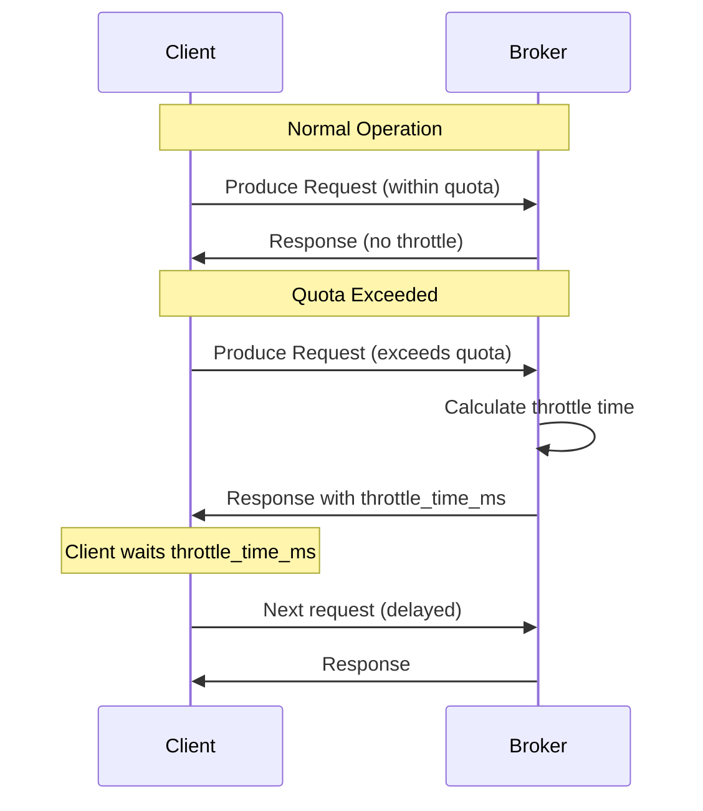

⚠️ **PITFALL #6: Quota Granularity and Precedence**

**Problem**: Kafka's quota precedence rules can cause unexpected throttling.

**Consequences**:
- Clients throttled despite having generous quotas
- Unexpected performance degradation
- Difficult to debug throttling issues

**Solution**:
```kotlin
fun explainQuotaPrecedence() {
    println("""
        Quota Precedence (most specific to least specific):

        1. User + Client-ID quota (most specific)
        2. User quota
        3. Client-ID quota
        4. Default user quota
        5. Default client-id quota
        6. No quota (least specific)

        Example Scenario:
        - Default user quota: 10 MB/s
        - User "tenant-123" quota: 50 MB/s
        - Client-ID "app-1" quota: 5 MB/s
        - User "tenant-123" + Client-ID "app-1": 100 MB/s

        When tenant-123 connects with client-id app-1:
        → 100 MB/s quota applies (most specific)

        When tenant-123 connects with client-id app-2:
        → 50 MB/s quota applies (user level)

        When tenant-456 connects with client-id app-1:
        → 5 MB/s quota applies (client-id level)

        When tenant-456 connects with client-id app-2:
        → 10 MB/s quota applies (default user level)

        Best Practice:
        - Use user-level quotas for tenant isolation
        - Use client-id quotas for application-level limits
        - Use user + client-id for most specific control
        - Avoid setting default quotas too low
    """.trimIndent())
}

// Monitoring quota violations
data class QuotaViolation(
    val timestamp: Long,
    val user: String,
    val clientId: String,
    val throttleTimeMs: Double,
    val quotaType: String
)

class QuotaMonitor {

    fun monitorQuotaViolations() {
        println("""
            Monitoring Quota Violations:

            Broker Metrics:
            - kafka.server:type=ClientQuotas,user={user},client-id={client-id}
              - throttle-time (avg, max)
              - byte-rate (producer or consumer)
              - request-time

            JMX Queries:
            # Producer throttle time
            kafka.server:type=ClientQuotas,user=tenant-123,client-id=*,name=ThrottleTime

            # Byte rate
            kafka.server:type=ClientQuotas,user=tenant-123,client-id=*,name=ByteRate

            # Request percentage
            kafka.server:type=ClientQuotas,user=tenant-123,client-id=*,name=RequestPercentage

            Alerting Rules:
            - Alert if avg throttle time > 100ms for 5 minutes
            - Alert if byte rate > 90% of quota for 10 minutes
            - Alert if request percentage > 95% for 5 minutes

            Client-side Detection:
            - Check ProduceResponse.throttle_time_ms
            - Check FetchResponse.throttle_time_ms
            - Implement backoff if throttled
        """.trimIndent())
    }

    fun handleThrottling() {
        println("""
            Handling Throttling:

            Client-side:
            1. Kafka client automatically delays requests based on throttle_time_ms
            2. No application code changes needed for basic throttling
            3. Consider exponential backoff for persistent throttling

            Application-side:
            1. Monitor producer/consumer metrics for throttling
            2. Implement circuit breaker if throttled > threshold
            3. Request quota increase if legitimately hitting limits
            4. Optimize batch sizes and compression to reduce byte rate

            Admin-side:
            1. Review quota allocations
            2. Check for misbehaving clients
            3. Consider upgrading tenant tier
            4. Investigate cluster capacity if all tenants throttled
        """.trimIndent())
    }
}
```

---

## 7. Security Best Practices

### Defense in Depth

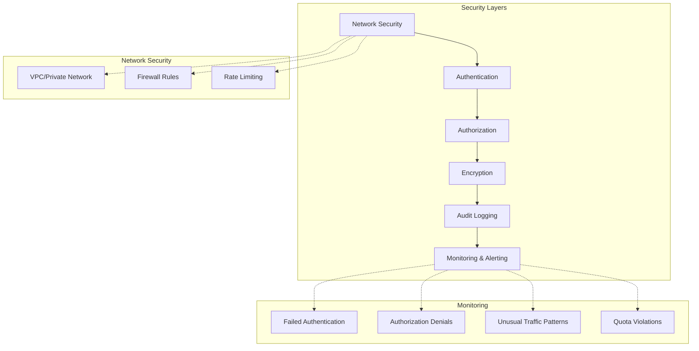

### Security Checklist

```kotlin
data class SecurityChecklist(
    val categories: List<SecurityCategory>
)

data class SecurityCategory(
    val name: String,
    val items: List<SecurityItem>
)

data class SecurityItem(
    val description: String,
    val priority: Priority,
    val implemented: Boolean
)

enum class Priority {
    CRITICAL, HIGH, MEDIUM, LOW
}

fun createKafkaSecurityChecklist(): SecurityChecklist {
    return SecurityChecklist(
        categories = listOf(
            SecurityCategory(
                name = "Authentication",
                items = listOf(
                    SecurityItem("Enable SSL/TLS for all connections", Priority.CRITICAL, false),
                    SecurityItem("Use SASL/SCRAM or Kerberos for authentication", Priority.CRITICAL, false),
                    SecurityItem("Disable PLAINTEXT and SASL_PLAINTEXT in production", Priority.CRITICAL, false),
                    SecurityItem("Rotate credentials every 90 days", Priority.HIGH, false),
                    SecurityItem("Use strong passwords (min 20 chars, random)", Priority.HIGH, false),
                    SecurityItem("Store credentials in secret management system", Priority.CRITICAL, false),
                    SecurityItem("Enable mutual TLS (mTLS) for critical services", Priority.MEDIUM, false)
                )
            ),
            SecurityCategory(
                name = "Authorization",
                items = listOf(
                    SecurityItem("Enable ACL authorizer", Priority.CRITICAL, false),
                    SecurityItem("Set allow.everyone.if.no.acl.found=false", Priority.CRITICAL, false),
                    SecurityItem("Implement least privilege access", Priority.CRITICAL, false),
                    SecurityItem("Use prefixed ACLs for multi-tenancy", Priority.HIGH, false),
                    SecurityItem("Avoid DENY rules unless necessary", Priority.MEDIUM, false),
                    SecurityItem("Regular ACL audits", Priority.HIGH, false),
                    SecurityItem("Remove unused ACLs", Priority.MEDIUM, false)
                )
            ),
            SecurityCategory(
                name = "Encryption",
                items = listOf(
                    SecurityItem("Enable SSL/TLS for all listeners", Priority.CRITICAL, false),
                    SecurityItem("Use TLSv1.3 or TLSv1.2 only", Priority.CRITICAL, false),
                    SecurityItem("Disable weak cipher suites", Priority.HIGH, false),
                    SecurityItem("Enable disk encryption for data at rest", Priority.HIGH, false),
                    SecurityItem("Implement application-level encryption for sensitive data", Priority.MEDIUM, false),
                    SecurityItem("Use hardware-accelerated ciphers (AES-GCM)", Priority.MEDIUM, false)
                )
            ),
            SecurityCategory(
                name = "Network Security",
                items = listOf(
                    SecurityItem("Deploy in private network/VPC", Priority.CRITICAL, false),
                    SecurityItem("Configure firewall rules", Priority.CRITICAL, false),
                    SecurityItem("Separate internal and external listeners", Priority.HIGH, false),
                    SecurityItem("Use bastion hosts for admin access", Priority.HIGH, false),
                    SecurityItem("Enable DDoS protection", Priority.MEDIUM, false),
                    SecurityItem("Implement network segmentation", Priority.MEDIUM, false)
                )
            ),
            SecurityCategory(
                name = "Audit & Monitoring",
                items = listOf(
                    SecurityItem("Enable audit logging", Priority.CRITICAL, false),
                    SecurityItem("Log all authentication attempts", Priority.CRITICAL, false),
                    SecurityItem("Log all authorization decisions", Priority.HIGH, false),
                    SecurityItem("Monitor for suspicious activity", Priority.HIGH, false),
                    SecurityItem("Alert on failed authentication", Priority.HIGH, false),
                    SecurityItem("Send logs to centralized system (SIEM)", Priority.HIGH, false),
                    SecurityItem("Retain logs for compliance period", Priority.MEDIUM, false)
                )
            ),
            SecurityCategory(
                name = "Operational Security",
                items = listOf(
                    SecurityItem("Regular security updates and patches", Priority.CRITICAL, false),
                    SecurityItem("Vulnerability scanning", Priority.HIGH, false),
                    SecurityItem("Security incident response plan", Priority.HIGH, false),
                    SecurityItem("Regular security training for team", Priority.MEDIUM, false),
                    SecurityItem("Penetration testing", Priority.MEDIUM, false),
                    SecurityItem("Disaster recovery and backup procedures", Priority.HIGH, false)
                )
            ),
            SecurityCategory(
                name = "Quotas & Multi-tenancy",
                items = listOf(
                    SecurityItem("Implement quotas for all tenants", Priority.CRITICAL, false),
                    SecurityItem("Separate tenants with ACLs", Priority.CRITICAL, false),
                    SecurityItem("Use topic naming conventions", Priority.HIGH, false),
                    SecurityItem("Monitor quota violations", Priority.HIGH, false),
                    SecurityItem("Implement resource limits per tenant", Priority.MEDIUM, false)
                )
            )
        )
    )
}

fun printSecurityChecklist(checklist: SecurityChecklist) {
    checklist.categories.forEach { category ->
        println("\n## ${category.name}")
        println("=" * 60)
        category.items.sortedByDescending { it.priority }.forEach { item ->
            val status = if (item.implemented) "✅" else "❌"
            val priority = when (item.priority) {
                Priority.CRITICAL -> "[CRITICAL]"
                Priority.HIGH -> "[HIGH]"
                Priority.MEDIUM -> "[MEDIUM]"
                Priority.LOW -> "[LOW]"
            }
            println("$status $priority ${item.description}")
        }
    }
}
```

### Audit Logging

```kotlin
// Enable audit logging in Kafka
fun configureAuditLogging() {
    val brokerConfig = """
        # Authorizer with audit logging
        authorizer.class.name=kafka.security.authorizer.AclAuthorizer

        # Log all authorization decisions
        log4j.logger.kafka.authorizer.logger=INFO, authorizerAppender
        log4j.additivity.kafka.authorizer.logger=false

        log4j.appender.authorizerAppender=org.apache.log4j.DailyRollingFileAppender
        log4j.appender.authorizerAppender.DatePattern='.'yyyy-MM-dd-HH
        log4j.appender.authorizerAppender.File=/var/log/kafka/kafka-authorizer.log
        log4j.appender.authorizerAppender.layout=org.apache.log4j.PatternLayout
        log4j.appender.authorizerAppender.layout.ConversionPattern=[%d] %p %m (%c)%n

        # Authentication audit logging
        log4j.logger.kafka.server.KafkaApis=INFO, authAppender
        log4j.additivity.kafka.server.KafkaApis=false

        log4j.appender.authAppender=org.apache.log4j.DailyRollingFileAppender
        log4j.appender.authAppender.DatePattern='.'yyyy-MM-dd-HH
        log4j.appender.authAppender.File=/var/log/kafka/kafka-auth.log
        log4j.appender.authAppender.layout=org.apache.log4j.PatternLayout
        log4j.appender.authAppender.layout.ConversionPattern=[%d] %p %m (%c)%n
    """.trimIndent()

    println(brokerConfig)
}

// Parse and analyze audit logs
data class AuditLogEntry(
    val timestamp: String,
    val principal: String,
    val operation: String,
    val resourceType: String,
    val resourceName: String,
    val allowed: Boolean,
    val host: String
)

fun parseAuditLog(logLine: String): AuditLogEntry? {
    // Example log format:
    // [2025-01-03 10:15:30,123] INFO Principal = User:alice is Allowed Operation = Write from host = 192.168.1.100 on resource = Topic:LITERAL:orders

    val principalRegex = """Principal = ([^:]+:[^\s]+)""".toRegex()
    val operationRegex = """Operation = (\w+)""".toRegex()
    val allowedRegex = """is (Allowed|Denied)""".toRegex()
    val hostRegex = """from host = ([^\s]+)""".toRegex()
    val resourceRegex = """on resource = (\w+):(\w+):([^\s]+)""".toRegex()

    val principal = principalRegex.find(logLine)?.groupValues?.get(1)
    val operation = operationRegex.find(logLine)?.groupValues?.get(1)
    val allowed = allowedRegex.find(logLine)?.groupValues?.get(1) == "Allowed"
    val host = hostRegex.find(logLine)?.groupValues?.get(1)
    val resourceMatch = resourceRegex.find(logLine)

    if (principal != null && operation != null && host != null && resourceMatch != null) {
        return AuditLogEntry(
            timestamp = logLine.substring(1, 24),
            principal = principal,
            operation = operation,
            resourceType = resourceMatch.groupValues[1],
            resourceName = resourceMatch.groupValues[3],
            allowed = allowed,
            host = host
        )
    }

    return null
}

fun analyzeAuditLogs(logFile: String) {
    println("""
        Audit Log Analysis Queries:

        # Failed authentication attempts
        grep "authentication failed" /var/log/kafka/kafka-auth.log | wc -l

        # Authorization denials
        grep "is Denied" /var/log/kafka/kafka-authorizer.log

        # Suspicious activity (multiple denials from same user)
        grep "is Denied" /var/log/kafka/kafka-authorizer.log | \
            awk '{print ${'$'}4}' | sort | uniq -c | sort -rn | head -20

        # Access to sensitive topics
        grep "Topic:LITERAL:pii-" /var/log/kafka/kafka-authorizer.log

        # After-hours access
        grep "2025-01-03 (0[0-5]|2[2-3]):" /var/log/kafka/kafka-authorizer.log

        # Access from unusual IPs
        grep "from host = 10.0.99" /var/log/kafka/kafka-authorizer.log

        # Export to SIEM
        filebeat -c /etc/filebeat/kafka-audit.yml
    """.trimIndent())
}

// Security alerting rules
data class SecurityAlert(
    val name: String,
    val severity: String,
    val condition: String,
    val action: String
)

fun defineSecurityAlerts(): List<SecurityAlert> {
    return listOf(
        SecurityAlert(
            name = "Multiple Failed Authentication Attempts",
            severity = "HIGH",
            condition = "> 10 failed auth attempts from same IP in 5 minutes",
            action = "Alert security team, consider IP blocking"
        ),
        SecurityAlert(
            name = "Authorization Denial Spike",
            severity = "MEDIUM",
            condition = "> 100 authorization denials in 10 minutes",
            action = "Alert ops team, check for misconfigured clients"
        ),
        SecurityAlert(
            name = "Sensitive Topic Access",
            severity = "HIGH",
            condition = "Access to PII topics from unauthorized user",
            action = "Alert security team immediately"
        ),
        SecurityAlert(
            name = "After-Hours Admin Access",
            severity = "MEDIUM",
            condition = "Admin operations outside business hours",
            action = "Log and review, alert if pattern detected"
        ),
        SecurityAlert(
            name = "New IP Address for User",
            severity = "LOW",
            condition = "User connecting from previously unseen IP",
            action = "Log for review"
        ),
        SecurityAlert(
            name = "Quota Violation Spike",
            severity = "MEDIUM",
            condition = "Tenant exceeding quota by > 200%",
            action = "Alert ops team, investigate potential abuse"
        ),
        SecurityAlert(
            name = "SSL Certificate Expiration",
            severity = "CRITICAL",
            condition = "Certificate expires in < 7 days",
            action = "Alert ops team immediately, rotate certificates"
        )
    )
}
```

⚠️ **PITFALL #7: Compliance and Data Residency**

**Problem**: Not considering compliance requirements (GDPR, HIPAA, SOC2) and data residency.

**Consequences**:
- Regulatory violations and fines
- Data sovereignty issues
- Audit failures
- Legal liability

**Solution**:
```kotlin
data class ComplianceRequirements(
    val regulations: List<Regulation>,
    val dataClassification: DataClassification,
    val retentionPolicy: RetentionPolicy,
    val dataResidency: DataResidency
)

enum class Regulation {
    GDPR,      // EU General Data Protection Regulation
    CCPA,      // California Consumer Privacy Act
    HIPAA,     // Health Insurance Portability and Accountability Act
    PCI_DSS,   // Payment Card Industry Data Security Standard
    SOC2,      // Service Organization Control 2
    ISO27001   // Information Security Management
}

data class DataClassification(
    val level: ClassificationLevel,
    val piiFields: List<String>,
    val encryptionRequired: Boolean
)

enum class ClassificationLevel {
    PUBLIC,
    INTERNAL,
    CONFIDENTIAL,
    RESTRICTED
}

data class RetentionPolicy(
    val retentionDays: Int,
    val archiveAfterDays: Int?,
    val rightToForgetting: Boolean  // GDPR right to erasure
)

data class DataResidency(
    val region: String,
    val allowedRegions: List<String>,
    val crossBorderTransfer: Boolean
)

class ComplianceManager {

    fun implementGdprCompliance() {
        println("""
            GDPR Compliance for Kafka:

            1. Data Minimization:
               - Only collect necessary data
               - Implement data retention policies
               - Automatic deletion after retention period

            2. Right to Access:
               - Ability to retrieve all data for a user
               - Implement user_id as message key for efficient retrieval
               - Maintain index of user data locations

            3. Right to Erasure (Right to be Forgotten):
               - Challenge: Kafka is append-only
               - Solutions:
                 a) Tombstone records (for compacted topics)
                 b) Application-level filtering
                 c) Re-encryption with discarded key
                 d) Topic rewrite (expensive)

            4. Data Portability:
               - Export data in machine-readable format
               - Provide API for data export

            5. Encryption:
               - Encryption in transit (SSL/TLS)
               - Encryption at rest
               - Application-level encryption for PII

            6. Audit Logging:
               - Log all access to personal data
               - Retain logs for compliance period
               - Regular audit reviews

            7. Data Processing Agreement:
               - Document data processing activities
               - Maintain record of processing
               - Regular compliance audits
        """.trimIndent())
    }

    fun implementRightToForgetting(userId: String, topic: String) {
        println("""
            Right to Forgetting Implementation Options:

            Option 1: Tombstone Records (for compacted topics)
            - Produce null value with user_id key
            - Compaction removes all previous records
            - Limitations: Only works with compacted topics

            kafka-console-producer.sh --bootstrap-server localhost:9093 \\
                --topic $topic --property "parse.key=true" \\
                --property "key.separator=:"
            $userId:null

            Option 2: Application-Level Filtering
            - Mark records as deleted in application
            - Filter out deleted records on read
            - Limitations: Data still in Kafka

            Option 3: Re-encrypt with Discarded Key
            - Re-produce messages with new encryption key
            - Discard old key
            - Makes old messages unreadable

            Option 4: Topic Rewrite (most expensive)
            - Create new topic
            - Copy all messages except user's data
            - Switch applications to new topic
            - Delete old topic

            Recommended: Combination of options
            - Use tombstones for compacted topics
            - Application-level encryption + key discard
            - Document that raw data is unrecoverable
        """.trimIndent())
    }

    fun implementDataResidency(config: DataResidency) {
        println("""
            Data Residency Implementation:

            Region: ${config.region}
            Allowed Regions: ${config.allowedRegions.joinToString(", ")}
            Cross-Border Transfer: ${config.crossBorderTransfer}

            Strategies:

            1. Regional Kafka Clusters:
               - Deploy separate clusters per region
               - EU cluster for EU data
               - US cluster for US data
               - Asia cluster for Asia data

            2. Mirror Maker for Regional Replication:
               - Replicate only non-PII data across regions
               - Keep PII data within region
               - Use topic prefixes to identify PII topics

            3. Rack Awareness for Broker Placement:
               - Map racks to data centers in approved regions
               - Ensure replicas stay within region

               # Broker config
               broker.rack=eu-west-1a

               # Topic config with rack awareness
               replica.selector.class=org.apache.kafka.common.replica.RackAwareReplicaSelector

            4. Network Controls:
               - Firewall rules to prevent cross-border traffic
               - VPC peering only within region
               - Monitor network flows

            5. Compliance Verification:
               - Regular audits of data locations
               - Automated checks for data residency
               - Alert on policy violations
        """.trimIndent())
    }

    fun implementHipaaCompliance() {
        println("""
            HIPAA Compliance for Kafka:

            1. Access Controls:
               - Role-based access control (RBAC)
               - Minimum necessary access
               - Unique user IDs
               - Emergency access procedures

            2. Audit Controls:
               - Log all PHI access
               - Retain audit logs for 6 years
               - Regular audit log reviews
               - Tamper-proof audit logs

            3. Integrity Controls:
               - Checksums for data integrity
               - Digital signatures
               - Prevent unauthorized alteration

            4. Transmission Security:
               - TLS 1.2+ for all connections
               - Strong cipher suites
               - Certificate-based authentication

            5. Encryption:
               - Encryption in transit (TLS)
               - Encryption at rest (disk encryption)
               - Application-level encryption for PHI

            6. Backup and Recovery:
               - Regular backups
               - Disaster recovery plan
               - Tested recovery procedures

            7. Business Associate Agreement:
               - BAA with all service providers
               - Document data handling
               - Regular compliance reviews
        """.trimIndent())
    }
}
```

---

## Summary and Key Takeaways

### Security Layers

1. **Network Security**: VPC, firewalls, segmentation
2. **Authentication**: SSL/TLS, SASL (SCRAM, Kerberos, OAuth)
3. **Authorization**: ACLs with least privilege
4. **Encryption**: TLS for transit, disk encryption for rest
5. **Audit**: Comprehensive logging and monitoring
6. **Quotas**: Resource isolation and abuse prevention

### Critical Pitfalls to Avoid

1. ⚠️ **Security as Afterthought**: Plan from day one
2. ⚠️ **Certificate Expiration**: Monitor and automate rotation
3. ⚠️ **Poor Credential Management**: Use secret managers
4. ⚠️ **ACL Complexity**: DENY overrides ALLOW, keep simple
5. ⚠️ **Key Management**: Never store keys with encrypted data
6. ⚠️ **Quota Precedence**: Understand most-specific wins
7. ⚠️ **Compliance**: GDPR, HIPAA require planning

### Best Practices

✅ **Use TLSv1.3** with hardware-accelerated ciphers (AES-GCM)
✅ **SASL/SCRAM-SHA-512** for authentication (better than PLAIN)
✅ **Prefixed ACLs** for multi-tenancy (e.g., `tenant-123-*`)
✅ **User-level quotas** for tenant isolation
✅ **Vault/KMS** for credential and key storage
✅ **Audit everything**: Authentication, authorization, access
✅ **Defense in depth**: Multiple security layers

### Multi-tenancy Patterns

- **Soft Isolation**: Shared cluster, ACLs, quotas, naming
- **Medium Isolation**: Dedicated topics, strict ACLs, rack awareness
- **Hard Isolation**: Separate clusters per tenant

### Production Checklist

- [ ] SSL/TLS enabled on all listeners
- [ ] SASL authentication configured
- [ ] ACL authorizer enabled with `allow.everyone.if.no.acl.found=false`
- [ ] Quotas set for all tenants
- [ ] Audit logging enabled and sent to SIEM
- [ ] Certificate monitoring and rotation automated
- [ ] Credential rotation policy (90 days)
- [ ] Regular security audits scheduled
- [ ] Incident response plan documented
- [ ] Compliance requirements addressed (GDPR, HIPAA, etc.)

### Next Steps

This completes the comprehensive Kafka Deep Dive series covering:
1. Architecture
2. Topics and Partitions
3. Producers
4. Consumers
5. Storage
6. Internals
7. Performance
8. Security ✅

You now have a complete reference for understanding Kafka from fundamentals to production-ready deployments with security, multi-tenancy, and compliance considerations.

---

**Congratulations!** You've completed the Kafka Deep Dive series. These tutorials provide a comprehensive foundation for designing, implementing, and operating secure, scalable, and compliant Kafka systems in production.
