# Kafka for Java Developers - Part 1: Introduction to Apache Kafka

**Why Learn Kafka?** Apache Kafka has become the de facto standard for event streaming and real-time data pipelines. Used by 80% of Fortune 100 companies, Kafka powers everything from real-time analytics to microservices communication, making it an essential skill for modern Java developers.

Apache Kafka was originally developed at LinkedIn in 2011 to handle their massive data ingestion needs. Today, it processes trillions of events daily at companies like Netflix, Uber, Spotify, and Airbnb.

## What is Apache Kafka?

**Core Definition**: Apache Kafka is a distributed event streaming platform capable of handling trillions of events per day. It combines the capabilities of a messaging system, storage system, and stream processing platform.

**The Fundamental Shift**: Traditional systems follow request-response patterns. Kafka introduces event-driven architecture where systems react to streams of events as they occur.

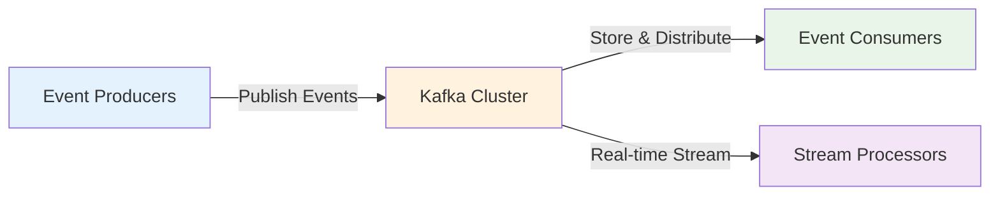

**Key Characteristics**:
- **Distributed**: Runs as a cluster across multiple servers for scalability and fault tolerance
- **Persistent**: Stores event streams durably on disk, enabling replay and time travel
- **High Throughput**: Handles millions of messages per second with low latency
- **Real-time**: Processes events as they arrive with millisecond latency

## Core Kafka Concepts

### Topics and Partitions

**Topics** are named streams of related events. Think of a topic like a category or folder for messages.

**Partitions** are ordered, immutable sequences of records within a topic. They enable parallelism and scalability.

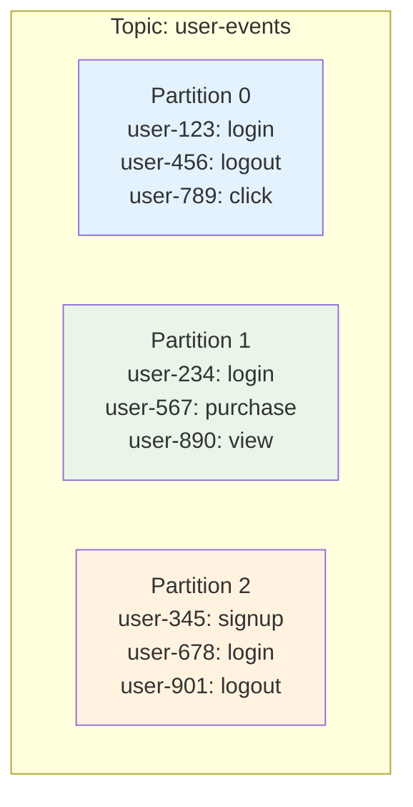

**Why Partitions Matter**:
- **Parallelism**: Multiple consumers can read different partitions simultaneously
- **Ordering**: Messages within a partition are strictly ordered
- **Scalability**: Add partitions to increase throughput

### Producers and Consumers

**Producers** write events to Kafka topics. They decide which partition receives each message.

```java
// Simple producer concept
Properties props = new Properties();
props.put("bootstrap.servers", "localhost:9092");
props.put("key.serializer", "org.apache.kafka.common.serialization.StringSerializer");
props.put("value.serializer", "org.apache.kafka.common.serialization.StringSerializer");

KafkaProducer<String, String> producer = new KafkaProducer<>(props);
ProducerRecord<String, String> record =
    new ProducerRecord<>("user-events", "user-123", "login");
producer.send(record);
```

**Consumers** read events from topics. They track their position (offset) in each partition.

```java
// Simple consumer concept
Properties props = new Properties();
props.put("bootstrap.servers", "localhost:9092");
props.put("group.id", "analytics-service");
props.put("key.deserializer", "org.apache.kafka.common.serialization.StringDeserializer");
props.put("value.deserializer", "org.apache.kafka.common.serialization.StringDeserializer");

KafkaConsumer<String, String> consumer = new KafkaConsumer<>(props);
consumer.subscribe(Collections.singletonList("user-events"));

while (true) {
    ConsumerRecords<String, String> records = consumer.poll(Duration.ofMillis(100));
    for (ConsumerRecord<String, String> record : records) {
        System.out.printf("User: %s, Event: %s%n", record.key(), record.value());
    }
}
```

### Consumer Groups

**Consumer Groups** enable parallel processing and load balancing. Each consumer in a group reads from different partitions.

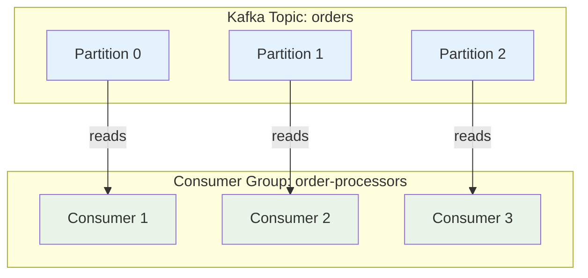

**Key Rules**:
- Each partition is consumed by exactly one consumer in a group
- Multiple groups can independently consume the same topic
- If consumers > partitions, some consumers sit idle

### Offsets and Message Ordering

**Offsets** are sequential IDs assigned to each message within a partition. They enable consumers to track their progress.

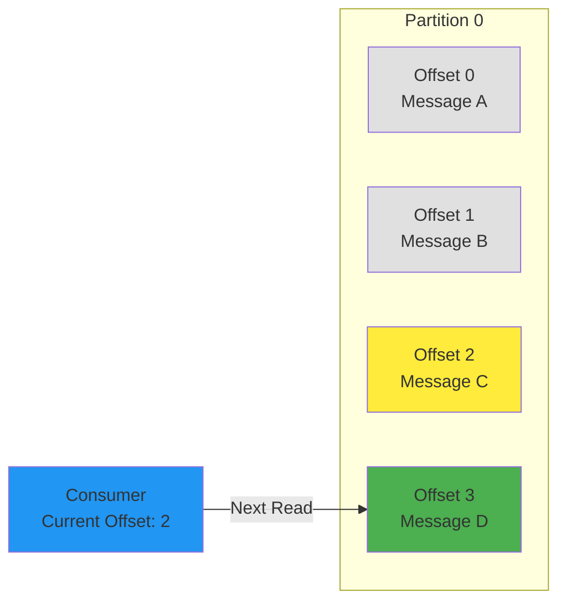

**Critical Points**:
- **Within Partition**: Strict ordering guaranteed
- **Across Partitions**: No ordering guarantee
- **Commit Strategy**: Consumers periodically commit offsets to track progress

## Kafka Architecture Deep Dive

### Brokers and Clusters

**Brokers** are Kafka servers that store data and serve clients. A **Cluster** is a group of brokers working together.

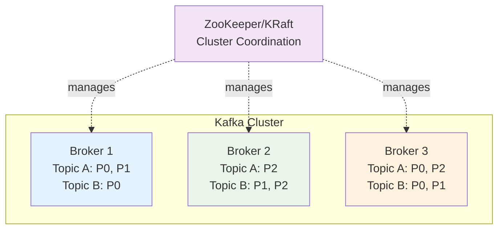

**Responsibilities**:
- Store partition data
- Handle producer writes and consumer reads
- Replicate data across brokers
- Participate in partition leadership

### Replication and Fault Tolerance

**Replication** ensures data durability. Each partition has one leader and multiple follower replicas.

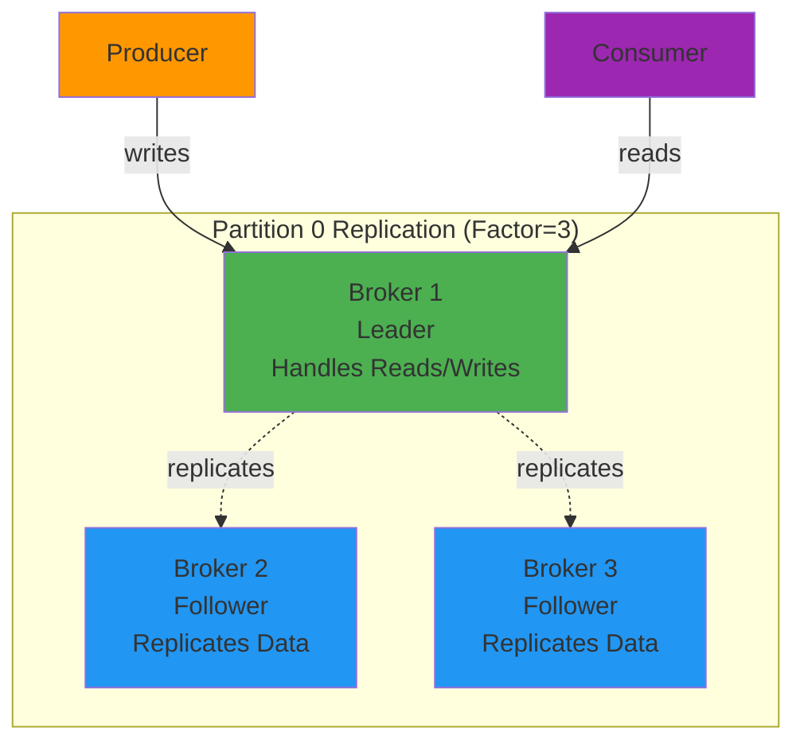

**Failure Scenario**:
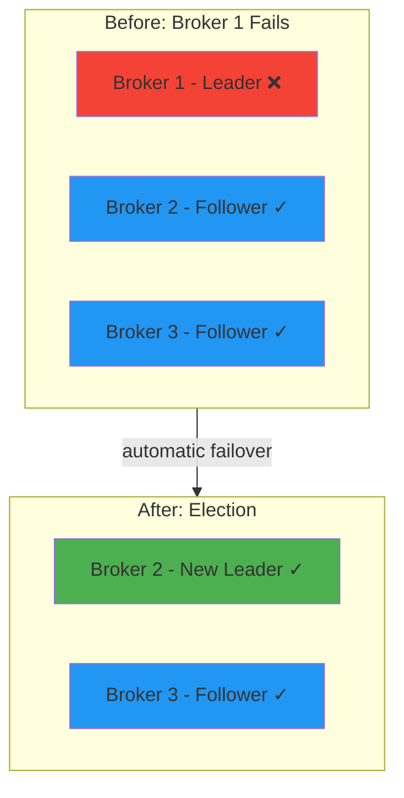

**Key Concepts**:
- **ISR (In-Sync Replicas)**: Replicas that are fully caught up with the leader
- **min.insync.replicas**: Minimum ISR required for writes to succeed
- **Automatic Failover**: Followers elect new leader when current leader fails

## Real-World Use Cases

### 1. Event-Driven Microservices

**Scenario**: E-commerce order processing with multiple services

```java
// Order Service - Publishes order events
public class OrderService {
    private KafkaProducer<String, OrderEvent> producer;

    public void createOrder(Order order) {
        // Save to database
        orderRepository.save(order);

        // Publish event to Kafka
        OrderEvent event = new OrderEvent(order.getId(), "ORDER_CREATED", order);
        ProducerRecord<String, OrderEvent> record =
            new ProducerRecord<>("orders", order.getId(), event);
        producer.send(record);

        System.out.println("Order created and event published: " + order.getId());
    }
}

// Inventory Service - Consumes order events
public class InventoryService {
    public void processOrderEvents() {
        KafkaConsumer<String, OrderEvent> consumer = createConsumer();
        consumer.subscribe(Collections.singletonList("orders"));

        while (true) {
            ConsumerRecords<String, OrderEvent> records =
                consumer.poll(Duration.ofMillis(100));

            for (ConsumerRecord<String, OrderEvent> record : records) {
                OrderEvent event = record.value();
                if ("ORDER_CREATED".equals(event.getEventType())) {
                    // Reserve inventory
                    reserveInventory(event.getOrder());

                    // Publish inventory reserved event
                    publishInventoryEvent(event.getOrder().getId(), "INVENTORY_RESERVED");
                }
            }
        }
    }
}
```

**Event Flow**:
```mermaid
flowchart LR
    OS[Order Service] -->|ORDER_CREATED| K1[orders topic]
    K1 --> IS[Inventory Service]
    IS -->|INVENTORY_RESERVED| K2[inventory topic]
    K2 --> PS[Payment Service]
    PS -->|PAYMENT_PROCESSED| K3[payments topic]
    K3 --> NS[Notification Service]

    style OS fill:#e3f2fd
    style IS fill:#e8f5e8
    style PS fill:#fff3e0
    style NS fill:#f3e5f5
```

### 2. Real-Time Analytics Pipeline

**Scenario**: Website clickstream analysis

```java
// Click Event Producer (embedded in web application)
public class ClickStreamProducer {
    private KafkaProducer<String, ClickEvent> producer;

    public void trackClick(String userId, String page, String action) {
        ClickEvent event = new ClickEvent(
            userId,
            page,
            action,
            System.currentTimeMillis()
        );

        ProducerRecord<String, ClickEvent> record =
            new ProducerRecord<>("clickstream", userId, event);
        producer.send(record);
    }
}

// Real-time Analytics Consumer
public class ClickStreamAnalytics {
    private Map<String, Integer> pageViews = new HashMap<>();

    public void analyzeClickStream() {
        KafkaConsumer<String, ClickEvent> consumer = createConsumer();
        consumer.subscribe(Collections.singletonList("clickstream"));

        while (true) {
            ConsumerRecords<String, ClickEvent> records =
                consumer.poll(Duration.ofMillis(100));

            for (ConsumerRecord<String, ClickEvent> record : records) {
                ClickEvent event = record.value();

                // Update real-time metrics
                pageViews.merge(event.getPage(), 1, Integer::sum);

                // Detect patterns
                if (event.getAction().equals("purchase")) {
                    System.out.println("Purchase detected: " + event.getUserId());
                    // Trigger recommendation engine
                }
            }

            // Periodically publish metrics
            publishMetrics();
        }
    }
}
```

### 3. Log Aggregation

**Scenario**: Centralized logging from microservices

```java
// Application Service - Produces logs
public class ApplicationLogger {
    private KafkaProducer<String, LogEntry> producer;
    private String serviceName;

    public void log(String level, String message, Exception exception) {
        LogEntry entry = new LogEntry(
            serviceName,
            level,
            message,
            exception != null ? exception.toString() : null,
            System.currentTimeMillis()
        );

        ProducerRecord<String, LogEntry> record =
            new ProducerRecord<>("application-logs", serviceName, entry);
        producer.send(record);
    }
}

// Log Aggregation Service
public class LogAggregator {
    public void aggregateLogs() {
        KafkaConsumer<String, LogEntry> consumer = createConsumer();
        consumer.subscribe(Collections.singletonList("application-logs"));

        while (true) {
            ConsumerRecords<String, LogEntry> records =
                consumer.poll(Duration.ofMillis(100));

            for (ConsumerRecord<String, LogEntry> record : records) {
                LogEntry entry = record.value();

                // Index in Elasticsearch
                elasticsearchClient.index(entry);

                // Alert on errors
                if ("ERROR".equals(entry.getLevel())) {
                    alertingService.sendAlert(entry);
                }

                // Store in data warehouse
                dataWarehouse.store(entry);
            }
        }
    }
}
```

## Kafka vs Traditional Messaging Systems

### Kafka vs RabbitMQ

**RabbitMQ** (Message Broker):
- Point-to-point and pub/sub messaging
- Message deleted after consumption
- Complex routing with exchanges
- Lower throughput, rich features

**Kafka** (Event Streaming Platform):
- All messages stored durably
- Multiple consumers can read same data
- Simple topic-based routing
- Extremely high throughput

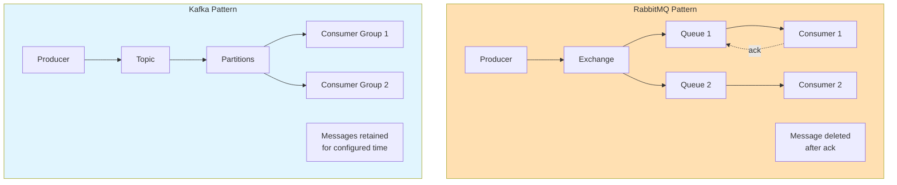

### When to Choose Kafka

**Choose Kafka When**:
- High throughput required (millions of events/sec)
- Multiple consumers need the same data
- Event replay or time travel needed
- Building event-driven architecture
- Stream processing required

**Choose Traditional MQ When**:
- Complex routing rules needed
- Task queue pattern (work once, delete)
- Lower volume, rich messaging features
- Strong message delivery guarantees per message

## Kafka Ecosystem

### Core Components

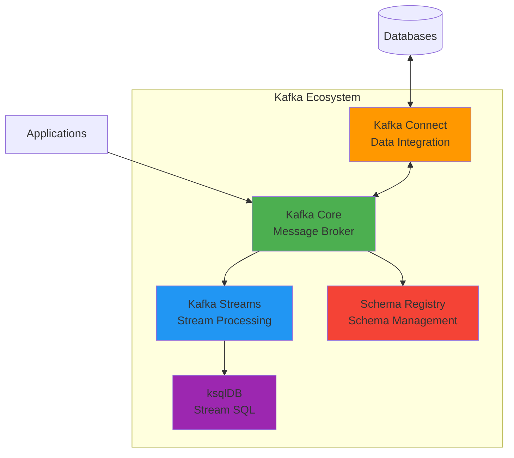

**Kafka Streams**: Java library for building stream processing applications
**Kafka Connect**: Framework for connecting Kafka with external systems
**Schema Registry**: Manages Avro/Protobuf schemas for event data
**ksqlDB**: SQL interface for stream processing

### Integration Patterns

**Source Connectors** (Data In):
- MySQL CDC (Change Data Capture)
- MongoDB
- PostgreSQL
- S3, HDFS

**Sink Connectors** (Data Out):
- Elasticsearch
- Data warehouses (Snowflake, BigQuery)
- Databases
- Cloud storage

## Performance Characteristics

### Throughput Benchmarks

**Typical Performance** (3-broker cluster):
- **Producer**: 500K+ messages/sec
- **Consumer**: 1M+ messages/sec
- **Latency**: 2-10ms end-to-end
- **Storage**: Petabyte-scale retention

**Why So Fast?**:
- **Zero-copy**: Data transferred without CPU involvement
- **Sequential I/O**: Disk writes are sequential, not random
- **Batching**: Multiple messages sent together
- **Compression**: Reduces network and disk I/O

### Scalability Model

**Horizontal Scaling**:
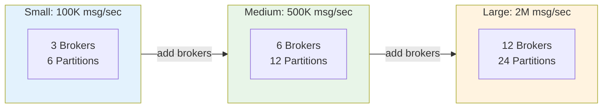

**Scaling Strategy**:
1. Add partitions to increase parallelism
2. Add brokers to distribute load
3. Add consumers to process faster
4. No downtime during scaling

## Key Takeaways

- **Kafka is a distributed event streaming platform**, not just a message queue
- **Topics and partitions** provide ordered, scalable event streams
- **Producer-consumer model** with durable storage enables multiple independent readers
- **Replication ensures fault tolerance** with automatic failover
- **Event-driven architecture** enables loosely coupled, scalable microservices
- **High throughput and low latency** make Kafka suitable for real-time systems
- **Rich ecosystem** provides stream processing, connectors, and schema management

## What's Next

In the next tutorial, we'll get hands-on by setting up Kafka locally, creating our first producers and consumers, and exploring the Kafka CLI tools. We'll build a complete working example that demonstrates real-time event streaming in action.

You'll learn:
- Installing and configuring Kafka
- Creating topics with optimal partition strategies
- Writing producers with proper error handling
- Building consumers with offset management
- Testing and debugging Kafka applications

The journey from theory to practice begins in Part 2. Get ready to build real event-driven applications!
