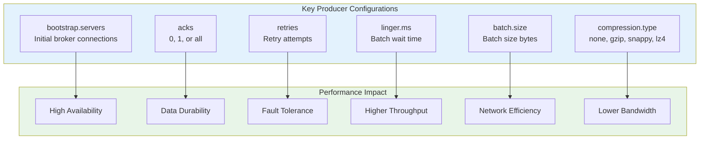
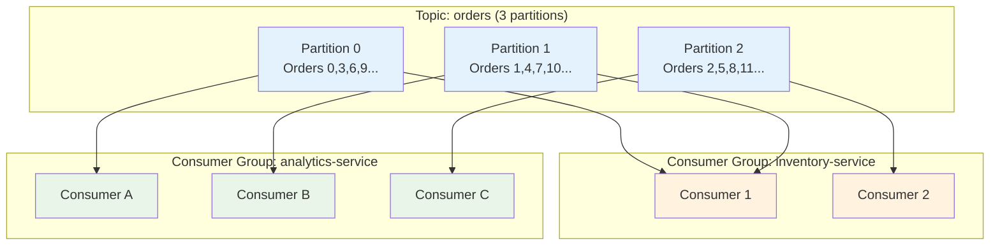
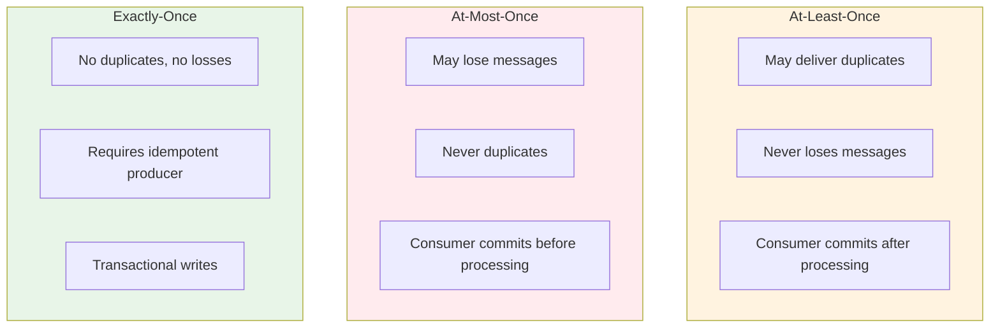

# Kafka for Java Developers - Part 2: Setup and First Producer/Consumer

In this tutorial, we'll move from theory to practice. You'll set up a complete Kafka development environment, create topics, and build working producers and consumers in Java. By the end, you'll have a running system processing real-time events.

## Setting Up Kafka

### Installation Options

**Option 1: Docker (Recommended for Development)**

Create a `docker-compose.yml` file:

```yaml
version: '3.8'
services:
  zookeeper:
    image: confluentinc/cp-zookeeper:7.5.0
    environment:
      ZOOKEEPER_CLIENT_PORT: 2181
      ZOOKEEPER_TICK_TIME: 2000
    ports:
      - "2181:2181"

  kafka:
    image: confluentinc/cp-kafka:7.5.0
    depends_on:
      - zookeeper
    ports:
      - "9092:9092"
      - "9093:9093"
    environment:
      KAFKA_BROKER_ID: 1
      KAFKA_ZOOKEEPER_CONNECT: zookeeper:2181
      KAFKA_ADVERTISED_LISTENERS: PLAINTEXT://localhost:9092,PLAINTEXT_INTERNAL://kafka:9093
      KAFKA_LISTENER_SECURITY_PROTOCOL_MAP: PLAINTEXT:PLAINTEXT,PLAINTEXT_INTERNAL:PLAINTEXT
      KAFKA_INTER_BROKER_LISTENER_NAME: PLAINTEXT_INTERNAL
      KAFKA_OFFSETS_TOPIC_REPLICATION_FACTOR: 1
      KAFKA_TRANSACTION_STATE_LOG_MIN_ISR: 1
      KAFKA_TRANSACTION_STATE_LOG_REPLICATION_FACTOR: 1
```

Start Kafka:
```bash
docker-compose up -d
```

Verify it's running:
```bash
docker-compose ps
```

**Option 2: Local Installation**

Download from [kafka.apache.org/downloads](https://kafka.apache.org/downloads):

```bash
# Extract
tar -xzf kafka_2.13-3.6.0.tgz
cd kafka_2.13-3.6.0

# Start ZooKeeper
bin/zookeeper-server-start.sh config/zookeeper.properties

# Start Kafka (in new terminal)
bin/kafka-server-start.sh config/server.properties
```

### Kafka CLI Tools

**Create a Topic**:
```bash
# Docker
docker exec -it <kafka-container> kafka-topics --create \
  --bootstrap-server localhost:9092 \
  --topic user-events \
  --partitions 3 \
  --replication-factor 1

# Local installation
bin/kafka-topics.sh --create \
  --bootstrap-server localhost:9092 \
  --topic user-events \
  --partitions 3 \
  --replication-factor 1
```

**List Topics**:
```bash
kafka-topics --list --bootstrap-server localhost:9092
```

**Describe Topic**:
```bash
kafka-topics --describe --topic user-events --bootstrap-server localhost:9092
```

Output:
```
Topic: user-events  PartitionCount: 3  ReplicationFactor: 1
  Partition 0  Leader: 1  Replicas: 1  Isr: 1
  Partition 1  Leader: 1  Replicas: 1  Isr: 1
  Partition 2  Leader: 1  Replicas: 1  Isr: 1
```

**Console Producer** (for testing):
```bash
kafka-console-producer --topic user-events --bootstrap-server localhost:9092
>hello world
>test message
```

**Console Consumer** (for testing):
```bash
kafka-console-consumer --topic user-events --from-beginning \
  --bootstrap-server localhost:9092
```

## Java Project Setup

### Maven Configuration

Create `pom.xml`:

```xml
<?xml version="1.0" encoding="UTF-8"?>
<project xmlns="http://maven.apache.org/POM/4.0.0"
         xmlns:xsi="http://www.w3.org/2001/XMLSchema-instance"
         xsi:schemaLocation="http://maven.apache.org/POM/4.0.0
         http://maven.apache.org/xsd/maven-4.0.0.xsd">
    <modelVersion>4.0.0</modelVersion>

    <groupId>com.example</groupId>
    <artifactId>kafka-demo</artifactId>
    <version>1.0-SNAPSHOT</version>

    <properties>
        <maven.compiler.source>17</maven.compiler.source>
        <maven.compiler.target>17</maven.compiler.target>
        <kafka.version>3.6.0</kafka.version>
        <slf4j.version>2.0.9</slf4j.version>
    </properties>

    <dependencies>
        <!-- Kafka Client -->
        <dependency>
            <groupId>org.apache.kafka</groupId>
            <artifactId>kafka-clients</artifactId>
            <version>${kafka.version}</version>
        </dependency>

        <!-- Logging -->
        <dependency>
            <groupId>org.slf4j</groupId>
            <artifactId>slf4j-simple</artifactId>
            <version>${slf4j.version}</version>
        </dependency>

        <!-- JSON Processing -->
        <dependency>
            <groupId>com.fasterxml.jackson.core</groupId>
            <artifactId>jackson-databind</artifactId>
            <version>2.15.3</version>
        </dependency>
    </dependencies>
</project>
```

### Gradle Configuration (Alternative)

Create `build.gradle`:

```gradle
plugins {
    id 'java'
    id 'application'
}

group = 'com.example'
version = '1.0-SNAPSHOT'

repositories {
    mavenCentral()
}

dependencies {
    implementation 'org.apache.kafka:kafka-clients:3.6.0'
    implementation 'org.slf4j:slf4j-simple:2.0.9'
    implementation 'com.fasterxml.jackson.core:jackson-databind:2.15.3'
}

java {
    toolchain {
        languageVersion = JavaLanguageVersion.of(17)
    }
}
```

## Building Your First Producer

### Simple String Producer

```java
package com.example.kafka.producer;

import org.apache.kafka.clients.producer.*;
import org.apache.kafka.common.serialization.StringSerializer;
import java.util.Properties;
import java.util.concurrent.ExecutionException;

public class SimpleProducer {

    private final KafkaProducer<String, String> producer;
    private final String topic;

    public SimpleProducer(String bootstrapServers, String topic) {
        this.topic = topic;

        // Configure producer
        Properties props = new Properties();
        props.put(ProducerConfig.BOOTSTRAP_SERVERS_CONFIG, bootstrapServers);
        props.put(ProducerConfig.KEY_SERIALIZER_CLASS_CONFIG,
                  StringSerializer.class.getName());
        props.put(ProducerConfig.VALUE_SERIALIZER_CLASS_CONFIG,
                  StringSerializer.class.getName());

        // Optional: Performance tuning
        props.put(ProducerConfig.ACKS_CONFIG, "1");
        props.put(ProducerConfig.RETRIES_CONFIG, 3);
        props.put(ProducerConfig.LINGER_MS_CONFIG, 1);

        this.producer = new KafkaProducer<>(props);
    }

    // Fire-and-forget pattern
    public void sendFireAndForget(String key, String value) {
        ProducerRecord<String, String> record =
            new ProducerRecord<>(topic, key, value);
        producer.send(record);
        System.out.println("Sent (fire-and-forget): " + value);
    }

    // Synchronous send
    public void sendSync(String key, String value) {
        ProducerRecord<String, String> record =
            new ProducerRecord<>(topic, key, value);
        try {
            RecordMetadata metadata = producer.send(record).get();
            System.out.printf("Sent (sync): %s to partition %d, offset %d%n",
                value, metadata.partition(), metadata.offset());
        } catch (InterruptedException | ExecutionException e) {
            System.err.println("Error sending message: " + e.getMessage());
        }
    }

    // Asynchronous send with callback
    public void sendAsync(String key, String value) {
        ProducerRecord<String, String> record =
            new ProducerRecord<>(topic, key, value);

        producer.send(record, new Callback() {
            @Override
            public void onCompletion(RecordMetadata metadata, Exception exception) {
                if (exception != null) {
                    System.err.println("Error sending message: " + exception.getMessage());
                } else {
                    System.out.printf("Sent (async): %s to partition %d, offset %d%n",
                        value, metadata.partition(), metadata.offset());
                }
            }
        });
    }

    public void close() {
        producer.close();
    }

    // Main method for testing
    public static void main(String[] args) {
        SimpleProducer producer = new SimpleProducer("localhost:9092", "user-events");

        // Send messages using different patterns
        producer.sendFireAndForget("user-1", "login");
        producer.sendSync("user-2", "purchase");
        producer.sendAsync("user-3", "logout");

        // Send batch of messages
        for (int i = 0; i < 10; i++) {
            producer.sendAsync("user-" + i, "event-" + i);
        }

        producer.close();
    }
}
```

### Understanding Producer Configurations



**Critical Configurations**:

```java
// Reliability vs Performance tradeoff
Properties props = new Properties();

// SCENARIO 1: Maximum reliability (slower)
props.put(ProducerConfig.ACKS_CONFIG, "all");              // Wait for all replicas
props.put(ProducerConfig.RETRIES_CONFIG, Integer.MAX_VALUE); // Infinite retries
props.put(ProducerConfig.MAX_IN_FLIGHT_REQUESTS_PER_CONNECTION, 1); // Ordering guarantee
props.put(ProducerConfig.ENABLE_IDEMPOTENCE_CONFIG, true); // Exactly-once

// SCENARIO 2: Maximum throughput (less reliable)
props.put(ProducerConfig.ACKS_CONFIG, "1");                // Wait for leader only
props.put(ProducerConfig.LINGER_MS_CONFIG, 10);            // Wait 10ms for batching
props.put(ProducerConfig.BATCH_SIZE_CONFIG, 32768);        // 32KB batches
props.put(ProducerConfig.COMPRESSION_TYPE_CONFIG, "lz4");  // Fast compression

// SCENARIO 3: Balanced (recommended for most cases)
props.put(ProducerConfig.ACKS_CONFIG, "1");
props.put(ProducerConfig.RETRIES_CONFIG, 3);
props.put(ProducerConfig.LINGER_MS_CONFIG, 1);
props.put(ProducerConfig.COMPRESSION_TYPE_CONFIG, "snappy");
```

### Real-World Producer: E-Commerce Order Events

```java
package com.example.kafka.producer;

import com.fasterxml.jackson.databind.ObjectMapper;
import org.apache.kafka.clients.producer.*;
import org.apache.kafka.common.serialization.StringSerializer;
import java.util.Properties;
import java.util.UUID;

// Order event model
class OrderEvent {
    private String orderId;
    private String userId;
    private String product;
    private double amount;
    private long timestamp;

    public OrderEvent(String orderId, String userId, String product, double amount) {
        this.orderId = orderId;
        this.userId = userId;
        this.product = product;
        this.amount = amount;
        this.timestamp = System.currentTimeMillis();
    }

    // Getters and setters
    public String getOrderId() { return orderId; }
    public String getUserId() { return userId; }
    public String getProduct() { return product; }
    public double getAmount() { return amount; }
    public long getTimestamp() { return timestamp; }
}

public class OrderProducer {
    private final KafkaProducer<String, String> producer;
    private final ObjectMapper objectMapper;
    private final String topic;

    public OrderProducer(String bootstrapServers, String topic) {
        this.topic = topic;
        this.objectMapper = new ObjectMapper();

        Properties props = new Properties();
        props.put(ProducerConfig.BOOTSTRAP_SERVERS_CONFIG, bootstrapServers);
        props.put(ProducerConfig.KEY_SERIALIZER_CLASS_CONFIG, StringSerializer.class);
        props.put(ProducerConfig.VALUE_SERIALIZER_CLASS_CONFIG, StringSerializer.class);

        // Production-ready configuration
        props.put(ProducerConfig.ACKS_CONFIG, "all");
        props.put(ProducerConfig.ENABLE_IDEMPOTENCE_CONFIG, true);
        props.put(ProducerConfig.RETRIES_CONFIG, 3);
        props.put(ProducerConfig.COMPRESSION_TYPE_CONFIG, "snappy");

        this.producer = new KafkaProducer<>(props);
    }

    public void publishOrder(OrderEvent order) {
        try {
            String orderJson = objectMapper.writeValueAsString(order);

            // Use userId as key for partition assignment
            ProducerRecord<String, String> record =
                new ProducerRecord<>(topic, order.getUserId(), orderJson);

            producer.send(record, (metadata, exception) -> {
                if (exception != null) {
                    System.err.printf("Failed to send order %s: %s%n",
                        order.getOrderId(), exception.getMessage());
                    // In production: retry logic, dead letter queue, etc.
                } else {
                    System.out.printf("Order %s sent to partition %d, offset %d%n",
                        order.getOrderId(), metadata.partition(), metadata.offset());
                }
            });
        } catch (Exception e) {
            System.err.println("Error serializing order: " + e.getMessage());
        }
    }

    public void close() {
        producer.close();
    }

    public static void main(String[] args) throws InterruptedException {
        OrderProducer orderProducer = new OrderProducer("localhost:9092", "orders");

        // Simulate order stream
        String[] users = {"user-1", "user-2", "user-3"};
        String[] products = {"laptop", "phone", "tablet", "headphones"};

        for (int i = 0; i < 20; i++) {
            String orderId = UUID.randomUUID().toString();
            String userId = users[i % users.length];
            String product = products[i % products.length];
            double amount = 100 + (Math.random() * 900);

            OrderEvent order = new OrderEvent(orderId, userId, product, amount);
            orderProducer.publishOrder(order);

            Thread.sleep(1000); // 1 order per second
        }

        orderProducer.close();
    }
}
```

## Building Your First Consumer

### Simple String Consumer

```java
package com.example.kafka.consumer;

import org.apache.kafka.clients.consumer.*;
import org.apache.kafka.common.serialization.StringDeserializer;
import java.time.Duration;
import java.util.Collections;
import java.util.Properties;

public class SimpleConsumer {

    private final KafkaConsumer<String, String> consumer;
    private final String topic;

    public SimpleConsumer(String bootstrapServers, String groupId, String topic) {
        this.topic = topic;

        Properties props = new Properties();
        props.put(ConsumerConfig.BOOTSTRAP_SERVERS_CONFIG, bootstrapServers);
        props.put(ConsumerConfig.GROUP_ID_CONFIG, groupId);
        props.put(ConsumerConfig.KEY_DESERIALIZER_CLASS_CONFIG,
                  StringDeserializer.class.getName());
        props.put(ConsumerConfig.VALUE_DESERIALIZER_CLASS_CONFIG,
                  StringDeserializer.class.getName());

        // Start reading from earliest available message
        props.put(ConsumerConfig.AUTO_OFFSET_RESET_CONFIG, "earliest");

        // Auto-commit offsets every 5 seconds
        props.put(ConsumerConfig.ENABLE_AUTO_COMMIT_CONFIG, true);
        props.put(ConsumerConfig.AUTO_COMMIT_INTERVAL_MS_CONFIG, 5000);

        this.consumer = new KafkaConsumer<>(props);
    }

    public void consume() {
        consumer.subscribe(Collections.singletonList(topic));
        System.out.println("Started consuming from topic: " + topic);

        try {
            while (true) {
                ConsumerRecords<String, String> records =
                    consumer.poll(Duration.ofMillis(100));

                for (ConsumerRecord<String, String> record : records) {
                    System.out.printf("Received: key=%s, value=%s, partition=%d, offset=%d%n",
                        record.key(), record.value(), record.partition(), record.offset());
                }
            }
        } catch (Exception e) {
            System.err.println("Error in consumer: " + e.getMessage());
        } finally {
            consumer.close();
        }
    }

    public static void main(String[] args) {
        SimpleConsumer consumer = new SimpleConsumer(
            "localhost:9092",
            "my-consumer-group",
            "user-events"
        );
        consumer.consume();
    }
}
```

### Manual Offset Management

```java
package com.example.kafka.consumer;

import org.apache.kafka.clients.consumer.*;
import org.apache.kafka.common.TopicPartition;
import org.apache.kafka.common.serialization.StringDeserializer;
import java.time.Duration;
import java.util.*;

public class ManualOffsetConsumer {

    private final KafkaConsumer<String, String> consumer;

    public ManualOffsetConsumer(String bootstrapServers, String groupId, String topic) {
        Properties props = new Properties();
        props.put(ConsumerConfig.BOOTSTRAP_SERVERS_CONFIG, bootstrapServers);
        props.put(ConsumerConfig.GROUP_ID_CONFIG, groupId);
        props.put(ConsumerConfig.KEY_DESERIALIZER_CLASS_CONFIG, StringDeserializer.class);
        props.put(ConsumerConfig.VALUE_DESERIALIZER_CLASS_CONFIG, StringDeserializer.class);

        // Disable auto-commit for manual control
        props.put(ConsumerConfig.ENABLE_AUTO_COMMIT_CONFIG, false);
        props.put(ConsumerConfig.AUTO_OFFSET_RESET_CONFIG, "earliest");

        this.consumer = new KafkaConsumer<>(props);
        consumer.subscribe(Collections.singletonList(topic));
    }

    public void consumeWithManualCommit() {
        try {
            while (true) {
                ConsumerRecords<String, String> records =
                    consumer.poll(Duration.ofMillis(100));

                for (ConsumerRecord<String, String> record : records) {
                    // Process the record
                    processRecord(record);

                    // Commit offset after successful processing
                    TopicPartition partition =
                        new TopicPartition(record.topic(), record.partition());
                    OffsetAndMetadata offset =
                        new OffsetAndMetadata(record.offset() + 1);

                    Map<TopicPartition, OffsetAndMetadata> commitMap = new HashMap<>();
                    commitMap.put(partition, offset);

                    consumer.commitSync(commitMap);
                    System.out.printf("Committed offset %d for partition %d%n",
                        record.offset(), record.partition());
                }
            }
        } catch (Exception e) {
            System.err.println("Error: " + e.getMessage());
        } finally {
            consumer.close();
        }
    }

    private void processRecord(ConsumerRecord<String, String> record) {
        // Simulate processing
        System.out.printf("Processing: %s from partition %d%n",
            record.value(), record.partition());

        // Simulate work
        try {
            Thread.sleep(100);
        } catch (InterruptedException e) {
            Thread.currentThread().interrupt();
        }
    }

    public static void main(String[] args) {
        ManualOffsetConsumer consumer = new ManualOffsetConsumer(
            "localhost:9092",
            "manual-commit-group",
            "user-events"
        );
        consumer.consumeWithManualCommit();
    }
}
```

### Real-World Consumer: Order Processing

```java
package com.example.kafka.consumer;

import com.fasterxml.jackson.databind.ObjectMapper;
import org.apache.kafka.clients.consumer.*;
import org.apache.kafka.common.serialization.StringDeserializer;
import java.time.Duration;
import java.util.*;

public class OrderConsumer {

    private final KafkaConsumer<String, String> consumer;
    private final ObjectMapper objectMapper;
    private final OrderProcessor orderProcessor;

    public OrderConsumer(String bootstrapServers, String groupId, String topic) {
        this.objectMapper = new ObjectMapper();
        this.orderProcessor = new OrderProcessor();

        Properties props = new Properties();
        props.put(ConsumerConfig.BOOTSTRAP_SERVERS_CONFIG, bootstrapServers);
        props.put(ConsumerConfig.GROUP_ID_CONFIG, groupId);
        props.put(ConsumerConfig.KEY_DESERIALIZER_CLASS_CONFIG, StringDeserializer.class);
        props.put(ConsumerConfig.VALUE_DESERIALIZER_CLASS_CONFIG, StringDeserializer.class);

        // Production settings
        props.put(ConsumerConfig.ENABLE_AUTO_COMMIT_CONFIG, false);
        props.put(ConsumerConfig.AUTO_OFFSET_RESET_CONFIG, "earliest");
        props.put(ConsumerConfig.MAX_POLL_RECORDS_CONFIG, 100);
        props.put(ConsumerConfig.SESSION_TIMEOUT_MS_CONFIG, 30000);

        this.consumer = new KafkaConsumer<>(props);
        consumer.subscribe(Collections.singletonList(topic));
    }

    public void processOrders() {
        try {
            while (true) {
                ConsumerRecords<String, String> records =
                    consumer.poll(Duration.ofMillis(100));

                for (ConsumerRecord<String, String> record : records) {
                    try {
                        // Deserialize order
                        OrderEvent order = objectMapper.readValue(
                            record.value(), OrderEvent.class);

                        // Process order
                        boolean success = orderProcessor.process(order);

                        if (success) {
                            System.out.printf("✓ Processed order %s: %s ($%.2f)%n",
                                order.getOrderId(), order.getProduct(), order.getAmount());
                        } else {
                            System.err.printf("✗ Failed to process order %s%n",
                                order.getOrderId());
                            // In production: send to DLQ, alert, retry
                        }

                    } catch (Exception e) {
                        System.err.printf("Error processing record: %s%n", e.getMessage());
                        // In production: error handling, DLQ
                    }
                }

                // Commit after processing batch
                if (!records.isEmpty()) {
                    consumer.commitSync();
                    System.out.println("Committed batch of " + records.count() + " records");
                }
            }
        } catch (Exception e) {
            System.err.println("Consumer error: " + e.getMessage());
        } finally {
            consumer.close();
        }
    }

    // Simulated order processor
    static class OrderProcessor {
        public boolean process(OrderEvent order) {
            // Simulate order processing logic
            // - Validate inventory
            // - Process payment
            // - Update database
            // - Send confirmation

            // Simulate processing time
            try {
                Thread.sleep(50);
            } catch (InterruptedException e) {
                Thread.currentThread().interrupt();
                return false;
            }

            // 95% success rate
            return Math.random() > 0.05;
        }
    }

    public static void main(String[] args) {
        OrderConsumer consumer = new OrderConsumer(
            "localhost:9092",
            "order-processing-service",
            "orders"
        );
        consumer.processOrders();
    }
}
```

## Consumer Groups and Partition Assignment



**Key Insights**:
- Group 1 has 2 consumers, 3 partitions: uneven distribution
- Group 2 has 3 consumers, 3 partitions: perfect balance
- Both groups independently consume all messages
- Adding 4th consumer to Group 2 would leave it idle

## Complete Working Example: User Activity Tracker

### Producer: Track User Activity

```java
package com.example.kafka.activity;

import com.fasterxml.jackson.databind.ObjectMapper;
import org.apache.kafka.clients.producer.*;
import org.apache.kafka.common.serialization.StringSerializer;
import java.util.*;

class UserActivity {
    private String userId;
    private String activityType; // login, view, click, purchase
    private String page;
    private long timestamp;

    public UserActivity(String userId, String activityType, String page) {
        this.userId = userId;
        this.activityType = activityType;
        this.page = page;
        this.timestamp = System.currentTimeMillis();
    }

    // Getters
    public String getUserId() { return userId; }
    public String getActivityType() { return activityType; }
    public String getPage() { return page; }
    public long getTimestamp() { return timestamp; }
}

public class ActivityTracker {
    private final KafkaProducer<String, String> producer;
    private final ObjectMapper mapper = new ObjectMapper();

    public ActivityTracker(String bootstrapServers) {
        Properties props = new Properties();
        props.put(ProducerConfig.BOOTSTRAP_SERVERS_CONFIG, bootstrapServers);
        props.put(ProducerConfig.KEY_SERIALIZER_CLASS_CONFIG, StringSerializer.class);
        props.put(ProducerConfig.VALUE_SERIALIZER_CLASS_CONFIG, StringSerializer.class);
        props.put(ProducerConfig.ACKS_CONFIG, "1");
        props.put(ProducerConfig.COMPRESSION_TYPE_CONFIG, "snappy");

        this.producer = new KafkaProducer<>(props);
    }

    public void trackActivity(UserActivity activity) {
        try {
            String json = mapper.writeValueAsString(activity);
            ProducerRecord<String, String> record =
                new ProducerRecord<>("user-activity", activity.getUserId(), json);

            producer.send(record, (metadata, exception) -> {
                if (exception == null) {
                    System.out.printf("Tracked: %s - %s (%s)%n",
                        activity.getUserId(), activity.getActivityType(), activity.getPage());
                }
            });
        } catch (Exception e) {
            e.printStackTrace();
        }
    }

    public static void main(String[] args) throws InterruptedException {
        ActivityTracker tracker = new ActivityTracker("localhost:9092");

        String[] users = {"alice", "bob", "charlie"};
        String[] activities = {"login", "view", "click", "purchase"};
        String[] pages = {"/home", "/products", "/cart", "/checkout"};

        Random random = new Random();

        for (int i = 0; i < 50; i++) {
            UserActivity activity = new UserActivity(
                users[random.nextInt(users.length)],
                activities[random.nextInt(activities.length)],
                pages[random.nextInt(pages.length)]
            );

            tracker.trackActivity(activity);
            Thread.sleep(500);
        }

        tracker.producer.close();
    }
}
```

### Consumer: Real-time Analytics

```java
package com.example.kafka.activity;

import com.fasterxml.jackson.databind.ObjectMapper;
import org.apache.kafka.clients.consumer.*;
import org.apache.kafka.common.serialization.StringDeserializer;
import java.time.Duration;
import java.util.*;
import java.util.concurrent.ConcurrentHashMap;

public class ActivityAnalytics {
    private final KafkaConsumer<String, String> consumer;
    private final ObjectMapper mapper = new ObjectMapper();
    private final Map<String, UserStats> userStats = new ConcurrentHashMap<>();

    static class UserStats {
        int loginCount = 0;
        int viewCount = 0;
        int clickCount = 0;
        int purchaseCount = 0;

        void update(String activityType) {
            switch (activityType) {
                case "login": loginCount++; break;
                case "view": viewCount++; break;
                case "click": clickCount++; break;
                case "purchase": purchaseCount++; break;
            }
        }

        @Override
        public String toString() {
            return String.format("logins=%d, views=%d, clicks=%d, purchases=%d",
                loginCount, viewCount, clickCount, purchaseCount);
        }
    }

    public ActivityAnalytics(String bootstrapServers, String groupId) {
        Properties props = new Properties();
        props.put(ConsumerConfig.BOOTSTRAP_SERVERS_CONFIG, bootstrapServers);
        props.put(ConsumerConfig.GROUP_ID_CONFIG, groupId);
        props.put(ConsumerConfig.KEY_DESERIALIZER_CLASS_CONFIG, StringDeserializer.class);
        props.put(ConsumerConfig.VALUE_DESERIALIZER_CLASS_CONFIG, StringDeserializer.class);
        props.put(ConsumerConfig.AUTO_OFFSET_RESET_CONFIG, "earliest");

        this.consumer = new KafkaConsumer<>(props);
        consumer.subscribe(Collections.singletonList("user-activity"));
    }

    public void analyze() {
        System.out.println("Starting real-time analytics...\n");

        try {
            while (true) {
                ConsumerRecords<String, String> records =
                    consumer.poll(Duration.ofMillis(100));

                for (ConsumerRecord<String, String> record : records) {
                    try {
                        UserActivity activity = mapper.readValue(
                            record.value(), UserActivity.class);

                        userStats.computeIfAbsent(activity.getUserId(),
                            k -> new UserStats())
                            .update(activity.getActivityType());

                    } catch (Exception e) {
                        System.err.println("Error processing: " + e.getMessage());
                    }
                }

                // Print stats every 10 records
                if (records.count() > 0 && records.count() % 10 == 0) {
                    printStats();
                }
            }
        } finally {
            consumer.close();
        }
    }

    private void printStats() {
        System.out.println("\n=== User Activity Stats ===");
        userStats.forEach((user, stats) -> {
            System.out.printf("%s: %s%n", user, stats);
        });
        System.out.println("==========================\n");
    }

    public static void main(String[] args) {
        ActivityAnalytics analytics = new ActivityAnalytics(
            "localhost:9092",
            "analytics-service"
        );
        analytics.analyze();
    }
}
```

## Message Delivery Guarantees



**Implementation Examples**:

```java
// At-Least-Once (most common)
consumer.poll(Duration.ofMillis(100));
processRecords(records);
consumer.commitSync(); // Commit after processing

// At-Most-Once (rare, for non-critical data)
consumer.poll(Duration.ofMillis(100));
consumer.commitSync(); // Commit before processing
processRecords(records);

// Exactly-Once (requires transactional setup)
Properties props = new Properties();
props.put(ProducerConfig.ENABLE_IDEMPOTENCE_CONFIG, true);
props.put(ProducerConfig.TRANSACTIONAL_ID_CONFIG, "my-transactional-id");
```

## Testing Your Setup

### Integration Test

```bash
# Terminal 1: Start consumer
java com.example.kafka.consumer.SimpleConsumer

# Terminal 2: Start producer
java com.example.kafka.producer.SimpleProducer

# Terminal 3: Monitor topic
kafka-console-consumer --topic user-events \
  --from-beginning --bootstrap-server localhost:9092
```

### Verify Consumer Groups

```bash
# List consumer groups
kafka-consumer-groups --list --bootstrap-server localhost:9092

# Describe group
kafka-consumer-groups --describe \
  --group my-consumer-group \
  --bootstrap-server localhost:9092
```

Output:
```
GROUP           TOPIC       PARTITION  CURRENT-OFFSET  LOG-END-OFFSET  LAG
my-consumer-grp user-events 0          156             156             0
my-consumer-grp user-events 1          142             142             0
my-consumer-grp user-events 2          138             138             0
```

## Key Takeaways

- **Setup Kafka** using Docker Compose or local installation for development
- **Producers** send messages with fire-and-forget, sync, or async patterns
- **Configuration matters**: `acks`, `retries`, and `compression` impact reliability and performance
- **Consumers** poll for messages and manage offsets (auto or manual)
- **Consumer groups** enable parallel processing with automatic partition assignment
- **Message guarantees** depend on producer/consumer configuration
- **Real-world patterns** involve JSON serialization, error handling, and monitoring

## What's Next

In Part 3, we'll dive into advanced producer patterns including custom partitioners, batch optimization, idempotent producers, and transactional writes. You'll learn how to build production-ready producers that handle errors gracefully and maximize throughput.

Topics covered:
- Custom partition strategies
- Producer performance tuning
- Error handling and retries
- Exactly-once semantics
- Monitoring and metrics
