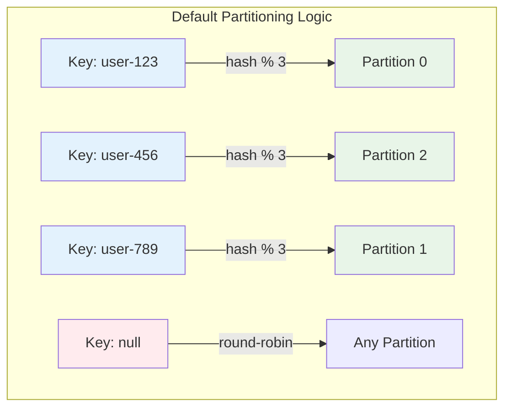
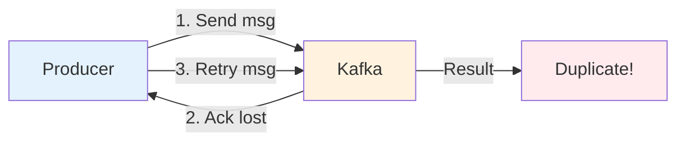
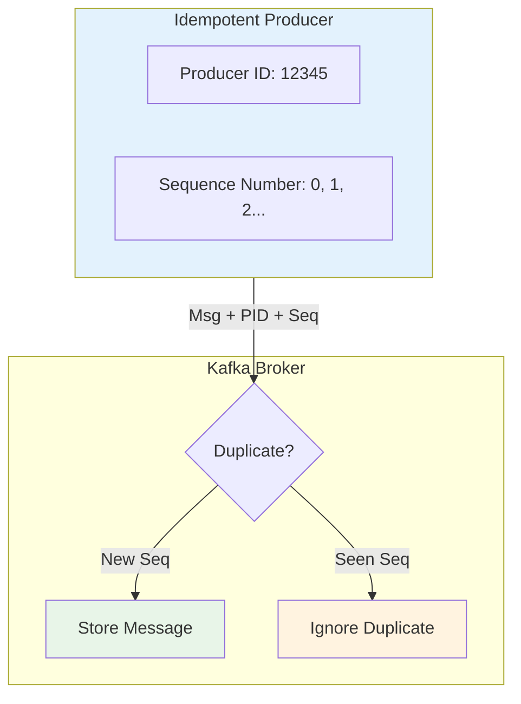
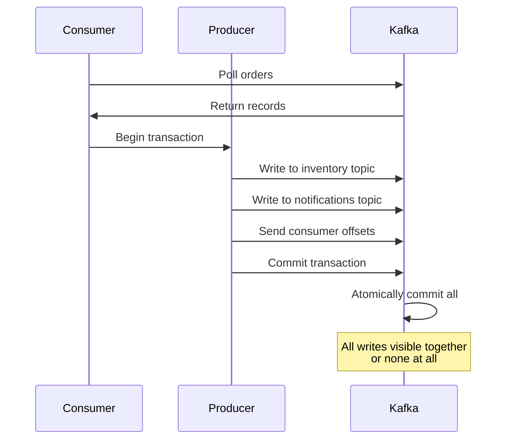
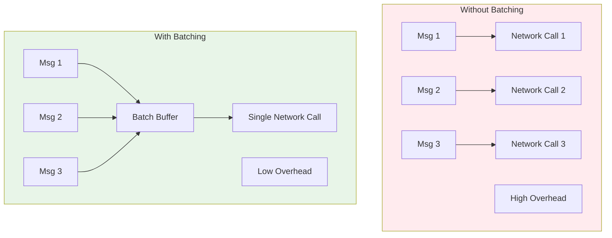
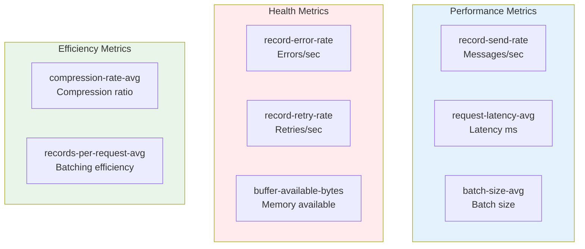

# Kafka for Java Developers - Part 3: Advanced Producer Patterns

Now that you can build basic producers, let's explore advanced patterns used in production systems. You'll learn how to control message placement, ensure exactly-once delivery, optimize performance, and handle errors gracefully.

## Custom Partitioning Strategies

By default, Kafka uses the message key to determine partition assignment. But what if you need custom logic?

### Understanding Default Partitioning



**Default Behavior**:
- With key: `hash(key) % num_partitions`
- Without key: Round-robin across partitions
- Same key always goes to same partition

### Custom Partitioner: Priority-Based Routing

**Use Case**: Route high-priority orders to dedicated partition for faster processing

```java
package com.example.kafka.partitioner;

import org.apache.kafka.clients.producer.Partitioner;
import org.apache.kafka.common.Cluster;
import org.apache.kafka.common.PartitionInfo;
import org.apache.kafka.common.utils.Utils;
import java.util.List;
import java.util.Map;

public class PriorityPartitioner implements Partitioner {

    private static final String PRIORITY_PARTITION_CONFIG = "priority.partition";
    private int priorityPartition = 0;

    @Override
    public void configure(Map<String, ?> configs) {
        // Read configuration
        Object priorityPartitionConfig = configs.get(PRIORITY_PARTITION_CONFIG);
        if (priorityPartitionConfig != null) {
            priorityPartition = Integer.parseInt(priorityPartitionConfig.toString());
        }
    }

    @Override
    public int partition(String topic, Object key, byte[] keyBytes,
                        Object value, byte[] valueBytes, Cluster cluster) {

        List<PartitionInfo> partitions = cluster.partitionsForTopic(topic);
        int numPartitions = partitions.size();

        // If key contains "PRIORITY", route to priority partition
        if (key != null && key.toString().contains("PRIORITY")) {
            return priorityPartition;
        }

        // For regular messages, distribute across non-priority partitions
        int regularPartitions = numPartitions - 1;
        if (keyBytes == null) {
            // Round-robin for null keys
            return (int) (System.nanoTime() % regularPartitions);
        } else {
            // Hash-based for non-null keys (exclude priority partition)
            int hash = Utils.toPositive(Utils.murmur2(keyBytes));
            int partition = hash % regularPartitions;
            // Adjust if it would be the priority partition
            return partition >= priorityPartition ? partition + 1 : partition;
        }
    }

    @Override
    public void close() {
        // Cleanup if needed
    }
}
```

**Using the Custom Partitioner**:

```java
package com.example.kafka.producer;

import org.apache.kafka.clients.producer.*;
import org.apache.kafka.common.serialization.StringSerializer;
import java.util.Properties;

public class PriorityOrderProducer {

    public static void main(String[] args) {
        Properties props = new Properties();
        props.put(ProducerConfig.BOOTSTRAP_SERVERS_CONFIG, "localhost:9092");
        props.put(ProducerConfig.KEY_SERIALIZER_CLASS_CONFIG, StringSerializer.class);
        props.put(ProducerConfig.VALUE_SERIALIZER_CLASS_CONFIG, StringSerializer.class);

        // Configure custom partitioner
        props.put(ProducerConfig.PARTITIONER_CLASS_CONFIG,
            "com.example.kafka.partitioner.PriorityPartitioner");
        props.put("priority.partition", "0"); // Partition 0 is for priority

        KafkaProducer<String, String> producer = new KafkaProducer<>(props);

        // Regular order - goes to partition 1 or 2
        producer.send(new ProducerRecord<>("orders", "order-123", "regular order"));

        // Priority order - goes to partition 0
        producer.send(new ProducerRecord<>("orders", "PRIORITY-order-456", "urgent order"));

        producer.close();
    }
}
```

### Geographic Partitioner

**Use Case**: Route messages based on geographic region for compliance/latency

```java
package com.example.kafka.partitioner;

import org.apache.kafka.clients.producer.Partitioner;
import org.apache.kafka.common.Cluster;
import java.util.*;

public class GeographicPartitioner implements Partitioner {

    private Map<String, Integer> regionToPartition = new HashMap<>();

    @Override
    public void configure(Map<String, ?> configs) {
        // Configure region mappings
        regionToPartition.put("US", 0);
        regionToPartition.put("EU", 1);
        regionToPartition.put("ASIA", 2);
    }

    @Override
    public int partition(String topic, Object key, byte[] keyBytes,
                        Object value, byte[] valueBytes, Cluster cluster) {

        int numPartitions = cluster.partitionsForTopic(topic).size();

        if (key != null) {
            String keyStr = key.toString();
            // Extract region from key (format: "region:userId")
            String[] parts = keyStr.split(":");
            if (parts.length > 0) {
                String region = parts[0].toUpperCase();
                return regionToPartition.getOrDefault(region, 0) % numPartitions;
            }
        }

        // Default partition
        return 0;
    }

    @Override
    public void close() {}
}
```

**Usage**:
```java
// Routes to US partition
producer.send(new ProducerRecord<>("user-events", "US:user-123", "login"));

// Routes to EU partition
producer.send(new ProducerRecord<>("user-events", "EU:user-456", "purchase"));
```

## Idempotent Producers: Preventing Duplicates

**The Problem**: Network issues can cause duplicate messages



**The Solution**: Idempotent producers ensure exactly-once delivery to a partition

```java
package com.example.kafka.producer;

import org.apache.kafka.clients.producer.*;
import org.apache.kafka.common.serialization.StringSerializer;
import java.util.Properties;

public class IdempotentProducer {

    public static void main(String[] args) {
        Properties props = new Properties();
        props.put(ProducerConfig.BOOTSTRAP_SERVERS_CONFIG, "localhost:9092");
        props.put(ProducerConfig.KEY_SERIALIZER_CLASS_CONFIG, StringSerializer.class);
        props.put(ProducerConfig.VALUE_SERIALIZER_CLASS_CONFIG, StringSerializer.class);

        // Enable idempotence
        props.put(ProducerConfig.ENABLE_IDEMPOTENCE_CONFIG, true);

        // These are automatically set when idempotence is enabled:
        // acks = all
        // retries = Integer.MAX_VALUE
        // max.in.flight.requests.per.connection = 5 (Kafka 2.8+)

        KafkaProducer<String, String> producer = new KafkaProducer<>(props);

        // Even if this message is sent multiple times due to retries,
        // Kafka guarantees it appears exactly once
        ProducerRecord<String, String> record =
            new ProducerRecord<>("orders", "order-123", "payment processed");

        producer.send(record, (metadata, exception) -> {
            if (exception != null) {
                System.err.println("Error: " + exception.getMessage());
            } else {
                System.out.printf("Sent to partition %d, offset %d%n",
                    metadata.partition(), metadata.offset());
            }
        });

        producer.close();
    }
}
```

**How It Works**:



**Key Concepts**:
- **Producer ID**: Unique ID assigned by broker
- **Sequence Number**: Per-partition counter
- **Broker Deduplication**: Detects and ignores duplicates

## Transactional Producers: Exactly-Once Across Topics

**Use Case**: Atomically write to multiple topics or coordinate with consumer offsets

```java
package com.example.kafka.producer;

import org.apache.kafka.clients.producer.*;
import org.apache.kafka.common.serialization.StringSerializer;
import java.util.Properties;

public class TransactionalProducer {

    public static void main(String[] args) {
        Properties props = new Properties();
        props.put(ProducerConfig.BOOTSTRAP_SERVERS_CONFIG, "localhost:9092");
        props.put(ProducerConfig.KEY_SERIALIZER_CLASS_CONFIG, StringSerializer.class);
        props.put(ProducerConfig.VALUE_SERIALIZER_CLASS_CONFIG, StringSerializer.class);

        // Enable transactions
        props.put(ProducerConfig.ENABLE_IDEMPOTENCE_CONFIG, true);
        props.put(ProducerConfig.TRANSACTIONAL_ID_CONFIG, "order-processor-1");

        KafkaProducer<String, String> producer = new KafkaProducer<>(props);

        // Initialize transactions
        producer.initTransactions();

        try {
            // Begin transaction
            producer.beginTransaction();

            // Send to multiple topics atomically
            producer.send(new ProducerRecord<>("orders",
                "order-123", "order created"));
            producer.send(new ProducerRecord<>("inventory",
                "product-456", "reserved"));
            producer.send(new ProducerRecord<>("audit",
                "order-123", "audit log"));

            // Commit transaction - all or nothing
            producer.commitTransaction();
            System.out.println("Transaction committed successfully");

        } catch (ProducerFencedException | OutOfOrderSequenceException |
                 AuthorizationException e) {
            // Fatal errors - close producer
            producer.close();
            System.err.println("Fatal error: " + e.getMessage());
        } catch (KafkaException e) {
            // Abort transaction and retry
            producer.abortTransaction();
            System.err.println("Transaction aborted: " + e.getMessage());
        }

        producer.close();
    }
}
```

### Real-World Example: Order Processing with Transactions

```java
package com.example.kafka.producer;

import com.fasterxml.jackson.databind.ObjectMapper;
import org.apache.kafka.clients.consumer.*;
import org.apache.kafka.clients.producer.*;
import org.apache.kafka.common.TopicPartition;
import java.time.Duration;
import java.util.*;

public class TransactionalOrderProcessor {

    private final KafkaProducer<String, String> producer;
    private final KafkaConsumer<String, String> consumer;
    private final ObjectMapper mapper = new ObjectMapper();

    public TransactionalOrderProcessor(String bootstrapServers) {
        // Setup transactional producer
        Properties producerProps = new Properties();
        producerProps.put(ProducerConfig.BOOTSTRAP_SERVERS_CONFIG, bootstrapServers);
        producerProps.put(ProducerConfig.KEY_SERIALIZER_CLASS_CONFIG,
            "org.apache.kafka.common.serialization.StringSerializer");
        producerProps.put(ProducerConfig.VALUE_SERIALIZER_CLASS_CONFIG,
            "org.apache.kafka.common.serialization.StringSerializer");
        producerProps.put(ProducerConfig.TRANSACTIONAL_ID_CONFIG, "order-processor");
        producerProps.put(ProducerConfig.ENABLE_IDEMPOTENCE_CONFIG, true);

        this.producer = new KafkaProducer<>(producerProps);
        producer.initTransactions();

        // Setup consumer
        Properties consumerProps = new Properties();
        consumerProps.put(ConsumerConfig.BOOTSTRAP_SERVERS_CONFIG, bootstrapServers);
        consumerProps.put(ConsumerConfig.GROUP_ID_CONFIG, "order-processor-group");
        consumerProps.put(ConsumerConfig.KEY_DESERIALIZER_CLASS_CONFIG,
            "org.apache.kafka.common.serialization.StringDeserializer");
        consumerProps.put(ConsumerConfig.VALUE_DESERIALIZER_CLASS_CONFIG,
            "org.apache.kafka.common.serialization.StringDeserializer");
        consumerProps.put(ConsumerConfig.ENABLE_AUTO_COMMIT_CONFIG, false);
        consumerProps.put(ConsumerConfig.ISOLATION_LEVEL_CONFIG, "read_committed");

        this.consumer = new KafkaConsumer<>(consumerProps);
        consumer.subscribe(Collections.singletonList("orders"));
    }

    public void processOrders() {
        while (true) {
            ConsumerRecords<String, String> records =
                consumer.poll(Duration.ofMillis(100));

            if (!records.isEmpty()) {
                try {
                    producer.beginTransaction();

                    for (ConsumerRecord<String, String> record : records) {
                        // Process order
                        processOrder(record);

                        // Produce results to other topics
                        producer.send(new ProducerRecord<>("inventory",
                            record.key(), "inventory updated"));
                        producer.send(new ProducerRecord<>("notifications",
                            record.key(), "email sent"));
                    }

                    // Send offsets to transaction
                    Map<TopicPartition, OffsetAndMetadata> offsets = new HashMap<>();
                    for (ConsumerRecord<String, String> record : records) {
                        TopicPartition partition = new TopicPartition(
                            record.topic(), record.partition());
                        offsets.put(partition,
                            new OffsetAndMetadata(record.offset() + 1));
                    }

                    producer.sendOffsetsToTransaction(offsets, consumer.groupMetadata());

                    // Commit transaction
                    producer.commitTransaction();
                    System.out.println("Processed batch of " + records.count() + " orders");

                } catch (Exception e) {
                    producer.abortTransaction();
                    System.err.println("Transaction aborted: " + e.getMessage());
                }
            }
        }
    }

    private void processOrder(ConsumerRecord<String, String> record) {
        System.out.printf("Processing order: %s%n", record.value());
        // Business logic here
    }

    public static void main(String[] args) {
        TransactionalOrderProcessor processor =
            new TransactionalOrderProcessor("localhost:9092");
        processor.processOrders();
    }
}
```

**Transaction Flow**:



## Batch Optimization and Performance Tuning

### Understanding Batching



### Batch Configuration

```java
package com.example.kafka.producer;

import org.apache.kafka.clients.producer.*;
import org.apache.kafka.common.serialization.StringSerializer;
import java.util.Properties;

public class OptimizedProducer {

    public static KafkaProducer<String, String> createHighThroughputProducer() {
        Properties props = new Properties();
        props.put(ProducerConfig.BOOTSTRAP_SERVERS_CONFIG, "localhost:9092");
        props.put(ProducerConfig.KEY_SERIALIZER_CLASS_CONFIG, StringSerializer.class);
        props.put(ProducerConfig.VALUE_SERIALIZER_CLASS_CONFIG, StringSerializer.class);

        // THROUGHPUT OPTIMIZATION
        props.put(ProducerConfig.BATCH_SIZE_CONFIG, 32768);        // 32KB batches
        props.put(ProducerConfig.LINGER_MS_CONFIG, 10);            // Wait 10ms
        props.put(ProducerConfig.COMPRESSION_TYPE_CONFIG, "lz4");  // Fast compression
        props.put(ProducerConfig.BUFFER_MEMORY_CONFIG, 67108864);  // 64MB buffer

        // RELIABILITY
        props.put(ProducerConfig.ACKS_CONFIG, "1");
        props.put(ProducerConfig.RETRIES_CONFIG, 3);

        return new KafkaProducer<>(props);
    }

    public static KafkaProducer<String, String> createLowLatencyProducer() {
        Properties props = new Properties();
        props.put(ProducerConfig.BOOTSTRAP_SERVERS_CONFIG, "localhost:9092");
        props.put(ProducerConfig.KEY_SERIALIZER_CLASS_CONFIG, StringSerializer.class);
        props.put(ProducerConfig.VALUE_SERIALIZER_CLASS_CONFIG, StringSerializer.class);

        // LATENCY OPTIMIZATION
        props.put(ProducerConfig.LINGER_MS_CONFIG, 0);             // Send immediately
        props.put(ProducerConfig.BATCH_SIZE_CONFIG, 16384);        // Smaller batches
        props.put(ProducerConfig.COMPRESSION_TYPE_CONFIG, "none"); // No compression
        props.put(ProducerConfig.ACKS_CONFIG, "1");                // Leader ack only

        return new KafkaProducer<>(props);
    }

    public static KafkaProducer<String, String> createReliableProducer() {
        Properties props = new Properties();
        props.put(ProducerConfig.BOOTSTRAP_SERVERS_CONFIG, "localhost:9092");
        props.put(ProducerConfig.KEY_SERIALIZER_CLASS_CONFIG, StringSerializer.class);
        props.put(ProducerConfig.VALUE_SERIALIZER_CLASS_CONFIG, StringSerializer.class);

        // RELIABILITY OPTIMIZATION
        props.put(ProducerConfig.ACKS_CONFIG, "all");              // All replicas
        props.put(ProducerConfig.ENABLE_IDEMPOTENCE_CONFIG, true); // No duplicates
        props.put(ProducerConfig.RETRIES_CONFIG, Integer.MAX_VALUE);
        props.put(ProducerConfig.MAX_IN_FLIGHT_REQUESTS_PER_CONNECTION, 5);

        return new KafkaProducer<>(props);
    }
}
```

### Configuration Comparison

| Configuration | High Throughput | Low Latency | High Reliability |
|--------------|----------------|-------------|------------------|
| `batch.size` | 32KB | 16KB | 16KB |
| `linger.ms` | 10ms | 0ms | 1ms |
| `compression` | lz4/snappy | none | snappy |
| `acks` | 1 | 1 | all |
| `retries` | 3 | 0-1 | MAX |
| `idempotence` | optional | no | yes |

### Compression Benchmarks

```java
package com.example.kafka.producer;

import org.apache.kafka.clients.producer.*;
import java.util.*;

public class CompressionBenchmark {

    public static void benchmark(String compressionType, int messageCount) {
        Properties props = new Properties();
        props.put(ProducerConfig.BOOTSTRAP_SERVERS_CONFIG, "localhost:9092");
        props.put(ProducerConfig.KEY_SERIALIZER_CLASS_CONFIG,
            "org.apache.kafka.common.serialization.StringSerializer");
        props.put(ProducerConfig.VALUE_SERIALIZER_CLASS_CONFIG,
            "org.apache.kafka.common.serialization.StringSerializer");
        props.put(ProducerConfig.COMPRESSION_TYPE_CONFIG, compressionType);
        props.put(ProducerConfig.LINGER_MS_CONFIG, 10);
        props.put(ProducerConfig.BATCH_SIZE_CONFIG, 32768);

        KafkaProducer<String, String> producer = new KafkaProducer<>(props);

        // Generate test message (1KB of repetitive text)
        String message = "test data ".repeat(100);

        long startTime = System.currentTimeMillis();

        for (int i = 0; i < messageCount; i++) {
            producer.send(new ProducerRecord<>("benchmark",
                "key-" + i, message));
        }

        producer.flush();
        long endTime = System.currentTimeMillis();

        System.out.printf("%s: %d messages in %d ms (%.2f msg/sec)%n",
            compressionType, messageCount, (endTime - startTime),
            (messageCount * 1000.0) / (endTime - startTime));

        producer.close();
    }

    public static void main(String[] args) {
        int messageCount = 10000;

        System.out.println("Compression Benchmark (" + messageCount + " messages):\n");
        benchmark("none", messageCount);
        benchmark("gzip", messageCount);
        benchmark("snappy", messageCount);
        benchmark("lz4", messageCount);
        benchmark("zstd", messageCount);
    }
}
```

**Typical Results**:
```
none:   10000 messages in 1200 ms (8333 msg/sec)  [High bandwidth]
gzip:   10000 messages in 2800 ms (3571 msg/sec)  [Best compression]
snappy: 10000 messages in 1400 ms (7142 msg/sec)  [Balanced]
lz4:    10000 messages in 1300 ms (7692 msg/sec)  [Fast]
zstd:   10000 messages in 1600 ms (6250 msg/sec)  [Good compression]
```

## Error Handling and Retry Strategies

### Comprehensive Error Handling

```java
package com.example.kafka.producer;

import org.apache.kafka.clients.producer.*;
import org.apache.kafka.common.errors.*;
import java.util.*;
import java.util.concurrent.*;

public class RobustProducer {

    private final KafkaProducer<String, String> producer;
    private final Queue<ProducerRecord<String, String>> deadLetterQueue;

    public RobustProducer(String bootstrapServers) {
        this.deadLetterQueue = new ConcurrentLinkedQueue<>();

        Properties props = new Properties();
        props.put(ProducerConfig.BOOTSTRAP_SERVERS_CONFIG, bootstrapServers);
        props.put(ProducerConfig.KEY_SERIALIZER_CLASS_CONFIG,
            "org.apache.kafka.common.serialization.StringSerializer");
        props.put(ProducerConfig.VALUE_SERIALIZER_CLASS_CONFIG,
            "org.apache.kafka.common.serialization.StringSerializer");

        // Retry configuration
        props.put(ProducerConfig.RETRIES_CONFIG, 3);
        props.put(ProducerConfig.RETRY_BACKOFF_MS_CONFIG, 1000);
        props.put(ProducerConfig.REQUEST_TIMEOUT_MS_CONFIG, 30000);
        props.put(ProducerConfig.DELIVERY_TIMEOUT_MS_CONFIG, 120000);

        this.producer = new KafkaProducer<>(props);
    }

    public void sendWithErrorHandling(ProducerRecord<String, String> record) {
        producer.send(record, new Callback() {
            @Override
            public void onCompletion(RecordMetadata metadata, Exception exception) {
                if (exception == null) {
                    // Success
                    System.out.printf("✓ Sent: %s to partition %d%n",
                        record.value(), metadata.partition());
                } else {
                    handleError(record, exception);
                }
            }
        });
    }

    private void handleError(ProducerRecord<String, String> record, Exception exception) {
        if (exception instanceof RetriableException) {
            // Retriable errors (network issues, leader election)
            System.err.printf("⚠ Retriable error for %s: %s%n",
                record.key(), exception.getMessage());

            if (exception instanceof NotEnoughReplicasException) {
                System.err.println("Not enough replicas available");
            } else if (exception instanceof TimeoutException) {
                System.err.println("Request timed out");
            }

            // Kafka will automatically retry
            System.err.println("Kafka will retry automatically");

        } else if (exception instanceof RecordTooLargeException) {
            // Non-retriable: message too large
            System.err.printf("✗ Message too large: %s (size: %d bytes)%n",
                record.key(), record.value().getBytes().length);
            // Log or send to monitoring system
            deadLetterQueue.add(record);

        } else if (exception instanceof SerializationException) {
            // Non-retriable: serialization failed
            System.err.printf("✗ Serialization error for %s: %s%n",
                record.key(), exception.getMessage());
            deadLetterQueue.add(record);

        } else if (exception instanceof InvalidTopicException) {
            // Non-retriable: topic doesn't exist
            System.err.printf("✗ Invalid topic: %s%n", record.topic());
            deadLetterQueue.add(record);

        } else {
            // Unknown error
            System.err.printf("✗ Unexpected error for %s: %s%n",
                record.key(), exception.getMessage());
            deadLetterQueue.add(record);
        }
    }

    public void processDLQ() {
        System.out.println("\n=== Dead Letter Queue ===");
        while (!deadLetterQueue.isEmpty()) {
            ProducerRecord<String, String> record = deadLetterQueue.poll();
            System.out.printf("DLQ: topic=%s, key=%s, value=%s%n",
                record.topic(), record.key(), record.value());
            // In production: send to DLQ topic, alert, or log
        }
    }

    public void close() {
        producer.close();
    }

    public static void main(String[] args) throws InterruptedException {
        RobustProducer producer = new RobustProducer("localhost:9092");

        // Send various messages
        producer.sendWithErrorHandling(
            new ProducerRecord<>("test-topic", "key1", "normal message"));

        // Simulate large message
        String largeMessage = "x".repeat(1024 * 1024 * 2); // 2MB
        producer.sendWithErrorHandling(
            new ProducerRecord<>("test-topic", "key2", largeMessage));

        // Wait for async callbacks
        Thread.sleep(5000);

        producer.processDLQ();
        producer.close();
    }
}
```

### Circuit Breaker Pattern

```java
package com.example.kafka.producer;

import org.apache.kafka.clients.producer.*;
import java.util.Properties;
import java.util.concurrent.atomic.AtomicInteger;
import java.util.concurrent.atomic.AtomicLong;

public class CircuitBreakerProducer {

    private final KafkaProducer<String, String> producer;
    private final AtomicInteger failureCount = new AtomicInteger(0);
    private final AtomicLong lastFailureTime = new AtomicLong(0);

    private static final int FAILURE_THRESHOLD = 5;
    private static final long RESET_TIMEOUT_MS = 60000; // 1 minute

    public CircuitBreakerProducer(String bootstrapServers) {
        Properties props = new Properties();
        props.put(ProducerConfig.BOOTSTRAP_SERVERS_CONFIG, bootstrapServers);
        props.put(ProducerConfig.KEY_SERIALIZER_CLASS_CONFIG,
            "org.apache.kafka.common.serialization.StringSerializer");
        props.put(ProducerConfig.VALUE_SERIALIZER_CLASS_CONFIG,
            "org.apache.kafka.common.serialization.StringSerializer");

        this.producer = new KafkaProducer<>(props);
    }

    public void send(ProducerRecord<String, String> record) {
        // Check circuit breaker state
        if (isCircuitOpen()) {
            System.err.println("⛔ Circuit breaker OPEN - rejecting message");
            // In production: queue, fallback, or alert
            return;
        }

        producer.send(record, (metadata, exception) -> {
            if (exception != null) {
                onFailure();
            } else {
                onSuccess();
            }
        });
    }

    private boolean isCircuitOpen() {
        long currentTime = System.currentTimeMillis();
        long timeSinceLastFailure = currentTime - lastFailureTime.get();

        // Reset if timeout passed
        if (timeSinceLastFailure > RESET_TIMEOUT_MS) {
            failureCount.set(0);
            return false;
        }

        // Open if threshold exceeded
        return failureCount.get() >= FAILURE_THRESHOLD;
    }

    private void onFailure() {
        failureCount.incrementAndGet();
        lastFailureTime.set(System.currentTimeMillis());
        System.err.printf("⚠ Failure count: %d/%d%n",
            failureCount.get(), FAILURE_THRESHOLD);
    }

    private void onSuccess() {
        // Reset on success
        failureCount.set(0);
    }

    public void close() {
        producer.close();
    }
}
```

## Monitoring and Metrics

### Producer Metrics

```java
package com.example.kafka.producer;

import org.apache.kafka.clients.producer.*;
import org.apache.kafka.common.Metric;
import org.apache.kafka.common.MetricName;
import java.util.*;

public class MonitoredProducer {

    private final KafkaProducer<String, String> producer;

    public MonitoredProducer(String bootstrapServers) {
        Properties props = new Properties();
        props.put(ProducerConfig.BOOTSTRAP_SERVERS_CONFIG, bootstrapServers);
        props.put(ProducerConfig.KEY_SERIALIZER_CLASS_CONFIG,
            "org.apache.kafka.common.serialization.StringSerializer");
        props.put(ProducerConfig.VALUE_SERIALIZER_CLASS_CONFIG,
            "org.apache.kafka.common.serialization.StringSerializer");

        this.producer = new KafkaProducer<>(props);
    }

    public void printMetrics() {
        Map<MetricName, ? extends Metric> metrics = producer.metrics();

        System.out.println("\n=== Producer Metrics ===\n");

        // Record send rate
        printMetric(metrics, "record-send-rate", "Records/sec sent");

        // Request latency
        printMetric(metrics, "request-latency-avg", "Avg request latency (ms)");

        // Batch size
        printMetric(metrics, "batch-size-avg", "Avg batch size (bytes)");

        // Record error rate
        printMetric(metrics, "record-error-rate", "Record errors/sec");

        // Buffer available
        printMetric(metrics, "buffer-available-bytes", "Buffer available (bytes)");

        // Compression rate
        printMetric(metrics, "compression-rate-avg", "Compression ratio");
    }

    private void printMetric(Map<MetricName, ? extends Metric> metrics,
                             String metricName, String description) {
        metrics.entrySet().stream()
            .filter(e -> e.getKey().name().equals(metricName))
            .findFirst()
            .ifPresent(e -> System.out.printf("%s: %.2f%n",
                description, e.getValue().metricValue()));
    }

    public static void main(String[] args) throws InterruptedException {
        MonitoredProducer producer =
            new MonitoredProducer("localhost:9092");

        // Send messages
        for (int i = 0; i < 1000; i++) {
            producer.producer.send(new ProducerRecord<>(
                "metrics-test", "key-" + i, "message-" + i));
        }

        Thread.sleep(2000);
        producer.printMetrics();
        producer.producer.close();
    }
}
```

**Key Metrics to Monitor**:



## Key Takeaways

- **Custom partitioners** enable sophisticated routing strategies based on business logic
- **Idempotent producers** prevent duplicates within a partition automatically
- **Transactional producers** enable exactly-once semantics across multiple topics
- **Batch optimization** dramatically improves throughput with `batch.size` and `linger.ms`
- **Compression** (lz4/snappy) reduces bandwidth and storage costs
- **Error handling** must distinguish between retriable and non-retriable errors
- **Circuit breakers** protect against cascading failures
- **Monitoring metrics** provide visibility into producer health and performance

## What's Next

In Part 4, we'll explore advanced consumer patterns including manual partition assignment, offset management strategies, rebalancing handling, and building scalable consumer applications. You'll learn how to build robust consumers that handle failures gracefully and process data efficiently.

Topics covered:
- Consumer group coordination
- Manual partition assignment
- Offset management strategies
- Rebalancing and failure handling
- Parallel processing patterns
- Consumer metrics and monitoring
