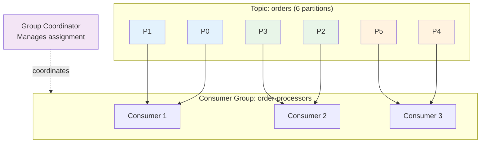
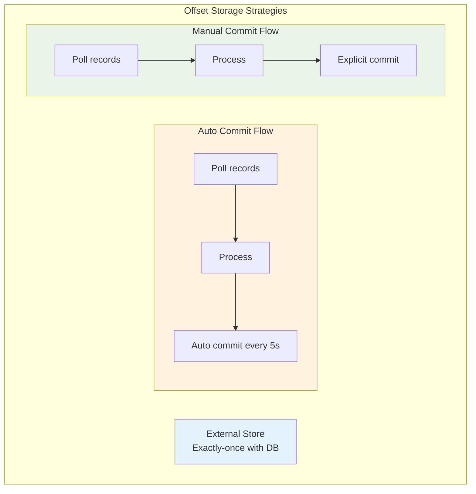
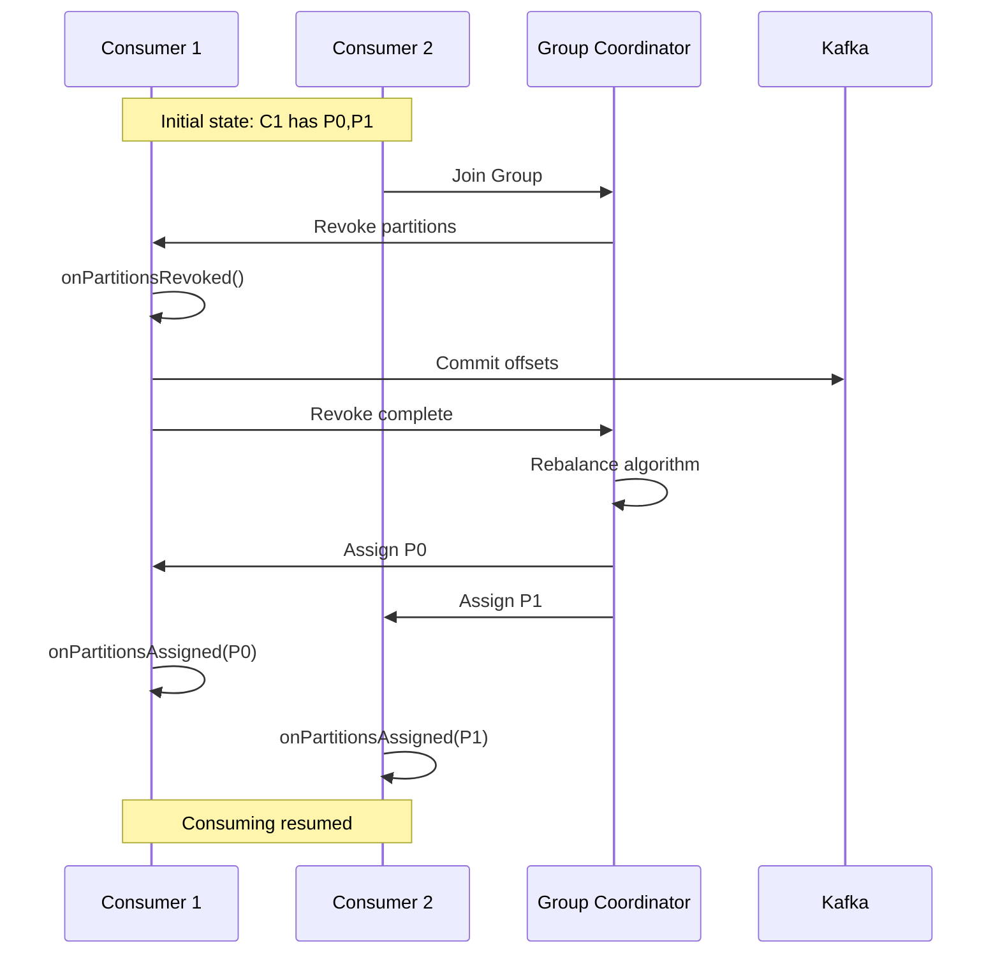

# Kafka for Java Developers - Part 4: Advanced Consumer Patterns

Building robust consumers requires understanding consumer groups, partition assignment, offset management, and failure handling. In this tutorial, you'll master advanced patterns used in production systems to build scalable, fault-tolerant consumer applications.

## Consumer Group Coordination

### Understanding Consumer Group Dynamics



**Key Concepts**:
- **Group Coordinator**: Broker that manages consumer group membership
- **Partition Assignment**: Distributes partitions among consumers
- **Rebalancing**: Redistributes partitions when consumers join/leave
- **Heartbeats**: Consumers send heartbeats to stay alive in the group

### Consumer Group States

```java
package com.example.kafka.consumer;

import org.apache.kafka.clients.consumer.*;
import org.apache.kafka.common.TopicPartition;
import java.time.Duration;
import java.util.*;

public class ConsumerGroupDemo {

    public static void main(String[] args) {
        Properties props = new Properties();
        props.put(ConsumerConfig.BOOTSTRAP_SERVERS_CONFIG, "localhost:9092");
        props.put(ConsumerConfig.GROUP_ID_CONFIG, "demo-group");
        props.put(ConsumerConfig.KEY_DESERIALIZER_CLASS_CONFIG,
            "org.apache.kafka.common.serialization.StringDeserializer");
        props.put(ConsumerConfig.VALUE_DESERIALIZER_CLASS_CONFIG,
            "org.apache.kafka.common.serialization.StringDeserializer");

        // Consumer lifecycle configurations
        props.put(ConsumerConfig.SESSION_TIMEOUT_MS_CONFIG, 30000);      // 30s
        props.put(ConsumerConfig.HEARTBEAT_INTERVAL_MS_CONFIG, 10000);   // 10s
        props.put(ConsumerConfig.MAX_POLL_INTERVAL_MS_CONFIG, 300000);   // 5min

        KafkaConsumer<String, String> consumer = new KafkaConsumer<>(props);

        // Subscribe with rebalance listener
        consumer.subscribe(
            Collections.singletonList("orders"),
            new ConsumerRebalanceListener() {
                @Override
                public void onPartitionsRevoked(Collection<TopicPartition> partitions) {
                    System.out.println("⚠ Partitions revoked: " + partitions);
                    // Save offsets before losing partitions
                }

                @Override
                public void onPartitionsAssigned(Collection<TopicPartition> partitions) {
                    System.out.println("✓ Partitions assigned: " + partitions);
                    // Initialize processing for new partitions
                }
            }
        );

        try {
            while (true) {
                ConsumerRecords<String, String> records =
                    consumer.poll(Duration.ofMillis(100));

                for (ConsumerRecord<String, String> record : records) {
                    System.out.printf("Partition %d, Offset %d: %s%n",
                        record.partition(), record.offset(), record.value());
                }
            }
        } finally {
            consumer.close();
        }
    }
}
```

## Manual Partition Assignment

When you need precise control over which partitions a consumer reads from:

### Static Partition Assignment

```java
package com.example.kafka.consumer;

import org.apache.kafka.clients.consumer.*;
import org.apache.kafka.common.TopicPartition;
import java.time.Duration;
import java.util.*;

public class ManualAssignmentConsumer {

    public static void main(String[] args) {
        Properties props = new Properties();
        props.put(ConsumerConfig.BOOTSTRAP_SERVERS_CONFIG, "localhost:9092");
        // NOTE: No group.id needed for manual assignment
        props.put(ConsumerConfig.KEY_DESERIALIZER_CLASS_CONFIG,
            "org.apache.kafka.common.serialization.StringDeserializer");
        props.put(ConsumerConfig.VALUE_DESERIALIZER_CLASS_CONFIG,
            "org.apache.kafka.common.serialization.StringDeserializer");

        KafkaConsumer<String, String> consumer = new KafkaConsumer<>(props);

        // Manually assign specific partitions
        TopicPartition partition0 = new TopicPartition("orders", 0);
        TopicPartition partition1 = new TopicPartition("orders", 1);

        consumer.assign(Arrays.asList(partition0, partition1));

        // Optionally seek to specific offset
        consumer.seek(partition0, 100);  // Start from offset 100
        consumer.seekToBeginning(Collections.singletonList(partition1));

        System.out.println("Manually assigned partitions: " + consumer.assignment());

        try {
            while (true) {
                ConsumerRecords<String, String> records =
                    consumer.poll(Duration.ofMillis(100));

                for (ConsumerRecord<String, String> record : records) {
                    System.out.printf("P%d offset %d: %s%n",
                        record.partition(), record.offset(), record.value());
                }
            }
        } finally {
            consumer.close();
        }
    }
}
```

### Dynamic Partition Assignment

```java
package com.example.kafka.consumer;

import org.apache.kafka.clients.consumer.*;
import org.apache.kafka.common.PartitionInfo;
import org.apache.kafka.common.TopicPartition;
import java.time.Duration;
import java.util.*;
import java.util.stream.Collectors;

public class DynamicAssignmentConsumer {

    private final KafkaConsumer<String, String> consumer;
    private final String topic;

    public DynamicAssignmentConsumer(String bootstrapServers, String topic) {
        this.topic = topic;

        Properties props = new Properties();
        props.put(ConsumerConfig.BOOTSTRAP_SERVERS_CONFIG, bootstrapServers);
        props.put(ConsumerConfig.KEY_DESERIALIZER_CLASS_CONFIG,
            "org.apache.kafka.common.serialization.StringDeserializer");
        props.put(ConsumerConfig.VALUE_DESERIALIZER_CLASS_CONFIG,
            "org.apache.kafka.common.serialization.StringDeserializer");

        this.consumer = new KafkaConsumer<>(props);
    }

    public void consumeEvenPartitions() {
        // Get all partitions for topic
        List<PartitionInfo> partitionInfos = consumer.partitionsFor(topic);

        // Assign only even-numbered partitions
        List<TopicPartition> evenPartitions = partitionInfos.stream()
            .filter(info -> info.partition() % 2 == 0)
            .map(info -> new TopicPartition(topic, info.partition()))
            .collect(Collectors.toList());

        consumer.assign(evenPartitions);

        System.out.println("Assigned even partitions: " + evenPartitions);

        while (true) {
            ConsumerRecords<String, String> records =
                consumer.poll(Duration.ofMillis(100));

            for (ConsumerRecord<String, String> record : records) {
                System.out.printf("P%d: %s%n", record.partition(), record.value());
            }
        }
    }

    public static void main(String[] args) {
        DynamicAssignmentConsumer consumer =
            new DynamicAssignmentConsumer("localhost:9092", "orders");
        consumer.consumeEvenPartitions();
    }
}
```

## Advanced Offset Management

### Offset Storage Strategies



### Manual Commit Patterns

```java
package com.example.kafka.consumer;

import org.apache.kafka.clients.consumer.*;
import org.apache.kafka.common.TopicPartition;
import java.time.Duration;
import java.util.*;

public class OffsetManagementConsumer {

    // Pattern 1: Commit after each record (safest, slowest)
    public static void commitPerRecord(KafkaConsumer<String, String> consumer) {
        while (true) {
            ConsumerRecords<String, String> records =
                consumer.poll(Duration.ofMillis(100));

            for (ConsumerRecord<String, String> record : records) {
                processRecord(record);

                // Commit this specific offset
                Map<TopicPartition, OffsetAndMetadata> offsets = new HashMap<>();
                offsets.put(
                    new TopicPartition(record.topic(), record.partition()),
                    new OffsetAndMetadata(record.offset() + 1)
                );

                consumer.commitSync(offsets);
            }
        }
    }

    // Pattern 2: Commit per partition (balanced)
    public static void commitPerPartition(KafkaConsumer<String, String> consumer) {
        while (true) {
            ConsumerRecords<String, String> records =
                consumer.poll(Duration.ofMillis(100));

            Map<TopicPartition, OffsetAndMetadata> currentOffsets = new HashMap<>();

            for (ConsumerRecord<String, String> record : records) {
                processRecord(record);

                currentOffsets.put(
                    new TopicPartition(record.topic(), record.partition()),
                    new OffsetAndMetadata(record.offset() + 1)
                );
            }

            // Commit all partitions together
            if (!currentOffsets.isEmpty()) {
                consumer.commitSync(currentOffsets);
            }
        }
    }

    // Pattern 3: Commit per batch (fastest, may duplicate on failure)
    public static void commitPerBatch(KafkaConsumer<String, String> consumer) {
        int messageCount = 0;
        int commitInterval = 100;

        while (true) {
            ConsumerRecords<String, String> records =
                consumer.poll(Duration.ofMillis(100));

            for (ConsumerRecord<String, String> record : records) {
                processRecord(record);
                messageCount++;
            }

            // Commit every N messages
            if (messageCount >= commitInterval) {
                consumer.commitSync();
                messageCount = 0;
            }
        }
    }

    // Pattern 4: Async commit with callback
    public static void asyncCommit(KafkaConsumer<String, String> consumer) {
        while (true) {
            ConsumerRecords<String, String> records =
                consumer.poll(Duration.ofMillis(100));

            for (ConsumerRecord<String, String> record : records) {
                processRecord(record);
            }

            // Non-blocking commit
            consumer.commitAsync((offsets, exception) -> {
                if (exception != null) {
                    System.err.println("Commit failed: " + exception.getMessage());
                    // In production: retry or alert
                } else {
                    System.out.println("Committed: " + offsets);
                }
            });
        }
    }

    private static void processRecord(ConsumerRecord<String, String> record) {
        System.out.printf("Processing: %s%n", record.value());
    }
}
```

### Seeking to Specific Offsets

```java
package com.example.kafka.consumer;

import org.apache.kafka.clients.consumer.*;
import org.apache.kafka.common.TopicPartition;
import java.time.Duration;
import java.time.Instant;
import java.time.temporal.ChronoUnit;
import java.util.*;

public class OffsetSeekConsumer {

    private final KafkaConsumer<String, String> consumer;

    public OffsetSeekConsumer(String bootstrapServers, String groupId) {
        Properties props = new Properties();
        props.put(ConsumerConfig.BOOTSTRAP_SERVERS_CONFIG, bootstrapServers);
        props.put(ConsumerConfig.GROUP_ID_CONFIG, groupId);
        props.put(ConsumerConfig.KEY_DESERIALIZER_CLASS_CONFIG,
            "org.apache.kafka.common.serialization.StringDeserializer");
        props.put(ConsumerConfig.VALUE_DESERIALIZER_CLASS_CONFIG,
            "org.apache.kafka.common.serialization.StringDeserializer");
        props.put(ConsumerConfig.ENABLE_AUTO_COMMIT_CONFIG, false);

        this.consumer = new KafkaConsumer<>(props);
    }

    // Seek to beginning
    public void seekToBeginning(String topic) {
        consumer.subscribe(Collections.singletonList(topic));
        consumer.poll(Duration.ofMillis(0)); // Trigger assignment

        Set<TopicPartition> assignment = consumer.assignment();
        consumer.seekToBeginning(assignment);

        System.out.println("Seeking to beginning of: " + assignment);
    }

    // Seek to end
    public void seekToEnd(String topic) {
        consumer.subscribe(Collections.singletonList(topic));
        consumer.poll(Duration.ofMillis(0));

        Set<TopicPartition> assignment = consumer.assignment();
        consumer.seekToEnd(assignment);

        System.out.println("Seeking to end of: " + assignment);
    }

    // Seek to specific offset
    public void seekToOffset(String topic, int partition, long offset) {
        TopicPartition tp = new TopicPartition(topic, partition);
        consumer.assign(Collections.singletonList(tp));
        consumer.seek(tp, offset);

        System.out.printf("Seeking to offset %d on %s%n", offset, tp);
    }

    // Seek to timestamp (time travel!)
    public void seekToTimestamp(String topic, Instant timestamp) {
        consumer.subscribe(Collections.singletonList(topic));
        consumer.poll(Duration.ofMillis(0));

        Set<TopicPartition> assignment = consumer.assignment();

        // Build timestamp map
        Map<TopicPartition, Long> timestampsToSearch = new HashMap<>();
        for (TopicPartition tp : assignment) {
            timestampsToSearch.put(tp, timestamp.toEpochMilli());
        }

        // Find offsets for timestamps
        Map<TopicPartition, OffsetAndTimestamp> offsetsForTimes =
            consumer.offsetsForTimes(timestampsToSearch);

        // Seek to those offsets
        offsetsForTimes.forEach((tp, offsetAndTimestamp) -> {
            if (offsetAndTimestamp != null) {
                consumer.seek(tp, offsetAndTimestamp.offset());
                System.out.printf("Seeking %s to offset %d (timestamp: %s)%n",
                    tp, offsetAndTimestamp.offset(),
                    Instant.ofEpochMilli(offsetAndTimestamp.timestamp()));
            }
        });
    }

    public void consume() {
        try {
            while (true) {
                ConsumerRecords<String, String> records =
                    consumer.poll(Duration.ofMillis(100));

                for (ConsumerRecord<String, String> record : records) {
                    System.out.printf("P%d offset %d: %s (timestamp: %s)%n",
                        record.partition(), record.offset(), record.value(),
                        Instant.ofEpochMilli(record.timestamp()));
                }
            }
        } finally {
            consumer.close();
        }
    }

    public static void main(String[] args) {
        OffsetSeekConsumer consumer =
            new OffsetSeekConsumer("localhost:9092", "seek-demo");

        // Example: Read messages from 1 hour ago
        Instant oneHourAgo = Instant.now().minus(1, ChronoUnit.HOURS);
        consumer.seekToTimestamp("orders", oneHourAgo);

        consumer.consume();
    }
}
```

## Handling Rebalancing

### Graceful Rebalancing with State Management

```java
package com.example.kafka.consumer;

import org.apache.kafka.clients.consumer.*;
import org.apache.kafka.common.TopicPartition;
import java.time.Duration;
import java.util.*;
import java.util.concurrent.ConcurrentHashMap;

public class RebalanceAwareConsumer {

    private final KafkaConsumer<String, String> consumer;
    private final Map<TopicPartition, Long> currentOffsets = new ConcurrentHashMap<>();
    private final Map<Integer, ProcessingState> partitionStates = new ConcurrentHashMap<>();

    static class ProcessingState {
        long processedCount = 0;
        long lastOffset = -1;

        @Override
        public String toString() {
            return String.format("processed=%d, lastOffset=%d", processedCount, lastOffset);
        }
    }

    public RebalanceAwareConsumer(String bootstrapServers, String groupId, String topic) {
        Properties props = new Properties();
        props.put(ConsumerConfig.BOOTSTRAP_SERVERS_CONFIG, bootstrapServers);
        props.put(ConsumerConfig.GROUP_ID_CONFIG, groupId);
        props.put(ConsumerConfig.KEY_DESERIALIZER_CLASS_CONFIG,
            "org.apache.kafka.common.serialization.StringDeserializer");
        props.put(ConsumerConfig.VALUE_DESERIALIZER_CLASS_CONFIG,
            "org.apache.kafka.common.serialization.StringDeserializer");
        props.put(ConsumerConfig.ENABLE_AUTO_COMMIT_CONFIG, false);

        this.consumer = new KafkaConsumer<>(props);

        consumer.subscribe(
            Collections.singletonList(topic),
            new ConsumerRebalanceListener() {
                @Override
                public void onPartitionsRevoked(Collection<TopicPartition> partitions) {
                    System.out.println("\n⚠ REBALANCE: Partitions being revoked: " + partitions);

                    // Commit current offsets before losing partitions
                    Map<TopicPartition, OffsetAndMetadata> offsetsToCommit = new HashMap<>();
                    for (TopicPartition partition : partitions) {
                        Long offset = currentOffsets.get(partition);
                        if (offset != null) {
                            offsetsToCommit.put(partition, new OffsetAndMetadata(offset));
                        }

                        // Save partition state
                        ProcessingState state = partitionStates.get(partition.partition());
                        if (state != null) {
                            System.out.printf("  Saving state for P%d: %s%n",
                                partition.partition(), state);
                        }
                    }

                    if (!offsetsToCommit.isEmpty()) {
                        consumer.commitSync(offsetsToCommit);
                        System.out.println("  ✓ Committed offsets: " + offsetsToCommit);
                    }

                    // Clear revoked partitions from state
                    partitions.forEach(p -> partitionStates.remove(p.partition()));
                }

                @Override
                public void onPartitionsAssigned(Collection<TopicPartition> partitions) {
                    System.out.println("\n✓ REBALANCE: Partitions assigned: " + partitions);

                    // Initialize state for new partitions
                    for (TopicPartition partition : partitions) {
                        partitionStates.putIfAbsent(
                            partition.partition(), new ProcessingState());

                        // Optionally seek to specific offset
                        long committedOffset = consumer.committed(partition).offset();
                        System.out.printf("  P%d starting at offset %d%n",
                            partition.partition(), committedOffset);
                    }
                }
            }
        );
    }

    public void consume() {
        try {
            while (true) {
                ConsumerRecords<String, String> records =
                    consumer.poll(Duration.ofMillis(100));

                for (ConsumerRecord<String, String> record : records) {
                    processRecord(record);

                    // Track offset
                    currentOffsets.put(
                        new TopicPartition(record.topic(), record.partition()),
                        record.offset() + 1
                    );

                    // Update state
                    ProcessingState state = partitionStates.get(record.partition());
                    if (state != null) {
                        state.processedCount++;
                        state.lastOffset = record.offset();
                    }
                }

                // Periodic commit
                if (!currentOffsets.isEmpty()) {
                    Map<TopicPartition, OffsetAndMetadata> offsetsToCommit = new HashMap<>();
                    currentOffsets.forEach((tp, offset) ->
                        offsetsToCommit.put(tp, new OffsetAndMetadata(offset)));

                    consumer.commitAsync(offsetsToCommit, null);
                }
            }
        } finally {
            consumer.close();
        }
    }

    private void processRecord(ConsumerRecord<String, String> record) {
        System.out.printf("P%d offset %d: %s%n",
            record.partition(), record.offset(), record.value());
    }

    public static void main(String[] args) {
        RebalanceAwareConsumer consumer = new RebalanceAwareConsumer(
            "localhost:9092", "rebalance-demo", "orders");
        consumer.consume();
    }
}
```

### Rebalancing Flow



## Parallel Processing Patterns

### Multi-threaded Consumer Pattern

```java
package com.example.kafka.consumer;

import org.apache.kafka.clients.consumer.*;
import org.apache.kafka.common.TopicPartition;
import java.time.Duration;
import java.util.*;
import java.util.concurrent.*;

public class ParallelConsumer {

    private final KafkaConsumer<String, String> consumer;
    private final ExecutorService executorService;
    private final Map<TopicPartition, Long> currentOffsets = new ConcurrentHashMap<>();

    public ParallelConsumer(String bootstrapServers, String groupId, String topic, int threadCount) {
        Properties props = new Properties();
        props.put(ConsumerConfig.BOOTSTRAP_SERVERS_CONFIG, bootstrapServers);
        props.put(ConsumerConfig.GROUP_ID_CONFIG, groupId);
        props.put(ConsumerConfig.KEY_DESERIALIZER_CLASS_CONFIG,
            "org.apache.kafka.common.serialization.StringDeserializer");
        props.put(ConsumerConfig.VALUE_DESERIALIZER_CLASS_CONFIG,
            "org.apache.kafka.common.serialization.StringDeserializer");
        props.put(ConsumerConfig.ENABLE_AUTO_COMMIT_CONFIG, false);
        props.put(ConsumerConfig.MAX_POLL_RECORDS_CONFIG, 500);

        this.consumer = new KafkaConsumer<>(props);
        consumer.subscribe(Collections.singletonList(topic));

        this.executorService = Executors.newFixedThreadPool(threadCount);
    }

    public void consume() {
        try {
            while (true) {
                ConsumerRecords<String, String> records =
                    consumer.poll(Duration.ofMillis(100));

                if (!records.isEmpty()) {
                    // Process records in parallel
                    List<Future<?>> futures = new ArrayList<>();

                    for (ConsumerRecord<String, String> record : records) {
                        Future<?> future = executorService.submit(() -> {
                            processRecord(record);

                            // Track offset
                            currentOffsets.put(
                                new TopicPartition(record.topic(), record.partition()),
                                record.offset() + 1
                            );
                        });
                        futures.add(future);
                    }

                    // Wait for all processing to complete
                    for (Future<?> future : futures) {
                        try {
                            future.get();
                        } catch (Exception e) {
                            System.err.println("Processing error: " + e.getMessage());
                        }
                    }

                    // Commit offsets after all processing is done
                    Map<TopicPartition, OffsetAndMetadata> offsetsToCommit = new HashMap<>();
                    currentOffsets.forEach((tp, offset) ->
                        offsetsToCommit.put(tp, new OffsetAndMetadata(offset)));

                    consumer.commitSync(offsetsToCommit);
                    currentOffsets.clear();
                }
            }
        } finally {
            executorService.shutdown();
            consumer.close();
        }
    }

    private void processRecord(ConsumerRecord<String, String> record) {
        System.out.printf("[%s] P%d offset %d: %s%n",
            Thread.currentThread().getName(),
            record.partition(), record.offset(), record.value());

        // Simulate processing
        try {
            Thread.sleep(100);
        } catch (InterruptedException e) {
            Thread.currentThread().interrupt();
        }
    }

    public static void main(String[] args) {
        ParallelConsumer consumer = new ParallelConsumer(
            "localhost:9092", "parallel-group", "orders", 10);
        consumer.consume();
    }
}
```

### Partition-per-Thread Pattern

```java
package com.example.kafka.consumer;

import org.apache.kafka.clients.consumer.*;
import org.apache.kafka.common.TopicPartition;
import java.time.Duration;
import java.util.*;
import java.util.concurrent.*;

public class PartitionPerThreadConsumer {

    private final String bootstrapServers;
    private final String topic;
    private final ExecutorService executorService;

    public PartitionPerThreadConsumer(String bootstrapServers, String topic, int threadCount) {
        this.bootstrapServers = bootstrapServers;
        this.topic = topic;
        this.executorService = Executors.newFixedThreadPool(threadCount);
    }

    public void start() {
        // Create a consumer to get partition information
        Properties props = new Properties();
        props.put(ConsumerConfig.BOOTSTRAP_SERVERS_CONFIG, bootstrapServers);
        props.put(ConsumerConfig.KEY_DESERIALIZER_CLASS_CONFIG,
            "org.apache.kafka.common.serialization.StringDeserializer");
        props.put(ConsumerConfig.VALUE_DESERIALIZER_CLASS_CONFIG,
            "org.apache.kafka.common.serialization.StringDeserializer");

        KafkaConsumer<String, String> tempConsumer = new KafkaConsumer<>(props);
        List<TopicPartition> partitions = new ArrayList<>();

        for (var info : tempConsumer.partitionsFor(topic)) {
            partitions.add(new TopicPartition(topic, info.partition()));
        }
        tempConsumer.close();

        System.out.printf("Starting %d consumer threads for %d partitions%n",
            partitions.size(), partitions.size());

        // Create one consumer thread per partition
        for (TopicPartition partition : partitions) {
            executorService.submit(new PartitionConsumer(partition));
        }
    }

    class PartitionConsumer implements Runnable {
        private final TopicPartition partition;

        PartitionConsumer(TopicPartition partition) {
            this.partition = partition;
        }

        @Override
        public void run() {
            Properties props = new Properties();
            props.put(ConsumerConfig.BOOTSTRAP_SERVERS_CONFIG, bootstrapServers);
            props.put(ConsumerConfig.KEY_DESERIALIZER_CLASS_CONFIG,
                "org.apache.kafka.common.serialization.StringDeserializer");
            props.put(ConsumerConfig.VALUE_DESERIALIZER_CLASS_CONFIG,
                "org.apache.kafka.common.serialization.StringDeserializer");

            KafkaConsumer<String, String> consumer = new KafkaConsumer<>(props);
            consumer.assign(Collections.singletonList(partition));

            System.out.printf("Thread %s consuming partition %d%n",
                Thread.currentThread().getName(), partition.partition());

            try {
                while (true) {
                    ConsumerRecords<String, String> records =
                        consumer.poll(Duration.ofMillis(100));

                    for (ConsumerRecord<String, String> record : records) {
                        System.out.printf("[P%d - %s] offset %d: %s%n",
                            partition.partition(),
                            Thread.currentThread().getName(),
                            record.offset(),
                            record.value());

                        // Process record
                        Thread.sleep(50);
                    }
                }
            } catch (InterruptedException e) {
                Thread.currentThread().interrupt();
            } finally {
                consumer.close();
            }
        }
    }

    public void shutdown() {
        executorService.shutdown();
    }

    public static void main(String[] args) {
        PartitionPerThreadConsumer consumer = new PartitionPerThreadConsumer(
            "localhost:9092", "orders", 6);
        consumer.start();
    }
}
```

## Real-World Example: Order Processing System

```java
package com.example.kafka.consumer;

import com.fasterxml.jackson.databind.ObjectMapper;
import org.apache.kafka.clients.consumer.*;
import org.apache.kafka.clients.producer.*;
import org.apache.kafka.common.TopicPartition;
import java.time.Duration;
import java.util.*;
import java.util.concurrent.*;

class Order {
    private String orderId;
    private String userId;
    private double amount;
    private String status;

    // Getters/setters
    public String getOrderId() { return orderId; }
    public void setOrderId(String orderId) { this.orderId = orderId; }
    public String getUserId() { return userId; }
    public void setUserId(String userId) { this.userId = userId; }
    public double getAmount() { return amount; }
    public void setAmount(double amount) { this.amount = amount; }
    public String getStatus() { return status; }
    public void setStatus(String status) { this.status = status; }
}

public class OrderProcessingConsumer {

    private final KafkaConsumer<String, String> consumer;
    private final KafkaProducer<String, String> producer;
    private final ObjectMapper mapper = new ObjectMapper();
    private final Map<TopicPartition, Long> currentOffsets = new ConcurrentHashMap<>();
    private final ExecutorService executorService;

    public OrderProcessingConsumer(String bootstrapServers) {
        // Setup consumer
        Properties consumerProps = new Properties();
        consumerProps.put(ConsumerConfig.BOOTSTRAP_SERVERS_CONFIG, bootstrapServers);
        consumerProps.put(ConsumerConfig.GROUP_ID_CONFIG, "order-processor");
        consumerProps.put(ConsumerConfig.KEY_DESERIALIZER_CLASS_CONFIG,
            "org.apache.kafka.common.serialization.StringDeserializer");
        consumerProps.put(ConsumerConfig.VALUE_DESERIALIZER_CLASS_CONFIG,
            "org.apache.kafka.common.serialization.StringDeserializer");
        consumerProps.put(ConsumerConfig.ENABLE_AUTO_COMMIT_CONFIG, false);
        consumerProps.put(ConsumerConfig.MAX_POLL_RECORDS_CONFIG, 100);

        this.consumer = new KafkaConsumer<>(consumerProps);

        // Setup producer for results
        Properties producerProps = new Properties();
        producerProps.put(ProducerConfig.BOOTSTRAP_SERVERS_CONFIG, bootstrapServers);
        producerProps.put(ProducerConfig.KEY_SERIALIZER_CLASS_CONFIG,
            "org.apache.kafka.common.serialization.StringSerializer");
        producerProps.put(ProducerConfig.VALUE_SERIALIZER_CLASS_CONFIG,
            "org.apache.kafka.common.serialization.StringSerializer");

        this.producer = new KafkaProducer<>(producerProps);

        // Thread pool for parallel processing
        this.executorService = Executors.newFixedThreadPool(10);

        // Subscribe with rebalance handling
        consumer.subscribe(
            Collections.singletonList("orders"),
            new ConsumerRebalanceListener() {
                @Override
                public void onPartitionsRevoked(Collection<TopicPartition> partitions) {
                    System.out.println("Partitions revoked, committing offsets...");
                    commitOffsets();
                }

                @Override
                public void onPartitionsAssigned(Collection<TopicPartition> partitions) {
                    System.out.println("Partitions assigned: " + partitions);
                    currentOffsets.clear();
                }
            }
        );
    }

    public void processOrders() {
        try {
            while (true) {
                ConsumerRecords<String, String> records =
                    consumer.poll(Duration.ofMillis(100));

                if (!records.isEmpty()) {
                    List<CompletableFuture<Void>> futures = new ArrayList<>();

                    for (ConsumerRecord<String, String> record : records) {
                        CompletableFuture<Void> future = CompletableFuture.runAsync(() -> {
                            try {
                                // Parse order
                                Order order = mapper.readValue(record.value(), Order.class);

                                // Process order
                                boolean success = processOrder(order);

                                if (success) {
                                    // Update status
                                    order.setStatus("PROCESSED");

                                    // Send to processed orders topic
                                    String processedJson = mapper.writeValueAsString(order);
                                    producer.send(new ProducerRecord<>(
                                        "processed-orders",
                                        order.getUserId(),
                                        processedJson
                                    ));

                                    System.out.printf("✓ Processed order %s ($%.2f)%n",
                                        order.getOrderId(), order.getAmount());
                                } else {
                                    // Send to DLQ
                                    producer.send(new ProducerRecord<>(
                                        "failed-orders",
                                        order.getUserId(),
                                        record.value()
                                    ));

                                    System.err.printf("✗ Failed order %s%n", order.getOrderId());
                                }

                                // Track offset
                                currentOffsets.put(
                                    new TopicPartition(record.topic(), record.partition()),
                                    record.offset() + 1
                                );

                            } catch (Exception e) {
                                System.err.println("Error processing: " + e.getMessage());
                            }
                        }, executorService);

                        futures.add(future);
                    }

                    // Wait for all processing to complete
                    CompletableFuture.allOf(futures.toArray(new CompletableFuture[0])).join();

                    // Commit offsets
                    commitOffsets();
                }
            }
        } finally {
            executorService.shutdown();
            consumer.close();
            producer.close();
        }
    }

    private boolean processOrder(Order order) {
        // Simulate order processing
        try {
            Thread.sleep(100);

            // 90% success rate
            return Math.random() > 0.1;
        } catch (InterruptedException e) {
            Thread.currentThread().interrupt();
            return false;
        }
    }

    private void commitOffsets() {
        if (!currentOffsets.isEmpty()) {
            Map<TopicPartition, OffsetAndMetadata> offsetsToCommit = new HashMap<>();
            currentOffsets.forEach((tp, offset) ->
                offsetsToCommit.put(tp, new OffsetAndMetadata(offset)));

            consumer.commitSync(offsetsToCommit);
            currentOffsets.clear();
        }
    }

    public static void main(String[] args) {
        OrderProcessingConsumer processor =
            new OrderProcessingConsumer("localhost:9092");
        processor.processOrders();
    }
}
```

## Consumer Metrics and Monitoring

```java
package com.example.kafka.consumer;

import org.apache.kafka.clients.consumer.*;
import org.apache.kafka.common.Metric;
import org.apache.kafka.common.MetricName;
import java.time.Duration;
import java.util.*;

public class MonitoredConsumer {

    private final KafkaConsumer<String, String> consumer;

    public MonitoredConsumer(String bootstrapServers, String groupId) {
        Properties props = new Properties();
        props.put(ConsumerConfig.BOOTSTRAP_SERVERS_CONFIG, bootstrapServers);
        props.put(ConsumerConfig.GROUP_ID_CONFIG, groupId);
        props.put(ConsumerConfig.KEY_DESERIALIZER_CLASS_CONFIG,
            "org.apache.kafka.common.serialization.StringDeserializer");
        props.put(ConsumerConfig.VALUE_DESERIALIZER_CLASS_CONFIG,
            "org.apache.kafka.common.serialization.StringDeserializer");

        this.consumer = new KafkaConsumer<>(props);
    }

    public void printMetrics() {
        Map<MetricName, ? extends Metric> metrics = consumer.metrics();

        System.out.println("\n=== Consumer Metrics ===\n");

        // Records consumed
        printMetric(metrics, "records-consumed-rate", "Records/sec consumed");
        printMetric(metrics, "records-lag-max", "Max lag (records)");

        // Fetch metrics
        printMetric(metrics, "fetch-rate", "Fetch requests/sec");
        printMetric(metrics, "fetch-latency-avg", "Avg fetch latency (ms)");

        // Bytes consumed
        printMetric(metrics, "bytes-consumed-rate", "Bytes/sec consumed");

        // Commit metrics
        printMetric(metrics, "commit-rate", "Commits/sec");
        printMetric(metrics, "commit-latency-avg", "Avg commit latency (ms)");
    }

    private void printMetric(Map<MetricName, ? extends Metric> metrics,
                             String metricName, String description) {
        metrics.entrySet().stream()
            .filter(e -> e.getKey().name().equals(metricName))
            .findFirst()
            .ifPresent(e -> System.out.printf("%s: %.2f%n",
                description, e.getValue().metricValue()));
    }

    public static void main(String[] args) throws InterruptedException {
        MonitoredConsumer consumer =
            new MonitoredConsumer("localhost:9092", "metrics-group");

        consumer.consumer.subscribe(Collections.singletonList("orders"));

        // Consume for a while
        for (int i = 0; i < 10; i++) {
            consumer.consumer.poll(Duration.ofMillis(100));
            Thread.sleep(1000);
        }

        consumer.printMetrics();
        consumer.consumer.close();
    }
}
```

## Key Takeaways

- **Consumer groups** enable parallel processing with automatic partition assignment
- **Manual assignment** provides precise control over partition consumption
- **Offset management** strategies balance safety (commit frequency) with performance
- **Rebalancing listeners** allow graceful state management during partition reassignment
- **Seeking** enables time travel and replay from specific offsets or timestamps
- **Parallel processing** patterns improve throughput using thread pools
- **Error handling** requires distinguishing retriable errors and DLQ strategies
- **Monitoring metrics** provide visibility into consumer health and lag

## What's Next

In Part 5, we'll explore Kafka Streams, a powerful library for building real-time stream processing applications. You'll learn how to transform, aggregate, join, and analyze data streams with stateful processing, windowing, and exactly-once semantics.

Topics covered:
- Kafka Streams architecture
- Stream transformations and aggregations
- Stateful processing with state stores
- Windowing operations
- Stream-table joins
- Exactly-once processing
