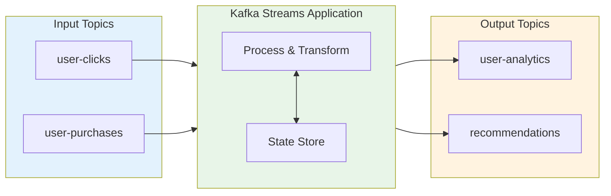
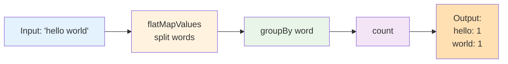
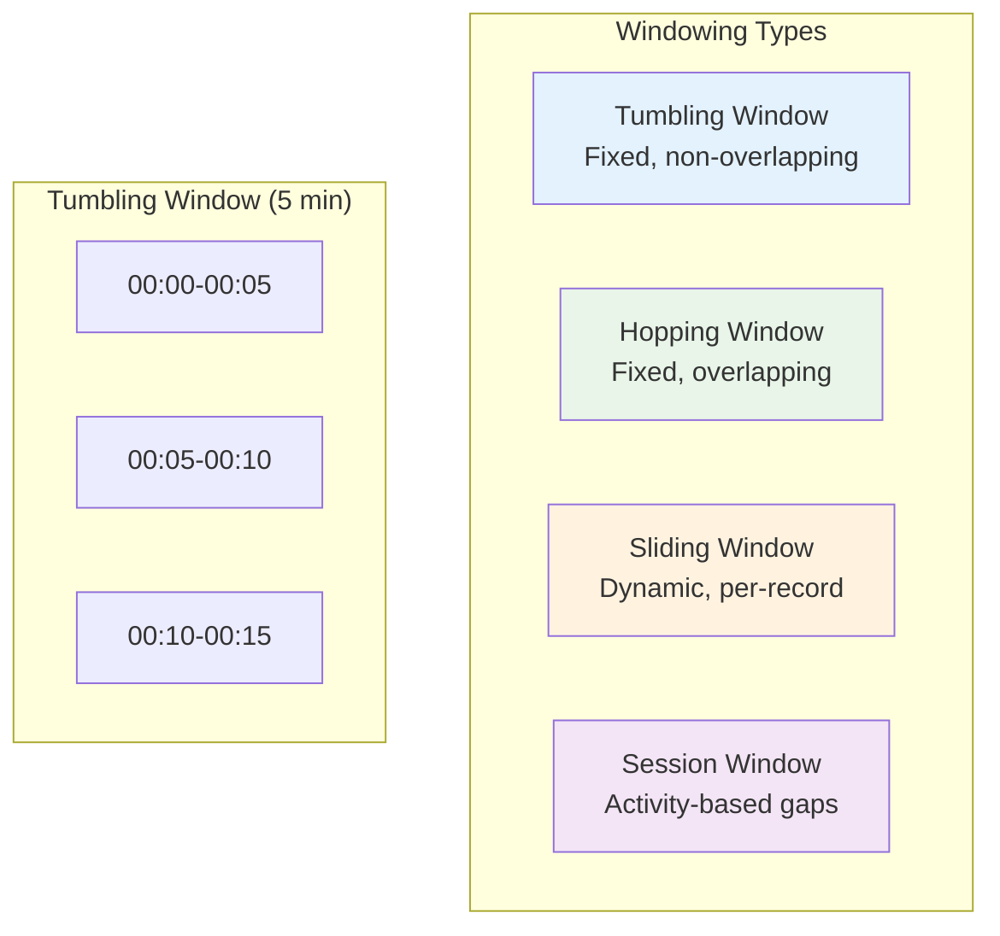

# Kafka for Java Developers - Part 5: Kafka Streams for Real-Time Processing

Kafka Streams is a powerful library for building real-time stream processing applications. Unlike traditional stream processors, Kafka Streams runs as a library within your Java application, eliminating the need for separate processing clusters. You'll learn to transform, aggregate, and analyze data streams with state management and exactly-once guarantees.

## What is Kafka Streams?

**Kafka Streams** is a client library for building mission-critical real-time applications and microservices, where the input and output data are stored in Kafka.



**Key Features**:
- **No separate cluster**: Runs within your Java application
- **Exactly-once processing**: Guarantees each record processed exactly once
- **Stateful operations**: Maintain state for aggregations, joins, windowing
- **Fault tolerance**: Automatically handles failures and rebalancing
- **Scalability**: Scale by adding more application instances

## Project Setup

### Maven Dependencies

```xml
<dependencies>
    <!-- Kafka Streams -->
    <dependency>
        <groupId>org.apache.kafka</groupId>
        <artifactId>kafka-streams</artifactId>
        <version>3.6.0</version>
    </dependency>

    <!-- For JSON processing -->
    <dependency>
        <groupId>com.fasterxml.jackson.core</groupId>
        <artifactId>jackson-databind</artifactId>
        <version>2.15.3</version>
    </dependency>

    <!-- Logging -->
    <dependency>
        <groupId>org.slf4j</groupId>
        <artifactId>slf4j-simple</artifactId>
        <version>2.0.9</version>
    </dependency>
</dependencies>
```

## Your First Streams Application

### Word Count Example

```java
package com.example.kafka.streams;

import org.apache.kafka.common.serialization.Serdes;
import org.apache.kafka.streams.*;
import org.apache.kafka.streams.kstream.*;
import java.util.Arrays;
import java.util.Properties;

public class WordCountStream {

    public static void main(String[] args) {
        // Configure the Streams application
        Properties props = new Properties();
        props.put(StreamsConfig.APPLICATION_ID_CONFIG, "word-count-app");
        props.put(StreamsConfig.BOOTSTRAP_SERVERS_CONFIG, "localhost:9092");
        props.put(StreamsConfig.DEFAULT_KEY_SERDE_CLASS_CONFIG,
            Serdes.String().getClass());
        props.put(StreamsConfig.DEFAULT_VALUE_SERDE_CLASS_CONFIG,
            Serdes.String().getClass());

        // Build the topology
        StreamsBuilder builder = new StreamsBuilder();

        // Read from input topic
        KStream<String, String> textLines = builder.stream("text-input");

        // Process: split, group, count
        KTable<String, Long> wordCounts = textLines
            .flatMapValues(value -> Arrays.asList(value.toLowerCase().split("\\s+")))
            .groupBy((key, word) -> word)
            .count();

        // Write to output topic
        wordCounts.toStream()
            .to("word-count-output", Produced.with(Serdes.String(), Serdes.Long()));

        // Start the application
        KafkaStreams streams = new KafkaStreams(builder.build(), props);
        streams.start();

        // Add shutdown hook
        Runtime.getRuntime().addShutdownHook(new Thread(streams::close));

        System.out.println("Word Count Stream started!");
    }
}
```

**How it works**:



### Testing the Application

```bash
# Create topics
kafka-topics --create --topic text-input --bootstrap-server localhost:9092 --partitions 3
kafka-topics --create --topic word-count-output --bootstrap-server localhost:9092 --partitions 3

# Produce test data
kafka-console-producer --topic text-input --bootstrap-server localhost:9092
>hello world
>kafka streams
>hello kafka

# Consume results
kafka-console-consumer --topic word-count-output \
  --bootstrap-server localhost:9092 \
  --from-beginning \
  --property print.key=true \
  --property key.separator=:
```

Output:
```
hello:1
world:1
kafka:1
streams:1
hello:2
kafka:2
```

## Stream Transformations

### Stateless Transformations

```java
package com.example.kafka.streams;

import org.apache.kafka.common.serialization.Serdes;
import org.apache.kafka.streams.*;
import org.apache.kafka.streams.kstream.*;
import java.util.Properties;

public class TransformationsDemo {

    public static void main(String[] args) {
        Properties props = new Properties();
        props.put(StreamsConfig.APPLICATION_ID_CONFIG, "transformations-demo");
        props.put(StreamsConfig.BOOTSTRAP_SERVERS_CONFIG, "localhost:9092");

        StreamsBuilder builder = new StreamsBuilder();
        KStream<String, String> source = builder.stream("input");

        // 1. Filter - keep only messages containing "important"
        KStream<String, String> filtered = source
            .filter((key, value) -> value.contains("important"));

        // 2. Map - transform values to uppercase
        KStream<String, String> mapped = source
            .mapValues(value -> value.toUpperCase());

        // 3. FlatMap - split each message into multiple records
        KStream<String, String> flatMapped = source
            .flatMapValues(value -> java.util.Arrays.asList(value.split(",")));

        // 4. SelectKey - change the key
        KStream<String, String> rekeyed = source
            .selectKey((key, value) -> value.substring(0, 1));

        // 5. Branch - split stream into multiple streams
        Map<String, KStream<String, String>> branches = source.split(Named.as("branch-"))
            .branch((key, value) -> value.startsWith("A"), Branched.as("a"))
            .branch((key, value) -> value.startsWith("B"), Branched.as("b"))
            .defaultBranch(Branched.as("other"));

        // 6. Merge - combine multiple streams
        KStream<String, String> merged = branches.get("branch-a")
            .merge(branches.get("branch-b"));

        // Write results
        filtered.to("filtered-output");
        mapped.to("mapped-output");

        KafkaStreams streams = new KafkaStreams(builder.build(), props);
        streams.start();

        Runtime.getRuntime().addShutdownHook(new Thread(streams::close));
    }
}
```

### Real-World Example: User Activity Processing

```java
package com.example.kafka.streams;

import com.fasterxml.jackson.databind.JsonNode;
import com.fasterxml.jackson.databind.ObjectMapper;
import com.fasterxml.jackson.databind.node.ObjectNode;
import org.apache.kafka.common.serialization.*;
import org.apache.kafka.streams.*;
import org.apache.kafka.streams.kstream.*;
import java.util.Properties;

public class UserActivityStream {

    private static final ObjectMapper mapper = new ObjectMapper();

    public static void main(String[] args) {
        Properties props = new Properties();
        props.put(StreamsConfig.APPLICATION_ID_CONFIG, "user-activity-processor");
        props.put(StreamsConfig.BOOTSTRAP_SERVERS_CONFIG, "localhost:9092");

        StreamsBuilder builder = new StreamsBuilder();

        // Read user activity events
        KStream<String, String> activities = builder.stream("user-activities");

        // Parse and enrich events
        KStream<String, JsonNode> parsed = activities
            .mapValues(value -> {
                try {
                    return mapper.readTree(value);
                } catch (Exception e) {
                    return null;
                }
            })
            .filter((key, value) -> value != null);

        // Separate by activity type
        Map<String, KStream<String, JsonNode>> byType = parsed.split(Named.as("activity-"))
            .branch((key, value) -> "login".equals(value.get("type").asText()),
                Branched.as("login"))
            .branch((key, value) -> "purchase".equals(value.get("type").asText()),
                Branched.as("purchase"))
            .branch((key, value) -> "view".equals(value.get("type").asText()),
                Branched.as("view"))
            .defaultBranch(Branched.as("other"));

        // Process purchases - add revenue flag for high-value orders
        byType.get("activity-purchase")
            .mapValues(value -> {
                ObjectNode enriched = (ObjectNode) value;
                double amount = value.get("amount").asDouble();
                enriched.put("highValue", amount > 100);
                enriched.put("processedAt", System.currentTimeMillis());
                return enriched;
            })
            .to("processed-purchases", Produced.with(
                Serdes.String(),
                Serdes.serdeFrom(
                    (topic, data) -> {
                        try {
                            return mapper.writeValueAsBytes(data);
                        } catch (Exception e) {
                            return null;
                        }
                    },
                    (topic, data) -> {
                        try {
                            return mapper.readTree(data);
                        } catch (Exception e) {
                            return null;
                        }
                    }
                )
            ));

        KafkaStreams streams = new KafkaStreams(builder.build(), props);
        streams.start();

        Runtime.getRuntime().addShutdownHook(new Thread(streams::close));

        System.out.println("User Activity Stream started!");
    }
}
```

## Aggregations and Stateful Processing

### Counting and Aggregating

```java
package com.example.kafka.streams;

import org.apache.kafka.common.serialization.Serdes;
import org.apache.kafka.streams.*;
import org.apache.kafka.streams.kstream.*;
import java.util.Properties;

public class AggregationsDemo {

    public static void main(String[] args) {
        Properties props = new Properties();
        props.put(StreamsConfig.APPLICATION_ID_CONFIG, "aggregations-demo");
        props.put(StreamsConfig.BOOTSTRAP_SERVERS_CONFIG, "localhost:9092");

        StreamsBuilder builder = new StreamsBuilder();
        KStream<String, String> events = builder.stream("user-events");

        // 1. Count by key
        KTable<String, Long> counts = events
            .groupByKey()
            .count();

        // 2. Count by value (rekey first)
        KTable<String, Long> valueCounts = events
            .groupBy((key, value) -> value)
            .count();

        // 3. Aggregate with custom logic
        KTable<String, Double> revenue = events
            .mapValues(value -> Double.parseDouble(value))
            .groupByKey()
            .aggregate(
                () -> 0.0,  // initializer
                (key, newValue, aggValue) -> aggValue + newValue,  // adder
                Materialized.with(Serdes.String(), Serdes.Double())
            );

        // 4. Reduce (similar to aggregate)
        KTable<String, String> concatenated = events
            .groupByKey()
            .reduce((value1, value2) -> value1 + "," + value2);

        // Write results
        counts.toStream().to("event-counts", Produced.with(Serdes.String(), Serdes.Long()));
        revenue.toStream().to("user-revenue", Produced.with(Serdes.String(), Serdes.Double()));

        KafkaStreams streams = new KafkaStreams(builder.build(), props);
        streams.start();

        Runtime.getRuntime().addShutdownHook(new Thread(streams::close));
    }
}
```

### Real-World: Sales Analytics

```java
package com.example.kafka.streams;

import com.fasterxml.jackson.databind.JsonNode;
import com.fasterxml.jackson.databind.ObjectMapper;
import org.apache.kafka.common.serialization.*;
import org.apache.kafka.streams.*;
import org.apache.kafka.streams.kstream.*;
import java.util.Properties;

class SalesStats {
    public int count = 0;
    public double totalRevenue = 0.0;
    public double avgRevenue = 0.0;

    public void add(double amount) {
        count++;
        totalRevenue += amount;
        avgRevenue = totalRevenue / count;
    }

    @Override
    public String toString() {
        return String.format("count=%d, total=$%.2f, avg=$%.2f", count, totalRevenue, avgRevenue);
    }
}

public class SalesAnalytics {

    private static final ObjectMapper mapper = new ObjectMapper();

    public static void main(String[] args) {
        Properties props = new Properties();
        props.put(StreamsConfig.APPLICATION_ID_CONFIG, "sales-analytics");
        props.put(StreamsConfig.BOOTSTRAP_SERVERS_CONFIG, "localhost:9092");

        StreamsBuilder builder = new StreamsBuilder();

        KStream<String, String> sales = builder.stream("sales");

        // Parse JSON and extract product + amount
        KStream<String, Double> parsedSales = sales
            .mapValues(value -> {
                try {
                    return mapper.readTree(value);
                } catch (Exception e) {
                    return null;
                }
            })
            .filter((key, value) -> value != null)
            .selectKey((key, value) -> value.get("product").asText())
            .mapValues(value -> value.get("amount").asDouble());

        // Aggregate sales by product
        KTable<String, SalesStats> analytics = parsedSales
            .groupByKey()
            .aggregate(
                SalesStats::new,
                (product, amount, stats) -> {
                    stats.add(amount);
                    return stats;
                },
                Materialized.with(Serdes.String(), new SalesStatsSerde())
            );

        // Output results
        analytics.toStream()
            .foreach((product, stats) -> {
                System.out.printf("Product: %s - %s%n", product, stats);
            });

        KafkaStreams streams = new KafkaStreams(builder.build(), props);
        streams.start();

        Runtime.getRuntime().addShutdownHook(new Thread(streams::close));
    }

    // Custom Serde for SalesStats
    static class SalesStatsSerde implements Serde<SalesStats> {
        @Override
        public Serializer<SalesStats> serializer() {
            return (topic, data) -> {
                if (data == null) return null;
                String json = String.format("{\"count\":%d,\"total\":%.2f,\"avg\":%.2f}",
                    data.count, data.totalRevenue, data.avgRevenue);
                return json.getBytes();
            };
        }

        @Override
        public Deserializer<SalesStats> deserializer() {
            return (topic, bytes) -> {
                if (bytes == null) return null;
                try {
                    JsonNode node = mapper.readTree(bytes);
                    SalesStats stats = new SalesStats();
                    stats.count = node.get("count").asInt();
                    stats.totalRevenue = node.get("total").asDouble();
                    stats.avgRevenue = node.get("avg").asDouble();
                    return stats;
                } catch (Exception e) {
                    return null;
                }
            };
        }
    }
}
```

## Windowing Operations

**Windows** group records that arrive within a time frame.



### Tumbling Windows

```java
package com.example.kafka.streams;

import org.apache.kafka.common.serialization.Serdes;
import org.apache.kafka.streams.*;
import org.apache.kafka.streams.kstream.*;
import java.time.Duration;
import java.util.Properties;

public class TumblingWindowExample {

    public static void main(String[] args) {
        Properties props = new Properties();
        props.put(StreamsConfig.APPLICATION_ID_CONFIG, "tumbling-window-app");
        props.put(StreamsConfig.BOOTSTRAP_SERVERS_CONFIG, "localhost:9092");

        StreamsBuilder builder = new StreamsBuilder();
        KStream<String, String> pageViews = builder.stream("page-views");

        // Count page views per user in 5-minute tumbling windows
        KTable<Windowed<String>, Long> windowedCounts = pageViews
            .groupByKey()
            .windowedBy(TimeWindows.ofSizeWithNoGrace(Duration.ofMinutes(5)))
            .count();

        // Output with window information
        windowedCounts.toStream()
            .foreach((windowedKey, count) -> {
                String key = windowedKey.key();
                long start = windowedKey.window().start();
                long end = windowedKey.window().end();

                System.out.printf("User: %s, Window: [%d-%d], Count: %d%n",
                    key, start, end, count);
            });

        KafkaStreams streams = new KafkaStreams(builder.build(), props);
        streams.start();

        Runtime.getRuntime().addShutdownHook(new Thread(streams::close));
    }
}
```

### Hopping Windows

```java
package com.example.kafka.streams;

import org.apache.kafka.streams.*;
import org.apache.kafka.streams.kstream.*;
import java.time.Duration;
import java.util.Properties;

public class HoppingWindowExample {

    public static void main(String[] args) {
        Properties props = new Properties();
        props.put(StreamsConfig.APPLICATION_ID_CONFIG, "hopping-window-app");
        props.put(StreamsConfig.BOOTSTRAP_SERVERS_CONFIG, "localhost:9092");

        StreamsBuilder builder = new StreamsBuilder();
        KStream<String, Double> transactions = builder.stream("transactions");

        // Calculate total transaction amount in 10-minute windows,
        // advancing every 5 minutes (50% overlap)
        KTable<Windowed<String>, Double> windowedSums = transactions
            .groupByKey()
            .windowedBy(TimeWindows
                .ofSizeWithNoGrace(Duration.ofMinutes(10))
                .advanceBy(Duration.ofMinutes(5)))
            .reduce(Double::sum);

        windowedSums.toStream()
            .foreach((windowedKey, sum) -> {
                System.out.printf("User: %s, Window: [%d-%d], Total: $%.2f%n",
                    windowedKey.key(),
                    windowedKey.window().start(),
                    windowedKey.window().end(),
                    sum);
            });

        KafkaStreams streams = new KafkaStreams(builder.build(), props);
        streams.start();

        Runtime.getRuntime().addShutdownHook(new Thread(streams::close));
    }
}
```

### Session Windows

```java
package com.example.kafka.streams;

import org.apache.kafka.streams.*;
import org.apache.kafka.streams.kstream.*;
import java.time.Duration;
import java.util.Properties;

public class SessionWindowExample {

    public static void main(String[] args) {
        Properties props = new Properties();
        props.put(StreamsConfig.APPLICATION_ID_CONFIG, "session-window-app");
        props.put(StreamsConfig.BOOTSTRAP_SERVERS_CONFIG, "localhost:9092");

        StreamsBuilder builder = new StreamsBuilder();
        KStream<String, String> clickStream = builder.stream("user-clicks");

        // Group clicks into sessions with 30-minute inactivity gap
        KTable<Windowed<String>, Long> sessions = clickStream
            .groupByKey()
            .windowedBy(SessionWindows.ofInactivityGapWithNoGrace(Duration.ofMinutes(30)))
            .count();

        sessions.toStream()
            .foreach((windowedKey, count) -> {
                long sessionDuration =
                    windowedKey.window().end() - windowedKey.window().start();

                System.out.printf("User: %s, Session duration: %d ms, Clicks: %d%n",
                    windowedKey.key(), sessionDuration, count);
            });

        KafkaStreams streams = new KafkaStreams(builder.build(), props);
        streams.start();

        Runtime.getRuntime().addShutdownHook(new Thread(streams::close));
    }
}
```

## Joins

### Stream-Stream Join

```java
package com.example.kafka.streams;

import org.apache.kafka.common.serialization.Serdes;
import org.apache.kafka.streams.*;
import org.apache.kafka.streams.kstream.*;
import java.time.Duration;
import java.util.Properties;

public class StreamStreamJoin {

    public static void main(String[] args) {
        Properties props = new Properties();
        props.put(StreamsConfig.APPLICATION_ID_CONFIG, "stream-stream-join");
        props.put(StreamsConfig.BOOTSTRAP_SERVERS_CONFIG, "localhost:9092");

        StreamsBuilder builder = new StreamsBuilder();

        KStream<String, String> clicks = builder.stream("user-clicks");
        KStream<String, String> purchases = builder.stream("user-purchases");

        // Join clicks with purchases within 1-hour window
        KStream<String, String> joined = clicks.join(
            purchases,
            (clickValue, purchaseValue) ->
                "Click: " + clickValue + ", Purchase: " + purchaseValue,
            JoinWindows.ofTimeDifferenceWithNoGrace(Duration.ofHours(1)),
            StreamJoined.with(Serdes.String(), Serdes.String(), Serdes.String())
        );

        joined.to("click-purchase-joined");

        KafkaStreams streams = new KafkaStreams(builder.build(), props);
        streams.start();

        Runtime.getRuntime().addShutdownHook(new Thread(streams::close));
    }
}
```

### Stream-Table Join

```java
package com.example.kafka.streams;

import org.apache.kafka.common.serialization.Serdes;
import org.apache.kafka.streams.*;
import org.apache.kafka.streams.kstream.*;
import java.util.Properties;

public class StreamTableJoin {

    public static void main(String[] args) {
        Properties props = new Properties();
        props.put(StreamsConfig.APPLICATION_ID_CONFIG, "stream-table-join");
        props.put(StreamsConfig.BOOTSTRAP_SERVERS_CONFIG, "localhost:9092");

        StreamsBuilder builder = new StreamsBuilder();

        // Stream of transactions
        KStream<String, String> transactions = builder.stream("transactions");

        // Table of user profiles (compacted topic)
        KTable<String, String> userProfiles = builder.table("user-profiles");

        // Enrich transactions with user profile data
        KStream<String, String> enriched = transactions.join(
            userProfiles,
            (transactionValue, profileValue) ->
                "Transaction: " + transactionValue + ", User: " + profileValue
        );

        enriched.to("enriched-transactions");

        KafkaStreams streams = new KafkaStreams(builder.build(), props);
        streams.start();

        Runtime.getRuntime().addShutdownHook(new Thread(streams::close));
    }
}
```

### Real-World: Order Enrichment

```java
package com.example.kafka.streams;

import com.fasterxml.jackson.databind.JsonNode;
import com.fasterxml.jackson.databind.ObjectMapper;
import com.fasterxml.jackson.databind.node.ObjectNode;
import org.apache.kafka.streams.*;
import org.apache.kafka.streams.kstream.*;
import java.util.Properties;

public class OrderEnrichment {

    private static final ObjectMapper mapper = new ObjectMapper();

    public static void main(String[] args) {
        Properties props = new Properties();
        props.put(StreamsConfig.APPLICATION_ID_CONFIG, "order-enrichment");
        props.put(StreamsConfig.BOOTSTRAP_SERVERS_CONFIG, "localhost:9092");

        StreamsBuilder builder = new StreamsBuilder();

        // Stream of orders (userId as key)
        KStream<String, JsonNode> orders = builder
            .stream("orders")
            .mapValues(value -> {
                try {
                    return mapper.readTree(value.toString());
                } catch (Exception e) {
                    return null;
                }
            })
            .filter((key, value) -> value != null);

        // Table of user profiles
        KTable<String, JsonNode> users = builder
            .table("users")
            .mapValues(value -> {
                try {
                    return mapper.readTree(value.toString());
                } catch (Exception e) {
                    return null;
                }
            });

        // Table of product catalog
        KStream<String, JsonNode> ordersWithProductKey = orders
            .selectKey((key, value) -> value.get("productId").asText());

        KTable<String, JsonNode> products = builder
            .table("products")
            .mapValues(value -> {
                try {
                    return mapper.readTree(value.toString());
                } catch (Exception e) {
                    return null;
                }
            });

        // Enrich orders with user data
        KStream<String, JsonNode> ordersWithUser = orders.leftJoin(
            users,
            (order, user) -> {
                ObjectNode enriched = (ObjectNode) order;
                if (user != null) {
                    enriched.put("userName", user.get("name").asText());
                    enriched.put("userEmail", user.get("email").asText());
                }
                return enriched;
            }
        );

        // Further enrich with product data
        ordersWithUser
            .selectKey((key, value) -> value.get("productId").asText())
            .leftJoin(
                products,
                (order, product) -> {
                    ObjectNode enriched = (ObjectNode) order;
                    if (product != null) {
                        enriched.put("productName", product.get("name").asText());
                        enriched.put("productPrice", product.get("price").asDouble());
                    }
                    return enriched;
                }
            )
            .to("enriched-orders");

        KafkaStreams streams = new KafkaStreams(builder.build(), props);
        streams.start();

        Runtime.getRuntime().addShutdownHook(new Thread(streams::close));

        System.out.println("Order Enrichment Stream started!");
    }
}
```

## State Stores

State stores maintain state for aggregations and joins.

```java
package com.example.kafka.streams;

import org.apache.kafka.common.serialization.Serdes;
import org.apache.kafka.streams.*;
import org.apache.kafka.streams.kstream.*;
import org.apache.kafka.streams.state.*;
import java.util.Properties;

public class StateStoreExample {

    public static void main(String[] args) {
        Properties props = new Properties();
        props.put(StreamsConfig.APPLICATION_ID_CONFIG, "state-store-app");
        props.put(StreamsConfig.BOOTSTRAP_SERVERS_CONFIG, "localhost:9092");

        StreamsBuilder builder = new StreamsBuilder();

        // Create a state store
        StoreBuilder<KeyValueStore<String, Long>> storeBuilder =
            Stores.keyValueStoreBuilder(
                Stores.persistentKeyValueStore("user-click-store"),
                Serdes.String(),
                Serdes.Long()
            );

        builder.addStateStore(storeBuilder);

        KStream<String, String> clicks = builder.stream("user-clicks");

        // Transform with state store
        KStream<String, String> processed = clicks.transformValues(
            () -> new ValueTransformerWithKey<String, String, String>() {
                private KeyValueStore<String, Long> stateStore;

                @Override
                public void init(ProcessorContext context) {
                    stateStore = context.getStateStore("user-click-store");
                }

                @Override
                public String transform(String key, String value) {
                    // Get current count
                    Long count = stateStore.get(key);
                    if (count == null) {
                        count = 0L;
                    }

                    // Increment
                    count++;
                    stateStore.put(key, count);

                    return String.format("User %s - Click #%d: %s", key, count, value);
                }

                @Override
                public void close() {}
            },
            "user-click-store"
        );

        processed.to("processed-clicks");

        KafkaStreams streams = new KafkaStreams(builder.build(), props);
        streams.start();

        Runtime.getRuntime().addShutdownHook(new Thread(streams::close));
    }
}
```

## Exactly-Once Processing

```java
package com.example.kafka.streams;

import org.apache.kafka.streams.*;
import org.apache.kafka.streams.kstream.*;
import java.util.Properties;

public class ExactlyOnceProcessing {

    public static void main(String[] args) {
        Properties props = new Properties();
        props.put(StreamsConfig.APPLICATION_ID_CONFIG, "exactly-once-app");
        props.put(StreamsConfig.BOOTSTRAP_SERVERS_CONFIG, "localhost:9092");

        // Enable exactly-once semantics
        props.put(StreamsConfig.PROCESSING_GUARANTEE_CONFIG,
            StreamsConfig.EXACTLY_ONCE_V2);

        StreamsBuilder builder = new StreamsBuilder();

        KStream<String, String> input = builder.stream("input-topic");

        input
            .mapValues(value -> value.toUpperCase())
            .to("output-topic");

        KafkaStreams streams = new KafkaStreams(builder.build(), props);
        streams.start();

        Runtime.getRuntime().addShutdownHook(new Thread(streams::close));

        System.out.println("Exactly-once processing enabled!");
    }
}
```

## Key Takeaways

- **Kafka Streams** is a library for building real-time stream processing apps
- **Transformations** (map, filter, flatMap) enable stateless processing
- **Aggregations** (count, reduce, aggregate) maintain state for computations
- **Windowing** (tumbling, hopping, session) groups events by time
- **Joins** combine streams and tables for data enrichment
- **State stores** persist application state with fault tolerance
- **Exactly-once processing** guarantees no duplicates or data loss
- **Scalability** through parallel instances sharing partitions

## What's Next

In Part 6, we'll cover production best practices including error handling, monitoring, security, performance tuning, and operational considerations for running Kafka in production environments.

Topics covered:
- Error handling and dead letter queues
- Monitoring and alerting
- Security and authentication
- Performance optimization
- Disaster recovery
- Production deployment patterns
