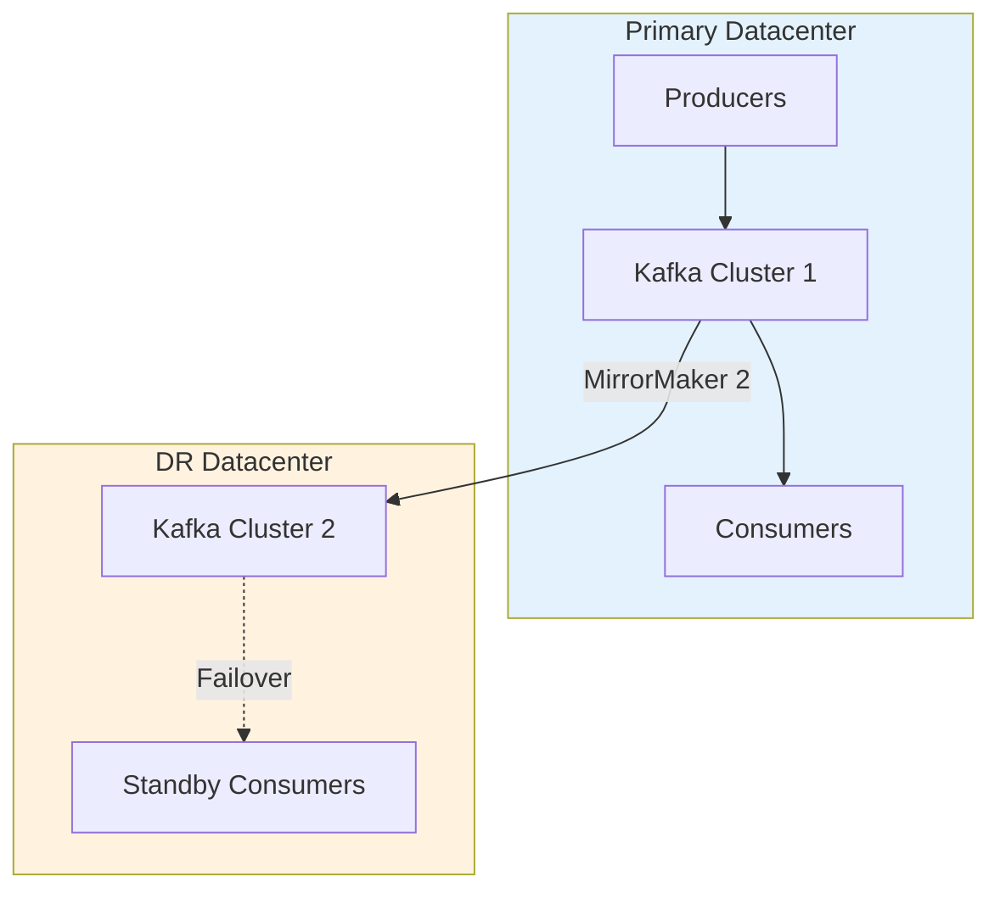

# Kafka for Java Developers - Part 6: Production Best Practices

Running Kafka in production requires careful attention to reliability, performance, security, and operational concerns. This final tutorial covers battle-tested patterns and best practices for building and operating production-grade Kafka systems.

## Error Handling Strategies

### Dead Letter Queue (DLQ) Pattern

```java
package com.example.kafka.production;

import org.apache.kafka.clients.consumer.*;
import org.apache.kafka.clients.producer.*;
import org.apache.kafka.common.serialization.StringDeserializer;
import org.apache.kafka.common.serialization.StringSerializer;
import java.time.Duration;
import java.util.*;

public class DLQConsumer {

    private final KafkaConsumer<String, String> consumer;
    private final KafkaProducer<String, String> dlqProducer;
    private final String dlqTopic;

    public DLQConsumer(String bootstrapServers, String groupId, String topic, String dlqTopic) {
        this.dlqTopic = dlqTopic;

        // Configure consumer
        Properties consumerProps = new Properties();
        consumerProps.put(ConsumerConfig.BOOTSTRAP_SERVERS_CONFIG, bootstrapServers);
        consumerProps.put(ConsumerConfig.GROUP_ID_CONFIG, groupId);
        consumerProps.put(ConsumerConfig.KEY_DESERIALIZER_CLASS_CONFIG, StringDeserializer.class);
        consumerProps.put(ConsumerConfig.VALUE_DESERIALIZER_CLASS_CONFIG, StringDeserializer.class);
        consumerProps.put(ConsumerConfig.ENABLE_AUTO_COMMIT_CONFIG, false);
        consumerProps.put(ConsumerConfig.MAX_POLL_RECORDS_CONFIG, 100);

        this.consumer = new KafkaConsumer<>(consumerProps);
        consumer.subscribe(Collections.singletonList(topic));

        // Configure DLQ producer
        Properties producerProps = new Properties();
        producerProps.put(ProducerConfig.BOOTSTRAP_SERVERS_CONFIG, bootstrapServers);
        producerProps.put(ProducerConfig.KEY_SERIALIZER_CLASS_CONFIG, StringSerializer.class);
        producerProps.put(ProducerConfig.VALUE_SERIALIZER_CLASS_CONFIG, StringSerializer.class);
        producerProps.put(ProducerConfig.ACKS_CONFIG, "all");
        producerProps.put(ProducerConfig.ENABLE_IDEMPOTENCE_CONFIG, true);

        this.dlqProducer = new KafkaProducer<>(producerProps);
    }

    public void consume() {
        try {
            while (true) {
                ConsumerRecords<String, String> records = consumer.poll(Duration.ofMillis(100));

                for (ConsumerRecord<String, String> record : records) {
                    try {
                        // Attempt to process
                        processRecord(record);

                        System.out.printf("✓ Processed: %s%n", record.value());

                    } catch (RecoverableException e) {
                        // Retriable error - log and continue
                        System.err.printf("⚠ Recoverable error for %s: %s%n",
                            record.key(), e.getMessage());
                        // Could implement retry logic here

                    } catch (PermanentException e) {
                        // Non-retriable error - send to DLQ
                        System.err.printf("✗ Permanent error for %s: %s%n",
                            record.key(), e.getMessage());

                        sendToDLQ(record, e);
                    }
                }

                // Commit offsets after processing batch
                consumer.commitSync();
            }
        } finally {
            consumer.close();
            dlqProducer.close();
        }
    }

    private void sendToDLQ(ConsumerRecord<String, String> record, Exception error) {
        // Create DLQ record with error metadata in headers
        ProducerRecord<String, String> dlqRecord =
            new ProducerRecord<>(dlqTopic, record.key(), record.value());

        // Add error information as headers
        dlqRecord.headers().add("error.message", error.getMessage().getBytes());
        dlqRecord.headers().add("error.class", error.getClass().getName().getBytes());
        dlqRecord.headers().add("original.topic", record.topic().getBytes());
        dlqRecord.headers().add("original.partition",
            String.valueOf(record.partition()).getBytes());
        dlqRecord.headers().add("original.offset",
            String.valueOf(record.offset()).getBytes());
        dlqRecord.headers().add("timestamp",
            String.valueOf(System.currentTimeMillis()).getBytes());

        dlqProducer.send(dlqRecord, (metadata, exception) -> {
            if (exception != null) {
                System.err.println("Failed to send to DLQ: " + exception.getMessage());
                // Critical: implement fallback (local file, alert, etc.)
            }
        });
    }

    private void processRecord(ConsumerRecord<String, String> record)
            throws RecoverableException, PermanentException {
        // Simulate processing logic
        if (record.value().contains("invalid")) {
            throw new PermanentException("Invalid data format");
        }
        if (Math.random() < 0.1) {
            throw new RecoverableException("Temporary service unavailable");
        }
        // Process successfully
    }

    static class RecoverableException extends Exception {
        public RecoverableException(String message) { super(message); }
    }

    static class PermanentException extends Exception {
        public PermanentException(String message) { super(message); }
    }

    public static void main(String[] args) {
        DLQConsumer consumer = new DLQConsumer(
            "localhost:9092",
            "dlq-consumer-group",
            "orders",
            "orders-dlq"
        );
        consumer.consume();
    }
}
```

### Retry Pattern with Backoff

```java
package com.example.kafka.production;

import org.apache.kafka.clients.consumer.*;
import java.time.Duration;
import java.util.*;

public class RetryConsumer {

    private final KafkaConsumer<String, String> consumer;
    private static final int MAX_RETRIES = 3;
    private static final long INITIAL_BACKOFF_MS = 1000;

    public RetryConsumer(String bootstrapServers, String groupId, String topic) {
        Properties props = new Properties();
        props.put(ConsumerConfig.BOOTSTRAP_SERVERS_CONFIG, bootstrapServers);
        props.put(ConsumerConfig.GROUP_ID_CONFIG, groupId);
        props.put(ConsumerConfig.KEY_DESERIALIZER_CLASS_CONFIG,
            "org.apache.kafka.common.serialization.StringDeserializer");
        props.put(ConsumerConfig.VALUE_DESERIALIZER_CLASS_CONFIG,
            "org.apache.kafka.common.serialization.StringDeserializer");
        props.put(ConsumerConfig.ENABLE_AUTO_COMMIT_CONFIG, false);

        this.consumer = new KafkaConsumer<>(props);
        consumer.subscribe(Collections.singletonList(topic));
    }

    public void consume() {
        while (true) {
            ConsumerRecords<String, String> records = consumer.poll(Duration.ofMillis(100));

            for (ConsumerRecord<String, String> record : records) {
                boolean success = processWithRetry(record);

                if (!success) {
                    System.err.printf("✗ Failed after %d retries: %s%n",
                        MAX_RETRIES, record.value());
                    // Send to DLQ or alert
                }
            }

            consumer.commitSync();
        }
    }

    private boolean processWithRetry(ConsumerRecord<String, String> record) {
        for (int attempt = 0; attempt < MAX_RETRIES; attempt++) {
            try {
                processRecord(record);
                return true;

            } catch (Exception e) {
                long backoffMs = INITIAL_BACKOFF_MS * (long) Math.pow(2, attempt);

                System.err.printf("⚠ Attempt %d failed for %s: %s. Retrying in %d ms...%n",
                    attempt + 1, record.key(), e.getMessage(), backoffMs);

                try {
                    Thread.sleep(backoffMs);
                } catch (InterruptedException ie) {
                    Thread.currentThread().interrupt();
                    return false;
                }
            }
        }
        return false;
    }

    private void processRecord(ConsumerRecord<String, String> record) throws Exception {
        // Simulate processing that may fail
        if (Math.random() < 0.3) {
            throw new Exception("Processing failed");
        }
        System.out.println("Processed: " + record.value());
    }

    public static void main(String[] args) {
        RetryConsumer consumer = new RetryConsumer(
            "localhost:9092", "retry-group", "orders");
        consumer.consume();
    }
}
```

## Monitoring and Observability

### Comprehensive Metrics Collection

```java
package com.example.kafka.production;

import org.apache.kafka.clients.consumer.*;
import org.apache.kafka.clients.producer.*;
import org.apache.kafka.common.Metric;
import org.apache.kafka.common.MetricName;
import java.util.*;
import java.util.concurrent.*;

public class KafkaMetricsCollector {

    private final KafkaProducer<String, String> producer;
    private final KafkaConsumer<String, String> consumer;
    private final ScheduledExecutorService scheduler;

    public KafkaMetricsCollector(String bootstrapServers) {
        // Setup producer
        Properties producerProps = new Properties();
        producerProps.put(ProducerConfig.BOOTSTRAP_SERVERS_CONFIG, bootstrapServers);
        producerProps.put(ProducerConfig.KEY_SERIALIZER_CLASS_CONFIG,
            "org.apache.kafka.common.serialization.StringSerializer");
        producerProps.put(ProducerConfig.VALUE_SERIALIZER_CLASS_CONFIG,
            "org.apache.kafka.common.serialization.StringSerializer");
        this.producer = new KafkaProducer<>(producerProps);

        // Setup consumer
        Properties consumerProps = new Properties();
        consumerProps.put(ConsumerConfig.BOOTSTRAP_SERVERS_CONFIG, bootstrapServers);
        consumerProps.put(ConsumerConfig.GROUP_ID_CONFIG, "metrics-group");
        consumerProps.put(ConsumerConfig.KEY_DESERIALIZER_CLASS_CONFIG,
            "org.apache.kafka.common.serialization.StringDeserializer");
        consumerProps.put(ConsumerConfig.VALUE_DESERIALIZER_CLASS_CONFIG,
            "org.apache.kafka.common.serialization.StringDeserializer");
        this.consumer = new KafkaConsumer<>(consumerProps);

        // Schedule metrics collection
        this.scheduler = Executors.newScheduledThreadPool(1);
    }

    public void startMetricsCollection() {
        scheduler.scheduleAtFixedRate(() -> {
            collectProducerMetrics();
            collectConsumerMetrics();
        }, 0, 30, TimeUnit.SECONDS);
    }

    private void collectProducerMetrics() {
        Map<MetricName, ? extends Metric> metrics = producer.metrics();

        System.out.println("\n=== Producer Metrics ===");

        // Throughput metrics
        printMetric(metrics, "record-send-rate", "Records/sec");
        printMetric(metrics, "byte-rate", "Bytes/sec");
        printMetric(metrics, "compression-rate-avg", "Compression ratio");

        // Latency metrics
        printMetric(metrics, "request-latency-avg", "Avg request latency (ms)");
        printMetric(metrics, "request-latency-max", "Max request latency (ms)");

        // Error metrics
        printMetric(metrics, "record-error-rate", "Errors/sec");
        printMetric(metrics, "record-retry-rate", "Retries/sec");

        // Resource metrics
        printMetric(metrics, "buffer-available-bytes", "Buffer available");
        printMetric(metrics, "buffer-total-bytes", "Buffer total");

        // Batch metrics
        printMetric(metrics, "batch-size-avg", "Avg batch size");
        printMetric(metrics, "records-per-request-avg", "Records per request");
    }

    private void collectConsumerMetrics() {
        Map<MetricName, ? extends Metric> metrics = consumer.metrics();

        System.out.println("\n=== Consumer Metrics ===");

        // Throughput metrics
        printMetric(metrics, "records-consumed-rate", "Records/sec consumed");
        printMetric(metrics, "bytes-consumed-rate", "Bytes/sec consumed");

        // Lag metrics (critical!)
        printMetric(metrics, "records-lag-max", "Max lag (records)");
        printMetric(metrics, "records-lag-avg", "Avg lag (records)");

        // Fetch metrics
        printMetric(metrics, "fetch-rate", "Fetch requests/sec");
        printMetric(metrics, "fetch-latency-avg", "Avg fetch latency (ms)");
        printMetric(metrics, "fetch-size-avg", "Avg fetch size (bytes)");

        // Commit metrics
        printMetric(metrics, "commit-rate", "Commits/sec");
        printMetric(metrics, "commit-latency-avg", "Avg commit latency (ms)");
    }

    private void printMetric(Map<MetricName, ? extends Metric> metrics,
                             String name, String description) {
        metrics.entrySet().stream()
            .filter(e -> e.getKey().name().equals(name))
            .findFirst()
            .ifPresent(e -> {
                Object value = e.getValue().metricValue();
                System.out.printf("  %s: %s%n", description, value);

                // Alert on critical thresholds
                checkThreshold(name, value);
            });
    }

    private void checkThreshold(String metricName, Object value) {
        if (value instanceof Double) {
            double val = (Double) value;

            if (metricName.equals("records-lag-max") && val > 10000) {
                alert("HIGH LAG: " + val + " records behind");
            }
            if (metricName.equals("record-error-rate") && val > 1) {
                alert("HIGH ERROR RATE: " + val + " errors/sec");
            }
            if (metricName.equals("request-latency-max") && val > 1000) {
                alert("HIGH LATENCY: " + val + " ms");
            }
        }
    }

    private void alert(String message) {
        System.err.println("⚠️  ALERT: " + message);
        // In production: send to monitoring system, PagerDuty, Slack, etc.
    }

    public void shutdown() {
        scheduler.shutdown();
        producer.close();
        consumer.close();
    }

    public static void main(String[] args) throws InterruptedException {
        KafkaMetricsCollector collector = new KafkaMetricsCollector("localhost:9092");
        collector.startMetricsCollection();

        // Run for 5 minutes
        Thread.sleep(300000);
        collector.shutdown();
    }
}
```

### JMX Monitoring Integration

```java
package com.example.kafka.production;

import javax.management.*;
import javax.management.remote.*;
import java.io.IOException;
import java.util.*;

public class KafkaJMXMonitor {

    private final MBeanServerConnection mBeanServer;

    public KafkaJMXMonitor(String jmxUrl) throws IOException {
        JMXServiceURL url = new JMXServiceURL(jmxUrl);
        JMXConnector jmxConnector = JMXConnectorFactory.connect(url);
        this.mBeanServer = jmxConnector.getMBeanServerConnection();
    }

    public void monitorBrokerMetrics() throws Exception {
        // Broker-level metrics
        ObjectName brokerMetrics = new ObjectName(
            "kafka.server:type=BrokerTopicMetrics,name=MessagesInPerSec");

        Double messagesInPerSec = (Double) mBeanServer.getAttribute(
            brokerMetrics, "OneMinuteRate");

        System.out.printf("Messages In/sec: %.2f%n", messagesInPerSec);

        // Network metrics
        ObjectName networkMetrics = new ObjectName(
            "kafka.network:type=RequestMetrics,name=TotalTimeMs,request=Produce");

        Double produceLatency = (Double) mBeanServer.getAttribute(
            networkMetrics, "Mean");

        System.out.printf("Produce Latency (avg): %.2f ms%n", produceLatency);

        // Controller metrics
        ObjectName controller = new ObjectName(
            "kafka.controller:type=KafkaController,name=ActiveControllerCount");

        Integer activeControllers = (Integer) mBeanServer.getAttribute(
            controller, "Value");

        if (activeControllers != 1) {
            System.err.println("⚠️  Controller issue: " + activeControllers + " active");
        }
    }

    public static void main(String[] args) throws Exception {
        // Connect to Kafka broker JMX (default port 9999)
        KafkaJMXMonitor monitor = new KafkaJMXMonitor(
            "service:jmx:rmi:///jndi/rmi://localhost:9999/jmxrmi");

        while (true) {
            monitor.monitorBrokerMetrics();
            Thread.sleep(10000); // Every 10 seconds
        }
    }
}
```

## Security Best Practices

### SSL/TLS Configuration

```java
package com.example.kafka.production;

import org.apache.kafka.clients.producer.*;
import org.apache.kafka.clients.consumer.*;
import org.apache.kafka.common.config.SslConfigs;
import java.util.Properties;

public class SecureKafkaClient {

    public static KafkaProducer<String, String> createSecureProducer(String bootstrapServers) {
        Properties props = new Properties();
        props.put(ProducerConfig.BOOTSTRAP_SERVERS_CONFIG, bootstrapServers);
        props.put(ProducerConfig.KEY_SERIALIZER_CLASS_CONFIG,
            "org.apache.kafka.common.serialization.StringSerializer");
        props.put(ProducerConfig.VALUE_SERIALIZER_CLASS_CONFIG,
            "org.apache.kafka.common.serialization.StringSerializer");

        // SSL Configuration
        props.put("security.protocol", "SSL");
        props.put(SslConfigs.SSL_TRUSTSTORE_LOCATION_CONFIG, "/path/to/truststore.jks");
        props.put(SslConfigs.SSL_TRUSTSTORE_PASSWORD_CONFIG, "truststore-password");
        props.put(SslConfigs.SSL_KEYSTORE_LOCATION_CONFIG, "/path/to/keystore.jks");
        props.put(SslConfigs.SSL_KEYSTORE_PASSWORD_CONFIG, "keystore-password");
        props.put(SslConfigs.SSL_KEY_PASSWORD_CONFIG, "key-password");

        return new KafkaProducer<>(props);
    }

    public static KafkaConsumer<String, String> createSecureConsumer(
            String bootstrapServers, String groupId) {
        Properties props = new Properties();
        props.put(ConsumerConfig.BOOTSTRAP_SERVERS_CONFIG, bootstrapServers);
        props.put(ConsumerConfig.GROUP_ID_CONFIG, groupId);
        props.put(ConsumerConfig.KEY_DESERIALIZER_CLASS_CONFIG,
            "org.apache.kafka.common.serialization.StringDeserializer");
        props.put(ConsumerConfig.VALUE_DESERIALIZER_CLASS_CONFIG,
            "org.apache.kafka.common.serialization.StringDeserializer");

        // SSL Configuration
        props.put("security.protocol", "SSL");
        props.put(SslConfigs.SSL_TRUSTSTORE_LOCATION_CONFIG, "/path/to/truststore.jks");
        props.put(SslConfigs.SSL_TRUSTSTORE_PASSWORD_CONFIG, "truststore-password");
        props.put(SslConfigs.SSL_KEYSTORE_LOCATION_CONFIG, "/path/to/keystore.jks");
        props.put(SslConfigs.SSL_KEYSTORE_PASSWORD_CONFIG, "keystore-password");
        props.put(SslConfigs.SSL_KEY_PASSWORD_CONFIG, "key-password");

        return new KafkaConsumer<>(props);
    }
}
```

### SASL Authentication

```java
package com.example.kafka.production;

import org.apache.kafka.clients.producer.*;
import org.apache.kafka.common.config.SaslConfigs;
import java.util.Properties;

public class SASLKafkaClient {

    public static KafkaProducer<String, String> createSASLProducer(String bootstrapServers) {
        Properties props = new Properties();
        props.put(ProducerConfig.BOOTSTRAP_SERVERS_CONFIG, bootstrapServers);
        props.put(ProducerConfig.KEY_SERIALIZER_CLASS_CONFIG,
            "org.apache.kafka.common.serialization.StringSerializer");
        props.put(ProducerConfig.VALUE_SERIALIZER_CLASS_CONFIG,
            "org.apache.kafka.common.serialization.StringSerializer");

        // SASL/PLAIN Configuration
        props.put("security.protocol", "SASL_SSL");
        props.put(SaslConfigs.SASL_MECHANISM, "PLAIN");
        props.put(SaslConfigs.SASL_JAAS_CONFIG,
            "org.apache.kafka.common.security.plain.PlainLoginModule required " +
            "username=\"kafka-user\" " +
            "password=\"kafka-password\";");

        // SSL for encryption
        props.put("ssl.truststore.location", "/path/to/truststore.jks");
        props.put("ssl.truststore.password", "truststore-password");

        return new KafkaProducer<>(props);
    }

    // Alternative: SASL/SCRAM (more secure)
    public static KafkaProducer<String, String> createSASLScramProducer(String bootstrapServers) {
        Properties props = new Properties();
        props.put(ProducerConfig.BOOTSTRAP_SERVERS_CONFIG, bootstrapServers);
        props.put(ProducerConfig.KEY_SERIALIZER_CLASS_CONFIG,
            "org.apache.kafka.common.serialization.StringSerializer");
        props.put(ProducerConfig.VALUE_SERIALIZER_CLASS_CONFIG,
            "org.apache.kafka.common.serialization.StringSerializer");

        props.put("security.protocol", "SASL_SSL");
        props.put(SaslConfigs.SASL_MECHANISM, "SCRAM-SHA-512");
        props.put(SaslConfigs.SASL_JAAS_CONFIG,
            "org.apache.kafka.common.security.scram.ScramLoginModule required " +
            "username=\"kafka-user\" " +
            "password=\"kafka-password\";");

        return new KafkaProducer<>(props);
    }
}
```

## Performance Tuning

### Producer Tuning Matrix

```java
package com.example.kafka.production;

import org.apache.kafka.clients.producer.*;
import java.util.Properties;

public class ProducerTuningProfiles {

    // Profile 1: Maximum Throughput
    public static Properties highThroughputConfig(String bootstrapServers) {
        Properties props = new Properties();
        props.put(ProducerConfig.BOOTSTRAP_SERVERS_CONFIG, bootstrapServers);
        props.put(ProducerConfig.KEY_SERIALIZER_CLASS_CONFIG,
            "org.apache.kafka.common.serialization.StringSerializer");
        props.put(ProducerConfig.VALUE_SERIALIZER_CLASS_CONFIG,
            "org.apache.kafka.common.serialization.StringSerializer");

        props.put(ProducerConfig.ACKS_CONFIG, "1");                    // Leader ack only
        props.put(ProducerConfig.COMPRESSION_TYPE_CONFIG, "lz4");      // Fast compression
        props.put(ProducerConfig.BATCH_SIZE_CONFIG, 65536);            // 64KB batches
        props.put(ProducerConfig.LINGER_MS_CONFIG, 10);                // Wait 10ms
        props.put(ProducerConfig.BUFFER_MEMORY_CONFIG, 67108864);      // 64MB buffer
        props.put(ProducerConfig.MAX_IN_FLIGHT_REQUESTS_PER_CONNECTION, 5);

        return props;
    }

    // Profile 2: Low Latency
    public static Properties lowLatencyConfig(String bootstrapServers) {
        Properties props = new Properties();
        props.put(ProducerConfig.BOOTSTRAP_SERVERS_CONFIG, bootstrapServers);
        props.put(ProducerConfig.KEY_SERIALIZER_CLASS_CONFIG,
            "org.apache.kafka.common.serialization.StringSerializer");
        props.put(ProducerConfig.VALUE_SERIALIZER_CLASS_CONFIG,
            "org.apache.kafka.common.serialization.StringSerializer");

        props.put(ProducerConfig.ACKS_CONFIG, "1");
        props.put(ProducerConfig.COMPRESSION_TYPE_CONFIG, "none");     // No compression
        props.put(ProducerConfig.LINGER_MS_CONFIG, 0);                 // Send immediately
        props.put(ProducerConfig.BATCH_SIZE_CONFIG, 16384);            // Smaller batches
        props.put(ProducerConfig.REQUEST_TIMEOUT_MS_CONFIG, 5000);     // 5s timeout

        return props;
    }

    // Profile 3: Maximum Reliability
    public static Properties highReliabilityConfig(String bootstrapServers) {
        Properties props = new Properties();
        props.put(ProducerConfig.BOOTSTRAP_SERVERS_CONFIG, bootstrapServers);
        props.put(ProducerConfig.KEY_SERIALIZER_CLASS_CONFIG,
            "org.apache.kafka.common.serialization.StringSerializer");
        props.put(ProducerConfig.VALUE_SERIALIZER_CLASS_CONFIG,
            "org.apache.kafka.common.serialization.StringSerializer");

        props.put(ProducerConfig.ACKS_CONFIG, "all");                  // All replicas
        props.put(ProducerConfig.ENABLE_IDEMPOTENCE_CONFIG, true);     // Exactly-once
        props.put(ProducerConfig.RETRIES_CONFIG, Integer.MAX_VALUE);   // Infinite retries
        props.put(ProducerConfig.MAX_IN_FLIGHT_REQUESTS_PER_CONNECTION, 5);
        props.put(ProducerConfig.COMPRESSION_TYPE_CONFIG, "snappy");   // Balanced
        props.put(ProducerConfig.DELIVERY_TIMEOUT_MS_CONFIG, 120000);  // 2min timeout

        return props;
    }

    // Profile 4: Balanced (Recommended)
    public static Properties balancedConfig(String bootstrapServers) {
        Properties props = new Properties();
        props.put(ProducerConfig.BOOTSTRAP_SERVERS_CONFIG, bootstrapServers);
        props.put(ProducerConfig.KEY_SERIALIZER_CLASS_CONFIG,
            "org.apache.kafka.common.serialization.StringSerializer");
        props.put(ProducerConfig.VALUE_SERIALIZER_CLASS_CONFIG,
            "org.apache.kafka.common.serialization.StringSerializer");

        props.put(ProducerConfig.ACKS_CONFIG, "1");
        props.put(ProducerConfig.COMPRESSION_TYPE_CONFIG, "snappy");
        props.put(ProducerConfig.BATCH_SIZE_CONFIG, 32768);            // 32KB
        props.put(ProducerConfig.LINGER_MS_CONFIG, 1);
        props.put(ProducerConfig.RETRIES_CONFIG, 3);
        props.put(ProducerConfig.ENABLE_IDEMPOTENCE_CONFIG, false);
        props.put(ProducerConfig.MAX_IN_FLIGHT_REQUESTS_PER_CONNECTION, 5);

        return props;
    }
}
```

### Consumer Tuning

```java
package com.example.kafka.production;

import org.apache.kafka.clients.consumer.*;
import java.util.Properties;

public class ConsumerTuningProfiles {

    // High throughput consumer
    public static Properties highThroughputConfig(String bootstrapServers, String groupId) {
        Properties props = new Properties();
        props.put(ConsumerConfig.BOOTSTRAP_SERVERS_CONFIG, bootstrapServers);
        props.put(ConsumerConfig.GROUP_ID_CONFIG, groupId);
        props.put(ConsumerConfig.KEY_DESERIALIZER_CLASS_CONFIG,
            "org.apache.kafka.common.serialization.StringDeserializer");
        props.put(ConsumerConfig.VALUE_DESERIALIZER_CLASS_CONFIG,
            "org.apache.kafka.common.serialization.StringDeserializer");

        props.put(ConsumerConfig.MAX_POLL_RECORDS_CONFIG, 500);        // Larger batches
        props.put(ConsumerConfig.FETCH_MIN_BYTES_CONFIG, 50000);       // 50KB min fetch
        props.put(ConsumerConfig.FETCH_MAX_WAIT_MS_CONFIG, 500);       // Wait up to 500ms
        props.put(ConsumerConfig.ENABLE_AUTO_COMMIT_CONFIG, true);
        props.put(ConsumerConfig.AUTO_COMMIT_INTERVAL_MS_CONFIG, 5000);

        return props;
    }

    // Low latency consumer
    public static Properties lowLatencyConfig(String bootstrapServers, String groupId) {
        Properties props = new Properties();
        props.put(ConsumerConfig.BOOTSTRAP_SERVERS_CONFIG, bootstrapServers);
        props.put(ConsumerConfig.GROUP_ID_CONFIG, groupId);
        props.put(ConsumerConfig.KEY_DESERIALIZER_CLASS_CONFIG,
            "org.apache.kafka.common.serialization.StringDeserializer");
        props.put(ConsumerConfig.VALUE_DESERIALIZER_CLASS_CONFIG,
            "org.apache.kafka.common.serialization.StringDeserializer");

        props.put(ConsumerConfig.MAX_POLL_RECORDS_CONFIG, 100);        // Smaller batches
        props.put(ConsumerConfig.FETCH_MIN_BYTES_CONFIG, 1);           // Immediate fetch
        props.put(ConsumerConfig.FETCH_MAX_WAIT_MS_CONFIG, 100);       // Low wait
        props.put(ConsumerConfig.ENABLE_AUTO_COMMIT_CONFIG, false);    // Manual control

        return props;
    }
}
```

## Disaster Recovery

### Backup and Restore Strategy

```java
package com.example.kafka.production;

import org.apache.kafka.clients.consumer.*;
import org.apache.kafka.common.TopicPartition;
import java.io.*;
import java.time.Duration;
import java.util.*;

public class KafkaBackupRestore {

    // Backup topic to files
    public static void backupTopic(String bootstrapServers, String topic, String outputDir) {
        Properties props = new Properties();
        props.put(ConsumerConfig.BOOTSTRAP_SERVERS_CONFIG, bootstrapServers);
        props.put(ConsumerConfig.GROUP_ID_CONFIG, "backup-consumer-" + System.currentTimeMillis());
        props.put(ConsumerConfig.KEY_DESERIALIZER_CLASS_CONFIG,
            "org.apache.kafka.common.serialization.StringDeserializer");
        props.put(ConsumerConfig.VALUE_DESERIALIZER_CLASS_CONFIG,
            "org.apache.kafka.common.serialization.StringDeserializer");
        props.put(ConsumerConfig.AUTO_OFFSET_RESET_CONFIG, "earliest");

        KafkaConsumer<String, String> consumer = new KafkaConsumer<>(props);
        consumer.subscribe(Collections.singletonList(topic));

        new File(outputDir).mkdirs();

        try (PrintWriter writer = new PrintWriter(
                new FileWriter(outputDir + "/" + topic + "-backup.jsonl"))) {

            int count = 0;
            while (true) {
                ConsumerRecords<String, String> records = consumer.poll(Duration.ofMillis(1000));

                if (records.isEmpty()) {
                    break; // No more records
                }

                for (ConsumerRecord<String, String> record : records) {
                    // Write in JSON Lines format
                    String json = String.format(
                        "{\"partition\":%d,\"offset\":%d,\"key\":\"%s\",\"value\":\"%s\",\"timestamp\":%d}",
                        record.partition(), record.offset(),
                        escapeJson(record.key()), escapeJson(record.value()),
                        record.timestamp()
                    );
                    writer.println(json);
                    count++;

                    if (count % 1000 == 0) {
                        System.out.printf("Backed up %d records%n", count);
                    }
                }
            }

            System.out.printf("✓ Backup complete: %d records saved to %s%n",
                count, outputDir);

        } catch (IOException e) {
            System.err.println("Backup failed: " + e.getMessage());
        } finally {
            consumer.close();
        }
    }

    private static String escapeJson(String str) {
        if (str == null) return "";
        return str.replace("\\", "\\\\").replace("\"", "\\\"");
    }

    public static void main(String[] args) {
        backupTopic("localhost:9092", "orders", "./backup");
    }
}
```

### Multi-Datacenter Replication



**MirrorMaker 2 Configuration**:
```properties
# mm2.properties
clusters = primary, backup
primary.bootstrap.servers = primary-kafka:9092
backup.bootstrap.servers = backup-kafka:9092

primary->backup.enabled = true
primary->backup.topics = orders.*, payments.*

# Sync consumer group offsets
sync.group.offsets.enabled = true
sync.group.offsets.interval.seconds = 60

# Replication factor
replication.factor = 3
```

## Production Deployment Checklist

### Infrastructure Setup

```yaml
# Kafka cluster configuration checklist

Brokers:
  - ✓ Minimum 3 brokers for production
  - ✓ Each broker on separate physical/virtual machine
  - ✓ Adequate disk space (estimate: retention * throughput * replication)
  - ✓ Fast disks (SSD recommended for high throughput)
  - ✓ Sufficient RAM (heap: 4-6GB, page cache: remaining)

Networking:
  - ✓ Low-latency network between brokers (<10ms)
  - ✓ Adequate bandwidth (10Gbps recommended)
  - ✓ Firewall rules configured
  - ✓ DNS resolution working

ZooKeeper (or KRaft):
  - ✓ Dedicated ZooKeeper ensemble (3-5 nodes)
  - ✓ Separated from Kafka brokers
  - ✓ Fast disks for ZooKeeper
  - ✓ Regular snapshots configured

Monitoring:
  - ✓ JMX enabled on brokers
  - ✓ Metrics collection (Prometheus, Grafana)
  - ✓ Alerting configured
  - ✓ Log aggregation (ELK, Splunk)

Security:
  - ✓ SSL/TLS enabled
  - ✓ SASL authentication configured
  - ✓ ACLs defined
  - ✓ Secrets management (Vault, KMS)
```

### Topic Configuration Best Practices

```java
package com.example.kafka.production;

import org.apache.kafka.clients.admin.*;
import org.apache.kafka.common.config.TopicConfig;
import java.util.*;
import java.util.concurrent.ExecutionException;

public class TopicConfigurationBestPractices {

    public static void createProductionTopic(String bootstrapServers, String topicName)
            throws ExecutionException, InterruptedException {

        Properties props = new Properties();
        props.put(AdminClientConfig.BOOTSTRAP_SERVERS_CONFIG, bootstrapServers);

        try (AdminClient adminClient = AdminClient.create(props)) {

            // Calculate partitions: (target throughput / partition throughput)
            int partitions = 12; // Example: 12 partitions for 120K msg/sec (10K per partition)

            // Replication factor: minimum 3 for production
            short replicationFactor = 3;

            NewTopic topic = new NewTopic(topicName, partitions, replicationFactor);

            // Topic-level configurations
            Map<String, String> configs = new HashMap<>();

            // Retention
            configs.put(TopicConfig.RETENTION_MS_CONFIG,
                String.valueOf(7 * 24 * 60 * 60 * 1000L)); // 7 days

            // Min in-sync replicas (at least 2 for reliability)
            configs.put(TopicConfig.MIN_IN_SYNC_REPLICAS_CONFIG, "2");

            // Compression
            configs.put(TopicConfig.COMPRESSION_TYPE_CONFIG, "snappy");

            // Cleanup policy
            configs.put(TopicConfig.CLEANUP_POLICY_CONFIG, "delete");

            // Segment size
            configs.put(TopicConfig.SEGMENT_MS_CONFIG,
                String.valueOf(60 * 60 * 1000L)); // 1 hour segments

            // Max message size
            configs.put(TopicConfig.MAX_MESSAGE_BYTES_CONFIG, "1048576"); // 1MB

            topic.configs(configs);

            CreateTopicsResult result = adminClient.createTopics(Collections.singleton(topic));
            result.all().get();

            System.out.printf("✓ Created production topic: %s%n", topicName);
            System.out.printf("  Partitions: %d%n", partitions);
            System.out.printf("  Replication Factor: %d%n", replicationFactor);
            System.out.printf("  Min ISR: 2%n");
        }
    }

    public static void main(String[] args) throws Exception {
        createProductionTopic("localhost:9092", "production-orders");
    }
}
```

## Key Takeaways

- **Error Handling**: Implement DLQ pattern and retry strategies with exponential backoff
- **Monitoring**: Collect metrics continuously, alert on critical thresholds (lag, errors, latency)
- **Security**: Always use SSL/TLS in production, implement SASL authentication
- **Performance**: Choose configuration profiles based on requirements (throughput vs latency vs reliability)
- **Disaster Recovery**: Plan for multi-datacenter replication, implement backup strategies
- **Topic Configuration**: Properly size partitions, set min.insync.replicas=2, enable compression
- **Infrastructure**: Minimum 3 brokers, separate ZooKeeper, adequate resources
- **Operations**: Automate deployments, implement proper testing, maintain runbooks

## Conclusion

You've completed the Kafka for Java Developers series! You now have the knowledge to:

1. **Understand Kafka Architecture**: Topics, partitions, brokers, replication
2. **Build Producers**: With custom partitioners, idempotence, transactions
3. **Build Consumers**: With consumer groups, manual offsets, parallel processing
4. **Stream Processing**: Using Kafka Streams for real-time analytics
5. **Production Operations**: Monitoring, security, performance tuning, disaster recovery

**Next Steps**:
- Build a production application using these patterns
- Explore Kafka Connect for data integration
- Learn ksqlDB for SQL-based stream processing
- Study Kafka internals (controller, replication protocol)
- Contribute to the Apache Kafka project

**Resources**:
- [Official Kafka Documentation](https://kafka.apache.org/documentation/)
- [Confluent Platform Tutorials](https://docs.confluent.io/)
- [Kafka: The Definitive Guide](https://www.oreilly.com/library/view/kafka-the-definitive/9781491936153/)

Keep streaming! 🚀
